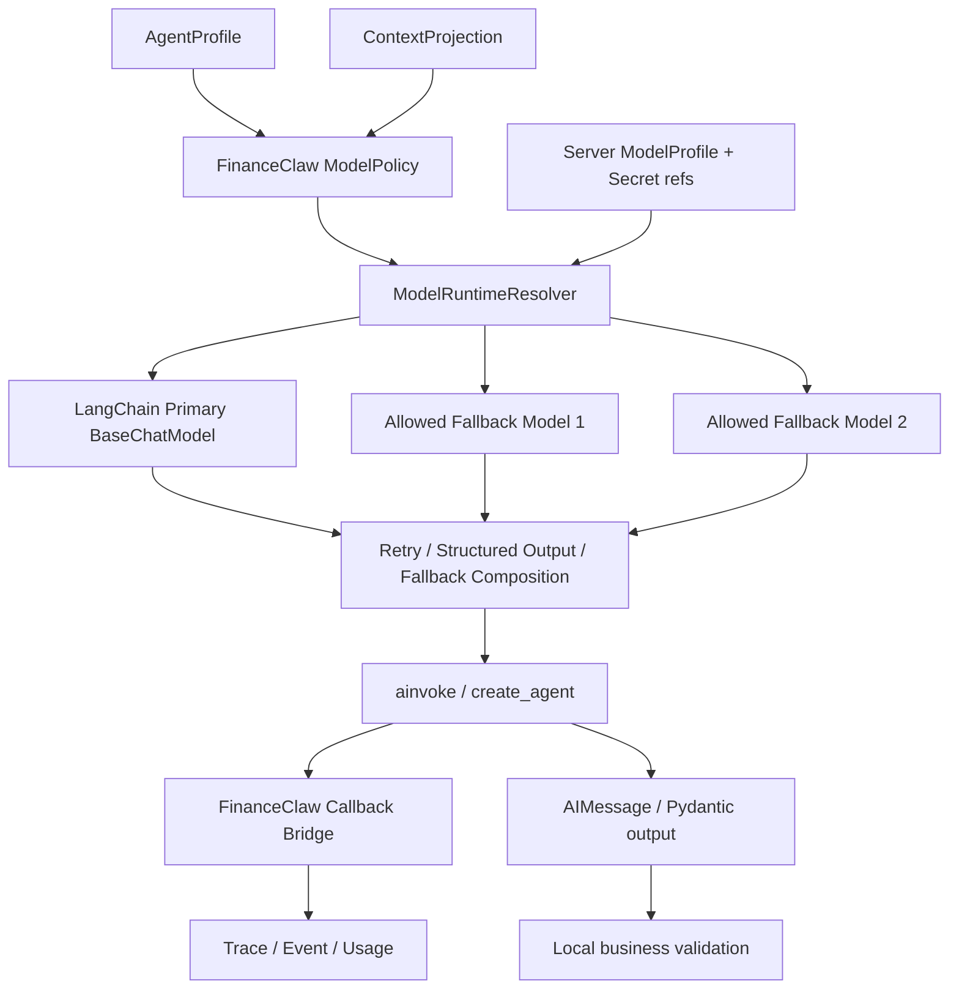

# ADR-P3-F-008：以 LangChain 作为模型运行时

> **状态**：ACCEPTED，旧运行时已删除，适配层待实现
> **日期**：2026-09-02
> **影响范围**：Model / Agent / Context / Policy / Trace / Provider Fabric
> **关联决议**：`FinanceClaw-顶层Agent与确定性Workflow-ADR讨论稿.md`
> **编排运行时**：`FinanceClaw-LangGraph编排运行时复用-ADR讨论稿.md`

> **实施记录（2026-09-02）**：`harness-model`、模型专用 Contract、OpenAI adapter、
> ModelGateway 及模型侧 Provider reservation/retry/fallback 已从 `main` 删除。LangChain 依赖
> 尚未加入；下一步先冻结薄 `ModelRuntime` Port、ModelProfile/Policy 与 callback bridge，
> 再选择最小 integration 包，避免清理提交与新框架接入混成一次不可审查的大改动。

## 1. 决议摘要

推荐停止继续自研通用大模型调用栈，将 LangChain 的 Chat Model/Runnable 体系确立为 FinanceClaw 默认模型运行时：

```text
FinanceClaw Agent / Internal Model Consumer
        ↓
Thin ModelRuntime Port
        ↓
LangChain BaseChatModel / Runnable
        ↓
langchain-openai / anthropic / google / aws / openrouter / ...
```

LangChain 负责：

- 各厂商与各类协议的模型 Adapter；
- OpenAI-compatible、Responses/Chat、Anthropic、Google、Bedrock、OpenRouter 等接入；
- 标准 Message、ToolCall、content block 和 usage 表示；
- `invoke / ainvoke / stream / astream / batch`；
- `bind_tools` 与模型原生 Tool Calling；
- `with_structured_output` 与 Provider-native / tool-based structured output；
- 普通网络重试、指数退避和 jitter；
- 按顺序跨模型 fallback；
- callback、listener、metadata、tag、rate limiter 等运行能力。

FinanceClaw 只保留：

- 服务端拥有的 `ModelProfile` 与凭证引用；
- tenant/user/purpose/sensitivity/region/egress Policy；
- Policy 过滤后的 primary/fallback 模型序列；
- Context 在模型出站前的最终投影与脱敏；
- Agent model-call 次数的 write-ahead 计数和 checkpoint；
- Deadline、取消、业务预算和并发限制；
- LangChain callback 到 FinanceClaw Trace/Event 的桥接；
- 极薄的稳定错误归一化和本地 Pydantic 最终校验。

不再让模型调用经过通用 Capability `ProviderExecutionCoordinator`。Provider Fabric 继续服务于 Tool/Agent/Workflow Capability，但模型由专门的 LangChain Model Runtime 管理。

若本 ADR 被接受，它将明确取代以下既有模型侧决议：

- ADR-P3-F-006 中 generation reservation 绑定授权上下文与 Provider incarnation 的要求；
- Stage 3A 中“ModelProvider 必须复用通用 Provider Fabric retry/fallback”的实现选择；
- Agent Foundation 中 prepared generation slot/receipt 作为模型恢复前提的要求。

被取代的只是模型调用部分。Capability WRITE fallback、Provider resume、idempotency、equivalence group 和执行 fencing 继续有效。

## 2. 为什么需要调整

当前 `harness-model` 已约 2772 行，其中：

| 文件 | 行数 | 主要职责 |
|---|---:|---|
| `gateway.py` | 1333 | 模型选择、retry/fallback、strict output、reservation、trace/event、结果校验 |
| `openai.py` | 511 | OpenAI Responses 请求、错误、usage、finish reason、structured output 映射 |
| 其余 model 文件 | 928 | Contract、SPI、schema、accounting、prepared generation、adapter、mock |

此外还复用约 716 行的通用 `ProviderExecutionCoordinator`。这套实现证明了相关语义，但继续扩展会遇到明显的重复建设：

- 每新增一个厂商都要重新实现协议参数、消息、ToolCall、stream、usage 和异常映射；
- 每种厂商的 native structured output 支持不同，需要维护 feature/prepare/validate 分支；
- SDK 自身、LangChain integration 和 FinanceClaw 可能形成多层 retry；
- fallback、callback、rate limit、batch、streaming 等通用能力要持续追赶生态；
- 模型新协议演进速度远高于 FinanceClaw 的领域治理代码。

这些不是 FinanceClaw 的金融 Agent 差异化能力，不值得继续作为自研内核维护。

## 3. LangChain 当前已经覆盖的能力

以下能力均已有官方接口：

| 能力 | LangChain 方案 | 说明 |
|---|---|---|
| 统一模型初始化 | [`init_chat_model`](https://docs.langchain.com/oss/python/langchain/models) | 通过统一接口加载主流 Provider integration，也支持 OpenAI-compatible base URL |
| 多 Provider | [Providers and models](https://docs.langchain.com/oss/python/concepts/providers-and-models) | Provider 独立 integration 包，共用 `BaseChatModel` |
| 同模型重试 | [`with_retry`](https://reference.langchain.com/python/langchain-core/runnables/base/Runnable/with_retry)、`max_retries` | 指数退避、jitter、指定异常和最大次数 |
| 跨模型降级 | [`with_fallbacks`](https://reference.langchain.com/python/langchain-core/runnables/base/Runnable/with_fallbacks) | 主 Runnable 失败后按顺序调用 fallback Runnable |
| Agent 模型重试 | [`ModelRetryMiddleware`](https://reference.langchain.com/python/langchain/agents/middleware/model_retry/ModelRetryMiddleware) | 支持 retry predicate、退避、jitter 和失败策略 |
| Agent 模型降级 | [`ModelFallbackMiddleware`](https://reference.langchain.com/python/langchain/agents/middleware/model_fallback/ModelFallbackMiddleware) | 在 Agent 每次模型调用处切换备用模型 |
| Tool Calling | [`bind_tools`](https://docs.langchain.com/oss/python/langchain/models) | 输出标准化 `AIMessage.tool_calls` |
| Structured Output | [`with_structured_output`](https://reference.langchain.com/python/langchain-core/language_models/chat_models/BaseChatModel/with_structured_output) | 支持 Pydantic、TypedDict、JSON Schema 和 raw+parsed 输出 |
| Agent Structured Output | [ProviderStrategy / ToolStrategy](https://docs.langchain.com/oss/python/langchain/structured-output) | 根据模型能力选择 Provider-native 或 Tool strategy |
| Streaming | [Streaming](https://docs.langchain.com/oss/python/langchain/streaming) | token、message、agent update 和 custom event 流 |
| Usage / Metadata | [Models](https://docs.langchain.com/oss/python/langchain/models) | `AIMessage.usage_metadata`、callback 和 invocation metadata |
| Rate Limit | [Models - Rate limiting](https://docs.langchain.com/oss/python/langchain/models) | 可注入共享的 `InMemoryRateLimiter` |
| Provider-specific 新能力 | [Chat model integrations](https://docs.langchain.com/oss/python/integrations/chat) | reasoning、multimodal、built-in tools、Responses API 等由 integration 跟进 |

因此“直接复用”不是降低标准，而是把通用兼容工作交还给维护这些协议的生态项目。

## 4. 复用边界

### 4.1 应删除或停止扩展的能力

| 当前能力 | 新方案 |
|---|---|
| `OpenAIResponsesModelProvider` 的 HTTP/SDK 参数映射 | 使用 `langchain-openai` 的 `ChatOpenAI` |
| 每个厂商单独实现 `ModelProvider` | 使用对应 LangChain integration |
| 自研模型 Message/ToolCall/content block 转换 | 内部直接使用 LangChain Message |
| `ModelGateway` 的普通 retry loop | 使用 integration retry、Runnable retry 或 ModelRetryMiddleware 中的一层 |
| `ModelGateway` 的跨模型 fallback loop | 使用 `with_fallbacks` 或 ModelFallbackMiddleware |
| `PreparedStructuredOutput` 的厂商 schema 编译 | 使用 `with_structured_output` / ProviderStrategy / ToolStrategy |
| 自研 provider feature 探测 | 使用 integration 能力与显式 ModelProfile；LangChain profile 仅作兼容提示 |
| 自研 usage/finish reason 全量协议映射 | 使用 `AIMessage.usage_metadata/response_metadata`，只归一化业务真正需要的字段 |
| 模型 Provider reservation/slot/incarnation fencing | 删除；模型调用不是业务 Action，不需要复刻 WRITE Capability fencing |
| Router/Planner 专用 `StructuredGenerationAdapter` | 随 LLMRouter/LLMPlanner 退出；Agent 内使用 LangChain ToolCall/structured output |

### 4.2 必须继续由 FinanceClaw 持有的能力

#### Model Profile

模型配置仍由服务端拥有，模型不能自行提供 endpoint、credential 或任意 fallback：

```python
class ModelProfile:
    profile_id: str
    primary: ModelEndpointRef
    fallbacks: tuple[ModelEndpointRef, ...]
    retry: ModelRetryConfig
    required_features: frozenset[str]
    data_classes_allowed: frozenset[str]
    region: str | None
```

`ModelEndpointRef` 只引用服务端 Secret 和 integration 配置，不把 key 放入 Context、State 或 Trace。

#### Model Policy

Policy 在构造 LangChain fallback 链之前完成：

```text
configured endpoints
  ∩ tenant authorization
  ∩ data sensitivity / egress policy
  ∩ region policy
  ∩ required model features
  ∩ runtime availability
= eligible ordered model chain
```

LangChain 只在这个已经授权的序列中执行 retry/fallback，不能自行发现或加入新的 Provider。

#### Context 出站边界

`ContextSnapshot / ContextProjection / PromptBuilder` 继续由 FinanceClaw 持有。LangChain 接收到的是已裁剪、已脱敏、可发送给当前模型序列的 Message，不参与决定哪些 Secret、Memory 或 Tool schema 可以出站。

#### Agent Action 执行权

LangChain 模型或 Agent 可以返回标准 ToolCall，但 ToolCall 只是草案。Tool Adapter 必须把调用转交：

```text
LangChain ToolCall
  → FinanceClaw Tool Adapter
  → ActionProposal / trusted invocation context
  → Policy
  → CapabilityInvoker
  → ResultEnvelope
  → ToolMessage / Observation
```

复用 LangChain 不会让模型绕过 FinanceClaw 的工具治理。

#### 可观测性

通过 LangChain callback/listener 和 Runnable config 接入：

```python
config = {
    "callbacks": [FinanceClawModelCallback(...)],
    "tags": [profile_id, purpose],
    "metadata": {"request_id": request_id, "agent_run_id": run_id},
}
```

FinanceClaw 只记录稳定字段：logical model profile、实际 integration/model、attempt/fallback ordinal、latency、usage、finish/error category 和 trace linkage。Provider 原始响应与 Secret 不进入 Event。

## 5. Retry 与 fallback 的准确分工

### 5.1 只保留一个 retry 层

不能同时启用：

```text
Provider SDK retry
+ LangChain integration max_retries
+ Runnable.with_retry
+ ModelRetryMiddleware
+ FinanceClaw ModelGateway retry
```

否则一次 Agent turn 的真实 outbound 数量不可预测。

推荐原则：

- Agent 调用使用 `ModelRetryMiddleware`，或明确使用 integration `max_retries`；二选一；
- standalone Runnable 使用 `with_retry`，底层 integration retry 设为 0；
- 删除 FinanceClaw 模型 retry loop；
- 在测试中断言一次逻辑调用对应的最大 outbound 次数。

Agent 同时组合 retry 与 fallback 时，必须按 LangChain 的
[middleware nesting](https://docs.langchain.com/oss/python/langchain/middleware/custom) 规则验证顺序：
fallback 应位于外层、retry 位于每次具体模型调用的内层；`ModelRetryMiddleware` 耗尽时必须配置
为重新抛出错误，而不是采用默认的“返回错误 AIMessage 后继续”，否则外层 fallback 不会被触发。

具体选择应以锁定版本的 integration 测试为准，而不是让每个 Provider 自由叠加默认值。

### 5.2 fallback 顺序由 FinanceClaw 决定，执行由 LangChain 完成

FinanceClaw 负责得到：

```text
[primary, fallback_1, fallback_2]
```

LangChain 负责按序尝试。第一阶段不再自研动态评分、自由健康选择或复杂 model equivalence group。只有出现真实运营证据后，才考虑在 `ModelRuntimeResolver` 前增加简单 health/circuit-breaker。

### 5.3 Model fallback 与 Capability fallback 不同

模型调用本身不会直接改变证券账户、数据库或外部业务状态，因此无需套用 WRITE Capability 的 idempotency/equivalence/fencing 规则。

模型调用失败后换模型的主要风险是：

- 新模型是否被授权看到同一份 Context；
- 是否支持相同 ToolCall/structured output/multimodal 特性；
- 输出质量、成本和 token window 是否可接受；
- crash 后重试产生额外费用和非确定输出。

这些风险由 ModelPolicy、Profile、budget 和 Agent checkpoint 处理，而不是复用通用 ProviderExecutionCoordinator。

### 5.4 异常与失败值

LangChain retry/fallback 以异常为主要控制信号。Model Adapter 不应先把异常吞掉并转换成 `GenerateResult.failure`，否则 fallback 无法触发。

推荐边界：

```text
LangChain/integration exception
  → retry/fallback composition
  → exhausted
  → FinanceClawModelErrorNormalizer
  → stable MODEL_CALL_FAILED / MODEL_OUTPUT_INVALID / MODEL_REFUSED
```

不再为每个 SDK 异常复制一套庞大的公共 ErrorCode。

## 6. Structured output 与 Tool Calling

### 6.1 Pydantic schema 作为唯一业务 schema

内部模型结构化输出直接传入 Pydantic 类型：

```python
structured = model.with_structured_output(
    ExplorationTurnDraft,
    include_raw=True,
)
```

LangChain 负责选择对应 Provider 的 native schema、function calling 或其他 integration 实现。FinanceClaw 在 parsed 结果进入可信状态前再执行一次 `model_validate` 和业务校验即可。

不再维护：

- 自定义 JSON Schema feature matrix；
- 每个 Provider 的 `prepare_structured_output`；
- schema hash 与 prepared payload 绑定；
- native schema 不支持时手工退到 JSON mode；
- 通用 JSON 文本解析与厂商 finish reason 映射。

### 6.2 顶层 Agent 优先使用标准 ToolCall

在顶层 Agent ADR 被接受后，模型的主要结构化决策不是 `PlanDraft`，甚至未必需要自定义 `ExplorationTurnDraft`。LangChain `create_agent` / `bind_tools` 已提供标准化 ToolCall：

```text
AIMessage.tool_calls[] = {name, args, id, type}
```

FinanceClaw 只需要把允许的 Capability 包装成受治理的 LangChain Tool，并控制每轮并发、side effect、approval 和返回 Observation。

是否完全用 `create_agent` 替换当前 ExplorationEngine，应单独做一个小型兼容验证；模型运行时复用不依赖该替换，可以先完成。

### 6.3 Model Profile 不能作为安全真相

LangChain model profile 可用于判断 context window、tool calling、structured output 和多模态支持，但官方把 profile 标记为仍可能变化的能力。因此：

- profile 可用于兼容性筛选和默认值；
- 安全/授权要求必须来自 FinanceClaw 的显式配置与 Policy；
- 版本升级时用 contract test 校验 profile 与实际模型行为。

## 7. 关于 model-call checkpoint 与 reservation

当前 prepared generation、reservation、slot receipt 和 Provider incarnation 主要用于冻结模型 Provider 与每次尝试。

对于顶层 ReAct，真正必须保持的顺序是：

```text
checkpoint model_calls + 1
  → invoke LangChain model runtime
  → validate ToolCall/structured response
  → checkpoint accepted decision
  → 才允许执行业务 Action
```

如果进程在模型 outbound 后、决策 checkpoint 前崩溃，恢复时可以再次调用模型；可能多花一次模型费用并得到不同草案，但不会重复执行业务 Action。业务副作用的 fencing 仍由 Action/Capability 层负责。

因此推荐删除模型专用 reservation/slot/incarnation 协议，保留：

- write-ahead model-call count；
- logical model call id；
- deadline/cancellation；
- usage accounting；
- 已接受 ActionProposal 的 checkpoint-before-execute。

若未来某个模型 Provider 支持可靠幂等键或 response continuation，可在对应 LangChain integration 配置中利用，不为所有模型预先建立通用 reservation 系统。

## 8. 目标组件



`ModelRuntimeResolver` 应是薄适配层，而不是新的 1000 行 Gateway。它只做配置解析、Policy 后的 model chain 构造、Runnable composition 和 callback 注入。

## 9. 包与 Contract 调整建议

### 9.1 保留

- `ModelProfile`、`ModelEndpointRef` 等服务端配置；
- 最小 `ModelRuntime` Protocol，隔离 LangChain 版本变化；
- `ModelCallContext`：request/run/tenant/purpose/deadline 引用；
- `ModelCallRecord`：选用模型、fallback ordinal、usage、latency、结果类别；
- 高层稳定错误：不可用、超时、输出无效、拒绝、策略拒绝；
- 测试用 FakeChatModel / scripted Runnable。

### 9.2 删除或降级为迁移代码

- `ModelProvider` SPI；
- `GenerateRequest / GenerateResult / ModelMessage / ModelOutput` 的内部平行协议；
- `ModelGateway` 的 Provider selection/retry/fallback；
- `OpenAIResponsesModelProvider`；
- `PreparedStructuredOutput / PreparedModelGeneration`；
- `ModelGenerationReservation / Receipt / Slot`；
- 模型专用 provider-incarnation fencing；
- `StructuredGenerationAdapter`；
- 仅为 LLMRouter/LLMPlanner 存在的模型调用测试。

外部公开 API 不应直接暴露 LangChain 类型；Agent 内部和 Model Runtime 内部可以直接使用，避免无意义的逐字段镜像。

## 10. 迁移顺序

### Phase 0：版本与兼容性 Spike

- 锁定一组明确版本，而不是使用无上界依赖；
- 验证当前 Python 3.14 环境和所需 integration 的兼容性；
- 至少验证 OpenAI + 一个非 OpenAI integration 或 FakeChatModel；
- 验证 async、stream、tool calling、Pydantic structured output、usage、timeout、retry、fallback；
- 明确每层默认 retry，确保只有一个重试源。

### Phase 1：引入薄 ModelRuntime

- 新建 `LangChainModelRuntime` 和 `FinanceClawModelCallback`；
- 使用现有 Agent turn schema 做适配，暂不改 ExplorationEngine；
- ModelPolicy 输出有序且已授权的 ModelEndpointRef；
- 与当前 ModelGateway 做 contract comparison，不做双 outbound shadow call。

### Phase 2：切换顶层 Agent 模型调用

- Exploration/Agent 的模型调用改为 LangChain Runtime；
- 使用 Pydantic structured output 或标准 ToolCall；
- 删除 Agent 路径对 prepared generation/reservation 的依赖；
- 保留 model-call write-ahead count 和 accepted-action checkpoint。

### Phase 3：删除旧 ModelGateway 主链路

- Composition Root 不再创建 `ModelGateway`；
- 移除 OpenAI 专用 Provider 与模型 Provider Registry；
- 删除重复 retry/fallback/schema/accounting 代码；
- Generic Provider Fabric 只保留 Capability 执行用途。

### Phase 4：评估 LangChain Agent Runtime

- 用受治理 Tool Adapter 做小型 `create_agent` 原型；
- 对比当前 ExplorationEngine 的 checkpoint、单 Action、Policy、Observation 和恢复语义；
- 只有兼容测试通过后才替换 ReAct loop；模型运行时复用不等待本阶段。

## 11. 验收条件

### 功能

- 同一 Agent 代码可以通过 ModelProfile 切换至少两个 Provider integration；
- ToolCall、Pydantic structured output、streaming 和 usage 均使用 LangChain 标准接口；
- primary transient failure 可按配置 retry，耗尽后进入授权 fallback；
- schema/authorization 错误不会触发未授权 Provider；
- fallback 模型不满足 required features 时在 outbound 前被排除。

### 治理

- Credential 不进入 Context、State、Event 或模型输出；
- Context sensitivity/region/egress Policy 在构造 fallback 链前完成；
- LangChain Tool 只能通过 CapabilityInvoker 执行业务能力；
- accepted Action 之前没有业务副作用；
- 保留 request/run/tenant/trace 关联和 usage 观测。

### 简化

- 默认模型调用不再经过 `ProviderExecutionCoordinator`；
- 不存在 FinanceClaw、LangChain、Provider SDK 三层叠加 retry；
- 不再为新模型厂商编写完整 ModelProvider；
- `harness-model` 收敛为薄 Runtime/Policy bridge，而不是并行模型框架；
- 删除代码量显著大于新增桥接代码量。

## 12. 风险与控制

| 风险 | 控制 |
|---|---|
| LangChain API 演进较快 | 精确锁版本；只经薄 ModelRuntime Port 接入；升级必须跑 integration contract tests |
| Provider integration 行为不完全一致 | 使用 Pydantic 最终校验和按 Provider 的兼容测试；必要时传 integration-specific 配置 |
| fallback 到未授权区域或厂商 | fallback chain 必须由 FinanceClaw Policy 预先过滤，禁止 Runtime 自由发现 |
| 多层默认 retry 导致 outbound 爆炸 | 一个逻辑调用只允许一个 retry owner，并以故障注入测试真实调用次数 |
| LangChain profile 数据不准确 | profile 仅作能力提示；授权与数据策略使用显式 FinanceClaw 配置 |
| 框架异常类型泄漏到公共 API | 最外层只做少量稳定错误归一化，保留 sanitized cause category |
| 失去当前 reservation 的严格尝试槽位 | 模型调用保留 write-ahead count；业务 Action 继续 checkpoint-before-execute 和 fencing |

## 13. 推荐结论

推荐接受本 ADR。

FinanceClaw 不需要成为另一个模型兼容框架。LangChain 已经在统一模型协议、Provider integration、ToolCall、structured output、retry、fallback、streaming 和 callback 上投入了远高于单个项目可持续承担的维护成本。

合理的分工应是：

```text
LangChain 负责“如何可靠地调用不同模型”
FinanceClaw 负责“哪些模型可以看到什么、Agent 可以调用什么、结果如何进入可信状态”
```

这会直接释放工程投入，让后续真正集中在 Agent 的核心记忆、上下文、工具管理、工具调用治理和金融场景评测上。
