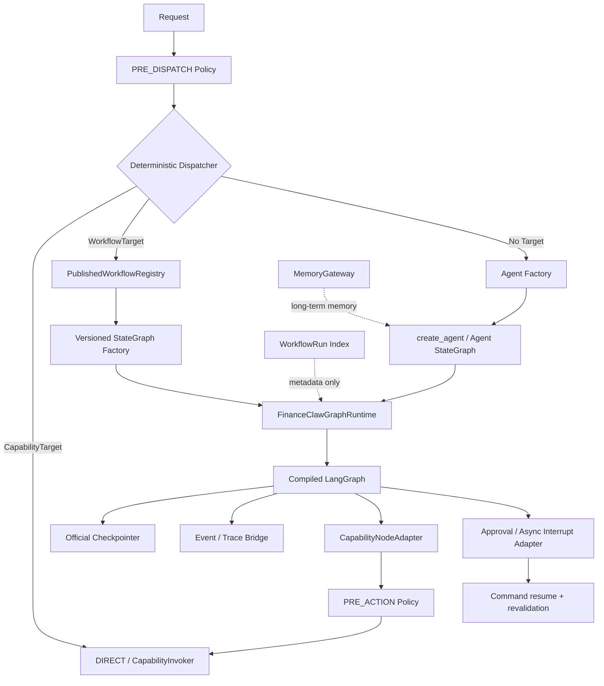

# ADR-P3-F-009：以 LangGraph 作为统一编排运行时

> **状态**：ACCEPTED，旧运行时已删除，适配层待实现
> **日期**：2026-09-02
> **影响范围**：Agent / Workflow / Planning / Execution / State / Approval / Events / Policy
> **关联决议**：`FinanceClaw-顶层Agent与确定性Workflow-ADR讨论稿.md`
> **模型运行时**：`FinanceClaw-LangChain模型运行时复用-ADR讨论稿.md`

> **实施记录（2026-09-02）**：仓库与调用方检查未发现需要排空或迁移的生产 checkpoint，
> 因此直接执行了本 ADR 的最终删除态：Planning、Execution、State、Plan Contract 及自研
> Exploration runtime 已从 `main` 删除。本地历史分支保留删除前代码。LangGraph 依赖尚未
> 加入；下一步通过兼容性 spike 决定 Python 版本、checkpointer 和最小 Adapter 形态。

## 1. 决议摘要

推荐将 LangGraph 确立为 FinanceClaw 的统一 Agent/Workflow 编排运行时，停止继续维护通用 DAG
执行内核：

```text
开放任务 AGENT
  → LangChain create_agent / 定制 StateGraph
  → LangGraph Runtime

固定任务 WORKFLOW
  → 已发布、版本化的 StateGraph factory
  → LangGraph Runtime
```

具体决议如下：

1. 新 Workflow 默认由服务端代码定义为版本化 `StateGraph`，不再先转换为
   `PlanTemplate → ExecutionPlan`；
2. 不再扩展自研 `PlanValidator / BasicScheduler / ExecutionEngine / ResumeCoordinator /
   PlanExecutionState / StateStore` 这一套通用图运行时；
3. LangGraph 负责图编译、节点调度、条件路由、并行、retry、checkpoint、resume、interrupt、
   subgraph 和运行事件；
4. FinanceClaw 保留 Workflow Registry、Policy、CapabilityInvoker、Context/Memory、租户身份、
   Secret、稳定 Result/Error/Event 和金融业务幂等语义；
5. Policy 不实现成一个可被图绕过的普通分支，而应固定在 Workflow 入口和
   `CapabilityNodeAdapter → CapabilityInvoker` 的执行边界；
6. 若存在生产存量执行，则旧 Plan 引擎只服务其排空；本仓库经检查没有此类执行，故已直接
   删除，且没有迁移或双写 checkpoint；
7. 只有出现“非代码方式创建 Workflow”的真实需求后，才考虑增加一个很薄的声明式 Spec
   编译器；它只能编译到 LangGraph，不能重新拥有 Scheduler、checkpoint 或 recovery。

因此，对当前问题的直接回答是：

> **不需要继续构建这么复杂的自研 DAG。LangGraph 可以承接绝大多数通用运行机制；
> FinanceClaw 应做的是治理适配，而不是再维护一个并行工作流内核。**

但“适配一下”不等于让 LangGraph 接管授权。LangGraph 是执行机制，不是 FinanceClaw 的安全边界。

## 2. 当前自研内核的真实成本

当前与 Plan/DAG 直接相关的核心代码约 7,800 行，尚未计算测试：

| 区域 | 代码行数 | 主要职责 |
|---|---:|---|
| Plan/Execution/Approval/Persistence Contract | 740 | Node、Edge、Binding、Condition、Retry、Budget、运行状态与持久化记录 |
| Planning | 2,609 | PlanDraft、模板、物化、identity、repair 与全图校验 |
| Execution | 4,113 | 调度、并行、条件、retry、审批、异步等待、取消、恢复、事件 |
| State | 327 | 内存与 SQLite 执行状态存储 |
| **合计** | **7,789** | 一套完整的工作流运行时 |

其中几个最重的文件已经说明复杂度集中在哪里：

| 文件 | 行数 |
|---|---:|
| `harness_execution/engine.py` | 1,167 |
| `harness_execution/scheduler.py` | 844 |
| `harness_planning/validator.py` | 760 |
| `harness_execution/recovery.py` | 757 |
| `harness_planning/llm.py` | 736 |

这套实现不是“薄 Plan Adapter”，而是在重复建设图运行时。它还会继续扩张，因为每增加一种
超时、恢复、并发、子图、人工介入、事件或图版本语义，都必须同时修改 Contract、Validator、
Scheduler、StateStore、Recovery 和测试。

更重要的是，这部分复杂度与 FinanceClaw 希望投入的记忆、上下文、工具管理和工具调用并不重合。

## 3. LangGraph 已经覆盖的能力

以下能力均有 LangGraph 官方实现：

| 当前自研能力 | LangGraph 对应能力 | 说明 |
|---|---|---|
| Node / Edge | [`StateGraph`](https://docs.langchain.com/oss/python/langgraph/graph-api) | Node 读取 State 并返回增量，Edge 表达控制流 |
| 条件分支 | `add_conditional_edges` / `Command(goto=...)` | 可按可信代码中的状态选择下一节点 |
| 并行与 Join | 多出边、state reducer、fan-out/fan-in | 同一 superstep 中并行，后继可等待并行分支 |
| 动态 Map/Reduce | `Send` | 运行时按输入数量动态创建并行任务 |
| 并发限制 | Runnable config `max_concurrency` | 运行时限制并发任务数 |
| Retry | [`RetryPolicy`](https://reference.langchain.com/python/langgraph/types/RetryPolicy) | 按异常类型、次数、指数退避和 jitter 重试节点 |
| 图结构检查 | `StateGraph.compile()` | 编译时做基础结构校验，例如孤立节点 |
| 循环保护 | `recursion_limit` | LangGraph 允许有意循环，并对最大 superstep 做限制 |
| Checkpoint | [Persistence / Checkpointer](https://docs.langchain.com/oss/python/langgraph/persistence) | 每个 superstep 保存状态，按 thread 组织 |
| 故障恢复 | checkpoint + pending writes | 失败 superstep 中已成功的并行节点可避免重复运行 |
| 状态查询/历史 | `get_state` / `get_state_history` | 读取当前 checkpoint 与历史状态 |
| 人工审批 | [`interrupt`](https://docs.langchain.com/oss/python/langgraph/interrupts) | 持久化暂停并返回 JSON-safe 审批请求 |
| 恢复 | `Command(resume=...)` | 使用同一 `thread_id` 恢复中断节点 |
| 子工作流 | [Subgraphs](https://docs.langchain.com/oss/python/langgraph/use-subgraphs) | 支持继承、独立或关闭子图 checkpoint |
| 状态/任务事件 | [`stream/astream`](https://docs.langchain.com/oss/python/langgraph/streaming) | updates、values、tasks、checkpoints、messages、custom |
| Graph 变更 | [Graph migrations](https://docs.langchain.com/oss/python/langgraph/graph-api#graph-migrations) | 对已完成或中断 thread 提供有约束的拓扑/State 演进 |
| Durable side effect | [`task` 与幂等指导](https://docs.langchain.com/oss/python/langgraph/graph-api#re-execution-and-idempotency) | 记录 task 结果；失败边界仍要求业务调用可幂等 |

LangGraph 甚至比当前 `ExecutionPlan` 更通用：它不只执行 DAG，也支持有退出条件的循环、动态
fan-out、子图和 Agent loop。FinanceClaw 如果继续只补自己的静态 DAG，长期仍会追赶这些能力。

需要注意：LangGraph 1.2 的 per-node timeout 和 node error handler 在官方文档中仍标为 alpha。
首版迁移不能把关键金融语义建立在未验证的 alpha API 上；Deadline 继续由 FinanceClaw 入口和
CapabilityInvoker 强制，稳定后再评估下沉。这个局部差异不构成保留整套 Scheduler 的理由。

## 4. LangGraph 不应接管的能力

LangGraph 不提供，也不应该被要求提供以下 FinanceClaw 领域边界：

| FinanceClaw 能力 | 为什么必须保留 |
|---|---|
| tenant/session/subject 身份 | `thread_id` 只是恢复游标，不是已授权租户身份 |
| Workflow 发布、版本与禁用 | 图运行时不等于产品 Registry 和变更审批 |
| PRE_DISPATCH / PRE_WORKFLOW Policy | 决定某个主体能否启动特定 Workflow |
| PRE_ACTION Policy | 决定某个 Capability 调用能否真正执行 |
| Capability Catalog / Invoker | 统一 Provider 选择、幂等、回执和工具错误 |
| Secret 与 egress 控制 | Secret 不能进入 graph state、interrupt、trace 或模型上下文 |
| 稳定 ResultEnvelope / ErrorCode | 外部调用方不能绑定 LangGraph 内部异常和 State 结构 |
| 金融写操作幂等与 fencing | checkpoint 不能证明外部业务副作用只发生一次 |
| Context/Memory 治理 | checkpoint 是运行短期状态，不是长期记忆真相 |
| 审计与业务事件 | 必须产生稳定、脱敏、可长期兼容的 FinanceClaw 事件 |

特别需要坚持：

> `conditional_edges` 可以表达业务分支，但不能成为授权判断的唯一位置。

图定义、状态或模型输出出现错误时，真正的 Capability 仍必须在 `CapabilityInvoker` 内再次进行
Policy 和执行约束检查。这样即使 Workflow compiler 或第三方节点存在缺陷，也无法获得额外执行权。

LangGraph 官方还明确说明，private state schema 只限制节点输入/最终输出，并不会自动从完整 state
stream 中脱敏。因此 State schema 不是安全边界：Secret 和不可观测敏感值原则上不得写入 graph
state，Event Bridge 也必须显式选择允许输出的 channel。

## 5. 目标架构



### 5.1 `FinanceClawGraphRuntime` 必须很薄

建议它只提供以下职责：

```python
class WorkflowRuntime(Protocol):
    async def start(self, workflow_ref, request, context) -> ResultEnvelope: ...
    async def resume(self, run_id, resume_input, context) -> ResultEnvelope: ...
    async def inspect(self, run_id, context) -> WorkflowRunView: ...
    async def cancel(self, run_id, context) -> bool: ...
```

内部实现负责：

- 将可信 `workflow_run_id` 映射为 LangGraph `thread_id`；
- 从 Registry 解析固定 `workflow_id + version + definition_hash`；
- 注入 FinanceClaw runtime context、callbacks 和授权后的依赖；
- 调用 `ainvoke/astream`、读取 interrupt、转换最终结果；
- 把 LangGraph 事件映射成稳定 FinanceClaw Event；
- 把框架异常归一化成少量稳定错误。

它不应重新实现 ready queue、edge activation、retry loop、checkpoint snapshot 或 recovery loop。

### 5.2 Node Adapter

第一阶段只提供少量可信节点类型：

```text
PureNode            纯状态转换或条件计算
CapabilityNode      Policy → CapabilityInvoker → ResultEnvelope → bounded state update
ApprovalNode        interrupt(safe approval payload)
AsyncCapabilityNode Accepted → interrupt; callback → Command(resume=completion)
SubworkflowNode     调用已发布、版本固定的子图
AgentNode           显式调用受控 Agent graph（仅确有固定流程嵌套需求时）
```

`CapabilityNode` 是关键安全边界。Workflow 作者不能获得 Registry、Provider、SecretStore 或底层
连接，只能引用发布时允许的 Capability ID。即便节点自身捕获失败并路由到补偿分支，也不能绕过
Invoker。

现有 `EdgeTrigger.SUCCESS/FAILED/DENIED/COMPLETED/ALWAYS` 不需要继续作为通用图协议复制。对可预期
业务失败，Capability Adapter 把受限的 `ResultEnvelope` 状态写入 typed State，由可信 conditional
edge/`Command` 选择补偿或结束；对不可恢复框架错误则让 run 失败。每个已发布 Workflow 显式表达
自己的错误路径，不再依赖一组试图覆盖所有流程的全局 `FailurePolicy` DSL。

### 5.3 Checkpoint、Run Index 与 Memory 分离

目标状态只保留一个 Workflow 执行真相：LangGraph checkpointer。

```text
LangGraph Checkpointer  = 当前图状态、next task、interrupt、checkpoint history
WorkflowRun Index       = run_id、tenant、workflow/version、外部状态、创建/更新时间
FinanceClaw Memory      = 跨 run 的长期事实、偏好和可检索知识
Business/Audit Store    = 不可由 checkpoint 回滚的外部事实与审计
```

不得同时把完整 `PlanExecutionState` 写入 FinanceClaw StateStore，再把同一状态写入 LangGraph
checkpointer。双真相会引入原子性、恢复顺序和漂移问题。

开发环境可使用官方 `AsyncSqliteSaver`；生产环境优先验证 `AsyncPostgresSaver`。如果 FinanceClaw
已有数据库约束，可以实现官方 `BaseCheckpointSaver` SPI，但不应重新定义 checkpoint 协议。

## 6. Workflow 定义方式

### 6.1 第一阶段：代码定义、Registry 发布

默认不再创建通用 JSON DAG DSL。每个固定 Workflow 由受审查的 factory 构建：

```python
@published_workflow(
    workflow_id="portfolio.daily-risk",
    version=3,
    input_schema=DailyRiskInput,
    output_schema=DailyRiskOutput,
)
def build_daily_risk(runtime: WorkflowBuildContext) -> StateGraph:
    graph = StateGraph(DailyRiskState, context_schema=FinanceClawRuntimeContext)
    # add trusted nodes and edges
    return graph
```

Registry 保存的是产品级 descriptor：

```text
workflow_id / version / definition_hash
input_schema / output_schema
required capabilities / policy tags
owner / lifecycle status / compatibility metadata
graph factory reference
```

这已经满足固定 Workflow 的版本、审计、测试和发布要求，又不会复制一份 LangGraph IR。

### 6.2 何时才需要声明式 Spec

只有以下需求真实出现时，才增加 `WorkflowDefinition → LangGraphCompiler`：

- 管理台可视化编排；
- 非 Python 团队维护流程；
- Workflow 需要作为配置独立发布；
- 外部系统通过受控协议提交流程定义。

即便引入，Spec 也只描述受限节点、边和入口输出；校验器只负责安全引用、schema、发布规则和
允许的节点类型。执行、retry、checkpoint、interrupt 和 resume 全部交给 LangGraph。

普通用户或 Agent 仍不能在一次对话中动态生成 Spec 并立即以可信 Workflow 执行。

## 7. Policy 与审批的准确落点

### 7.1 Policy 分层

```text
PRE_DISPATCH
  → 能否进入 DIRECT / WORKFLOW / AGENT

PRE_WORKFLOW
  → 能否启动 workflow_id + version
  → 允许的输入范围、运行预算和 capability scope

PRE_ACTION
  → 每次 Capability 调用前重新判断
  → 写操作、egress、敏感数据、账户范围和幂等条件

POST_ACTION / OBSERVATION
  → 输出脱敏、Context 可见性、Memory 写入资格
```

Workflow 入口授权不能替代 Action 授权，因为长时间运行后主体权限、市场状态、账户状态或 Policy
版本可能已经变化。

### 7.2 Approval 适配

LangGraph 的 `interrupt()` 正好承接当前 WAITING/Resume 机制，但需要补充 FinanceClaw 约束：

- interrupt payload 只包含 JSON-safe、脱敏、可展示字段；
- 不把 Secret、原始 Provider response 或完整敏感 Context 写入 checkpoint；
- `Command(resume=...)` 的提交者必须重新认证并校验 tenant/run/approval identity；
- resume 后重新执行 PRE_ACTION Policy；旧审批不能永久授权未来变化后的 Action；
- `interrupt()` 所在节点恢复时会从节点开头重跑，因此 interrupt 前的副作用必须幂等或移到独立
  task/node。

### 7.3 异步 Capability

外部 Capability 返回 `ACCEPTED` 时，可以把 continuation 保存为受控 interrupt payload 的引用，
由 callback handler 在验证 provider receipt、tenant、run 和 node identity 后提交
`Command(resume=completion)`。

LangGraph 提供暂停和恢复机制；FinanceClaw 仍负责 callback 鉴权、业务 receipt、去重和完成结果
校验。这是一层适配，不需要保留自研 DAG Scheduler。

## 8. 现有组件去留

| 当前组件 | 建议 | 目标定位 |
|---|---|---|
| `LLMPlanner / PlanDraft / repair` | 删除 | 不再让模型生成可执行 DAG |
| `StaticPlanner` | 替换 | `PublishedWorkflowRegistry` |
| `PlanTemplate / ExecutionPlan` | legacy 后删除 | 不作为新 Workflow 的中间 IR |
| `PlanNode / PlanEdge / ConditionExpr` | legacy 后删除 | 新图直接使用 StateGraph/Python route |
| `InputBinding / OutputBinding` | 不再通用化 | 由 typed State 和节点函数显式转换 |
| `PlanValidator` | 删除通用校验 | 使用 Pydantic schema、Registry 发布校验和 `StateGraph.compile()` |
| `BasicScheduler` | 删除 | LangGraph runtime |
| `ExecutionEngine` | 替换 | 薄 `FinanceClawGraphRuntime` |
| `ResumeCoordinator` | 删除 | checkpointer + `Command(resume=...)` |
| `ApprovalCoordinator` | 替换 | `ApprovalNodeAdapter + interrupt` |
| `AsyncWaitingCoordinator` | 替换 | `AsyncCapabilityNodeAdapter + callback resume` |
| `PlanExecutionState` | 删除 | typed graph State + `StateSnapshot` |
| `StateStore` 的 Plan 快照职责 | 删除 | 官方 checkpointer；另保留薄 Run Index |
| `CancellationSignal` | 收敛 | 请求取消、graph stream abort 或部署运行时 cancel 的适配 |
| `ExecutionEventEmitter` | 收敛 | LangGraph callback/stream → FinanceClaw Event bridge |
| `CapabilityInvoker` | **保留** | 所有真实工具执行的唯一入口 |
| `PolicyEngine` | **保留** | 图入口和 Action 的授权边界 |
| `ResultEnvelope / ErrorCode` | **保留** | 对外稳定协议与节点结果边界 |
| `Context / Memory` | **保留并重点投入** | Agent 核心差异化能力，不与 checkpoint 混用 |

删除对象必须先完成调用方清单与存量执行检查。本次检查没有发现现有运行数据，且删除前已创建
本地历史分支，因此可以直接收敛；未来仍不得以迁移为名破坏 LangGraph 中的运行数据。

## 9. 必须通过 Spike 验证的差异

引入依赖前先用锁定版本做一组最小运行时 Spike。至少验证：

1. 串行、条件分支、并行 fan-out/fan-in 与稳定结果归并；
2. `max_concurrency` 是否按预期限制真实 Capability outbound；
3. retry 只发生在一个层级，WRITE 节点不会因图恢复重复副作用；
4. 并行 superstep 部分成功、部分失败后的 pending writes 与 resume；
5. explicit approval interrupt、拒绝、过期和 resume 后 Policy 重验；
6. `ACCEPTED` callback 到 `Command(resume)` 的去重与身份校验；
7. 进程在 node 前、outbound 后、checkpoint 前后崩溃的行为；
8. 请求取消、运行取消、Deadline 与再次恢复；
9. subgraph checkpoint namespace、并行调用隔离和状态检查；
10. callbacks/stream 是否能稳定映射现有 Trace/Event；
11. 图版本升级时对 in-flight interrupt 和 State schema 的兼容；
12. Python 3.14.3 下 LangGraph、checkpointer 和数据库 driver 的完整兼容性。

截至 2026-09-02，PyPI 的 LangGraph 1.2.11 元数据要求 Python `>=3.10`，但官方 classifiers 只明确
列到 Python 3.13；FinanceClaw 当前固定为 Python `>=3.14.3,<3.15`。因此不能只看纯 Python wheel
就宣称兼容，必须用真实依赖解析、导入、async checkpoint 和测试矩阵确认。

如果某项 FinanceClaw 语义无法直接映射，优先把它实现为独立 Node Adapter、Invoker 约束或 Run
Coordinator 逻辑；只有出现无法隔离且无法接受的运行时缺口，才重新评估框架，而不是立刻恢复
通用 Scheduler。

## 10. 迁移顺序

### Phase 0：Runtime Spike

- 锁定 LangChain/LangGraph/checkpointer 版本；
- 完成第 9 节的最小验证矩阵；
- 写出当前语义到 LangGraph 语义的差异报告；
- 暂不修改现有默认运行路径，也不迁移 checkpoint。

### Phase 1：引入薄 Graph Runtime

- 增加 `PublishedWorkflowRegistry`、`FinanceClawGraphRuntime`；
- 实现 Capability、Approval、Async、Event 四类核心 Adapter；
- 用一个只读固定 Workflow 做端到端试点；
- 对同一测试输入比较旧引擎与新图结果，但绝不让带副作用的 Workflow 双执行。

### Phase 2：新 Workflow 只使用 LangGraph

- 新 Workflow 直接注册版本化 StateGraph factory；
- Agent 将已发布 Workflow 视为原子 Tool；
- 不再给 Plan Contract、Validator、Scheduler 增加新特性；
- 使用官方 SQLite/Postgres checkpointer，不写第二份 PlanExecutionState。

### Phase 3：Agent 运行时统一

- 顶层 AGENT 使用受治理的 LangChain `create_agent` 或定制 StateGraph；
- Agent Tool Adapter 继续进入 CapabilityInvoker；
- Agent short-term state 使用 LangGraph checkpointer；
- FinanceClaw MemoryGateway 继续承担长期记忆和写入治理。

### Phase 4：排空并删除旧 Plan 内核

- 已创建 Plan 按原 revision 和旧 StateStore 运行到终态；
- 不把旧 checkpoint 翻译为新 LangGraph checkpoint；
- 调用和存量 run 均为零后，删除 LLMPlanner、Plan IR、Validator、Scheduler、ExecutionEngine、
  Recovery 和 Plan StateStore；
- 保留必要的历史数据读取/审计工具，不再允许启动旧 Plan。

## 11. 验收条件

- DIRECT、WORKFLOW、AGENT 的顶层分派仍为确定性，不增加 LLM Router；
- 固定 Workflow 不经过模型生成 Plan；
- 新 Workflow 的图执行只由 LangGraph runtime 负责；
- 真实 Capability 调用 100% 经过 CapabilityInvoker 和 PRE_ACTION Policy；
- LangGraph graph state、interrupt 和 trace 中不出现 Secret；
- checkpoint 是唯一执行状态真相，Run Index 不复制完整 State；
- approval、async callback、crash recovery、retry、cancel 和 policy deny 有端到端测试；
- WRITE 节点有稳定幂等键或明确 fail-closed，不以 checkpoint 代替业务幂等；
- Agent checkpoint 与长期 Memory 明确分离；
- 锁定依赖版本并通过 Python 3.14.3 兼容测试；
- 新需求默认通过 Node Adapter 或已有 LangGraph primitive 实现，不再扩展自研 Scheduler。

## 12. 与现有 ADR 的关系

本 ADR 若接受：

- 保留 ADR-P3-F-007 的 `DIRECT / WORKFLOW / AGENT`、无 LLM Router、无 LLM PlanDraft 决议；
- **取代** ADR-P3-F-007 中“保留 PlanTemplate / ExecutionPlan / PlanValidator / ExecutionEngine
  作为固定 Workflow 内核”的建议；
- 与 ADR-P3-F-008 互补：LangChain 负责模型运行时，LangGraph 负责 Agent/Workflow 编排运行时；
- 不改变 CapabilityInvoker、Provider Fabric、WRITE 幂等/fallback、Policy、Context、Memory 和
  ResultEnvelope 的领域边界；
- 将 Stage 2/3 中自研 Plan Runtime 的描述降为 legacy implementation，而不是后续目标架构。

## 13. 推荐结论

推荐接受。FinanceClaw 不应因为已经投入大量代码，就继续把自研 DAG 变成长期包袱。

更合适的分工是：

```text
LangChain  = 模型协议与统一调用
LangGraph  = Agent / Workflow 的通用状态机和 durable execution
FinanceClaw = 记忆、上下文、工具目录、Policy、调用治理、金融幂等和稳定产品协议
```

这不是削弱 FinanceClaw，而是把差异化边界从“如何调度一张图”移动到“这张图在什么身份、上下文、
权限、数据和业务副作用约束下运行”。后者才是 FinanceClaw 应长期掌握的核心。
