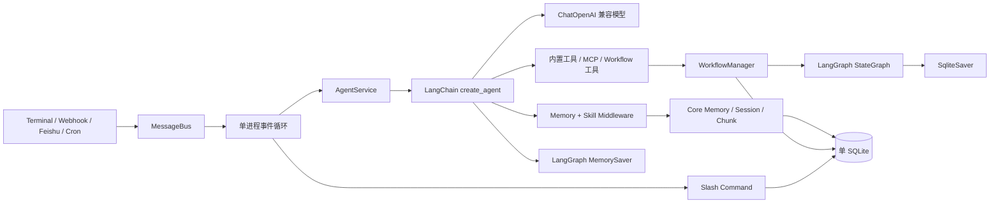
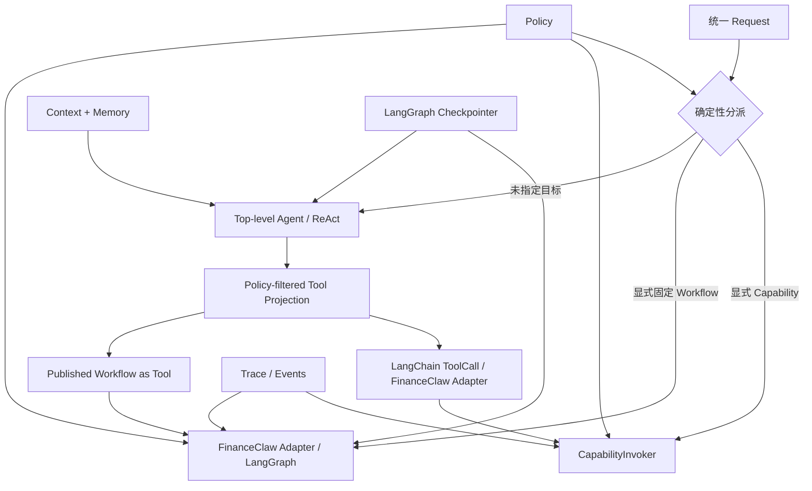

# FinanceClaw 对 LemonClaw 的架构对齐分析

> **文档状态**：参考基线，供后续架构决策使用
> **分析日期**：2026-09-02
> **LemonClaw 快照**：[`941a386`](https://github.com/nl8590687/lemonclaw/tree/941a386458c8395246796ec8d50b95bbe347ede1)
> **结论先行**：FinanceClaw 应对齐 LemonClaw 的产品形态和 Agent-first 主路径，但不照搬其运行内核；优先复用成熟开源框架与 FinanceClaw 已有 Harness 基础，把自研重心收敛到 Agent 的记忆、上下文、工具治理和调用闭环。

## 1. 总体判断

LemonClaw 的核心价值不在于发明了新的 Agent 算法，而在于用很薄的一层产品代码，把成熟组件快速拼成一个完整的“数字员工”产品：

- LangChain 提供主 Agent、消息、工具和模型适配；
- LangGraph 提供图执行、checkpoint、interrupt 和工作流恢复；
- SQLite 承担配置、记忆、Workflow 定义及 checkpoint 的本地持久化；
- 项目自身集中实现通道、记忆、Skill、MCP、Cron、Workflow spec 和交互命令。

这种方式非常适合快速形成可使用的 Agent 产品。FinanceClaw 应学习它的“薄编排、重生态、Agent-first”思路，但必须继续保留自身已经建立的权限、策略、执行身份、Provider、状态、追踪和错误协议边界。

一句话概括两者的合适关系：

> LemonClaw 可以作为 FinanceClaw 的产品形态参照和生态复用样板；FinanceClaw 保留的领域治理核心应继续作为可信执行边界。

## 2. LemonClaw 的整体结构



主链路很短：所有外部事件进入同一个消息总线，由 `AgentService` 交给 LangChain `create_agent`；模型在 ReAct 循环中直接选择工具。Workflow、MCP、记忆和 Skill 最终都被投影为主 Agent 可以使用的上下文或工具。

## 3. 各模块的设计与实现方案

### 3.1 输入通道与消息总线

相关代码：[`channels/`](https://github.com/nl8590687/lemonclaw/tree/941a386458c8395246796ec8d50b95bbe347ede1/channels)、[`loop.py`](https://github.com/nl8590687/lemonclaw/blob/941a386458c8395246796ec8d50b95bbe347ede1/loop.py)

设计方案：

- Terminal、Webhook、飞书和 Cron 各自作为输入设备运行；
- 输入统一转换成 `EventMessage`，写入进程内优先级队列；
- 一个主循环串行消费事件；
- 斜杠命令走 `command.py`，普通消息直接进入主 Agent；
- 输出通道根据来源选择 Terminal 或飞书等实现。

优点是通道扩展成本低，业务处理与接入协议解耦。限制是总线、AgentService 和默认会话均为进程级单例形态，更适合单用户本地部署，不适合作为 FinanceClaw 的租户、会话和并发隔离模型。

FinanceClaw 可复用“Channel Adapter → 统一 Request”的产品结构，但不能复用全局消息总线和全局 Agent 实例作为可信边界。

### 3.2 顶层 Agent 与 ReAct 循环

相关代码：[`agent/agent.py`](https://github.com/nl8590687/lemonclaw/blob/941a386458c8395246796ec8d50b95bbe347ede1/agent/agent.py)

设计方案：

- 通过 LangChain `create_agent(...)` 创建主 Agent；
- 传入模型、全量工具、系统提示、中间件和 LangGraph checkpointer；
- 每个用户请求只追加一条 `HumanMessage`；
- 由框架完成“模型生成工具调用 → 执行工具 → 追加观察 → 再次生成”的循环；
- `recursion_limit` 由 `AGENT_REACT_MAX_ITERATIONS` 派生；
- 主 Agent 的工作记忆使用 `MemorySaver`。

这正是 LemonClaw 能快速形成完整能力的关键：它没有自研通用 ReAct 调度器，而是把主循环、消息归并和工具调用协议交给 LangChain/LangGraph。

FinanceClaw 应采纳“ReAct 是无显式目标请求的主路径”这一层产品设计，但不应让框架原生 ToolNode 绕过 `CapabilityInvoker`、Policy、Trace、State 和错误协议。即使以后内部接入 LangGraph，也必须位于 FinanceClaw Adapter 之后，而不是成为新的授权边界。

### 3.3 模型适配

相关代码：[`agent/llm/openai.py`](https://github.com/nl8590687/lemonclaw/blob/941a386458c8395246796ec8d50b95bbe347ede1/agent/llm/openai.py)

设计方案：

- 使用 `langchain-openai` 的 `ChatOpenAI`；
- 通过 `base_url + api_key + model` 支持 OpenAI 兼容接口；
- 流式输出、usage 回调、超时和重试直接使用 SDK 能力；
- 主 Agent、上下文摘要 Agent 和 Workflow 节点复用同一模型构造方式。

这是高复用、低代码的做法。FinanceClaw 曾实现 ModelProvider SPI、ModelGateway 和模型侧
Provider Fabric；ADR-P3-F-008 已决定进一步收敛：直接以 LangChain Chat Model/Runnable 作为
模型运行时，只保留薄 ModelRuntime、ModelProfile/Policy 和观测桥接，不再维护平行协议栈。

### 3.4 工具体系

相关代码：[`agent/tools/`](https://github.com/nl8590687/lemonclaw/tree/941a386458c8395246796ec8d50b95bbe347ede1/agent/tools)

设计方案：

- 每个工具实现为 LangChain `BaseTool` 或 `@tool`；
- `create_tool_list()` 在启动时按配置汇总内置工具、记忆工具、Skill 工具、MCP 工具和 Workflow 工具；
- 文件工具使用目录白名单，Bash 等高风险工具使用配置开关；
- Agent 直接读取工具名、描述和参数 schema，并在 ReAct 中选择调用。

工具被统一成一种模型可见能力，这是值得对齐的产品抽象。需要注意：LemonClaw 的工具集合主要按进程配置过滤，部分工具把异常转成自然语言字符串，MCP 动态参数模型允许额外字段。这些选择有利于容错和开发速度，但不满足 FinanceClaw 对稳定错误码、租户级权限、严格 schema、side effect、egress、idempotency 和审计的要求。

FinanceClaw 的正确复用方式是：

```text
Tool / MCP / Workflow Adapter
  → CapabilityDescriptor
  → Policy-filtered Tool Projection
  → Agent ActionProposal
  → ScopedActionExecutor
  → CapabilityInvoker
  → Provider Fabric
```

### 3.5 上下文工程

相关代码：[`agent/memory/middleware.py`](https://github.com/nl8590687/lemonclaw/blob/941a386458c8395246796ec8d50b95bbe347ede1/agent/memory/middleware.py)、[`agent/context_agent.py`](https://github.com/nl8590687/lemonclaw/blob/941a386458c8395246796ec8d50b95bbe347ede1/agent/context_agent.py)

设计方案：

- 中间件在每轮模型调用前动态构造系统提示；
- 注入基础系统提示、核心记忆、近期会话、检索记忆、Skill 摘要和已激活 Skill 全文；
- 当消息历史过长时保留最近完整消息，并用独立 `ContextAgent` 压缩较早内容；
- Skill 内容每轮重新读取，因此热加载后不必重建历史消息。

它实现了“上下文不是静态 Prompt，而是一条运行时装配流水线”的正确方向。主要不足是不同来源最终多以文本段落拼入系统提示，来源信任、敏感级别、freshness、provenance 和确定性预算不像 FinanceClaw 那样是显式 Contract。

FinanceClaw 应继续以 `ContextSource → ContextPolicy → ContextSnapshot → ContextProjection → PromptBuilder` 为基础，并借鉴 LemonClaw 的两点：

1. 每轮动态投影，不把动态 Skill/Memory 永久写入消息历史；
2. Tool、Skill、Memory 的选择都采用渐进式披露，避免一次塞入全部正文。

### 3.6 记忆系统

相关代码：[`agent/memory/`](https://github.com/nl8590687/lemonclaw/tree/941a386458c8395246796ec8d50b95bbe347ede1/agent/memory)、[`dao/memory.py`](https://github.com/nl8590687/lemonclaw/blob/941a386458c8395246796ec8d50b95bbe347ede1/dao/memory.py)

LemonClaw 把记忆分成三层：

| 层次 | 内容 | 方案 |
|---|---|---|
| 核心记忆 | 用户偏好、稳定事实 | SQLite KV，支持显式增删改查，每轮注入 |
| 会话记忆 | Human / AI / Tool 消息与摘要 | 会话归档、恢复、消息回放 |
| 长期记忆块 | 从会话抽取的事实和知识片段 | SQLite 存储，TF-IDF + 时间衰减 + 重要性检索 |

自动归档时可由 LLM 抽取摘要和记忆块，失败或快速退出时降级为规则版抽取。中文检索使用 jieba 分词，不依赖外部向量数据库。这让单机版本的部署和调试非常简单。

FinanceClaw 可直接吸收其“核心记忆 / 会话 / 检索块”产品分层，但继续坚持：

- Memory 与执行 State 分离；
- 所有条目带 namespace、tenant、provenance、trust、freshness、TTL 和 sensitivity；
- 模型只提交 `MemoryWriteProposal`，不能直接把推断写成可信事实；
- 检索实现通过 MemoryProvider SPI 可替换，TF-IDF、FTS、向量或混合检索都只是 Provider；
- 任何召回结果都作为数据进入 ContextPolicy，不能自动升级为系统指令。

### 3.7 Skill 系统

相关代码：[`agent/skill/`](https://github.com/nl8590687/lemonclaw/tree/941a386458c8395246796ec8d50b95bbe347ede1/agent/skill)

设计方案：

- 扫描 `.lemonclaw/skills/<package>/SKILL.md`；
- 解析 YAML frontmatter，建立名称、描述、标签、版本、环境依赖等索引；
- 每轮只注入可用 Skill 摘要；
- 模型调用 `load_skill` 后才注入完整指令；
- 活跃 Skill 使用 LRU 控制数量，可热加载；
- 可选的 Python/Node 依赖安装和脚本执行使用独立目录与开关。

这是 LemonClaw 最值得 FinanceClaw 借鉴的能力之一，因为它把“发现”和“完整上下文加载”分开，显著降低 Prompt 体积。FinanceClaw 后续应把 Skill 视为上下文与工具配置包，而不是新的执行特权：Skill 可以描述如何使用能力，但实际工具仍必须通过 Catalog、Policy 和 Invoker。

### 3.8 MCP 接入

相关代码：[`agent/mcp/`](https://github.com/nl8590687/lemonclaw/tree/941a386458c8395246796ec8d50b95bbe347ede1/agent/mcp)

设计方案：

- 项目自行使用 `httpx` 实现 MCP Streamable HTTP 同步客户端；
- 完成 initialize、session id、tools/list、tools/call 和连接关闭；
- 把远端 `inputSchema` 动态转换成 Pydantic 模型；
- 每个远端工具包装成 LangChain `BaseTool`，命名为 `mcp__<server>__<tool>`；
- 支持配置热重载，并重建主 Agent 的工具集。

它很好地证明了“MCP Tool 与内置 Tool 应在 Agent 侧统一呈现”。FinanceClaw 可复用 MCP 官方 SDK或成熟客户端，但 MCP 连接、凭证、工具 schema 和调用回执必须先转换成 Capability/Provider 协议；不能把远端工具对象直接交给模型执行。

### 3.9 Workflow 与多 Agent

相关代码：[`agent/workflow/`](https://github.com/nl8590687/lemonclaw/tree/941a386458c8395246796ec8d50b95bbe347ede1/agent/workflow)

设计方案：

- Workflow 以 JSON spec 保存；
- `WorkflowBuilder` 把 state schema、nodes、edges 和 conditionals 编译成 LangGraph `StateGraph`；
- 节点支持 `llm / tool / subagent / main_agent / human / subgraph`；
- `interrupt` 实现人工输入和主 Agent 回填；
- `SqliteSaver` 保存 checkpoint，支持跨重启 resume；
- 有界线程池在后台执行 Workflow 分段；
- SubAgent 同样使用 LangChain `create_agent`，每次 run 使用独立临时 thread id；
- Workflow 的 define/execute/resume/cancel/inspect 同时被暴露成主 Agent 工具。

这里 LangGraph 承担了最复杂的 DAG、checkpoint 和 interrupt 机制，LemonClaw 自身主要实现 JSON spec 编译器、节点工厂、DAO 和产品命令，因此能较快具备“多 Agent Workflow”表面能力。

这个方案适合通用助手和原型，但 FinanceClaw 不应复制“模型直接定义任意 Workflow spec”的生产路径。金融任务中的 Workflow 必须经过注册、版本冻结、schema 校验、Policy 审查和发布流程。Agent 可以选择并调用已发布 Workflow，但不能在一次普通对话中生成并立即执行新的可信 DAG。

### 3.10 Cron、配置、存储和可观测性

设计方案：

- Cron 既是输入通道，也是 Agent 可调用工具；
- 配置由 Pydantic Settings 和 `.env` 管理；
- 核心数据统一存放在一个 `.lemonclaw/lemonclaw.db`；
- Rich 和 LangChain callback 提供流式输出、Token 统计与工具调用展示；
- Workflow checkpoint 也复用同一个 SQLite 文件。

单文件数据库极大降低个人部署门槛，却也把多个生命周期和并发模型耦合在一起。FinanceClaw 可以提供 SQLite 作为开发/单机 Provider，但 Contract 不应以“单库单进程”为前提；Trace/Event、Memory、State、Workflow 定义和调度任务仍应保持逻辑隔离。

## 4. LemonClaw 如何借助开源框架快速构建

其依赖清单中的关键组件为：

| 开源组件 | LemonClaw 使用方式 | 省去的自研工作 |
|---|---|---|
| `langchain==1.3.2` | `create_agent`、消息模型、Tool、callback、中间件接口 | ReAct 主循环、工具协议、消息归并、模型调用编排 |
| `langchain-openai==1.2.2` | `ChatOpenAI` + OpenAI-compatible base URL | 流式模型客户端、Tool calling、usage、重试和兼容接入 |
| LangGraph（由生态依赖提供） | `MemorySaver`、`StateGraph`、`interrupt` | Agent state、图调度、HITL、resume 语义 |
| `langgraph-checkpoint-sqlite>=3.0.0` | Workflow `SqliteSaver` | checkpoint 表、持久化和跨重启恢复 |
| Pydantic / Pydantic Settings | 配置、动态工具参数模型 | 配置解析和基础 schema 校验 |
| `httpx` | 自实现 MCP Streamable HTTP 和 HTTP 工具 | HTTP 连接、SSE/JSON 传输基础 |
| `jieba` | 中文 TF-IDF 分词 | 本地中文记忆检索的最低可用实现 |

真正的加速模式是：

```text
成熟框架负责通用执行机制
  + LemonClaw 负责产品连接层
  = 用较少代码形成完整 Agent 产品
```

这也意味着不应只看功能列表判断底层成熟度。某项能力“可见”不等于其权限、隔离、错误、回放、幂等、并发和审计语义已经适合金融生产环境。

## 5. 值得对齐与不应照搬的边界

| 主题 | 建议 | 原因 |
|---|---|---|
| 顶层 Agent-first / ReAct | **对齐** | 无显式固定目标时，让 Agent 逐步选择能力比先生成完整 DAG 更自然 |
| Capability、MCP、Workflow 对模型统一为 Tool | **对齐语义** | 降低模型的决策类型；内部仍保留不同执行器 |
| Skill 摘要发现 + 按需加载全文 | **对齐** | 是控制上下文体积的有效模式 |
| 固定 Workflow 使用成熟图框架 | **可复用** | 图调度、checkpoint 和 interrupt 不值得重复造轮子，但要放在 Adapter 后 |
| OpenAI-compatible 与多厂商模型接入 | **复用 LangChain integrations** | FinanceClaw 只掌握授权后的模型序列、Context 出站、业务预算和观测 |
| 单全局 Agent / `session-default` | **不对齐** | 无法满足多租户、多会话和并发隔离 |
| 全工具进程级暴露 | **不对齐** | FinanceClaw 必须按请求和 Policy 投影工具集 |
| 模型动态定义并立即执行 Workflow | **不对齐** | 把复杂可执行 IR 交给模型，可靠性与治理成本过高 |
| Tool 直接执行、异常转字符串 | **不对齐** | 必须经过统一 Invoker，并保留稳定错误与回执 |
| 单 SQLite 承担全部真相 | **仅开发环境可选** | 生产需要可替换 Provider 和逻辑生命周期隔离 |
| 自研 MCP/Cron 协议细节 | **优先复用成熟实现** | 这些不是 FinanceClaw 的差异化重心 |

## 6. FinanceClaw 的复用策略

### 6.1 应继续保留的 FinanceClaw 基础

- Capability Contract、Catalog 和 Plugin/Provider SPI；
- Provider health、selection、retry/fallback、等价性和幂等边界；
- PolicyEngine、CapabilityToolAdapter、CapabilityInvoker；
- InvocationContext、ContextSnapshot/Projection、MemoryGateway；
- PublishedWorkflow Registry、版本、Run Index 和 LangGraph Adapter；
- Trace、Event、稳定 ErrorCode、ResultEnvelope；
- tenant/session/subject 隔离与执行身份物化。

### 6.2 应优先复用成熟生态的部分

- LangChain Chat Model/Runnable 与各模型 Provider integration；
- MCP SDK、认证和传输实现；
- LangGraph 的 Agent/Workflow 图运行时、checkpoint、interrupt、resume 与 subgraph；
- Cron/调度、Webhook、消息平台 SDK；
- 通用文档解析、搜索、浏览器、代码执行沙箱等工具 Provider；
- 向量、全文和混合检索后端。

复用必须经过 FinanceClaw Adapter，任何外部框架都不能直接获得 Policy 或执行权。

### 6.3 FinanceClaw 应集中自研的部分

后续投入应按以下顺序集中：

1. **Agent 核心记忆**：事实生命周期、写入提案、召回质量、冲突与遗忘、用户可控性；
2. **上下文工程**：来源信任、预算、压缩、Tool/Skill/Memory 渐进披露、跨轮一致性；
3. **工具管理**：发现、schema、授权范围、版本、健康、租户配置和模型可见投影；
4. **工具调用**：Action proposal、Policy、幂等、审批、异步、回执、观察压缩和恢复；
5. **Agent 评测与可观测性**：决策质量、工具选择、上下文命中、记忆污染和失败归因。

这五项正是金融 Agent 的差异化内核，也是 LemonClaw 通过通用框架只能提供基础形态、无法替代 FinanceClaw 领域治理的部分。

## 7. 目标对齐图



配套的模式与 Plan 调整，见《FinanceClaw 顶层 Agent、确定性分派与固定 Workflow ADR 讨论稿》；
编排运行时去自研内核的边界见《FinanceClaw 以 LangGraph 作为统一编排运行时 ADR 讨论稿》。

## 8. 结论

LemonClaw 证明了一条有效路线：先让 ReAct Agent 成为产品中心，再把 Tool、Skill、Memory、MCP、Workflow 和 Channel 都作为它周围的可插拔能力；通用机制尽量交给 LangChain、LangGraph 等成熟生态。

FinanceClaw 应沿这条产品路线靠齐，但其竞争力不应是重新实现 LangChain/LangGraph，而应是把任何外部模型、工具和图运行时约束在统一的记忆、上下文、Policy、Capability、官方 checkpoint 与可观测性边界内。最终形成的是“框架可替换、治理内核稳定”的金融 Agent 平台，而不是对某个通用 Agent 项目的复刻。
