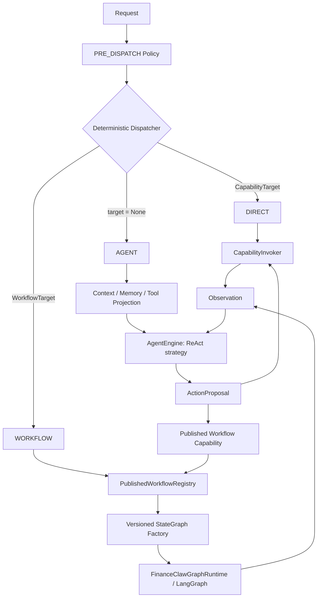

# ADR-P3-F-007：顶层 Agent、确定性分派与固定 Workflow

> **状态**：ACCEPTED，已开始实施
> **日期**：2026-09-02
> **影响范围**：Request / Routing / Planning / Agentic / Execution / State / Events
> **关联分析**：`FinanceClaw-LemonClaw-架构对齐分析.md`
> **模型运行时提案**：`FinanceClaw-LangChain模型运行时复用-ADR讨论稿.md`
> **编排运行时提案**：`FinanceClaw-LangGraph编排运行时复用-ADR讨论稿.md`

> **实施记录（2026-09-02）**：调用方清单与仓库检查未发现需要继续恢复的生产 Plan run，
> 因此没有保留无实际消费者的兼容运行时。自研 LLM Router、LLM Planner/PlanDraft、
> ExplorationEngine 与 Plan/DAG runtime 已从 `main` 删除；删除前快照保存在本地分支
> `codex/history-before-framework-reuse-20260902`。当前仅保留 DIRECT 领域核心，AGENT 与
> WORKFLOW 将按本 ADR 重新通过 LangChain/LangGraph 薄适配实现。

## 1. 决议摘要

推荐调整为三条顶层执行路径：

| 请求形态 | 顶层路径 | 是否需要 LLM 路由 | 是否需要 LLM 生成 Plan |
|---|---|---:|---:|
| 显式指定单个 Capability | `DIRECT` | 否 | 否 |
| 显式指定已发布 Workflow | `WORKFLOW` | 否 | 否，使用固定且版本化的 LangGraph |
| 未指定 Capability 或 Workflow | `AGENT` | 否 | 否，由 Agent 以 ReAct 逐轮选择动作 |

同时做出以下调整：

1. 删除默认链路中的 LLM 模式选择；
2. `AUTO` 只表示调用方未指定目标，不能再成为最终执行模式；
3. 停止让 LLM 构造完整 `PlanDraft`；
4. 固定 Workflow 由服务端发布并使用 LangGraph 执行；无生产存量执行时直接删除旧 Plan 内核；
5. 把旧 `EXPLORE` 验证过的治理语义带入新的顶层 `AGENT`，运行循环复用 LangChain/LangGraph；
6. 对外使用 `AGENT` 作为稳定产品概念，当前内部策略命名为 `REACT`，避免 API 永久绑定某一种 Agent 算法。

回答本 ADR 的核心问题：**是的，应该把 ReAct 提到顶层；但应提升为受 FinanceClaw 治理的顶层 Agent，而不是直接复制 LemonClaw 的全局 `create_agent` 实例。**

## 2. 当前实现的问题

### 2.1 LLM 选择 FAST 或 PLAN 没有提供有效抽象

当前 `LLMRouter` 只在 `FAST` 和 `PLAN` 中补全模式，并在 `FAST` 时选择一个 Capability。这个决策实际上可以由请求结构确定：

- 调用方明确给出 Capability，必然是直接调用；
- 调用方明确给出 Workflow，必然是固定 Workflow；
- 调用方什么都没给，模型真正需要做的是根据目标逐步选择下一项工具，而不是先回答“FAST 还是 PLAN”。

独立的 LLM 路由会额外引入：

- 一次模型延迟与费用；
- 模式误判和结构化输出失败；
- Router 上下文装配、schema、校验、repair 和观测成本；
- 与随后 Agent/Planner 的重复意图理解；
- 对用户并无稳定含义的内部模式选择。

如果无目标请求最终要由 LLM 理解意图，那么这次理解应直接发生在 Agent 的第一轮决策中，模型输出“调用哪个已授权能力或结束”，而不是先输出一个执行模式。

### 2.2 `PlanDraft` 把可执行 IR 的复杂度交给了模型

当前 `PlanDraft` 虽然刻意删除了 plan identity、retry、timeout 和运行状态，但仍要求模型一次性正确生成：

- 多个 node 及唯一 node id；
- Capability 与 Approval 节点形态；
- request、literal、node output 输入绑定；
- edges、依赖、trigger 和 condition；
- outputs 到节点结果的 JSON Pointer；
- failure policy、budget 和全局 DAG 约束；
- Catalog、Policy、deadline 和最大节点数限制。

模型不仅要理解业务目标，还必须同步成为 DSL 编译器、全局数据流设计器和静态校验器。后续 repair loop 只能修补格式和局部约束，不能保证计划在业务语义上正确。

这说明问题不在 Prompt 写得不够好，而在抽象层级不合适：

> LLM 擅长在当前上下文中选择下一步动作，也可以选择一个已知 Workflow；不应默认承担复杂可执行 DAG 的完整编译工作。

### 2.3 旧 EXPLORE 已验证新主路径所需的核心语义

删除前的 `ExplorationEngine` 已验证：

- 每轮严格 `call_one_capability | finish`；
- 结构化 ActionProposal 和 Observation；
- Policy-filtered Capability scope；
- `ScopedActionExecutor → CapabilityInvoker` 执行路径；
- 次数预算、重复动作保护和 Observation 裁剪；
- checkpoint 校验、取消和 completed-Observation resume；
- ContextPipeline、Memory 和 PromptBuilder 接入；
- 可信 Profile 与单写者限制。

这些语义需要保留，但不再保留自研循环本身。`EXPLORE` 不再是例外模式或 Plan 的特殊节点；
无显式目标请求进入顶层 Agent，循环、消息归并和 checkpoint 复用 LangChain/LangGraph，工具
执行仍落到 FinanceClaw `CapabilityInvoker`。

## 3. 目标架构



顶层只负责确定“调用已知能力、运行已知 Workflow，还是让 Agent 自主工作”。模型不参与这个三选一过程。

## 4. 对外协议建议

### 4.1 用显式 Target 代替模式选择

建议将当前只支持 Capability 的 `RequestTarget` 扩展为判别联合：

```python
class CapabilityTarget:
    kind: Literal["capability"]
    capability_id: str
    plugin_id: str | None = None


class WorkflowTarget:
    kind: Literal["workflow"]
    workflow_id: str
    version: int | None = None


RequestTarget = CapabilityTarget | WorkflowTarget
```

请求语义为：

```json
{"target": {"kind": "capability", "capability_id": "market.quote"}}
```

表示零 Agent 推理开销的直接调用；

```json
{"target": {"kind": "workflow", "workflow_id": "portfolio.daily-risk", "version": 3}}
```

表示执行一个已发布且版本固定的 Workflow；

```json
{"target": null}
```

表示交给顶层 Agent。即使自然语言中出现某个工具或 Workflow 名称，只要调用方没有设置结构化 Target，也仍由 Agent 在当前授权目录中选择。

### 4.2 `ExecutionMode` 的新定位

推荐的新公共执行路径名称为：

```text
DIRECT | WORKFLOW | AGENT
```

其中 `AGENT` 当前使用 `REACT` 策略：

```text
ExecutionPath.AGENT
AgentStrategy.REACT
```

这样未来可引入其他策略，例如 constrained-search、specialist-router 或 deterministic-agent，而不改变外部 Request 协议。

`ExecutionMode.AUTO` 不再出现在最终决策中，也不再触发 LLM Router；本次收敛已将
`ExecutionMode` 从公共请求协议删除。

### 4.3 冲突与不可用语义

- 显式 Capability 不存在、schema 不匹配或被 Policy 禁止：直接 fail-closed；
- 显式 Workflow 不存在、版本不可用或被 Policy 禁止：直接 fail-closed；
- 无 Target 但未配置可用 Agent Profile/Model：直接返回 `AGENT_NOT_AVAILABLE`；
- 不得因为某条路径不可用而静默切换到另一条路径；
- Policy 可以收紧或拒绝路径与工具范围，但不能偷偷把一个显式 Target 改成另一个业务目标。

## 5. Plan 的新定位

### 5.1 固定 Workflow 直接注册为版本化 LangGraph

固定 Workflow 仍然需要可靠分支、并行、审批、异步、状态和恢复，但这些通用运行机制不再由
FinanceClaw 重新实现。默认链路调整为：

```text
PublishedWorkflowDescriptor
  → resolve workflow_id + version + definition_hash
Versioned StateGraph Factory
  → StateGraph.compile(checkpointer=...)
Compiled LangGraph
  → FinanceClawGraphRuntime
```

第一阶段优先使用受审查的 Python graph factory，不引入另一份通用 JSON DAG DSL。Registry 只保存
产品级 metadata、入口/出口 schema、所需 Capability、Policy tags、owner、版本和生命周期状态。

只有出现可视化编排或非代码发布的真实需求后，才增加薄
`WorkflowDefinition → LangGraphCompiler`；它不能重新拥有 Scheduler、checkpoint 或 recovery。

### 5.2 `PlanDraft` 退出默认在线链路

推荐：

- `LLMPlanner` 不再进入默认 Composition Root；
- `PlanDraft` 标记 legacy/experimental，先保留代码兼容和历史测试；
- `PLAN` 不再表示“让模型生成计划”；
- 原 `StaticPlanner` 的模板映射能力演化为 `PublishedWorkflowRegistry + WorkflowResolver`；
- 调用证据已确认无外部依赖，`LLMPlanner / PlanDraft / repair` 代码已删除。

如果未来确有动态规划需求，重新以独立 ADR 引入更小的模型输出，例如：

```text
WorkflowSelectionDraft(workflow_id, version, inputs)
```

或者只允许模型从受控 Recipe/Workflow 集合中选择。不得直接恢复通用 DAG 生成。

### 5.3 Workflow 对 Agent 表现为一个原子工具

已发布 Workflow 可以投影成 Agent 可调用的 Capability：

```text
workflow.portfolio.daily-risk.v3
```

Agent 只负责选择 Workflow 和填写其入口参数，不感知内部 node、edge、retry 或 checkpoint。
LangGraph 负责内部图运行，FinanceClaw Adapter 负责 Policy、Capability 调用和标准
`ResultEnvelope`/异步受理回执。

这样能同时获得：

- ReAct 的灵活目标理解；
- 固定 Workflow 的可重复和可审计；
- LangGraph 的并行、审批和恢复能力；
- 模型输出复杂度的显著下降。

## 6. ReAct 提到顶层后的运行边界

### 6.1 顶层 Agent 不是无限权限 Agent

无 Target 只表示进入 Agent 路径，不表示开放全部工具。每轮可见工具必须由以下交集产生：

```text
AgentProfile scope
∩ tenant/user authorization
∩ PRE_DISPATCH / PRE_ACTION Policy
∩ 当前 Catalog 健康状态
∩ Context/Tool token budget
```

每个动作仍必须走：

```text
model draft
  → schema validation
  → scope validation
  → Policy
  → CapabilityInvoker / WorkflowInvoker
  → bounded Observation
```

模型永远不获得 Provider、Plugin、凭证、StateStore 或执行身份的直接访问权。

### 6.2 顶层 Agent 应拥有独立 Run 语义

最终目标不应继续把默认 Agent 伪装成“只有一个 EXPLORATION 节点的 Plan”。建议形成：

```text
AgentRun
AgentRunView
LangGraph thread/checkpoint
```

与以下对象并列：

```text
Capability Invocation
Workflow Run
```

原因是：

- 默认 Agent 不是 DAG 的一个特殊情况；
- Agent turn/action/observation 是其自然状态模型；
- 记忆、上下文和工具目录应由 Agent Run 直接管理；
- 避免为每个普通对话制造虚假的 Plan/Node 语义；
- 未来把 Agent 作为 Workflow 节点时，可以用显式 Adapter 包装，而不反向要求所有 Agent 都属于 Plan。

不过不建议在第一次行为切换时同时重写全部 checkpoint。现有单 `EXPLORATION` 节点 wrapper 可作为
兼容桥接层；新 Agent Run 最终使用 LangGraph thread/checkpoint，FinanceClaw 只维护稳定 Run View，
不再创建第二份完整 AgentRunState 真相。

### 6.3 不直接照搬 LemonClaw 的运行对象

LemonClaw 使用一个全局 `AgentService`、`session-default` 和进程级工具集合，适合个人本地 Agent。FinanceClaw 的顶层 Agent 必须按 request/session/tenant 创建或恢复逻辑 Run，并始终复用现有 Context、Memory、Policy、Invoker 和 Trace 基础；执行状态由官方 LangGraph checkpointer 持有。

模型调用层按 ADR-P3-F-008 复用 LangChain Chat Model/Runnable；Agent/Workflow 编排层按
ADR-P3-F-009 使用 `create_agent` / LangGraph。LangChain/LangGraph 负责通用循环和 checkpoint，
FinanceClaw Contract 仍负责授权、身份、Tool Adapter 和外部可见语义。

## 7. 现有组件的去留

| 当前组件 | 建议 | 目标定位 |
|---|---|---|
| `RequestCoordinator` | 重构 | 改为 `RunCoordinator` 或保留名称，直接做三路确定性分派 |
| `RequestTarget` | 扩展 | Capability/Workflow 判别联合 |
| `ExecutionMode.AUTO` | 兼容后移除 | 仅表示按 Target 推导，不是最终模式 |
| `ExecutionMode.FAST` | 重命名 | `DIRECT` |
| `ExecutionMode.PLAN` | 改义后重命名 | `WORKFLOW`，只执行已发布固定 Workflow |
| `ExecutionMode.EXPLORE` | 提升并重命名 | `AGENT` |
| `ExecutionMode.HYBRID` | 继续不可用，后续移除 | 不进入本次目标架构 |
| `LLMRouter` | 退出默认链路 | 不再选择执行路径或 Capability |
| `RoutingPipeline` | 简化 | 只保留确定性 Dispatcher；无需 model fallback |
| `RuleRouter` | 重构 | 处理 Target、兼容 alias 和显式系统规则 |
| `LLMPlanner` / `PlanDraft` | legacy/experimental | 不进入生产默认路径 |
| `StaticPlanner` | 替换 | `PublishedWorkflowRegistry / WorkflowResolver` |
| `PlanTemplate` / `ExecutionPlan` | 已删除 | 不再作为新 Workflow 的中间 IR |
| `PlanValidator` / `BasicScheduler` / `ExecutionEngine` | 已删除 | LangGraph 承担图运行；FinanceClaw 保留薄 Runtime Adapter |
| `PlanExecutionState / StateStore` | 拆分 | LangGraph checkpointer 是执行真相；另保留薄 Run Index |
| `ExplorationEngine` | 保留治理语义、替换运行机制 | 先作为顶层 Agent 兼容桥；后续迁移到受治理的 `create_agent` / LangGraph |
| `ExplorationProfile` | 演化 | `AgentProfile`，描述模型、工具范围和预算 |
| `ScopedActionExecutor` | 保留并强化 | 所有 Agent Action 的唯一执行入口 |
| `ModelGateway / ModelProvider` | 按 ADR-P3-F-008 收敛 | LangChain 执行模型调用，FinanceClaw 仅保留薄 ModelRuntime/Policy bridge |

## 8. 兼容映射

在外部调用方完成迁移前，可使用以下映射：

| 旧请求 | 兼容行为 |
|---|---|
| `AUTO + capability target` | `DIRECT` |
| `FAST + capability target` | `DIRECT`；无 target 时拒绝 |
| `EXPLORE` | `AGENT` |
| `AUTO + no target` | `AGENT` |
| `PLAN + workflow target` | `WORKFLOW` |
| `PLAN + no workflow target` | 拒绝并提示迁移；不再调用 LLMPlanner |
| `HYBRID` | 继续 fail-closed |

建议兼容期在结果和事件中同时写入 `legacy_mode` 与 `execution_path`，但所有新业务只读取 `execution_path`。

## 9. 迁移顺序

### Phase 1：先改变行为，不重写执行器

- 默认 Composition Root 移除 `LLMRouter` fallback；
- `AUTO + no target` 确定性映射到现有 `EXPLORE`；
- 显式 Capability 继续走 FAST/Invoker；
- 禁用默认 LLMPlanner；
- 将 Agent 模型调用迁移到 LangChain Model Runtime 的工作按 ADR-P3-F-008 独立推进；
- 增加“Router 模型调用数必须为 0、Planner 模型调用数必须为 0”的回归测试。

这一阶段复用现有 standalone Exploration wrapper，快速验证用户真实任务。

### Phase 2：引入一等 Workflow Target 与 LangGraph Runtime

- 将 RequestTarget 改为判别联合；
- 按 ADR-P3-F-009 完成锁定版本和 Python 3.14.3 Runtime Spike；
- 增加 PublishedWorkflowRegistry/Resolver 和薄 FinanceClawGraphRuntime；
- 固定 Workflow 注册为版本化 StateGraph factory；
- Capability/Approval/Async 节点通过 FinanceClaw Adapter 接入；
- Workflow 既可被显式 Target 调用，也可按 Policy 作为 Agent 工具投影；
- 将旧 PLAN 兼容入口收敛到固定 Workflow。

### Phase 3：完成命名和顶层状态迁移

- `FAST / PLAN / EXPLORE` 对外改为 `DIRECT / WORKFLOW / AGENT`；
- `ExplorationEngine/Profile/State` 演化为 Agent 对应命名；
- 从单节点 Plan wrapper 迁移到 LangGraph Agent thread/checkpoint；
- 保留 Adapter，使未来固定 Workflow 可以显式嵌入一个 Agent 节点。

### Phase 4：删除 legacy 动态规划链路

- 根据 telemetry 和调用方清单删除 LLMRouter；
- 删除 LLMPlanner、PlanDraft 和 repair 专用协议；
- 排空旧 Plan run 后删除 Plan IR、Validator、Scheduler、ExecutionEngine、Recovery 和 Plan StateStore；
- 清理 RouteType.GENERATED_PLAN、旧事件字段和过时测试；
- 更新 Stage 3B/3C 文档，防止旧模式重新成为实现依据。

## 10. 验收条件

### 10.1 分派

- 显式 Capability 请求在执行前不发生任何 LLM 调用；
- 显式 Workflow 请求在执行前不发生 Router/Planner LLM 调用；
- 无 Target 请求直接进入 Agent，第一次 LLM 调用就是 Agent turn；
- 相同 Request Target 在相同 Policy 下得到完全确定的 execution path；
- 路径不可用时 fail-closed，不进行隐式降级。

### 10.2 Agent

- 每轮只能提交一个受 schema 约束的动作或结束；
- 所有动作经过 Scope、Policy、Invoker 和标准 ResultEnvelope；
- Tool Catalog 按 tenant/user/profile/policy 过滤；
- Observation 有长度、敏感信息和 provenance 约束；
- checkpoint 只从已完成 Observation 边界恢复；
- Memory 写入继续采用提案与 Policy gate。

### 10.3 Workflow

- 只能执行 Registry 中已发布的 Workflow 与版本；
- 每次运行物化新的 workflow run id，并安全映射为 LangGraph thread id；
- Agent 只看到 Workflow 的入口 schema 和业务描述，看不到内部 DAG；
- 不存在默认在线 `PlanDraft` 生成；
- approval/async/retry/checkpoint 由 LangGraph primitive 与 FinanceClaw Adapter 提供等价语义；
- checkpoint 是唯一执行状态真相，不与旧 PlanExecutionState 双写。

### 10.4 可观测性

建议新增或调整：

```text
EXECUTION_PATH_SELECTED(path, source=request|system|policy)
AGENT_RUN_STARTED(strategy=react, profile_id, scope_hash)
AGENT_TURN_DECIDED(action_kind, capability_id?)
WORKFLOW_RESOLVED(workflow_id, version, definition_hash)
```

`source=model` 不再是执行路径选择的合法来源。

## 11. 风险与控制

| 风险 | 控制 |
|---|---|
| 无 Target 请求全部进入 Agent，模型调用变多 | 明确 Target 作为零推理快速通道；SDK 和上游产品可自动填写结构化 Target |
| ReAct 逐轮执行比一次 Plan 慢 | 固定高频任务沉淀成 Workflow；Agent 可把 Workflow 当原子工具调用 |
| 顶层状态迁移范围较大 | 先用现有单节点 wrapper 完成行为切换，再迁移到 LangGraph checkpoint |
| 工具数量过多导致选择变差 | Tool Projection、Skill 式渐进披露、语义检索和 Profile scope |
| Agent 选择危险工具 | side effect/egress/completion profile、Policy、approval 和 idempotency 保持强制 |
| 删除动态 Plan 后失去复杂任务能力 | 复杂且可重复任务使用固定 Workflow；开放任务使用 ReAct，不把两者混成动态 DAG |

## 12. 推荐结论

推荐接受本 ADR，原因不是“LemonClaw 这样做了”，而是当前 FinanceClaw 已经出现了明确的抽象错位：

- 模式选择不需要模型；
- 完整 PlanDraft 超出了模型应该承担的可靠编译职责；
- 旧 EXPLORE 已验证受控 ReAct 所需的关键治理语义，但无需保留自研循环；
- LangGraph 已经更完整地覆盖固定 Workflow 与 Agent 所需的通用编排机制。

调整后的职责边界更简单：

```text
调用方决定是否指定已知目标
Harness 确定性决定顶层执行路径
Agent 决定开放任务的下一步动作
Published Workflow 决定固定任务的图
LangGraph 决定如何推进图
FinanceClaw 永远决定什么可以执行以及哪些数据可以进入图
```

这会让 FinanceClaw 的后续投入真正聚焦到核心记忆、上下文、工具管理和工具调用，而不是继续优化 LLMRouter Prompt 或要求模型生成越来越复杂的 Plan DSL。
