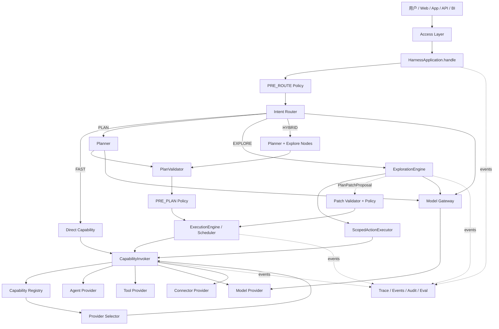

# Harness-Agent 通用可插拔智能体平台架构设计

> **文档性质**：架构设计 / 技术方案  
> **版本**：V1.2（Execution Mode / Agentic Orchestration 修订版）  
> **日期**：2026-08-26  
> **定位**：以财经 Agent 为首个业务域实例，面向多领域复用的 Agent Harness 设计  
> **前置版本**：V1.1 内容审阅修订版  
> **阶段基线**：Stage 1 Minimal Harness + Stage 2 Reliable Plan Execution Engine

---

## 0. 本次修订结论

V1.2 不推翻 V1.1 的核心方向，而是在已经完成可靠执行底座之后，补齐“模型决策能力如何进入 Harness”的架构边界。

新增或强化以下原则：

1. **统一智能入口**：未来对上提供 `HarnessApplication.handle()`，Direct Invocation 与 Plan Execution 仍保留为明确的低层 API。
2. **执行模式显式化**：引入 `AUTO / FAST / PLAN / EXPLORE / HYBRID` 五种 Execution Mode。
3. **Router / Planner / Explorer 分权**：
   - Router 决定“走哪条路径”；
   - Planner 决定“要做哪些步骤”；
   - Explorer 决定“在未知路径中下一步探索什么”；
   - Scheduler / CapabilityInvoker 始终掌握真正执行权。
4. **Decision != Execution**：LLM 可以路由、规划、提出 Action 或 PlanPatch，但不能绕过 Validator / Policy / CapabilityInvoker 直接执行 Provider。
5. **宏观计划 + 局部探索**：复杂生产任务优先使用 `HYBRID`，由可靠 ExecutionPlan 管主流程，在明确的 Explore Node 内使用 bounded ReAct。
6. **受治理的动态扩展**：探索过程中需要新增工作时只能提交 `PlanPatchProposal`，经过 Validator + Policy 后形成新的 plan revision。
7. **模型抽象先于智能编排**：LLM Router / LLM Planner / ExplorationEngine 依赖 `ModelProvider` 抽象，不直接绑定 OpenAI、Anthropic、Gemini 或其他厂商 SDK。
8. **Stage 3 扩展为 Adaptive Multi-Provider & Agentic Orchestration**：先完成多 Provider 与 ModelProvider，再引入 Router / LLM Planner / Explore / Hybrid / Replay Eval。
9. **不建立万能 MainAgent**：统一入口是 Harness Orchestrator，不是一个拥有无限工具权限和执行权的单一 LLM Agent。
10. **不持久化模型隐藏思维链**：Trace / State 只记录结构化决策、Action、Observation 摘要和理由，不要求保存自由文本 Chain-of-Thought。

---

# 1. 背景与系统定位

Harness-Agent 面向一个**通用、可插拔、可治理、可观测、可恢复、可选择执行策略的智能体运行平台**。

财经 Agent 是首个业务域和验证场景，但 Harness Core 本身不固化知识问答、问数、排障、校验、报告、风控等具体能力。业务能力通过 Agent、Tool、Model、Connector、Memory 等 Provider 装配进入平台。

从产品视角，用户看到统一入口：

```python
result = await app.handle(request)
```

从系统视角，Harness 负责：

```text
Request Normalize
      ↓
Context / Policy
      ↓
Intent Router
      ↓
Execution Mode
      ↓
FAST / PLAN / EXPLORE / HYBRID
      ↓
Capability / ExecutionPlan / Exploration
      ↓
Provider Selection
      ↓
Policy / Invocation / Scheduler
      ↓
Result Composition
      ↓
Trace / Events / Eval
```

> **核心定位**：Harness-Agent 是“能力装配 + 决策协议 + 可靠执行协议”，不是某个具体业务 Agent。

---

# 2. 设计目标与非目标

## 2.1 设计目标

| 目标 | 说明 |
|---|---|
| 统一入口 | 对上提供稳定 API / SDK / Event 接口，并通过 `handle()` 自动选择执行模式。 |
| 多执行模式 | 简单任务不强制 Agent 化，复杂任务支持计划式与探索式执行。 |
| 可插拔 | Agent、Tool、Model、Memory、Connector、Policy、Router、Planner、Selector 可独立替换。 |
| 可组合 | 一个请求可以形成静态 DAG、LLM Plan、局部 ReAct 或二者组合。 |
| 契约优先 | Router、Planner、Explorer、Selector 都返回结构化 Contract。 |
| 低耦合 | Planner 面向 CapabilityCatalog，业务插件不依赖 Provider 实现。 |
| 可治理 | Route、Plan、Action、Provider Selection、Write/Egress 均可被 Policy 检查。 |
| 可观测 | Request → Route → Plan/Explore → Node → Provider → Model/Connector 形成统一 Trace。 |
| 可恢复 | PLAN/HYBRID 继续复用 Stage 2 checkpoint / Resume；探索过程必须有显式可恢复边界。 |
| 可评测 | Router、Planner、Provider Selector、Exploration 都有可回放的结构化决策记录。 |
| 可演进 | 本地 Provider 可逐步迁移到 Worker / Remote Service，而不改变上层能力协议。 |

## 2.2 非目标

- Harness Core 不定义财经指标、诊断规则、报表模板或具体 Prompt。
- 不要求所有请求都进入 LLM。
- 不允许一个 MainAgent 获得全 Registry、全上下文和无限执行权。
- 不允许 Planner 直接访问数据库、HTTP Business API 或业务 SDK。
- 不允许 ReAct 循环绕过 Policy / Approval / Deadline / Budget。
- 不把 ExecutionState、Memory、Secret 混成全局共享字典。
- Stage 3 不实现 Remote Worker、分布式 Scheduler、Control Plane Catalog、Marketplace。
- 不持久化模型原始隐藏思维链作为系统状态。

---

# 3. 核心架构原则

| 原则 | 含义 |
|---|---|
| **Core Minimal** | Core 只保留请求、路由、计划、探索控制、注册发现、调度、策略、状态、观测。 |
| **Contract First** | RouteDecision、ExecutionPlan、ActionProposal、PlanPatchProposal 等先定义协议。 |
| **Capability over Implementation** | Planner / Explorer 选择 capability，不选择业务实现类。 |
| **Provider Replaceable** | 同一 capability 可以有多个 Provider，并由 Selector 决定实际实现。 |
| **Deterministic First** | FAST > PLAN > EXPLORE；能确定完成的任务不升级为更自治模式。 |
| **Decision != Execution** | 模型负责判断和提议；执行必须经过 Harness 执行边界。 |
| **Bounded Agentic** | Explore 必须受 steps / calls / cost / deadline / scope / recursion 限制。 |
| **Plan as Reliability Boundary** | 可提前描述的复杂任务优先转成 ExecutionPlan，由 Stage 2 引擎可靠执行。 |
| **Explore as Local Autonomy** | ReAct 主要用于无法预先完整规划的局部探索，不替代全局 Scheduler。 |
| **Policy Everywhere** | Route、Plan、Provider Select、Action、Write、Egress 和 Patch 都可检查。 |
| **Trace by Default** | 决策、选择、执行、等待和恢复都有稳定 Trace/Event。 |
| **State Explicit** | Context、ExecutionState、Memory、Secret、ExplorationState 分离。 |
| **Control/Data Plane Separation** | Provider 配置与治理属于控制面；在线决策执行属于数据面。 |

---

# 4. 总体架构

## 4.1 高层架构



## 4.2 控制权原则

```text
Router:
    可以决定模式
    不执行 Capability

Planner:
    可以生成 ExecutionPlan
    不执行 Plan Node

Explorer / ReAct Model:
    可以提出 ActionProposal / PlanPatchProposal
    不直接调用 Provider

Scheduler:
    决定 DAG 节点何时运行

ScopedActionExecutor / CapabilityInvoker:
    掌握实际执行权

Policy:
    可以拒绝 / 要求审批 / 施加约束
```

---

# 5. Execution Mode

## 5.1 模式定义

```python
class ExecutionMode(StrEnum):
    AUTO = "auto"
    FAST = "fast"
    PLAN = "plan"
    EXPLORE = "explore"
    HYBRID = "hybrid"
```

## 5.2 AUTO

由 Router 根据请求特征选择模式。

适合普通终端用户和默认 API。

```text
Request
  ↓
Router
  ├── FAST
  ├── PLAN
  ├── EXPLORE
  └── HYBRID
```

## 5.3 FAST

用于明确、单步、低不确定性任务。

典型路径：

```text
Request
  ↓
RouteDecision(DIRECT_CAPABILITY)
  ↓
CapabilityInvoker
  ↓
ProviderSelector
  ↓
Provider
```

例如计算、明确查询、固定命令。

## 5.4 PLAN

强调“先规划、再执行”。

```text
Request
  ↓
Planner
  ↓
ExecutionPlan
  ↓
PlanValidator
  ↓
PRE_PLAN Policy
  ↓
ExecutionEngine
```

适合步骤相对可预见、需要审批/恢复/审计的复杂任务。

## 5.5 EXPLORE

强调“边观察、边决定下一步”。

```text
Request
  ↓
ExplorationEngine
  ↓
Model Decision
  ↓
ActionProposal
  ↓
Policy
  ↓
ScopedActionExecutor
  ↓
Observation
  ↓
Model Decision
  ...
```

适合根因分析、开放调查、复杂研究。

EXPLORE 必须受预算约束，且 WRITE / EXTERNAL Action 仍需要 Policy / Approval。

## 5.6 HYBRID

推荐的复杂生产任务模式。

```text
LLM Planner
   ↓
ExecutionPlan
   ↓
Scheduler
   ├── deterministic Tool Node
   ├── deterministic Tool Node
   ├── Explore Node
   │      ↓
   │   bounded ReAct
   │      ↓
   │   structured result
   └── Report Node
```

主流程由 ExecutionPlan 控制；仅在明确的 Explore Node 内开放局部自主性。

## 5.7 模式控制权

| 模式 | 决策控制 | 真正执行 | 可恢复主边界 |
|---|---|---|---|
| FAST | Router | CapabilityInvoker | Invocation |
| PLAN | ExecutionPlan | Scheduler + Invoker | Plan checkpoint |
| EXPLORE | ExplorationEngine | ScopedActionExecutor + Invoker | Exploration checkpoint |
| HYBRID | ExecutionPlan + local Explorer | Scheduler + ScopedActionExecutor | Plan + Explore checkpoint |
| AUTO | Router 选择上述模式 | 取决于最终模式 | 取决于最终模式 |

---

# 6. 统一入口 `handle()`

未来推荐公共入口：

```python
result = await app.handle(request)
```

内部流程：

```text
normalize
  ↓
create trusted context
  ↓
PRE_ROUTE policy
  ↓
route
  ↓
┌──────────────────────────────────────┐
│ FAST    → invoke direct capability   │
│ PLAN    → planner → execute_plan     │
│ EXPLORE → exploration engine         │
│ HYBRID  → planner → hybrid execute   │
└──────────────────────────────────────┘
  ↓
compose result
```

低层 API 保留：

```python
app.invoke(request)
app.execute_plan(request, plan)
app.resume_plan(plan_id)
app.resolve_approval(...)
app.complete_async_node(...)
```

`handle()` 是编排入口，不替代这些可靠执行 API。

---

# 7. Intent Router

Router 只回答：

> 这个请求应该进入哪一种执行路径？

建议输出：

```python
class RouteDecision(ContractModel):
    mode: ExecutionMode
    route_type: RouteType
    capability_id: str | None = None
    planner_id: str | None = None
    explorer_id: str | None = None
    confidence: float | None = None
    reason_code: str
    metadata: FrozenJsonMapping
```

RouterStrategy：

```text
RuleRouter
EmbeddingRouter
SmallModelRouter
LLMRouter
EnsembleRouter
```

Router 禁止：

```text
直接调用 Tool
直接执行 Agent
直接修改 Plan
```

---

# 8. Planner

Planner 负责：

> 将目标转换为结构化 ExecutionPlan。

实现可以包括：

```text
StaticPlanner
RulePlanner
LLMPlanner
HybridPlanner
WorkflowBackedPlanner
```

LLMPlanner 必须：

1. 只看到 CapabilityCatalog 的安全快照；
2. 使用结构化输出；
3. 生成 ExecutionPlan；
4. 必须通过 PlanValidator；
5. 校验失败允许有限 repair attempt；
6. 不直接调用业务 Capability；
7. 不持有 Provider instance。

推荐：

```text
LLM output
   ↓
ExecutionPlan parse
   ↓
PlanValidator
   ├── valid → execute
   └── invalid → bounded repair → validate
```

---

# 9. ExplorationEngine / Bounded ReAct

## 9.1 定位

ExplorationEngine 解决无法在执行前完整确定路径的问题。

它不是新的 Scheduler，也不是拥有任意工具权限的 MainAgent。

## 9.2 循环

```text
Goal + Observation Summary
      ↓
Model
      ↓
ActionProposal
      ↓
Action Validation
      ↓
Policy
      ↓
ScopedActionExecutor
      ↓
ResultEnvelope
      ↓
Observation Summary
      ↓
next step / finish / plan proposal
```

## 9.3 ExplorationBudget

至少包含：

```text
max_steps
max_tool_calls
max_model_calls
deadline_at
cost_limit
token_limit
max_recursion_depth
allowed_capabilities
```

## 9.4 不保存隐藏思维链

平台只记录：

```text
decision_summary
selected_action
reason_code
observation_summary
evidence_refs
```

不要求保存模型自由文本 Chain-of-Thought。

## 9.5 ScopedActionExecutor

Explorer 不获得 Registry / Provider 实例。

它只能提交：

```python
ActionProposal(
    capability_id=...,
    input=...,
    idempotency_key=...,
)
```

由：

```text
ScopedActionExecutor
  ↓
Policy
  ↓
CapabilityInvoker
  ↓
ProviderSelector
  ↓
Provider
```

执行。

---

# 10. 动态计划扩展

Explorer / Sub-Agent 不允许直接修改主 DAG。

只能返回：

```python
PlanPatchProposal(
    base_plan_id=...,
    base_revision=...,
    add_nodes=(...),
    add_edges=(...),
    output_changes=...,
    reason_code=...,
)
```

处理：

```text
PlanPatchProposal
      ↓
Patch structural validation
      ↓
PlanValidator
      ↓
Policy
      ↓
revision++
      ↓
checkpoint
      ↓
Scheduler continue
```

必须防止：

```text
无限追加节点
递归爆炸
预算绕过
未经审批新增 WRITE 节点
修改已经完成节点的历史语义
```

---

# 11. Capability Registry 与 Provider Selector

Capability 表示“做什么”，Provider 表示“谁来做”。

```text
data.query/v1
├── provider-a
├── provider-b
└── provider-c
```

Registry：

```text
candidates(capability) -> ProviderDescriptor[]
```

Selector：

```text
select(capability, candidates, SelectionContext) -> SelectionDecision
```

选择依据包括：

```text
health
tenant visibility
policy
cost
latency
quality
region
data residency
canary bucket
provider pin
```

Registry 不承担复杂路由策略，避免退化为 Service Locator + Router。

---

# 12. Retry、Fallback 与 Provider 切换

Retry：

```text
Provider A → A → A
```

Fallback：

```text
Provider A → Provider B → Provider C
```

两者必须分离记录。

安全规则：

```text
NONE / READ:
    可以根据错误类型自动 fallback

WRITE + stable idempotency:
    仅在 Provider 等价组和幂等契约明确时允许受控 fallback

WRITE + non-idempotent:
    禁止自动 fallback
```

Stage 2 的 Idempotency Guard 不能被 Provider Fallback 绕过。

---

# 13. ModelProvider

领域 Agent、Router、Planner、Explorer 均不直接依赖厂商模型 SDK。

推荐能力：

```text
model.generate/v1
model.embed/v1
model.rerank/v1
model.vision/v1
```

模型可以根据：

```text
task
cost
latency
quality
context length
region
data residency
tenant policy
health
```

动态选择 Provider。

Prompt / system instruction 属于 Router / Planner / Agent 配置，不进入 Harness Core 业务逻辑。

---

# 14. Connector 与 Memory

## 14.1 Connector

Agent / Tool 面向 capability：

```text
data.query/v1
knowledge.search/v1
metadata.lineage.read/v1
```

不直接引用：

```text
SnowflakeClient
MySQLConnection
VectorDBClient
内部 HTTP 地址
```

## 14.2 Memory

必须继续与 StateStore 分离：

```text
ExecutionState
    → StateStore
    → “任务执行到哪里”

Conversation / Domain Memory
    → MemoryProvider
    → “系统过去知道什么”
```

探索模式可以读取经 Policy 裁剪的 Memory Slice，但不能把 Memory 当执行真相来源。

---

# 15. Policy 与安全

新增或强化 Policy Phase：

```text
PRE_ROUTE
PRE_PLAN
PRE_EXECUTE
PRE_PATCH
```

未来可增加：

```text
POST_EXECUTE
```

治理对象包括：

```text
Execution Mode
Capability
Provider
ActionProposal
PlanPatchProposal
SideEffect
Egress
Budget
Tenant visibility
Approval
```

对于 EXPLORE：

> 每一次 Action 都必须重新经过执行边界，之前的模型推理不能成为绕过 Policy 的授权。

---

# 16. Trace / Events / Eval

推荐 Trace：

```text
REQUEST
└── RUNTIME
    ├── ROUTE
    ├── PLANNER
    ├── EXPLORATION
    │   ├── MODEL
    │   ├── ACTION
    │   └── OBSERVATION EVENT
    └── PLAN
        ├── SCHEDULER
        └── PLAN_NODE
            ├── PROVIDER_SELECT
            ├── CAPABILITY
            └── TOOL / AGENT / MODEL / CONNECTOR
```

关键 Event：

```text
route.decided
mode.selected

planner.started
planner.repairing
planner.completed

exploration.started
exploration.step
exploration.action_proposed
exploration.action_completed
exploration.finished
exploration.budget_exhausted

plan_patch.proposed
plan_patch.accepted
plan_patch.rejected

provider.candidates
provider.selected
provider.fallback
provider.health_changed

selection.replay
eval.completed
```

---

# 17. 插件与依赖边界

普通业务 Plugin 仍原则上只依赖：

```text
harness-contracts
harness-spi
```

禁止：

```text
plugin → harness-runtime.internal
plugin → harness-execution.internal
plugin → registry implementation
plugin → policy implementation
```

Stage 3 默认不把 CapabilityInvoker 注入普通 AgentPlugin。

如果未来需要可编程 Agent Runtime，应引入独立、受限的 `AgenticAgentSPI`，而不是把 Runtime 变成 Service Locator。

---

# 18. 测试与评测

## 18.1 Router Eval

```text
Route Accuracy
Mode Accuracy
Fast Path Precision
Unnecessary Planning Rate
Unsafe Explore Rate
```

## 18.2 Planner Eval

```text
Plan Validity
Capability Selection Accuracy
Dependency Correctness
Budget Compliance
Approval Coverage
Repair Rate
```

## 18.3 Explorer Eval

```text
Task Completion
Step Count
Tool Selection
Repeated Action Rate
Budget Exhaustion Rate
Unsafe Action Proposal Rate
Evidence Completeness
```

## 18.4 Selector Eval

```text
Provider success rate
fallback rate
latency
cost
quality
health-aware selection
canary stability
```

---

# 19. 演进路线

| 阶段 | 重点 |
|---|---|
| Stage 1：Minimal Harness | Request / Context + Registry + Agent/Tool SPI + Policy + Trace。 |
| Stage 2：Reliable Plan Execution | ExecutionPlan、DAG、StateStore、Retry、Cancel、Approval、Async、Resume、Events。 |
| Stage 3A：Provider Fabric | Multi Provider、Selector、Health、Fallback、Canary、ModelProvider。 |
| Stage 3B：Routing & Planning | `handle()`、ExecutionMode、Router、LLMRouter、LLMPlanner、HybridPlanner。 |
| Stage 3C：Agentic Exploration | Bounded ReAct、ExplorationEngine、ScopedActionExecutor、PlanPatchProposal、HYBRID。 |
| Stage 3D：Provider Expansion & Eval | ConnectorProvider、MemoryProvider、Selection/Route/Plan Replay Eval。 |
| Stage 4：Platformization | Remote Plugin、Worker、Catalog、Tenant Config、Quota、SecretProvider、Control Plane。 |
| Stage 5：Ecosystem | SDK、插件认证、兼容矩阵、Marketplace。 |

---

# 20. 架构红线

1. Router 不执行 Capability。
2. Planner 不执行业务 Capability。
3. Explorer 不持有 Provider instance。
4. 模型不直接修改 ExecutionState。
5. 模型不直接修改主 ExecutionPlan。
6. 所有 Action 经过 Policy + CapabilityInvoker。
7. WRITE fallback 不得绕过幂等规则。
8. Plugin 不得通过 Registry 查找任意实现形成 Service Locator。
9. Model SDK 不进入 Harness Core orchestration 代码。
10. Memory 不替代 StateStore。
11. Trace 不保存 Secret 或原始隐藏思维链。
12. Explore 必须有预算、Scope 和 Deadline。

---

# 21. 结论

前三个阶段的核心问题可以概括为：

```text
Stage 1:
一个 Capability 能不能被安全调用？

Stage 2:
多个 Capability 能不能被可靠编排？

Stage 3:
同一个 Capability 的多个实现能不能被可靠选择，
并且模型能不能在不取得执行权的前提下可靠路由、规划和探索？
```

最终目标不是构建一个万能 MainAgent，而是构建：

> **一个能够在 FAST、PLAN、EXPLORE、HYBRID 间选择，并把 LLM 决策能力安全装配到可靠 Execution Platform 上的 Harness。**
