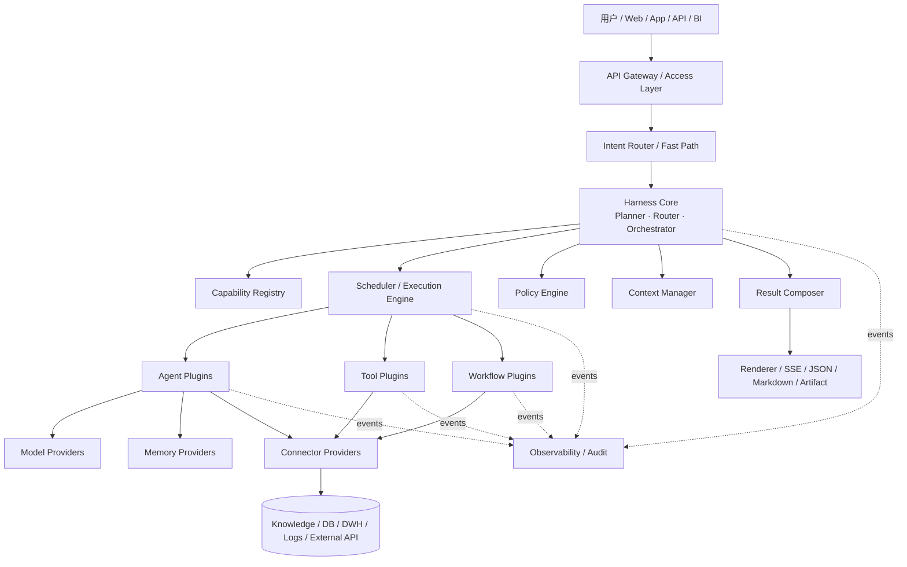

# Harness-Agent 通用可插拔智能体平台架构设计

> **文档性质**：架构设计 / 技术方案  
> **版本**：V1.1（内容审阅修订版）  
> **日期**：2026-08-24  
> **定位**：以财经 Agent 为首个业务域实例，面向多领域复用的 Agent Harness 设计

---

## 0. 审阅结论与修订说明

原 V1.0 的总体方向是合理的：**Harness-Agent 应被定义为“Agent 的容器、运行时与治理框架”，而不是某个具体业务 Agent**。中心编排、Capability Registry、统一执行计划、插件生命周期、Policy、Trace 等抽象已经覆盖了平台化 Agent 系统的核心骨架。

本次审阅主要做了以下增强，使“通用性、可插拔性”边界更清晰：

1. **增加 Control Plane / Data Plane 分离**：注册、配置、版本、策略属于控制面；请求执行、调度、调用属于数据面，避免平台管理逻辑与在线链路耦合。
2. **弱化“中心 Agent = 单一 LLM”假设**：中心 Agent 是逻辑上的编排内核，可由规则、LLM、静态 Workflow 或混合 Planner 实现。
3. **统一 Capability 抽象，但不强行抹平 Agent / Tool / Workflow 的差异**：三者共享发现、权限、调用、结果、Trace 契约；自治程度、执行语义和生命周期仍各自保留。
4. **修正副作用模型**：`read/write/external` 不是同一维度。建议将“数据副作用”和“网络出口”拆为两个独立字段。
5. **补充幂等、取消、Deadline、Backpressure、异步任务等运行时语义**，使插件在真实生产系统中可安全组合。
6. **补充 Schema 与版本兼容原则**：Capability ID 稳定，Provider 可替换；破坏性契约变更通过 capability major version 隔离。
7. **强化插件隔离**：业务插件不能直接读取全量上下文、密钥、数据库连接信息，也不能绕过 Policy 和 Observer。
8. **强化结果来源与证据链**：ResultEnvelope 除结果外应携带 provenance、artifact、citation、quality metadata，便于追踪与审计。
9. **明确“快速路由”与“深度规划”的关系**：简单请求可走 fast path，不要求所有请求都进入 LLM Planner。
10. **增加反模式章节**：避免“每个能力都做成 Agent”“Registry 变成 Service Locator”“Planner 直接执行”等常见架构退化。

---

## 1. 背景与系统定位

Harness-Agent 面向一个**通用、可插拔、可治理、可观测的智能体运行平台**。

财经 Agent 是首个业务域和验证场景，但 Harness Core 本身不固化“知识问答、问数、排障、校验、报告、风控”等任何具体能力。业务能力通过 Agent、Tool、Workflow、Connector、Model、Memory 等插件装配进入平台。

从产品视角，用户看到的是一个统一智能入口；从系统视角，平台负责：

- 规范化请求；
- 理解意图与上下文；
- 发现可用能力；
- 生成或选择执行计划；
- 串行、并行或条件执行；
- 统一权限、预算、安全与审计；
- 合并结果并按渠道输出；
- 对全链路进行 Trace、Metrics 与质量评估。

> **核心定位**：Harness-Agent 是能力装配与执行协议，不是业务能力本身。

---

## 2. 设计目标与非目标

### 2.1 设计目标

| 目标 | 说明 |
|---|---|
| 统一入口 | 对上提供稳定 API / SDK / Event 接口，对下屏蔽模型、Agent、Tool、数据源差异。 |
| 可插拔 | Agent、Tool、Workflow、Model、Memory、Connector、Policy、Observer、Renderer 可独立替换。 |
| 可组合 | 一个请求可动态形成 DAG，支持串行、并行、条件分支、回退、人工节点。 |
| 契约优先 | 模块依赖稳定 Schema 和协议，不依赖具体实现类或厂商 SDK。 |
| 低耦合 | 插件只声明依赖的 capability、scope 和 context slice。 |
| 可治理 | 权限、预算、敏感数据、超时、副作用、外部网络出口均由运行时统一约束。 |
| 可观测 | Request → Plan → Node → Agent/Tool/Model/Connector 形成统一 Trace。 |
| 可演进 | 支持从 In-Process 插件逐步迁移到 Worker / Remote Service，不改变上层协议。 |
| 可回放 | Plan、输入、调用记录、结构化输出可用于重放、评测和回归。 |
| 多租户 | 配置、权限、预算、数据命名空间、缓存和观测均具备 tenant-aware 语义。 |

### 2.2 非目标

- 不在 Harness Core 定义财经指标口径、诊断规则、风控规则或报表模板。
- 不要求所有能力都 Agent 化；确定性能力优先实现为 Tool / Service。
- 不绑定单一大模型、数据库、向量库、工作流引擎或消息系统。
- 不允许中心 Agent 无限制自治；高风险操作必须经过 Policy / Approval。
- 不试图用一套接口完全抹平 Agent、Tool、Workflow 的执行差异。
- 不允许业务插件绕过 Registry、Policy、Trace 直接访问平台基础设施。

---

## 3. 核心架构原则

| 原则 | 含义 |
|---|---|
| **Core Minimal** | Core 只保留请求、上下文、注册发现、计划、调度、策略、状态、观测等通用能力。 |
| **Contract First** | 模块先定义契约，再选择实现；实现替换不影响上层调用。 |
| **Capability over Implementation** | Planner 选择 `data.query`、`knowledge.search` 等能力，而非某个类、服务或厂商。 |
| **Provider Replaceable** | 同一 capability 可存在多个 Provider，用于主备、灰度、成本优化和降级。 |
| **Deterministic by Default** | 能由 SQL、规则、API、工作流确定完成的任务，不交给 LLM 猜测。 |
| **Agent when Necessary** | 仅在需要自主分解、探索、反思或跨工具规划时使用 Sub-Agent。 |
| **Policy Everywhere** | 权限、成本、敏感数据、外部访问、副作用在计划和每次执行时都可检查。 |
| **Trace by Default** | 任何跨模块调用自动生成 Span，业务插件无需自行维护链路。 |
| **Fail Contained** | 插件失败可超时、重试、熔断、切换 Provider，不传播为 Core 故障。 |
| **Schema over Prompt** | 模块协作优先依赖结构化输入输出，而非解析自然语言字符串。 |
| **State Explicit** | Request Context、Execution State、Memory、Secret 不混在一个全局字典中。 |
| **Control/Data Plane Separation** | 配置、注册、版本、策略管理与在线执行链路分离。 |

---

## 4. 总体架构

### 4.1 高层架构



### 4.2 控制面与数据面

#### Control Plane

负责**平台管理与能力治理**，不参与每一个节点的业务计算：

- Plugin Catalog / Capability Registry 管理；
- Provider 版本与灰度；
- 租户配置；
- Policy / Budget / Quota；
- Secret 引用配置；
- 模型与连接器配置；
- Prompt / Workflow 模板发布；
- 质量基线与 Eval Set；
- 插件健康状态与启停。

#### Data Plane

负责**在线请求执行**：

- Request Normalize；
- Context Load；
- Intent Route；
- Planning；
- Capability Resolve；
- DAG Scheduling；
- Runtime Invocation；
- Result Composition；
- Streaming / Artifact Output；
- Trace / Audit Event 产生。

> 控制面故障不应立即影响已经下发的在线计划；数据面也不应直接修改插件目录和平台配置。

---

## 5. 分层职责与可插拔边界

| 层级 | 公共职责 | 主要扩展点 |
|---|---|---|
| 用户层 | Web、App、BI、机器人、开放 API | Channel Adapter |
| 接入层 | API、认证、SSE、限流、租户、审计入口 | Protocol Adapter / Auth Provider |
| 意图路由层 | Fast Path、任务分类、进入深度规划 | RouterStrategy |
| Harness Core | 上下文、Planner、Registry、Policy、Scheduler、Composer | Planner / Selector / Scheduler SPI |
| Agent 执行层 | 领域 Sub-Agent、通用 Agent | AgentPlugin |
| Tool 层 | 确定性能力、业务动作 | ToolPlugin |
| Workflow 层 | 固定/半固定流程 | WorkflowPlugin / Engine Adapter |
| 模型层 | LLM、Embedding、Rerank | ModelProvider |
| 记忆与状态 | 会话、长期记忆、执行状态 | MemoryProvider / StateStore |
| 数据访问层 | DB、DWH、知识库、日志、外部 API | Connector Provider |
| 输出层 | JSON、SSE、Markdown、报告、卡片 | OutputRenderer |
| 可观测层 | Trace、Metric、Log、Quality、Audit | ObserverExporter |
| 治理安全层 | 权限、预算、审批、脱敏、策略 | PolicyProvider |

---

## 6. Harness Core 模块设计

### 6.1 Request Normalizer

将所有入口归一化为统一 `RequestEnvelope`。

**职责**：

- 统一 request_id / trace_id；
- 解析 tenant / user / channel；
- 建立 deadline；
- 归一化用户消息、附件和结构化参数；
- 不进行业务意图判断。

**可插拔点**：Protocol Adapter、Channel Adapter。

---

### 6.2 Context Manager

负责装载和裁剪执行上下文。

**核心原则**：插件不能获得“全量上下文”，只能获得声明并经 Policy 允许的 Context Slice。

典型上下文：

- RequestContext；
- ConversationContext；
- TenantContext；
- UserScope；
- EntityContext；
- PlanContext；
- SecretRef。

---

### 6.3 Intent Router

负责轻量级路由和 Fast Path。

典型输出：

- 直接回答；
- 调用单一 Tool；
- 执行固定 Workflow；
- 进入 Planner；
- 拒绝或请求补充信息。

**RouterStrategy 可插拔实现**：

- 规则路由；
- 小模型分类；
- LLM 路由；
- Embedding 相似度；
- 多策略 Ensemble。

> Router 只决定“往哪里走”，不负责执行实际能力。

---

### 6.4 Planner

将用户目标转化为结构化 `ExecutionPlan`。

Planner 可以是：

- Static Planner；
- Rule Planner；
- LLM Planner；
- Workflow-backed Planner；
- Hybrid Planner。

Planner **只产出计划，不直接执行节点**。

---

### 6.5 Capability Registry

Capability Registry 是平台解耦的关键。

它记录的是：

- capability 是什么；
- 谁可以提供；
- 输入输出 Schema；
- 所需权限；
- 成本、延迟、质量标签；
- 健康状态；
- 版本；
- 部署位置；
- 租户可见性。

Planner 面向 capability 编排；Selector 再从多个 Provider 中选择具体实现。

例如：

```text
capability: data.query/v1
providers:
  - sql-tool@2.3
  - semantic-query-agent@1.8
  - remote-data-service@4.1
```

---

### 6.6 Provider Selector

同一 capability 存在多个 Provider 时负责选择。

选择因素可包括：

- tenant policy；
- scope；
- health；
- latency；
- historical quality；
- cost；
- region；
- model / data residency；
- A/B / canary 标签。

Selector 本身是可插拔策略，不进入业务插件实现。

---

### 6.7 Scheduler / Execution Engine

执行结构化 DAG。

应支持：

- 串行；
- 并行；
- 条件分支；
- Join；
- Retry；
- Timeout；
- Fallback；
- Cancellation；
- Human Approval；
- Async Node；
- Resume；
- Partial Result；
- Deadline propagation；
- Backpressure；
- 最大并发与预算限制。

Scheduler 只理解执行语义，不理解“财经问数”“问题排查”等业务概念。

---

### 6.8 Policy Engine

Policy Engine 在**计划阶段与执行阶段**都可介入。

典型判断：

- 是否允许该用户调用 capability；
- 是否允许访问该数据域；
- 是否允许向外部网络发送内容；
- 是否需要脱敏；
- 是否属于写操作；
- 是否需要审批；
- 是否超过成本或 Token 预算；
- 是否需要强制使用某 Provider；
- 是否允许 Planner 动态追加节点。

---

### 6.9 Result Composer

负责把多个节点输出组织为最终结果，但不重新“发明”业务事实。

职责：

- 合并结构化结果；
- 合并 Citation / Provenance；
- 处理 partial result；
- 输出摘要；
- 选择 Renderer；
- 生成 artifact reference。

---

### 6.10 Event Bus

Runtime 内部事件应统一发布到 Event Bus，例如：

```text
request.started
plan.created
node.scheduled
node.started
provider.selected
tool.called
model.called
node.completed
node.failed
approval.requested
plan.completed
artifact.created
```

消费者可以是 Trace、Metrics、Audit、Billing、实时 UI、Quality Evaluator 等。

业务插件不应与这些消费者直接耦合。

---

## 7. 核心领域模型

### 7.1 RequestEnvelope

```yaml
request_id: string
trace_id: string
tenant_id: string
user_id: string
channel: string
input:
  text: string
  attachments: []
  params: {}
deadline_at: timestamp
scopes: []
metadata: {}
```

### 7.2 Capability

Capability 是中心编排的最小稳定语义单位。

建议形式：

```text
<domain>.<resource>.<action>/<major-version>
```

例如：

```text
knowledge.search/v1
data.query/v1
metadata.lineage.read/v1
ops.job.retry/v1
report.render/v2
```

Capability 名称表达“做什么”，不表达“由谁做”。

---

### 7.3 PluginManifest

```yaml
id: finance-data-agent
provider_id: team-a.finance-data-agent
version: 1.4.2
protocol_version: 1
plugin_type: agent

capabilities:
  - data.query/v1
  - data.explain/v1

input_schema_ref: schema://data-query-input/v1
output_schema_ref: schema://data-query-result/v1

required_scopes:
  - data.read

side_effect: none      # none | read | write
egress: internal       # none | internal | external
idempotency: optional  # none | optional | required

runtime:
  deployment: remote   # inproc | worker | remote
  timeout_ms: 30000
  max_concurrency: 20
  streaming: true

config_schema_ref: schema://finance-data-agent-config/v1
health_check: /health
```

> `side_effect` 与 `egress` 拆成两个字段，避免“external”与“read/write”语义重叠。

---

### 7.4 ExecutionPlan

```yaml
plan_id: string
trace_id: string
revision: 1
budget:
  deadline_at: timestamp
  token_limit: 20000
  cost_limit: 2.0

nodes:
  - id: n1
    capability: data.query/v1
    input_mapping: {}
    timeout_ms: 10000
    retry_policy: standard
    policy_tags: [finance, read]

  - id: n2
    capability: report.render/v1
    input_mapping:
      source: ${n1.data}

edges:
  - from: n1
    to: n2
    condition: success

outputs:
  final_mapping: ${n2.data}
```

### 7.5 ResultEnvelope

```yaml
status: success          # success | partial | failed | denied | cancelled
schema_version: 1
data: {}

provenance:
  providers: []
  source_refs: []

citations: []
artifacts: []

error:
  category: null
  code: null
  retryable: false
  message: null

quality:
  confidence: null
  validation: []

metrics:
  latency_ms: 0
  cost: 0
  input_tokens: 0
  output_tokens: 0

trace_context: {}
```

---

## 8. Agent、Tool 与 Workflow 的统一运行模型

### 8.1 统一的是“可调用能力”，不是内部实现

三者都应具备：

- Manifest；
- Schema；
- Capability；
- Scope；
- Policy；
- Health；
- Invocation；
- ResultEnvelope；
- Trace；
- Timeout / Cancellation。

但其内部执行语义不同：

| 类型 | 特征 | 适合场景 |
|---|---|---|
| Tool | 输入明确、单步、确定性高 | 查询、计算、读取状态、写业务动作 |
| Workflow | 步骤稳定、流程显式 | 审批、标准巡检、固定报表 |
| Sub-Agent | 需要自主分解和多步探索 | 复杂分析、根因调查、开放式研究 |

> **默认顺序：Tool → Workflow → Sub-Agent。** 能用更确定的方式解决，就不升级为更自治的方式。

### 8.2 Agent as Capability

从 Scheduler 看，Sub-Agent 是一种 Capability Provider；但平台仍应为其保留：

- 子计划生成能力；
- 独立上下文预算；
- 最大递归深度；
- 可调用 capability scope；
- 动态计划扩展权限；
- 单独质量评测维度。

因此，更准确的原则是：

> **Agent can be invoked like a capability，but should not be treated as an ordinary function internally.**

---

## 9. 插件体系与扩展点

### 9.1 插件类型

| 插件类型 | 典型契约 |
|---|---|
| AgentPlugin | `execute(ctx, task) -> ResultEnvelope` |
| ToolPlugin | `invoke(ctx, args) -> ResultEnvelope` |
| WorkflowPlugin | `run(ctx, input) -> ResultEnvelope` |
| RouterStrategy | `route(request, candidates) -> RouteDecision` |
| Planner | `plan(goal, context, capabilities) -> ExecutionPlan` |
| ProviderSelector | `select(capability, providers, context) -> Provider` |
| ModelProvider | `generate/embed/rerank` |
| MemoryProvider | `load/search/write/compact` |
| StateStore | `create/update/load/checkpoint` |
| ConnectorProvider | `query/fetch/execute` |
| PolicyProvider | `evaluate(action, context) -> Decision` |
| ObserverExporter | `on_event/export` |
| OutputRenderer | `render(result, channel)` |
| SecretProvider | `resolve(secret_ref)` |

### 9.2 插件发现

支持多种发现方式：

- 静态配置；
- 包扫描；
- 服务注册中心；
- Kubernetes / Service Discovery；
- Remote Agent Directory；
- 插件目录 / Catalog。

Registry 最终统一暴露查询接口。

### 9.3 插件依赖

插件不能直接依赖另一个 Provider ID，而应声明依赖 capability：

```yaml
requires:
  - capability: knowledge.search/v1
    optional: false
  - capability: model.generate/v1
    optional: true
```

这样 Provider 替换时无需修改插件。

---

## 10. 执行语义

### 10.1 串行

节点 B 显式声明对节点 A 的输出映射：

```text
A.data → B.input.source
```

不得通过共享全局可变变量隐式传递。

### 10.2 并行

无依赖节点并行执行，由 Scheduler 控制：

- plan concurrency；
- provider concurrency；
- tenant quota；
- deadline；
- budget；
- backpressure。

### 10.3 条件分支

Condition 应读取结构化字段：

```text
n1.status == "success" && n1.data.score < 0.8
```

不建议通过自然语言输出 contains/regex 来决定主流程。

### 10.4 动态扩展计划

Sub-Agent 可以返回 `PlanPatchProposal`，但不能直接修改主 DAG。

流程：

```text
Sub-Agent proposal
      ↓
Planner validation
      ↓
Policy evaluation
      ↓
Plan revision
      ↓
Scheduler continue
```

### 10.5 取消与 Deadline

所有调用都必须支持 cancellation token 和 deadline propagation。

子节点 deadline 不得超过父计划剩余 deadline。

### 10.6 幂等

写操作必须声明幂等策略：

- required：必须提供 idempotency key；
- optional：Provider 支持但不强制；
- none：不可安全重试。

Scheduler 只有在满足幂等条件时才自动重试写操作。

### 10.7 异步任务

长耗时能力可返回：

```yaml
status: accepted
job_ref: job://xxx
```

Scheduler 将节点置为 WAITING，通过 callback / polling / event 恢复。

---

## 11. 上下文、状态与记忆

| 对象 | 内容 | 生命周期 | 管理者 |
|---|---|---|---|
| RequestContext | 用户、租户、权限、渠道、trace、deadline | 请求 | Runtime |
| ConversationContext | 多轮会话、当前实体、短期摘要 | 会话 | MemoryProvider |
| ExecutionState | Plan、节点状态、中间结果、checkpoint | 任务 | StateStore |
| DomainMemory | 实体、案例、历史结论 | 长期 | MemoryProvider |
| SecretContext | SecretRef、临时凭据句柄 | 最短 | SecretProvider |

### 11.1 Context Slice

插件 Manifest 声明所需上下文：

```yaml
context_requirements:
  - tenant
  - user.scopes
  - conversation.summary
  - entities.current
```

Runtime 经 Policy 裁剪后注入。

### 11.2 不允许的做法

- 把所有历史对话无条件注入每个插件；
- 把明文数据库密码放入 Agent Context；
- 把 ExecutionState 存在 LLM prompt 中作为唯一状态源；
- 让插件直接修改共享 Memory 对象而不经过 MemoryProvider。

---

## 12. 数据访问与连接器抽象

数据层的通用性来自 Connector，而不是要求所有数据进入统一存储。

| Connector | 职责 | 示例 |
|---|---|---|
| QueryConnector | 结构化查询 | SQL、指标、日志查询 |
| RetrieverConnector | 文档/向量检索 | RAG、全文检索 |
| ActionConnector | 业务系统动作 | 工单、通知、任务重跑 |
| MetadataConnector | 元数据、血缘、目录 | Catalog、Lineage |
| ArtifactStore | 文件和结果产物 | PDF、CSV、图片、报告 |
| EventConnector | 事件流读写 | MQ、Event Stream |

### 12.1 Connector 使用原则

业务 Agent 只请求：

```text
capability = metadata.lineage.read/v1
```

而不是引用：

```text
SnowflakeClient
MySQLConnection
某内部 HTTP 地址
```

### 12.2 SecretRef

Connector 配置只保存 SecretRef：

```yaml
credential: secret://tenant-a/prod/dwh-readonly
```

运行时按最小权限在调用边界解析。

---

## 13. 模型层抽象

领域 Agent 不直接依赖具体模型 SDK。

推荐能力：

```text
model.generate/v1
model.embed/v1
model.rerank/v1
model.vision/v1
```

Model Provider 可以基于：

- 任务类型；
- 成本；
- 延迟；
- 上下文长度；
- 数据合规；
- 历史质量；
- 地域；
- 租户配置；

进行动态选择。

Prompt 模板属于业务/插件配置，不应进入 Harness Core。

---

## 14. 治理与安全

### 14.1 权限

用户权限应映射为 capability scope，而不是让插件自行解释角色名称。

```text
user scope → policy → capability allowed/denied
```

### 14.2 副作用分级

建议使用两个正交维度：

```yaml
side_effect: none | read | write
egress: none | internal | external
```

例如：

- 查询内部数据库：`read + internal`；
- 调用公开搜索 API：`read + external`；
- 发外部邮件：`write + external`。

### 14.3 审批

可在 DAG 中插入 `HumanApproval` 节点，审批结果成为 ExecutionState 的一部分，之后继续同一 plan_id。

### 14.4 数据保护

公共层统一实现：

- 输入脱敏；
- Context Slice；
- 输出脱敏；
- 水印；
- 日志字段过滤；
- 数据保留周期；
- Egress 检查。

### 14.5 预算

支持：

- tenant budget；
- user budget；
- request budget；
- plan budget；
- node budget；
- token / cost / time / concurrency 四类限制。

---

## 15. 可观测性与质量

### 15.1 Trace 层级

```text
Request Span
  ├── Route Span
  ├── Planner Span
  ├── Plan Node Span
  │    ├── Provider Select Span
  │    ├── Agent/Tool Span
  │    ├── Model Span
  │    └── Connector Span
  └── Render Span
```

### 15.2 Metrics

统一指标建议包括：

- request success rate；
- plan success rate；
- node success rate；
- latency P50/P95/P99；
- tokens；
- model cost；
- tool error rate；
- retry rate；
- fallback rate；
- provider saturation；
- queue depth；
- cancellation rate。

### 15.3 Quality

质量评测与系统运行指标分离：

- Route Accuracy；
- Plan Validity；
- Tool Selection Accuracy；
- Citation Completeness；
- Groundedness；
- Structured Output Validity；
- Task Completion；
- Domain Eval Score。

业务质量指标由插件团队扩展，Harness 负责统一采集和关联 trace_id。

### 15.4 Audit

至少记录：

- 谁发起；
- 使用了哪些 capability；
- 最终解析到哪些 Provider；
- 读取/修改了什么资源类别；
- 是否经过审批；
- 关键参数摘要；
- 产物引用；
- 最终状态。

敏感值本身不应直接进入审计日志。

---

## 16. 插件生命周期、版本与配置

### 16.1 生命周期

```text
discover
   ↓
validate
   ↓
initialize
   ↓
register
   ↓
ready / serve
   ↓
drain
   ↓
unregister
   ↓
close
```

| 阶段 | 行为 |
|---|---|
| discover | 读取 Manifest / 服务发现 |
| validate | 校验 protocol、schema、权限声明、依赖 |
| initialize | 注入配置、SecretRef、Runtime Client |
| register | 注册 capability |
| ready | 通过 readiness 检查 |
| serve | 接受调用 |
| drain | 停止接收新任务，等待存量执行结束 |
| unregister | Registry 摘除 |
| close | 释放资源 |

### 16.2 版本

区分三类版本：

1. `plugin_version`：插件实现版本；
2. `protocol_version`：Harness 调用协议版本；
3. `capability_version`：业务契约 major version。

例如：

```text
capability=data.query/v1
provider=finance-data-agent@2.8.1
protocol_version=1
```

实现升级不要求 capability 变化；破坏性 Schema 变更才升级到 `data.query/v2`。

### 16.3 配置优先级

```text
平台默认
  < 环境
  < 租户
  < Provider 实例
  < 请求级允许覆盖项
```

请求不能覆盖安全敏感配置。

---

## 17. 部署与运行时拓扑

| 形态 | 描述 | 优点 | 适用 |
|---|---|---|---|
| In-Process | 与 Harness Core 同进程 | 低延迟、开发简单 | 轻量可信插件 |
| Worker | 独立进程 / Pod | 资源隔离、独立扩缩容 | 复杂 Agent、Python 计算 |
| Remote Service | 远程服务 / 标准协议 | 团队解耦、跨语言、跨集群 | 大型业务域、第三方能力 |

调用方不根据部署形态分支。

Runtime 通过统一 `CapabilityHandle` 调用，底层由 Adapter 决定是：

- 本地函数；
- IPC；
- RPC；
- HTTP；
- 标准 Remote Agent Protocol。

---

## 18. 测试、评测与稳定性

### 18.1 Harness 平台测试

| 测试类型 | 关注点 |
|---|---|
| Contract Test | Manifest、Schema、错误码、生命周期契约 |
| Registry Test | 注册、发现、版本、租户可见性 |
| Routing Test | capability 选择稳定性 |
| Plan Test | DAG 依赖、串并行、条件、恢复 |
| Policy Test | 越权、预算、敏感数据、写操作 |
| Cancellation Test | deadline / cancel 是否向下传播 |
| Idempotency Test | 重试是否产生重复副作用 |
| Fault Injection | 超时、半失败、依赖故障、Provider 下线 |
| Replay Test | 基于历史 Trace 回放和版本比较 |
| Load Test | 并发、长链路、队列、流式和限流 |

### 18.2 业务插件测试

领域正确性应在插件独立 Eval Set 中完成，不写入 Harness Core 的通用测试。

Harness 只要求插件能够暴露统一评测入口和质量元数据。

---

## 19. 典型扩展流程

### 19.1 新增一个 Sub-Agent

1. 实现 `AgentPlugin`。
2. 声明 capability、Schema、scope、Context Slice、模型和工具依赖。
3. 注册到 Registry。
4. 通过 Contract Test。
5. 加入业务 Eval Set。
6. 通过租户级 canary 启用。
7. Router / Planner 只需要理解新 capability 描述，不增加硬编码业务分支。

### 19.2 替换一个 Tool Provider

假设上层依赖：

```text
metadata.lineage.read/v1
```

原 Provider：

```text
lineage-tool-a@1.3
```

替换为：

```text
lineage-service-b@2.1
```

只需要注册新的 Provider 并调整 Selector 策略，上层 Agent 和 Plan 不变化。

### 19.3 替换 Model

业务 Agent 依赖：

```text
model.generate/v1
```

ModelProvider 可从 A 切到 B，或者根据 tenant / cost / quality 动态路由，Agent 不引用厂商 SDK。

### 19.4 替换数据库或向量库

通过 Connector Provider 完成，业务 Agent 不感知物理数据平台。

---

## 20. 常见反模式

### 20.1 每个能力都拆成 Agent

错误示例：

```text
同比 Agent
环比 Agent
SQL Agent
血缘 Agent
校验 Agent
告警 Agent
```

如果这些模块只执行确定性操作，应实现为 Tool。Agent 数量不等于 Agentic 能力。

### 20.2 Registry 退化为 Service Locator

如果业务插件可以按 Provider 名称随意查任意服务，最终会形成隐式耦合。

正确做法：只允许按 capability + scope 查询。

### 20.3 Planner 直接调用业务 SDK

Planner 只能生成 ExecutionPlan，不得直接访问数据库、HTTP API 或业务 Service。

### 20.4 自由文本作为模块协议

例如：

```text
“如果上一节点回答里包含异常两个字，就启动排查。”
```

应改为结构化字段：

```json
{"anomaly": true, "severity": "high"}
```

### 20.5 所有信息都塞进 Prompt

Plan State、权限、Secret、执行状态、Artifact 引用都应该由 Runtime 管理，Prompt 只是模型调用输入的一部分。

### 20.6 插件自行实现权限与审计

这会导致不同插件标准不一致，且无法证明调用链完整。公共安全策略必须在 Runtime 边界强制执行。

---

## 21. 演进路线

| 阶段 | 重点 |
|---|---|
| 阶段 1：最小 Harness | Request / Context + Registry + Agent/Tool SPI + Policy + Trace；业务能力本地插件化。 |
| 阶段 2：执行引擎 | ExecutionPlan、DAG、状态持久化、异步、重试、取消、人工节点。 |
| 阶段 3：多 Provider | Model、Connector、Memory 多实现，Selector、灰度、Fallback、Replay Eval。 |
| 阶段 4：平台化 | Remote Plugin、独立 Worker、Catalog、租户配置、配额、跨团队治理。 |
| 阶段 5：生态化 | 标准插件协议、开发 SDK、插件认证、兼容性矩阵、能力市场。 |

### 第一版优先级

第一版不要以“做多少个 Agent”为目标，优先稳定以下六个基础契约：

1. `PluginManifest`
2. `Capability Registry`
3. `ExecutionPlan`
4. `ResultEnvelope`
5. `Policy Engine`
6. `Trace / Event Model`

这些基础稳定以后，新增 Agent、Tool、模型和数据连接器才真正具备低成本可插拔性。

---

## 22. 与财经域架构图的映射

| 财经架构图模块 | Harness 通用抽象 |
|---|---|
| chat / qa / ask / diag / check / report / risk / ops | Route Intent / Capability Namespace |
| 中心 Agent | Planner + Router + Orchestrator |
| Knowledge / Data / Diagnosis / Validation Agent | AgentPlugin Provider |
| 指标中心 / SQL / 血缘 / 对账 / 告警 / 工单 | ToolPlugin / Connector Provider |
| 会话记忆 / 实体记忆 / 长期记忆 | MemoryProvider |
| 知识库 / 向量库 / DB / Lakehouse / Redis | Connector / StateStore / Cache Provider |
| 市场行情 / ERP / CRM / 风控 / 调度日志 | External Connector Provider |
| SSE / 结构化答案 / PDF / 图表 | OutputRenderer / ArtifactStore |
| Trace | Observer / Trace Exporter |
| 权限 / 脱敏 / 审批 / 预算 / 熔断 | Policy Engine |

这样，财经域只是 Harness 的一个**装配结果**，而不是 Harness Core 的内置逻辑。

---

## 23. 附录：概念接口

### 23.1 基础 Capability Provider

```typescript
interface CapabilityProvider {
  manifest(): PluginManifest;
  health(): Promise<HealthStatus>;
  invoke(
    ctx: ExecutionContext,
    input: JsonValue,
    signal: AbortSignal
  ): Promise<ResultEnvelope>;
}
```

### 23.2 Agent Plugin

```typescript
interface AgentPlugin extends CapabilityProvider {
  execute(
    ctx: AgentContext,
    task: TaskSpec,
    signal: AbortSignal
  ): Promise<ResultEnvelope>;
}
```

实际 Runtime 可将 `invoke()` 适配到 `execute()`，避免上层 Scheduler 区分插件类型。

### 23.3 Tool Plugin

```typescript
interface ToolPlugin extends CapabilityProvider {
  toolSchema(): ToolSchema;
}
```

### 23.4 Planner

```typescript
interface Planner {
  plan(
    goal: Goal,
    context: PlanningContext,
    catalog: CapabilityCatalog
  ): Promise<ExecutionPlan>;
}
```

### 23.5 Provider Selector

```typescript
interface ProviderSelector {
  select(
    capability: CapabilityId,
    candidates: ProviderDescriptor[],
    context: SelectionContext
  ): ProviderDescriptor;
}
```

### 23.6 Policy

```typescript
interface PolicyProvider {
  evaluate(
    action: PolicyAction,
    context: PolicyContext
  ): Promise<PolicyDecision>;
}
```

---

## 24. 结论

Harness-Agent 的核心价值，不是不断增加业务 Agent，而是建立一套稳定的：

> **能力描述协议 + 能力发现机制 + 结构化执行计划 + 可替换 Provider + 统一运行时 + 横切治理与观测。**

只要满足以下约束：

- 中心编排面向 capability，而不是具体实现；
- Agent / Tool / Workflow 通过稳定契约注册；
- Context、State、Memory、Secret 分离；
- Planner 与 Executor 分离；
- Policy 和 Trace 由 Runtime 强制执行；
- 数据和模型通过 Provider SPI 解耦；
- 破坏性变更通过版本化契约隔离；

那么财经、风控、智能运维、客服、研发、内部知识助手等业务域都可以复用同一套 Harness。

**理想状态下，业务变化主要表现为“新增或替换插件”，而不是持续修改 Harness Core。**
