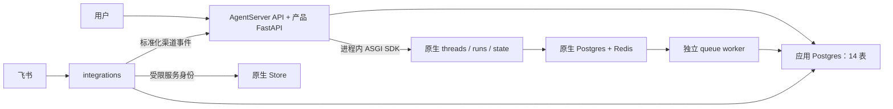

# Stage 10 包结构与依赖

业务 API 与 LangGraph 原生 API 在同一 ASGI 进程内。API 只受理业务命令、观察原生事实和提交产品结果；原生 queue worker 执行图；integrations 处理外部渠道和持久投递。

```text
financeclaw/
  api/
    bootstrap.py                 AgentServer 自定义应用与角色 lifespan
    native_auth.py               原生资源默认拒绝、Store 维护权限
    http/                        产品路由、认证、SSE、内部渠道入口
    application/
      turns/                     受理、命令、证据、交互、控制、观察、快照分发
      conversation_service.py    会话与 Journal 用例
      feishu_channel_service.py  标准化消息的业务语义
      feishu_card_actions.py     卡片决定的原子受理
      maintenance.py             已归档会话 checkpoint 回收
  agent_server/
    graphs/product.py            唯一 finance_agent 工厂
    graphs/                      顶层 Agent 与内部 Worker/Workflow
    middleware/ tools/           同一 Turn 的授权、预算与调用治理
    context/ memory/ domains/    上下文、记忆和领域能力
  integrations/
    __main__.py                  统一集成进程
    feishu/                      WebSocket、标准化事件 HTTP transport
    notifications/               原有投递租约、重试和不确定回执处理
    history.py history_indexer.py 历史与删除 outbox 消费
    maintenance.py               显式维护 CLI
  shared/
    turns/                       三种运行事实、授权、预算、租约、审计、投影
    conversation/                永久 Journal、渠道绑定、Manifest、保留规则
    channels/                    渠道数据契约与纯展示逻辑
    memory/                      跨进程 namespace 与删除契约
    notifications/               事务性通知意图和表
    artifacts/ audit/ outbox/    共享持久事实
    releases/ infrastructure/   静态发布清单与基础设施
  kernel/                        不依赖服务实现的领域契约
```

依赖规则由 `tests/stage5/test_package_architecture.py` 强制检查：api、agent_server、integrations 只依赖自身、shared 和 kernel；shared 只依赖 shared/kernel；kernel 不反向依赖服务。API 不导入 AgentFactory 或领域引擎；静态发布目录负责 API/Worker 的发布一致性。



`turn_id` 是唯一业务任务身份；`command_id` 区分 start/resume；`native_run_id` 仅是已核对的真实原生回执。租约只分配业务观察责任，不实现图执行队列。没有旧 BFF 导入壳、HTTP fallback 或第二套执行后端协议。
