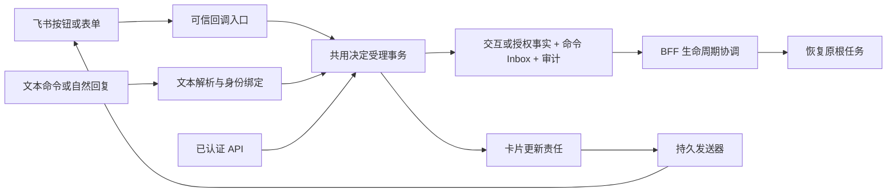

# 飞书交互卡片适配实施方案

日期：2026-09-10。状态：完成代码与 SDK 可行性评估，待实施。

## 1. 结论与范围

可以实现，建议采用“卡片优先、命令兼容”的交互方式。授权、撤权、回答、选择和审批都已有 BFF 业务入口，卡片负责展示与收集明确决定，继续使用现有根任务、交互实例、有限授权、审计和恢复操作。

主要工作包括：结构化卡片渲染、可信回调受理、卡片发送与更新的持久责任，以及多选契约扩展。仅给现有 Markdown 加按钮不足以完成可靠对接。

本方案的“授权”指当前 `/authorize <run_id>` 对应的 **FinanceClaw 单个任务的有限后台运行授权**。飞书账号登录、OAuth 用户令牌、应用权限申请与解绑是另一套流程，不由本卡片替代。首次用户请求仍按现有规则签发有限任务授权；本次不改变首次受理策略。

一期继续限定白名单内的原主体、原 P2P 单聊。群内多人审批、任意人员代批、批量批准多个动作不在本次范围内。

## 2. 用户交互映射

| 现有入口 | 建议卡片交互 | 提交语义 | 改造程度 |
|---|---|---|---|
| `/authorize` | 任务摘要、权限范围、授权时长；“授权并继续”按钮 | 显式签发受原任务上界约束的有限授权 | 复用业务，补授权版本和幂等控制 |
| `/revoke` | 任务控制卡中的“撤销授权”按钮 | 撤销当前任务后台授权，显示受理结果 | 复用业务，补旧卡片及竞态处理 |
| `/choose` 单选 | 少量短选项用按钮；较多选项用单选下拉加“确认选择” | 返回一个已发布的精确选项值 | 基本可直接映射 |
| `/choose` 多选 | 多选下拉或一组勾选器，加“提交选择” | 返回受约束的选项数组 | 必须扩展业务契约 |
| `/answer` 简单文本 | 输入框加“提交回答” | 形成 `answer={"text":"…"}` | 可直接映射 |
| `/answer` 结构化资料 | 按已声明 Schema 渲染输入框、下拉、勾选器，统一提交 | 形成与 Schema 一致的对象 | 需要有限的表单映射器 |
| `/approve`、`/reject` | 完整可审阅动作、“批准执行”“拒绝”按钮；可选原因输入框 | 携带原交互版本、决定及原动作摘要 | 复用审批契约 |

操作原则：

- 下拉和勾选默认只编辑当前表单，点击提交才形成业务决定。少量选项的按钮本身就是明确提交入口。
- 审批与授权必须有明确按钮；“我已阅读”勾选器不能单独触发批准，也不默认勾选批准。
- `input` 中的布尔字段可以使用勾选器，但填写资料不获得授权或审批含义。
- 单一文本澄清保留“也可直接回复”的能力；卡片与自然语言回答竞争同一个交互实例，先成功者生效。
- 不从自由文本问题推测枚举或字段。例如现有通用澄清只有 `text` 字段，就显示文本框；希望使用“公历/农历”下拉，需要发布明确的枚举交互契约。
- 主卡片展示问题、选项、动作和状态。交互 ID、revision、hash 等放在内部回传值及命令兼容说明中，不要求普通用户复制这些字段。

建议呈现示例：

```text
需要确认研究重点
希望重点研究哪个方面？

[价格与走势]  [风险与限制]  [综合概览]
有效期至 14:35
```

```text
审批请求 · 添加自选股
标的：AAPL
备注：本次请求提供的备注
影响：向你的自选列表写入一条记录

处理说明（可选）：[输入框]
[批准执行]  [拒绝]
```

提交成功后，保留原问题及用户决定，按钮禁用，显示“回答已受理，正在继续处理”或“拒绝已受理”。只有执行端确认完成后才能展示任务完成。

## 3. 已核实的项目基础与缺口

| 代码位置 | 当前能力 | 对方案的影响 |
|---|---|---|
| [channels/feishu.py](../../financeclaw/bff/channels/feishu.py) | 使用 `lark-channel-sdk`，注册 `raw/message` 等事件；提供文本和 Markdown 流 | 没有注册卡片决定入口；现有发送 Port 只有布尔成功，缺卡片实例与完整回执 |
| [feishu_channel_service.py](../../financeclaw/bff/application/feishu_channel_service.py) | 按 app/tenant/open_id/chat 绑定会话，已有全部目标命令 | 可抽出共用应用操作，回调无需伪造命令文本或创建新 Turn |
| [feishu_interactions.py](../../financeclaw/bff/application/feishu_interactions.py) | 命令解析、文本提示、简单自然语言回答判定 | 保留文本降级，增加独立结构化渲染器 |
| [kernel/interactions.py](../../financeclaw/kernel/interactions.py) | `input/choice/approval`；choice 最多 20 个唯一字符串；回答最大 16 KiB | 当前 choice 只接受一个选项，多选不能直接传数组 |
| [runs/interactions.py](../../financeclaw/bff/application/runs/interactions.py) | 校验版本、Schema、动作 hash、权限；决定与 resume 命令入账 | 卡片与 API/命令必须汇聚到这里；需要可组合的事务内受理函数 |
| [runs/service.py](../../financeclaw/bff/application/runs/service.py) | `reauthorize/revoke_authorization`；授权有 revision；scope 不超过原快照 | 重授权目前没有请求幂等键和预期 grant revision 参数，重复调用会再次续期 |
| [tools/interaction.py](../../financeclaw/agent_server/tools/interaction.py) | Agent 恢复时再次检查回答 | 多选必须同时修改 BFF 与 Agent，不能只改客户端 |
| [notifications/facts.py](../../financeclaw/shared/notifications/facts.py)、[通知仓储](../../financeclaw/bff/notifications/repository.py) | 持久通知目标、事件、固定正文与 UUID、回执及 uncertain 分类 | `text_reply_v1` 在多处固定，不能只修改发送器的消息类型 |
| [通知 SDK 适配器](../../financeclaw/bff/notifications/feishu.py) | 底层 `areply`，核对原消息、chat/parent 与回执 | 适合扩展成持久卡片发送；必须保留固定目标与未知结果语义 |

特别说明：当前数据库约束每个根任务最多一个 pending 交互。文本渲染器支持列表并不代表业务已经支持同根并行审批。本次表单的“多个字段”属于同一个交互，不新增多交互批量提交协议。

### 3.1 SDK 能力与回调限制

本地安装版本为 `lark-channel-sdk 1.4.0`，已逐项检查源码：

- `FeishuChannel` 注册了 `card.action.trigger`，并提供 `cardAction` 事件。
- 回调模型包含 `value`、`option/options`、`form_value`、`input_value`、`checked`，以及操作者、消息和聊天上下文。
- 高层 `CardActionEvent.operator` 没有 tenant；高层构造还未正确透传所有 `name/option` 字段。业务规范化时应从验证后的原事件提取必要字段并做一致性检查。
- `_on_p2_card_action_trigger()` 先调度异步处理，再返回空 `P2CardActionTriggerResponse({})`。`cardAction` handler 的返回值不会成为同步 toast/card 回包。
- `on_raw_event()` 的订阅也不能替换已有回调返回值，不能靠它解决“先落库再确认”。
- SDK 有 CardKit 实例创建、卡片引用发送及全量更新模型；全量更新请求包含 `uuid/sequence`。

官方 [Channel Reference](https://github.com/larksuite/channel-sdk-python/blob/main/docs/reference.md) 也明确提供卡片事件、JSON 2.0 卡片发送、更新入口和底层 Dispatcher/OpenAPI 接入方式。

**推论：** 沿用高层 `cardAction` 可以做交互原型及异步更新，但其“平台已收到响应、业务尚未落盘”的退出窗口不适合作为正式授权/审批受理保证。修改 SDK 去重缓存或仅在异步 handler 增加入站表，都不能消除这个窗口。

## 4. 技术结构与接收方式



三层职责：

1. **渠道适配层**验证来源、规范化事件、返回平台响应；禁止直接调用 Agent Server resume。
2. **应用层**定位原会话、构造类型化决定、在根锁下校验与入账。命令和卡片调用同一事务核心。
3. **展示层**把安全交互投影转换为卡片；发送器负责卡片创建、回复原消息、更新和回执，网络调用在业务事务外。

### 4.1 正式回调接入选择

推荐优先采用 **BFF 独立 HTTPS 卡片回调入口**，普通消息继续使用当前 WebSocket。新增建议路由 `POST /channels/feishu/card-callbacks`，通过 SDK 底层 Dispatcher 处理新版卡片回调，避免高层空响应逻辑。这是新增接口方案，不是当前已有接口。

部署时，在飞书的事件与回调配置中分别设置消息事件与卡片回调订阅；P0 必须验证目标应用是否允许该组合，以及入口的 HTTPS 可达性、验签、解密和 challenge 响应。不能将这个入口直接套用终端用户 Bearer 认证，也不能接受未验证的普通 JSON 决定。

如果部署只允许出站长连接，则采用 **一个可控的底层 WebSocket/Dispatcher 接收层**，统一承接消息与卡片回调，复用 SDK 的正常化和发送能力。此路线需要替换现有接收层并回归消息过滤、去重、线程桥接、重连和停止行为，单列额外工作量。

两条路线最终调用同一个回调应用服务。不要给同一个应用另外启动一条只处理卡片的 WebSocket；多连接分发可能使消息落到不处理该事件的连接。也不要在运行时篡改 SDK 的私有 callback map。

### 4.2 回包与业务受理

以“收到回调后 2 秒内完成本地受理与响应”为工程目标。平台响应上限、错误 toast 与重投行为在 P0 对照新版回调文档及实测固定，当前不能把普通消息事件的重试规则套给卡片。

正常路径：验证来源和字段 → 查询本地绑定 → 短事务完成决定/授权与卡片更新责任 → 提交事务 → 返回“已受理”toast。响应链路中不等待模型、远端 resume、飞书查询或卡片更新 API。

并发与超时处理：

- 独立的有界回调受理容量，避免排在当前 `_chat_locks` 的长时间流式展示后面；业务串行性依赖数据库根锁。
- 数据库锁等待和语句期限须短于回包预算；事务未提交不能返回“已受理”。提交结果不明确时返回中性提示，不能断言失败。
- 相同事件重投从持久回执取结果；“平台收包成功”“决定已受理”“远端恢复完成”是三个状态。
- 正式回包先只返回 toast。卡片全部通过同一个持久更新通道修改，避免同步回包卡片与异步更新争抢版本。
- 业务提交后进程退出，恢复责任已在现有命令 Inbox；卡片更新也能独立补做。

## 5. 回传协议、身份与幂等

卡片上的回传 `value` 只放版本化路由信息，例如：

```json
{
  "protocol": "financeclaw.feishu.interaction.v1",
  "view_id": "opaque-server-issued-view-id",
  "intent_id": "opaque-server-issued-intent-id",
  "op": "interaction.submit"
}
```

上述内容是拟定的业务回传协议，不是完整飞书卡片 JSON。`form_value` 单独承载用户输入，字段名从服务端冻结的映射中读取。

服务端为 view/intent 持久保存：app、tenant、原主体、chat、Conversation、root、原始用户消息、卡片实例、已发送消息 ID、渲染版本、交互 ID/revision/action_hash，或预期 grant revision、展示的授权范围与期限，以及到期时间。

身份与防篡改要求：

- app 来自配置及经过验证的 envelope；tenant/operator/chat 来自经过验证的回调，必须与持久绑定一致。不能从 `value` 接受主体、scope 或 task 归属。
- 区分原用户消息 ID 和机器人卡片消息 ID。原消息仍是通知目标；回调中的消息 ID 应匹配该 view 对应的机器人卡片消息。
- 回调不得调用 `get_or_create_channel_conversation` 给陌生点击者新建会话；只能读取已经存在的绑定。
- 卡片被转发、跨聊天点击、白名单撤回、未知 view、意图与组件不匹配时，不执行决定。持有 view/intent ID 本身不是授权。
- 若用户点得快于发送回执落库，或发送结果是 uncertain，先保存最小待核验记录并提示“正在核验该卡片”；通过独立核验取得机器人发送者、chat、卡片实例/内容及原消息关联证据后，才允许业务受理。不能直接用首次回调中的消息 ID 覆写发送回执。
- 仅存必要字段；不保存完整原始事件、平台凭据或长期回调 token，日志不输出表单正文。用户字段按字节与深度限制，审批展示始终使用安全投影。

两层幂等：

| 层级 | 建议键及处理 |
|---|---|
| 平台事件回执 | `(app_id, event_id)`，保存规范化 payload hash 和处理结果；同键不同内容拒绝。事件 ID 的存在与稳定性须在 P0 验证，不能退化为卡片消息 ID |
| 业务提交 | 服务端签发的 intent 及规范化决定 hash；同一有效提交跨事件重复点击返回原结果，不重复执行 |

表单校验失败不消耗有效决定机会。用户修改后可重新提交；业务提交成功后再修改答案则返回“此问题已处理”。同一卡片的 approve/reject 可有不同 intent，但最终竞争同一个交互实例，数据库只允许一个决定。

现有 `InteractionRepository.decide()` 对不同 response_key 的第二次提交会冲突。卡片受理层可以把重复的同一 intent 映射回首次 response_key，或者读取已决定状态给出友好反馈；不能把“同交互、不同决定”统一当成重试成功。命令与卡片同时提交时保留先提交者，后到者展示现状。

## 6. 业务契约调整

### 6.1 授权与撤销授权

卡片展示任务摘要、允许的能力、授权时长/截止时间与当前状态。“授权并继续”使用服务端签发的明确授权意图，不能只携带 root ID。

授权范围上界为原根任务快照与当前渠道身份允许范围的交集；若以后支持 scope 勾选，还必须与用户本次选中的范围求交集。一期直接展示固定范围，不引入任意权限编辑。期限仍受 `bounded_authorization` 和服务器配置约束；当前配置默认 1800 秒，展示与受理必须读取实际配置而非写死 30 分钟。

拟扩展：

```text
reauthorize(run_id, ..., command_id, expected_grant_revision, authorization)
revoke_authorization(run_id, ..., command_id, expected_grant_revision)
```

在同一根锁事务内完成命令回执检查、授权版本比较、grant 更新、审计与唤醒。重放返回原结果，不从重放时间重新计算授权期限。AuthorizationEvidence 的来源摘要绑定本次已验证事件；卡片读取、刷新、重发不签发新的用户授权。

必须覆盖：

- 授权 → 撤权 → 点击旧授权卡：旧 grant revision 失配，不能重新开权。
- 授权 → 撤权 → 重新授权 → 点击旧撤权卡：不能悄悄撤销新授权，提示读取最新状态并重新操作。
- 有效授权下接受回答会更新 grant revision；任务控制卡也应更新，不能只监听显式 `/authorize`。
- 终态或取消中的任务不能重新授权。已过期交互也不能因为任务重授权而自动延期。
- 撤销后台授权之后，后续受治理动作被拒绝；已在途的外部动作可能仍完成。卡片显示“后台授权已撤销”，不显示“所有执行已停止”。
- `/reject` 是拒绝当前具体动作；`/revoke` 撤销整个任务的后台授权；`/cancel` 请求停止任务；`/mute` 关闭通知。四者分别展示和执行。

现有文本 `/authorize`、`/revoke` 也应进入相同命令回执机制，用飞书消息 ID 去重。API 可以增加可选幂等键与预期版本支持；卡片入口强制使用二者。所有入口的授权变化都生成最新卡片投影。

### 6.2 单选与多选

一期保持 `choice` 的单字符串回答。按钮/下拉使用稳定选项编码，服务端通过冻结映射还原精确 `options` 字符串；不要把展示标签或选项序号当作不经校验的值。

二期扩展 `InteractionPoint`：

```text
selection_mode: single | multiple，默认 single
min_selected / max_selected：仅 multiple 有效，并受 options 数量约束
```

`single` 仍接受一个字符串；`multiple` 接受字符串数组，拒绝未知值、重复值、数量越界和错误类型。按发布的选项顺序规范化集合，再计算决定 hash，使 `[A,B]` 与 `[B,A]` 具有相同业务含义。是否允许空集由 `min_selected` 声明。

同步修改 BFF 校验、Agent 恢复校验、公开投影、Tool 契约描述和命令帮助。命令示例：`/choose <id> <revision> ["价格与走势","风险与限制"]`，仅对已声明 multiple 的交互有效。

新增声明字段会进入发布快照与指纹。发布新版本并保留旧版本兼容解码，不能因默认字段序列化变化导致正在等待的旧任务无法通过发布验证。

如果只是某个资料对象中的数组字段，可以直接用已有 `input` 的 JSON Schema 表达并渲染多选控件；这不等于 `/choose` 已支持多选，必须区分两条语义。

### 6.3 输入框与表单

渲染器只处理受控 Schema 子集：

| Schema | 控件与转换 |
|---|---|
| string | 文本框；保留原文本，执行长度和 pattern 校验 |
| string + enum | 单选下拉；通过冻结映射还原枚举值 |
| array + string enum | 多选下拉/勾选器组；提交数组并执行数量、唯一性校验 |
| boolean | 勾选器；明确区分 false、未提供及可选字段 |
| integer/number | 文本输入加显式数值解析，拒绝非法数字及 NaN/Infinity |
| 简单 object | 一个表单，按发布字段顺序及标签渲染，整体提交 |

不支持的嵌套/组合 Schema 使用原命令或已认证 API。不能静默遗漏字段、丢弃未知字段后继续提交，也不能把任意字符串猜成布尔或日期。可选字段空值的省略规则、必填 false 的意义都由映射明确规定。

建议通过代码内的版本化 UI 提示配置指定标签、顺序、帮助与控件偏好。提示只能影响展示，不能改变业务 Schema、作用域或动作内容。客户端必填提示用于体验，最终仍执行 BFF 的完整 JSON Schema 校验。

### 6.4 审批

卡片绑定服务端原始 `action_hash`，回调与当前交互快照逐项比对；不能对脱敏后的 `public_interaction.action` 重新计算 hash。

展示应完整覆盖用户判断所需的动作类型、对象、参数及影响。保留现有“大动作不能只显示截断正文就审批”的规则：如果关键内容无法安全完整展示，提供受认证的完整查看/审批入口，不提供直接批准按钮。具体页面尚不存在时，应先交付该页面或继续使用已认证 API，不能放无效链接。

可选原因最大长度沿用现有 2000 字符。批准与拒绝只使用 `allowed_decisions` 中允许的动作；不引入 edit、更改参数后批准、模型代填批准等行为。拒绝原因可随原生 resume 传递，所有完成状态仍取自执行事实。

## 7. 卡片创建、通知与更新

推荐使用 **JSON 2.0 + CardKit 独立实例 + 版本化持久更新**。每个业务交互一张卡，任务授权控制使用单独的任务控制卡；不复用当前仍在输出的 Markdown 流卡承载决定，避免流更新覆盖按钮或已提交状态。

首次受理时增加简短的任务控制卡入口，显示当前授权及“撤销授权”；否则只改造到期授权提示，用户仍无法方便地发现撤权操作。该卡引用原有 root/通知目标，不新增最终结果订阅。

### 7.1 最小数据设计

| 数据 | 建议内容及约束 |
|---|---|
| `channel_card_views`（新增） | view 与业务版本、完整渠道绑定、固定展示快照/摘要、CardKit ID、消息回执、当前期望/已确认展示版本、期限 |
| `channel_action_receipts`（新增） | 平台事件 ID/hash、intent、业务提交 hash、处理结果、原 response_key/operation_id；与决定或授权同事务 |
| 卡片更新 Outbox（新增或扩展通用投递操作） | view、sequence、固定内容/UUID、状态、租约、重试与未知结果；业务投影变化时同事务写入 |
| `notification_deliveries`（扩展） | 明确 `message_type/render_version`、冻结 card 引用或 text 内容、投递回执；不把卡片 JSON 送入文本切片器 |

以上表名是拟定名称。receipt 的唯一索引、view/intent 生命周期和过期清理需在迁移中定义；未终结业务和仍可能重放的回执不能提前删除。表单答案只保存受业务审计所需的最小副本并沿用受保护数据的访问控制。

需要抽出支持传入同一 Session 的事务内命令函数。不能先记录 `receipt=accepted`，再在另一事务里调用当前 `respond/reauthorize`，否则会产生有回执但无决定的窗口。

### 7.2 投递策略

新增 `interactive_reply_v1` 等明确策略：交互、授权及任务控制事件使用卡片；较长的最终结果继续沿用现有文本固定分片。旧 `text_reply_v1` 继续可读、可发。

必须一起修改 `bind_target/target_valid`、事件冻结、materialize、claim、gateway、发送器版本/心跳检查和通知查询，不能只改 `.msg_type("text")`。

具体发送过程：

1. 冻结卡片内容并创建 CardKit 实例，保存成功的 card ID。
2. 通过 SDK 底层 `areply` 发送该 card 引用，固定原用户消息和 UUID，保存真实消息回执。
3. 回答、审批、授权、撤权、自然语言或 API 决定，以及过期/替代/取消/终态变化，都产生卡片更新责任。
4. 更新操作按 view 分配持久、单调的 sequence，发送固定内容与 UUID；验证 CardKit 的服务端顺序保证后用于防止旧更新覆盖终态。

CardKit 创建与消息发送是两个不同操作。创建响应丢失可能留下未发送的孤立实例；未取得并保存 card ID 前不能发送消息。多个创建尝试只允许持久记录选定的实例被发布。

发送器继续使用底层接口而非高层自动回复降级，保留现有“原目标、原内容、原键”的约束。卡片更新 token 不作为长期定位或业务幂等键；更新使用持久 card ID。

### 7.3 失败与降级

- 卡片不支持某 Schema、超出已验证大小，或在发送前已明确不可渲染：冻结为文本兼容通知。
- 平台明确拒绝卡片且可证明未发送：记录失败后生成有引用关系的文本替代投递，不能修改旧发送记录的内容并复用旧 UUID。
- 发送超时或回执不完整：保留 uncertain，不自动换键再发一份文字或卡片。幂等恢复窗口沿用现有证据机制，卡片消息须另行验证。
- 卡片更新失败：决定仍有效，重试只更新界面，绝不重提 resume。旧界面按钮即使可见，服务端也拒绝过期决定。
- 卡片被撤回或超出允许更新时间：停止更新，通过已验证的原会话展示可用状态/命令；不能改投别的接收者。
- 回调成功后的卡片收尾不依赖“未来还会有任务进度通知”；即使通知被静音，也应按明确的渠道策略处理本次用户操作反馈与旧入口关闭。

不开启持久通知的会话也使用同一交互卡片登记与更新机制，只创建当前交互展示责任；不因此自动订阅最终结果。前台流遇到等待决定时结束，并交由结构化交互卡展示。两个模式共用渲染与业务受理逻辑。

## 8. 代码改造清单

| 模块 | 实施内容 |
|---|---|
| `bff/channels/feishu.py` | 规范化卡片字段；明确 transport 与回包策略；保留现有 SDK 导入线程隔离 |
| `bff/http/` | 若采用 HTTPS 路线，增加独立验签/解密/challenge/回调响应路由 |
| `bff/application/feishu_card_actions.py`（新增） | view/intent 校验、字段还原、幂等和共用业务入口调用 |
| `bff/application/feishu_cards.py`（新增） | 纯函数渲染、Schema 映射、提交后/过期状态、文本降级 |
| `bff/application/feishu_channel_service.py` | 抽出命令操作；挂接结构化交互展示；自然语言回答后同步收尾卡片 |
| `bff/application/runs/interactions.py`、`runs/service.py` | 提取可组合事务核心；grant CAS/命令幂等；公开安全状态；UI 更新责任 |
| `kernel/interactions.py`、`agent_server/tools/interaction.py`、发布目录 | 二期多选字段及双端校验、Tool 描述、版本兼容 |
| `shared/notifications/`、`bff/notifications/` | 多种消息类型、卡片实例创建/发送/更新、状态与回执 |
| `shared/infrastructure/migrations/` | 新增增量迁移；有数据的开发库不可仅修改 `0001_initial` 或要求重建 |
| 配置与运维手册 | 卡片展示开关、回调模式、发送器兼容版本、灰度、监控与回退步骤 |

## 9. 实施阶段与工作量

估算以一名熟悉本项目的开发者、具备飞书测试应用和原单聊为前提，为开发与验证人日，不是排期承诺。

| 阶段 | 交付 | 验收关口 | 估算 |
|---|---|---|---|
| P0 能力验证 | 五种组件最小 JSON、真实回调字段样本、可控回包原型、CardKit 创建/更新证据 | 确认 transport、表单提交值、响应预算、sequence、权限及消息回执；不接真实业务副作用 | 1–2 人日 |
| P1 业务与交付基础 | 同事务回执、view/intent、授权 CAS、卡片 Outbox、发送器及迁移 | 重投、双击、重启、撤权竞态不重复形成决定或延长授权 | 3–4 人日 |
| P2 一期完整交互 | 授权/撤权、approve/reject、单选、简单输入；文本与 API 联动收尾 | 两种通知模式贯通，旧卡片无效，用户无需复制 ID/hash | 2–3 人日 |
| P3 多选与结构化表单 | multiple 契约、有限 Schema 渲染、勾选器、发布兼容 | 数组与字段校验双端一致，旧发布等待任务可继续 | 2–3 人日 |
| P4 灰度验收 | 移动/桌面端真实联调、故障注入、运维说明及指标 | 真实回调及未知投递边界通过，回退不会中断已有卡片受理 | 1–2 人日 |

合计约 **9–14 人日**。若没有可用 HTTPS 入口，需要替换为可控的单 WebSocket 接收层，预计额外 2–4 人日；P0 后再据验证结果收敛。可以先交付 P0–P2 的完整一期，再继续多选。

建议功能开关分别控制“生成新卡片”和“接收已有卡片回调”。回退只停止生成新卡片，已发送卡片在有效期内继续受理并收尾；不能通过关掉回调让用户已经收到的审批卡失效。旧发送器必须识别不兼容策略并拒绝错误消费，不得把 JSON 当正文发出。

## 10. 验收用例与指标

| 类别 | 必须通过的用例 |
|---|---|
| 正常业务 | 六类命令等价操作；单选下拉、按钮、输入、勾选与多选；根任务及最终通知目标不变 |
| 表单 | 改选不提交、必填缺失、false 与缺省、空数组、重复/未知选项、中文与换行、超长文本、数字解析及非法字段 |
| 审批 | action_hash 不符、关键动作未完整展示、不同 allowed_decisions、原因传递、不能用文本同意或勾选替代批准 |
| 身份 | 跨租户/用户/聊天、转发卡、未知卡、变更白名单、缺少 tenant、伪造 value；回调不新建 Conversation |
| 并发重放 | 相同事件与新事件双击、同 intent 改答案、卡片/API/命令竞争、旧事件晚到、旧卡回答下一次问题、进程重启 |
| 授权 | 重复授权不续期，授权→撤权→旧授权点击，重授权→旧撤权点击，回答更新 grant 后刷新控制卡，终态/取消/交互过期 |
| 事务故障 | 提交前退出、提交后回包前退出、数据库超时/提交结果未知；有成功回执必有持久决定和恢复责任 |
| 交付 | 卡片创建响应丢失、发送回执丢失、早到点击、同 UUID 去重、乱序更新、旧发送者回执、更新失败不重新执行 |
| 生命周期 | 自然语言与 API 答复关闭卡片；expired/superseded/cancelled/授权失效及终态显示正确；两个通知模式一致 |
| 灰度 | 关闭新卡片生成仍可处理旧卡片；旧 text 记录继续投递；移动与桌面客户端字段、禁用态及错误提示一致 |

建议监控：callback 受理耗时 P95/P99、决定拒绝原因分类、重复事件数、过期卡点击、卡片更新积压、uncertain 年龄、通知回执缺失与发送器兼容状态。标签不携带 open_id、用户输入或高基数的完整动作内容。

上线门槛是“决定唯一、授权不被旧卡改写、已受理动作可恢复、失败反馈清楚”，不能只以“按钮可以点、卡片能显示”验收。

## 11. 本次验证与外部参考

本次执行了以下离线回归，结果 **17 passed**：

```bash
.venv/bin/python -m pytest -q \
  tests/stage6/test_feishu_channel.py \
  tests/stage8_hotfix/test_feishu_clarification.py \
  tests/stage8/test_notification_sdk.py
```

覆盖现有渠道基础、自然回复/显式审批与重放边界，以及通知底层 SDK 请求/回执；没有调用真实飞书发送，也没有验证本方案尚未实现的新卡片路径。SDK 导入出现两个弃用警告，不影响本次测试结果。

已读取的官方资料：

- [官方 Channel SDK Reference](https://github.com/larksuite/channel-sdk-python/blob/main/docs/reference.md)：卡片事件、发送/更新与底层接入入口。
- [官方 Channel SDK 仓库](https://github.com/larksuite/channel-sdk-python)：维护来源；具体行为以本次本地安装的 1.4.0 源码为依据，不把 main 分支当作版本锁。
- [官方 CardKit 使用说明](https://github.com/larksuite/channel-sdk-python/blob/main/docs/cardkit-streaming.md)：实例创建、引用发送与更新的使用背景。

实施前需复核的开放平台契约入口：

- [卡片回传交互](https://open.feishu.cn/document/feishu-cards/card-callback-communication)。
- [卡片 JSON 2.0 结构](https://open.feishu.cn/document/feishu-cards/card-json-v2-structure)。
- [回复消息接口](https://open.feishu.cn/document/server-docs/im-v1/message/reply)。

本次开放平台文档页面正文未能稳定加载，因此回调的精确时间限制/重投行为、组件完整 JSON 属性、CardKit 更新窗口与服务端 sequence 行为、目标客户端最低版本和应用所需权限，均作为 P0 必验项，不声称已完成真实渠道验证。
