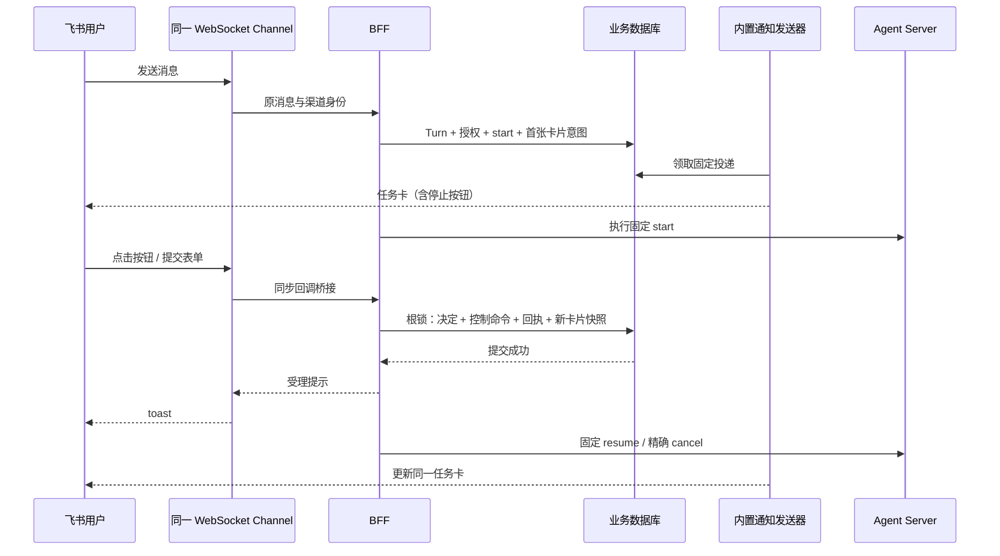

# 飞书交互卡片实施方案与实现记录

日期：2026-09-10。按“应用尚未上线、直接实现并清理废弃代码”的要求更新。代码采用唯一新路径，不设旧版本兼容、灰度或双栈切换。

## 结论与交互

授权/撤权、`/choose`、`/answer`、`/approve`、`/reject` 可以接到飞书卡片，后端共用原有业务事务。实现已包含单选、多选、勾选器和输入框。

**没有查到机器人可替换飞书原生输入框发送按钮的开放接口。** 输入框属于飞书客户端；据当前开放文档与 SDK 能力，采用每轮任务卡片上的“停止本轮”，这是本次实际实现的入口。并不声称修改了原生发送按钮。

| 场景 | 用户操作 | 后端行为 |
|---|---|---|
| 发起任务 | 发送消息，收到“正在处理”任务卡 | 原受理事务登记卡片，内置发送器交付；无须等待模型首字 |
| 停止 | 点击“停止本轮” | 原子持久化取消、关闭待答事项；显示“正在停止本轮”，远端确认后显示“本轮已停止” |
| 授权 | 授权失效卡中点击“授权并继续” | 更新有期限、与原任务及当前渠道权限相交的授权；不改原输入和发布快照 |
| 撤权 | 点击“撤销后台授权” | 后续受治理操作不能使用已撤销授权；允许观察已经产生的结果 |
| 少量单选 | 点击一个选项按钮 | 按冻结选项编码还原精确值 |
| 较多或较长单选 | 单选下拉，再提交 | 同 `/choose` 入口，提交前的编辑不构成决定 |
| 多选 | 多选下拉，再提交 | 按发布上下界校验列表，拒绝未知、重复和超界选项，按发布顺序规范化 |
| 资料回答 | 填写表单，点击“提交回答” | 字符串、数字、布尔值、枚举、枚举数组显式还原后按完整 Schema 校验 |
| 审批 | 查看动作，填写可选说明，点击“批准执行”或“拒绝” | 绑定原交互版本和动作摘要，一次决定对应一个恢复操作 |
| 完成 | 卡片关闭操作，最终正文回复原消息 | 正文来自唯一 Journal，长文本有序分片 |

撤权和停止是不同业务操作：撤权控制后续权限；停止终结本轮执行。已经发生的外部副作用无法通过停止按钮自动撤回。停止确认前不允许在同一会话开启重叠的新轮次，确认后可发送新消息。

## 数据流

回调不进入普通消息合并队列，也不交给模型解释。接收与回复依旧只使用一个 WebSocket Channel；CardKit HTTP 客户端不建立第二条连接。

## 实现边界

### SDK 回包与可靠受理

固定 `lark-channel-sdk==1.4.0`。该版本高级卡片事件监听器异步派发并立即空回包，监听函数的返回值不能作为事务确认。因此在 `FeishuChannelAdapter._build_channel` 内用一个局部子类覆盖 SDK 同步 `_on_p2_card_action_trigger`，经官方 `obj_to_dict` 保留 header、operator、context、value 和 form_value，构造官方回包对象。

SDK 后台线程把短事务桥接到 BFF 事件循环，等待上限 2.5 秒。数据库逻辑在线程池运行；PostgreSQL 使用短锁等待/语句超时，并在事务超过受理预算时回滚。**仅在提交成功后返回成功 toast**。桥接超时返回“正在确认”，不宣称成功或失败、不取消可能已提交的决定。关闭 Channel 时停止新受理并排空已经桥接的回调，再释放业务数据库。

同步 SDK 回调、真实请求模型、HTTP 序列化和 toast 对象有离线协议测试覆盖。这是对固定 SDK 的适配，升级 SDK 必须重新核对这个入口，不能仅放宽依赖版本。

### 权限、幂等和并发

按钮值仅含不可变通知视图 ID、操作及选项编码。身份、授权范围、动作哈希和回答 Schema 从可信配置及数据库取得。

受理依次验证：应用与事件类型、租户、原操作者允许列表、原会话绑定、原卡片消息 ID、原视图是否实际提供此按钮，以及业务交互版本、期限、精确选项、Schema、动作摘要、有效授权和当前执行位置。转发卡、其他单聊、其他主体、客户端添加权限、未知控件字段不能改变任务。

同一根事务锁串行化回答、授权变更、停止和结果收尾。`run_inbox` 保存两级回执：平台 event ID 防重推，视图＋操作防重复点击；再次提交同一键却改变内容会被拒绝。多选先规范化再计算语义摘要，改变列表顺序不产生第二次 resume。原卡片的重放也不能给下一题提交答案或延长授权。

停止请求先封闭后续派发。派发前停止不会创建远端 run；执行中停止命中当前绑定回执；处于不确定提交时仍沿用原操作核对，不能把“未找到”当作“从未执行”。停止不等待网络后才入账。

### 表单契约

`InteractionPoint` 新增 `selection_mode`、`min_selected`、`max_selected`，BFF 和 Agent 恢复端使用同一个 `normalize_answer`。Schema 仍来自发布声明，不接受模型或客户端改写。

表单支持最多 12 个顶层字段：string → input；integer/number → input 后显式解析；boolean → checker；字符串 enum → select_static；字符串 enum 数组 → multi_select_static。字段名使用固定 `f0...`，枚举使用 `o0...`，避免把业务键直接作为客户端权限来源。选项数、Schema 和回答体积有界；金额等数值的业务限制仍由 Schema 判断。

嵌套/联合/条件 Schema、不能完整展示的审批动作或过大表单不提供不完整的审批按钮：卡片给出明确的命令/API 处理入口。普通消息的直接文本澄清和显式 slash 命令继续作为产品入口，复用同一受理逻辑；这不是旧版本兼容层。

### 单卡更新与失败处理

每轮固定一个 `notification_target`。CardKit 创建实例后先保存 ID，再用原消息 reply 发布卡片引用并记录消息 ID；后续 full update 使用同一实例、固定 UUID 和单调序号。

尚未投递的过时卡片快照可合并跳过；已经尝试且结果不明确的投递不能跳过。首发取得明确回执前，后续卡片更新不能越过它。成功首发后只更新该消息，回答不会另建订阅。停止、撤权及问题生命周期再次在业务入口核对，展示延迟不能扩大权限。

卡片创建失败只重试尚未发布的创建；孤立实例不能变成另一个消息目标。已确认失败且从未发布的实例可以被新视图替代。真实消息发送/更新丢响应则记 `uncertain`，不换 UUID、不重跑模型。当前默认不自动恢复未知结果；只有有证据的服务幂等窗口才允许原键恢复。这是故障语义，不是灰度策略。

BFF 开启飞书时自动启动通知发送循环（空闲轮询默认 0.2 秒）。可额外启动无 WS 的独立发送进程，共用数据库租约。`/ready` 检查执行生命周期、Channel 和发送者心跳；心跳不代表每条消息已送达。

## 业务表整改与废弃代码清理

完成 **22 → 20 张表**，详见[数据模型与持久化设计](../03-数据模型与持久化设计.md)。

| 整改 | 结果 |
|---|---|
| `backend_attempts` | 回执并入 `run_operations`，保留后端身份唯一索引与不可替换约束 |
| `run_control` | 删除部署门闩、CLI、派发分支和相应初始化操作 |
| 卡片状态与回执 | 复用通知 target/event/delivery 与 Inbox，未新增卡片状态表或回调幂等表 |
| 通知旧分支 | 删除通知开关、delivery_mode、content_version、前台 Markdown stream、旧 attention/interaction 通知渲染 |
| 运行文档与实验 | 更新启动方式、通知配置、数据模型和原生实验脚本，使用唯一当前 schema |

保留 `run_executions` 的冻结执行/治理快照与 `root_runs` 的协调状态，保留通知事件与投递的一对多关系、审计与发送回执的不同事务事实，避免仅为减表数丢失约束。初始迁移直接描述当前结构；使用新空库验证，不自动重置本机数据库。

## 代码入口

| 文件 | 职责 |
|---|---|
| `bff/application/feishu_cards.py` | 卡片、有限表单和字段还原 |
| `bff/application/feishu_card_actions.py` | 可信回调校验、根事务、幂等回执 |
| `bff/channels/feishu.py` | 同一 SDK Channel 同步回包桥接与生命周期 |
| `bff/application/runs/controls.py` | API、命令、卡片共用停止/授权/撤权事务 |
| `bff/application/runs/interactions.py` | 同事务回答受理、恢复命令与最新卡片 |
| `kernel/interactions.py`、`agent_server/tools/interaction.py` | 多选契约与双端验证 |
| `shared/notifications/*`、`bff/notifications/*` | 原子快照、卡片创建/更新、投递租约与回执 |
| `shared/execution_ledger/receipts.py`、`root_repository.py` | 复用 Inbox、操作回执与根锁 |
| `shared/infrastructure/migrations/versions/0001_initial.py` | 当前 20 表初始结构 |

路径均相对 `financeclaw/`。

## 验证与实际接入

离线验收覆盖：派发前/执行中停止、停止后新一轮、输入、单选/多选、批准/拒绝、有限授权与重放、过期问题、转发/伪造身份、改变重复输入、事务中断、同一卡片更新、CardKit 真实 SDK 请求序列化及同步回调确认。原有执行恢复、Journal、通知失败、Schema 升降级测试继续运行。最终离线回归 `pytest -q -m 'not external'`：394 passed、3 skipped、2 deselected；Ruff、`git diff --check` 和离线依赖锁校验通过。SDK 有两项依赖层弃用警告。

需要在飞书后台启用机器人、同一长连接的 `im.message.receive_v1` 与 `card.action.trigger`，以及消息读取/回复、CardKit 创建和更新权限，然后发布应用权限。真实租户移动/桌面客户端的控件展示、回调时延、服务端体积限制和幂等窗口仍需接入验收；离线 SDK 测试不等于真实租户联调。

参考：飞书[卡片回调通信](https://open.feishu.cn/document/feishu-cards/card-callback-communication)、[表单容器](https://open.feishu.cn/document/feishu-cards/card-components/containers/form-container?lang=zh-CN)、[输入框](https://open.feishu.cn/document/feishu-cards/card-components/interactive-components/input?lang=zh-CN)、官方 SDK [事件参考](https://github.com/larksuite/channel-sdk-python/blob/main/docs/reference.md)及 [CardKit 文档](https://github.com/larksuite/channel-sdk-python/blob/main/docs/cardkit-streaming.md)。网页部分内容动态加载，原生按钮边界是基于已公开能力的判断，不代表飞书内部不存在未公开能力。
