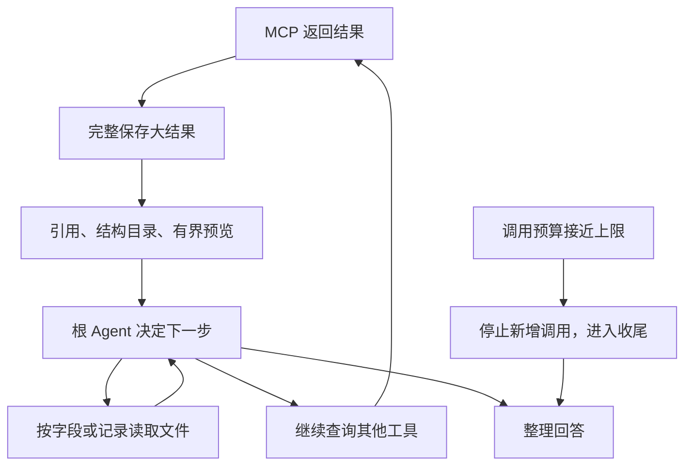

# MCP 大结果归档、结构化读取与预算收尾实施方案

**状态：代码已实现，自动化回归及合成酒店回放通过，已部署到本地 Docker。日期：2026-09-16。真实保存回包回放、真实模型和飞书业务验收尚未完成。具体结果见第 13 节。**

本方案承接 [通用 MCP 与 RollingGo 接入方案](MCP-工具主动发现与配置化接入实施方案.md)，解决工具已经调用成功，但根 Agent 为读取大结果消耗过多调用次数，最终无法回答的问题。

## 1. 先看改完后的效果

**大结果完整存入现有 Artifact 文件，模型收到文件引用、结构目录和少量预览。需要细节时，直接读取指定字段或若干条完整记录。接近调用上限时，使用预留的一次模型调用整理已有信息。**

以酒店推荐为例：

1. 酒店搜索成功，完整回包存入文件。
2. 根看到“有 10 家酒店、酒店列表位于哪个路径、有哪些字段”，以及少量候选预览。
3. 根读取候选的名称、位置、星级和价格；需要时查询几家酒店的详情。
4. 详情也返回文件引用。根读取房价方案的必要字段，不再从第一个字符开始翻完整归档。
5. 根根据实际读取的数据回答；预算不足时说明已确认的信息和未完成的部分。



根继续负责选择工具、委派和最终回答。此次改造不新增旅行 Agent，不使用 `return_direct`，也不引入工具选择小模型。

## 2. 为什么需要改

2026-09-15 排查的失败轮次为 `d126e34e-ce76-40c3-ac83-bea0be646219`。以下为当时数据库、原生执行状态和已保存回包的核对结果，属于历史诊断基线。

| 操作 | 次数 |
|---|---:|
| 读取筛选标签、搜索酒店 | 2 |
| 分页读取搜索结果 | 3 |
| 查询三家酒店详情 | 3 |
| 读取三份详情 | 3 |
| 接下来准备再读取两页 | 2，因超限未执行 |

已经执行 11 次，模型又提出 2 次调用，因此原生中间件检查出 `13/12`。同一轮也用满了 8 次模型调用。读取偏移正常递增，没有发现重复读取同一页。

搜索归档约 98 KB；三份详情约 78、194、238 KB，分别包含 35、100、123 条房价方案。目前实现有三个问题：

- 归档把 MCP 文本、结构化结果和模型正文放在一起；本次三者包含相同业务数据。外置判断又将模型正文和归档内容一起计数。
- 外置后只给引用，缺少业务结构目录；读取工具只能按字符截取整个归档，单次最多 8,000 字符。
- 超过调用上限直接抛异常，缺少协调工具预算与模型预算的收尾过程。

大结果存文件的方向保持不变。本次改造重点是文件的可读性，以及有限调用次数的使用方式。

## 3. 本期范围和复用边界

| 内容 | 本期做法 |
|---|---|
| 文件存储 | 复用 `ArtifactService`、现有 SQL 元数据、Local/S3 后端 |
| 文件引用 | 复用 Artifact ID、内容 SHA-256、来源 Turn；增加格式和结构目录 |
| 结构化读取 | 扩展现有 `read_artifact`，支持 JSON 字段路径、数组记录分页和字段选择 |
| 普通文本 | 继续按字符分页，返回正确的下一页位置 |
| MCP 结果预览 | 通用自动识别；RollingGo 可配置更有用的预览字段 |
| 预算 | 复用原生 LangChain 计数/阻断和现有 SQL 累计预算，补根 Agent 收尾控制 |
| 上下文压缩 | 复用现有中间件，避免对读取回执再次生成层层嵌套的文件 |
| 飞书 | 复用当前进度、流式正文和终态处理，验收最终表现 |

本期不增加向量索引、SQL 查询引擎、任意脚本执行、自然语言文件问答或专门的结果摘要模型。也不新增出生信息、出行信息的自动补参或跨轮参数校验。

## 4. 文件怎样保存和区分

### 4.1 区分文件编码与业务数据格式

当前归档的 `content_type` 已经是 `application/json`，但文件里面可能包着文本、JSON 字符串或真正的 JSON 对象。仅凭文件后缀或 MIME 类型，不能判断如何读取业务数据。

新归档增加一个由平台生成的、有版本的读取描述，包含：

| 信息 | 含义 |
|---|---|
| 归档版本 | 服务端识别文件包装结构的版本 |
| 业务格式 | `json`、`text` 或不可文本读取的其他类型 |
| 业务数据位置 | 真正业务结果在原始回包中的位置 |
| 解码方式 | 已是 JSON 值，或需要对指定文本做一次 JSON 解析 |
| 结构目录 | 对象字段、数组路径、记录数量及有限的字段类型信息 |

完整原始 MCP 回包保留。模型正文使用业务视图生成；归档不再额外复制一份与原始回包等价的完整模型正文。若上游同时返回文本与 `structuredContent`，原始回包中的两者保留用于追溯，业务视图只选择一个来源。

读取描述存入归档文件；精简副本随引用进入 ToolMessage。现有表中的 `content_type`、`source_type` 和 hash 继续发挥原有作用，第一期无需新增表或修改数据库列，也不把格式描述塞进权限字段。

### 4.2 MCP 业务数据的选择顺序

1. 存在有效的 `structuredContent` 时，以它作为 JSON 业务视图。
2. 没有结构化结果，且只有一个文本块、文本可完整解析为 JSON 时，以解析结果作为 JSON 业务视图。
3. 其他文本按文本视图读取。多段文本不尝试拼成一个假定的 JSON 对象。
4. 图片、二进制等标明实际类型；`inspect` 返回不可作 JSON/文本读取，原始内容保存在归档中。

JSON 视图的路径都相对于业务根对象。模型不需要知道 `/artifact/response/structuredContent` 等内部包装路径。通过 `read_artifact` 读取业务视图，运维原始回包检查仍走已有存储与诊断能力。

RollingGo 当前导入的三个工具都没有 `outputSchema`，因此结构目录必须能够根据实际返回值生成，不能把远端提供输出 Schema 当作前提。

### 4.3 大结果和小结果的处理

- 继续使用 `artifact_inline_bytes` 判断业务正文是否属于大结果，并受完整模型上下文预算约束；不将原始归档的重复字段计入业务正文阈值。
- 超过阈值的结果完整落盘，模型只得到有界引用回执；服务或工具配置也可选择始终返回文件引用。
- RollingGo 的酒店搜索和详情采用“始终引用”，使这两类结果无论本次大小如何，都有一致的读取入口。
- 其他小结果仍可按现有规则内联。受保护的澄清、委派和结构化控制回执继续遵守自己的契约。
- 原始回包仍受 MCP 传输大小上限约束；拆分正文预算不等于取消归档和总上下文的大小限制。

旧文件不重写，不修改既有 hash。读取器识别当前已有的归档包装并提供对应视图；本期只处理现有格式与新版本，不做历史数据回填或数据库清空。

## 5. 模型拿到什么引用

以下 JSON 为当前引用回执的结构摘录，`<...>` 为占位符；调用时必须使用工具实际返回的 ID 和 hash。

```json
{
  "artifact_id": "<平台生成的 ID>",
  "content_hash": "<原始归档字节的 SHA-256>",
  "source_turn_id": "<来源 Turn>",
  "format": "json",
  "size_bytes": 98392,
  "collections": [
    {
      "path": "/hotelInformationList",
      "total_records": 10,
      "fields": ["/hotelId", "/name", "/address", "/starRating", "/price"],
      "fields_sampled": true
    }
  ],
  "preview": [],
  "directory_complete": true,
  "preview_complete": false,
  "read_with": "read_artifact"
}
```

预览按配置选取少量完整记录，没有专用配置时提供通用结构目录和有限样本。目录限制深度、字段数和数组入口数；超过时明确标记不完整，模型可用一次结构检查读取继续展开。

引用回执上限为 **4 KiB 的序列化正文**，最多预览 3 条。达到上限时依次减少预览和目录细节，始终保留引用、格式和继续读取入口。单条预览超过 1 KiB 时省略该条，不截断后冒充完整退改条款。

该回执供模型使用，不直接输出到飞书。飞书用户看到的是查询进度和业务答案。

## 6. `read_artifact` 怎样扩展

### 6.1 保留一个工具入口

保留必填的 `artifact_id` 和 `content_hash`，新工具 Schema 要求显式指定读取模式 `mode`。共用现有身份、来源和访问规则。

| 模式 | 参数 | 返回内容 |
|---|---|---|
| `inspect` | 可选业务路径 `path` | 路径处的数据类型、字段目录或数组长度，不返回大正文 |
| `json` | `path`，可选 `fields`、`start`、`limit` | 选定 JSON 值，或若干条完整数组记录 |
| `text` | `offset`、`max_chars` | 业务文本中的一段及下一位置 |

`path` 使用 JSON Pointer 的单路径语义：空字符串表示业务根，`/roomRatePlans` 表示房价数组。字段选择也采用相对当前对象或数组元素的单路径。第一期只做路径、字段与分页，不提供通配表达式、服务器端过滤、排序或任意代码执行。

JSON 对象按字段读取，忽略 `start/limit`；只有定位到数组后才使用记录分页。数组中的每一条都沿用相同字段选择，并保留字段的原有嵌套结构。错误路径或类型不匹配返回可纠正的短回执，不悄悄改成读取全文。

### 6.2 读取酒店列表的例子

以下为当前调用示例，ID 和 hash 需替换为真实引用。

```json
{
  "artifact_id": "<酒店搜索结果 ID>",
  "content_hash": "<64 位 SHA-256>",
  "mode": "json",
  "path": "/hotelInformationList",
  "fields": ["/hotelId", "/name", "/address", "/starRating", "/price"],
  "start": 0,
  "limit": 10
}
```

房价读取则定位到 `/roomRatePlans`，按需要选择 `/roomName`、`/averagePrice`、`/currency`、`/mealTypeStr`、`/cancelable`、`/cancelPolicy` 等字段。字段以实际数据为准，不填补远端缺失的信息。

返回体说明 `total_records`、实际 `returned_records`、下一条位置 `next_start` 和本次字段选择范围。模型能分清“读完全部记录”与“只读了部分记录”，不能把当前页最低价表述成全部方案的最低价。

### 6.3 输出上限和边界行为

- 默认读取 20 条，最多请求 200 条；实际返回还受 **16 KiB 序列化回执正文**上限限制。合成回放已覆盖这些初值，真实模型是否选择合适字段仍需联调。
- 上限按完整返回体计算，包含字段名、来源、游标、JSON 转义和错误信息，不能只计算被选数据。
- 数组只返回装得下的完整记录；`next_start` 按实际返回数量推进，不按请求数量推进。不可静默跳过大记录。
- 单条选中记录过大时返回字段目录和“需要缩小字段选择”的回执，不把这条记录切成无效 JSON，也不反复返回相同空页。
- 空数组、越过末尾等正常结束情形明确返回零条和无下一页。缺失字段与值为 `null` 区分表示。
- 文本允许切片，但下一位置按实际已返回字符推进；UTF-8 字节预算与字符偏移分别计算。

结构化读取仍可在服务端完整读取并解析受限大小的文件。本期改善的是模型输入和工具调用效率，不声称已实现 S3 范围扫描或任意大文件的流式查询。

## 7. 避免“读文件结果又变成新文件”

上下文清理继续处理较早的工具结果，`read_artifact` 页面通过平台元数据复用原文件：

1. 文件读取回执在返回前已经满足自身大小上限，不再交给通用外置逻辑生成第二层读取文件。
2. 回执携带平台确认的原始文件引用、读取路径、字段与分页范围。需要压缩时，将页面替换成原始引用和读取说明。
3. 再次读取仍定位到原始业务文件；通过同一 hash 和读取条件可以复现页面。
4. 继续保留最近工具批次，并把有效结论及来源交给现有 WorkingContext 处理。不会无限保留所有页面正文。

这只适用于平台自己生成的有界读取回执。外部 MCP 返回的数据不能自行声明“免预算”或“免归档”。原有权限、内容完整性及记忆遗忘规则继续复用。

## 8. 预算怎样收尾

### 8.1 沿用当前上限，预留回答机会

根 Agent 先保持当前 **8 次模型调用、12 次工具调用**，读取文件仍计入工具次数。额外增加“运行中”和“收尾中”的执行状态，存入原生 checkpoint，不另建执行队列或计数表。

- 普通阶段允许根自主调用工具和子 Agent。
- 只剩一次允许的根模型调用时，这次调用用于整理回答：实际模型请求撤下业务工具，并加入简短的收尾指令。
- 工具预算耗尽，或最新一批请求无法整体容纳时，阻断这批调用并转入收尾。已经拿到的数据保留。
- 收尾回答基于已读取的内容，说明未核实之处；不存在可用结果时说明本次尚未查到足够信息。

收尾在现有总上限内进行，不额外赠送第 9 次根模型调用，也不为调用较多而修改用户原始需求。

### 8.2 复用原生能力，补齐应用行为

原生 `ToolCallLimitMiddleware` 支持 `continue`、`error`、`end`。其中 `end` 生成限额说明，`continue` 会阻断超额项但仍允许后续循环；二者都不等价于业务答案收尾。

根的工具限额采用可继续处理的阻断方式，结合一个小型收尾中间件完成以下工作：

1. 复用原生计数，判断剩余本地次数；同时核对 SQL 中整轮的累计预算。
2. 在 ToolNode 执行前处理装不下的完整批次，避免只放行其中一部分造成新一轮收尾困难。
3. 对本批所有未执行调用补齐对应 ID 的 ToolMessage，再允许下一次模型调用。已返回的回执不重复添加。
4. 在真正请求模型前撤下工具，保留原有最终输出契约；最终 Manifest 记录实际发出的请求。
5. 收尾阶段不再反复返回工具不可用并重新调用模型。供应商异常仍按现有失败规则处理。

实现时使用真实 `create_agent` 图测试 hook 顺序，覆盖原生 limiter、批次中间件、收尾中间件和最终上下文检查之间的配合，不仅测试单个函数。

### 8.3 重试、子 Agent 和用户停止

SQL 累计预算仍在现有原子消费入口计入真实模型、工具尝试。为根最终回答预留的一次累计模型额度也在此入口保护，普通执行、子调用和重试不能提前占用；身份由平台运行上下文确定。重启或恢复不重置累计次数。

本期主动收尾首先应用于根，子 Agent 的输出格式和专用限额保持现有行为。共享预算的预留规则需要覆盖子调用，避免根预留的机会被子任务消耗。

用户停止、权限撤销和基础设施异常继续服从现有终止规则，不因为收尾而继续发模型请求。预算收尾成功后才产生正常最终答案；收尾本身失败则保留失败状态，不能预先向飞书发“已完成”。

## 9. 配置和发布方式

通用读取能力不依赖某一家 MCP 的配置。未声明结果规则的工具也能自动识别格式、返回目录并读取。

现有 `config/mcp.toml` 已支持可选的逐工具结果规则，当前酒店搜索和详情配置如下：

```toml
[servers.rollinggo_hotel.result_views.searchHotels]
delivery = "reference"
collection_path = "/hotelInformationList"
preview_fields = ["/hotelId", "/name", "/address", "/starRating", "/price"]
preview_records = 3

[servers.rollinggo_hotel.result_views.getHotelDetail]
delivery = "reference"
collection_path = "/roomRatePlans"
preview_fields = ["/roomName", "/averagePrice", "/currency"]
preview_records = 3
```

规则只影响展示目录和预览，不删除原始字段，也不限制模型之后读取其他业务字段。默认预览保持原始顺序，不把前三条描述成最便宜或最优的三条。配置路径与实际回包不一致时，回退通用目录并留下内部诊断，不把成功的业务结果变成参数澄清。

读取契约版本、结果规则、大小初值和根收尾策略纳入发布指纹。API/Worker 同时使用一致镜像和配置；受影响工具的 Schema 与 Agent 发布版本按现有方式更新。部署后使用新受理的 Turn 验收，不在运行中的旧检查点上静默切换契约。

## 10. 代码改动与影响

以下路径相对于仓库根；“新增”表示本次添加的模块。

| 位置 | 修改内容 | 主要影响 |
|---|---|---|
| [mcp_generic.py](../../financeclaw/agent_server/tools/mcp_generic.py) | 区分完整原始回包与业务视图，接入结果规则 | 通用 MCP 结果展示变化，远端调用和输入 Schema 保持原链路 |
| [kernel/mcp.py](../../financeclaw/kernel/mcp.py)、[configuration.py](../../financeclaw/shared/mcp/configuration.py) | 增加可选结果规则并纳入 MCP 发布指纹 | 旧配置可省略新规则，新接服务仍以配置为主 |
| [context/artifacts.py](../../financeclaw/agent_server/context/artifacts.py)、[artifact_middleware.py](../../financeclaw/agent_server/middleware/artifact_middleware.py) | 统一新版归档、引用回执、业务正文大小判断 | 所有普通工具受统一归档规则影响，需要回归控制回执 |
| `financeclaw/shared/artifacts/views.py`（新增） | 格式识别、业务根定位、结构目录、JSON 字段/记录读取 | 可复用的文件读取实现，不创建独立存储系统 |
| [tools/history.py](../../financeclaw/agent_server/tools/history.py)、[memory/history.py](../../financeclaw/agent_server/memory/history.py) | 扩展读取 Schema 和实际服务，维持来源记录 | 根和其他已授权 Agent 获得新读取方式 |
| [context_editing.py](../../financeclaw/agent_server/middleware/context_editing.py)（复用） | 通过归档服务识别已有引用，页面压缩时回到原文件 | 本文件无需修改；避免递归归档并继续受总体上下文容量约束 |
| `financeclaw/agent_server/middleware/finish_middleware.py`（新增）、[context/state.py](../../financeclaw/agent_server/context/state.py) | 根收尾阶段与完整工具回执 | 改变根预算临界点的行为 |
| [agents/factory.py](../../financeclaw/agent_server/agents/factory.py)、[execution_middleware.py](../../financeclaw/agent_server/middleware/execution_middleware.py)、[turns/budget.py](../../financeclaw/shared/turns/budget.py) | 装配顺序、真实尝试计费和根回答额度预留 | 保留硬限额与持久预算，需要覆盖并发和恢复 |
| [kernel/agents.py](../../financeclaw/kernel/agents.py)、[releases/catalog.py](../../financeclaw/shared/releases/catalog.py) | 根收尾策略声明、版本和指纹 | 根先启用，子 Agent 不自动改变专用输出流程 |
| [config/mcp.toml](../../config/mcp.toml)、运维文档 | RollingGo 结果规则和诊断说明 | 不修改远端工具契约清单或服务商模型配置 |

## 11. 实施顺序与交付物

| 阶段 | 工作 | 完成标志 |
|---|---|---|
| 1. 数据样本与读取契约 | 已用合成回包固定引用及读取结构，真实保存回包仍待回放 | 覆盖已观察的 10 家酒店和 35/100/123 条房价方案规模，样本不含真实用户数据 |
| 2. 大结果文件与结构化读取 | 实现归档视图、目录、字段/记录读取和有界返回 | 完整数据可回读；模型没有收到超大正文；没有嵌套读取文件 |
| 3. MCP 配置与上下文接入 | 接入 RollingGo 规则，处理页面清理和来源 | 未配置 MCP 同样可用；小结果、纯文本、控制回执通过回归 |
| 4. 根预算收尾 | 实现预留、批次回执、停止工具和恢复行为 | 复现 `11 + 2` 时可进入收尾；最多 8 次根模型调用；不会产生缺失回执的请求 |
| 5. 完整链路验证 | 固定回包回放、真实模型评测和部署后飞书验收 | 分别记录离线结果、真实模型结果和飞书终态，不混作同一种验收 |

实现第 2～4 阶段后整体发布，避免只改善文件引用但仍保留原来的超限失败行为。

## 12. 如何验收

### 12.1 确定性测试

| 场景 | 必须满足的结果 |
|---|---|
| 文本与结构化内容重复 | 原始回包保留，业务视图只选一次，大小判断不受附带归档重复数据影响 |
| 无 `outputSchema` 的 MCP | 从实际结果生成有界目录，JSON/文本均可读取 |
| JSON 对象、数组及嵌套路径 | 返回正确值；路径中的转义、空数组、缺失字段和 `null` 行为明确 |
| 中文、嵌套长文本、超大单条 | 不返回破碎 JSON；字节上限内无漏条或错游标；能提示缩小读取范围 |
| 连续翻页 | 每条记录恰好读取一次，实际累计与 `total_records` 一致 |
| 页面触发上下文清理 | 回到原始文件及读取范围，不产生页面文件引用链 |
| 旧文件 | 保持原字节和 hash，可通过现有格式识别读取 |
| 已有访问/遗忘规则 | 文件读取与原权限、来源及隐私状态保持一致 |
| 已用 11 次，模型提出 2 次 | 整批阻断、所有调用有回执、后续能够收尾，不出现 `tool_calls` 协议错误 |
| 模型只剩最后 1 次 | 真正请求不带业务工具，收尾不再增加第 9 次调用 |
| 并发子调用、retry、resume | 不占用根预留额度，不重置或突破 SQL 累计次数 |
| 收尾时停止/撤销/供应商失败 | 正确取消或失败，不伪造完成答案 |
| Ziwei 和澄清回归 | 原有结构化回执及专用输出契约仍可处理 |

优先扩展现有 `tests/mcp_integration`、`tests/stage9/test_context.py`、`tests/stage11/test_context_evidence.py`、`tests/stage11/test_context_budget.py` 和 `tests/stage6fix/test_budget_and_isolation.py`，预算组合行为使用原生图集成测试覆盖。

### 12.2 酒店场景回放和真实体验

以同一组固定酒店回包比较修复前后，记录业务查询次数、文件读取次数、模型调用次数、最大工具回执大小和最终终态。固定脚本模型用于验证执行机制；真实模型用于验证是否会选择正确读取方式并及时回答，两类结果分别记录。

目标是在当前 12 次工具、8 次根模型限制内完成示例推荐；即使模型选择了更多候选或细节，也能在有剩余收尾机会时给出有依据的部分结果。不能用调整测试脚本的调用顺序宣称真实模型一定会少查几次。

飞书验收检查：处理进度正常、正文能够流式显示、最后正文交付后卡片才显示完成；不会把文件目录、内部工具清单或异常堆栈作为业务答案。酒店名称、价格及退改信息需与所读取的回包核对，不凭预览范围之外的信息补全。

## 13. 本次实施结果

已完成新版归档与业务视图、`read_artifact` 三种模式、RollingGo 结果配置、原文件引用复用及根预算收尾。复用现有 Artifact 存储、原生 limiter/checkpoint 和 SQL 累计预算，无新增表。根仍决定是否继续查询、委派或回答。

自动化验证分开记录：

- 扩展回归 **702 passed、8 skipped**，覆盖 MCP、上下文与记忆、预算、澄清、Ziwei、取消以及飞书已有流程。
- 最后补充目录路径和序列化字节边界用例，并复跑对应上下文及归档测试；详细命令与结果见[验证记录](../evidence/mcp-views/validation.json)。
- 真实 `create_agent` 图覆盖已用 11 次却提出 2 次的整批阻断、完整工具回执、最后模型调用撤下工具、跨 Turn 状态重置及 SQL 预留额度。
- Ruff、格式检查、Python 编译和差异空白检查通过。

合成酒店回放运行实际根图、MCP 适配器、归档、读取工具及 SQL 预算，只替换远端回包和模型决策。结果如下：

| 指标 | 结果 |
|---|---|
| 酒店候选 | 10 家 |
| 三家详情中的房价方案 | 35 + 100 + 123 = 258 条，所选字段全部读完 |
| MCP 业务查询 | 4 次 |
| 文件读取 | 5 次 |
| 工具调用合计 / 模型调用 | 9 / 6，低于原 12 / 8 上限 |
| 业务文件 | 4 份，读取没有新增页面文件 |
| 最大工具回执正文 | 16,356 字节，低于 16 KiB |

这证明文件与预算机制能够支持该规模的调用链，不证明真实模型必然采用相同调用顺序、正确比较退改条款或给出推荐。历史保存回包本次未成功取回；上述样本是按已观察规模构造的合成数据，不能称为真实回包回放。

代码实现阶段未调用真实酒店服务或模型、未发送飞书消息，也未部署、清理数据库或提交 Git。

2026-09-16 应用户要求，已通过 `.venv/bin/python scripts/deploy.py` 重建并部署到本地 Docker。迁移成功；API、Worker、integrations、memory_worker、PostgreSQL 与 Redis 均为 healthy，API 就绪返回 `ready=true`。API 与 Worker 发布指纹一致，已启用 `read_artifact` 2.0、新结果视图和预算收尾；三个酒店工具在当前飞书权限与根数据分级下均获准。飞书连接心跳正常，历史数据保留。部署检查未发起酒店业务查询或模型验证，飞书业务效果由用户以新 Turn 验收。

同日飞书反馈修复：远端 `placeType` 描述更新曾触发完整定义指纹不一致，现已改为只比较输入参数结构；对象读取携带 `limit=1` 曾被当成错误数组分页，现已忽略对象上的 `start/limit`，读取版本更新至 2.0.1。相关回归 **111 passed**，并已重新部署到本地 Docker。

本次使用原失败参数进行了一次真实只读 MCP 查询，成功返回 6 家酒店；两份原 artifact 以原参数（保留 `limit=1`）均读取成功。未调用模型或发送飞书消息，真实模型决策与完整飞书流程仍需用户验证。详细结果见[修复验证记录](../evidence/mcp-views/contract-read-hotfix.json)。
