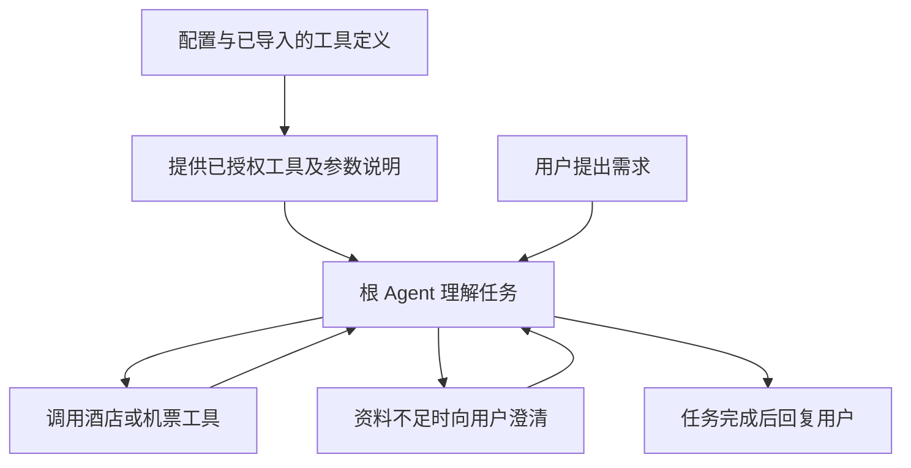

# 通用 MCP 与 RollingGo 接入方案

**状态：通用链路已实现，RollingGo 已配置，待真实账户与飞书联调。更新日期：2026-09-15，版本：v1.3。**

可执行命令、权限配置及排错见 [MCP 接入手册](../../docs/operations/mcp.md)。当前实现了配置装载、导入、显式绑定、原生工具循环和结果归档；已通过本地协议替身测试。尚无 RollingGo Key，两个端点的未认证探测均返回 HTTP 401，因此没有生成近似 Schema 或启用服务。

本期先完成通用 MCP 的配置、工具导入和调用，并用 RollingGo 的酒店、机票查询验证实际接入。根 Agent 直接使用配置中已授权的工具。

按当前模型供应商不支持的约束，本期不采用 `ProviderToolSearch`。自建 `search_tools`、独立模型选工具以及参数按需展示也暂缓，后续另行评估；它们不再是通用 MCP 或 RollingGo 接入的前置条件。

阅读顺序：先看第 1～3 节了解效果和范围，第 4 节看接入操作，第 5～7 节看开发工作和验收。工具装配、结果保存和异常处理放在最后的开发附录。

| 你想了解的问题 | 阅读位置 |
|---|---|
| 改完以后有什么不同？ | [1. 改造后的效果](#outcome) |
| 根 Agent 怎样调用新工具？ | [2. 一次酒店查询的过程](#example) |
| RollingGo 具体接哪些能力？ | [3. RollingGo 接入范围](#rollinggo) |
| 以后新增 MCP 要做几步？ | [4. 配置和接入操作](#setup) |
| 要改哪些代码、有什么影响？ | [5. 开发工作](#changes) |
| 先做什么、怎么判断完成？ | [6. 实施顺序](#delivery)、[7. 验收](#acceptance) |
| 实现时有哪些关键约定？ | [开发附录](#implementation) |

<a id="outcome"></a>

## 1. 改造后的效果

开发者配置一个 MCP 服务，导入它的工具定义，并绑定到允许使用它的 Agent。系统将这些工具装配进现有工具目录。用户提问后，根 Agent 根据模型请求中已有的参数说明，直接选择并调用工具。

| 事情 | 改造后的做法 | 带来的变化 |
|---|---|---|
| 接一个普通 MCP | 填连接配置、导入工具清单、指定可使用的 Agent | 通常不用逐个写客户端和参数类 |
| 模型选择工具 | 每轮提供当前 Agent 有权使用的工具及完整参数说明 | 根使用普通工具调用，无需供应商专有搜索能力 |
| 执行工具 | 继续使用现有权限、预算、执行和结果归档流程 | 接入后的工具仍由 FinanceClaw 管理 |
| 工具返回结果 | 回到根 Agent，由根决定下一步 | 保留中心化委派和最终回答权 |

本期的收益是减少新增服务所需的代码，不以节省工具参数 token 为目标。RollingGo 首期只有五个查询工具，先采用常规绑定，并测量实际参数开销。以后工具增多，再研究适合当前模型供应商的选择或按需展示方案。

常规绑定仍遵循现有权限和显式指令规则，各 Agent 只获得自己的工具。完整工具定义计入现有上下文预算，容量不足时沿用已有压缩或明确超限处理。

<a id="example"></a>

## 2. 一次酒店查询的过程

用户说：“2026 年 10 月 16 日去上海，外滩附近住两晚，两位成人、一间房，每晚 800 元以内，比较三家酒店。”以下是期望流程，日期和预算仅为测试示例。

1. **系统提供工具。** 模型请求已带上根有权使用的酒店、机票工具及完整参数说明。
2. **根查询酒店。** 理解用户条件后，直接调用酒店搜索工具。
3. **根继续比较。** 需要详情时，用返回的酒店标识调用详情工具；资料不足时使用现有澄清机制。
4. **根整理答案。** 比较实际返回的价格、房型和规则。若任务还包括机票，就继续调用机票工具；满足要求后再回复用户。



这是一种可能的执行顺序，并非新增固定旅行工作流。根可以省略不需要的详情查询，也可以继续调用其他工具。工具返回不会自动结束任务，不使用 `return_direct`。

飞书继续显示处理进度，最终正文由根输出。需要用户补充日期等资料时，沿用已有澄清卡片；用户停止后，卡片跟随整轮任务状态更新。单个酒店或机票工具成功，不代表整轮任务完成。

<a id="rollinggo"></a>

## 3. RollingGo 接入范围

### 3.1 已核对的接入信息

上一版核对用户提供的[快速开始页面](https://rollinggo.store/docs/mcp-docs/quick-start/)时，网页抓取显示“页面不存在”，文档中心也显示加载失败。以下沿用当时从官方 GitHub 仓库和产品页面核对的信息；这是公开资料核对，尚未使用真实 Key 连接服务。

| 服务 | 远程地址 | API Key 版列出的工具 |
|---|---|---|
| 酒店 | `https://mcp.rollinggo.cn/mcp` | `searchHotels`、`getHotelDetail`、`getHotelSearchTags` |
| 机票 | `https://mcp.rollinggo.cn/mcp/flight` | `searchAirports`、`searchFlights` |

两者使用 HTTP 流式 MCP 连接和 `Authorization: Bearer <API_KEY>`。接入时采用 MCP SDK 完成初始化、工具列举和调用；协议请求头由 SDK 处理。[官方连接说明](https://github.com/RollingGo-AI/rollinggo-hotel-mcp#快速开始)

本方案采用上述 `.cn` 端点。国际版本有独立的 `.ai` 酒店入口和业务说明，后续如需使用，应作为另一份连接配置导入，不混用两个版本的工具说明。[国际版说明](https://github.com/RollingGo-AI/RollingGo-Hotel-MCP-Global)

### 3.2 第一阶段：酒店和机票查询

首期建议开放以下五个查询工具。先跑通酒店完整流程，再用机票验证第二个服务是否只需配置即可接入。

| 工具 | 在 FinanceClaw 中的用途 | 何时使用 |
|---|---|---|
| `getHotelSearchTags` | 获取服务认可的酒店筛选标签 | 用户有设施、品牌等偏好且需要确认标签时 |
| `searchHotels` | 获取符合需求的酒店候选 | 目的地、日期等查询条件足够时 |
| `getHotelDetail` | 进一步比较选中酒店的房型、报价与规则 | 已拿到酒店标识，需要查看详情时 |
| `searchAirports` | 解析或查找机场信息 | 出发地或目的地需要匹配机场时 |
| `searchFlights` | 查询航线、日期和舱等对应的航班 | 机场及其他必要条件足够时 |

酒店用途依据[官方酒店说明](https://github.com/DIDA-AI/Dida-hotel-MCP-CN#项目简介)，机票用途依据[官方机票页面](https://rollinggo.store/solutions/flight/)。实际必填参数和返回结构以对应账户的 `tools/list` 导入结果为准，不从 README 示例手写一套近似定义。

查询结果如何使用，由 FinanceClaw 明确约定：

- 只向远端发送本次出行查询所需的信息。`originQuery` 若存在，描述出行需求即可，不拼接整段会话或紫微、金融历史。
- 日期、人数和地点采用用户本次明确的信息；需要澄清时沿用已有机制，不新增跨轮参数缓存或自动补参节点。
- 酒店标识、机场代码等取自工具结果。新日期、新目的地重新查询，不把旧报价当作实时结果。
- 回复标明查询条件和查询时间，保留返回的币种、价格单位、税费说明及退改条件；没有的数据不补写。
- 返回预订链接时，可以把原链接交给用户继续操作。查询成功或拿到链接，不表述为已锁房、已出票或已完成预订。

这些是接入后的回答规则，不代表 RollingGo 必然返回全部字段。若实际返回结构需要专门整理，增加一个小的结果转换模块即可，连接和工具注册仍复用通用实现。

### 3.3 第二阶段：OAuth 和订单能力

官方另外列出了 OAuth 授权码版本，包含锁价、创建带支付链接的订单、订单查询等能力，并说明需要商务对接。它与前面的 API Key 查询版需要分别验收。[官方 OAuth 说明](https://github.com/DIDA-AI/Dida-hotel-MCP-CN#-附录道旅hotel-mcp-oauth-v23-更新说明)

后续接订单时，需要补齐四项具体工作：

| 工作 | 为什么需要 |
|---|---|
| 用户授权、令牌刷新与账户绑定 | 确保查询或创建的是当前用户的订单 |
| 核对锁价和下单的实际副作用 | 明确哪些动作占用库存、创建订单，以及结果有效期 |
| 接入已有用户确认与审批 | 创建订单前展示酒店、日期、入住人、价格和取消规则等实际信息 |
| 核对重复请求和中断后的订单状态 | 超时不能直接再创建一单；按服务的幂等或订单查询能力恢复 |

第一阶段不把这些工具加入可执行清单。自动盯价也另需定时任务能力，不因接入查询工具就自动具备。第二阶段是否需要新订单表，应结合真实订单接口另行设计；本文“无需新增表”的结论仅适用于通用接入和首期查询。

<a id="setup"></a>

## 4. 配置和接入操作

### 4.1 配置放在哪里

| 文件 | 保存什么 | 谁维护 |
|---|---|---|
| `config/mcp.toml` | 服务地址引用、允许使用的工具、Agent 绑定和连接设置 | 开发者 |
| `config/mcp/*.json` | 导入的工具名称、参数说明、返回定义及版本摘要 | 导入命令生成，开发者审阅变更 |
| `.env` 或部署密钥配置 | API Key 等实际凭据 | 部署人员 |
| `config/models.toml` | 根和子 Agent 使用的模型别名 | 继续沿用已有配置，与 MCP 独立 |

“工具契约”在本文中就是导入并保存的那份工具定义。保存它，是为了知道某次发布究竟允许调用哪些工具、使用哪版参数。

### 4.2 RollingGo 配置示例

以下为已实现配置。`rollinggo_hotel`、`rollinggo_flight` 是本项目为两个服务取的别名，先导入工具定义，再将对应服务的 `enabled` 改为 `true`。工具的完整参数说明由导入文件提供，无需在 TOML 中重复填写。

```toml
[defaults]
timeout_seconds = 30

[servers.rollinggo_hotel]
enabled = false
transport = "streamable_http"
url = "https://mcp.rollinggo.cn/mcp"
allowed_hosts = ["mcp.rollinggo.cn"]
allowed_tools = ["searchHotels", "getHotelDetail", "getHotelSearchTags"]
contracts = "mcp/rollinggo_hotel.json"

[servers.rollinggo_hotel.auth]
type = "bearer"
token_env = "FINANCECLAW_ROLLINGGO_API_KEY"

[servers.rollinggo_hotel.policy]
side_effect = "read"
required_scopes = ["travel:read"]
egress = "external"
allowed_data_classes = ["public", "internal"]

[servers.rollinggo_flight]
enabled = false
transport = "streamable_http"
url = "https://mcp.rollinggo.cn/mcp/flight"
allowed_hosts = ["mcp.rollinggo.cn"]
allowed_tools = ["searchAirports", "searchFlights"]
contracts = "mcp/rollinggo_flight.json"

[servers.rollinggo_flight.auth]
type = "bearer"
token_env = "FINANCECLAW_ROLLINGGO_API_KEY"

[servers.rollinggo_flight.policy]
side_effect = "read"
required_scopes = ["travel:read"]
egress = "external"
allowed_data_classes = ["public", "internal"]

[agents.finance_agent]
mcp_tools = [
  "rollinggo_hotel.searchHotels",
  "rollinggo_hotel.getHotelDetail",
  "rollinggo_hotel.getHotelSearchTags",
  "rollinggo_flight.searchAirports",
  "rollinggo_flight.searchFlights",
]
```

`mcp_tools` 表示绑定到这个 Agent 的 MCP 工具。装配时把这些引用合并进现有 `allowed_tools`，每次模型请求按现有权限和指令规则提供完整参数。此处只给根 Agent 开放，紫微 Agent 不因此获得旅行工具。

地址可直接放在 TOML，也可改为 `url_env` 引用环境变量，二选一。`contracts` 相对于 TOML 所在目录。API Key 从 RollingGo 合作方入口申请；示例共用一个 Key 引用，实际需分别验证酒店、机票权限。若服务分配不同 Key，修改各自的 `token_env` 即可。未开通机票时关闭该服务，绑定可以保留，不影响酒店接入。

当前根在启用紫微或 Taibu 八字时，整轮数据级别为 `confidential`，会被示例里的 `public/internal` 策略过滤。允许这类任务调用旅行服务时，需在部署策略中明确追加 `confidential`；本次不自动放宽，也不引入按字段降级。详见接入手册的任务数据级别说明。

### 4.3 接入步骤

1. **申请凭据并填写配置。** 先确定要开放的服务和工具，密钥只进入部署环境。
2. **查看远端清单。** 执行 `discover`，确认当前 Key 实际可见的工具。
3. **导入工具定义。** 执行 `import`，生成两个本地契约文件；审阅工具和参数变更，再启用服务。
4. **配置访问权限并发布。** 执行离线检查，更新 API/Worker 的配置和部署文件。
5. **用自然语言验收。** 在飞书发起酒店查询，确认根能直接调用工具、继续查询详情并给出答案。

已实现命令：

```bash
uv run python scripts/mcp_catalog.py discover --server rollinggo_hotel
uv run python scripts/mcp_catalog.py import --server rollinggo_hotel
uv run python scripts/mcp_catalog.py discover --server rollinggo_flight
uv run python scripts/mcp_catalog.py import --server rollinggo_flight
uv run python scripts/mcp_catalog.py check
```

这里的 `discover` 是开发者在接入阶段查看远端 `tools/list` 的命令，保留它便于确定接入范围；它不是给根 Agent 使用的搜索工具。`discover/import` 不调用酒店或机票业务；`check` 不联网。导入失败时保留原文件，不生成半份清单。发布后不自动开放远端后来新增的工具。

部署需要同时处理三个已有边界：让飞书身份和测试 API 身份获得 `travel:read`，保留原有权限；用服务配置生成现有出站访问策略，放行 `mcp.rollinggo.cn`；让 API/Worker 加载相同配置和契约。实际连接由 Worker 持有凭据，API 装载目录不依赖远端在线。RollingGo 使用远程服务，无需增加本地 RollingGo 容器。

以后接入另一个同类 MCP，重复上述步骤即可。只有服务使用特殊认证、复杂会话或业务转换时，才增加对应适配代码。

<a id="changes"></a>

## 5. 开发工作：改哪里，有什么影响

| 改动 | 主要位置 | 对系统的影响 |
|---|---|---|
| MCP 配置与导入 | 新增 `shared/mcp/`、`kernel/mcp.py`、`scripts/mcp_catalog.py` | 新服务通过配置和生成文件接入 |
| 通用 MCP 调用器 | 新增 `agent_server/tools/mcp_generic.py`、`mcp_transport.py`、`mcp_errors.py`；调整 [bootstrap](../../financeclaw/agent_server/bootstrap.py) | 自动把导入定义装配成已有 ManagedTool；SDK 负责传输，原生重试失败回调负责补齐 MCP 错误回执 |
| Agent 工具绑定 | [发布目录](../../financeclaw/shared/releases/catalog.py)、[AgentFactory](../../financeclaw/agent_server/agents/factory.py) 的装配入口 | 配置引用编译为现有 [AgentProfile](../../financeclaw/kernel/agents.py) 的 `allowed_tools`；复用原生工具循环 |
| 现有治理和上下文回归 | [权限中间件](../../financeclaw/agent_server/middleware/middleware.py)、[批次处理](../../financeclaw/agent_server/middleware/batch_middleware.py)、[显式指令](../../financeclaw/agent_server/middleware/directive_middleware.py)、[实际请求记录](../../financeclaw/agent_server/middleware/final_context.py) | 验证新工具能走原链路；本期不增加工具搜索中间件、选择状态或新的预算算法 |
| 部署与飞书验收 | [设置](../../financeclaw/shared/infrastructure/settings.py)、[Compose](../../compose.yml)、配置装载和进度回归 | 两个进程使用相同工具版本，MCP 调用复用现有卡片进度 |

表中的新路径以 `financeclaw/` 为包根，`scripts/` 和 `config/` 位于仓库根。小模块可以合并，重点是复用现有执行链路。

本期不增加工具选择状态，任务恢复继续使用现有 checkpoint，完整结果使用现有工件归档，不新增业务表。已有 Taibu 的时间转换和紫微的专业解读继续保留，不把它们改成通用 MCP 逻辑。

<a id="delivery"></a>

## 6. 实施顺序

| 顺序 | 交付内容 | 完成标志 |
|---|---|---|
| 1. 验证框架链路 | 用本地模拟 MCP 跑通“导入参数 → 常规工具绑定 → 原生工具调用 → 保存结果” | 不依赖 Provider 工具搜索；普通工具调用和回执完整 |
| 2. 完成配置化接入 | 配置解析、导入命令、通用调用器、发布装配 | 模拟的第二个 MCP 仅新增配置和契约就能运行 |
| 3. 联调 RollingGo | 先酒店搜索与详情，再机场与航班查询 | 五个查询工具逐项核对；受账户权限影响的项目单独报告 |
| 4. 做飞书整体验收 | 自然语言、多工具协作、澄清、停止和结果显示 | 用户能完成查询全过程，卡片生命周期正确 |

真实 Key 未提供时，前 2 步可以继续完成。第 3～4 步必须使用有效账户联调，不能用模拟结果代替。

本次已完成第 1～2 步。自动化通过真实 MCP SDK、HTTP 协议替身和确定性模型验证根连续查询、子 Agent 绑定、`/tool`、原生进度、错误配对、单层重试、取消释放、归档及 API 离线装配。第 3～4 步待有效 Key 和部署后继续。

2026-09-15 验证：新增 MCP 用例 47 项；与架构、Taibu、Stage 1、Stage 6 修复、Stage 8 Hotfix 合并回归共 **393 passed**，在禁用 tiktoken 缓存下通过。全仓 Ruff、编译检查、密钥扫描、文档本地链接与 TOML 示例检查通过。未部署 Docker，未做真实模型或飞书端到端验收。

工具发现和订单接入属于两项独立的后续工作。工具发现需另行比较适配当前供应商的方案，尚未选定实现；订单接入需完成第 3.3 节的 OAuth 和业务恢复设计。两者都不阻塞本期交付。

<a id="acceptance"></a>

## 7. 如何判断改造完成

验收重点是接入是否通用、查询能否完成，以及现有执行和飞书链路是否正常。

| 验收场景 | 应看到的结果 |
|---|---|
| 按第 2 节条件查询酒店 | 根直接调用已绑定工具，返回有来源的候选和比较结果；不能虚构报价 |
| 追问某家酒店的房型或退改规则 | 使用真实返回的酒店标识和当前查询条件继续查询 |
| 查询机票 | 必要时先找机场，再查航班；机场歧义通过已有澄清解决 |
| 一个问题同时需要酒店和机票 | 根可切换或组合工具，全部必要工作结束后才完成整轮 |
| 参数不足、无结果、认证失败、限流或超时 | 给出对应状态；技术错误不会变成让用户补出生日期等无关澄清 |
| 飞书澄清后恢复、处理中停止 | 沿原工具链路恢复；停止更新卡片，迟到结果不覆盖终态 |
| 接第二个 MCP | 普通查询工具仅新增配置、契约和授权绑定，无逐工具注册代码 |
| 当前模型供应商只支持普通工具调用 | 标准工具参数可发送、工具结果可继续进入根循环；无需 ProviderToolSearch |
| 上下文和 Agent 隔离 | 已绑定工具的完整参数计入预算；紫微 Agent 不获得旅行工具 |
| 未绑定工具、权限不足或工具执行失败 | 不误执行；每个工具调用都得到对应回执，不出现残缺消息批次 |
| 新会话或恢复中的任务 | 使用其绑定的发布版本，远端变化不自动替换旧工具定义 |
| 大结果或工具返回结构化数据 | 原始结果完整保存，根可以读取需要的部分，不重跑业务查询取旧数据 |
| Taibu 与 Ziwei 回归 | 保留领域处理、已有澄清合并和根的最终决策权 |

真实模型评测覆盖酒店、机票和多工具协作，记录任务完成率、工具选择与参数是否正确、总模型调用数、工具参数 token 数和端到端耗时。验证首轮即可使用已绑定的五个查询工具。本期不设置搜索命中率、按需加载或工具参数节省指标。

**当前交付为通用实现、RollingGo 配置、自动化测试与接入手册。** 尚未使用 RollingGo Key 或调用其业务工具。实际账户的完整参数、响应字段、价格口径、限流和超时行为，以及真实模型和飞书效果，仍需在联调中确认。

<a id="implementation"></a>

## 开发附录：实现时需要保留的约定

### A. 工具装配和现有执行链路

装配顺序为：读取 TOML 与本地契约 → 生成 MCP 工具及平台治理声明 → 注册到 ToolCatalog → 将各 Agent 的 `mcp_tools` 编译到 `allowed_tools` → 交给现有 AgentFactory。模型通过普通 `tools/tool_calls` 调用，FinanceClaw 的 MCP 适配器负责连接远端。模型供应商无需理解 MCP 协议或支持专有工具搜索。

每个 Agent 只装配其明确绑定的工具，再沿用当前身份与显式指令过滤。没有绑定的工具不能因为服务已配置就被执行。RollingGo 五个工具在导入并启用后，可从首轮模型请求开始使用，不需要额外加载或激活步骤。

通用配置的默认值用于连接参数，服务可以覆盖；工具允许清单和副作用类型必须明确声明。同一服务的工具策略不同时支持逐工具覆盖。配置负责选择和治理，完整输入/输出定义来自导入文件，不逐工具手写 Pydantic 类。

使用现有工具调用预算、上下文压缩和 FinalContextMiddleware 的实际请求计量。完整 Schema 计入模型输入，原始结果及模型可见结果分别沿用既有大小限制。无需为此增加选择状态、独占搜索批次或逐轮工具集合解析器；已有中间件只有在通用工具适配出现具体兼容问题时才调整。

### B. 通用连接、结果和错误处理

导入时通过 SDK 完成初始化及分页 `tools/list`，保存工具定义、服务身份、协议版本和摘要。模型别名固定为 `mcp__rollinggo_hotel__searchHotels` 等名称；导入时处理字符、长度和重名问题。远端注解只作参考，副作用和权限以平台配置为准。

运行时从已导入 JSON Schema 构建原生 `StructuredTool`，使用 `langchain-mcp-adapters` 创建 session，通过 MCP SDK 保留原始结果。连接、核对所选工具契约和执行在同一 session 内完成；当前每次调用都核对完整目录，没有核验缓存，也不缓存业务答案。契约变更后重新导入发布，不临时换参数执行旧审批。[MCP 适配说明](https://docs.langchain.com/oss/python/langchain/mcp)

连接前使用现有 EgressPolicy 校验配置中的端点；不跟随未经检查的重定向发送认证头。密钥在执行或维护命令连接时解析，不进入发布摘要和日志；端点、认证方式和凭据引用名称参与发布指纹。共享配置装载只需要凭据引用。

完整保留 MCP 的 `content` 与 `structuredContent`。调用转换后的工具时携带 ToolCall 身份，避免只拿到文本而丢失结构化 artifact。有文本则使用文本，仅有结构化结果则生成有界 JSON；大结果复用 ToolResultArchive 和 `read_artifact`，重复内容不重复塞入模型。[协议依据](https://modelcontextprotocol.io/specification/2025-11-25/server/tools)

文本和 JSON 是首期验收重点。图片、资源链接保留可归档内容及元数据，不自动抓取链接。MCP `isError` 转为工具错误，认证或契约失败不自动重试；瞬态只读错误复用现有重试层及其失败回调，耗尽后返回准确的错误 ToolMessage。429 返回限流状态且不自动重试；不叠加多层重试。取消时关闭 session。

已实现 Streamable HTTP，以及无认证、Bearer、环境变量 Header。stdio、OAuth、长期会话、MCP elicitation/sampling 和交易恢复尚未接入，后续按具体服务增加适配。

### C. 与现有项目的关系及验证边界

代码基线为 `358125f`。上一版已核对的依赖为 LangChain `1.3.18`、LangGraph `1.2.11`、`langchain-mcp-adapters 0.3.2`、MCP SDK `1.29.1`；实际开发开始时再次核对安装版本。

工具目录继续复用 [ToolCatalog](../../financeclaw/agent_server/tools/catalog.py)。首期查询的发布信息、任务状态、工具审计、实际展示记录和完整结果分别使用现有 release_snapshot、checkpoint、工具审计、ModelContextManifest 和 artifacts。LangSmith 与飞书复用现有执行事件；查询内容沿用现有追踪脱敏，不额外写入长期记忆。

已有 [Taibu 调用器](../../financeclaw/agent_server/tools/mcp_client.py)可供复用连接与结果处理经验，领域转换继续留在 [taibu.py](../../financeclaw/agent_server/tools/taibu.py)。本方案不依赖尚未实现的 [Skills 运行时方案](skills-运行时接入实施方案.md)或任何工具发现机制。

已验证原生 ToolNode 注入运行上下文、保留 ToolCall 身份和双通道结果，以及 adapter/SDK 在同一 session 核验和调用。当前模型供应商处理真实 RollingGo Schema 的能力仍待实测。公开说明、自动化测试、未认证连通和真实业务完成任务分别记录，不相互替代。
