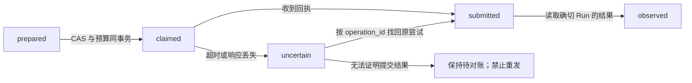
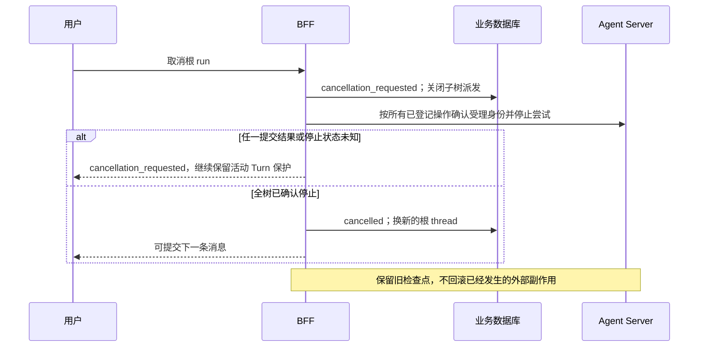

# Stage 6 Fix A/B：实施与验证

日期：2026-09-06

范围：[stage-6-fix.md](./stage-6-fix.md) 的 A（安全与正确性）和 B（上下文与澄清）。
C 的统一交互表、子 Agent 原位资料恢复、飞书审批回调、多委派与批量审批没有启用。

## 1. 交付行为

| 范围 | 已实现行为 |
|---|---|
| 父子状态 | 所有父恢复结果重新分类；子完成后父 HITL、新 handoff、未知中断不会误报 completed |
| 授权与发布 | 根／子运行持久化原始授权和发布快照；恢复 scopes 取交集；实际图运行前再次校验 |
| 恢复提交 | start/resume 使用稳定操作键和数据库 CAS 领取；保存新的 Server Run 回执，并绑定前驱检查点 |
| 响应丢失 | 状态查询按 operation_id 找回原尝试；不能确认提交结果时保持 submission_uncertain，不重发 |
| 并发与 Journal | 单会话只允许一个活动 Turn；同一子结果只提交一次父恢复；最终助手消息与序号并发幂等 |
| 用户确认 | 单个原生 HITL／已发布 Workflow 审批保存实例、动作快照和固定期限；HTTP/SSE 展示安全投影 |
| 取消 | 先封闭整个根任务树的派发，再确认每次远程尝试停止；确认后换新 thread，保留旧检查点和 Journal |
| 批量工具 | 独立无审批 READ 继续走原生分发、汇合、下一次模型；混合委派、多审批、slash 重复调用整批拒绝 |
| 累计预算 | 模型、工具和出站操作计入根任务树；子 Agent、Workflow、原生重试与恢复不能刷新预算 |
| 子上下文 | 子 Agent 不装配根 Journal／长期 Memory；输入仅含 task、领域 arguments、已解析授权引用 |
| 领域契约 | AgentHandoff v1/v2 联合解码；指定 input_schema/output_schema；不从最后一句自然语言猜 JSON |
| 澄清 | 缺必填字段的确定性预检返回 completed + needs_clarification；根提问后以新 Turn、新 child 重委派 |

根 Agent 与市场研究 Agent 发布为 `1.1.0`：

- `finance_agent_v1_1_0`
- `market_research_agent_v1_1_0`

`langgraph.json` 已同步映射。本地栈的 `langgraph.local.json` 仅同步上述两个图 ID，保留其余本地配置。
Workflow 的业务契约仍是 `portfolio_review@1.0.0`，部署修订为 `portfolio-review-v1/stage6fix-ab-1`。

## 2. 薄执行事实层

新增 `run_executions` 和 `run_operations`，继续使用业务数据库，未增加任务队列或第二套图运行时。

`run_executions` 保存：原身份与授权、request_clock、语言／时区／分类、Profile、Schema、实际图 ID、
发布修订、模型／工具配置指纹、当前 Server Run、一个等待位置、取消事实和根预算计数。
委派还冻结目标发布和已解析引用，重启时不能把未启动子任务切换到新的同名目标。

`run_operations` 的状态为：



操作键由业务 run 和 start／审批实例／delegation ID 派生；命令摘要包含目标 thread、assistant、
输入或 resume 命令以及前驱 Server Run。同键不同命令冲突。远程调用期间不持有数据库事务锁。
子结果的交付观察、`delivered_at` 和持久 Audit/Outbox 在同一事务提交；最终 Journal 可幂等补齐。

SDK 当前没有可指定 run_id 的幂等创建保证。因此这里不宣称端到端 exactly-once，也不设置一个
到期后自动重发的“领取租约”。已领取但回执未知的操作只能对账；找不到回执不等于未执行。
首次网络异常也返回待对账状态，而不是把运行直接判为失败。

客户端查询属于请求 Server Run 的检查点；共享 thread 最新检查点属于别的尝试时，按 run_id 查询历史。
提交恢复前还复核最新检查点属于固定前驱，并显式传递该 checkpoint。无法定位时保守停止推进。

## 3. 审批、超时与取消

### 3.1 兼容的单位置接口

仍使用 `GET /v1/runs/{run_id}` 和 `POST /v1/runs/{run_id}/resume`，增加：

- `waiting_reason`：approval_required、approval_expired、submission_uncertain、execution_timeout、
  unsupported_interruption、unsupported_child_interaction 等。
- `pending_interactions`：仅含可展示审批对象、实例 ID、摘要、允许决定及期限，不透传内部 state。
- SSE `run.interrupted` 同样携带这些安全字段；流结束本身不是完成证据。

客户端查询后回传服务端给出的绑定字段：

```json
{
  "type": "approve",
  "interrupt_id": "从 pending_interactions 原样取得的实例 ID",
  "arguments_hash": "从 pending_interactions 原样取得的摘要"
}
```

存在原生 interrupt ID 时必须匹配；仅无 ID 的旧单中断保留兼容路径。顶层 `arguments_hash`
现在覆盖整个动作（包括工具名和参数），不是只计算 args。展示可能脱敏，客户端应回传摘要，不能从展示文本重算。
Workflow 保留已发布 input hash，并额外绑定具体审批 ID、原生 interrupt 和完整审批载荷；同一发布审批点
允许有不同实例，缺少唯一归属时不按“最新一条”猜测。

当前不支持 edit：改变动作必须产生新快照和新确认。拒绝后，对该根任务树采取保守策略，禁止继续写动作或
重新委派；仍允许只读解释。不依赖模型自己识别“等价的被拒动作”，也不代表以后所有任务永久禁写。

### 3.2 时间口径

审批窗口从首次观察／登记该实例时开始，重复轮询不刷新截止时间。查询和恢复使用同一时钟检查过期。
过期只结束审批窗口，不宣称远程执行已取消。Workflow 软超时按每次提交的执行尝试计时，审批等待不挤占下一次尝试窗口。
若远程随后明确完成，可据实收敛；若仍未停止，则持续展示 execution_timeout。

### 3.3 安全取消与新消息

新增根 Conversation 运行的 `POST /v1/runs/{run_id}/cancel`，按原租户和主体鉴权。



同会话在 running、waiting_child、interrupted、submission_uncertain 等期间的新 Turn 返回 409，
但原幂等请求可重放。飞书普通文本遇到活动任务时会解释如何在 Web/API 查看、审批或取消，
不会把“同意”自动当成审批，也不会把它追加到被挂起的父检查点。
此取消入口不声称覆盖旧的裸 Tool 内部调用通道，也不增加独立 Workflow 的通用取消 API。

## 4. B 阶段上下文与结果

支持引用格式：`message:<id>@<sha256>`、`artifact:<id>@<sha256>`。

消息必须属于本次明确授权的 Conversation，且对当前主体可见；Artifact 必须属于同租户／主体，
读取还需要原执行权限内的 `artifacts:read`。验证内容摘要、分类、文本 MIME 和累计大小后才传给子运行。
只有已标注数据分类的 Artifact 可用作新委派引用；无法证明分类的旧 Artifact 不默认降级。
Journal 片段按 internal 管理，不能作为 public 任务输入。任意 URL、本机路径、其他会话消息均拒绝。

默认最多 32 条引用，累计 UTF-8 内容 32 KiB。引用内容与来源冻结在委派快照中，重试不静默抓取新版本。
子运行保留 conversation/turn/parent/run 标识用于审计，但这些标识不会触发隐式历史召回。

可委派 Profile 的 `input_schema`、`output_schema`、`output_state_key` 是真实契约：

1. 工具描述向父模型提供领域参数 Schema；服务端负责最终校验。
2. 仅缺必填字段时可在启动子模型前完成低成本提槽；错误类型、损坏输入或权限失败不是 needs_clarification。
3. 输出读取默认 `structured_response` 字段并校验，而非解析最后一句自然语言。
4. 市场研究声明 success、needs_clarification、unsupported、partial；成功必须有摘要和证据，
   提槽必须有问题与字段，部分结果／不支持必须保留限制。
5. `DelegationResult.status=completed` 不等于领域成功。根提示词明确要求保留 outcome、证据、对象与限制。
   模型措辞质量仍需真实供应商评测；契约校验不能证明模型所有自然语言断言都正确。

AgentHandoff v1 和 WorkflowHandoff v1 仍可解码，AgentHandoff v2 增加固定 target_version 与 arguments。
v2 返回同时核对 handoff、parent、目标版本和输入摘要。旧协议恢复也必须具备服务端授权快照，
“能解析 v1”不等于“缺快照的旧运行可自动获得新权限”。

## 5. 默认限额与部署约束

| 配置位置 | 默认值 | 含义 |
|---|---:|---|
| AgentProfile.max_tool_batch | 8 | 一个模型输出的工具调用上限 |
| AgentFactory.resource_concurrency | 8 | 同一 Factory 共享的工具 I/O 并发上限 |
| max_tree_model_calls | 64 | 根任务树的模型真实尝试次数 |
| max_tree_tool_calls | 128 | 根任务树工具真实尝试次数，包括重试和恢复重入 |
| max_tree_operations | 64 | 根任务树出站操作的领取次数 |

原有单次模型／工具限额继续保留。Workflow 行情读取重试和报告发布也计入根工具预算。
资源信号量不是分布式锁：多 Factory／worker 部署需要按实例总数计算总容量，并结合 Server worker
并发和供应商限流配置；未引入一个自动跨进程扩缩容的资源调度器。

多工具仍是非事务执行。可处理业务错误按 ToolMessage 返回；未处理执行故障可能中止该轮，
不能据此推断其他调用未执行，也不承诺自动回滚。

## 6. 迁移、旧运行与回滚

新增 Alembic `0007_stage6fix_ab`。生产 BFF 和 Agent Server 必须连接同一业务事实库，并使用相同发布配置。
原有审计、Journal、Workflow 和委派记录保留，不伪造历史授权。

发布顺序：

1. 暂停旧版本新任务受理；在原代码／依赖上排空或按原服务能力确认停止旧运行，并备份业务库和检查点。
2. 执行 `.venv/bin/alembic upgrade head`。
3. 协调发布 BFF 与带版本化图 ID 的 Agent Server，确认模型配置、工具配置和发布修订一致。
4. 新建根 Conversation 使用 1.1.0；已有 1.0.0 Conversation 不静默切换执行版本。
5. 恢复受理前跑本记录中的部署验收。遇到旧快照缺失／发布不可用返回明确冲突，使用新会话或人工排空方案。

本次采用“排空后切换”，没有假装保留一份可恢复全部旧检查点的 1.0.0 执行代码。
未受理新执行事实的空升级可以降级；已有 A/B 执行快照时，downgrade 显式拒绝删除事实，
必须另行制定归档／恢复方案。不能把回滚到旧代码当作恢复未知副作用执行的办法。

## 7. 验证与未验证边界

自动化用例位于 [tests/stage6fix](../../tests/stage6fix/)，同时更新了受新版安全语义影响的旧回归。

```bash
.venv/bin/python -m pytest -q
.venv/bin/ruff check financeclaw tests
.venv/bin/ruff format --check financeclaw tests
FINANCECLAW_RUN_AGENT_SERVER_TESTS=1 .venv/bin/python -m pytest -q tests/stage6fix/test_live_agent_server.py
FINANCECLAW_RUN_AGENT_SERVER_TESTS=1 .venv/bin/python -m pytest -q -rs
```

2026-09-06 本地最终结果：

| 检查 | 结果 |
|---|---|
| 开启真实 Agent Server 用例的完整回归 | 129 passed、3 skipped，包含 4 个真实 Server 用例 |
| Ruff 静态检查 | 通过 |
| Ruff 格式检查 | 178 个文件通过 |
| git diff --check | 通过 |

3 个跳过项分别为 PostgreSQL Memory Store、PostgreSQL 并发和真实飞书用例，均缺少对应测试环境。
测试还报告了飞书 SDK 的 2 条弃用警告，未改动第三方依赖代码。

真实 Server 测试只监听本机、使用隔离临时 SQLite 和离线脚本模型。
演示行情的新鲜度时钟在测试图中固定，避免用例随日历日期失效；审批仍使用 BFF 时钟。已验证：

- 子 Agent 使用真实 create_agent 和结构化输出，父交付后进入真实 HITL，再按原生 ID 与检查点恢复。
- start／两次 resume 各有不同 Server Run；旧 run 查询命中自己的旧检查点，而非线程最新完成结果。
- Workflow 真实审批后发布 Artifact，根预算包含读取和发布调用。
- Server 运行成功但 Workflow 返回业务失败时走领域输出校验，不误当成审批中断。
- 取消后保留原生中断检查点，旧 Run 查询仍定位旧 thread，新 Turn 使用新 thread。

其他本地用例覆盖同步／异步批次、重试预算、数据库竞争、回执丢失、取消保护、HTTP/SSE、
v1/v2 契约、任务级上下文、授权引用、提槽后新 Turn、部分结果与损坏输出，
以及重复 tool_call_id 的派发前终止和已有执行事实时的迁移降级保护。

待部署验收：

- PostgreSQL 事务／锁行为：本机 Docker 守护进程不可用，未执行。提供专用测试数据库后设置
  `FINANCECLAW_TEST_POSTGRES_URL`，运行 `tests/stage6fix/test_postgres_concurrency.py`；该测试创建并清理独立随机 schema。
- 线上 LLM 供应商的多 tool_calls／结构化输出兼容性与回答质量：本次未调用。
- 真实飞书单聊联调：本次未使用凭证；C 的审批回调本就不在交付范围。
- 生产规模吞吐、限额调优与跨版本长期检查点留存：需在目标部署环境验证，不能由本地通过替代。

完整的设计场景图继续见 [stage-6-fix 第 7 节](./stage-6-fix.md#7-优化后的场景调用图)；其中 S6、S9 和 C 扩展仍是未来方案。
