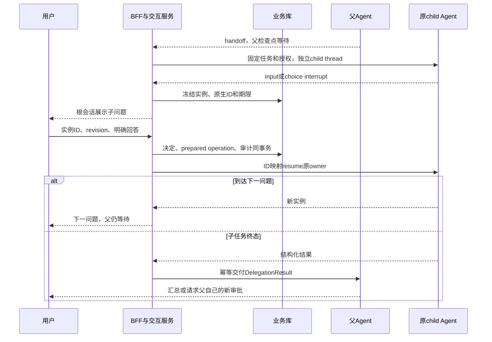
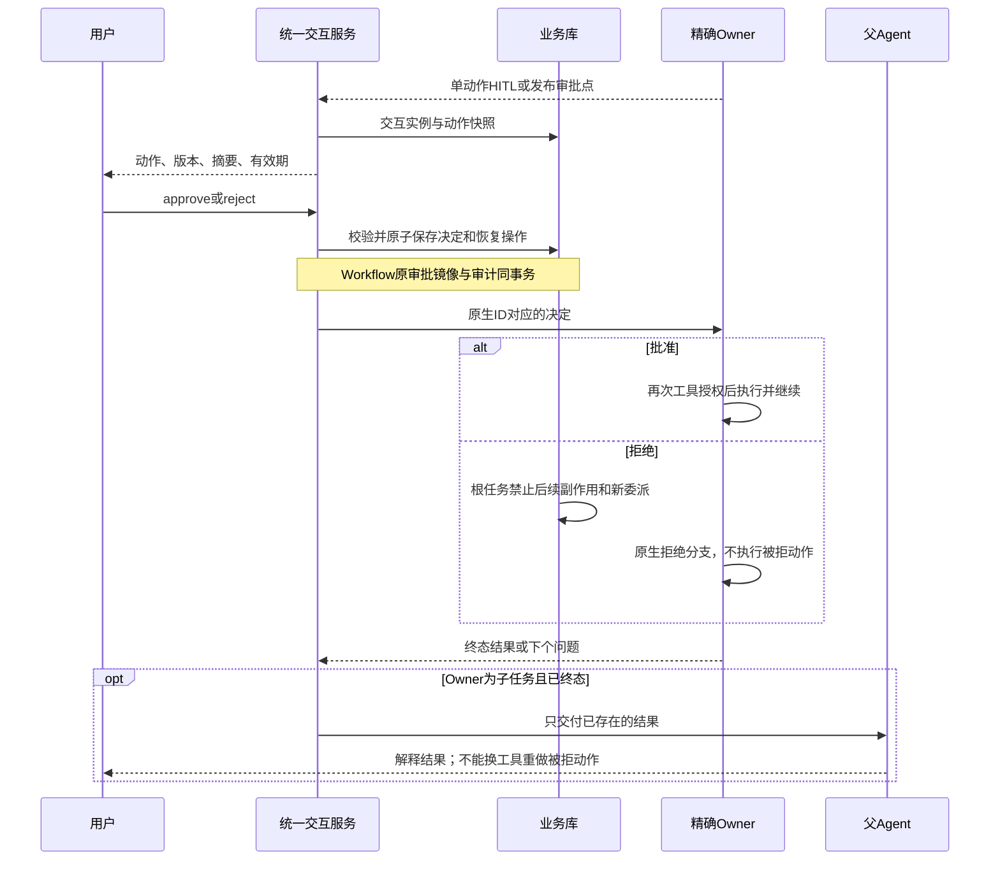
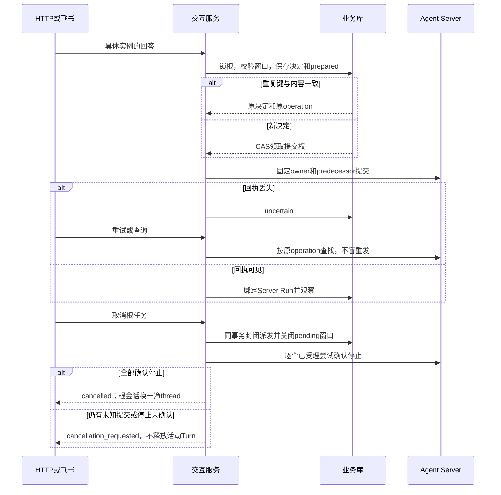

# Stage 6 Fix C：持久化用户交互实施与验证

日期：2026-09-06。设计依据：[stage-6-fix](./stage-6-fix.md)。
前置实现：[A/B 实施与验证](./Stage-6-Fix-AB-实施与验证.md)，提交 `39a056e`。

## 1. 本次交付与明确边界

C 将用户中途补充资料、选择和具体动作审批统一到持久化交互实例：顶层 Agent、领域子 Agent、
已发布 Workflow 共用归属校验、决定落库、恢复提交和对账。回答恢复原 owner 的原生 interrupt，
不会作为新根 Turn 输入，也不会让父 Agent 代答；子任务终态之后才交付父模型。

本次固定以下选择：

- 每个根任务最多一个 pending 交互位置。普通独立 READ 多工具仍支持原生汇合；委派、提问、
  写动作和审批独占批次。不启用多委派、多个并行中断或 C06 批次审批。
- 飞书使用明确文本命令，继续使用现有已验证的单聊事件身份。没有审批按钮回调或 Web 审批页面。
- 状态查询／流结束校正继续驱动进度。不新增后台调度器，也不保证用户离线后的主动通知。
- B 的低成本 `needs_clarification` 仍是“旧任务结束、补充后新 Turn”；C 是“保留原任务原位恢复”。
- 取消只封闭派发并确认执行停止，不撤销已经发生的外部副作用。

## 2. 持久化与恢复不变量

迁移 `0008_stage6fix_c` 新建 `pending_interactions`。它是业务交互事实表，不接管 LangGraph 调度。

| 事实 | 固定内容与约束 |
|---|---|
| 归属 | tenant、subject、conversation、root、owner、parent、delegation |
| 执行位置 | owner thread、产生问题的 Server Run、原生 interrupt ID、可取得的 checkpoint ID |
| 问题实例 | ID 由 owner／Server Run／interrupt 派生；revision 在同 owner 内递增 |
| 请求快照 | source、point、kind、question、Schema／options、具体 action、动作摘要和权限要求 |
| 生命周期 | pending → resolved／rejected／expired／cancelled／superseded；同实例查询不续期 |
| 决定 | response key、规范化内容摘要、决定人／时间、完整受限回答、唯一 operation ID |
| 审计 | interaction.requested／decided／closed 与 Outbox 同事务，只传摘要与关联，不传回答原文 |

根执行行锁和部分唯一索引 `uq_interactions_pending_root` 同时约束并发交互。
同 owner 到达新实例会关闭旧 pending；另一 owner 同时提问会冲突，不静默覆盖。
旧 Server Run 的观察不得登记到新的执行尝试上。

决定事务内同时完成：复验版本、状态、截止时间和 owner 位置；保存回答；准备固定恢复 operation；
更新原 WorkflowApproval 镜像；写审计／Outbox。原 Workflow 的批准／拒绝事件仍保留。
任一步失败则整体回滚，不存在“决定已改、恢复命令却丢失”的半提交。

远程请求发生在事务之后，复用 A 的 prepared → claimed → submitted／uncertain → observed：

- 同键同内容重放返回原决定，不再次提交；换键或换内容冲突。
- prepared 前后宕机可通过携带当前认证的状态查询继续；无当前认证的后台查询不领取新提交。
- 受理回执丢失按 operation metadata 找回原尝试；不能证明受理情况时保留 uncertain，绝不盲重发。
- 已接受但尚未领取的回答若过期或已取消，展示 `expired_before_submission`／
  `cancelled_before_submission`，不会自动延期执行。
- `resolved`／HTTP 202 只表示回答被接收，不表示工具或整个任务已经完成。

完整回答和动作存在业务库中，属于需访问控制与保留策略保护的数据；审计脱敏不等于业务库不存原文。

## 3. 发布式交互契约

`AgentProfile.interaction_points` 固定 point ID、kind、问题模板、回答结构／选项、权限及窗口期限。
模型只能在已发布点提供有界问题正文，不能决定 Schema、审批权限或目标版本。

| 类型 | 输入与约束 | 恢复方式 |
|---|---|---|
| input | JSON object，按已发布 JSON Schema 校验 | `{kind: input, answer: ...}` |
| choice | 已发布的精确字符串选项，最多 20 项 | `{kind: choice, answer: ...}` |
| approval | approve／reject + 完整 action_hash；不接收 edit | 原生 HITL decisions 或声明式决定 |

Schema 和回答上限各 16 KiB；Schema 必须自包含，拒绝所有引用和远程解析。
声明式审批 action 上限 16 KiB；question、reason 各最多 2,000 字符。
期限在首次登记时冻结，声明式点取统一窗口与点期限的较早者，不能通过轮询延长。

`question_tools()` 只为 input／choice 自动生成 `request_user__<point_id>` 工具，纳入同一治理、
批次和预算链。审批由已有受治理 HITL 或发布代码调用 `request_user_interaction()` 提出，
不会自动生成让模型任意声明获批动作的工具。辅助函数只返回用户决定，不负责执行副作用。
真正执行写动作的节点仍须经过工具治理、预算和拒绝检查，不能在辅助函数之后直接绕开治理做外部写入。

原生 interrupt 恢复会重新进入所在节点：已完成的昂贵工作应放在前序节点，中断前代码必须可重放。
当前市场子 Agent 发布 `research_scope`（分析期间资料）和 `research_focus`（三个研究侧重选项）；
生产默认市场 Agent 仍不具有写工具。真实测试的子写审批使用隔离测试发布，不扩大生产白名单。

恢复执行权限是原授权上界 ∩ 当前执行权限；另检查当前主体是否具有该点审批权限。
新获得的审批权限不进入恢复执行上下文。发布档案／Workflow release 漂移则拒绝恢复。
原生 HITL 恢复后，具体工具仍重新执行授权检查，接受审批并不保证写操作一定会被允许。

## 4. HTTP 与兼容入口

| 入口 | 本次行为 |
|---|---|
| `GET /v1/runs/{run_id}` | 根会话可展示子问题；child 可直接查询；返回 waiting_reason、pending_interactions |
| `GET /v1/interactions/{interaction_id}` | 同租户／同主体查询，安全动作投影、版本、截止时间及 resume_status |
| `POST /v1/interactions/{interaction_id}/responses` | 要求 `Idempotency-Key`，长度 1–256；按 kind 校验；成功返回 202 |
| `POST /v1/runs/{run_id}/resume` | 旧单审批兼容；只按精确 interrupt 和原摘要映射，不按 latest 猜测；input／choice 使用新接口 |
| `POST /v1/runs/{run_id}/cancel` | 根会话或独立 Workflow；子任务通过 root 统一取消；返回 cancelled 或 cancellation_requested |

审批请求示例（ID、revision、摘要必须取自服务端展示，不手工猜测）：

```json
{
  "revision": 2,
  "kind": "approval",
  "decision": "approve",
  "action_hash": "<展示的 64 位 SHA-256>",
  "reason": "已核对对象和动作"
}
```

资料：`{"revision":1,"kind":"input","answer":{"analysis_period":"最近一个月"}}`。
选择：`{"revision":2,"kind":"choice","answer":"风险与限制"}`。
拒绝使用 `decision: reject`，仍绑定同一动作摘要。

跨主体／不存在统一 404；非法请求形状／未知字段 422；实例、回答、权限或时效冲突 409。
原 Workflow 兼容接口保留最初参数摘要，新的 `action_hash` 则覆盖包含报告摘要等内容的完整审批快照。
两者用途不同，不可互相替换。没有原生 ID 的历史单审批保留 A 兼容路径，不伪造为 C 交互。

## 5. 飞书命令与展示

核对本地 `lark-channel-sdk@1.4.0` 适配路径后，复用已有 `raw`／`message` 事件、P2P 身份校验和
Markdown 流／文本发送接口。不假设 Markdown 卡片自动支持审批回调。

```text
/answer <interaction_id> <revision> {"analysis_period":"最近一个月"}
/choose <interaction_id> <revision> "风险与限制"
/approve <interaction_id> <revision> <action_hash> [理由]
/reject <interaction_id> <revision> <action_hash> [理由]
/cancel <root_run_id>
```

渠道要求应用、租户、open_id、chat 与原 Conversation 绑定一致，消息 ID 派生 response 幂等键。
普通“同意”“继续”不会转成批准；未知关联的新消息仍受单活动 Turn 守卫保护。
同一事件重投递幂等；重新发送不同消息 ID 属于不同决定键，会返回冲突而不是第二次批准。

卡片和文本降级都展示问题、实例、版本、期限、可复制命令及定位 API。
过长动作不截断后继续提供批准命令，而是说明未完整展示、给出已认证 API 查看入口。
取消或冲突通过新回复说明当前状态；已有消息是历史快照，不追溯更新。服务端状态才是权威，
旧命令不能重新执行。无按钮、无多实例 WebSocket 协调、无持久 Inbox 或可靠通知承诺。

## 6. 最终场景调用图

### C-S1：子 Agent 连续提问后再交付父结果



### C-S2：顶层／子 Agent／Workflow 的审批与拒绝



真实测试发现并修复：拒绝后的禁令不能把“原委派工具重入并接收终态结果”也拦成新委派。
该放行必须匹配原 handoff、已领取的 delivery operation、原生中断及确切执行链；仅同名工具不放行。
新的模型委派／写动作仍被批次守卫拒绝，取消仍由原子预算检查拦截。

### C-S3：重复事件、提交丢失与取消竞争



## 7. 代码落点

- `modules/interactions`：契约、表、根锁、实例生命周期、事务决定和审计。
- `application/interaction_service.py`：发布校验、owner 路由、精确恢复、历史兼容和安全投影。
- `application/execution_service.py`：已准备命令的恢复及共享取消停止确认。
- `orchestration/tools/interaction.py`：原生 interrupt 辅助函数与受治理提问工具。
- `conversation_service.py`／`delegation_service.py`／`workflow_service.py`：根与 owner 状态整合。
- `interfaces/http/app.py`、`application/feishu_interactions.py`／`feishu_channel_service.py`：入口和展示。
- `tests/stage6fixc`、`tests/stage6fix/test_live_agent_server.py`：故障边界和真实检查点测试。

## 8. 验证与发布

验证命令：

```sh
.venv/bin/ruff check financeclaw tests
.venv/bin/ruff format --check financeclaw tests
FINANCECLAW_RUN_AGENT_SERVER_TESTS=1 .venv/bin/python -m pytest -q -rs
```

验证涵盖 C01–C05、C07 的本地实现路径：纯图同步／异步原位恢复；真实数据库决定并发；
HTTP 鉴权与类型；飞书命令和发送降级；新旧实例、摘要和权限边界；回答落库后宕机、回执丢失、
取消竞争；Workflow 旧审批镜像、独立取消；0008 升降级及回滚事实保护。
真实 Agent Server 使用独立进程、HTTP 和检查点；模型是脚本化离线模型，不请求线上 LLM。
本地全量回归：**170 passed、3 skipped**，包含 39 个 C 专项用例和 6 个真实开发 Agent Server 用例。
Ruff 检查和格式检查通过；第三方飞书 SDK 有两项弃用警告。C06 未启用，不作为已验证能力。

3 项跳过分别是 PostgreSQL Memory Store、真实飞书单聊 E2E、PostgreSQL 并发验收，均未配置所需环境。

PostgreSQL 测试入口为 `FINANCECLAW_TEST_POSTGRES_URL`，只在专用测试库内创建并清理随机 schema。
没有提供该连接时跳过；SQLite 并发通过不等于 PostgreSQL 部署已验收。
真实飞书账号、线上供应商、多实例通知不在本次本地通过范围，须在授权环境中另行验收。

发布要求：

1. BFF 与 Agent Server 共享业务数据库，先备份并应用 `alembic upgrade head` 到 `0008_stage6fix_c`。
2. 根与市场 Agent 发布 `1.2.0`，实际 graph 为 `finance_agent_v1_2_0`、
   `market_research_agent_v1_2_0`，修订 `stage6fix-c/1`。
3. `portfolio_review@1.0.0` 的部署修订变为 `portfolio-review-v1/stage6fix-c-1`；
   输入输出业务版本不变不表示旧检查点可直接换代码恢复。
4. 先排空旧 1.1.0 与旧 Workflow 修订的活动任务，再切新版本；无法保留旧代码时不静默迁移。
   新代码没有自动补造旧运行权限快照；旧授权缺失仍要求重新授权或受控终止。
5. 不靠迁移删除旧 WorkflowApproval。只要有 C 交互事实，0008 downgrade 就拒绝；
   回滚应先安排显式保留／归档方案，不丢弃用户决定和恢复证据。
6. 新增直接依赖 `jsonschema>=4.23,<5`，锁文件继续使用已有的 `4.26.0`；按锁文件部署。

代码提交不等于生产部署。本次没有推送远程、迁移用户运行库或调用真实飞书发送消息。
