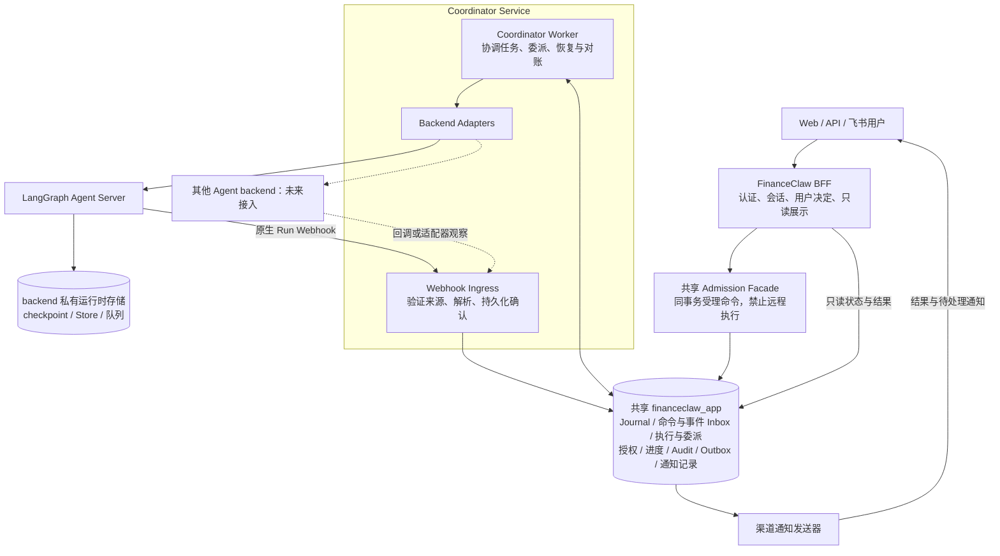
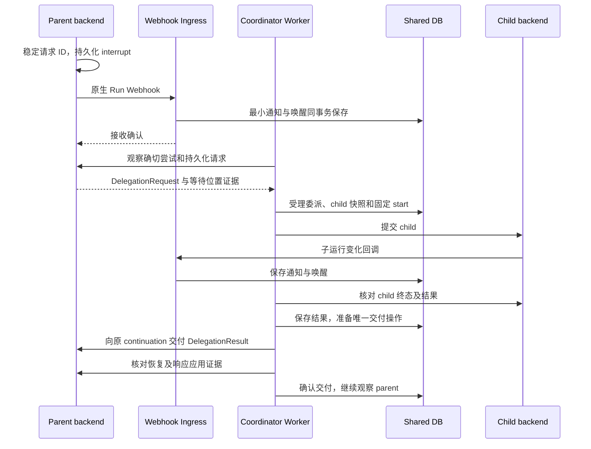

# Stage 8：Coordinator Service、Webhook 接入与显式委派协议实施方案

方案状态（2026-09-09）：**跨 Run 委托与 Coordinator 独占运行控制的方向已被
[Stage 8 Hotfix](./stage-8-hotfix-实施方案.md)替代。** 下文保留旧方案供代码与历史验证追溯，
不继续指导新功能实施。当前运行代码尚未切换到 hotfix。

状态：8.0 完成；8A／8B／8C 代码及隔离验收已实现。生产与真实渠道门禁分别见
[8A 记录](Stage-8A-实施与验证.md)、[8B 记录](Stage-8B-实施与验证.md)、[8C 记录](Stage-8C-实施与验证.md)。

初版日期：2026-09-07；重写日期：2026-09-08；方案修订：4（基础能力优先，由 coordination 自主演进）。

已交付范围、当前版本 Webhook 能力缺口与复现证据见
[Stage-8 实施与验证](./Stage-8-实施与验证.md)。基础能力优先；后续增强直接在 coordination 内实现。

适用基线：Stage 6 Fix A/B/C 的持久化执行与交互，以及 Stage 7 紫微领域 Agent 候选实现。
本文件保留原路径以兼容已有链接，内容替代初版“后台 Worker＋可选 Webhook”方案。
本文保留目标设计；实际交付范围以各阶段验证记录为准，第二种真实 backend 仍未开放。

## 1. 本次决议与目标

### 1.1 已确认方向

1. 新增可独立部署的 **Coordinator Service**，包含 **Webhook Ingress＋Coordinator Worker**。
   它持续负责已受理任务从首次启动、委派、交互恢复到结果提交的协调。
2. 首个接入后端为 LangGraph Agent Server；原生 Run Webhook 是首期正式接入面，
   不再作为最后阶段才考虑的可选功能。后台观察与对账补足回调覆盖和投递缺口。
3. Coordinator 面向多种 Agent backend 设计小范围适配协议。模型循环、Graph 节点和原生
   checkpoint 仍由 backend 拥有，Coordinator 只管理业务任务及执行边界。
4. BFF 与 Coordinator **暂时使用同一个业务数据库 `financeclaw_app`**，允许通过明确的
   模块接口共享事务。此次不要求分库，也不为同库流程强制增加远程双写。

### 1.2 本方案的推荐实施选择

- Delegation 使用独立、版本化、可持久化的协调请求和结果契约；复用已有 HandoffRequest /
  DelegationResult 的语义。LangGraph 首期通过原生 interrupt 承载，不把状态字符串当委派协议。
- BFF 与 Coordinator 保持同代码库和协调发布；生产分别运行 BFF、Coordinator Ingress、
  Coordinator Worker。渠道通知发送器是独立职责，可按负载与渠道凭证边界部署。
- 保留现有单活动根 Turn、单待交互位置、串行委派和根预算。协议预留父子任务分别绑定 backend，
  首期生产只接 LangGraph；跨 backend 真实委派、并行和递归不因接口预留自动开放。
- 使用 PostgreSQL 持久化协调责任，由 coordination 自己实现有界推进和恢复。先交付基础闭环，
  后续按实际需求在该包内增强续租、退避、并发控制和运维能力，决议见 RD-032。

### 1.3 成功标准与边界

受理事务成功后，无需 GET、SSE 或飞书展示连接来驱动任务；数据库、backend、兼容执行版本、
有效授权与预算满足条件时，任务能推进到完成、失败或明确的等待状态。

Coordinator 不决定用户应使用哪个 Agent，不从自然语言猜测新委派，不生成任意 DAG。
未知提交必须先对账，通知失败不重跑模型，子任务完成不等于父任务或根任务完成。
依赖不可用、授权失效和结果交付未确认必须可见，不能以自动重试承诺任何故障下必定完成。

本阶段不扩大 Stage 7 工具、排盘口径、默认开关或真实资料处理范围，也不批准生产发布。

## 2. 现状、变化与既有基线

### 2.1 当前代码事实

以下路径已同步 Stage-8 前置分包；运行推进逻辑未因目录迁移改为后台执行。

| 位置 | 当前实现 | 调整方向 |
|---|---|---|
| `coordination/application/conversation_runs.py` 的 `status()` | 查询会触发交互恢复、执行对账、child 派发和 parent 恢复 | 查询与推进彻底分离，所有持久化任务的写动作归 Coordinator |
| 同文件 `stream()`、`_advance_delegation()` | 流结束会调用状态校正；父子衔接依赖调用方继续观察 | 流只展示；Coordinator 持久化跟踪父子衔接 |
| `agent_server/tools/delegation.py` | 已有稳定 handoff ID、typed request、原生 interrupt 和结果校验 | 提升为服务边界上的显式协调协议，保留原生持久化 |
| `coordination/application/run_observation.py` | 已区分 handoff、HITL、资料交互和未知中断 | LangGraph 细节收敛到 Adapter，输出可验证的中立观察 |
| `coordination/backends/ports/agent_server.py` | 出站 Port 暴露 thread、assistant、原生 command | 保留为 LangGraph 适配实现，核心依赖业务任务操作 |
| `shared/execution_ledger/` | 快照、固定命令、未知提交、预算与取消保护已存在 | 继续作为业务执行事实与防重复边界 |
| `bff/http/app.py` lifespan | 启动补偿，没有持续根任务协调服务 | BFF 不负责后续远程推进，新增 Coordinator 独立入口 |
| `bff/application/feishu_channel_service.py` | 展示等待默认每 0.25 秒调用会话状态 | 短受理、只读展示、可靠通知 |
| `shared/outbox/` | 审计 outbox 与单轮发布器存在 | 新增有明确消费者的业务事件和通知投递责任 |

当前 `start_turn()` 的 Turn 受理、执行快照与首次操作准备仍有多个持久化边界。
现有助手消息与 Turn 完成已有同事务原子性；本阶段扩展该事务，不误称原子性完全缺失。
摘要应在最终结果提交后生成，摘要失败不能阻止结果交付。

以上为产品现状。8.0 已验证本机 Agent Server 的 Webhook 行为；目标生产部署、性能和
真实飞书回执仍需后续验收。

### 2.2 对初版方案的替代

| 初版 | 本修订 |
|---|---|
| BFF 应用层新增可独立运行的 Worker | 新增有明确服务边界的 Coordinator，Ingress 与 Worker 可分别扩容 |
| 8A 先轮询，8C 可选 Webhook | 首期完成 LangGraph Webhook 接入，事件唤醒优先，定时核对负责补偿 |
| 协调逻辑直接依赖 AgentServerClient | Coordinator 核心使用 Backend Adapter，LangGraph 原生类型留在适配侧 |
| handoff 隐含在状态观察分支内 | Delegation 是显式、可单独验收的业务协议与生命周期 |
| 默认按数据库租约设计全部调度结构 | PostgreSQL 保存有限协调责任；业务操作与租约分开，增强在 coordination 内演进 |
| 数据库使用方式未体现服务边界 | 明确共享同一业务数据库、有限跨模块事务和逻辑写入入口 |

[最终架构](../00-最终架构设计.md)中原生运行时、顶层 Agent、治理与审计原则继续保留。
本修订显式调整“BFF 直接推进”的应用边界；多 backend 的扩展见
[RD-031](../01-架构决议汇总.md#rd-031coordinator-service-与共享业务数据库)。
既有单 LangGraph 实现仍是当前运行事实，协议预留不等于已交付第二种运行时。

## 3. 服务、进程与依赖

### 3.1 目标部署

图中的共享 Facade 是 Coordinator 提供的受理代码入口，在 BFF 的业务事务中调用，不是另一个
需要部署的服务。Webhook Ingress 和 Coordinator Worker 使用独立启动与健康检查入口。
图不展开既有 LLM、Tool、Artifact Store、LangSmith 与 OpenTelemetry；它们仍按原边界接入。

### 3.2 各角色职责

| 角色 | 拥有的职责 | 不得承担的职责 |
|---|---|---|
| BFF | 认证、租户与对象归属、message-only 入口、用户决定、Journal 读取、SSE 与渠道展示 | 对 Coordinator 管理的任务直接调用 backend start/resume/cancel |
| Admission Facade | 固定受理依据、命令、授权与幂等键；与 BFF 消息／决定共享事务 | 远程 HTTP、LLM 执行、无限等待 |
| Webhook Ingress | 校验 backend 部署身份、限制载荷、保存最小通知和唤醒责任 | 在回调请求栈中派发 child、恢复 parent 或直接确认根完成 |
| Coordinator Worker | 唯一远程提交权、父子映射、交互登记、结果交付、取消确认与补偿 | 模型决策、Graph 节点调度、自动批准、改写冻结输入 |
| Backend Adapter | 将任务操作、回调和精确运行观察映射到特定 backend | 任意扩大权限、重选目标、覆盖业务授权结论 |
| 渠道通知发送器 | 消费固定通知记录、核对渠道目标、发送和保存回执 | 再次委派、生成新的模型回答、改变执行结果 |
| Agent backend | 原生 Agent/Workflow 执行、checkpoint、暂停及继续 | 修改 Coordinator 的父子关联或渠道通知目标 |

Coordinator 同代码库独立部署，当前有意与 BFF 在数据层耦合。独立扩容、独立健康检查与有限
服务职责已经成立，但不声称它具备任意独立升级或无需迁移即可分库的能力。
数据库迁移统一使用现有 Alembic 链；BFF、Ingress、Worker 必须检查兼容的 schema 与协议版本。

### 3.3 写入入口

BFF 首期使用共享 Admission Facade 持久化命令，避免“先写 Turn、再调用 Coordinator HTTP”
形成新的双写窗口。公开接口的 202 表示完整受理事实已提交，不表示 backend 已经启动。

未来其他内部调用方可增加 Command HTTP API，复用相同受理逻辑和幂等键；该入口不会替代
Webhook Ingress，也不提供任意公开 Target。首期不强制为了进程分离给 BFF 增加这一跳。
若调用方同时写自己的数据库，必须通过其事务 outbox 可靠交付，不能持有数据库事务等待 HTTP。

## 4. 共享数据库与事务归属

### 4.1 共享范围

BFF 与 Coordinator 连接同一个 `financeclaw_app`。LangGraph 的原生数据库、checkpoint、
Store 和队列仍按 backend 自身部署管理；共享业务数据库不授权直接读写 backend 内部表。

领域拥有事实和写入规则，应用服务组合必要事务。“模块所有权”指唯一逻辑写入接口，
不要求整张表只能由某一个进程修改。例如 BFF 通过会话仓储追加用户消息，Coordinator 完成
任务时通过同一仓储的完成接口追加助手消息；两端都不能绕过仓储任意改写 Journal。

| 事实／建议落点 | 逻辑归属与允许入口 |
|---|---|
| Conversation、Turn、Journal、摘要、Manifest | `conversation` 模块；受理与完成使用公开组合事务方法 |
| 执行快照、操作日志、预算、取消、授权 | `execution` 模块；Facade 保存依据，Worker 唯一领取远程命令 |
| Inbox、协调责任、BackendRef／ContinuationRef | `coordination` 模块；受理与 Ingress 写入，Worker 消费 |
| 委派请求、父子映射、子结果、交付状态 | `delegation` 模块；Coordinator 推进 |
| 交互定义、待办、唯一用户决定 | `interactions` 模块；Worker 登记，BFF 验证并受理决定 |
| 进度投影与业务事件 | Coordinator 提交；BFF 只读，不能用查询补写 |
| 固定渠道目标、通知内容版本、回执 | `notifications` 模块；受理时绑定，发送器只更新投递事实 |
| Audit 与审计 Outbox | 既有审计接口；与对应业务变更同事务 |

### 4.2 必须落地的组合事务

| 边界 | 同一个数据库事务内提交的内容 |
|---|---|
| 根任务受理 | Turn＋用户 Journal＋不可变执行输入／发布快照＋初始授权＋固定 start 操作＋command inbox／推进责任＋初始投影；渠道请求另含已验证通知目标 |
| 用户决定受理 | 决定、原交互版本与审批镜像＋固定响应／resume 操作＋本次授权依据＋根唤醒＋Audit/outbox |
| Webhook 接收 | 已验证的最小通知或待关联记录＋去重依据＋待处理／唤醒责任；提交成功后才能返回成功回执 |
| Delegation 受理 | 唯一请求＋固定目标和输入＋ContinuationRef＋child 快照与 start 操作＋父等待投影＋Audit／唤醒 |
| 子结果交付确认 | 与确切父恢复操作对应的交付证据＋delivery 状态＋原 child execution 状态＋投影／事件 |
| 交互或等待状态提交 | 待交互／等待事实＋投影＋业务事件；通知阶段开启后同时保存对应投递意图 |
| 根任务完成 | 助手 Journal 幂等写入＋Turn 终态及释放单活动位置＋结果引用＋执行终态／投影＋业务事件；通知阶段同时保存最终待办 |
| 取消／撤销 | 关闭后续派发的标记或授权变更＋固定命令／唤醒＋Audit/outbox |

组合服务通过显式 `session` 传入仓储；子方法不能自行 commit，也不能把一个事务拆为多个
独立连接。数据库锁按根任务及相关记录的固定顺序获取，跨进程并发必须使用数据库约束验证。
任何远程请求、模型调用、对象上传、飞书发送或摘要生成都不能放入这些事务。

需要外部 Artifact 的结果先写入不可变对象并校验可读引用，再提交完成事务；失败重试复用
内容与操作键，不能重跑模型。未被业务引用的对象通过已有／新增清理策略单独回收。
完成后的摘要是可重建派生工作，摘要失败不撤销最终结果或通知意图。

### 4.3 Inbox／Outbox 的范围

同库已提交的 command inbox 本身就是可靠交付，不需要再给 BFF → Coordinator 复制一份
相同 outbox。Webhook inbox 与业务命令使用不同种类、唯一键和消费语义，不能混淆来源。
可用数据库通知等机制降低唤醒延迟，但持久化记录始终是恢复依据。

Audit、SSE 业务进度和渠道通知拥有不同消费语义。一个 `published` 标记不能代表所有订阅者
收到消息；每个通知目标有独立投递记录，每个 SSE 客户端有自己的游标。
未来分库需要替换受理／完成组合事务为显式可靠交付，属于后续迁移，不隐藏在本阶段承诺中。

## 5. 协调协议：通知、请求与命令

### 5.1 标识与关联

- `task_id` 复用现有业务 `run_id`；根 task 对应 Turn，child task 对应委派执行。
  不为相同业务对象再建设第二套 Task 真相表。
- `backend_instance_id` 标识受信任部署；`BackendExecutionRef` 标识某个精确执行尝试。
  同一业务 task 在 start/resume 后可对应多次 backend 尝试。
- `request_id` 标识一次业务协调请求；Delegation 复用原稳定 handoff ID，
  不随 Webhook 投递、观察次数或节点重放生成新 ID。
- `operation_id` 标识固定的出站命令；`event_id`／接收 ID 标识消息投递。
  消息去重不能替代命令幂等，旧投递也不能代表新的委派。
- `continuation_ref` 指向父任务的确切等待位置，由可信适配器建立并与请求绑定。

### 5.2 三类契约

| 契约 | 方向与语义 | 处理规则 |
|---|---|---|
| BackendNotification | backend → Coordinator：某次执行可能发生变化 | 是观察线索；验证映射后取得足够证据，不直接等价为业务完成 |
| CoordinationRequest | Agent/backend → Coordinator：请求执行一项协调动作 | 版本化、有稳定 ID、固定输入、明确 owner 和等待位置；验证后才受理 |
| BackendCommand | Coordinator → backend：启动、交付响应或取消 | 只有 Worker 可提交；记录固定 operation、前驱、授权与参数摘要 |

业务事件如 `delegation.accepted`、`interaction.opened`、`task.completed` 是 Coordinator
事务提交后的事实，和收到原始通知不同。未知契约或无法识别的暂停保留为可见阻塞，
不能解析模型自然语言来猜测动作，也不能因为一次 Run 流结束而判根任务完成。

### 5.3 显式 DelegationRequest

以下是 Coordinator 边界的建议字段；最终 Schema 应从已有 HandoffRequest 演进，避免重复维护
两份相互漂移的权威输入。

| 字段 | 含义和可信来源 |
|---|---|
| `schema_version`、`kind=delegation` | 区分协议与协调类型；旧 Agent／Workflow handoff 由 LangGraph Adapter 映射 |
| `request_id`、`root_task_id`、`parent_task_id` | 复用稳定身份；父子归属由 Coordinator 核对 |
| `source_execution_ref` | 当前发出请求的 backend 尝试；绑定原操作和发布 |
| `target` | Agent／Workflow 的逻辑 ID 与 release；由受治理工具绑定及已发布配置复验 |
| `input` 或 `input_ref`、`input_hash` | 有界结构化参数或受治理引用，按目标版本的输入 Schema 校验 |
| `result_contract_ref` | 固定的结果类型／版本；不能把任意 child 文本当作合法工具结果 |
| `continuation_ref` | 父任务的等待位置；Coordinator 根据持久化运行证据固定 |

身份、授权、backend 地址与恢复凭据不由模型声明。目标解析得到的 backend／release 需永久
固定，不能恢复时切到 latest 或自动迁移到另一后端。相同 request ID、不同输入摘要必须报冲突。

### 5.4 交互和恢复位置

CoordinationRequest 同时预留 `kind=interaction`，表达 input／choice／approval 的问题、
安全展示、输入 Schema、截止期和 owner；它与 Delegation 使用不同的响应契约。
保留现有原生 HITL 与声明式交互映射，未知类型不能自动批准。

ContinuationRef 对核心是带类型和版本的引用。LangGraph 适配侧保存 task、backend 实例、
原 server run、thread、interrupt ID，以及可验证的 checkpoint／前驱关系和绑定摘要；
这些信息不是公开 API 参数。若实际后端不能提供足够的定位证据，适配器必须明确报不支持，
不能以同 thread 的“最新 state”猜测原等待位置。

## 6. Backend Adapter 与首个 LangGraph 适配

### 6.1 最小能力面

| 能力 | 返回或约束 |
|---|---|
| `submit_task` | 固定任务／operation → BackendExecutionRef 或提交结果不确定 |
| `observe_execution` | 精确尝试 → 活动／暂停／终态证据，以及可验证的协调请求和结果引用 |
| `deliver_response` | 固定响应＋ContinuationRef＋operation → 恢复尝试引用及可查询回执 |
| `request_cancel`／取消观察 | 明确区分取消已请求、停止已确认和能力不足 |
| `lookup_operation` | 按原 operation 找回提交证据；查不到不等于从未执行 |
| `decode_notification` | 把已认证回调转换为最小观察线索，不调用远程 backend |

可选的只读流订阅只负责展示。核心不得依赖 `thread_id`、`assistant_id`、
`Command(resume=...)` 或 LangChain 消息类型来判断任务关系；这些留在 LangGraph Adapter。
现有 AgentServerClient 是该 Adapter 的底层客户端，不只改名后继续让原生类型向外扩散。

### 6.2 能力声明和接入门禁

每个 backend 发布绑定需声明并通过契约测试验证：精确尝试观察、持久化暂停／继续、
请求可恢复发现、提交去重或精确回执查询、取消及确认、回调覆盖、响应应用证据、可选 streaming。
声明是经过验证的能力记录，不是相信任意远程自报参数。

能执行一次性任务的 backend 可以只作为 child；缺少持久化 continuation 的 backend 不能作为
需要外部委派后继续的 parent。无法安全确认执行身份的 backend 不进入可靠自动提交链路。
静态发布配置绑定目标与 backend，不引入动态 Plugin 生命周期、通用 Provider Registry 或 LLM 路由器。

父与 child 各自保存 backend 绑定，结果统一校验后交给父 Adapter。首期以契约桩验证这种分离，
真实生产仍只启用 LangGraph；跨后端真实集成、跨服务身份和资料边界另有发布验收。

### 6.3 LangGraph 映射

1. 业务 task 对应已有 root／child run；LangGraph thread/run/assistant 进入 BackendExecutionRef。
2. 受治理 DelegationTool 继续生成稳定 HandoffRequest，通过原生 interrupt 持久化；
   Adapter 将其投影为 CoordinationRequest，不解析自然语言答案。
3. `deliver_response` 将已校验 DelegationResult 或用户决定转换为精确 interrupt 的
   `Command(resume=...)`，沿用 operation metadata、固定输入 hash 与前驱保护。
4. 每次 start/resume 都使用已配置的 Webhook 目标；父恢复生成新 server run 后仍需带回调。
5. 终态、暂停和结果的观察证据必须绑定指定尝试。原生 Webhook 的 `values` 文档口径是 thread
   的最新 checkpoint 值，不能仅因 payload 带 run ID 就认定该值必然属于该次尝试。
6. 不能在 Ingress 中查询 backend。Worker 需要时读取精确 Run 及可关联 checkpoint／interrupt；
   无法关联时进入待对账，不把最新 thread state 或空中断列表当作完成证据。

首次执行所需的 thread ID 可预分配并保存，Worker 在提交 start 前幂等确保 thread 存在。
会话受理不依赖远程 thread 创建；需验证实际后端对同 ID 已存在和回执丢失的行为，
thread 创建成功不能替代 Run 提交回执。

原生 interrupt 的持久化、JSON 载荷和恢复行为依据
[LangGraph Interrupts](https://docs.langchain.com/oss/python/langgraph/interrupts)；
实际 Agent Server API 的返回格式和中断定位必须单独联调，不把库内示例直接当部署保证。

## 7. Webhook Ingress、持久化接收与补偿

### 7.1 正式接入面

首期提供建议路由 `POST /internal/coordinator/webhooks/langgraph/{backend_instance_id}`。
它属于 Coordinator 的内部 HTTP 应用；BFF 仍是用户产品入口。
通过内部网络或受控网关开放给已配置 backend，不向公众开放任意执行或通知 API。

LangGraph 原生 Run API 的 Webhook 是运行处理结束回调，其状态、元数据、配置与状态值格式
见[官方 Use webhooks](https://docs.langchain.com/langsmith/use-webhooks)。
该文档并未提供本项目所需的完整 Delegation 生命周期协议；中断覆盖、错误回调与重投行为
都必须按实际服务版本验收。这里不是 LangSmith Trace 自动化 Webhook。

### 7.2 接收规则

1. 校验来源凭证与路由 backend 实例一致、请求体大小和格式；以本地绑定核对 operation、
   thread/run/assistant。请求体自报 tenant、subject 或 Target 不产生授权。
2. 首选受支持的静态认证头和固定回调目的地址。官方记录部分配置有版本要求，实施须验证；
   不假设服务自动提供 HMAC 签名，不把共享密钥放入查询串或把模型生成 URL 当回调地址。
3. 默认只保存 ID、来源、接收时间、必要状态提示、摘要和待关联信息。原始 kwargs／values
   可能含完整输入、配置或敏感数据，不直接进入日志、trace、Audit 或长期 Inbox。
4. 同事务保存通知与待处理责任后返回 2xx；数据库提交失败返回可重试错误。
   成功回执只证明 Coordinator 已接收，不证明 child 已派发或父任务已恢复。
5. 回调早于 start/resume 回执绑定时，保存有界、短期的待关联记录，由 Worker 对原 operation
   查证后关联；不创建新任务，不根据回调补造执行授权。
6. 未认证或格式非法请求直接拒绝；合法来源但无法关联的通知单独诊断，设置容量与保留期，
   不能让任意孤立事件永久积压。

若部分 backend 无法从运行时重新读取协调请求，需单独定义最小安全持久化载荷；
不得直接扩大为保存全部模型 state。

### 7.3 去重、乱序与尝试切换

原生回调不保证有可直接使用的稳定 event ID。存在可信事件 ID 时按 backend 实例作用域去重；
否则可对已验证语义字段做有界合并，或逐条保存接收 ID，由相同请求／operation 防重复。
不能仅按 `thread_id + status` 去重，不能用每次变化的发送时间制造新的业务委派。

事件时间和到达顺序不决定业务状态顺序。本地当前尝试、原操作前驱、请求 ID 和投影 revision
共同约束更新；旧尝试的迟到回调只能补充原尝试证据，不能回退父状态或复活终态任务。
回调可与定时观察同时发现同一个请求，两条路径必须进入同一个幂等受理入口。

### 7.4 对账的职责

Webhook 是正常路径的主要唤醒来源；定时观察负责未覆盖的暂停、丢失回调、未知提交和恢复扫描。
创建尝试时就持久化下一次核对责任，收到事件后可以提前执行并合并，无事件也不能永久休眠。
等待用户只保留截止期、授权、取消和必要核对责任，不持续高频查询同一个暂停。

首期必须真实验证成功、失败、Delegation interrupt、用户交互 interrupt、resume 后结束、
认证失败及重复投递。若某种中断没有回调，记录能力缺口并用后台观察补足；若部署完全不支持
所需 Webhook，不能把纯轮询实现标为 Stage-8 Webhook 已验收。

健康状态下，所有回调丢失仍应能在配置的补偿窗口内发现已有任务变化。
Worker 不要求每一条通知都远程探测：已可信绑定且证据足够可直接归一化，否则精确核对；
无论哪种模式，都不采信通知触发的新授权或新的执行目标。

## 8. Delegation 完整生命周期

### 8.1 首期主子闭环

图中 backend 可以是同一部署，但 parent 与 child 仍是不同任务和执行引用。
Webhook 缺失时由到期观察进入相同流程，不存在第二个委派创建入口。

### 8.2 请求受理与结果校验

- 只有请求版本、父归属、等待位置、目标版本、输入、授权、预算和取消状态全部有效，才受理
  Delegation。一个 request ID 最多创建一个 child 身份，重放返回原记录。
- 委派被策略拒绝时保存确定的拒绝事实，按原请求的安全结果契约处理或进入明确等待；
  不能改换目标绕过拒绝。授权暂失效时等待重新授权，不扩大原上界。
- child 的成功、失败、拒绝都形成类型明确的结果；校验 delegation ID、目标版本、
  child／parent、输入 hash 和结果契约。原生 child 文本可作为合法结果中的内容，
  但自然语言“我已完成”不能证明生命周期完成。
- 父恢复使用固定 `delivery:<request_id>` 业务操作键；回执丢失时查询原操作，
  不新建 child、不换恢复键、不重发未经确认可安全重试的命令。
- parent 可在收到结果后继续回答或再次顺序委派；一次 Turn 不是最多只能委派一次。
  历史失败委派不会因为查询、重启或旧通知自动重新执行。

### 8.3 分开记录执行与交付

| 维度 | 建议状态与含义 |
|---|---|
| 委派受理 | `requested / accepted / denied`，表达请求是否成为合法业务委托 |
| child 执行 | `pending / running / interrupted / completed / failed / rejected / cancelled`，表达 child 实际执行结果 |
| 结果交付 | `pending / submitted / uncertain / applied`，表达结果是否已在原父等待位置应用 |

上述为领域语义，迁移时演进现有 DelegationRecord，不能另建不一致的第二套父子映射。
已有 `DELIVERED` 与 `execution_status` 的兼容投影需记录映射规则。

`submitted` 只表示 backend 已受理恢复；`applied` 需要 Adapter 提供绑定原 operation、
原请求和 continuation 的应用证据。对 LangGraph，应验证匹配的工具响应／已提交后继
checkpoint 等实际证据，不能仅以 HTTP 200 或新 Run ID 认定模型已消费子结果。
若 backend 只能确认受理而无法确认应用，应明确能力和交付状态，不伪造更强确认。

结果已应用后 parent 仍可能失败；child 成功不覆盖 parent 失败。结果交付失败不修改 child
的原成功／失败事实，也不直接把根投影成 completed。
公开根完成只在最终回答和 Turn／投影完成事务成功后成立。

### 8.4 显式请求不等于必须新增直连 HTTP

LangGraph 首期的显式协议通过已持久化的 interrupt 承载。Coordinator 观察后受理；
不要求 Agent 工具额外向 Coordinator POST 一遍相同请求。

若其他 backend 不能被动读取持久化请求，可以增加建议的内部请求入口
`POST /internal/coordinator/requests`，但在实际需要前不启用第二套传输：

1. backend 先固定请求 ID，并有崩溃后可重发的记录；
2. 提前上报的请求只能进入 `awaiting_continuation`，不能立即触发 child；
3. backend 或 Adapter 提供持久化等待位置已成立的证据，Coordinator 才受理执行；
4. 结果交付必须绑定原请求、原等待位置和稳定操作，重复 POST 与原生观察去重到同一请求。

仅“工具先发 HTTP，再调用 interrupt”不满足要求：发送成功、checkpoint 未提交和节点重放
都可能留下不一致窗口。该入口不接受模型自报凭证、任意 backend URL 或新的执行权限。

### 8.5 交互与终态的边界

原生 HITL／声明式交互属于原任务暂停，用户决定恢复精确 owner。child 等待审批时通知沿用
root 的渠道绑定；不能误恢复 parent 或为审批新建一个用户 Turn。
领域结果 `needs_clarification` 保持既有语义：child 返回结果、父 Agent 追问，本 Turn 结束，
用户补充后开启新 Turn；不把所有自然语言追问都改造成原生暂停。

## 9. Coordinator 基础推进与后续增强

### 9.1 有界推进规则

每次推进有界执行：

1. 核对驱动归属、当前任务／尝试、版本、取消与授权依据。
2. 取消优先关闭新派发；已领取或未知提交继续查证，不立即假设远端停止。
3. 消费命令和通知，查明原操作回执与确切执行位置；不把通知本身当执行授权。
4. 读取或使用已核验的 BackendObservation，识别请求、交互、子结果和父恢复。
5. 同事务准备固定操作，提交前重新检查原授权、当前策略、截止期和根预算。
6. 通过 Adapter 执行少量有界远程调用，保存观察／投影及后续责任。

不能在一个数据库事务或一个活动协程内阻塞等待整段 LLM 输出。
观察重试、同一命令的回执恢复、用户新 Turn 的业务重试必须分开计数和处理。

### 9.2 基础正确性边界

现有操作日志中 `prepared` 可被唯一领取；`claimed/uncertain` 不能因 Worker 租约、
远程超时或进程重启直接退回可重发状态。查不到远端记录不证明从未执行。
没有经验证的远端幂等保证时，保留对账／需要处理状态，不能更换键来“自动修复”。

即使观察任务或 Worker 步骤可重复执行，数据库仍以固定 operation、请求 hash、精确前驱、
根取消／预算条件和 Journal 唯一性防止重复业务副作用。
旧推进者不能覆盖新 revision；已经发出的 HTTP 无法仅靠数据库租约撤回。

### 9.3 PostgreSQL 支撑的协调责任

增加有限的到期责任记录：root、下次核对时间、ready／parked／stopped、
单调唤醒序号、租约 owner／epoch／截止时间。短事务使用
`FOR UPDATE SKIP LOCKED` 领取，随后释放锁；所有后续写入校验租约和业务前驱。
语义依据：[PostgreSQL SELECT](https://www.postgresql.org/docs/16/sql-select.html)。

唤醒事务不能删除其他 Worker 的有效租约；旧检查结束不能覆盖更新的唤醒序号。
等待交互／授权期限的 parked 任务仍必须具有到期责任。命令领取与协调租约是不同记录，
重领协调责任不能重领已经提交结果不明的命令。

Webhook 为正常唤醒来源，扫描只领取到期活跃责任及异常待办，不全表高频扫描历史任务。
SQLite 只用于确定性单 Worker 测试，不能代替 PostgreSQL 多进程领取和失效写入验证。

### 9.4 基础闭环优先，增强在 coordination 内演进

8A 首先具备明确的受理事务、认证 Webhook Ingress、持久化 Inbox／到期责任、固定操作领取、
串行父子委派与交互恢复、原子最终结果和只读查询。幂等、权限、取消与回执不确定性是基础
正确性的一部分，不能为了简化而依赖进程内状态或盲目重发。

后续根据实际负载在 coordination 内增强调度：批次领取、续租、自适应退避、租户公平性、
故障诊断和运维指标。通知交付按 8B 增加独立职责，生产迁移和容量按 8C 验收。
不引入 Temporal，不保留候选调度器或通用 Scheduler SPI，也不重新实现 backend 的 Graph 运行时。

### 9.5 验证门禁

| 验证项 | 必须提供的证据 |
|---|---|
| 无前台连接的主子闭环 | 首次提交、委派、交互、子结果交付和根完成 |
| 故障正确性 | 回调丢失／重复／乱序，远端成功但本地回执丢失，多实例竞争，取消与授权过期 |
| 事务与责任 | 受理、完成同进同退；新唤醒不丢；旧租约不写；未知操作不重发 |
| 发布演进 | 冻结输入／release、兼容 driver 继续、迁移和回滚 |
| 后端适配 | 核心不依赖 LangGraph 原生对象，能力不足明确拒绝 |

8.0 交付契约、共享事务方法和可复现验证；8A 将基础闭环接入正式 Coordinator 服务。
实验表和合成图不代替生产迁移与目标部署验收。

## 10. 持久化模型建议

所有新增名称为建议；可按现有表演进，但必须保留事实语义、唯一约束和消费责任。

| 记录 | 内容和约束 |
|---|---|
| 既有 execution snapshots／run_operations | 原身份、输入、release、request_clock、时区、operation/hash、前驱、预算与取消；禁止用新任务替换未知操作 |
| `coordination_inbox` | command／backend_notification 分型；稳定来源键或接收 ID、最小载荷／引用、task／attempt 关联、待处理与处理结果 |
| `coordination_requests` | 协调请求索引、Schema、owner、固定输入摘要、continuation、受理结果；Delegation 内容复用既有 delegation 记录，不能双份权威存储 |
| `backend_execution_refs` | task、operation、backend 实例、原生执行引用及观察证据；原生 ID 在部署范围内唯一 |
| `continuations` | 原 owner／尝试、等待类型、适配器私有位置、请求／版本／输入绑定、失效／响应状态 |
| `run_authorizations` | 原授权上界、有限 scopes、可信来源摘要、期限、撤销、revision；不保存 bearer token |
| `run_progress` | 归属、当前尝试引用、revision、status、waiting_reason、交互和结果引用、更新时间 |
| `run_progress_events` | root＋revision 唯一，安全业务事件和引用；用于 SSE 回放与结果交付 |
| `run_notification_targets/deliveries` | 固定渠道身份、目标＋事件唯一、固定内容／分片、发送键、租约、回执及结果 |
| 协调责任记录 | 协调租约、到期时间、单调 wake 序号与 driver 版本 |

任务层记录引用现有业务 Run，不复制 Graph messages／checkpoint；业务进度是可重建投影。
无变化查询不增加 revision；事件只保存业务进度，不建设逐 token 权威历史。

永久 Journal、操作／委派证据、正式 Audit 和未解决的交付责任不随短期 Inbox 清理。
已处理最小通知与进度事件可采用建议 7 天保留；未关联通知采用独立有界期限和诊断，
期限与清理策略须在发布配置中明确。过期游标回到安全快照，不伪造完整事件回放。

## 11. 后台授权、交互与取消

### 11.1 授权来源

受理时从可信认证适配层保存身份来源、有效期、原权限上界与有限任务授权。
当前 AuthenticatedPrincipal 只保留的 tenant/subject/scopes 不足以证明长期授权，需补充证据。
默认建议任务授权上限 30 分钟；HTTP 不超过已验证 JWT 的 exp，飞书由已验证事件身份、
单聊绑定和准入配置签发有限期依据，开发静态 token 同样有期限。

有效范围是原快照、当前任务授权和可验证策略限制的交集。Service credential 只授权连接
backend，不代表任意用户执行权限。不保存 JWT／刷新令牌／渠道 secret 到授权表或模型上下文。
没有外部 IdP 撤销同步能力时，只能承诺本地撤销与有限期限语义。

### 11.2 运行与恢复校验

- 新 start／交付响应和后续受治理模型／工具动作都检查有效 grant、取消、预算与发布绑定。
  不能只在 Worker 发起 Run 前检查一次。
- 用户决定单独绑定 interaction 版本、具体 action hash、owner、截止期和当次认证；
  Worker 只能继续已合法受理的决定，不能自己批准 pending 请求。
- 重新授权由原主体通过明确入口完成，只更新有界 grant，不改输入、版本、request_clock、
  已准备命令 hash 或已接受决定，不复活终态任务，不延长过期审批。
- 权限不足以覆盖固定操作时保留等待或明确取消，不能原键改参；新请求可在原上界内收窄。
- 后端不能在在途动作边界执行必要校验时，记录其能力限制，不开放需要该保证的执行角色。

### 11.3 取消优先

BFF 受理取消的事务与 Worker 命令领取使用相同的根取消／预算保护边界。
取消先提交则禁止后续派发；已有在途操作继续核对或请求停止。
仅确认全部已登记子任务及未知操作得到处理后，才投影 cancelled 并释放单活动根位置。
通知、GET、重启、重复决定和旧回调都不能清除取消／拒绝标记。

## 12. 产品 API、SSE 与渠道通知

### 12.1 产品契约

| 入口 | 新语义 |
|---|---|
| `POST /v1/conversations/{id}/turns` | message-only，同库原子受理后返回 202；目标与 backend 由可信发布绑定确定 |
| `POST /v1/interactions/{id}/responses` | 原子保存合法决定与固定命令，返回 202，不表示恢复已完成 |
| `POST /v1/runs/{id}/resume` | 兼容到同一受理入口，不另建直接 backend 提交链 |
| `POST /v1/runs/{id}/cancel` | 保存禁止派发与取消意图，Worker 核对停止 |
| `POST /v1/runs/{id}/reauthorize` | 原主体明确重新授权，不接受任意权限列表、目标或 resume payload |
| `GET /v1/runs/{id}` | 校验归属后只读本地投影／结果，返回 revision、updated_at、last_observed_at |
| `GET /v1/interactions/{id}` | 只读已登记交互；期限可派生显示，持久化变更由后台处理 |
| `GET /v1/runs/{id}/events` | 只读业务进度／展示订阅，不能提交执行或完成 Journal |

保留 accepted、pending、running、waiting_child、interrupted、completed、failed、
cancellation_requested、cancelled 的兼容投影；用 waiting_reason 区分 authorization_required、
submission_uncertain、delivery_pending、unsupported_continuation、release_unavailable 等原因。
基础设施延迟不能直接转成业务失败；根完成必须已有最终 Journal／结果引用。

根、child、Workflow、交互和 stream-finalize 所有公开分支都须只读。
旧内部 smoke／兼容 RunService 如果仍可公共访问，必须隔离或提供无提交副作用的查询。

### 12.2 展示不驱动执行

SSE 可订阅当前绑定尝试的只读流，并读本地进度；parent 恢复后按绑定变化重新附着。
业务 root ID 稳定，单段 server run 流结束不表示根结束。
可按 root＋revision 支持 Last-Event-ID；客户端独立游标、重连快照和保留期外重置。
token 预览可最佳努力丢失，最终答案以 Journal 为准，不暴露 child 中间文字、原始工具结果、
完整 HITL 动作或敏感资料。

飞书内存锁与并发限制只覆盖短受理；展示超时不取消任务、不返回虚假失败。
一旦受理事务完成，BFF／WebSocket 展示进程退出也不影响 Coordinator 推进。
原飞书 SDK 回调进入内存到业务受理之前的窗口仍需单独验证，不能将执行 Inbox 当作渠道
入站消息已持久化的证明。

### 12.3 可靠通知

8B 仓库实现采用独立文本发送器、同事务通知事实和原消息订阅，真实飞书发布门禁仍单独验收。
实现及验证状态见 [Stage-8B 实施与验证](Stage-8B-实施与验证.md)。

Coordinator 在状态提交事务中通过通知模块写入待投递意图，渠道发送器使用固定目标和内容。
目标只来自已验证的 app／tenant／subject／chat／原消息绑定，审批消息不创建第二份最终订阅。
通知覆盖根终态、待处理交互、重新授权与明确需要处理的停顿，普通无变化探测不逐条推送。

发送前核对目标仍有效；过期、已回答、取消的交互提示应抑制或改成当前安全状态。
优先实现可恢复最终文本；流式卡片是可降级预览。卡片与文本的最终交付模式必须按目标固定，
不能让展示线程与发送器分别发送同一份最终答案。

投递使用目标＋事件／分片唯一性、固定内容版本和发送键，保存消息 ID 和错误类别。
明确失败可按策略重试；响应丢失进入 uncertain，在已验证的幂等窗口内对账／恢复，
不能换键、换发送方法或重跑 Agent 来处理不确定性。保留 sent、dead_letter、suppressed 等结果。
通知发送器的租约同样需防止旧发送者覆盖新回执；审计 outbox 的成功标记不充当通知回执。

## 13. 实施阶段与交付

本修订重新定义阶段顺序，不沿用旧版“8C 才接入 Webhook”的划分。

| 阶段 | 实施内容 | 可验收产物 |
|---|---|---|
| 8.0：协议与技术验证 | 共享库受理／完成事务、Delegation 与 Continuation、LangGraph 回调能力、基础推进故障验证 | 契约、能力矩阵、共享事务与基础推进验证；不计为功能发布完成 |
| 8A：Coordinator 与 LangGraph 闭环 | 独立 Ingress／Worker、持久化 Inbox、首次提交、显式委派、用户决定、精确恢复、后台授权与取消、Journal／终态原子提交、只读查询及补偿 | 不访问 GET／SSE 也可 root → child → root；回调接入与回调全丢场景均通过 |
| 8B：结果与渠道交付 | 扩展状态／完成事务写入通知意图、业务事件订阅、SSE 恢复、固定通知目标和发送器、回执／不确定性处理 | 展示断开后仍有最终结果与待交互通知的持久化责任 |
| 8C：迁移与生产收敛 | 旧根接管、唯一驱动、真实多进程／多实例故障演练、滚动发布、容量与运维门禁 | 清退查询驱动并完成正式环境验收 |

8A 包含显式 Delegation 的完整闭环，不只交付 Webhook 转发器。
8B 未验收不承诺结束后可靠主动飞书通知。第二种真实 backend 不作为本阶段默认交付，
但必须以能力受限的适配器桩验证核心没有依赖 LangGraph 原生恢复对象。

## 14. 代码落点、迁移与回滚

### 14.1 建议文件与职责

Stage-8 前置分包已完成，采用[三包布局](../../docs/architecture/package-layout.md)。
受理 Facade 由 BFF 显式装配；8A 已提供独立 Ingress／Worker／Inbox，8B 已提供独立通知发送角色。
表中的契约与应用服务继续保持三包依赖边界。

| 落点（相对于 `financeclaw/`） | 改造 |
|---|---|
| `coordination/ingress/app.py`（新增） | 独立 Webhook Ingress、来源认证、健康检查；未来内部请求 API 的受控入口 |
| `coordination/application/admission.py`（新增） | 共享数据库受理 Facade，显式 session，无远程执行，通过公开 API 供 BFF 调用 |
| `coordination/application/coordinator.py`（新增） | 有界业务推进与请求处理 |
| `coordination/application/query.py`、`authorization.py`（新增） | 纯查询与有界授权用例 |
| `coordination/backends/ports/backend.py`（8.0 已新增） | 中立任务操作与能力契约；保留 AgentServerClient 为 LangGraph 底层 |
| `coordination/` 内的协议和持久化模块（新增） | Inbox、请求索引、执行/等待引用及协调责任；跨服务契约进入 `kernel` |
| `shared/execution_ledger/`、`coordination/delegation/`、`interactions/` | 演进已有事实、状态和提交保护，保留组合事务 |
| `coordination/backends/langgraph.py` | 扩展已有 SDK 适配，规范化 Webhook、interrupt/resume 与请求/响应 |
| `bff/application/conversation_service.py`、`coordination/application/conversation_runs.py` 与共享 Journal | 受理/完成共享事务；移除产品查询的远程推进副作用 |
| `coordination/delegation/service.py`、Workflow/Interaction 服务 | 供 Coordinator 调用的命令与观察能力，废除查询驱动 |
| `agent_server/tools/delegation.py`、`agent_server/middleware/` | 显式请求版本、稳定 ID、结果校验及在途授权/预算/取消 |
| `bff/notifications/`（新增）、渠道适配器 | 待办、目标、发送回执与可靠投递；通知意图纳入共享完成事务 |
| `coordination/worker/`（新增） | Worker 启动、有限的 PostgreSQL 责任领取、优雅停机与巡检 |
| 三包各自的 `bootstrap.py` | 继续按角色装配；Coordinator 独立进程不依赖 BFF 或执行端代码 |
| `shared/infrastructure/migrations/`、配置、部署文档、`tests/stage8/` | 统一增量迁移、角色配置和真实故障门禁 |

发布目录已与可执行 Tool/Graph 分离，共享声明位于 `shared/releases`，不能在 Coordinator 中重新
导入 AgentFactory 或编译图。协议模块不复制各 backend 的 messages、checkpoint 或 Tool Schema。
Worker 不能依赖某个 BFF app 实例才能装配，BFF 也不能导入会启动 Worker 的模块。

### 14.2 迁移

本阶段开工前迁移头为 `0008_stage6fix_c`；8A 新增 `0009_stage8a`，8B 新增 `0010_stage8b`。
8C 新增 `0011_stage8c`，接管与驱动封闭均通过显式 CLI，扩表不接管旧根。
后续开工时仍须再次检查，不提前占用或覆盖并行迁移号。

每个 root 固定 `driver_mode=legacy/coordinator`；另保存协议与 driver 版本，恢复时校验兼容性。
原方案中的 worker 模式如已在外部分支出现，必须显式映射，不静默创建第二种驱动身份。

1. 先扩展 schema；新接管关闭，迁移脚本不发网络请求、不启动历史任务。
2. 所有 BFF、渠道、Workflow、交互和恢复入口先升级到理解驱动归属的兼容版本。
3. 分页盘点旧根的输入／发布快照、原尝试、未知操作、授权和单活动位置；缺证据保持可见等待。
4. 在只读 shadow 下验证请求发现和映射；shadow 不调用有写副作用的旧 status，也不写正式投影。
5. 处理旧路径在途操作，按根 CAS 转交唯一驱动；新根在受理时固定模式，所有产品读取即时只读。
6. Coordinator 承接后删除旧派发路径；混合期不能让旧二进制以同根身份发出 start/resume。

如果滚动兼容无法证明，受控停止新受理、记录／排空在途操作后统一升级。
历史终态可重建投影，但不复活、不自动补发未经授权的历史通知。
Stage 7 的冻结资料与时钟／时区快照不因迁移重算。

### 14.3 回滚

先关闭新根接入和新命令领取，保留只读查询、已在途操作核对与诊断。
不能自动将已接管根改回 legacy，不能回滚到忽略新授权／continuation 的旧代码。
保留新增表、Inbox 和操作证据；默认不执行破坏性 downgrade。
保留兼容原 driver／协议版本的 Worker，从原持久化责任继续，不重新启动相同业务任务。
共享数据库的迁移与回滚统一协调，不能只回滚某个进程并假设旧 schema 仍兼容。

## 15. 配置、观测和运维

配置统一通过 `FINANCECLAW_` 前缀或现有 backend 专用配置管理，名称在实现时与 Settings 对齐。
初始值是待压测建议，不是已达成 SLO。

| 配置类别 | 建议约束 |
|---|---|
| Coordinator 接管 | 默认关闭新根接管；停用不把现有根还给 GET 驱动 |
| backend 发布绑定 | instance、adapter、release、可信回调目标和能力矩阵固定；凭证通过 Secret 配置注入 |
| Ingress | 限制体积、请求率、未关联记录数量／期限；认证头不得出现在日志 |
| Worker | 有界全局／单租户并发、批次不超过可用槽位、远程超时、优雅停机 |
| 事件与补偿 | 事件尽快唤醒；建议活跃尝试无回调时 5～30 秒分级核对，异常退避；紧迫恢复按单独策略 |
| 授权 | 建议任务 TTL 上限 1800 秒，HTTP 不超过 JWT 到期；不延长交互窗口 |
| 渠道通知 | 单独开关；最多次数只适用于明确可重试失败，uncertain 受回执与幂等窗口约束 |
| 协调参数 | 租约／续期、责任扫描间隔和 driver 版本；根据基本闭环的实际调用边界设定 |

健康检查分层：Ingress 可持久化接收、Worker 可处理已受理责任、backend 可观察／提交、
通知可投递分别报告。BFF ready 必须识别“允许 Coordinator 新受理但没有兼容处理者”的异常；
已持久化事实不丢弃，但不能继续宣称系统可正常推进。协调责任积压和兼容 Worker 的可用性
必须纳入检查。

最小指标包括：Inbox／未关联事件积压与年龄、接收到推进延迟、回调覆盖和补偿探测比例、
每 task 的 backend 请求量、重复／迟到事件、continuation 无法确认、子结果待交付、
uncertain 数与年龄、授权／交互等待、取消确认、通知投递与数据库锁等待／连接池占用。
任务 ID 放日志或 trace，不作为无界指标标签。

INFO 记录状态变化、命令与回执、交互和异常；无变化观察使用采样／DEBUG。
覆盖 BFF、Ingress、Worker、出站客户端与 backend 各自日志，不能通过关闭审计隐藏探测负载。
可设受控负载下事件持久化后到推进 P95 ≤ 2 秒的初始目标；回调全丢的发现延迟按配置补偿
上限加一次探测时间测量，基础设施故障另记，不承诺零轮询或无条件实时。

## 16. 验收矩阵与发布门禁

### 16.1 必测场景

| 编号 | 场景 | 必须断言 |
|---|---|---|
| S8-01 | 仅 POST，随后无 GET／SSE，BFF 退出 | Coordinator 完成 root → child → root 或进入明确交互 |
| S8-02 | 同库根受理各写入边界崩溃 | 全部提交或回滚；202 前保存完整依据，重复请求不增权限、不重复 Journal |
| S8-03 | Webhook 持久化失败、处理前 Ingress 退出 | 未提交不返回成功；已确认事件重启后可处理 |
| S8-04 | 重复回调、相同状态的不同请求、乱序事件 | 不重复 child；不错误合并新请求，不回退当前状态 |
| S8-05 | 回调早于命令回执绑定、未知 run／错误部署 | 待关联核对、容量有界；不能从通知创建新委托或身份 |
| S8-06 | 原生 success／error／委派中断／交互中断／恢复回调 | 真实能力逐项记录；缺口由后台观察补足 |
| S8-07 | 全部 Webhook 丢失、回调不覆盖暂停 | 无前台访问也能发现请求和终态；补偿延迟符合配置 |
| S8-08 | callback run 与 thread 最新 checkpoint 不对应 | 不取错结果／interrupt，不恢复错误 owner |
| S8-09 | 节点重放、Webhook 与定时观察同时发现 handoff | 相同稳定请求仅受理一次；不同输入同 ID 报冲突 |
| S8-10 | 未知请求类型、伪造 Target／权限、缺 continuation | 保持可见阻塞或拒绝；不猜测委派／审批 |
| S8-11 | child 远端创建成功、本地回执丢失 | 原 operation 查证；不因重新领取协调责任创建第二个 child |
| S8-12 | child 完成，父恢复准备／提交／确认各边界崩溃 | 原交付操作恢复；submitted、applied 与 child 终态分开 |
| S8-13 | 子结果 ID／parent／版本／输入 hash 不匹配 | 拒绝错误交付，不因收到终态回调直接完成根 |
| S8-14 | 父连续顺序委派、历史 failed、迟到旧结果 | 仅推进当前请求；历史不复活，新用户重试走新 Turn |
| S8-15 | child 交互、用户决定提交后 BFF 退出 | 恢复确切 child owner；不新增父委派或自行批准 |
| S8-16 | 过期／撤销／收窄／重新授权、长 Run 跨期限 | 原上界和固定操作不漂移；在途受治理动作按策略受限 |
| S8-17 | 取消与命令领取竞争、未知提交时取消 | 禁止新派发；整树停止未确认前不释放单活动根 |
| S8-18 | 多个 Worker 并发、旧工作在超时／接管后返回 | 不覆盖新 revision，不重复 operation、预算或 Journal |
| S8-19 | 处理结束与新事件同时到达 | 新唤醒不丢，不出现永久等待 |
| S8-20 | 根／child／Workflow／交互 GET 和 SSE finalize | 除观测日志外不写执行事实，不调用 start/resume/cancel，不扣预算 |
| S8-21 | 0、1、10 个观察者与飞书展示超时 | 业务执行数相同，backend 探测不随观察者成倍增长 |
| S8-22 | 结果提交边界失败、Artifact／摘要异常 | 不出现 completed 但答案／待通知事实永久丢失；不重跑模型 |
| S8-23 | 通知明确失败、响应丢失、sender 重启 | 固定目标／内容／键；仅恢复原投递，uncertain 不盲重发 |
| S8-24 | 目标撤销、过期交互、分片、卡片与最终文本 | 不泄漏错误目标，不发送过时批准请求，不双份最终发送 |
| S8-25 | SSE 重连、多订阅者、事件过期 | 独立游标、快照恢复，不承诺全部 token 回放 |
| S8-26 | 不支持 continuation 的 backend 桩、异构父子引用 | 能力门禁成立；原生 LangGraph 对象不进入核心，绑定不自动迁移 |
| S8-27 | DB 已提交而进程崩溃、重复唤醒或 driver 版本不兼容 | 原责任可恢复；重复 wake 不重发业务操作；不兼容版本拒绝写入 |
| S8-28 | 共享库锁竞争、schema 不兼容、旧新驱动混合与回滚 | 兼容性门控、唯一驱动、固定事务边界与保留证据 |
| S8-29 | Ingress／Worker／backend／数据库各自故障后恢复 | 状态延迟可见，保留原任务，不谎报成功或自动重建 |
| S8-30 | Stage 7 合成资料、跨时区／跨日恢复、原始回调载荷 | 资料与时钟快照不漂移，日志／Inbox／事件不扩散敏感正文 |
| S8-31 | thread 确保存在前后崩溃、创建回执丢失 | 复用原 thread 身份，不把 thread 回执当作 Run 已提交，不重复 start |

### 16.2 验证层次

- 契约与应用集成：可控时钟、脚本化 Agent 和能力受限的 Adapter 桩。
- 真实 PostgreSQL：独立 BFF、Ingress 和至少两个 Worker 进程，验证共享事务、命令保护和故障。
- 真实 LangGraph：隔离发布、真实 Run 回调、interrupt/resume、精确尝试与回执丢失；无需先用真实资料。
- 基础调度：直接验证 coordination 的 PostgreSQL 责任领取、恢复和固定操作语义。
- 飞书：测试单聊与合成内容，验证 SDK 真实回执和幂等窗口，不以布尔 gateway 桩代替。
- 回归：现有 stage4／stage5／stage6／stage6fix／stage6fixc／stage7 与架构测试；
  将旧“status 推进”断言改为 Coordinator 推进，并新增 GET 只读负向断言。

### 16.3 发布阻断

无观察者无法闭环、共享事务有受理漏洞、任何产品查询仍有执行副作用、并发重复派发、
未知提交自动重发、错误等待位置恢复、授权／取消绕过、完成事实与 Journal 永久分叉、
通知不确定性靠模型重跑解决、真实敏感资料进入不符合原策略的载荷／日志，均阻断发布。

原生 Webhook 未通过不能宣称 8A 接入完成；通知未通过不能宣称 8B 可靠主动通知；
多实例／旧根接管未通过不能宣称 8C 生产收敛完成。
所有阶段都需分别记录代码实现、仓库验证和真实环境验收，不能混为“已完成”。

## 17. 待验证决议与本轮交付

已确定：Coordinator Service、Webhook Ingress＋Worker、首个 LangGraph Adapter、
BFF 与 Coordinator 共享 `financeclaw_app`。

正式实现前的技术产物：基础推进边界、部署 Webhook 能力矩阵、Continuation／交付证据契约、
共享事务清单与迁移兼容策略。跨 backend 真实委派先保持扩展预留，首期生产能力不自动扩大。
授权 TTL、回调补偿频率、事件保留、飞书投递模式和容量值是可验证的初始建议。

8.0 已交付协议、共享事务方法与隔离验证，正式推进能力由 coordination 基于 PostgreSQL 实现。
`Stage-8-实施与验证.md` 记录实际改动、命令、证据、能力缺口及发布状态。
8.0 的历史证据保持不变。8A 已新增正式迁移 `0009_stage8a`，并提供独立 Ingress／Worker、
同库受理、显式用户决定与纯读查询；实现范围、真实服务版本和剩余发布门禁见
[Stage-8A 实施与验证](Stage-8A-实施与验证.md)。
8B 新增四张通知表、独立发送器、原键回执恢复门控与 SSE 游标，仓库验证和真实渠道验收状态见
[Stage-8B 实施与验证](Stage-8B-实施与验证.md)。

8C 已实现只读旧根盘点、原生 shadow、停止旧生产者后的 CAS 接管、driver 3 隔离、
全局与租户并发限制，以及隔离环境的真实进程／原生 LangGraph 演练。无法证明的旧 resume、
独立旧 Workflow 等保持显式 blocked；真实生产切换仍需部署证明与目标环境验收。
详见 [Stage-8C 实施与验证](Stage-8C-实施与验证.md)。
