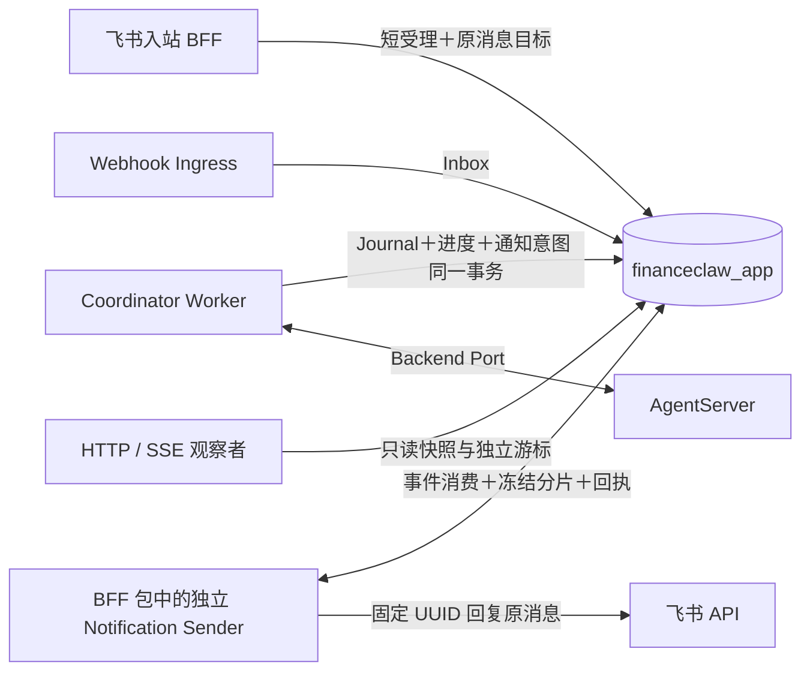

# Stage 8B：持久通知与渠道交付

日期：2026-09-08。

8B 已实现代码与隔离验证，**真实飞书渠道验收尚未完成**，主动通知默认关闭。
8A 自托管 PostgreSQL／Redis Agent runtime 的许可凭据验收仍保留为待授权；本阶段没有使用这些凭据。
8C 的 legacy 根接管、生产滚动演练与容量收敛没有提前计为完成。

## 最终结构



BFF、Coordination 继续共用业务数据库。协调规则在 `coordination`，通知渠道规则在
`bff/notifications`，共同事务中的持久事实在 `shared/notifications`；没有引入 Temporal、
第二个业务库或额外消息队列。独立发送器不导入 AgentServer、不启动 BFF app 或 WebSocket。

## 实现边界

- 迁移 `0010_stage8b` 新增 `notification_targets/events/deliveries/senders`。
  脚本为静态增量 DDL，缺 schema 拒绝启动；存在事实时拒绝破坏性 downgrade。
- 飞书首次受理以完整 app／tenant／subject／chat／原消息和可信来源摘要核对已有绑定，
  订阅与 Turn、Journal、有限授权、固定 start 命令同事务提交。原消息重推不新增订阅。
- 根终态、待处理交互、重新授权和需处理停顿在状态事务内产生事件。
  完成通知从同事务唯一助手 Journal 冻结正文；通知写入失败时 completed 和答案一起回滚。
- 订阅器逐事件事务消费，固定全部文本分片、内容版本、摘要和发送 UUID；审计 Outbox 的
  published 不能覆盖或替代通知回执，不使用可能跳过迟提交事务的全局递增消费水位。
- `text_reply_v1` 订阅根的前台只做短受理，卡片与后台发送器不会各发一份最终答案。
  交互回复关联原根与原目标，不追加第二份最终订阅。
- PostgreSQL `SKIP LOCKED` 每次领取一个分片，owner／epoch／lease 保护回执并支持续租。
  sending 进程退出后按 uncertain 处理；明确限流按有限次数退避，永久拒绝为 dead_letter。
- SDK 底层 `areply` 固定目标和方法。成功必须有消息 ID、匹配 chat／parent；回执缺失或
  无法分类时保持 uncertain。默认不自动重发；明确验证窗口和证据后才允许原键恢复。
  窗口与证据摘要在首发固定，后一次拒绝不抹除前一次未知结果。
- 发送前核对当前本地绑定、白名单、原消息远端身份、交互截止时间及决定／取消状态。
  过时提示保留 suppressed；未知前片阻止后续分片跳过。
- 新根固定 driver 版本 2，使不理解通知的 8A Worker 无法领取；新 Worker 兼容原版本 1
  的无订阅 8A 根，仍不自动迁移 legacy 根。BFF readiness 要求新版本 Worker 和独立 Sender 心跳。
- SSE 以 `<root>:<revision>` 为 ID；重连独立回放安全进度并发送当前快照。
  Journal 与 revision 通过同一次 SQL 读取，跨根／无效／未来游标和历史缺口回到安全快照，
  不回放 token 或历史审批动作。单次回放最多 256 个历史进度事件。
- 增加通知纯读 API、撤销 API 和飞书 `/mute <root>`，撤销只关闭该订阅，不取消 Agent。

配置、启动命令和状态处置见 [通知运维说明](../../docs/operations/notifications.md)。

## 验证记录

机器可读结果见 [`verification.json`](../evidence/stage8b/verification.json)。
测试使用合成内容，官方 SDK 协议测试只替换 HTTP 边界和合成 token，不连接飞书。

全量回归：**319 passed，10 skipped，2 deselected**；真实 PostgreSQL Stage-8 回归：
**68 passed**。最后增加的超大 SSE 游标保护另有 **2 passed** 的针对性补跑。
Ruff、格式检查和 `git diff --check` 通过。原有本地变更与测试文件保持保留。

| 场景 | 验证 |
|---|---|
| S8-22：完成事务通知写入后异常 | Journal／完成／事件一起回滚，重启继续观察原操作，Agent 创建次数仍为 1 |
| S8-23：明确拒绝、回执丢失、sender 重启 | 原目标／正文／UUID 固定；未知结果按验证窗口门控；过窗不重发 |
| S8-23：进程硬退出后双进程接管 | 真 PostgreSQL＋独立 OS 进程运行正式 Sender 循环，合成外部账本保存原消息；两次原键请求只对应一条外部记录 |
| S8-24：撤销、重绑定、过期、回答与取消 | 不发送旧提示或其他接收人的答案，交互回复不新增最终订阅 |
| S8-24：UTF-8 分片与卡片模式 | 正文无损，UUID 按片固定，未知前片阻止后续片；BFF 不创建第二份最终展示 |
| S8-25：多观察者与历史缺口 | 独立游标、明确重置、完整 Journal 答案；进度、通知与 backend 操作计数不变 |
| SDK 真实协议边界 | `lark-channel-sdk 1.4.0` 实际模型、序列化和 HTTP Transport；保留 UUID、只调用 reply、解析真实响应结构；不以布尔 gateway 桩代替 |
| Schema 与兼容 | SQLite／PostgreSQL 正式 Alembic 升级、空表回滚、重新升级；保留事实门禁；driver 版本 2 与旧 Worker 隔离 |

复现隔离测试：

```bash
.venv/bin/pytest -q -m 'not external'
FINANCECLAW_STAGE8_TEST_POSTGRES_URL=postgresql://postgres@127.0.0.1:55439/postgres \
  .venv/bin/pytest -q tests/stage8
```

PostgreSQL 命令只用于专门的临时实例；fixture 为每次测试创建独立数据库并在结束时删除。
多进程测试的外部账本是合成渠道，不代表真实飞书的幂等窗口已通过。

## 真实环境与保留门禁

尚未向真实飞书用户发送验收消息，尚未验证真实服务的完整去重窗口。
已准备 [合成单聊验收动作](../evidence/stage8b/feishu-canary-plan.json)，等待明确授权的测试 chat 和原消息。
同 UUID 的短间隔重复只能验证观察到的短间隔，不自动证明整小时窗口；配置保持窗口 0。

还需真实单聊验证长文本顺序、原消息撤回、消息回执丢失和去重窗口边界。
消息已进入网络后无法通过本地撤销收回；继续保存回执，决定入口仍校验权限与交互生命周期。
飞书 SDK 回调到业务受理提交前的进程内窗口保持原边界，没有宣称入站消息已持久化。
8A 历史验证文件保持不变，本记录仅描述 8B 的增量实现与证据。
