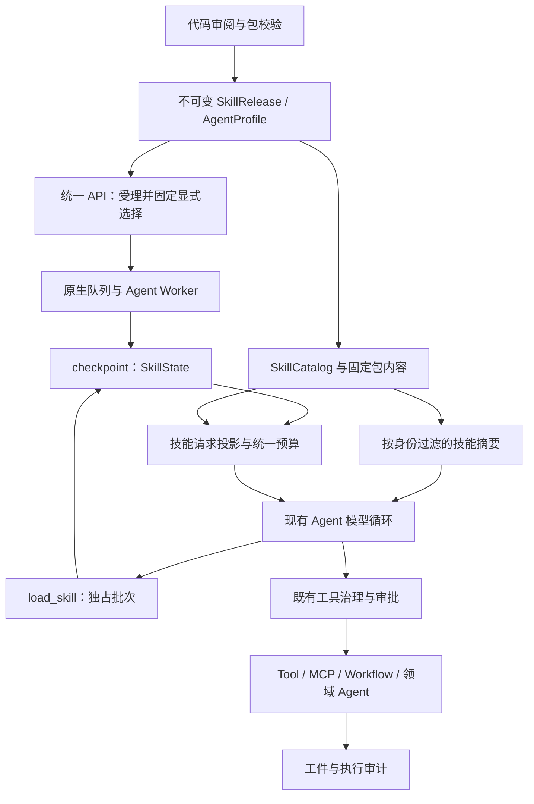

# Skills 运行时接入实施方案（参考 Codex）

状态：待实施，设计基线 v1.0，2026-09-12。已核对参考源码与当前项目代码；本文的接口、配置、测试及性能指标均为实施目标，不表示功能已完成。

代码基线：FinanceClaw `7dab6d47af6a6e0fcfe59caca04918b3c91cf058`。Codex 参考固定为 [`c4017a87aacc7558002b7cb510025e967c1d765e`](https://github.com/openai/codex/commit/c4017a87aacc7558002b7cb510025e967c1d765e)，为本次读取时的默认分支头；不使用浮动 `main` 作为行为依据。[源码核对清单](../evidence/skills/codex-reference.json) 保存读取文件及内容摘要，性质是研究证据，不是运行验收。

配套基线：[当前架构](../README.md)、[Stage 11 异步记忆与上下文治理方案](stage-11-异步记忆与上下文治理实施方案.md)。本方案可以基于当前代码独立推进，但预算准备与 Stage 11 共用一个实现；不要求先实现后台记忆提取。

工作树说明：编写期间已出现并行中的 Stage 11 改动，包括 `shared/llm/budget.py` 的 `ContextBudgetPlanner`、`agent_server/context/planning.py` 和 WorkingContext。它们尚未提交，也未在本任务中验证。下面的基线表描述上述固定提交；P0 必须先核对并复用在途实现，不据此重复建设预算或投影模块。

## 1. 交付目标与首期范围

让业务 Agent 能根据任务选择经过平台发布的技能，按需取得执行方法和参考资料，再使用已有受治理工具完成任务。例如用户发送：

```text
/skill market-brief 请根据可取得的数据整理 AAPL 简报，列明来源、数据日期和缺失信息。
```

目标链路：真实用户输入 → 固定技能版本 → 加载任务方法 → 调用已有行情工具 → 按模板作答。缺少数据时如实说明；skill 不生成行情事实，也不改变工具权限。

首期必须完成：

- 仓库内受审阅的 `SKILL.md`、UTF-8 参考资料与文本模板，随镜像和 Python 包发布。
- 技能发布目录、Profile 绑定、显式选择、模型按需激活，以及只允许显式选择的策略。
- 原生 checkpoint 中的有界激活状态，覆盖同 Turn 澄清、审批和重启恢复。
- 主文与资源的预算、来源记录、访问校验及稳定错误行为。
- 一个 `market-brief` 示例技能及端到端验收。当前行情工具使用演示数据，机制验证与真实研究质量分开报告。

首期仅发布已确认能通过现有工具完成的文本型技能。任意 Python/Bash 执行、用户上传、在线安装、插件市场、模型自动编写技能、多源覆盖规则、动态注册工具和自动下载 MCP 依赖属于后续范围。二进制 assets 可以列在发布清单中，但本期文本读取工具不展开它们；需要使用此类文件的技能须先提供对应受治理能力。

## 2. Codex 机制与采用边界

Codex 当前参考源码分为 `codex-rs/skills` 的解析/选择等基础能力，以及 `codex-rs/ext/skills` 的发现、来源、上下文与工具扩展。下面区分源码事实与 FinanceClaw 的设计选择。

| 编号 | Codex 中核实的行为 | FinanceClaw 采用方式 |
|---|---|---|
| C1 | `SkillMetadata` 分开描述名称、说明、界面、依赖、策略、路径及来源；`allow_implicit_invocation` 缺省为 true。[模型定义][cx-model] | 分开管理包元数据、平台发布策略、运行状态。隐式调用开关既影响目录可见性，也在激活入口复验。 |
| C2 | Host 来源包括配置层、用户/系统位置、插件和仓库祖先目录；`HostSkillsService` 管理快照、配置相关缓存与失效。[来源][cx-roots]、[服务][cx-service] | 首期只使用明确发布的包目录；全局共享不可变包内容，每次按当前身份计算可见性。服务端不扫描宿主用户目录。 |
| C3 | 显式选择优先匹配结构化路径，纯名称只在无歧义时匹配，并按身份去重；同名不等于可随意互相替代。[选择][cx-selection] | 使用稳定 skill ID 和固定版本。一个 Profile 内显示名称唯一；重复声明或歧义在发布期报错。 |
| C4 | Host skill 的隐式禁用会使目录条目对模型隐藏，同时保留显式选择能力。[Host 适配][cx-host-provider] | `enabled=false` 完全禁用；`allow_implicit_invocation=false` 允许当前真实用户显式选择，模型自行点名也不能绕过。 |
| C5 | 技能目录片段使用 developer 角色；已选正文使用 user 角色，并有独立内容类型和资源访问元数据。[片段][cx-fragments] | 平台规则和技能正文分层。正文作为带来源的请求投影，优先级低于平台规则及真实用户当前要求，不写成系统授权。 |
| C6 | 元数据目录默认预算与上下文窗口关联；描述可缩短，条目可省略并发出提示。主文与目录预算分开。[渲染][cx-render] | 建立独立目录分配及省略统计，但统一计入最终请求预算。本文默认值是本项目配置，不照搬字符/字节值当 token。 |
| C7 | Skill catalog 使用 authority、package、resource 区分内容来源；`skills.read` 检查所属来源、包、资源、环境及分页快照。[目录][cx-catalog]、[读取][cx-read] | 保留包身份和资源引用，读取只能命中固定包清单。首期一个本地发布源，不引入完整多 Provider 框架。 |
| C8 | 运行时区分所选条目与已注入主文，并记录已注入路径，避免不同入口重复注入。[Host 主文][cx-host-prompt]、[扩展入口][cx-extension] | 分开 requested、active、实际进入模型的 references；显式与自动激活共用同一领域入口。 |
| C9 | 依赖声明不等于已经可用。MCP 依赖安装有功能开关、交互和安装前策略校验。[依赖接入][cx-mcp] | 将依赖映射到已发布 ToolRef；缺依赖时明确不可用。包内 URL/command 不启动连接、进程或安装。 |
| C10 | 基础目录指导模型按需读取；源码也存在受配置控制的 shadow selection，其候选选择不直接改变模型可见目录。[选择实验][cx-shadow]、[调用识别][cx-invocation] | 首期由模型根据可见摘要决定是否加载，观测真实激活事件。暂不增加单独的 LLM 路由器或检索排名系统。 |

两个细节不能扩大解释：其一，参考版本的扩展入口存在对主文按字节截断并警告的路径，Host 入口又对部分技能区别处理，不能概括为所有技能都有相同主文行为；本项目采用主文完整加载或明确拒绝。其二，已解析的策略字段不能一概当作完整安全边界；本项目明确列出并测试实际支持的策略。

官方说明用于补充格式与使用概念：[Build skills](https://learn.chatgpt.com/docs/build-skills)。该页面目前说明渐进加载、显式/隐式选择以及可选 `agents/openai.yaml`。具体参考行为以上述固定提交为准。

## 3. 项目基线与接入缺口

| 编号 | 固定基线代码 | 接入工作 |
|---|---|---|
| B1 | [AgentProfile](../../financeclaw/kernel/agents.py) 固定提示、工具版本、上下文策略及发布指纹 | 增加 `allowed_skills` 与技能上下文限额；技能内容 hash 纳入发布。 |
| B2 | [AgentFactory](../../financeclaw/agent_server/agents/factory.py) 统一组装 `create_agent`、治理、HITL、重试和预算 | 注册两个受治理技能工具与技能状态/上下文中间件。 |
| B3 | [指令中间件](../../financeclaw/agent_server/middleware/directive_middleware.py)、[执行治理](../../financeclaw/agent_server/middleware/middleware.py)、[批次准入](../../financeclaw/agent_server/middleware/batch_middleware.py) 都理解显式能力指令 | 三处一起支持 skill 语义，避免加载后业务工具被“只能调用指定能力”规则拒绝。 |
| B4 | 批次准入把 READ 工具视为可并行 | 激活会更新图状态，须增加独占批次声明，不能只标 READ 就与业务工具并发。 |
| B5 | [原生状态](../../financeclaw/agent_server/context/state.py) 和 [工件中间件](../../financeclaw/agent_server/middleware/artifact_middleware.py) 已支持持久状态与保留 Command 更新 | 只在状态中保存激活引用；正文不经大工具结果 offload 后才重新寻找。 |
| B6 | [压缩](../../financeclaw/agent_server/context/compaction.py) 触发主要统计 messages，[最终请求记录](../../financeclaw/agent_server/middleware/final_context.py) 才检查完整输入 | 前置预算同时考虑技能、系统内容和 Schema，并与 Stage 11 的 `ContextBudgetPlanner` 共用实现。 |
| B7 | [真实用户判定](../../financeclaw/kernel/turns.py) 目前只排除摘要；[完成检测](../../financeclaw/api/application/turns/backend.py) 会把后续 user 消息视为另一 Turn | 技能正文只进入请求副本，明确合成来源，禁止持久化为用户输入；补充统一来源判定防线。 |
| B8 | [API 请求](../../financeclaw/kernel/responses.py) 是 message-only；[受理](../../financeclaw/api/application/turns/admission.py) 与 [发布快照](../../financeclaw/shared/turns/snapshots.py) 已支持幂等和恢复校验 | 保留请求形状，将解析后的显式选择存入服务端快照，不开放客户端伪造运行状态。 |
| B9 | [紫微 finalize](../../financeclaw/agent_server/graphs/ziwei_agent.py) 直接构造提示并调用模型 | 首期不迁移紫微解释规则；以后在该节点显式接入统一投影与预算，不能认为 Factory 改动已覆盖。 |

Skill 提供任务方法；工具提供事实或操作；Workflow 保证确定步骤和审批；领域 Agent 提供隔离上下文及结果契约。首期保留这些执行边界。

## 4. 目标拓扑与模块



```text
financeclaw/
  kernel/skills.py                   发布、选择、资源和策略声明
  shared/skills/
    catalog.py                      不可变目录、发布绑定解析、可见性判定
    packages.py                     文件清单、包 hash、受限资源读取
    directives.py                   真实用户 skill 选择语法的纯解析
    builtin/market-brief/
      SKILL.md
      agents/openai.yaml
      references/report-format.md
    builtin/index.json              构建时生成的固定包清单
  shared/releases/skills.py          平台策略与 ToolRef 映射
  agent_server/skills/service.py     激活准入与请求内容准备
  agent_server/tools/skills.py       load_skill / read_skill_resource 薄适配
  agent_server/middleware/skills.py  状态初始化和模型请求投影
  agent_server/context/              统一预算与最终请求记录的扩展
```

`kernel` 只放声明；`shared` 不导入 AgentFactory、ToolRuntime 或角色包；`agent_server` 承担 LangChain/LangGraph 适配。沿用 [包依赖测试](../../tests/stage5/test_package_architecture.py)。不新增服务进程、数据库任务队列、Skill Run 或技能执行图。

## 5. 发布包与静态契约

### 5.1 包格式和平台绑定

示例 `SKILL.md`：

```yaml
---
name: market-brief
description: 根据已有行情工具整理单标的简报，保留来源和数据日期，说明缺失数据。适用于简报整理，不用于自动交易。
metadata:
  version: "1.0.0"
---
```

正文写明任务步骤、需要的工具、停止条件和 `references/report-format.md` 的用途。可选 `agents/openai.yaml` 支持 `interface` 展示信息、`policy.allow_implicit_invocation` 和 `dependencies.tools` 的声明读取；`metadata.version` 只是作者信息，运行版本以平台发布清单为准。

平台发布声明独立指定：

| 契约 | 必要字段与规则 |
|---|---|
| `SkillRef` | `skill_id`、语义化 `version`、完整包 `package_hash`；禁止运行期解析 latest。 |
| `SkillRelease` | ref、name、description、入口、资源 manifest、已支持的调用策略、required ToolRefs、required scopes、tenant allowlist（可选）、内容/预算规则版本。 |
| `SkillResource` | 相对路径、SHA-256、字节数、媒体类型；文本编码为 UTF-8；路径和文件类型可验证。 |
| `AgentProfile.allowed_skills` | 有序且不重复的 SkillRef；每项 required ToolRef 必须属于该 Profile 的固定允许工具。不同 Agent 分别绑定。 |

平台 `enabled`、租户、权限、工具和预算规则只能由服务端发布配置决定。包作者声明只能表达要求或进一步限制，不能赋予访问权。`allowed-tools`、依赖 URL、command 及未实现的产品策略字段不作为授权；安全相关但不能解释的策略须在发布校验时给出不支持错误。

首期不合并同名包，也不使用“后扫描覆盖前扫描”。一个 Profile 中 name 和 skill ID 均无歧义；更换包需要新版本及发布指纹。普通展示字段可以忽略，缺少必填元数据、重复 YAML 键、错误类型或不合法资源引用应阻止所选发布物启动。

### 5.2 包读取与缓存

构建时对入口、元数据文件及全部资源按规范化相对路径排序，用文件路径、类型、字节数和内容 hash 形成包 manifest，再计算包 hash。空目录不影响 hash；所有被引用文件必须在 manifest 中。将 manifest 和非 Python 资源加入 `pyproject.toml` 的 package-data，并验证 wheel 中的内容与源码一致。

每个进程启动时读取并校验本次发布需要的包，保存不可变内容快照。模型循环从该快照取得内容，避免“启动时校验旧文件、调用时读取已被替换的文件”。缓存键是包 hash，不缓存跨用户的可见结果。API 和 Worker 必须解析出相同发布指纹。

首期发布目录拒绝符号链接和特殊文件。读取接口只接受 manifest 内的相对路径，拒绝绝对路径、`..`、反斜杠、URI 和编码后的逃逸形式；不把正文中的路径直接交给通用文件读取器。外部链接仅作为资料引用，不自动抓取。

## 6. 调用、状态与资源工具

### 6.1 显式选择与自动选择

保持 `ConversationTurnRequest.message` 不变。首期支持消息开头的 `/skill <skill_id> [任务正文]` 和 `$<skill_id> [任务正文]`；只处理真实新 Turn 输入开头的控制语法，不扫描引用、代码块、工具输出或历史摘要中的 `$`。任意位置的富文本 mention 和客户端选择器留待后续。

API 先保持现有幂等重放语义，对新请求解析并校验选择，把固定 `requested_skills` 写入同一 Turn 的 `release_snapshot`；原始用户正文完整保留。重复请求返回原受理结果，不重新绑定当前目录。明确选择不可用技能时返回稳定业务错误，由渠道错误投影展示，不创建偷偷改用其他方法的替代任务。

显式选择在第一轮模型调用前通过同一激活服务完成，模型无需额外调用一次加载工具。自动选择时，模型根据有界摘要调用 `load_skill`。`allow_implicit_invocation=false` 的技能不进入自动选择目录；即使模型猜中 ID，未存在本 Turn 的可信显式选择也拒绝加载。

`/skill` 表达方法选择，随后允许多步使用 Profile 中已经授权的工具。需同时调整 `InvocationDirectiveMiddleware`、`ToolGovernanceMiddleware._directive_denial` 和 `ToolBatchMiddleware`，防止旧逻辑把它解释成 `call_skill__...` 或在首次加载后禁止继续。

### 6.2 激活状态

`SkillState` 作为 AgentState 扩展，由技能中间件注册；所有启用技能的图使用相同字段定义。建议结构：

```text
skill_state = {
  turn_id,
  execution_scope,             # root，或服务端 InvocationScope.identity
  catalog_fingerprint,
  active: [{skill_ref, activation_source}],
  explicit_initialization_done
}
```

`activation_source` 为 explicit/model，由服务端确定。身份、scope、hash 和授权标志不接受模型入参。工作步骤继续归原生 messages/Stage 11 WorkingContext；技能状态不维护另一份任务状态机。

- 新的真实 Turn 清空旧激活集合，重新评估；同一 Turn 的 resume 不清空。
- 同一 scope 中重复加载相同 SkillRef 幂等，只有一份有效正文；不同版本不能同时激活。
- Worker 使用 [InvocationScope](../../financeclaw/agent_server/tools/subgraph_scope.py) 区分同一 Agent 的不同调用。根激活状态不自动传入 Worker；首期示例只绑定根 Agent。
- 技能操作先验证当前运行授权和固定发布，恢复校验不得只相信 checkpoint 中自报的 ID。
- 状态只能由原生图更新持久化，服务实例、全局变量和 ContextVar 不保存激活集合。

### 6.3 `load_skill`

输入为 `{skill_id}`，版本由本次 Profile 绑定解析。步骤：校验真实运行 → 校验 Profile/租户/scopes/调用策略 → 取得并校验固定包 → 检查激活数量、主文容量及完整请求的准备可行性 → 返回包含短 ToolMessage 回执和激活引用的 `Command(update=...)`。没有可行压缩空间时拒绝新激活，不能先承诺可用再静默丢弃其他必要内容。

回执包含 skill ID、version、package hash、资源摘要及 `prepared/already_active`，不返回整份主文，不表示业务任务完成。失败不修改激活集合。原生 checkpoint 提交后的 active 集合才是恢复依据；单独一条日志或审计事件不证明 checkpoint 已提交。

该工具读取发布内容并更新本任务上下文，可使用 READ 治理类别，但必须独占工具批次。给 `ToolGovernance` 增加正交的 `exclusive_batch` 声明（默认 false），`load_skill` 设为 true；批次准入在任何工具执行前拒绝混合批次，补齐每个 call ID 的结果后让模型重新决策。声明纳入发布指纹。不能把激活与依赖该激活的业务操作放在同一并行批次。

两个技能工具使用 READ、幂等、无需人工审批和无外部数据出口的发布声明；固定本地快照读取不启用瞬态自动重试。模型发起的加载消耗既有工具调用预算；服务端显式预加载不伪造模型/工具调用计数，但仍受包读取和上下文容量限制。

### 6.4 `read_skill_resource`

输入为 `{skill_id, resource_path, cursor?}`。只读本 scope 已激活技能的 manifest 内文本资源；每次复验当前权限与版本。主入口 `SKILL.md` 不能经此工具绕过激活策略。工具不接受宿主路径、任意 URL、可执行命令或租户 ID。

返回包/资源 hash、实际字符范围、正文、是否完整及 `next_cursor`。游标应绑定包 hash、资源 hash 和偏移量并验证完整性；不能指向另一版本或依赖进程内分页缓存。字符偏移和 UTF-8 字节限额分别处理，不能切断多字节字符。

资源读取是普通只读工具，可并行；结果继续通过平台工件归档和清理通道。需要长久保持的必要操作规则放主文，资源失去上下文后可按原版本重新读取。二进制或脚本执行要求返回明确不支持结果，不以“文件已读取”冒充“脚本已运行”。

## 7. 模型上下文、来源与压缩

### 7.1 指令层次

平台系统提示规定 skill 的用法和边界；可见目录放在平台拥有的说明区域。技能主文使用专用的合成 user 内容块，与 Codex 的目录/正文层次相对应，并携带 `financeclaw_content_kind=skill_instructions`、SkillRef 和资源 hash。

主文只加入 `request.messages` 的副本，放在消息序列前部的完整块中，不插入未完成 tool call 与其 ToolMessage 之间；不写入 `state.messages`、Journal、Interaction 或长期记忆来源。原始用户要求保持原样，技能内容不能伪装用户授权或覆盖平台政策。

投影必须在指令解析、真实用户识别、检索查询选择之后执行，在最终预算与请求记录之前完成。统一的 `is_user_message` 同时排除平台标记的摘要与技能合成片段；入口不允许客户端注入该可信元数据。仍以服务端绑定的 Journal message ID 判定真实用户来源，不能仅凭模型消息 role 认定证据。

每次模型请求按 checkpoint 的 active 引用重新组装主文，且只出现一次。这样上下文清理可以处理工具回执而不丢失执行指导。必要主文不能被摘要后冒充原指令；新 Turn 也不会继承一串陈旧技能正文。

### 7.2 统一容量准备

本方案与 Stage 11 共用 `ContextBudgetPlanner`，提前准备 system、目录、active 主文、真实用户输入、记忆、工具结果及工具/输出 Schema 的完整输入。先校验和准备必要内容，再缩减可回读结果、摘要允许的历史，最后重新计数。技能主文属于 active 期间的必要内容。

P0 优先核对并扩展工作树已有的 `shared/llm/budget.py` 与 `agent_server/context/planning.py`，将技能区域加入同一准备入口。若在干净基线上实施且 Stage 11 代码尚未合入，则在本方案内完成该预算契约的必要子集；后续 Stage 11 扩展同一 planner，不能保留两个独立预算器。真实窗口/独立输入 cap、输出预留、降级模型最小容量及计数器版本沿用 Stage 11 第 11.2 节约定。

前置准备与最终请求必须复用相同内容渲染和容量计算。`FinalContextMiddleware` 继续作为最后硬检查，覆盖重试、fallback 和动态可见工具后的实际输入；不以“最后会报超限”为前置准备的替代。摘要调用只处理允许压缩的内容，不附带回答阶段的全部技能正文。

初始限额如下，实施时进入固定发布配置；这些是待验证默认值：

| 项目 | 默认限额 | 超限行为 |
|---|---|---|
| 一个发布包 | 1 MiB、64 个文件；单文件 256 KiB | 发布失败；字节限额用于 I/O 与内存防护。 |
| 一个 Profile 的技能数 | 32 | 发布失败；扩容前评估发现质量和目录预算。 |
| 模型可见目录 | `min(1024 tokens, 有效输入额度的 2%)` | 优先使用短摘要，再确定性省略条目，记录统计；显式解析仍查完整可用目录。 |
| 单技能主文 | 2048 tokens | 发布校验不通过或运行时明确拒绝；不截断正文。 |
| 同 scope 的 active 主文 | 最多 2 个、合计 4096 tokens | 新激活失败，现有激活保持；不静默淘汰仍使用的技能。 |
| 单页资源 | 1024 tokens，且完整序列化结果不超过 8 KiB 与平台 inline_bytes 的较小值 | 调整页边界、返回游标；正文不能静默缺页。 |

所有区域最终还受完整请求可用容量限制，上述限额不是额外赠送的上下文空间。计数器使用本项目统一实现，并同时记录估算方法与 Provider usage，不能将字节/字符当作精确 token。

## 8. 发布、权限与恢复

SkillRef、调用策略、资源 manifest、工具依赖和技能预算一起进入 AgentProfile/configuration fingerprint。根与 Worker 发布声明都必须固定各自绑定；沿用现有 `agent_snapshot`、`verify_agent_snapshot` 和 Worker manifest 校验，不新增独立恢复协议。

API 受理时固定本次可用发布及显式选择，Worker 启动/恢复时验证同一版本。原包不可用、hash 不符、声明变更时使用稳定发布冲突，禁止选择最新包继续。首期不增加旧包数据库或热更新协议，仍使用当前项目的固定发布与 drain/重新授权流程。

每次目录展示、激活、资源读取及主文投影均按当前运行身份和授权复验。包允许访问不等于依赖工具获准执行，写入和外部操作仍走原 ToolPolicy、HITL、批次及持久预算。授权过期或被撤销时，即使包已缓存，也不继续向模型提供受限内容。

本期缓存内容随进程发布固定；重新部署产生新目录。环境开关只能控制是否装配技能功能，不允许从客户端覆盖包根目录、执行环境或权限。首期不实现按用户在线启停；将来加入时须提供服务端版本和跨副本失效机制。

## 9. 与记忆、领域 Agent 和 Workflow 的关系

技能包是版本化代码资产，checkpoint 只保存运行引用；Stage 11 的 SQL/Store 继续处理记忆事实和检索。记忆提取不得把技能主文、示例或模板中的“用户偏好”当作真实用户证据。工作状态可以记录“本任务使用哪个 SkillRef”，不得自行把此事实升级为用户永久默认技能。

首期 `market-brief` 绑定根 Agent，用于表达与证据组织，复用已有只读能力。现有 `market_research_agent` 保留隔离边界，不因为出现 skill 就删除领域 Agent。

紫微解释方法未来可拆为领域 skill，但排盘规则、对象绑定、ChartProjection 校验、result envelope 和预算仍由代码负责。届时 `ZiweiState` 与 finalize 必须共同接入引用状态和统一请求投影，并验证真实的最终解读模型请求。本文首期不迁移紫微提示词。

Workflow 的必要步骤、幂等和发布审批保持代码保证。技能可以建议调用 `call_workflow__...`，不能通过自然语言步骤替代 Workflow 的审批点。

## 10. 观测、失败与数据模型

复用现有 audit、模型 Manifest、checkpoint 和 artifact；不新增 skills、skill_runs、skill_jobs 等业务表。扩展 `ModelContextManifest` 的 `skill_catalog_hash`、目录省略统计、`skill_refs` 和本次仍在上下文中的 `skill_resource_refs`，记录确实进入该次请求的版本、hash、范围和 token 估算。

资源 ToolMessage 使用服务端生成的来源元数据；归档/清理后保留资源与工件引用。用户或工具返回的同名字段不得直接成为可信 Manifest 记录。主文引用由平台请求投影产生，不能从任意消息标签猜测。

记录 `skill.load_prepared`、`skill.load_rejected`、`skill.resource_read`、显式/模型选择方式及耗时。继续使用现有工具审计；显式预加载也记录准备事件。实际激活以 checkpoint 为准，实际模型使用以最终请求 Manifest 为准，不宣称 SQL 审计与原生 checkpoint 存在跨库原子提交。

错误输出采用稳定 `code + message`，首期固定 `SKILL_UNAVAILABLE`、`SKILL_EXPLICIT_REQUIRED`、`SKILL_DEPENDENCY_UNAVAILABLE`、`SKILL_ACTIVATION_LIMIT`、`SKILL_CONTEXT_BUDGET_EXCEEDED`、`SKILL_RESOURCE_INVALID` 和 `SKILL_RELEASE_MISMATCH`。无权访问时对外统一为 unavailable；依赖和版本诊断只向有权主体提供。API 业务错误、模型 ToolMessage 和渠道展示共用同一错误映射，不能让确定的输入错误触发渠道无休止重试。

| 情况 | 目标行为 |
|---|---|
| 当前身份无技能访问权 | 不向模型列出；加载/读取返回统一不可用结果，不泄露其他租户的目录。 |
| 仅显式技能被模型自行点名 | 拒绝，状态不变；不把模型传入的 explicit 字段当许可。 |
| 显式技能无效或缺依赖 | 受理给出确定业务错误，渠道展示可理解的原因。 |
| 自动加载发现不可用 | 返回工具错误，由 Agent 说明限制或使用其他已授权方法；不能声称该技能已执行。 |
| 主文或必要输入无法放入窗口 | 激活/请求准备受控失败；保留当前任务输入，不截断必要规则。 |
| 混合激活批次 | 整批在派发前拒绝；所有 call ID 有配对回执，没有部分业务执行。 |
| 同 scope 重复加载 | 返回幂等回执，激活集合与上下文不增长。 |
| 旧 Turn 重启、HITL resume | 从原 checkpoint 和固定发布恢复，实际 grant 仍需有效。 |
| 固定包缺失或内容不同 | 发布冲突；不换版本、不把失败计为业务成功。 |
| 资源游标、路径或文件类型非法 | 稳定工具错误，无目录外读取或隐式执行。 |
| 日志存在但 checkpoint 未提交 | 允许幂等重放；不能仅凭 load_prepared 日志恢复为 active。 |

## 11. 实施顺序与交付门禁

| 阶段 | 必须交付的内容 | 通过条件 |
|---|---|---|
| P0：契约与预算准备 | 先核对并复用 Stage 11 在途模块，再补 SkillRef/Release/State、来源标记、技能预算区域和 Manifest | 同一组内容在准备和最终检查中容量一致；技能不会被识别成真实用户输入。 |
| P1：包与发布 | 安全 YAML 解析、严格发布校验、不可变包内容、required ToolRef 绑定、package-data、发布指纹 | 缺包、错误 hash、路径逃逸和重复名称均受控拒绝；API/Worker/wheel 解析一致。 |
| P2：激活与工具 | message-only 显式选择、快照固定、两个工具、独占批次、自动/显式权限、状态去重 | 显式首轮可用，模型可自动加载；混合批次无部分执行，幂等回放成立。 |
| P3：上下文与恢复 | 请求副本投影、目录预算、资源分页/归档、真实用户判定、授权复验、HITL/重启/新 Turn 行为 | 压缩后指导仍可用、下一 Turn 不串用、版本漂移不恢复、无用户证据污染。 |
| P4：示例与验收 | market-brief、固定评测集、真实模型对比、操作与限制文档 | 自动化契约全通过；真实模型质量与成本报告完整；待验证项逐项标记。 |

改动检查清单：`kernel/agents.py`、`kernel/tools.py`、`kernel/turns.py`；`shared/releases` 与 `shared/turns/snapshots.py`；API admission；Agent bootstrap/factory、三处显式指令处理、批次治理、上下文准备与最终记录；Manifest 模型/持久化映射；构建配置、测试和文档。按实际落地的 Manifest 字段更新唯一初始迁移，不复制 Stage 11 的记忆表。

发布时递增实际 Agent/deployment 版本并更新所有硬编码绑定及测试，不预占与并行 Stage 11 工作可能冲突的版本号。项目尚未上线，沿用未发布契约直接修改方式；数据库验证使用显式创建的空测试库，应用启动不自动删除本机数据。

## 12. 验收矩阵

| 编号 | 场景 | 可判定结果 |
|---|---|---|
| S01 | 合法包、缺元数据、重复键、歧义名称 | 合法包形成确定发布；其余不能进入所选 Profile。 |
| S02 | 正文/资源字节不变但读取顺序不同 | 包 hash 一致；任一文件内容变化使 hash 改变。 |
| S03 | wheel、源码、API 与 Worker 装配 | 相同技能清单与指纹；不存在只在开发机能读取的文件。 |
| S04 | `/skill` 和开头 `$skill`；引用/代码块中相同字样 | 只有定义的真实输入语法形成显式选择，Journal 原文不变。 |
| S05 | enabled=false、隐式禁用、无 scopes、其他租户 | 目录和读取策略一致；模型猜 ID、伪造来源均不能绕过。 |
| S06 | 显式选择后连续读取、计算、澄清 | 旧单能力指令规则不误阻断；业务权限仍在。 |
| S07 | 同批 load+业务工具、两个 load | 拒绝发生在任何工具执行前，每个 call ID 配对完整。 |
| S08 | 加载后在 checkpoint 提交前失败，再重放 | 只有一份最终 active 引用，不把准备日志作为完成事实。 |
| S09 | 两个会话、两个租户、同名 Worker 不同调用 | 内容缓存可共享，激活与授权互不串用。 |
| S10 | 同 Turn HITL resume、进程重启、新 Turn | 前两者保留原绑定，新 Turn 重新选择；超时/撤权不能继续使用。 |
| S11 | 原包不存在、主文/资源被替换、新版本部署 | 新进程拒绝损坏发布；旧状态恢复不静默切换版本。 |
| S12 | 主文大于 token 上限、多字节参考资料、伪造游标 | 主文完整或拒绝；分页无缺字/重复，游标不能跨包串读。 |
| S13 | 目录省略、显式指定被省略的合法技能 | 自动目录大小有界，省略可观测；显式选择仍准确解析。 |
| S14 | 工具清理、历史摘要、模型 retry/fallback | active 主文恰好一份；最终每个请求包含正确引用并满足容量。 |
| S15 | skill 示例含“用户同意/风险偏好”，正文为合成 user | 不成为 Journal/Interaction、真实 Turn 锚点或记忆证据；完成检测正常。 |
| S16 | skill 要求写操作、请求自动安装 MCP 或运行脚本 | 写操作按原治理决定；无自动安装或任意脚本能力；结果不虚报成功。 |
| S17 | 真实模型执行 market-brief | 使用工具事实、标注演示/日期/来源，未读取资源不冒充已核对。 |

分层执行：

1. 单元与契约测试覆盖解析、hash、策略、分页、状态和预算，不调用真实模型。
2. 使用真实 `create_agent` 与受控模型覆盖 Command、批次、HITL、清理和 Manifest，不能只测试 helper。
3. 原生 AgentServer + 隔离 PostgreSQL 验证 queue worker、重启、resume、完成检测及跨进程发布一致性。
4. 真实模型使用相同模型档案、输入和固定工具数据对比技能开/关。首轮至少 30 个任务（显式、适合自动选择、不应选择各 10 个），每项运行 3 次。初始目标：显式选择准确率 100%，自动选择命中率至少 90%，负例误触发率不超过 10%；来源保留、越权阻断与错误状态要求全部通过。结果质量不得低于对应基线；分别报告额外模型/工具调用、输入 token、端到端耗时和失败样例。

验收指标为待执行目标，不能把离线固定模型的通过率替代真实模型质量。真实模型或真实服务未验证时，交付状态须写明“契约已验证、真实环境待验证”，不得标记 P4 完成。

## 13. 后续脚本型技能的接入条件

只有明确的业务需求无法由现有受治理工具满足时才增加受管脚本执行入口。调用形状应为固定 `skill_ref + entrypoint_id + schema-validated args`，入口由平台发布映射，不能接受任意 shell 字符串。

执行环境需具有独立工作目录、包只读挂载、运行时/依赖版本固定、超时和资源限额、明确网络出口及最小凭据注入。输入/输出以授权资源和 artifact 引用交接；执行回执、产物登记与副作用由既有工具治理接管。写操作继续要求实际审批，不能通过包内“已授权”文字放行。

脚本执行隔离、依赖安装和二进制产物处理须单独提供实施及验收记录。首期文本型技能不宣称兼容任意 Codex 本机技能。

## 14. 固定参考

下列链接全部固定到本次核实的 Codex 提交。相关文件的 SHA-256 和行数见源码核对清单；不将下载的第三方源码复制进产品包。

[cx-model]: https://github.com/openai/codex/blob/c4017a87aacc7558002b7cb510025e967c1d765e/codex-rs/skills/src/model.rs
[cx-roots]: https://github.com/openai/codex/blob/c4017a87aacc7558002b7cb510025e967c1d765e/codex-rs/ext/skills/src/host_roots.rs
[cx-service]: https://github.com/openai/codex/blob/c4017a87aacc7558002b7cb510025e967c1d765e/codex-rs/ext/skills/src/host_service.rs
[cx-selection]: https://github.com/openai/codex/blob/c4017a87aacc7558002b7cb510025e967c1d765e/codex-rs/skills/src/selection.rs
[cx-host-provider]: https://github.com/openai/codex/blob/c4017a87aacc7558002b7cb510025e967c1d765e/codex-rs/ext/skills/src/provider/host.rs
[cx-fragments]: https://github.com/openai/codex/blob/c4017a87aacc7558002b7cb510025e967c1d765e/codex-rs/ext/skills/src/fragments.rs
[cx-render]: https://github.com/openai/codex/blob/c4017a87aacc7558002b7cb510025e967c1d765e/codex-rs/ext/skills/src/render.rs
[cx-catalog]: https://github.com/openai/codex/blob/c4017a87aacc7558002b7cb510025e967c1d765e/codex-rs/ext/skills/src/catalog.rs
[cx-read]: https://github.com/openai/codex/blob/c4017a87aacc7558002b7cb510025e967c1d765e/codex-rs/ext/skills/src/tools/read.rs
[cx-host-prompt]: https://github.com/openai/codex/blob/c4017a87aacc7558002b7cb510025e967c1d765e/codex-rs/ext/skills/src/host_prompt.rs
[cx-extension]: https://github.com/openai/codex/blob/c4017a87aacc7558002b7cb510025e967c1d765e/codex-rs/ext/skills/src/extension.rs
[cx-mcp]: https://github.com/openai/codex/blob/c4017a87aacc7558002b7cb510025e967c1d765e/codex-rs/core/src/mcp_skill_dependencies.rs
[cx-shadow]: https://github.com/openai/codex/blob/c4017a87aacc7558002b7cb510025e967c1d765e/codex-rs/ext/skills/src/dynamic_skill_selector.rs
[cx-invocation]: https://github.com/openai/codex/blob/c4017a87aacc7558002b7cb510025e967c1d765e/codex-rs/ext/skills/src/invocation.rs
