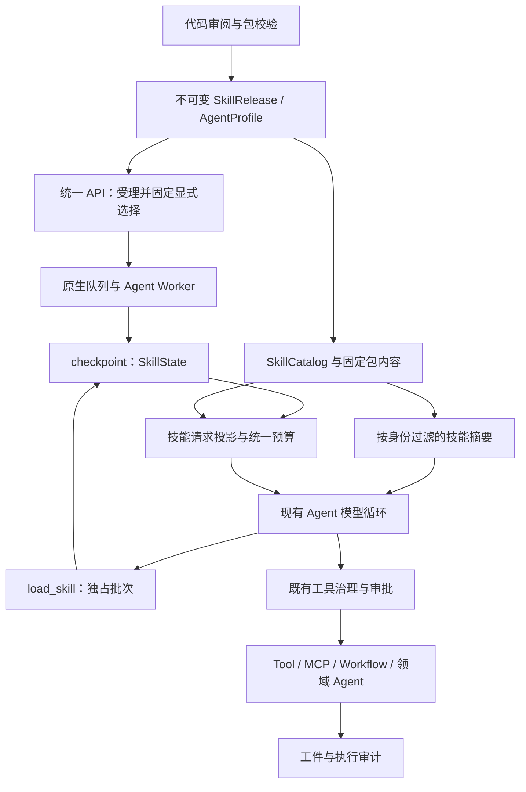

# Skills 运行时接入实施方案（LangChain 原生接入与 Codex 参考）

状态：设计基线 v1.1，2026-09-16；同日补充飞书 `/skills` 表单入口。运行代码与自动化契约已落地，P4 真实模型/渠道验收未完成。实现、测试证据与环境限制见 [Skills 实现与验证](skills-实现与验证.md)；下文保留设计约束与验收目标。

代码基线：FinanceClaw `1fc4ca466b3ae7fd7ee8ca95aad18be161410607`。Codex 参考仍固定为 [`c4017a87aacc7558002b7cb510025e967c1d765e`](https://github.com/openai/codex/commit/c4017a87aacc7558002b7cb510025e967c1d765e)，来自 2026-09-12 的源码核对，不代表当前上游默认分支头；不使用浮动 `main` 作为行为依据。[源码核对清单](../evidence/skills/codex-reference.json) 保留该次读取文件及内容摘要，性质是研究证据，不是运行验收。

配套基线：[当前架构](../README.md)、[Stage 11 异步记忆与上下文治理方案](stage-11-异步记忆与上下文治理实施方案.md)、[MCP 大结果归档与结构化读取方案](MCP-大结果归档与结构化读取实施方案.md)。本方案直接扩展已提交的上下文、记忆与工件实现。

基线说明：`ContextBudgetPlanner`、`projected_messages`、WorkingContext、工具进度流、结构化工件回读和 `FinishMiddleware` 已进入当前代码。这份基线提交尚无 Skills 发布目录、加载工具及专用投影，本轮实现已补齐。P0 复用这些现有模块，不另建预算器或恢复协议。该次设计修订覆盖资源权限传播、激活提交边界、中间件顺序、显式语法、框架选型及新增验收场景；验证范围是设计与代码对照。

## 1. 交付目标与首期范围

让业务 Agent 能根据任务选择经过平台发布的技能，按需取得执行方法和参考资料，再使用已有受治理工具完成任务。例如用户发送：

```text
/skill market-brief 请根据可取得的数据整理 AAPL 简报，列明来源、数据日期和缺失信息。
```

目标链路：真实用户输入 → 固定技能版本 → 加载任务方法 → 调用已有行情工具 → 按模板作答。缺少数据时如实说明；skill 不生成行情事实，也不改变工具权限。

首期必须完成：

- 仓库内受审阅的 `SKILL.md`、UTF-8 参考资料与文本模板，随镜像和 Python 包发布。
- 技能发布目录、Profile 绑定、显式选择、模型按需激活，以及只允许显式选择的策略。
- 原生 checkpoint 中的有界激活状态，覆盖同 Turn 澄清、审批和重启恢复。
- 主文与资源的预算、来源记录、访问校验及稳定错误行为。
- 一个 `market-brief` 示例技能及端到端验收。当前行情工具使用演示数据，机制验证与真实研究质量分开报告。

首期仅发布已确认能通过现有工具完成的文本型技能。任意 Python/Bash 执行、用户上传、在线安装、插件市场、模型自动编写技能、多源覆盖规则、动态注册工具和自动下载 MCP 依赖属于后续范围。二进制 assets 可以列在发布清单中，但本期文本读取工具不展开它们；需要使用此类文件的技能须先提供对应受治理能力。

## 2. 框架能力与 Codex 参考边界

### 2.1 LangChain / LangGraph 原生能力与选型

LangChain 官方以 `create_agent` 配合加载工具实现按需取得技能内容，并将内置技能支持指向 Deep Agents。工具、状态与中间件是现有框架的扩展机制。[LangChain Skills](https://docs.langchain.com/oss/python/langchain/multi-agent/skills)

Deep Agents 提供 `SkillsMiddleware`，支持发现 `SKILL.md` 摘要并通过文件读取能力按需加载正文及资源；它基于 backend 配置技能来源，并支持同名来源覆盖。[Deep Agents Skills](https://docs.langchain.com/oss/python/deepagents/skills)

| 能力 | 本项目采用方式 |
|---|---|
| Agent 循环、工具调用和状态持久化 | 继续复用现有 `create_agent`、`ToolRuntime`、`Command`、AgentState 与原生 checkpoint。 |
| 节点准备与请求变换 | 复用 `before_agent` / `before_model` 的状态更新，以及 `wrap_model_call` 的请求副本投影；实际顺序见第 7.2 节。 |
| 技能发现和渐进加载 | 采用官方 Skills 模式；只补本项目所需的固定包目录与两个受治理入口。 |
| Deep Agents 内置技能栈 | 首期不增加 `deepagents` 依赖。当前项目已有工厂、上下文和工具栈；固定 SkillRef、租户授权、工件权限传播及发布恢复契约仍需专门适配，直接替换不能完成这些接入要求。 |

这一选择保留框架原生执行语义，FinanceClaw 增加发布与治理约束。官方文档核对日期为 2026-09-16；工程接口以 [pyproject.toml](../../pyproject.toml) 固定的 LangChain `1.3.18`、LangGraph `1.2.11` 为实施和图级测试基准，不把在线文档新增接口默认为已安装版本可用。

### 2.2 Codex 机制与采用边界

Codex 当前参考源码分为 `codex-rs/skills` 的解析/选择等基础能力，以及 `codex-rs/ext/skills` 的发现、来源、上下文与工具扩展。下面区分源码事实与 FinanceClaw 的设计选择。

| 编号 | Codex 中核实的行为 | FinanceClaw 采用方式 |
|---|---|---|
| C1 | `SkillMetadata` 分开描述名称、说明、界面、依赖、策略、路径及来源；`allow_implicit_invocation` 缺省为 true。[模型定义][cx-model] | 分开管理包元数据、平台发布策略、运行状态。隐式调用开关既影响目录可见性，也在激活入口复验。 |
| C2 | Host 来源包括配置层、用户/系统位置、插件和仓库祖先目录；`HostSkillsService` 管理快照、配置相关缓存与失效。[来源][cx-roots]、[服务][cx-service] | 首期只使用明确发布的包目录；全局共享不可变包内容，每次按当前身份计算可见性。服务端不扫描宿主用户目录。 |
| C3 | 显式选择优先匹配结构化路径，纯名称只在无歧义时匹配，并按身份去重；同名不等于可随意互相替代。[选择][cx-selection] | 使用稳定 skill ID 和固定版本。一个 Profile 内显示名称唯一；重复声明或歧义在发布期报错。 |
| C4 | Host skill 的隐式禁用会使目录条目对模型隐藏，同时保留显式选择能力。[Host 适配][cx-host-provider] | `enabled=false` 完全禁用；`allow_implicit_invocation=false` 允许当前真实用户显式选择，模型自行点名也不能绕过。 |
| C5 | 技能目录片段使用 developer 角色；已选正文使用 user 角色，并有独立内容类型和资源访问元数据。[片段][cx-fragments] | 平台规则和技能正文分层。正文作为带来源的请求投影，优先级低于平台规则及真实用户当前要求，不写成系统授权。 |
| C6 | 元数据目录默认预算与上下文窗口关联；描述可缩短，条目可省略并发出提示。主文与目录预算分开。[渲染][cx-render] | 建立独立目录分配及省略统计，但统一计入最终请求预算。本文默认值是本项目配置，不照搬字符/字节值当 token。 |
| C7 | Skill catalog 使用 authority、package、resource 区分内容来源；`skills.read` 检查所属来源、包、资源、环境及分页快照。[目录][cx-catalog]、[读取][cx-read] | 保留包身份和资源引用，读取只能命中固定包清单。首期一个本地发布源，不引入完整多 Provider 框架。 |
| C8 | 运行时区分所选条目与已注入主文，并记录已注入路径，避免不同入口重复注入。[Host 主文][cx-host-prompt]、[扩展入口][cx-extension] | 分开 requested、active、实际进入模型的 references；显式与自动激活共用同一领域入口。 |
| C9 | 依赖声明不等于已经可用。MCP 依赖安装有功能开关、交互和安装前策略校验。[依赖接入][cx-mcp] | 将依赖映射到已发布 ToolRef；缺依赖时明确不可用。包内 URL/command 不启动连接、进程或安装。 |
| C10 | 基础目录指导模型按需读取；源码也存在受配置控制的 shadow selection，其候选选择不直接改变模型可见目录。[选择实验][cx-shadow]、[调用识别][cx-invocation] | 首期由模型根据可见摘要决定是否加载，观测真实激活事件。暂不增加单独的 LLM 路由器或检索排名系统。 |

两个细节不能扩大解释：其一，参考版本的扩展入口存在对主文按字节截断并警告的路径，Host 入口又对部分技能区别处理，不能概括为所有技能都有相同主文行为；本项目采用主文完整加载或明确拒绝。其二，已解析的策略字段不能一概当作完整安全边界；本项目明确列出并测试实际支持的策略。

官方说明用于补充格式与使用概念：[Build skills](https://learn.chatgpt.com/docs/build-skills)。该页面目前说明渐进加载、显式/隐式选择以及可选 `agents/openai.yaml`。具体参考行为以上述固定提交为准。

## 3. 项目基线与接入缺口

| 编号 | 固定基线代码 | 接入工作 |
|---|---|---|
| B1 | [AgentProfile](../../financeclaw/kernel/agents.py) 固定提示、工具版本、上下文策略及发布指纹 | 增加 `allowed_skills` 与技能上下文限额；技能内容 hash 纳入发布。 |
| B2 | [AgentFactory](../../financeclaw/agent_server/agents/factory.py) 统一组装 `create_agent`、治理、HITL、重试和预算 | 注册两个受治理技能工具与技能状态/上下文中间件。 |
| B3 | [指令中间件](../../financeclaw/agent_server/middleware/directive_middleware.py)、[执行治理](../../financeclaw/agent_server/middleware/middleware.py)、[批次准入](../../financeclaw/agent_server/middleware/batch_middleware.py) 都理解显式能力指令 | 三处一起支持 skill 语义，避免加载后业务工具被“只能调用指定能力”规则拒绝。 |
| B4 | 批次准入允许 READ 工具及固定发布的非交互只读 Worker 共享批次 | 激活会更新图状态，须增加独占批次声明，不能只标 READ 就与业务工具并发。 |
| B5 | [原生状态](../../financeclaw/agent_server/context/state.py) 和 [工件中间件](../../financeclaw/agent_server/middleware/artifact_middleware.py) 已支持持久状态与保留 Command 更新 | 只在状态中保存激活引用；正文不经大工具结果 offload 后才重新寻找。 |
| B6 | [共同投影](../../financeclaw/agent_server/context/planning.py) 已供记忆裁剪、工件清理和[历史压缩](../../financeclaw/agent_server/context/compaction.py)估算完整输入；[最终请求记录](../../financeclaw/agent_server/middleware/final_context.py)复验实际请求 | 将技能目录、正文及来源约束接入同一投影，抽取复用现有准备逻辑；激活提交前完成容量检查。 |
| B7 | [真实用户判定](../../financeclaw/kernel/turns.py) 目前只排除摘要；[完成检测](../../financeclaw/api/application/turns/backend.py) 会把后续 user 消息视为另一 Turn | 技能正文只进入请求副本，明确合成来源，禁止持久化为用户输入；补充统一来源判定防线。 |
| B8 | [API 请求](../../financeclaw/kernel/responses.py) 是 message-only；[受理](../../financeclaw/api/application/turns/admission.py) 与 [发布快照](../../financeclaw/shared/turns/snapshots.py) 已支持幂等和恢复校验 | 保留请求形状，将解析后的显式选择存入服务端快照，不开放客户端伪造运行状态。 |
| B9 | [紫微 finalize](../../financeclaw/agent_server/graphs/ziwei_agent.py) 直接构造提示并调用模型 | 首期不迁移紫微解释规则；以后在该节点显式接入统一投影与预算，不能认为 Factory 改动已覆盖。 |
| B10 | [ArtifactService](../../financeclaw/shared/artifacts/service.py) 校验 owner、`artifacts:read`、分级及记忆派生权限；[工件视图](../../financeclaw/shared/artifacts/views.py)支持有界结构化回读 | 增加技能来源与权限传播，覆盖通用回读和二次归档，不能仅校验 `read_skill_resource`。 |
| B11 | [工具进度](../../financeclaw/agent_server/middleware/tool_progress.py)支持普通结果和 Command，经[流消费](../../financeclaw/api/application/turns/answer_stream.py)进入飞书卡片 | 模型发起的技能工具复用现有事件；显式预加载采用独立的准备状态语义，见第 10 节。 |
| B12 | [FinishMiddleware](../../financeclaw/agent_server/middleware/finish_middleware.py)在最后回答额度移除工具并补充收尾指令 | 准备预算覆盖收尾指令；收尾时仍保留 active 主文，不恢复加载工具或假称资料已经读取。 |

Skill 提供任务方法；工具提供事实或操作；Workflow 保证确定步骤和审批；领域 Agent 提供隔离上下文及结果契约。首期保留这些执行边界。

## 4. 目标拓扑与模块



```text
financeclaw/
  kernel/skills.py                   发布、选择、资源和策略声明
  shared/skills/
    catalog.py                      不可变目录、发布绑定解析、可见性判定
    packages.py                     文件清单、包 hash、受限资源读取
    directives.py                   真实用户 skill 选择语法的纯解析
    builtin/market-brief/
      SKILL.md
      agents/openai.yaml
      references/report-format.md
    builtin/index.json              构建时生成的固定包清单
  shared/releases/skills.py          平台策略与 ToolRef 映射
  agent_server/skills/service.py     激活准入，调用既有上下文准备逻辑
  agent_server/tools/skills.py       load_skill / read_skill_resource 薄适配
  agent_server/middleware/skills.py  状态初始化、来源复验和模型请求投影
  agent_server/context/              共享准备函数、派生来源与最终请求记录的扩展
  shared/artifacts/                 技能访问约束的持久化与回读校验扩展
```

`kernel` 只放声明；`shared` 不导入 AgentFactory、ToolRuntime 或角色包；`agent_server` 承担 LangChain/LangGraph 适配。沿用 [包依赖测试](../../tests/stage5/test_package_architecture.py)。不新增服务进程、数据库任务队列、Skill Run 或技能执行图。

## 5. 发布包与静态契约

### 5.1 包格式和平台绑定

示例 `SKILL.md`：

```yaml
---
name: market-brief
description: 根据已有行情工具整理单标的简报，保留来源和数据日期，说明缺失数据。适用于简报整理，不用于自动交易。
metadata:
  version: "1.0.0"
---
```

正文写明任务步骤、需要的工具、停止条件和 `references/report-format.md` 的用途。可选 `agents/openai.yaml` 支持 `interface` 展示信息、`policy.allow_implicit_invocation` 和 `dependencies.tools` 的声明读取；`metadata.version` 只是作者信息，运行版本以平台发布清单为准。

平台发布声明独立指定：

| 契约 | 必要字段与规则 |
|---|---|
| `SkillRef` | `skill_id`、语义化 `version`、完整包 `package_hash`；禁止运行期解析 latest。 |
| `SkillRelease` | ref、name、description、入口、资源 manifest、已支持的调用策略、required ToolRefs、required scopes、tenant allowlist（可选）、内容/预算规则版本。 |
| `SkillResource` | 相对路径、SHA-256、字节数、媒体类型；文本编码为 UTF-8；路径和文件类型可验证。 |
| `AgentProfile.allowed_skills` | 有序且不重复的 SkillRef；每项 required ToolRef 必须属于该 Profile 的固定允许工具。不同 Agent 分别绑定。 |

平台 `enabled`、租户、权限、工具和预算规则只能由服务端发布配置决定。包作者声明只能表达要求或进一步限制，不能赋予访问权。`allowed-tools`、依赖 URL、command 及未实现的产品策略字段不作为授权；安全相关但不能解释的策略须在发布校验时给出不支持错误。

首期不合并同名包，也不使用“后扫描覆盖前扫描”。一个 Profile 中 name 和 skill ID 均无歧义；更换包需要新版本及发布指纹。普通展示字段可以忽略，缺少必填元数据、重复 YAML 键、错误类型或不合法资源引用应阻止所选发布物启动。

### 5.2 包读取与缓存

构建时对入口、元数据文件及全部资源按规范化相对路径排序，用文件路径、类型、字节数和内容 hash 形成包 manifest，再计算包 hash。空目录不影响 hash；所有被引用文件必须在 manifest 中。将 manifest 和非 Python 资源加入 `pyproject.toml` 的 package-data，并验证 wheel 中的内容与源码一致。

每个进程启动时读取并校验本次发布需要的包，保存不可变内容快照。模型循环从该快照取得内容，避免“启动时校验旧文件、调用时读取已被替换的文件”。缓存键是包 hash，不缓存跨用户的可见结果。API 和 Worker 必须解析出相同发布指纹。

首期发布目录拒绝符号链接和特殊文件。读取接口只接受 manifest 内的相对路径，拒绝绝对路径、`..`、反斜杠、URI 和编码后的逃逸形式；不把正文中的路径直接交给通用文件读取器。外部链接仅作为资料引用，不自动抓取。

## 6. 调用、状态与资源工具

### 6.1 显式选择与自动选择

保持 `ConversationTurnRequest.message` 不变。文本显式选择使用消息开头的 `/skill <skill_id> [任务正文]`；允许前导空白，命令后必须有完整 skill ID。只解析真实新 Turn 的顶层文本前缀，不扫描引用、代码块、工具输出或历史摘要。`$AAPL 请分析一下`、`$100`、`$market-brief` 均作为普通用户正文，不绑定技能，也不因找不到技能而拒绝受理；模型仍可按正常隐式策略判断是否需要技能。飞书另提供下述表单入口，富文本 mention 和其他客户端快捷语法留待后续。

API 先保持现有幂等重放语义，对新请求解析并校验选择，把固定 `requested_skills` 写入同一 Turn 的 `release_snapshot`；原始用户正文完整保留。重复请求返回原受理结果，不重新绑定当前目录。明确选择不可用技能时返回稳定业务错误，由渠道错误投影展示，不创建偷偷改用其他方法的替代任务。

显式选择在第一轮回答模型调用前，由第 7.2 节的 `before_model` 初始化入口通过同一激活服务完成；API 只固定选择，不操作图状态或调用摘要模型。模型无需额外调用一次加载工具。自动选择时，模型根据有界摘要调用 `load_skill`。`allow_implicit_invocation=false` 的技能不进入自动选择目录；即使模型猜中 ID，未存在本 Turn 的可信显式选择也拒绝加载。

`/skill` 表达方法选择，随后允许多步使用 Profile 中已经授权的工具。需同时调整 `InvocationDirectiveMiddleware`、`ToolGovernanceMiddleware._directive_denial` 和 `ToolBatchMiddleware`，防止旧逻辑把它解释成 `call_skill__...` 或在首次加载后禁止继续。

#### 飞书技能表单

真实用户在单聊中单独发送 `/skills`，机器人返回“FinanceClaw · 新建技能任务”表单：技能下拉框、多行任务描述、“选择仅对本次任务生效。”及“开始执行”按钮。目录按当前会话发布及用户权限过滤，选项冻结 SkillRef、发布策略和展示名称；显式可用而禁止隐式选择的技能仍可列出。描述必填且最多 1000 字，未提交表单有效期为 30 分钟。

打开表单只在现有通知目标/事件中保存草稿，不创建 Turn、执行命令或 Journal，也不加载技能、调用模型。已验证的 `card.action.trigger` 提交后，再校验原操作者、应用/租户/单聊、已确认的卡片消息、冻结选项、当前发布和权限，调用同一 Turn admission。任务、原卡绑定和幂等回执在同一事务内提交，随后现有 Worker 流程准备技能；成功显示“已受理 · 技能名称”和任务编号，原卡继续显示进度。

消息重放复用原表单，重复点击复用同一任务；输入改变不能覆盖已提交任务。过期或发布变化须重新打开，创建失败不能留下半个任务或消耗表单。`/skills` 在待答判断前处理，不会误作原任务的回答；同一会话已有活动任务时，提交仍遵守只允许一个活动 Turn 的约束。

渠道会话在新消息到达时可向前更新根发布，但必须在与 Turn 受理共用的会话锁内确认没有任何未完成任务，并更换原生线程。保留会话 ID、Journal、通知目标及旧 Turn 的发布快照和线程，不把旧 checkpoint 交给新版本恢复。滚动部署中的旧进程不能降级会话；旧发布不可用但仍有活动任务时，`/skills` 给出停止旧任务后重试的明确提示。

### 6.2 激活状态

`SkillState` 作为 AgentState 扩展，由技能中间件注册；所有启用技能的图使用相同字段定义。建议结构：

```text
skill_state = {
  turn_id,
  execution_scope,             # root，或服务端 InvocationScope.identity
  catalog_fingerprint,
  active: [{skill_ref, activation_source}],
  explicit_initialization_done
}
```

`activation_source` 为 explicit/model，由服务端确定。身份、scope、hash 和授权标志不接受模型入参。工作步骤继续归原生 messages/Stage 11 WorkingContext；技能状态不维护另一份任务状态机。

- 新的真实 Turn 按服务端 turn_id/scope 清空旧激活集合，重新评估；同一 Turn 的 resume 不清空。初始化以 `before_model` 的身份比对为准，不能假定每次恢复都会重新经过 `before_agent`。
- 同一 scope 中重复加载相同 SkillRef 幂等，只有一份有效正文；不同版本不能同时激活。
- Worker 使用 [InvocationScope](../../financeclaw/agent_server/tools/subgraph_scope.py) 区分同一 Agent 的不同调用。根激活状态不自动传入 Worker；首期示例只绑定根 Agent。
- 技能操作先验证当前运行授权和固定发布，恢复校验不得只相信 checkpoint 中自报的 ID。
- 状态只能由原生图更新持久化，服务实例、全局变量和 ContextVar 不保存激活集合。

### 6.3 `load_skill`

输入为 `{skill_id}`，版本由本次 Profile 绑定解析。激活采用“先完成候选上下文准备，再提交图更新”的契约：

1. 验证当前运行、Profile、租户、scopes、调用策略及固定包；检查数量和主文上限。候选 active 集合只存在于本次调用的局部副本中。
2. 为当前 call ID 构造有界成功回执，采用经过平台来源标注后的最终消息形状，将其加入候选消息以补全正在执行的独占批次。完整候选输入包含目录、全部 active 主文、回执、原始用户输入、WorkingContext、记忆、工具/输出 Schema 和平台附加指令。当前加载调用与回执必须保留，不参与压缩。
3. 调用第 7.2 节从现有中间件抽出的共享准备函数，在候选 state 中依次裁剪可选记忆、归档旧结果、按需调用既有计量摘要模型；通过完整输入硬容量、真实用户锚点和工具配对检查后，复验授权及来源约束。
4. 成功时一次返回 `Command(update=...)`，同时提交 active 引用、准备产生的 memory/WorkingContext/messages 更新和恰好一条当前工具回执。保持现有 reducer 语义，不在工具中另行调用 `update_state`，也不先提交 active 再等待下一轮压缩。

候选准备或最终检查失败时，返回稳定错误回执，不提交候选 active、记忆裁剪、消息删除或摘要正文。真实摘要调用的用量和失败计数仍由既有 SQL/原生计量机制记录，不能因激活失败退回额度；准备期间已创建的工件按原幂等/保留机制处理，不作为激活事实。没有可行压缩空间、摘要失败后仍超限或权限复验失败，均不能返回 prepared。同步与异步入口使用相同契约。

返回的 Command 可能同时携带历史消息与当前回执，须同步调整 `ToolResultArtifactMiddleware`：仅对匹配当前 call ID 的 ToolMessage 应用当前工具的来源/结构保护规则，其余历史消息保留原来源和工件约束，其他状态更新完整传递。失败若需保存原生摘要计数，使用只含错误回执与计量字段的 Command；`ToolGovernanceMiddleware` 必须识别其中当前 call ID 的 error 状态，与已有 ToolProgress 判定一致，不能将失败记为工具成功。

回执包含 skill ID、version、package hash、有界资源摘要及 `prepared/already_active`，不返回整份主文，不表示业务任务完成。`prepared` 表示候选完整输入已通过准备；`already_active` 也必须复验本次身份、版本及包含新增回执的容量，失败时仍返回错误。该短回执在平台发布中声明结构保护，序列化字节满足 inline 上限，避免外层归档改变已计入预算的消息形状。原生 checkpoint 提交后的 active 集合才是恢复依据；单独一条日志或审计事件不证明 checkpoint 已提交。

显式预加载复用相同候选准备逻辑，成功时由 `before_model` 返回 active、准备结果和 `explicit_initialization_done=true` 的一次状态更新，不生成 ToolMessage。新 Turn 初始化失败时不带入上一 Turn 的 active，以稳定任务错误结束；原用户输入与受理快照保留。后续真实模型尝试仍复验容量和授权，授权变化或 Provider 容量冲突不会被早先的 prepared 回执覆盖。

该工具读取发布内容并更新本任务上下文，可使用 READ 治理类别，但必须独占工具批次。给 `ToolGovernance` 增加正交的 `exclusive_batch` 声明（默认 false），`load_skill` 设为 true；批次准入在任何工具执行前拒绝混合批次，补齐每个 call ID 的结果后让模型重新决策。声明纳入发布指纹。不能把激活与依赖该激活的业务操作放在同一并行批次。

两个技能工具使用 READ、幂等、无需人工审批和无外部数据出口的发布声明；固定本地快照读取不启用瞬态自动重试。模型发起的加载消耗既有工具调用预算；服务端显式预加载不伪造模型/工具调用计数，但仍受包读取和上下文容量限制。

### 6.4 `read_skill_resource`

输入为 `{skill_id, resource_path, cursor?}`。只读本 scope 已激活技能的 manifest 内文本资源；每次复验当前权限与版本。主入口 `SKILL.md` 不能经此工具绕过激活策略。工具不接受宿主路径、任意 URL、可执行命令或租户 ID。

返回包/资源 hash、实际字符范围、正文、是否完整及 `next_cursor`。游标应绑定包 hash、资源 hash 和偏移量并验证完整性；不能指向另一版本或依赖进程内分页缓存。字符偏移和 UTF-8 字节限额分别处理，不能切断多字节字符。

资源读取是普通只读工具，可并行；结果继续通过平台工件归档和清理通道，并执行第 8.1 节的技能权限传播。需要长久保持的必要操作规则放主文，资源失去上下文后可按原版本重新读取。二进制或脚本执行要求返回明确不支持结果，不以“文件已读取”冒充“脚本已运行”。

平台为资源页生成可信 SkillRef、resource hash、字符范围、来源 scope 和访问策略版本；来源不从正文 JSON 或模型入参推断。通用 `read_artifact` 只有同时满足工件权限和当前 scope 的对应技能激活/授权约束，才可读取这一页的归档。它不能将旧技能资料变成普通工件来绕过激活，也不能把资源引用升级为进入模型的正文记录。

## 7. 模型上下文、来源与压缩

### 7.1 指令层次

平台系统提示规定 skill 的用法和边界；可见目录放在平台拥有的说明区域。技能主文使用专用的合成 user 内容块，与 Codex 的目录/正文层次相对应，并携带 `financeclaw_content_kind=skill_instructions`、SkillRef 和资源 hash。

主文只加入 `request.messages` 的副本，放在消息序列前部的完整块中，不插入未完成 tool call 与其 ToolMessage 之间；不写入 `state.messages`、Journal、Interaction 或长期记忆来源。原始用户要求保持原样，技能内容不能伪装用户授权或覆盖平台政策。

投影必须在指令解析、真实用户识别、检索查询选择之后执行，在最终预算与请求记录之前完成。统一的 `is_user_message` 同时排除平台标记的摘要与技能合成片段；入口不允许客户端注入该可信元数据。仍以服务端绑定的 Journal message ID 判定真实用户来源，不能仅凭模型消息 role 认定证据。

每次模型请求按 checkpoint 的 active 引用重新组装主文，且只出现一次。这样上下文清理可以处理工具回执而不丢失执行指导。必要主文不能被摘要后冒充原指令；新 Turn 也不会继承一串陈旧技能正文。

### 7.2 统一容量准备

直接扩展现有 `ContextBudgetPlanner` 和 `projected_messages`，提前准备 system、目录、active 主文、真实用户输入、记忆、工具结果及工具/输出 Schema 的完整输入。Planner 负责容量与计数，不负责修改图状态；记忆裁剪、工件归档和摘要仍由既有上下文逻辑负责。技能主文属于 active 期间的必要内容。

P0 从 `MemoryRecallMiddleware`、`ToolContextEditingMiddleware` 和 `NativeContextMiddleware` 抽取必要的准备函数，供既有节点适配器与技能激活服务共同调用。函数接受候选 state，返回原生更新及准备结果；服务不保存跨调用状态，不另建 Skills 专用压缩循环。调用仍遵守当前 Profile 的 context/memory policy，Worker 不借此加载根历史或长期记忆。记忆查询选择和快照冻结与容量裁剪分离：查询只使用真实用户及已确认补充，容量裁剪统一看到技能区域。真实窗口/独立输入 cap、输出预留、降级模型最小容量及计数器版本沿用 Stage 11 第 11.2 节约定。

准备顺序固定为：复验来源与必要内容 → 冻结本 Turn 记忆快照 → 渲染完整候选输入 → 裁剪可选记忆 → 归档可回读的旧工具结果 → 按需摘要允许的已完成片段 → 重新计数和复验。每一步只对候选副本应用更新；激活入口按第 6.3 节整体提交，普通模型循环则由原生准备节点提交。当前 Turn 的真实用户输入和已确认澄清、最新完整工具批次及 active 主文不可用于腾出空间；较早已完成的历史继续按原规则压缩。

节点和包装 hook 必须分别规定顺序，不能只依赖一个 Skills 中间件在列表中的位置：

| 执行位置 | 必须完成的动作及顺序 |
|---|---|
| `before_agent` | 继续执行原生历史引导；不以该 hook 是否运行来判定新 Turn 或完成技能预加载。 |
| 最前面的技能 `before_model` 边界检查 | 按可信 turn_id/scope 重置或恢复 SkillState；先检查旧消息、工件引用和 WorkingContext 的技能来源，按第 8.1 节失效处理。 |
| 真实输入选择及记忆快照准备 | 根据 Journal 锚点选择任务查询，冻结或复用现有记忆快照；不使用技能正文作检索词。尚未裁剪的候选内容不能直接发给模型。 |
| 显式初始化 `before_model` | 对尚未初始化的可信 requested_skills 调用候选准备；只在全部检查通过后返回 active、上下文更新和初始化完成标志。没有显式选择时记录该 Turn 的初始化完成，避免重复初始化。 |
| 既有上下文 `before_model` 准备阶段 | 记忆裁剪、工具清理、历史摘要共用含技能的投影与准备函数；正常循环及模型加载后的下一轮都走该入口，避免可选记忆重新填满必要正文空间。 |
| 请求投影 `wrap_model_call` | 工具可见性与指令解析之后，按既有逻辑渲染记忆/WorkingContext，再渲染技能目录及主文；仅修改请求副本。负责边界检查与请求投影的适配器可分为同一模块中的两个类。 |
| retry / fallback / Finish 与最终检查 | 保留 Factory 现有包装关系；`FinalContextMiddleware` 位于真实尝试内侧，复验授权、实际技能来源、工具集合、响应 Schema 和完整容量，每次实际尝试分别记录 Manifest。 |

同一纯渲染逻辑同时服务候选准备和请求投影；动态工具过滤后的 Schema 必须是准备时集合的子集，新增平台指令必须被精确计入或有经测试的保守预留。包括 `FinishMiddleware` 的收尾指令及输出格式，不能只估算 Profile 的初始 system prompt。最终请求可以因工具减少而更小，但不能出现准备阶段未计入的必要区域。

`FinalContextMiddleware` 继续作为最后硬检查，不以“最后会报超限”为前置准备的替代。摘要调用只处理允许压缩的内容，不附带回答阶段的全部技能正文；其输入包含技能资源派生内容时，仍需携带可信来源并复验权限。收尾请求保留 active 主文，关闭技能加载、资源读取及其他工具；未取得的资料必须说明缺失，不因技能要求继续操作而突破调用预算。

初始限额如下，实施时进入固定发布配置；这些是待验证默认值：

| 项目 | 默认限额 | 超限行为 |
|---|---|---|
| 一个发布包 | 1 MiB、64 个文件；单文件 256 KiB | 发布失败；字节限额用于 I/O 与内存防护。 |
| 一个 Profile 的技能数 | 32 | 发布失败；扩容前评估发现质量和目录预算。 |
| 模型可见目录 | `min(1024 tokens, 有效输入额度的 2%)` | 优先使用短摘要，再确定性省略条目，记录统计；显式解析仍查完整可用目录。 |
| 单技能主文 | 2048 tokens | 发布校验不通过或运行时明确拒绝；不截断正文。 |
| 同 scope 的 active 主文 | 最多 2 个、合计 4096 tokens | 新激活失败，现有激活保持；不静默淘汰仍使用的技能。 |
| 单页资源 | 1024 tokens，且完整序列化结果不超过 8 KiB 与平台 inline_bytes 的较小值 | 调整页边界、返回游标；正文不能静默缺页。 |

所有区域最终还受完整请求可用容量限制，上述限额不是额外赠送的上下文空间。计数器使用本项目统一实现，并同时记录估算方法与 Provider usage，不能将字节/字符当作精确 token。

## 8. 发布、权限与恢复

SkillRef、调用策略、资源 manifest、工具依赖和技能预算一起进入 AgentProfile/configuration fingerprint。根与 Worker 发布声明都必须固定各自绑定；沿用现有 `agent_snapshot`、`verify_agent_snapshot` 和 Worker manifest 校验，不新增独立恢复协议。

API 受理时固定本次可用发布及显式选择，Worker 启动/恢复时验证同一版本。原包不可用、hash 不符、声明变更时使用稳定发布冲突，禁止选择最新包继续。首期不增加旧包数据库或热更新协议，仍使用当前项目的固定发布与 drain/重新授权流程。

每次目录展示、激活、资源读取、派生内容回读及实际模型请求均按当前运行身份和授权复验。包允许访问不等于依赖工具获准执行，写入和外部操作仍走原 ToolPolicy、HITL、批次及持久预算。授权过期或被撤销时，即使包已缓存，也不继续向模型提供受限内容。工具派发前同时检查其模型生成入参所继承的技能访问约束，避免撤权后继续执行依赖旧受限内容的调用。

本期缓存内容随进程发布固定；重新部署产生新目录。环境开关只能控制是否装配技能功能，不允许从客户端覆盖包根目录、执行环境或权限。首期不实现按用户在线启停；将来加入时须提供服务端版本和跨副本失效机制。

### 8.1 资源、工件和派生上下文的访问约束

当前 `ArtifactService.read` 只有通用工件及记忆派生权限检查，不能直接满足技能读取策略。实施时扩展既有工件 `access_policy`，由平台持久化 `skill_access_refs`：固定 SkillRef、资源 hash/范围（如适用）、来源 Turn/scope、required scopes 及策略指纹。原始来源用于追溯，不赋予新 scope 权限；所有依赖均须同时通过校验，不能只选其中一个可访问来源。

| 内容入口 | 技能约束 |
|---|---|
| `read_skill_resource` 与原始资源页 | 检查当前 Profile、固定发布、当前运行授权及本 scope 的 active 引用；结果元数据由平台构造。 |
| `read_artifact` 与其他工件正文读取入口 | 在 owner、`artifacts:read`、分级和保留期检查之外，逐项校验技能来源及当前 scope 的对应 active 引用。无可信 scope/激活校验能力的入口不得回退为普通工件读取。 |
| 工件回读结果再次归档 | 从原工件策略继承技能约束，保留记忆等已有约束；不能改用普通 `tool_result` 来源来清除它们。 |
| checkpoint 中资源 ToolMessage、模型输出和 WorkingContext | 资源页直接绑定来源；模型输出保守继承其实际请求的全部技能访问依赖；摘要继承输入片段及既有摘要的依赖并集，由平台生成，不能依赖模型自行列齐。 |
| Journal 历史引导、历史读取和摘要重建 | 对派生助手内容沿已保存的来源映射复验，不因重建消息时丢失 additional_kwargs 而解除限制；真实用户原文不从技能标签推断权限。 |

同一 Turn 的 active 技能撤权或固定发布失效时，停止继续使用该激活并返回稳定错误；不能丢掉必要主文后假装照常执行技能。新 Turn 或其他 scope 没有对应 active 引用时，先从模型投影移除不可用资源正文及依赖它的派生内容。已完成工具批次保留 call ID 配对和无正文的失效回执；模型生成参数如含受限派生内容，也应失效处理，不重跑旧调用。未完成或仍待审批的批次不得通过改写参数继续执行，应受控停止。

受影响的 WorkingContext 整体失效，只能从仍有权限的原始材料重建；不要求摘要模型“忘记其中一段”。无法可靠判定来源或重建安全上下文时停止请求。失效更新由原生 state 提交；模型请求、摘要调用、工件正文返回前及 retry/fallback 的每次实际尝试均复验，检查与使用之间发生变化时失败并重新准备。

来源依赖复用既有工件、消息/Manifest、WorkingContext 和历史持久化映射，不新增技能任务表。每个依赖集合最多 64 个去重 SkillRef；资源范围复用已有有界引用，超限受控失败，不截断权限约束。仅持有归档引用不表示资源正文仍在模型上下文中。历史事实和已交付的用户回复保持原记录；限制作用于后续系统回读、派生和投影，不宣称撤回用户已经看过的内容。

## 9. 与记忆、领域 Agent 和 Workflow 的关系

技能包是版本化代码资产，checkpoint 只保存运行引用；Stage 11 的 SQL/Store 继续处理记忆事实和检索。记忆提取不得把技能主文、示例或模板中的“用户偏好”当作真实用户证据。工作状态可以记录“本任务使用哪个 SkillRef”，不得自行把此事实升级为用户永久默认技能。

首期 `market-brief` 绑定根 Agent，用于表达与证据组织，复用已有只读能力。现有 `market_research_agent` 保留隔离边界，不因为出现 skill 就删除领域 Agent。

紫微解释方法未来可拆为领域 skill，但排盘规则、对象绑定、ChartProjection 校验、result envelope 和预算仍由代码负责。届时 `ZiweiState` 与 finalize 必须共同接入引用状态和统一请求投影，并验证真实的最终解读模型请求。本文首期不迁移紫微提示词。

Workflow 的必要步骤、幂等和发布审批保持代码保证。技能可以建议调用 `call_workflow__...`，不能通过自然语言步骤替代 Workflow 的审批点。

## 10. 观测、失败与数据模型

复用现有 audit、模型 Manifest、checkpoint 和 artifact；不新增 skills、skill_runs、skill_jobs 等业务表。技能表单复用通知表，`notification_targets.turn_id` 改为可空：提交前通过原会话绑定验证草稿，提交后关联新任务，沿用相同 CardKit ID、投递租约及不确定回执规则。唯一初始迁移包含字段变化，readiness 拒绝旧的非空结构，不自动修改已有开发库。扩展 `ModelContextManifest` 的 `skill_catalog_hash`、目录省略统计、`skill_refs` 和本次仍在上下文中的 `skill_resource_refs`，记录确实进入该次请求的版本、hash、范围和 token 估算。

资源 ToolMessage 使用服务端生成的来源元数据；归档/清理后保留资源与工件引用。`skill_access_refs` 表达派生内容的访问依赖，`skill_resource_refs` 只记录本次真正进入请求的资源正文和范围；工件目录、引用或预览不能冒充完整资源。用户或工具返回的同名字段不得直接成为可信 Manifest 记录。主文引用由平台请求投影产生，不能从任意消息标签猜测；输出的访问依赖由已校验的实际请求记录向后传播。

记录 `skill.load_prepared`、`skill.load_rejected`、`skill.resource_read`、显式/模型选择方式及耗时。继续使用现有工具审计；显式预加载也记录准备事件。实际激活以 checkpoint 为准，实际模型使用以最终请求 Manifest 为准，不宣称 SQL 审计与原生 checkpoint 存在跨库原子提交。

模型发起的 `load_skill` / `read_skill_resource` 直接复用 `ToolProgressMiddleware` 和现有 `tool.progress` 流；其中 completed 仅表示工具调用返回，不表示技能已被模型使用或整个任务完成。显式预加载没有真实 tool call，不伪造 call ID 或工具计数，也不借用 completed 表示激活成功。

显式预加载新增有界 `skill.preparation` 原生 custom 事件，复用现有流消费、TurnAnswerStream 游标/CAS 和卡片投影，不增加队列。公开字段只含由 Turn/scope/SkillRef/explicit 推导的事件标识、固定技能名称、source=explicit 及 `preparing/prepared/failed` 状态；飞书文案为“正在准备技能 / 技能准备就绪 / 技能准备失败”。prepared 仍只表示候选准备完成，checkpoint 恢复与最终任务卡状态决定后续进展。重放按同一事件标识幂等投影，允许失败后重试更新状态；事件缺失或日志存在均不能改变激活集合。包路径/hash、权限细节、参数、正文、异常和内部预算不进入卡片。API 受理即拒绝的选择使用渠道业务错误投影，无须先创建准备事件。

错误输出采用稳定 `code + message`，首期固定 `SKILL_DIRECTIVE_INVALID`、`SKILL_UNAVAILABLE`、`SKILL_EXPLICIT_REQUIRED`、`SKILL_DEPENDENCY_UNAVAILABLE`、`SKILL_ACTIVATION_LIMIT`、`SKILL_CONTEXT_BUDGET_EXCEEDED`、`SKILL_RESOURCE_INVALID` 和 `SKILL_RELEASE_MISMATCH`。缺少 skill ID 等控制语法错误映射为 `SKILL_DIRECTIVE_INVALID`；无权访问时对外统一为 unavailable，依赖和版本诊断只向有权主体提供。API 业务错误、模型 ToolMessage 和渠道展示共用同一错误映射，不能让确定的输入错误触发渠道无休止重试。

| 情况 | 目标行为 |
|---|---|
| 当前身份无技能访问权 | 不向模型列出；加载/读取返回统一不可用结果，不泄露其他租户的目录。 |
| 仅显式技能被模型自行点名 | 拒绝，状态不变；不把模型传入的 explicit 字段当许可。 |
| 显式技能无效或缺依赖 | 受理给出确定业务错误，渠道展示可理解的原因。 |
| 自动加载发现不可用 | 返回工具错误，由 Agent 说明限制或使用其他已授权方法；不能声称该技能已执行。 |
| 主文或必要输入无法放入窗口 | 激活/请求准备受控失败；保留当前任务输入，不截断必要规则。 |
| 混合激活批次 | 整批在派发前拒绝；所有 call ID 有配对回执，没有部分业务执行。 |
| 同 scope 重复加载 | 返回幂等回执，激活集合与上下文不增长。 |
| 旧 Turn 重启、HITL resume | 从原 checkpoint 和固定发布恢复，实际 grant 仍需有效。 |
| 固定包缺失或内容不同 | 发布冲突；不换版本、不把失败计为业务成功。 |
| 资源游标、路径或文件类型非法 | 稳定工具错误，无目录外读取或隐式执行。 |
| 技能资源已归档但当前无对应技能访问权或激活 | 通用工件回读也返回 unavailable；保留工件权限与归属检查，不泄露原技能内容。 |
| 旧资源或派生摘要恢复后发现来源不可用 | 先失效处理并重建安全投影；无法安全恢复时停止，最终模型请求不含受限正文。 |
| 候选准备失败或摘要后仍超限 | 无新增 active、无候选消息删除或摘要提交；真实调用用量不退回。 |
| 进入最后回答额度 | 技能主文仍在，所有工具关闭；回答明确缺失资料，不虚报加载或读取成功。 |
| 日志存在但 checkpoint 未提交 | 允许幂等重放；不能仅凭 load_prepared 日志恢复为 active。 |

## 11. 实施顺序与交付门禁

| 阶段 | 必须交付的内容 | 通过条件 |
|---|---|---|
| P0：契约与现有准备逻辑扩展 | 基于当前提交补 SkillRef/Release/State、来源依赖、技能预算区域和 Manifest；抽取现有准备函数并固定 hook/提交顺序 | 同一内容渲染和计数用于准备与最终检查；候选失败不提交 active；技能不成为真实用户输入。 |
| P1：包与发布 | 安全 YAML 解析、严格发布校验、不可变包内容、required ToolRef 绑定、package-data、发布指纹 | 缺包、错误 hash、路径逃逸和重复名称均受控拒绝；API/Worker/wheel 解析一致。 |
| P2：激活与工具 | `/skill` 显式选择与飞书 `/skills` 表单、快照固定、两个工具、独占批次、候选准备与一次图更新、状态去重 | 表单提交前无任务，提交后显式首轮可用，重复点击不重建任务；模型可自动加载；回执计入容量，混合批次无部分执行，幂等回放成立；美元和股票写法保持普通文本。 |
| P3：上下文与恢复 | 请求副本投影、资源分页/归档权限传播、旧消息和摘要失效、真实用户判定、HITL/重启/新 Turn 行为；工具及显式准备流事件 | 通用回读不能绕过技能权限；下一 Turn 不串用，重试不泄露撤权内容；进度不冒充激活或业务完成。 |
| P4：示例与验收 | market-brief、固定评测集、真实模型对比、飞书与预算收尾验收、操作与限制文档 | 自动化契约全通过；真实模型质量与成本、真实渠道结果分开报告；待验证项逐项标记。 |

改动检查清单：`kernel/agents.py`、`kernel/tools.py`、`kernel/turns.py` 与有界技能进度契约；`shared/releases` 与 `shared/turns/snapshots.py`；API admission 及业务错误映射；Agent bootstrap/factory、三处显式指令处理、批次治理、上下文准备、摘要计量和最终记录；工件 `access_policy` 的写入/回读/再归档、模型消息/WorkingContext/Manifest 来源依赖及历史重建；TurnAnswerStream custom 消费、公开事件投影与飞书卡片；构建配置、测试和文档。按实际新增持久化字段更新模型/映射及唯一初始迁移，复用已有 JSON 字段时不为此增加表，不复制 Stage 11 的记忆表。

发布时以实施开始时的实际目录为准递增 Agent/deployment 和受影响工具版本，更新硬编码绑定、worker manifest 及测试。当前根 Profile 为 `finance_agent@1.6.0`，`read_artifact@2.0.1`；本方案不提前占用下一个版本。项目尚未上线，沿用未发布契约直接修改方式；数据库验证使用显式创建的空测试库，应用启动不自动删除本机数据。

## 12. 验收矩阵

| 编号 | 场景 | 可判定结果 |
|---|---|---|
| S01 | 合法包、缺元数据、重复键、歧义名称 | 合法包形成确定发布；其余不能进入所选 Profile。 |
| S02 | 正文/资源字节不变但读取顺序不同 | 包 hash 一致；任一文件内容变化使 hash 改变。 |
| S03 | wheel、源码、API 与 Worker 装配 | 相同技能清单与指纹；不存在只在开发机能读取的文件。 |
| S04 | `/skill`、缺失 ID；`$AAPL`、`$100`、`$market-brief`；引用/代码块/历史中的命令 | 仅真实新 Turn 顶层 `/skill` 语法形成显式选择；缺 ID 返回输入错误，美元/股票/裸 `$skill` 不触发选择错误，Journal 原文不变。 |
| S05 | enabled=false、隐式禁用、无 scopes、其他租户 | 目录和读取策略一致；模型猜 ID、伪造来源均不能绕过。 |
| S06 | 显式选择后连续读取、计算、澄清 | 旧单能力指令规则不误阻断；业务权限仍在。 |
| S07 | 同批 load+业务工具、两个 load | 拒绝发生在任何工具执行前，每个 call ID 配对完整。 |
| S08 | 加载后在 checkpoint 提交前失败，再重放 | 只有一份最终 active 引用，不把准备日志作为完成事实。 |
| S09 | 两个会话、两个租户、同名 Worker 不同调用 | 内容缓存可共享，激活与授权互不串用。 |
| S10 | 同 Turn HITL resume、进程重启、新 Turn | 前两者保留原绑定，新 Turn 重新选择；超时/撤权不能继续使用。 |
| S11 | 原包不存在、主文/资源被替换、新版本部署 | 新进程拒绝损坏发布；旧状态恢复不静默切换版本。 |
| S12 | 主文大于 token 上限、多字节参考资料、伪造游标 | 主文完整或拒绝；分页无缺字/重复，游标不能跨包串读。 |
| S13 | 目录省略、显式指定被省略的合法技能 | 自动目录大小有界，省略可观测；显式选择仍准确解析。 |
| S14 | 工具清理、历史摘要、模型 retry/fallback | active 主文恰好一份；最终每个请求包含正确引用并满足容量。 |
| S15 | skill 示例含“用户同意/风险偏好”，正文为合成 user | 不成为 Journal/Interaction、真实 Turn 锚点或记忆证据；完成检测正常。 |
| S16 | skill 要求写操作、请求自动安装 MCP 或运行脚本 | 写操作按原治理决定；无自动安装或任意脚本能力；结果不虚报成功。 |
| S17 | 真实模型执行 market-brief | 使用工具事实、标注演示/日期/来源，未读取资源不冒充已核对。 |
| S18 | 资源归档后撤权，保留 `artifacts:read` 再调用通用回读 | 原始和分页/结构化读取均拒绝；其他租户或缺技能激活也不能读，返回不泄露内容的稳定错误。 |
| S19 | 资源回读再归档、移除/伪造返回元数据 | 技能及记忆约束沿原工件继承；模型或外部工具的同名标签不能取得可信来源，二次归档不能洗掉访问限制。 |
| S20 | 旧资源页、派生模型消息、WorkingContext 与 Journal 历史恢复时来源不可用 | 实际请求不含失效正文/参数；已完成批次仍配对；混合摘要整体失效或安全重建，无法安全恢复则停止。 |
| S21 | 候选主文刚好触及容量，加上加载回执/Schema 后超限；摘要失败或未压到限额内 | 拒绝时无新增 active、无候选消息删除或摘要提交；真实用量及失败计数保留，Command 错误审计为失败；成功时回执与 active/准备结果同次更新，历史消息来源不被外层中间件覆盖。 |
| S22 | 完整图执行显式初始化、记忆裁剪、工具清理、摘要和请求包装 | hook 顺序与第 7.2 节一致；所有准备函数看到技能容量，正常循环补充可选内容不挤占技能必需空间；同步/异步行为一致。 |
| S23 | 检查后撤权、HITL 恢复、retry/fallback 与降级模型窗口 | 每次实际模型/摘要尝试及工具派发均复验；旧 prepared 不能代替授权；正文不重复，容量不超过共同和实际窗口。 |
| S24 | 飞书显式预加载、模型加载、准备失败、提交前崩溃及重复流事件 | 真实工具沿原进度流；显式准备无伪造工具调用/计数；准备状态可幂等重放且不误报业务完成，卡片无参数/hash/正文/异常。 |
| S25 | 新 Turn、未激活的另一 scope 和显式初始化失败/重启 | 原 scope 的激活不传入新 scope；失败无旧 active 泄漏；只有成功更新才设置初始化完成，恢复不重复注入或伪造已成功初始化。 |
| S26 | 技能已激活但进入最后回答额度，所需资源只读了预览或尚未读取 | 主文保留，加载/资源/业务工具均关闭；收尾指令计入预算，输出承认资料缺失；Manifest 区分正文、预览、引用及派生权限。 |

分层执行：

1. 单元与契约测试覆盖解析、hash、策略、分页、状态、来源传播和预算；显式语法解析、固定版本绑定、禁止伪造显式授权要求全部通过，不调用真实模型。
2. 使用真实 `create_agent` 与受控模型覆盖候选准备、Command 合并、hook 顺序、批次、HITL、清理、授权失效、收尾和 Manifest，不能只测试 helper。加载失败必须检查实际 checkpoint 中原消息与 active 是否保持，并检查已发生调用的计数。
3. 原生 AgentServer + 隔离 PostgreSQL 验证 queue worker、重启、resume、完成检测、工件权限及跨进程发布一致性。流事件测试覆盖重放和提交前崩溃；真实飞书租户另行验证准备文案、失败投影与最终卡片，不能把模拟 custom 流测试写成渠道实测。
4. 真实模型使用相同模型档案、输入和固定工具数据对比技能开/关。首轮至少 30 个任务（显式、适合自动选择、不应选择各 10 个），每项运行 3 次。显式选择由服务端确定，其正确解析/加载与模型实际遵循方法分别计分；模型评测初始目标为自动选择命中率至少 90%，负例误触发率不超过 10%。来源保留、越权阻断与错误状态要求全部通过；结果质量不得低于对应基线。分别报告模型对方法/模板的遵循、资料覆盖、额外模型/工具调用、输入 token、端到端耗时和失败样例。

上述 26 个验收场景与质量指标的实施状态以 [实现与验证](skills-实现与验证.md) 为准；自动化契约覆盖和真实环境验收分别记录。不能把离线固定模型的通过率替代真实模型质量。实施后真实模型或真实服务未验证时，交付状态须分别列出已验证契约和未验证环境，不得标记 P4 完成。

## 13. 后续脚本型技能的接入条件

只有明确的业务需求无法由现有受治理工具满足时才增加受管脚本执行入口。调用形状应为固定 `skill_ref + entrypoint_id + schema-validated args`，入口由平台发布映射，不能接受任意 shell 字符串。

执行环境需具有独立工作目录、包只读挂载、运行时/依赖版本固定、超时和资源限额、明确网络出口及最小凭据注入。输入/输出以授权资源和 artifact 引用交接；执行回执、产物登记与副作用由既有工具治理接管。写操作继续要求实际审批，不能通过包内“已授权”文字放行。

脚本执行隔离、依赖安装和二进制产物处理须单独提供实施及验收记录。首期文本型技能不宣称兼容任意 Codex 本机技能。

## 14. 固定参考

本节下列链接全部固定到 2026-09-12 核实的 Codex 提交；相关文件的 SHA-256 和行数见原源码核对清单，不改写为本次重新下载或验收的证据。第 2.1 节的 LangChain / Deep Agents 官方文档属于 2026-09-16 的选型参考，不列入这份固定源码清单。不将下载的第三方源码复制进产品包。

[cx-model]: https://github.com/openai/codex/blob/c4017a87aacc7558002b7cb510025e967c1d765e/codex-rs/skills/src/model.rs
[cx-roots]: https://github.com/openai/codex/blob/c4017a87aacc7558002b7cb510025e967c1d765e/codex-rs/ext/skills/src/host_roots.rs
[cx-service]: https://github.com/openai/codex/blob/c4017a87aacc7558002b7cb510025e967c1d765e/codex-rs/ext/skills/src/host_service.rs
[cx-selection]: https://github.com/openai/codex/blob/c4017a87aacc7558002b7cb510025e967c1d765e/codex-rs/skills/src/selection.rs
[cx-host-provider]: https://github.com/openai/codex/blob/c4017a87aacc7558002b7cb510025e967c1d765e/codex-rs/ext/skills/src/provider/host.rs
[cx-fragments]: https://github.com/openai/codex/blob/c4017a87aacc7558002b7cb510025e967c1d765e/codex-rs/ext/skills/src/fragments.rs
[cx-render]: https://github.com/openai/codex/blob/c4017a87aacc7558002b7cb510025e967c1d765e/codex-rs/ext/skills/src/render.rs
[cx-catalog]: https://github.com/openai/codex/blob/c4017a87aacc7558002b7cb510025e967c1d765e/codex-rs/ext/skills/src/catalog.rs
[cx-read]: https://github.com/openai/codex/blob/c4017a87aacc7558002b7cb510025e967c1d765e/codex-rs/ext/skills/src/tools/read.rs
[cx-host-prompt]: https://github.com/openai/codex/blob/c4017a87aacc7558002b7cb510025e967c1d765e/codex-rs/ext/skills/src/host_prompt.rs
[cx-extension]: https://github.com/openai/codex/blob/c4017a87aacc7558002b7cb510025e967c1d765e/codex-rs/ext/skills/src/extension.rs
[cx-mcp]: https://github.com/openai/codex/blob/c4017a87aacc7558002b7cb510025e967c1d765e/codex-rs/core/src/mcp_skill_dependencies.rs
[cx-shadow]: https://github.com/openai/codex/blob/c4017a87aacc7558002b7cb510025e967c1d765e/codex-rs/ext/skills/src/dynamic_skill_selector.rs
[cx-invocation]: https://github.com/openai/codex/blob/c4017a87aacc7558002b7cb510025e967c1d765e/codex-rs/ext/skills/src/invocation.rs
