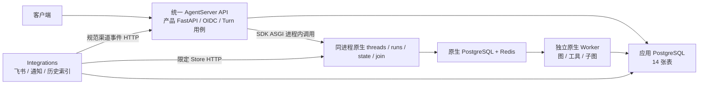

# Stage 10 实现与验证

验证日期：2026-09-11。基线提交：`a6817295c42d2489c65a3cedfe96ac23980d0cf3`。本次实现直接替换未发布的包、接口与初始 schema，不包含兼容层、旧表迁移或切换流程。功能与持久恢复已验证；单 API 的 32／128 突发并发尚未达到设计建议延迟，不能据此宣布生产容量验收通过。

## 已实现的结构



核心执行链没有 BFF → AgentServer 的进程间 HTTP。API 的 `get_client(url=None, api_key=None)` 使用 SDK 自带 ASGI transport，仍由原生 runs/queue/checkpointer 负责运行。API 不直接调用图，不自行消费 Redis，也不重新实现原生执行队列。

- `financeclaw/api`：协议、认证、受理、人工决定、取消与授权、可靠命令推进、精确原生观察、快照 SSE。
- `financeclaw/agent_server`：图、模型、工具、子图、上下文、记忆执行。唯一发布图工厂为 `graphs/product.py:finance_agent`。
- `financeclaw/integrations`：渠道连接、可靠通知、历史索引及记忆删除；通过 `python -m financeclaw.integrations` 独立启停。
- `financeclaw/shared`：关系事实、有限授权、预算、Journal、审计、制品及 outbox；通用渠道和记忆契约也在此层。
- `financeclaw/kernel`：共享类型与身份。三个角色包不互相导入，依赖架构测试检查这一点。

具体职责拆为 `admission / controls / interactions / commands / backend / results / lifecycle / progress`，避免把事务、SDK、协议和后台生命周期集中进一个服务文件。[包结构](../../docs/architecture/package-layout.md) 与当前架构文档已同步。

## 数据与一致性

应用表从 19 张收敛到 14 张，运行控制从 8 张收敛到 3 张：`conversation_turns`、`turn_commands`、`interactions`。删除旧执行明细、根运行、grant 副表、inbox、进度历史表及业务 run ID。保留会话、永久消息、Manifest、制品、审计、通知和 outbox，因为它们分别承担持久业务责任。

一个 `turn_id` 对应一轮任务；每次 start/resume 有独立且不可变的 `command_id`；`native_run_id` 只绑定原生返回的真实回执。数据库部分唯一索引、复合外键和 deferred 约束同时保护归属、当前命令、用户消息与每会话最多一个活动 Turn。

受理事务一次写入用户消息、Turn、有限 grant、命令和交付意图。最终完成事务一次写入最终 Journal、状态、审计、通知和历史索引意图。原生 success 不等于业务完成：只有当前命令的完整 checkpoint、当前输入锚点、无待办工具／interrupt 的最终文本才可收尾。

sending 权利不可重新领取。超时或进程失败后的 uncertain 只穷尽查询原回执，不自动重发。观察 lease 使用 owner/epoch，旧观察不能覆盖新 resume。取消未确认原生停止前保持 cancelling；未知提交不能释放会话。

模型、工具、命令预算在同一 Turn 中原子累计，跨 retry/resume/子图不重置。授权有限且不能超出原始上界。拒绝审批后只允许当前恢复命令绑定的原中断包装工具重入并返回拒绝结果，校验 tool call、invocation 与参数身份；新写操作仍被禁止。

SSE 为 `turn.snapshot` + heartbeat。每 API 复用一个 LISTEN 连接、一个批量刷新器；单连接队列只保留最新值。快照查询只加载展示字段，不加载大型发布快照；订阅断线不影响执行，重连不承诺历史回放。

## 部署交付

根目录 `Dockerfile`、`compose.yml`、`langgraph.json` 为唯一部署基线。API、Worker、Integrations 同镜像；原生 API 版本 0.14.0、SDK 0.4.4、LangGraph 1.2.11。验证镜像为：

```text
sha256:01111509562e6d0cd274dbfc58abdf69be251e5b72ce9ebcc736c9f28b847bc3
```

基础镜像固定官方 digest；构建时校验版本并缓存 `cl100k_base`。API 使用 `/storage/entrypoint.sh`、`N_JOBS_PER_WORKER=0`；Worker 使用 `/storage/queue_entrypoint.sh` 和正数任务槽。Worker 脚本同时启动必需的 Core API gRPC，单独执行 Python queue 模块不足以启动此镜像。

新应用库执行重写后的 `0001_initial`；原生库由 native runtime 管理。正式 Compose 使用新项目与新卷、独立应用／原生数据库和共享制品卷。已验证示例配置解析；未在现有用户数据库上执行部署、清库或迁移。

API 健康检查覆盖原生可用、应用 DB、制品、后台任务和超过 300 秒无人处理的到期责任。Worker 使用原生健康接口；Integrations 使用带过期时间的进程心跳。普通用户不能访问原生控制面；集成凭据只允许规范渠道入口和限定 Store namespace。checkpoint 回收使用另一个具备 `maintenance:checkpoints` scope 的产品身份，默认预览。

## 验证结果与证据

| 范围 | 结果与证据 |
|---|---|
| 全套回归 | **420 passed、4 skipped、2 warnings**；107.79 秒。跳过项需要真实外部条件；两条警告来自飞书依赖的弃用 API |
| 静态检查 | Ruff check 和 format check 通过，300 个 Python 文件；密钥扫描通过，SBOM 已生成 |
| 依赖审计 | 锁定生产依赖加 ziwei extra 未发现已知漏洞；[dependency-audit.json](../evidence/stage10/dependency-audit.json)。不等同于基础镜像系统包扫描 |
| 原生框架契约 A1/A2/A8 | [native-contract.json](../evidence/stage10/native-contract.json)：持久 PostgreSQL runtime，API 不执行、独立 Worker 执行、SDK loopback、原生 success 携带 interrupt、重启后精确 resume |
| 空库与并发 A3/A4/A6/A15 | [postgres-contract.json](../evidence/stage10/postgres-contract.json)：14 表；32 次同键受理只有一个 Turn；32 个 lease 竞争者只有一个 owner；64 次预算竞争只成功 5 次；deferred FK 生效。独立空库 Alembic upgrade/check 无 schema 差异 |
| 产品恢复 A8/A10/A11/A12 | [product-recovery.json](../evidence/stage10/product-recovery.json)：根提问、嵌套 Workflow 拒绝、同键答案重放；等待和恢复提交后分别重启 API/Worker；最终每轮仅两条 Journal |
| 原生权限 A14 | 同一产品恢复报告记录 threads/runs/assistants/crons/MCP/A2A 等外部路径拒绝，伪造转发头不能放行；服务凭据限定 Store CRUD 可用，创建 thread 和非限定 namespace 被拒绝 |
| 失败窗口 A5/A7/A13 | `tests/stage10/test_turns.py` / `test_observation.py`：发送回执丢失不重发、分页查找、过期 lease、晚到观察、收尾事务失败重试、取消与未知提交、精确完成证据 |
| 观察 A9/A18 | `test_events.py`：共享订阅、断线读最新快照、16 个 Turn 批量快照仅 2 条 SQL、claim 完成前停机、数据库故障重试；真实单 join 槽测试的 32 个任务全部由 join／30 秒兜底收尾 |
| 多 API 与 Integrations A6/A17/A18 | [replicas-integrations.json](../evidence/stage10/replicas-integrations.json)：两 API 上 32 次同键竞争，只生成一个 Turn、一个命令和一个原生回执；跨副本 SSE 收到完成快照；独立 Integrations 将两条消息真实索引到原生 Store |
| Stage 9 / 渠道 A10/A16/A17 | 原有上下文、记忆、历史回读、归档、Manifest、删除、飞书自然语言续答、卡片顺序与可靠通知行为继续覆盖于全量测试；没有真实飞书发送 |

嵌套 Workflow 探针仅注入“带当前生成时间的合成行情”，解决演示报价固定日期过期的问题。图、审批、发布 hash 校验、预算与持久 checkpoint 都是真实产品路径；它不是实时金融行情验证。最初探针暴露的拒绝重入错误已修复，并加入命令／调用／invocation 限定的回归测试。

机器化环境与检查汇总见 [validation.json](../evidence/stage10/validation.json)。原始测试证据按类型区分；fake SDK 测试不充当持久 runtime 的证据。

## 性能与容量边界

环境为共享桌面 Docker VM：12 个逻辑 CPU、约 7.66 GiB 内存，无单容器 CPU／内存配额；API 观察到的 cgroup 内存峰值约 371 MiB。测量使用一个 API、4 个 native Worker 任务槽、离线模型和 `calculate(2+3)`，真实 PostgreSQL/Redis。以下为一次批次的 nearest-rank P95，单并发只有一个样本，不能作为稳定统计估计。

| 并发 Turn / 每 Turn SSE | 受理 ms | 受理→回执 ms | 原生终态→Journal ms | Journal→SSE ms |
|---|---:|---:|---:|---:|
| 1 / 1 | 39.00 | 199.52 | 95.55 | 43.62 |
| 32 / 1 | 1073.91 | 4185.54 | 3111.39 | 207.93 |
| 128 / 1 | 7824.31 | 18023.92 | 16936.78 | 371.51 |
| 1 / 32 | 30.23 | 903.31 | 225.70 | 80.18 |
| 32 / 1，join 槽限制为 1 | 1372.75 | 4429.06 | 30079.06 | 228.08 |

[performance.json](../evidence/stage10/performance.json) 保留所有样本和优化前后数据。最终状态均正确；join 槽满时约 30 秒收敛与兜底间隔吻合。传输改为 ASGI 后核心 outbound HTTP 次数为 0，但 SQL、原生排队、checkpoint 与模型执行的耗时仍然存在。

实测定位到快照路径无必要地读取完整冻结发布数据，并已收窄列读取；该项修复没有让高并发突发整体达标。单 API 下受理、回执绑定与收尾仍共享进程和应用数据库容量，32／128 突发出现排队。当前数据不足以将开销进一步精确归因到 CPU、连接池或磁盘，因此不宣称网络层合并已经解决全部延迟问题。

容量验收仍需在目标部署资源上确定 API 副本数、数据库容量及业务并发上限，重新测量 500ms／1s／1s 预算。不要直接将 `turn_join_slots` 或 `WORKER_JOBS` 调大并认为容量自动提高。当前报告验证结构和恢复正确性，不承诺 128 并发延迟 SLO。

SQL 计数仅在应用快照批量查询边界实测；没有伪造整个原生 runtime 的 SQL 次数。原生终态测量读取隔离探针库 `public.run.updated_at`，应用代码不依赖该私有表。内存数字是本次 cgroup 观察值，不是长期泄漏测试或生产规格建议。

## 复现与运行

按 [探针说明](../../experiments/stage10/README.md) 初始化全新隔离数据库，再运行各验证阶段。常规开发运行：

```bash
uv sync --frozen --extra dev --extra ziwei
.venv/bin/pytest -q
.venv/bin/ruff check financeclaw tests scripts deploy experiments/stage10
.venv/bin/ruff format --check financeclaw tests scripts deploy experiments/stage10
.venv/bin/python scripts/check_secret_leaks.py
```

业务接口和故障处理见 [运行手册](../../docs/operations/turn-control.md)，部署配置见 [本地完整链路](../../docs/operations/local-full-stack.md)。
