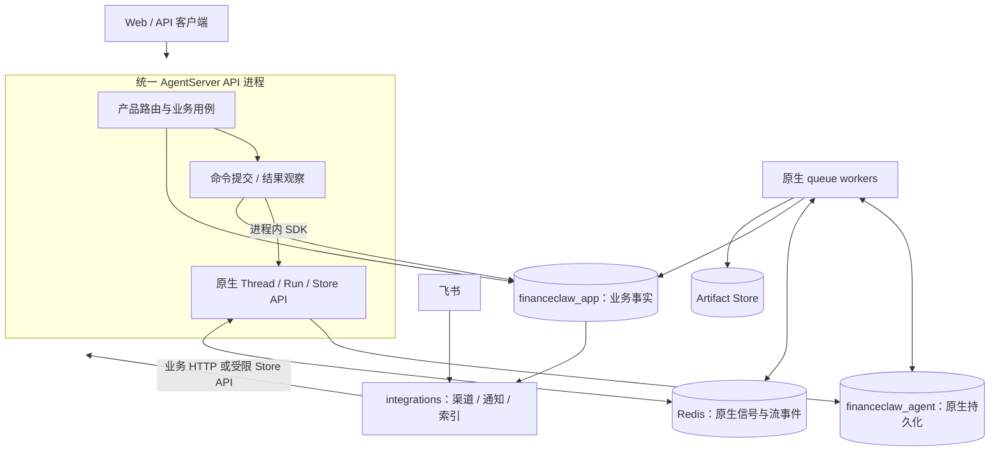

# Stage 10：统一 API 与运行模型收敛实施方案

状态：实施基线 v1.1，2026-09-11。代码按本设计落地；实测范围、性能数据与局限见 [实现与验证](stage-10-实现与验证.md)。

项目尚未上线：直接替换未发布的接口、包结构和初始 schema；不设计兼容层、双写切换、历史数据迁移、灰度或旧版本回退链路。实施时使用新空开发库，不能由启动程序自动删除已有本机数据库。

依据：当前代码、[Stage 8 Hotfix](stage-8-hotfix-实施方案.md)、[Stage 9](stage-9-上下文与记忆优化实施方案.md)及文末官方资料。Stage 10 替代早期文档中的独立 BFF 部署、业务 run 身份与运行控制表设计；Stage 9 的上下文、记忆、归档和预算语义继续成立。

## 1. 最终决议

**业务 API 作为 AgentServer 的自定义 FastAPI 应用运行；执行由独立的原生 queue workers 承担。一个 Turn 就是一个业务任务，只保留 Turn、命令、交互三种运行事实。**

| 编号 | 决议 |
|---|---|
| S10-D1 | 删除独立 BFF HTTP 服务，使用 `langgraph.json → http.app` 装配业务路由 |
| S10-D2 | API 内使用 `get_client(url=None, api_key=None)` 调用原生能力；不访问本机 HTTP URL，不直接调用图的 `ainvoke`，不直接写原生表 |
| S10-D3 | API 与 queue worker 使用同一应用镜像、同一发布清单，按进程角色启停；API 不领取图执行任务 |
| S10-D4 | `turn_id` 是唯一业务任务身份；删除应用自定义 `run_id`、`root_run_id`、`owner_run_id` 的重复根身份 |
| S10-D5 | 原有 8 张运行相关表收敛为 `conversation_turns`、`turn_commands`、`interactions` 三张表 |
| S10-D6 | 原生 Run/Checkpoint 是执行事实；Turn 是唯一产品状态及业务治理记录；用户可见原文仍存 Journal |
| S10-D7 | 保留最小 start/resume 提交账本，处理业务提交与原生入队之间的崩溃窗口；不声称进程内调用具备跨库原子性 |
| S10-D8 | 删除完成 Webhook 与 `run_inbox`；使用独立于客户端的原生 `/join` 观察和低频扫描恢复业务结果 |
| S10-D9 | 删除 `run_progress_events`；产品 SSE 提供最新快照和状态变更通知，重连读取最新快照，不保存逐条进度历史 |
| S10-D10 | 产品执行入口统一为 Conversation/Turn/Interaction；移除 `/v1/runs/*` 和非会话直连执行入口，不留别名 |
| S10-D11 | 飞书接入、可靠通知、历史索引与删除消费放入 integrations 进程，避免 API 扩容增加渠道连接或慢任务 |
| S10-D12 | 不新增通用 backend 插件层、另一套图调度器、事件总线、业务 checkpoint 或 Store 后端 |

收益的验收对象是：减少进程间调用、删除重复状态写入与表、缩短完成到用户可见的传播时间。不能用表数量推导延迟收益，也不能宣称模型推理时间因此下降。

## 2. 当前基线与已核实的框架能力

当前 `BFFRunService.start_turn()` 先提交消息、Turn、快照、授权和命令，再唤醒 `BFFRunLifecycle`；后台通过 HTTP SDK 创建 thread/run、查询并核验结果。`root_runs` 保存后台推进与产品投影，`run_executions` 保存执行治理，`conversation_turns` 又保存部分运行状态。

代码依据：

- [BFF 受理](../../financeclaw/bff/application/runs/service.py)、[后台循环](../../financeclaw/bff/application/runs/lifecycle.py)、[原生适配](../../financeclaw/bff/application/runs/backend.py)。
- [共享客户端](../../financeclaw/shared/backends/langgraph.py)、[运行表](../../financeclaw/shared/execution_ledger/run_tables.py)、[执行账本](../../financeclaw/shared/execution_ledger/tables.py)、[会话表](../../financeclaw/shared/conversation/tables.py)。

以上相对路径在实施后随包结构同步更新；基线证据应在 S10-0 报告记录 Git commit，不能依赖永远保留旧实现。

核查版本为 LangChain `1.3.18`、LangGraph `1.2.11`、SDK `0.4.4`、开发 AgentServer `0.13.3`。以下结论已有文档或已安装源码依据：

| 能力 | 已核实内容 | 实施边界 |
|---|---|---|
| 自定义应用 | `http.app` 支持 FastAPI/Starlette，自定义路由优先于默认路由 [R1] | 不覆盖原生 `/threads`、`/runs`、`/ok` 等路径 |
| 进程内 SDK | `url=None` 使用 ASGI transport，支持在初始化后完成绑定 [R2] | SDK 和 ASGI 处理仍存在；去掉的是 socket 网络跳转 |
| 内部身份 | 本地 SDK `_async/client.py` 使用 `/noauth` root path；原生认证中间件识别该内部来源 | 业务服务必须在调用 SDK 前完成权限校验；不能把此能力暴露为用户指定 URL/header |
| lifespan | 原生 server 合并自定义 lifespan；本地 `queue_entrypoint.py` 也合并 user lifespan | 仅将代码移动到 lifespan 并不能避免 worker 启动 API 任务 |
| 分离部署 | 官方支持 split API/queue，Helm 使用 `queue.enabled: true` [R3] | Compose 的实际 worker 入口及 API 不领取任务的配置须对所选生产镜像验证 |
| 合并建 thread/run | `runs.create(..., if_not_exists="create")` 支持缺失时建 thread [R4] | 仅 start 使用；resume 必须 `reject`，不能丢失 checkpoint 后建空 thread |
| 提交幂等 | 当前 SDK `runs.create` 无公开的调用方 `run_id` 参数；metadata 不构成唯一约束 | 不假设任意 `Idempotency-Key` header 有服务端去重能力；`if_not_exists` 只处理 thread |

本地开发 wheel 的检查不等于生产队列恢复验证。S10-0 必须在实际 Postgres/Redis runtime 上验证分离部署；若需要调整版本，锁定经过探针的兼容版本，不修改原生私有代码。

## 3. 服务、数据库与职责



默认部署采用现有项目易于复现的 Compose：`api`、`worker`、`integrations` 三个应用角色，Postgres、Redis 和对象存储为基础设施。首次交付不增加 Kubernetes；日后使用官方 Helm 部署不改变业务契约。[R3]

| 角色 | 职责 | 不拥有的职责 |
|---|---|---|
| `api` | 产品路由、认证、受理、提交补偿、原生结果观察、交互登记、最终 Journal、SSE | 模型推理、叶子工具执行、图重试与 checkpoint 调度 |
| `worker` | 原生 queue、根 ReAct、内部子图、权限/预算检查、checkpoint、Store、工具制品 | 产品状态收尾、通知发送、渠道连接 |
| `integrations` | 飞书 WebSocket、通知发送、定向 outbox 消费、历史索引和删除维护 | 直接修改 Turn 状态、绕过受理创建原生 run |

一个 Postgres 实例继续托管两个独立数据库：业务表由 Alembic 管理，原生表由 AgentServer 管理。**不跨数据库建外键，不在业务迁移中创建或修改原生表。** 两个库可以独立设置保留期；原生运行/检查点清理不得抢先删除未完成 Turn 的恢复证据。

这里的 queue worker 是部署进程；领域 Worker 是根图中的 subgraph。领域 Worker 继续继承同一 `turn_id` 与预算，不创建独立业务任务或原生运行。

## 4. 唯一身份与包结构

### 4.1 身份

| 身份 | 含义 | 关联 |
|---|---|---|
| `conversation_id` | 产品会话 | 多个 Turn；可因失败/取消后重建原生 thread |
| `turn_id` | 一次用户输入及其所有澄清/审批/恢复 | 唯一业务任务 ID，根与子图共同引用 |
| `command_id` | 一次固定的 start 或 resume 提交意图 | 一个 Turn 多个命令；同一次人工决定只生成一个 resume 命令 |
| `thread_id` | LangGraph 工作线程 | Turn 记录本次冻结的 thread，不从会话当前值反推历史 |
| `native_run_id` | LangGraph 接受命令后返回的执行尝试 ID | 只存对应命令，不能拿 `command_id` 填入这个字段 |
| `interaction_id` | 一次可回答的业务交互实例 | 绑定命令、原生 run、完整 checkpoint 引用与 interrupt |

删除 kernel `ExecutionContext` 中自定义 `run_id/root_run_id`，生产上下文必须有 `conversation_id/turn_id`。新增 `command_id` 用于提交来源校验，resume 更新命令身份但不更换 Turn、权限上界、请求时钟与预算。独立工具单测使用显式测试夹具，不靠缺失 root ID 跳过生产治理。

执行校验分开比较不可变 Turn 事实与当前命令事实：不能把 start 的 command_id 冻结进整轮上下文后要求每次 resume 与之相同。当前命令只允许持久化记录授予的 scopes，并再次受有效 Turn grant 与原始上界约束。

审计、制品、Manifest、通知、历史索引和删除任务同步改为引用 `turn_id`。LangGraph/LangSmith 自身的 `run_id` 保持原生意义；业务 metadata 使用独立的 `turn_id`、`command_id` 和 `release_hash`，避免覆盖框架字段。

### 4.2 目标目录

```text
financeclaw/
  api/
    bootstrap.py            原生 http.app、角色装配与 lifespan
    http/                   产品路由、OIDC、SSE、渠道内部入口
    application/
      conversation_service.py
      maintenance.py        归档检查与原生 checkpoint 清理
      turns/
        admission.py        原子受理
        controls.py         取消、有限重授权和撤销
        interactions.py     人工决定与 resume 命令
        commands.py         唯一发送权与未知回执核对
        backend.py          原生 SDK 进程内适配
        results.py          精确证据与业务收尾事务
        lifecycle.py        有界推进、join 和恢复扫描
        progress.py         LISTEN、批量快照和 SSE
    native_auth.py          原生外部权限边界
  agent_server/             图、模型、工具、子图、上下文与记忆
    graphs/product.py       唯一公开图工厂
  integrations/
    __main__.py             三类集成任务的独立启停
    feishu/                 渠道 SDK 和规范事件 HTTP 接入
    notifications/          通知呈现和可靠发送
    history.py              Store HTTP 定向 outbox 消费
    history_indexer.py       历史索引用例
    maintenance.py          显式运维 CLI
  shared/
    conversation/           会话、消息、Manifest 与归档仓储
    turns/                  Turn、命令、交互、预算和有限授权
    channels/ memory/       渠道及跨角色记忆契约
    artifacts/ audit/ notifications/ outbox/ infrastructure/ releases/
  kernel/                   类型与跨模块身份契约
```

依赖保持 `api/agent_server/integrations → shared/kernel`，三个服务包不互相导入。API 的具体原生适配不引入多 backend 抽象；共享层不导入图或 FastAPI。历史索引的通用用例由共享契约调用，integrations 不导入 AgentFactory。

资源按进程和 event loop 管理：模块导入只声明应用与图工厂，不连接飞书、不调用模型或 MCP、不启动后台任务。同一进程复用显式注入的业务资源；不得把一个 async client/连接池跨 event loop 使用。原生 runtime 管理的连接不由业务 lifespan 关闭。

## 5. 目标数据模型

### 5.1 表的收敛

| 原表 | Stage 10 处理 |
|---|---|
| `conversation_turns` | 扩展为唯一业务任务表 |
| `run_executions` | 执行快照、预算与副作用控制并入 Turn，删除原表 |
| `root_runs` | 产品状态、推进到期时间及必要租约并入 Turn，删除原表 |
| `run_authorizations` | 当前有限授权并入 Turn，历史授权变更进入 audit，删除原表 |
| `run_operations` | 替换为 `turn_commands`，只保存 start/resume 意图及回执 |
| `pending_interactions` | 替换为 `interactions`，删除重复根身份及重复问题投影 |
| `run_inbox` | 删除；命令表自身承载待提交责任，完成观察不再接收 Webhook |
| `run_progress_events` | 删除；用 Turn revision 与最新快照服务 SSE |

按当前 ORM 声明，业务表由 **19 张降为 14 张**，不含 Alembic 与原生表。保留的另外 11 张是 `conversations`、`channel_conversation_bindings`、`conversation_messages`、`model_context_manifests`、`artifacts`、`audit_records`、`outbox_events` 和 4 张 `notification_*` 表。

通知事件、分片投递、目标回执和发送器存活目前有不同的消费及运维用途，本阶段保留；它们不能被 SSE 快照替代。`outbox_events` 继续承载索引、删除及审计外发，不重复承载 native start/resume。

### 5.2 `conversation_turns`

字段采用普通列保存需要约束/索引的数据，JSONB 只存有 schema 的复合快照。

| 字段组 | 必需字段与规则 |
|---|---|
| 主体 | `turn_id` PK、`conversation_id` FK、`tenant_id`、`subject_id`；归属必须与 conversation 一致 |
| 受理 | `idempotency_key`、`request_hash`、`user_message_id`、`created_at`；消息原文只在 Journal 保存 |
| 发布 | `thread_id`、`release_snapshot`、`release_hash`；冻结根及子图版本、工具清单、模型策略、权限上界、数据分级、预算上限与 request_clock |
| 当前状态 | `status`、`status_reason`、`revision`、`current_command_id`、`finished_at`；不再另存同义 `projection.status`、`active` 或 `completed` 布尔值 |
| 权限 | `grant_scopes`、`grant_source`、`grant_source_hash`、`grant_issued_at`、`grant_expires_at`、`grant_revision`、`grant_revoked`；授权不能修改 release snapshot |
| 治理 | `model_calls`、`tool_calls`、`command_calls`、`side_effects_denied`；模型/工具每次真实尝试原子计数，命令取得 sending 权时计数一次，未知提交不返还；不能被 ORM 整行旧快照覆盖 |
| 取消 | `cancel_requested_at`；终止确认由 `status=cancelled` 表达，不另存 confirmed 布尔值 |
| 后台责任 | `next_action_at`、`lease_owner`、`lease_epoch`、`lease_until`、`last_error_code`、`updated_at`；只用于提交/投影恢复，不用于图执行调度 |

必需约束：

1. `UNIQUE(tenant_id, subject_id, idempotency_key)`；hash 包含 conversation、消息及受理语义，同键不同请求返回 409。
2. 对 `status NOT IN ('completed','failed','cancelled')` 建 conversation 部分唯一索引，一个会话最多一个未结束 Turn。waiting/blocked/cancelling 仍占用会话。
3. `current_command_id` 必须属于本 Turn；用 `(turn_id, command_id)` 组合外键，或等价数据库约束实现，不依赖应用代码猜测。
4. 身份、发布快照、user message 与请求 hash 创建后不可替换；租约更新不递增产品 revision，产品可见状态/授权/交互变化才递增。
5. 无常驻大 messages/result JSON；安全响应由 Turn、当前交互和 Journal 投影。
6. 以非终态的 `next_action_at` 建扫描索引；人工等待按过期时间安排到期，不每秒查询原生 run。

Turn 与 user message 的相互引用使用可延迟外键，在事务提交时校验。current command 在同一受理事务内先创建命令再绑定；事务外不能出现 accepted/resuming 却没有对应命令的记录。消息所属 Turn/会话、命令所属 Turn 也需由组合约束保证。

### 5.3 `turn_commands`

必需字段：`command_id` PK、`turn_id` FK、`sequence`、`kind=start|resume`、`request_hash`、`request_payload`、`grant_revision`、`authorized_scopes`、`state`、`native_run_id`、`receipt_bound_at`、`observation_checkpoint`、`observation_hash`、`created_at/updated_at`。

- `UNIQUE(turn_id, sequence)`；一个 Turn 恰有一个 start；每个 interaction 最多一个 resume 命令。
- `native_run_id` 非空时唯一；thread 从所属 Turn 读取。本阶段只支持一个原生部署，不存 `backend_instance_id/execution_hash/reference` 的多 backend 索引。
- start payload 仅引用已持久化的 user message 与固定输入元数据，提交时从 Journal 构造；resume payload 引用 interaction 的不可变决定。校验规范化实际请求 hash，避免复制长正文。
- `request_payload` 是有版本的封闭结构，不接受外部任意 config、checkpoint、goto 或 state update；执行原生参数由服务构造。
- `observation_checkpoint` 保存完成/中断证据的完整原生 checkpoint 引用；`observation_hash` 关联证据，不复制完整 state 或最终回答正文。
- 不新增“尝试表”：一个命令只允许一次尚无服务端幂等保证的发送；人工恢复才创建下一个命令。

状态：`prepared → sending → submitted → observed`；`sending → uncertain`；`uncertain → submitted` 仅可由确切回执恢复。发送前取消可将 `prepared → cancelled`；已证明未入队的永久参数拒绝可记 `rejected`，不自动改变请求重新提交。发送前授权暂时失效则保留 prepared 并阻塞 Turn，允许有限重授权恢复原命令。

**`sending` 不是可超时重领的执行租约。** 原进程死亡后，新进程只能查找回执。Turn 租约可以过期接管，但不会将已发送/可能已发送的命令改回 prepared。

### 5.4 `interactions`

必需字段：`interaction_id` PK、`turn_id` FK、`origin_command_id`、`native_run_id`、`checkpoint`、`interrupt_id`、`revision`、`kind`、`request`、`request_hash`、`status`、`expires_at`、`decided_at/by`、`response_key/hash`、`response`、`resume_command_id`、时间戳。

- `checkpoint` 保存 thread_id、checkpoint_ns、checkpoint_id 及原生需要的 checkpoint_map；不能仅留一个模糊 point ID。
- `request` 是唯一问题/选项/审批动作快照，避免 question、request 和 Turn.waiting 多处复制。
- 归属通过 Turn 验证；不再保存相同的 root/owner run ID。一个 Turn 同时最多一个 pending 交互，当前产品继续串行人工等待。
- `UNIQUE(origin_command_id, interrupt_id)`，并保证 origin/resume command 都属于本 Turn；同一个 interrupt 重复观察不重复建卡。
- 状态为 `pending/resolved/rejected/expired/cancelled/superseded`。resolved/rejected 只代表决定已落库，原生恢复是否受理由 resume command 表达。

## 6. 业务状态、提交与恢复

### 6.1 Turn 状态

| 状态 | 权威含义 | 后续处理 |
|---|---|---|
| `accepted` | 用户消息和 start 命令已可靠受理 | 发送 start |
| `queued` | 原生回执已绑定，最近确认原生 pending | 独立观察 |
| `running` | 最近确认原生 running | 独立观察；不是每个节点同步 |
| `waiting` | 当前原生中断已核实，业务交互已登记 | 回答、过期处理或取消 |
| `resuming` | 决定和 resume 命令已可靠受理 | 发送/核对该 resume |
| `cancelling` | 取消意图已落库，尚未证明所有可能尝试停止 | 停止 prepared，核对 sending/uncertain，精确取消已知尝试 |
| `blocked` | 未知提交、授权失效、证据冲突或观察故障需要恢复 | 使用独立 reason；不得伪装成人工问题或终态 |
| `completed` | 确切成功证据与本 Turn 最终 Journal 已一起提交 | 终态 |
| `failed` | 已确认不能正常完成，且无未知/活动尝试 | 终态 |
| `cancelled` | 取消先取得业务状态写入权，全部可能尝试已确认不再执行 | 终态，不代表外部副作用回滚 |

`blocked` 的 reason 至少区分 `submission_uncertain`、`authorization_required`、`evidence_conflict`、`observation_unavailable`、`interaction_expired`。具体错误正文只进入脱敏日志，不能进入公开响应。

### 6.2 新 Turn

1. 认证、归属、message-only 校验、幂等查询；先处理同键重放，再检查活动 Turn，避免重复请求被误判为新的并发任务。
2. 单个业务事务锁定会话，写 user Journal、Turn 快照/授权、唯一 prepared start，并将 current_command_id 指向新命令，以及写需要的通知目标/受理事件。失败全部回滚。
3. 事务内调用 `pg_notify` 发送 Turn ID 提示，Postgres 在提交后投递；本进程另用 Event 唤醒。通知不是责任账本，未处理 prepared 命令始终可从 DB 找回。
4. 返回 202，表示业务受理成功，不等待推理，也不要求 native_run_id 已存在。请求取消后责任仍在 DB，禁止仅依赖 FastAPI BackgroundTasks。
5. 后台领取短期 Turn 租约，验证取消/授权/快照及 payload，然后将命令 CAS 为 sending 并提交。业务事务之外调用进程内 `runs.create`。
6. start 使用 `if_not_exists="create"`、`multitask_strategy="reject"`、固定图 ID 和命令 metadata，一次原生调用完成 thread/run 创建。正常后续 Turn 同样允许使用已存在 thread。
7. 将回执绑定原命令，核对 current command 仍指向它，再更新状态并另起有界观察任务。若绑定前租约已失效，原进程不越权提交，由新持有者按固定 metadata 找回回执。

框架原生 `create` 契约及缺失 thread 行为见 [R4]。使用 `if_not_exists="create"` 之前，须验证框架会保存需要的原生身份 metadata；产品归属以业务库为准。

### 6.3 人工回答与审批

1. 验证 Turn 归属、当前 interaction、revision、过期时间、回答 schema 和动作摘要。飞书自然语言回答进入同一个用例，不能重新创建 Turn。
2. 同一事务保存唯一决定、生成固定 resume command、将 current_command_id 指向该命令、设置 `resuming`、递增 revision 并写通知事件。由此阻止旧观察覆盖新恢复责任。相同 response key/hash 重放返回原决定；不同内容或旧卡片返回冲突。
3. 提交前再次核对原命令、原生 run、完整 checkpoint 与 interrupt 仍匹配；使用 `command.resume={interrupt_id: answer}`，`if_not_exists="reject"` 和 `multitask_strategy="reject"`。
4. Worker 从同一 Turn 读取剩余预算与授权。拒绝决定必须允许受控重入处理；处理拒绝后封闭后续写动作与新子图调用，不能在拒绝处理入口之前把复合 Tool 整体拦掉。
5. 后续原生中断产生新的 interaction；旧决定不能被新的问题复用。

### 6.4 未知提交与崩溃窗口

| 故障窗口 | 持久事实 | 恢复动作 |
|---|---|---|
| 业务提交前 | 无已接受请求 | 客户端同键重试 |
| accepted 后、命令仍 prepared | 固定请求及发送责任 | 新 API 实例可领取发送 |
| sending 后、调用前崩溃 | 无法从 surviving facts 证明未发送 | 标记 uncertain；按原 thread 和 command metadata 查找，不自动重发 |
| 原生入队后、回执落库前 | 原生可能已执行 | 找回精确 native run，绑定原命令 |
| 已绑定后 API 崩溃 | worker 独立运行，命令回执持久 | 重连 join 或直接查询终态并收尾 |
| 最终事务提交后通知丢失 | Turn、Journal、通知/outbox 已提交 | SSE 读最新快照，integrations 从持久表补发 |

查找必须分页到穷尽，匹配 thread、command、Turn 和发布 hash，不能取“最新 run”。零结果仍是 uncertain；多结果为 evidence_conflict。metadata 只帮助查找，不提供服务端去重保证。

这个极窄的未知发送窗口仍可能需要运维判断；它是当前公开入队契约的限制，不因合并部署消失。不得宣称全自动恢复或 exactly-once。只有基于固定 runtime 的权威证据能证明从未入队，才可用受审计的内部修复恢复同一命令的发送权；否则保留 blocked，占用会话并禁止新副作用。

### 6.5 取消与重授权

取消先锁 Turn：已终态直接返回；否则落库 `cancel_requested_at` 和 cancelling，阻止后续命令取得发送权。prepared 命令可取消；sending/uncertain 必须完成回执核对，不能因暂时查不到而认定停止。对每个已知可能活动的 native run 使用原生精确 cancel，并确认 pending/running 已结束。

取消与成功竞争以 Turn 事务顺序为准：完成先提交则保留 completed；取消意图先提交则不再发布 completed，待确认停止后提交 cancelled。超时或网络异常保持 cancelling/明确 reason。已执行的外部动作不能回滚或隐瞒。

重授权仅更新 Turn 当前 grant，且始终受最初 snapshot scopes 上界限制；逐次审计、递增 grant_revision。prepared 的实际发送 scopes 必须满足命令冻结 scopes 与当前有效授权；不满足则阻塞该命令，重授权后只能发送原内容，不能改 payload 或换 ID。旧的有限授权到期不妨碍读取已产生的结果；Worker 的持续权限与副作用规则按原有治理语义执行。

## 7. 结果观察、并发与 SSE

### 7.1 观察独立于用户连接

API lifespan 启动两个有界能力：命令推进/恢复扫描，以及当前原生尝试的结果观察。没有第三个业务调度服务；它们不执行图节点、不实现 graph retry。

默认正常路径是 `runs.join(thread_id, native_run_id)`，收到结束提示后读取该原生 run 及 checkpoint 并验证。join、stream 只是唤醒与观察能力，不直接构成业务完成证明；官方推荐用 join/stream 避免持续轮询。[R5]

- `join` 任务使用有界等待和取消，超时不取消原生 run；有已完成回执时可直接查询，不必等待新事件。
- 已知 native pending/running 才占用 join 槽；waiting 交互释放槽，按交互过期时间或用户回答唤醒。
- 命令发送与长 join 使用独立并发额度；长任务不能占满提交通道或饥饿短任务。
- 有独立扫描额度兜底到期 Turn，检查未提交命令、未知回执和未收尾的 native run。join 槽满时仍按到期公平轮转查询，不无限等待空槽。
- 每次数据库事务短暂锁行，不跨 SDK 调用持锁；网络期间只保留有时限的 lease，更新受 owner/epoch 校验。
- `next_action_at` 与新的回答/取消/回执在各自事务中一起推进；旧观察任务不得覆盖较新命令的到期责任。更新前核对 current command 和状态，必要时使用 CAS。
- 租约只解决“谁核对和写业务投影”，不会重新领取原生执行任务。过期持有者不能写最终结果；重复读取允许，最终提交必须幂等。

建议初始参数为 command 并发 8、join 并发 128、扫描并发 8、join 单次观察窗口 20s、lease 60s/每 15s 续租、兜底扫描间隔 30s。它们是压测起点，不是已经验证的吞吐承诺；API 每副本观测内存与连接预算必须有上限。

### 7.2 完成与中断证明

沿用现有 `NativeRunReader` 的严格证据规则并统一身份：

1. 原生 run 属于冻结 thread，metadata 对应当前 command/Turn/release；不能用其他 resume 或上一 Turn 的结果。
2. 获取并保存确切最终/中断 checkpoint 引用；检查其来源与命令 parent anchor。若 SDK 只能先取 latest，必须通过归属证据验证后以该 checkpoint 固定读取；无法验证则 blocked。
3. completed 要求原生 success、没有 pending next/interrupt/未完成 tool call，且存在当前 user_message_id 之后本 Turn 的最终 AI 文本。
4. interrupted 要求真实原生 interrupt，登记业务 interaction；不能把授权或网络故障当作问题。
5. 进入结果事务后再次核对 current command、取消状态和 lease。一次事务写 `command=observed`、Turn 状态/revision、唯一最终 assistant Journal、必要审计、通知事件和 Stage 9 定向索引 outbox。

worker 不在 after_agent 钩子里直接提交产品 completed，因为钩子执行成功并不证明原生最终 checkpoint 已可靠提交。API 在恢复观察时能独立完成相同收尾。

### 7.3 SSE 最终契约

产品 SSE 只发 `turn.snapshot` 和心跳。snapshot 包含 turn_id、revision、status、reason、当前交互投影，以及完成时的 Journal 消息引用/内容；不发原生 state、工具正文或权限快照。

- 建连顺序为“先登记数据库通知订阅，再读最新快照，再处理缓冲提示”，避免查询与订阅之间漏更新。
- 数据库 `NOTIFY` 仅携带 Turn ID/revision，用于提示读取；按已认证连接归属过滤，正文不进入通知。
- 每个 API 进程复用一个 LISTEN 连接与本地订阅表，不为每个 SSE 客户端创建独立 DB 连接或原生 join。
- `Last-Event-ID` 使用 `turn_id:revision`。重连始终返回最新 snapshot；不补齐中间 revision，不保证每次进度变更都被客户端看到。
- LISTEN 断线、通知丢失或 event ID 异常时重新读取快照；另以有界周期检查订阅的活跃 Turn，批量查询并合并同一 Turn 的多个订阅，避免每客户端每秒轮询。
- 客户端断开只释放订阅，不取消执行、不终止结果观察、不影响通知和最终 Journal。GET/SSE 不创建命令或负责补全执行。

逐 token 流式输出不在本阶段产品契约内；若以后需要，单独设计安全投影及原生流保留期，不恢复业务进度事件表来保存模型 token。

## 8. 安全、装配和集成角色

### 8.1 一个端口不等于所有原生能力对外开放

外部用户只能访问产品允许的路由。Ingress 限制原生路径，同时 AgentServer 自定义 Auth 对外部普通用户的原生资源访问默认拒绝；必须测试直连 API 端口也不能绕过。

业务应用在调用进程内 SDK 前完成用户归属、有限授权、幂等、固定发布、命令与交互校验。用户不得指定 thread_id、native_run_id、checkpoint、metadata、callback、SDK URL 或内部身份标记。

内部 SDK 的免鉴权行为是原生 transport 机制，不复制其私有代码，不根据用户 header 或 URL `/noauth` 自行放行。代理 root_path 不配置为内部免鉴权路径；伪造路径、header、转发前缀均应验收拒绝。

不设置 `http.disable_runs=true` 或 `disable_threads=true` 来实现外部封禁：这些开关会删除内部 SDK 同样需要的原生路由。未使用的外部 MCP/A2A/assistants/crons/state mutation 入口全部纳入路由和资源权限测试。

### 8.2 `http.app` 与进程角色

目标配置形态如下，路径与配置在实施时创建；当前生产文件尚未修改：

```json
{
  "dependencies": ["."],
  "graphs": {"finance_agent": "./financeclaw/agent_server/graphs/product.py:finance_agent"},
  "http": {"app": "./financeclaw/api/app.py:app"},
  "auth": {"path": "./financeclaw/api/http/native_auth.py:auth"}
}
```

片段只展示变化，Store index、Python 版本等有效配置继续保留。根图公开键统一为 `finance_agent`，具体业务发布由不可变 release snapshot/hash 表达；同一镜像只装配当前发布，不注册旧图别名。Stage 9 embeddings 及 domains 的发布声明仍由统一清单生成。

`FINANCECLAW_PROCESS_ROLE=api|worker|integrations` 必填并校验：

- api：自定义 lifespan 初始化业务资源、进程内客户端、LISTEN、命令/观察任务，然后标记业务 ready。
- worker：同一 custom app 即使被加载，lifespan 也不启动 API 背景任务、LISTEN 或渠道；仅初始化执行所需资源。原生 runtime 负责自己的 queue 启停。
- integrations：使用独立 CLI 入口，不导入 AgentServer server/app；只构造集成连接及相关仓储。
- shutdown：先停止受理/新领取，取消观察并释放租约，等待已开始的短业务事务完成，再关闭本角色资源；API 停止不能请求取消所有 native runs。

不能在 custom lifespan 内等待本服务 HTTP 就绪，避免启动互相等待。SDK 在原生 app 完成初始化后绑定；S10-0 验证其在合并 lifespan 下的首次调用与关闭行为。[R1][R2][R6]

### 8.3 integrations 与 Stage 9

integrations 保留现有飞书 WebSocket 接入方式，默认单实例开启渠道；不因 API 副本数改变连接数量。通知与 outbox 消费各有独立并发额度、重试和健康状态，索引 embedding 不阻塞卡片回应。

飞书标准化事件通过受限的 `/internal/channels/feishu/events` 交给统一 API。服务身份只允许渠道接入，API 根据已配置 app、open_id allowlist 和 binding 建立用户归属与 scopes，不能接受调用方直接指定任意 tenant/scopes。事件 ID 作为幂等来源；API 在业务受理或交互决定落库后确认，重复回调复用原命令。这里的 HTTP 是外部渠道适配器到唯一 API 的请求，不是恢复 BFF → 原生 API 跳转。

历史索引/删除消费者继续复用 `outbox_events`，通过 `FINANCECLAW_INTERNAL_API_URL` 和受限服务身份访问原生 Store；仅开放其所需 namespace 与 get/search/put/delete 权限，不授予 run/thread/state 修改权限。该 HTTP 客户端只在 integrations 存在，不作为 api 的备用传输。Stage 9 的 native state、画像直读、每 Turn 召回、历史按需读取、工具归档规则不改变。

通知目标仍绑定原始 Turn/飞书消息，人工回答不能把最终回答重定向到另一个目标。通知投递的发送键、卡片 sequence 和 uncertain 语义继续保留。

## 9. 产品接口

| 接口 | 行为 |
|---|---|
| `POST /v1/conversations` | 创建产品会话并预分配 thread_id；不发起模型执行 |
| `GET /v1/conversations/{id}/messages` | 分页读取用户可见 Journal |
| `POST /v1/conversations/{id}/turns` | message-only，必须 Idempotency-Key；返回 202 和 turn_id |
| `GET /v1/conversations/{id}/turns/{turn_id}` | 只读产品快照 |
| `GET /v1/conversations/{id}/turns/{turn_id}/events` | 只读快照 SSE |
| `POST /v1/conversations/{id}/turns/{turn_id}/cancel` | 持久取消意图；未确认停止前返回 cancelling |
| `POST /v1/conversations/{id}/turns/{turn_id}/authorization` | 显式有限重授权，不扩展原权限上界 |
| `GET /v1/interactions/{interaction_id}` | 归属验证后的问题/决定投影 |
| `POST /v1/interactions/{interaction_id}/responses` | 带 Idempotency-Key、revision、typed response；返回决定及 Turn 状态 |
| `/internal/channels/feishu/events` | 仅渠道服务身份可用的受理入口 |
| `/v1/health/live`、`/v1/health/ready` | 业务健康路径，不覆盖原生健康路由 |

子路径同时验证 conversation 与 Turn 的关系，不能只凭 turn_id 查询。公开响应不提供可直接控制原生运行的参数。原有制品与记忆业务接口按现有权限继续提供，并统一 Turn 引用；删除所有 `/v1/runs/*`、旧 Webhook、旧 run SSE 事件名和 Python 导入别名。

失败或取消后，下一 Turn 分配干净 thread，并按 Stage 9 从已完成 Journal 初始化历史；业务对话和历史消息继续保留。仅完成成功后才可正常复用上一工作 thread。blocked/uncertain 尚未解决时不允许用新 thread 掩盖旧任务继续运行。

## 10. 部署与配置交付

S10-0 对实际镜像验证后，提交 `compose.yml`、统一镜像构建文件、一个 `langgraph.json` 主配置及按角色的 env examples。开发可使用隔离 `langgraph dev` 快速验证，生产验收必须使用持久 runtime 和独立 API/worker。

| 项目 | 最终要求 |
|---|---|
| 构建 | 用官方 AgentServer 支持的镜像构建流程，固定基础镜像 tag/digest 及经过验证的 runtime 版本；不能把当前纯 uvicorn Dockerfile 当成生产 AgentServer |
| API | 原生 API server 启动，业务端口统一；实验证明其不领取图任务 |
| Worker | 同一镜像启动原生 queue entrypoint，按实际 runtime 验证启动参数；仅开放健康/指标所需内部端口 |
| 队列 | API/worker 指向同一原生 Postgres 与 Redis；worker 数量大于零，队列等待可观测 |
| 持久化 | 业务空库执行重写后的 `0001_initial`；原生库由原生 runtime 初始化；不合并两套迁移 |
| 依赖 | SDK 与原生 API/runtime 版本兼容；保留 tokenizer 离线缓存、Store embedding/pgvector、Ziwei 可选依赖 |
| 身份 | 同一 image digest/release hash；runtime 原生身份与 integrations 服务身份由部署注入 |
| 配置删除 | `BFF_*`、`LG_WEBHOOK_BFF_TOKEN`、BFF callback/allowlist、API 核心所用旧 AgentServer URL/token、driver/backend instance 开关 |
| 配置新增 | PROCESS_ROLE、命令/观察并发与恢复间隔；integrations 专用 INTERNAL_API_URL/服务凭据 |
| 健康 | api 检查原生可用、业务 DB/schema、后台任务和逾期责任；worker 检查原生 queue/heartbeat；integrations 分别报告渠道、通知、索引状态 |

持久镜像已验证：API 使用 `N_JOBS_PER_WORKER=0` 和 `/storage/entrypoint.sh`；Worker 使用正数任务槽和 `/storage/queue_entrypoint.sh`。Worker 脚本同时启动必需的 Core API gRPC 服务，不能只执行 Python queue 模块。Helm 的 `queue.enabled` 不复制到 `langgraph.json` 或误当成 Compose 变量。

应用不实现长期的多发布并存。一个部署只服务当前 release hash；仍保留每 Turn 的冻结 hash 以验证任务来源，避免配置误装配。开发库重建命令必须显式指定新库，文档不包含自动清空已有用户数据的启动钩子。

## 11. 实施任务与完成条件

本节是同一目标的开发依赖顺序，不是两套生产架构的切换阶段。

| 任务 | 交付内容 | 依赖与验收 |
|---|---|---|
| S10-0 原生契约探针 | `experiments/stage10/`：custom app、loopback、split queue、权限、join/中断/终态 checkpoint、缺失 thread、metadata 回执查找；报告版本与镜像 digest | 最先完成；框架不可行项在这里解决，不用假实现绕过 |
| S10-1 共享身份与 schema | Turn/Command/Interaction 类型及 ORM、初始迁移；全链路 turn_id 引用；预算/授权仓储 | S10-0；空库 14 张应用表、约束和并发事务测试 |
| S10-2 统一 API 与受理 | http.app、角色 lifespan、loopback client、产品认证、Turn/Interaction/取消/授权路由、命令服务 | S10-1；无原生执行网络跳转，无旧 `/runs` 入口 |
| S10-3 观察与交付 | join 观察、扫描恢复、精确证据事务、LISTEN/SSE 快照、通知及索引意图 | S10-2；断线/重启后独立收尾，删除 Webhook/Inbox/进度历史表 |
| S10-4 集成与执行适配 | integrations 入口、飞书事件入口、通知 Turn 关联、Store 最小权限；更新 graph/middleware/记忆身份 | S10-1/2/3；真实嵌套 HITL 与 Stage 9 回归 |
| S10-5 交付清理 | 统一 Compose/镜像/env、README/架构/运维文档、测试目录调整，删除旧 BFF 包和多 backend 遗留 | 前述全部；新空库可复现全链路，生产 runtime 故障注入通过 |

删除清单：`financeclaw/bff`、`shared/execution_ledger` 的旧声明/实现、执行路径的 `shared/backends` 多 backend 回执协议、`kernel/backend.py` 的旧执行/通知封装、旧 main uvicorn 入口、旧 BFF/通知独立 compose 组合、旧环境样例及依赖它们的探针。保留的通用 streaming/授权/证据算法迁入对应新模块，不直接整目录删除有用逻辑。

S10-5 更新当前架构文档，使代码与文档只有一个执行基线；历史阶段说明保留为设计记录并标明被 Stage 10 替代的部分。测试按行为重写，不保留测试旧表/旧导入以求形式上的全绿。

## 12. 验收矩阵

| 编号 | 场景 | 必须观察到的结果 |
|---|---|---|
| A1 | API 和 worker 分离启动 | API 无图执行；worker 能执行；worker 不启动 API 背景任务/渠道 |
| A2 | 记录传输调用 | api 核心 threads/runs/state/join 均为进程内 transport；无向 2024/localhost 的 HTTP fallback |
| A3 | 空库初始化 | 14 张应用表，旧运行表不存在；原生表不由 Alembic 管理；所有 Turn 外键一致 |
| A4 | 并发同键、同会话异键 | 同键同文一条 Turn/start；同键异文 409；异键并发最多一个活动 Turn |
| A5 | 每个提交崩溃窗口 | prepared 可推进；sending/uncertain 不自动重发；找到回执后绑定原命令 |
| A6 | 多 API + 过期 lease | 旧 owner 不能写状态；不重复提交；晚到观察不覆盖新 resume |
| A7 | native success 但业务提交失败 | 不提前显示 completed；重试收尾只生成一条最终 Journal/通知/索引意图 |
| A8 | 无客户端、API 重启、worker 重启 | 原生运行独立恢复；API 找回任务并收尾；持久 runtime 上验证 |
| A9 | join 超时、槽满、LISTEN 丢失 | 不取消运行；低频公平扫描收敛；SSE 读最新快照；无无界任务增长 |
| A10 | 嵌套子图 HITL、连续问题、飞书自然语言回复 | 同一 Turn、多条真实 resume command；正确完整 checkpoint；不创建新根任务 |
| A11 | 重复/旧卡片、不同答案、交互过期 | 原决定幂等、冲突明确、不恢复错误 interrupt、不重复提交 |
| A12 | 拒绝后重入、授权到期/撤销 | 拒绝能被执行层消费，后续写动作封闭；旧结果可读，新命令不越权 |
| A13 | 完成与取消竞争、取消遇到未知提交 | 按事务顺序唯一终态；未知尝试未核对时不释放会话 |
| A14 | 用户直连原生路径、伪造内部来源 | thread/run/store/state 等越权拒绝；普通产品路由正常，维护身份只可访问指定 Store namespace |
| A15 | 预算并发与恢复 | 模型、工具真实尝试和命令预算不重置、不超上限，子图共享 Turn 计量 |
| A16 | Stage 9 回归 | 当前 Turn 保护、召回复用、画像、归档回读、Manifest、历史索引、删除及新 thread 恢复均成立 |
| A17 | 飞书投递与索引并发 | 回答目标固定、卡片顺序正确、sending uncertain 保留；慢 embedding 不阻塞渠道 |
| A18 | GET/SSE 和断线 | 纯读、不创建命令；每 Turn 订阅复用；重连只有最新快照，无历史回放承诺 |

单元测试覆盖状态决策及 hash/归属等纯契约；PostgreSQL 集成测试覆盖部分唯一索引、事务、NOTIFY、租约、预算并发，不能用 SQLite 替代。实际 AgentServer 探针验证 API/worker 分离、原生中断与持久恢复；fake SDK 测试不能充当这些证据。

性能报告使用固定的合成模型/工具延迟与同一资源配置，分别记录 `admission_ms`、`accepted_to_native_bound_ms`、`native_terminal_to_journal_ms`、`journal_to_sse_ms`、SQL 次数、网络请求数及观测内存。至少覆盖 1/32/128 个并发 Turn、同一 Turn 多 SSE 连接及 join 槽满情形。

建议验收预算：正常容量内业务受理 P95 ≤ 500ms、accepted 到原生回执绑定 P95 ≤ 1s、原生终态到 Journal P95 ≤ 1s；事件路径失效时在恢复扫描间隔加处理预算内收敛。以上均为目标，最终报告给出硬件、数据规模和实际结果；不达标须定位并调整，不写成“已验证”。

最终交付记录位于 `.redesign/stages/stage-10-实现与验证.md`，机器报告位于 `.redesign/evidence/stage10/`；设计稿本身不生成虚构的通过报告。

## 13. 本阶段保留的必要复杂度

剩余的三个运行实体分别回答“用户让系统做什么”“命令是否被原生运行接受”“用户对哪个问题作出什么决定”。三者不能合成一个 native run 状态。

保留业务提交补偿、结果核验和有限租约，是为了让已受理请求在进程死亡后仍有责任归属；删除的是重复的身份、表、状态投影、Webhook 交接和多 backend 层。图执行、重试与 checkpoint 始终只有 LangGraph 一套实现。

仍有两个明确限制：当前公开原生提交契约无法证明远端 exactly-once；原生运行、业务事务和外部工具副作用不是一个事务。Stage 10 不用重复消息发送或重新启动整个任务来掩盖未知结果。

## 14. 官方资料

- [R1：AgentServer 自定义路由](https://docs.langchain.com/langsmith/custom-routes)：支持加载业务 FastAPI 应用。
- [R2：SDK get_client](https://reference.langchain.com/python/langgraph-sdk/_async/client/get_client)：进程内 ASGI transport 与初始化行为。
- [R3：AgentServer 架构](https://docs.langchain.com/langsmith/agent-server)：原生持久化、API 与 queue worker 职责。
- [R4：创建后台 Run](https://docs.langchain.com/langsmith/agent-server-api/thread-runs/create-background-run)：后台受理、缺失 thread 策略与原生状态。
- [R5：AgentServer 扩容与运行观察](https://docs.langchain.com/langsmith/agent-server-scale)：分离部署、独立并发、join/stream 建议。
- [R6：自定义 lifespan](https://docs.langchain.com/langsmith/custom-lifespan)：自定义应用资源的生命周期。

资料核查日期：2026-09-11。框架支持与目标设计在本文分开表述；镜像启动参数、故障恢复和延迟数据须由 S10-0 及后续验收补齐。
