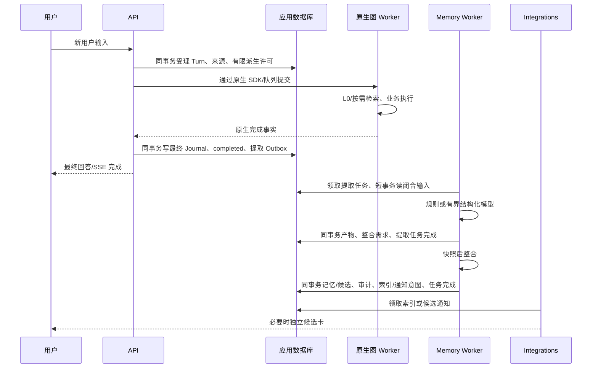
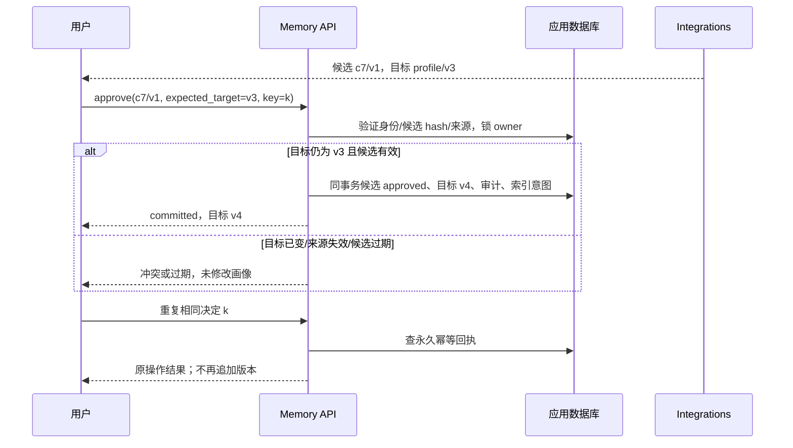
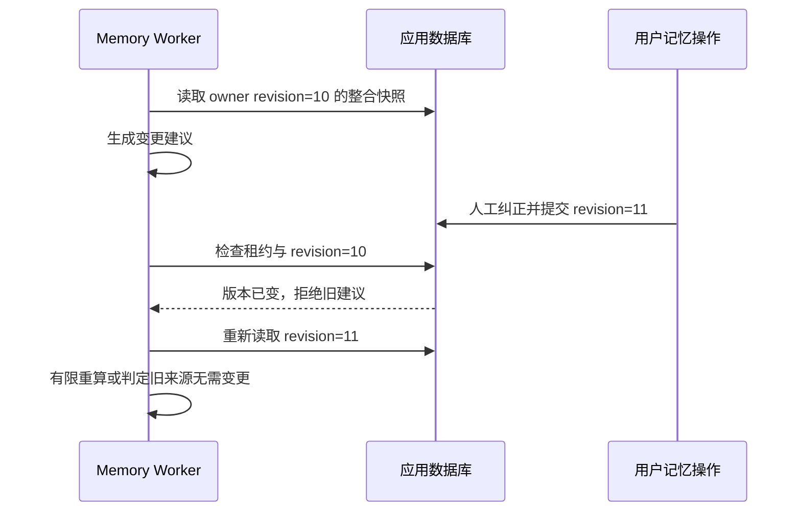
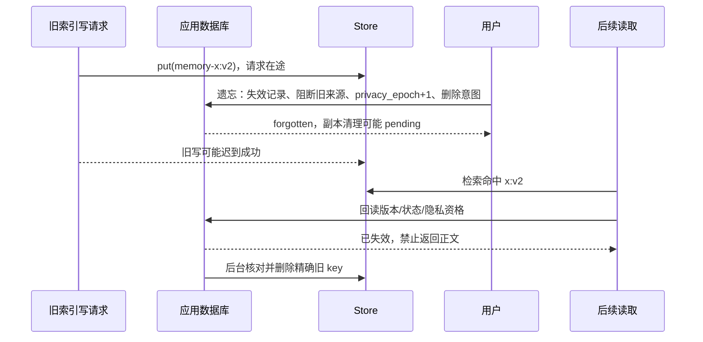

# Stage 11：场景链路与验收矩阵

状态：验收基线 v1.0，2026-09-12；实现已落地。下列场景保留目标与验收方法，实际已运行层级和未达项见[实现与验证](stage-11-实现与验证.md)，不能将目标表逐项当作真实环境验收通过。配套：[实施方案](stage-11-异步记忆与上下文治理实施方案.md)。

术语：API 为统一业务/原生 API 进程；Agent Worker 为原生图执行进程；Memory Worker 为独立记忆消费者；Integrations 为通知/索引消费者。三个不同完成点分别是 Turn completed、memory active/proposed、index ready。

## 1. 关键事务与消息时序

### T1：普通回答与后台提取

最终回答不等待提取、整合、embedding 或候选决定。SSE 结束不表示记忆索引已就绪；没有候选时不另发无意义消息。

### T2：候选确认与旧版本冲突

全过程不调用原生 `runs.create`、`Command(resume=...)` 或业务 Interaction 接口。确认的是候选中展示的值；服务端不得换成模型刚重新生成的内容。

### T3：人工纠正与后台竞争

重算必须理解新的事实和来源，不能只替换 expected revision。读模型期间无数据库长事务或用户行锁。

### T4：遗忘与迟到的索引写入

即时遗忘靠权威库过滤和上下文失效；远端物理清理需要等待在途写被确认或处置，不把单次 delete 成功当作全局完成。

## 2. 常规业务与提取场景

| ID | 入口与前置 | 完整链路 | 用户可见结果与不变量 | 验收 |
|---|---|---|---|---|
| S01 | 无历史的新用户，独立计算问题 | 认证→受理→空 L0→跳过 L1→回答→闭合来源→规则/提取 no_output→Outbox 完成 | 正常回答，无候选、无空记忆，无反复提取 | 统计语义检索和模型调用次数；重启仍记住已处理输入 |
| S02 | 明确“以后用中文回答”，用户有 memory:write | 受理并登记 source→完整原文规则匹配→同事务写语言字段/审计→本轮 L0 读取新值→普通回答→后台按 source 去重 | 中文偏好立即生效；后台不追加重复版本 | user/source/memory/audit 任一写失败全部回滚；重复受理只有一份事实 |
| S03 | “这次用中文”“假设我偏好高风险”“他说以后都用表格” | 来源登记→规则拒绝自动画像→任务上下文正常执行→提取只保留必要任务范围 | 不形成永久语言/风险/格式偏好 | 原文、否定、引用和省略条件组合数据集 |
| S04 | 完成一个有复用价值的研究任务 | completed 事务→提取任务史、决定/来源/日期→整合为 scoped task memory→索引→后续相关 Turn 检索 | 记住历史任务；不把分析对象当长期持仓或永久偏好 | task 与 profile 类型隔离；历史财务数据不能冒充实时数据 |
| S05 | 投资目标、风险陈述等重要画像 | 闭合来源→提取事实建议→整合 proposed→独立卡/API 展示→用户确认→目标 active | 回答先完成；画像在确认前不进入 L0/L1 | 确认前 SQL 查询、Store 索引和 prompt 均无 active 画像 |
| S06 | 用户显式要求 save_memory 保存重要字段 | 原生工具→领域服务创建候选→返回 proposed→Agent 解释待确认→原 Turn 正常结束→用户独立确认 | 只有一次记忆候选确认；不使用原生 memory HITL | 禁止出现 approved=True；没有 memory interrupt 或 resume command |
| S07 | 正在等待澄清，用户在交互表单补充目标 | 验证交互身份/问题 Schema→response 和 source 同事务→正常原生 resume→完成后提取初始消息+回答 | “用户答了什么”连同问题含义纳入证据；不从助手复述推断 | 裸选项值、时区、时间、拒绝/修正、重复交互提交 |
| S08 | Turn 失败或取消 | 原生/业务终态→不生成普通全轮任务总结；已提交明确记忆保持；尚未真正保存则无记忆 | 失败不能被总结成成功；已发生记忆副作用不假装回滚 | 取消前后各处 kill；读取记忆与运行状态分别核对 |
| S09 | 新 Turn 在后台提取完成前到达 | 新 Turn 冻结当前已生效 L0→正常执行→后台稍后提交→新记忆默认用于下一 Turn | 本轮不等待后台，也不在模型循环中悄悄替换画像 | 控制两个事务先后，核对各模型 Manifest 的版本 |
| S10 | 新 Turn 中显式要求查历史 | 冻结 L0→按当前目标/澄清构造查询→Store/SQL 候选→SQL 校验→返回带版本结果 | 显式搜索可见最新有效记录；不自动改写默认画像 | 查询不只用前 512 字；空结果缓存、分页上限、检索降级 |
| S11 | 无 memory:write 或用户关闭自动提取 | 不签发新的 derive permit→业务回答继续；已有人工记忆可按读权限使用 | 没有未经授权后台生成；关闭自动不等于删除历史记忆 | 直接 API、飞书、原生工具和运维入口的权限一致性 |

## 3. 并发、重试与事务场景

| ID | 故障/竞争点 | 恢复链路 | 必须成立的结果 | 验收方法 |
|---|---|---|---|---|
| S12 | 两个会话先后表达同一字段不同值 | 受理按 owner 分配 source_seq→不同提取任务可乱序完成→合并按证据顺序和当前 revision 判断 | 较早来源不得因晚完成覆盖较新值 | 两个真实 PG 连接，交换模型返回次序 |
| S13 | A 保存中文、B 改英文、重试 A | 查 audit 的 A mutation 永久回执→返回 A 原结果与当前版本提示→不重新写入 | 当前仍为 B；revision 不增加 | 永久回归；清理已发布 Outbox 后再重试 |
| S14 | 同 mutation ID 换内容/目标/expected revision | 同事务读取回执 hash→409 | 不能冒充同一次操作，不产生第二个版本 | API、工具重入与后台 mutation 都覆盖 |
| S15 | 最终 Journal 事务提交前进程崩溃 | 整个事务回滚→结果观察恢复→重新同事务收尾 | 要么 Journal/终态/提取意图全无，要么全有 | 在最终结果各 SQL 写入点注入失败 |
| S16 | Journal 已提交但内存唤醒没发送 | Memory Worker 定向扫描已持久 Outbox→正常消费 | 不丢提取，不依赖 API 进程仍存活 | 提交后立即 kill API，检查后台最终状态 |
| S17 | 提取模型返回后、产物事务提交前崩溃 | 租约到期后重领→已有尝试额度保留→允许剩余额度重算→原子保存 | 不产生半份产物或已完成无产物；允许付费重复但不可重置预算 | kill worker；断言 attempts/预留值未归零 |
| S18 | 产物与任务完成已提交，客户端未收到 SQL 回执 | 重领/读取发现结果与完成状态→幂等结束 | 不重复整合输入、不重复扣模型额度 | 模拟提交成功但连接报错 |
| S19 | 旧消费者租约过期后返回模型结果 | 新 epoch 已领取→旧提交在 owner+Outbox 事务校验失败 | 旧消费者不能写产物、记忆、审计或完成状态 | 双 worker + 人工控制续租失败和模型延迟 |
| S20 | 整合期间人工纠正/遗忘 | 快照复验失败→丢弃旧建议→有界重算或 no-op | 人工决定保留，遗忘后不把旧内容再送入重算输入 | 记录模型输入来源 hash，不能只检查最终字段 |
| S21 | 整合将结束时新产物到达 | 生产/完成事务都锁 owner→增加需求或创建后继 event | 无丢唤醒；最多一个 active consolidation event | 在“检查还有无输入”和“清空指针”处设置同步屏障 |
| S22 | 较小 source_seq 的闭合输入比新来源晚完成 | 各 part 齐全后迟到集合获得新的 extraction_revision→后继整合会处理→字段仍按 source_seq 排序 | 既不漏旧任务信息，也不回退新偏好 | 持久快照验证两种序号，禁止用 max(source_seq) 当处理游标 |
| S23 | 同一 closed input 多个批次，最后一批失败/超大 | 每批独立结果，manifest 标明 coverage→不生成伪完整 task memory→允许明确范围候选 | 不遗漏最后纠正后仍自动写画像；任务不无限分片 | 末尾否定、超过批次数、单来源超容量、跨语言大输入 |
| S24 | Provider 限流、超时或预算用尽 | 依规则有限重试→额度耗尽/死信→告警/受控重放 | 原 Turn 保持完成；无无限模型循环，无透明扩容预算 | 注入模型/网络/DB 三类错误，检查不同失败分类 |
| S25 | pipeline/model 版本升级后旧任务待处理 | 读取冻结版本→支持则原版本处理；不支持则明确阻塞/显式重建新事件 | 不静默换提示词或降级模型，重建不复活已撤销来源 | 两个部署版本交替启动同一测试库 |

## 4. 候选、纠正与删除场景

| ID | 入口 | 链路与结果 | 不变量/验收 |
|---|---|---|---|
| S26 | 候选确认时原 Turn 已结束或 grant 自然到期 | 当前用户认证→读取候选内容/版本→当前来源校验→独立 mutation 提交 | 不依赖 running Turn；不创建 native run、Interaction 或 resume |
| S27 | 重复点确认；另一端点拒绝 | 相同决定返回原回执；相反决定/旧候选版本返回409 | 目标只更新一次，候选状态不能被第二个决定翻转 |
| S28 | 候选等待期间目标已被更新 | 确认发现 expected_target_revision 不匹配→冲突→展示新旧内容，需新的候选/决定 | 不把“确认旧提案”当作“覆盖当前值”的授权 |
| S29 | 候选过期、来源隐藏或目标渠道撤销 | 读取/发送/确认时复验→不发送失效卡、不生效画像；API 给出过期/无效结果 | 不仅在生成候选时检查；卡片地址不能由模型选择 |
| S30 | 候选卡与原任务最终卡同时发送 | 不同通知 kind、固定发送键与独立 delivery.card_id→原任务终态卡继续独立完成 | 不覆盖 NotificationTarget 的原任务 card_sequence；没有候选等于没有额外卡 |
| S31 | 明确纠正已有低风险偏好 | 当前 principal+expected revision→新 source_seq→原子新版本、审计、digest→本轮显式刷新 | 不必等待索引；旧默认画像被替换，旧 mutation 回执仍可查询但不能重做 |
| S32 | 遗忘一条记忆，恰有提取/整合/索引在途 | SQL 逻辑失效/阻断来源/epoch+1→用户立即得到 forgotten→在途后台复验失败或查询过滤→异步副本清理 | 旧内容不得从 extraction、摘要、缓存或迟到 key 自动恢复；purge 未确定时不报 verified |
| S33 | 删除后重新提取相同原始对话 | 旧来源/目标 tombstone 阻断→no-op 或 rejected→不再生成相同候选 | 换 mutation ID、提取器版本或文字表达不能绕过旧来源阻断 |
| S34 | 删除后用户用新来源明确要求重新记住 | 新 source_seq 大于删除截止→当前策略校验→低风险生效或重要字段新候选 | 重新记住有新的用户依据，不是后台重新解读旧历史 |
| S35 | 删除某 source 支持的多条记忆，其中有多来源结论 | source 失效与相关记录暂停同事务→清除混合产物→基于仍有效来源重建 | 不能简单删引用却留下无依据正文；有效独立来源可以形成新版本 |
| S36 | 用户在另一个会话遗忘，当前会话正在长任务中 | 下一次模型前 epoch 检查→清空旧记忆视图和受影响摘要→保留必要用户输入/执行回执→继续 | 不重放已执行动作；旧派生工件不能绕过失效检查；在途模型响应不是新用户证据 |
| S37 | 关闭自动记忆/关闭读取/明确撤销 Turn 授权 | 自动开关阻断未提交派生；读开关使下次请求失效；显式撤销影响该 Turn 未消费许可 | 自然 grant 到期与明确撤销语义不同；已生效内容不被悄悄全删 |

## 5. 检索、压缩与恢复场景

| ID | 场景 | 完整链路与终态 | 验收 |
|---|---|---|---|
| S38 | 记忆已生效但 embedding 尚未完成 | SQL L0 立即可见→L1 可用有限目录/关键词兜底→索引随后可用 | 回答不等待 embedding；记录索引延迟，不能说语义索引已经就绪 |
| S39 | Store 返回旧版本、已删项、其他 scope 或候选 | SQL 批量校验→过滤→有界补查/返回空 | 非本人 owner 先在 namespace 边界拒绝，不能先取出他人正文再过滤 |
| S40 | Store 超时或不可用 | 语义检索降级→SQL 画像/有界目录→正常业务回答 | 不全库扫描，不反复同 Turn embedding，降级可观测 |
| S41 | 长会话跨多个 Turn | 统一预算→旧片段归档/摘要→保留当前用户与工作状态→checkpoint→下一模型请求 | 连续多次压缩仍保持纠正、否定、日期和任务目标 |
| S42 | 同一 Turn 有大量已完成工具往返 | 找安全已完成前缀→先归档→摘要→校验调用配对/原用户锚点→原生 state 更新→继续 | 允许当前轮较早执行内容压缩；不创建新的真实用户 Turn |
| S43 | 并行工具只有部分返回或嵌套 HITL 待答 | 保护未完成批次/恢复依赖→等待原生执行/交互完成→再计算安全边界 | 禁止丢掉未配对 call 或恢复所需参数；用真实原生暂停/重启测试 |
| S44 | 工件归档失败或摘要模型失败 | 归档失败则不删原文；摘要失败保留 state；剩余预算允许则继续，否则明确失败 | 不声称压缩成功；同 fingerprint 有限尝试，重启不重复执行业务工具 |
| S45 | 摘要提交前崩溃或提交后进程重启 | 提交前保留原 state；提交后从原生 checkpoint 恢复工作摘要/引用/剩余消息 | 无半套 reducer 更新；最终结果观察仍识别正确用户锚点和完整工具状态 |
| S46 | tools/system/memory 占用导致最终请求接近上限 | 统一预算器先计算必要输入，再收缩可选记忆和归档/摘要，最终 guard 复验 | 不出现只按 messages 判断足够而绕过全请求容量；不截断原始用户输入 |
| S47 | 切换到容量更小的配置内 fallback | 使用冻结降级链共同有效窗口准备输入→实际每次调用仍按模型复验 | 不在 retry wrapper 里偷偷改 checkpoint；记录具体 fallback 与估算器 |
| S48 | 用户必保输入本身超过模型容量 | 返回明确容量错误，保留原文和业务状态证据 | 不无限摘要、不清空用户消息、不伪造完整回答 |
| S49 | 后台用户记忆在压缩期间更新 | 普通新版本不改变本轮默认 L0；显式本轮修改刷新；privacy epoch 改变则压缩结果作废 | 普通更新与隐私失效区分；压缩不能提交基于旧隐私上下文的结果 |
| S50 | 会话归档、工件过期、索引重建 | 先检查未完成业务责任/记忆输入引用→允许回收可清理内容→索引按 SQL active 重建 | 归档不等于遗忘；恢复需要的工件/输入不能提前回收；不读取原生私有表 |
| S51 | 非本人候选、伪造 owner/namespace、飞书转发按钮 | 从真实认证身份/渠道 binding 解析 owner→拒绝不匹配→不读正文、不写状态 | API、工具、worker、回填、索引、通知所有入口均测试租户隔离 |
| S52 | 模型自行调用 forget_memory，用户并未指定删除目标 | 检查明确意图证据→禁止直接遗忘，返回拒绝或待用户决定的 forget 候选→只有用户当前授权决定可执行 | memory:delete 不是模型自主删记忆的许可；后台不能自行 approve |
| S53 | 整合某批死信后，又有新的用户来源 | 失败集合 quarantined、清空 active 指针→新 ready 输入可以独立入队→旧集合只能显式受控重放 | 不永久堵塞用户，不通过新消息刷新旧任务预算，ready revision 与来源序号不混用 |

## 6. 必须实际执行的验证层级

| 层级 | 覆盖 | 不能替代的验证 |
|---|---|---|
| 单元/属性测试 | Schema、scope、源序号、policy、摘要消息分组、幂等 key | 不能证明 PG 锁和多进程恢复 |
| PostgreSQL 事务与并发 | S12–S25、S27–S37、同事务回滚/提交不确定 | 不能用 SQLite 得到的成功代替 |
| 真实 API + native Worker + Redis | S07、S26、S41–S49、原生恢复和 Stage 10 结果观察 | 不能只构造 ModelRequest 或手工拼最终 state |
| Memory Worker + Integrations 故障注入 | kill/restart、租约、模型超时、索引迟到、通知不确定 | HTTP 返回成功不等于完整场景成功 |
| 模型质量集 | 临时/持久/否定/引用/纠正、任务范围、摘要连续性 | 模拟模型只能测结构，不能证明语义质量 |
| 固定资源容量测试 | API 增量延迟、后台积压、模型费用、SQL、索引时延 | 不继承 Stage 10 尚未满足的高并发 SLO |

## 7. 设计复核结论与实施前探针

以下设计层面的冲突已在方案中消除：

1. **后台任务借用已结束 Turn 权限**：改为来源受理时签发用途有限、独立过期、可撤销的派生许可。
2. **重要记忆有两套审批**：统一独立候选；业务工具原生 HITL 保留，记忆决定不 resume。
3. **同用户跨会话写入和历史重放**：owner 串行提交、expected revision、source_seq 与永久 mutation 回执共同约束。
4. **用一个最大时间/序号漏掉迟到结果**：source_seq 和 extraction_revision 分开，整合记录实际消费集合。
5. **新输入与消费者退出之间丢唤醒**：owner 行保护 active event 指针、需求进度及后继事件的事务更新。
6. **删除只删 Store，旧提取还能恢复**：源级自动再利用阻断、派生片段清除、privacy epoch 与读取校验一起生效。
7. **租约失效被误当远端请求取消**：SQL 拒绝旧提交，索引版本 key 隔离，物理清理另跟踪未确认在途写。
8. **压缩只发生在请求副本**：校验后通过原生 reducer 持久化，重启和最终 Journal 观察一起验收。
9. **压缩/索引/模型成本混在业务延迟中**：分别观测，并保持回答、记忆、索引三个完成点。

仍需在实施 S11-0 执行的具体探针：轮内压缩适配器在原生 runtime 中的持久化和恢复；当前模型对结构化摘要和 source span 的遵循；真实 Store 不同 revision key 的乱序写/删；新候选通知与旧最终任务通知并发；四角色依赖和原生 lifespan 不误启动 Memory Worker。它们是实施门禁，当前不能标为已通过。

设计交付时已完成源码层核对：当前原生摘要仅提供前缀摘要+尾部保留，轮内保留原用户而移除中段需要局部适配；基础消息 reducer/用户锚点探针通过。上面的原生 runtime/持久恢复探针仍待实施执行，二者不混淆。另已发现并列入主方案的必要契约变更是审计 turn_id 可空、冻结模型输入容量和共用 token 计数器。

## 8. 证据交付格式

实施时在 `.redesign/evidence/stage11/` 提交不含凭据/用户原文的报告：代码/依赖/模型版本、数据库/原生 runtime 规格、场景 ID 与实际结果、失败注入位置、关键状态和版本、估算及真实模型用量、延迟原始样本与质量评分。

再创建 `stage-11-实现与验证.md` 汇总已通过、失败和未执行项。只有全部必要场景完成且实际限制明确列出，才能把主方案状态改为已实施。本文件现在只交付场景设计。
