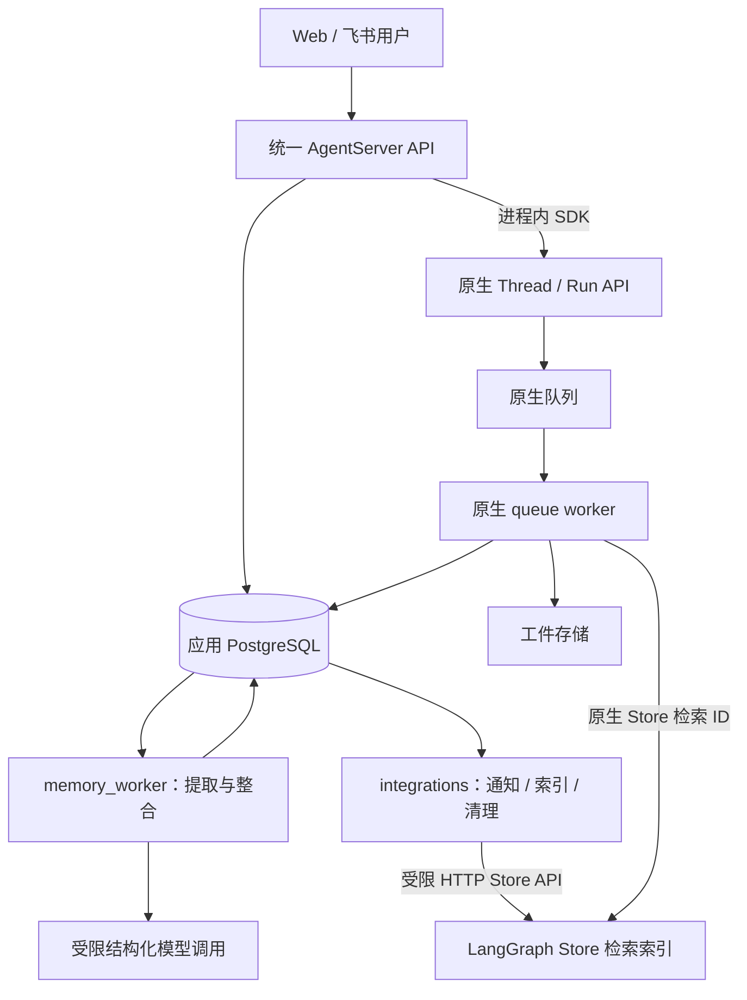

# Stage 11：异步记忆与上下文治理实施方案

状态：实现已落地，2026-09-12；设计基线 v1.0 保留作验收依据。实际验证和未达项以[实现与验证](stage-11-实现与验证.md)为准，不能将代码完成视为真实模型质量或生产性能已验收。

代码基线：FinanceClaw `7dab6d47af6a6e0fcfe59caca04918b3c91cf058`。参考 Codex `aee8a55ab6010f1d53e741edec74dbcffa07bcfe` 的两阶段记忆、版本化任务提交、按需读取与轮内压缩；引用固定到该提交，见第 17 节。

配套文档：[场景链路与验收矩阵](stage-11-场景链路与验收矩阵.md)。实施顺序、门禁和完成定义见第 15、16 节。

项目尚未上线：直接修改未发布的接口、工具契约、包结构与唯一初始迁移，使用显式创建的空开发库验证；不设计兼容层、双写切换、旧 schema 迁移或灰度。不得由应用启动自动删除现有本机数据库。

## 1. 目标与替代范围

让系统在回答之外自动形成有证据的长期记忆和画像；记忆可确认、纠正和遗忘，重复任务和并发会话不能回退已有决定；一个很长的 Turn 也能在受控压缩后继续执行。

| 现有决议 | Stage 11 处理 |
|---|---|
| Stage 10 统一 API、原生 queue worker、Turn/Command/Interaction | 保留；不重建图调度、业务 Run 或 checkpoint 表 |
| Stage 9 原生 state/checkpoint 管理短期上下文 | 保留；工作摘要和当前任务状态继续放 checkpoint |
| Stage 9 Store 是画像与事件唯一事实源 | 替换：应用 PostgreSQL 管理记忆事实、版本和生命周期；Store 是可重建检索索引 |
| 当前 `save_memory` 依赖原生 HITL 批准后直接写 Store | 替换：记忆工具与后台处理共用领域写入口；需要确认的记忆统一产生独立候选 |
| 原生 HITL 管理业务工具与澄清 | 保留；记忆候选决定不创建或恢复原生 interrupt |
| 当前完整 Turn 永不摘要 | 收窄：保护真实用户输入、未完成调用及必要执行证据；允许压缩已完成的执行片段 |
| 每个新 Turn 必做事件语义检索 | 替换：有限画像常驻、相关历史按需检索 |

不做：交易授权推断、自动改变金融权限、模型自行维护代码/技能、将压缩摘要当作用户证据、引入新的向量数据库或通用任务平台。

## 2. 实施前核实的基线与待解决问题

本节描述 Stage 10 基线；链接现在指向 Stage 11 实现，原问题及其回归验证见实现记录。

| 编号 | 当前实现 | 必须解决的问题 |
|---|---|---|
| B1 | [记忆服务](../../financeclaw/agent_server/memory/service.py) 先 get 再 put，审计另开 SQL 事务 | 历史 mutation 重试可覆盖新画像；Store 与审计存在提交间隙 |
| B2 | [证据解析](../../financeclaw/agent_server/memory/service.py) 只接受用户 Journal 消息 | [交互回答](../../financeclaw/api/application/turns/interactions.py) 存在 `interactions.response`，尚未纳入证据 |
| B3 | [历史索引事件](../../financeclaw/shared/conversation/indexing.py) 与最终 Journal 同事务 | 已有可靠触发基础，但没有提取任务 |
| B4 | [Outbox](../../financeclaw/shared/outbox/publisher.py) 固定 60 秒租约、50 秒处理超时，SQL 方法同步执行 | 不能直接套用到有模型调用的长任务；需要续租、持久预算和同事务完成接口 |
| B5 | [集成消费](../../financeclaw/integrations/history.py) 顺序执行历史索引与删除 | 应按职责独立消费，避免相互等待 |
| B6 | [审计仓储](../../financeclaw/shared/audit/repository.py) 默认生成 audit Outbox | 当前装配没有 audit 消费者；没有实际外发目标时应关闭生成 |
| B7 | [记忆召回](../../financeclaw/agent_server/middleware/memory_middleware.py) 每 Turn 搜索，画像每次模型调用重读 | 不必要检索；后台更新加入后可能令一轮上下文混用版本 |
| B8 | [上下文压缩](../../financeclaw/agent_server/context/compaction.py) 保护当前整轮，只按 messages 估算触发 | 长 Turn 可能无可压缩空间；触发预算与最终请求预算不同 |
| B9 | [审计模型](../../financeclaw/shared/audit/models.py) 及 [审计表](../../financeclaw/shared/audit/tables.py) 的 turn_id 目前非空 | 用户级设置、跨 Turn 整合不能伪造 turn_id；需要明确修改审计契约 |
| B10 | [ModelProfile](../../financeclaw/kernel/models.py) 当前没有冻结的输入窗口字段 | 共同 fallback 窗口和后台模型预算必须补注册容量，不能只写设计不改契约 |

B1 的旧写入回退在此前临时数据库检查中已复现：中文 revision 1 → 英文 revision 2 → 重试第一次操作后中文 revision 3。本文实施验收必须将其转为永久回归用例。

## 3. 目标拓扑与分包



同一镜像新增 `memory_worker` 进程角色，使用 `python -m financeclaw.memory_worker`。该进程不加载 HTTP 应用、渠道连接或 AgentFactory；不使用原生图队列运行记忆整理，不占业务图执行槽。它消费现有 Outbox，调用有界结构化模型，提交应用数据库事实。不存在新的消息中间件。

`integrations` 继续负责外部交付，历史索引、记忆索引、清理各自有独立循环、并发和健康状态。记忆消费者宕机不应让业务 API 失去基本回答能力；数据库不可用则仍按业务依赖故障处理。

```text
financeclaw/
  shared/
    memory/
      models.py policies.py        记忆、候选、范围、来源及确认规则
      tables.py repository.py      四张记忆表与事务操作
      evidence.py authorization.py 可信证据读取和派生许可
      mutations.py                 唯一领域写入口与幂等回执
      intake.py scheduling.py      来源登记、提取意图、合并唤醒
      projection.py namespace.py   有界摘要、检索投影契约
      lifecycle.py                 纠正、删除、失效、保留规则
    llm/factory.py budget.py       共用模型工厂、token 计数及容量契约
    outbox/                       现有队列；增加续租、同事务完成及预算字段
  memory_worker/
    __main__.py bootstrap.py       独立进程资源与停机
    extraction.py consolidation.py 两个有界处理用例
    runner.py                     领取、预算、续租、重试和结果提交
    prompts/                      有版本的提取/整合提示和输出 Schema
  agent_server/
    memory/recall.py               原生 Store 检索适配与 SQL 事实回读
    tools/memory.py               save/search/forget 的 ToolRuntime 薄适配
    context/                      工作状态、预算协调、压缩、工件回读
    middleware/                   将上述能力接入原生模型循环
  api/
    application/memory_service.py  认证用户的记忆及候选管理
    http/memory.py                产品路由
    application/turns/            来源登记、闭合快照、明确撤销的挂接
    application/feishu_card_actions.py 增加记忆候选动作分派
  integrations/
    memory_indexer.py              有版本的索引写入/删除/校验
    notifications/               独立候选卡、状态通知
```

依赖为四个角色各自 `→ shared/kernel`，角色包不能相互导入。`shared/memory` 不导入 FastAPI、ToolRuntime、图工厂，不调用模型。`shared/llm` 只负责模型配置与构造，不引入业务图或记忆策略。更新现有 [包依赖测试](../../tests/stage5/test_package_architecture.py)，不保留旧服务转发壳。

## 4. 信息层次与可信证据

### 4.1 三类内容分别管理

| 内容 | 作用 | 权威存储 |
|---|---|---|
| 工作状态 `WorkingContext` | 当前目标、约束、进度、待办、结果引用 | 原生 checkpoint；不新增会话摘要表 |
| 任务记忆/已确认事件 | 可复用的历史任务、决定及其适用范围 | `memory_records` |
| 用户画像 | 明确、稳定、可修订的字段 | `memory_records` 的 profile 类型 |

任务记忆可自动记录有依据的任务经历；它不能成为永久指令或交易权限。画像只由明确证据或用户确认形成。单次要求、研究某类资产、助手建议，均不能自行转成用户长期偏好或风险承受能力。

### 4.2 来源契约

`EvidenceRef = {source_id, source_kind, source_version, content_hash, source_seq, span?}`。`span` 是原始完整来源中的字符区间，服务端核验；模型不能提供 owner、权限、时间顺序或可信等级。

| 来源 | 取得方式 | 可证明的内容 |
|---|---|---|
| 用户初始消息 | 受理事务中的真实 user Journal | 用户实际表达的目标、偏好与限制 |
| 澄清/表单回答 | 已由服务端验证身份、绑定问题并接受的 `interactions.response` | 必须连同问题 Schema、选项和值解释，不能只读裸字符串 |
| 记忆管理操作 | 认证 API 或已核验飞书按钮产生的 memory action | 用户直接确认、编辑、拒绝或删除某个确定版本 |
| 助手最终回答、可信工具回执/工件 | 只作任务上下文，标注事实类型、日期和来源 | 助手结论、已执行动作；不能证明用户偏好或授权 |

原生工具输出中出现“用户说……”不自动提升为用户证据。只认可绑定的真实交互记录。用户引用的他人话语、假设、否定和本次临时要求不得自动保存为画像。

长期事件中不保存实时行情、持仓、账户余额作为现状；可以保存“某日期做过某次分析”的历史任务说明及可回读引用。凭据和访问令牌不进入提取输入或生成记录。

来源正文仍归 Journal、Interaction 或对应业务对象管理；`memory_sources` 只保存引用、hash、版本和资格，不复制完整消息。归档会话不等于删除来源；隐藏/删除来源与撤销派生资格必须走领域用例，禁止仅直接更新 `visible`。

## 5. 最小持久化模型

新增四张有独立责任的业务表，应用表由 14 张变为 18 张。复用 audit、Outbox 和 notification 表；不新增 memory_jobs、memory_candidates、profile_history、digest 或 conversation_summaries 表。

| 表 | 关键字段 | 责任与约束 |
|---|---|---|
| `memory_owners` | `(tenant_id, subject_id)`；`memory_revision`、`source_seq`、`extraction_revision`、`consolidated_revision`；`policy_revision`、`privacy_epoch`；读/自动提取开关；待整合 event ID；有界 digest | 用户级策略、单调版本、输入顺序与合并唤醒；digest 是可重建投影 |
| `memory_sources` | `source_id`、owner、`source_seq`；source kind/ID/version/hash；conversation/turn；用途限定许可、截止时间；资格状态 | 用户证据目录和派生资格；同 owner 的 source_seq 唯一，源对象版本唯一；无正文副本 |
| `memory_extractions` | `extraction_id`、owner；闭合输入 fingerprint、分批范围、pipeline/model/schema 版本；输出、来源引用、coverage；`extraction_revision`、pending/consumed/quarantined 处置 | 可恢复、可复核的提取产物；没有任务领取状态，不复制 Outbox 状态机 |
| `memory_records` | `(memory_id, revision)`、owner、`owner_revision`、`is_current`；record kind/status、scope、field/content；证据 ID/版本；source watermark；mutation ID；有效期；候选目标/base revision/决定；删除截止来源序号 | 记忆、画像、候选及其版本；不可变历史正文，头指针可切换；删除按专门规则清除旧正文 |

补充约束：

- 每个逻辑 memory_id 恰有一个 current 版本；同 owner/scope/field 最多一个当前 active 画像。候选使用独立 memory_id，指向目标及其 `expected_revision`。
- 所有外键或复合唯一约束都带 owner；任何仅凭 UUID 查询的 API 仍须验证 owner。
- `memory_sources` 区分原文可见/版本有效、后台派生许可、自动再利用阻断三件事。许可自然到期或自动再利用被阻断，不会自动抹掉其他仍有合法原文支持的已生效记录；原文隐藏/删除则按第 10 节传播失效。
- source_seq 在真实用户来源受理时分配，决定证据先后；extraction_revision 在闭合输入各批齐全、成为 ready 集合时分配，决定处理进度。part 未齐全时该字段为空，同一 ready 集合共享一个值。不能混用，否则晚完成的旧来源会被跳过或覆盖新偏好。
- owner 的 consolidated_revision 是最大连续已处置 ready 进度，处置包括 consumed 与明确隔离的 quarantined；实际成功合并集合以 extraction 精确标记为准。迟到重放的旧集合不能降低进度或被误认为已合并。
- `memory_records.evidence_source_ids` 与 extraction 的来源数组使用 PostgreSQL JSONB 和 GIN 索引，支持按来源反查失效；数组规模受 Schema 限制。不另建无界证据 JSON 文档，SQLite 单元测试不承担 GIN 行为验证。
- 普通版本追加写入，当前头切换与审计在同一事务；删除是允许清除历史正文的特殊操作，保留最小身份、版本和防重放信息。
- 永久幂等回执复用 `audit_records` 的唯一 audit ID、payload hash 和精简结果 metadata；不依赖可能清理的已发布 Outbox。
- `model_context_manifests` 保留当前事实证据职责，扩展 memory owner revision、privacy epoch、工作摘要版本、估算器版本与压缩原因；后台提取执行统计放 extraction/Outbox，不虚构一个 Turn 来套用 Manifest。
- 审计模型、ORM 和初始迁移将 `audit_records.turn_id` 改为 nullable；所有真实 Turn 事件仍必须填真实 ID，用户级记忆操作允许为空并通过 resource_type/resource_id、source refs 关联。补事件类型校验，不能把 nullable 当作绕过业务执行身份检查的手段。模型输入 Manifest 的 turn_id 保持非空。

## 6. 生命周期与唯一写入口

### 6.1 生效规则

| 输入 | 目标行为 |
|---|---|
| 明确持续性的低风险语言、篇幅、格式偏好，确定性规则能验证 | 自动 active |
| 可信任务经历，有范围/时间/来源且不改变画像 | 自动 active 的 task memory |
| 投资目标、风险陈述、账户范围、重要约束 | proposed 候选，经当前用户确认后 active |
| 低风险但表达有歧义、来源覆盖不全，或与现有值冲突且没有明确纠正依据 | proposed，不能因模型 confidence 高而免确认；明确持续性的低风险纠正可按新来源和 expected revision 提交 |
| 临时要求、假设、否定、他人偏好、未支持的画像推断 | 不更新画像；必要时只留在任务历史 |
| 行情现状、凭据、越权/失效来源 | 拒绝记忆写入，记录不含正文的原因 |

延用固定 ProfileField 的有界 Schema，增加明确 `scope_type/scope_id`：`user`、`agent`、`conversation`。不引入当前不存在的项目/账户管理实体。未明确跨任务适用的内容不得自动提升到 user scope；范围无法确定则只记录任务记忆或候选。

### 6.2 版本与幂等

`MemoryMutation` 包含服务端主体、操作类型、目标、expected revision、来源引用和稳定 mutation ID。客户端/模型不得指定审计主体或伪造批准标记。

使用独立 `MemoryActor` 契约区分认证用户请求、已验证 ToolRuntime 和后台派生许可。后台/API 记忆管理不构造假的 ExecutionContext/turn_id；审计中的原 Turn 仅为来源关联。工具 mutation ID 绑定 owner、turn_id、tool_call_id 和操作，不能因 resume 的 command_id 变化而变成新操作。

统一 SQL 事务：锁 owner → 验证永久 mutation 回执 → 检查策略/来源/版本/删除阻断 → 追加新版本并切换头 → 更新 owner revision/digest → 写审计、必要通知和索引意图 → 提交。

相同 mutation+相同规范化输入返回原操作回执；相同 mutation+不同输入返回冲突。即使已有更新版本，也不得重做历史操作。返回历史回执时不把旧内容描述为当前画像；已删除记录不通过旧回执泄露正文。

画像更新必须同时满足 expected revision 和证据优先级。后台按原始 source_seq 判断新旧；后完成不等于证据更新。明确的人工纠正高于未确认推断。冲突重读后再生成提案，不能仅把 expected revision 改成当前值后强行提交。

### 6.3 统一记忆候选确认

`save_memory` 改为调用上述领域服务：低风险验证通过则返回 `committed`；其余返回 `proposed`、candidate ID 和确认状态，不传 `approved=True`。模型收到 proposed 只能说“待确认”，不能说“已形成长期偏好”。

记忆候选不再通过原生 HITL 确认，显式工具和后台提取使用同一管理 API/卡片。真实金融业务工具的原生 HITL 完全保留。这样记忆候选可以在原 Turn 结束后确认，不冻结对话、不创建 resume command、不消耗原 Turn 执行预算。

候选状态：`proposed → approved/rejected/expired/superseded`；决定生成新版本与审计，approved 同事务更新目标记忆。相同决定可重放，不同决定或目标版本已变返回冲突。确认必须绑定候选内容 hash、版本、目标 base revision、有效来源和当前策略；修改后的内容必须重新展示。

决定处理顺序是当前主体/权限校验 → 永久幂等回执查询 → 对首次执行校验候选状态、期限和来源 → 事务提交。此前成功的完全相同决定即使后来候选过期，也返回原无敏感正文回执，不再写入；不同决定或不同内容不能借此绕过当前校验。

候选同时携带 `operation=create/update/forget`。认证管理 API 对明确 ID 的删除可以直接执行；`forget_memory` 工具只有在服务端能验证用户对该明确目标的删除意图时才能立即遗忘，否则生成 forget 候选。模型仅持有 memory:delete scope 不等于可在无用户意图时自主删记忆。forget 候选的确认要求 memory:delete，而不是仅 memory:write。

## 7. 触发、后台执行与事务边界

### 7.1 触发时机

1. 用户消息/交互回答受理：同业务事务登记可信 source；明确且可确定解析的低风险偏好可直接走同事务 mutation，后续提取据来源去重。
2. Turn 正常完成：与最终 Journal 同事务闭合本轮来源集合，生成 extraction Outbox。唤醒只是加速手段，事务内的事件才是可靠依据。
3. Turn 失败/取消：普通全轮提取不运行；此前已经明确提交的记忆不会随 Turn 失败回滚。没有执行成功的“记住”不得虚报为完成。
4. 用户明确保存/编辑/遗忘：即时调用领域服务；不能等下次对话或后台扫描才生效。
5. 会话仍在等待澄清：不把部分运行当作完成任务总结；已接受的明确低风险偏好可独立生效。
6. 历史回填：只有显式运维/用户请求才生成带范围和预算的新任务；不在每次启动扫描所有旧对话。

### 7.2 第一阶段：提取

领取 extraction 事件后，读取闭合来源清单和必要的助手/工件上下文。先做确定性过滤，已有直接提交、无新增信息等可返回 `no_output`。模型仅输出受 Schema 限制的任务摘要、带来源的事实建议及不确定性；无工具、MCP、网络搜索和递归记忆能力。

完整用户来源按 source_seq 分批，不能简单截取输入头部而遗漏末尾纠正。每批有来源范围及 coverage；同一闭合输入的所有批次有固定 manifest。只有全部需要的批次形成有效产物后，才允许根据整轮语义自动形成 task memory；部分失败/超长来源不冒充完整总结。确定性偏好规则必须读取完整原始用户来源。

具体拆批：最终 Journal 事务只生成一条 prepare/extract 意图和有界来源清单，不在 API 线程做模型 token 扫描。消费者无模型地制定固定批次 manifest；同事务把 manifest/hash 写入该事件的服务端 processing metadata、创建确定性子批次 Outbox 并完成 prepare 事件。每个子批次的 payload 固定 closure hash、part index/count、完整来源及 pipeline 版本；重试复用原计划。每个子任务一次事务提交一份 extraction 并完成自己的 Outbox。整合器校验所有 part 的同一 manifest，不用“任意一个子任务完成”代表整轮完成。被子批次/提取产物引用的 prepare 事件不随普通 Outbox TTL 提前清理。

单个来源超过所选提取模型容量时记录 `source_oversize`，允许产生明确标注范围的候选，但不自动提升画像；不得绕过硬上限或无限分片。下一阶段可通过配置更大容量的已注册模型处理，不能声称本阶段支持任意大输入。

模型调用之前在 Outbox processing metadata 中原子扣除尝试数与 token 预留，防止进程重启刷新预算。网络结果未知仍消耗一次尝试。返回后校验 Schema、证据 span/hash、owner、当前许可与源可见性。

提交 part 产物、必要时闭合完整输入并分配 extraction_revision/推进整合需求、完成当前子任务 Outbox 必须同一个 SQL 事务。`no_output` 也提交完成状态；不因空结果无限重试。模型错误只影响该任务，不能撤销原最终回答。

### 7.3 第二阶段：按用户整合

每个 owner 最多一个活跃 consolidation Outbox。该 event 的输入只是“重新处理此 owner 的待整合事实”，不是可变消息正文；新产物提高 owner 的 requested extraction revision，不在 publishing 时改 event payload。

合并唤醒的规则必须在 owner 锁内完成：没有活跃指针则创建事件并绑定；存在 pending/publishing 则仅标记新需求。短延迟合并，不能因持续消息无限推迟。

整合器领取任务，在短事务中快照：待处理产物及其完整版本、owner memory/policy/privacy revision、涉及的当前记忆、目标处理进度；释放事务后运行规则或模型。一次最多处理一批连续的已完成 extraction_revision，记录精确输入 ID 集合。

模型生成的是字段/事件变更建议，实际写入仍经第 6 节。无变化直接完成，不必调用第二次模型。提交时重新校验任务租约及快照；owner 记忆版本或隐私版本变化则丢弃本次写建议、有限重算，不能覆盖人工修改。

成功事务内只标记确实消费的产物，完成旧事件并清空指针。若还有新产物，创建后继事件并绑定指针。生产者与消费者都按 owner 锁串行，消除“刚判定无新任务就来了新来源”的丢唤醒窗口。

批次未齐全的 closed input 暂存产物，不进入可整合进度；齐全后在 owner 锁内登记其 ready revision。这里 `extraction_revision` 指闭合输入就绪的提交顺序，同批各 part 共享该 ready revision；source_seq 仍是用户来源顺序。空结果闭合输入同样可终结为 no-op。部分缺失/超大导致无法闭合时记录明确的不可自动整合处置，不能永久挡住其他已就绪输入。

整合达到死信上限时，同事务清理该 active 指针并将本次失败输入集合标为 quarantined，保留事件和原因。新来源可以生成只处理新 ready 集合的任务；旧失败集合不因新消息到来偷偷获得新预算。显式重放旧集合使用独立的新事件和受控预算，仍受来源/删除和版本检查。进度记录精确 consumed/quarantined 集合，不能把未处理事实直接算成已合并。

旧来源所在闭合输入晚就绪仍会获得新的 extraction_revision，因而不会漏处理；字段合并继续按 source_seq 防止其覆盖新来源。不能用最大 source_seq 代表所有较小来源已经处理。

### 7.4 锁顺序和领取失效

来源受理/隐藏若需要会话、Turn 或 Interaction 锁，先取得这些业务锁，再锁 owner；纯记忆消费者只锁 owner 及记忆对象，不反向申请会话/Turn 行锁。双方都在最后更新审计、通知和 Outbox。

领取 Outbox 是单独短事务，不能持有领取事务运行模型。提交记忆结果时按 owner → 记忆对象 → Outbox 顺序，在同一事务复验 `claim_epoch`、`publishing`、`locked_until`。续租单独短事务，只锁 Outbox；失去租约则禁止提交。

同一个 owner 的合并事件天然串行，其他 owner 可并行。人工记忆操作可在模型执行期间提交；靠提交前版本复验解决竞争，而不是让人工操作等待模型持锁。

## 8. 后台授权与预算

### 8.1 用途限定的派生许可

自动记忆是已受理请求的独立后台职责。来源受理事务仅在下列条件同时满足时签发 `MemoryDerivationPermit`：认证主体具备 `memory:write`、对应 Agent memory policy 允许、租户功能开启、用户自动提取开关开启。

许可固定 owner、source ID/version/hash、策略版本、签发证据 hash、用途 `derive_memory`、截止时间与容量上限。建议有效期为来源受理后 24 小时；不保存 Bearer token。它不能调用业务工具、扩大范围、创建图运行或授予金融权限。

该许可与 Turn grant 是两种独立授权：源请求凭据/Turn 的自然到期不撤销已经受理的后台派生任务；派生许可有自己的期限。明确的 Turn 授权撤销会撤销该 Turn 尚未消费的派生许可；用户关闭自动记忆、来源删除/隐藏、owner 禁用也会阻断未提交任务。已生效记忆需通过遗忘操作撤销，不假装异步副作用已经回滚。

首发默认：租户允许时，具备 `memory:write` 的用户自动提取开启，低风险明确偏好自动提交开启；无该权限的请求绝不签发许可。用户可关闭自动提取或读取。默认策略是产品规则，必须在设置接口中可查询，并在所有入口一致；不能只在某个工具中隐式生效。

工作进程使用专用数据库身份及模型凭据，不通过复用 integrations 的通用 token 获得记忆写权限。每次模型前和 SQL 提交前都复验许可及当前策略。后台重试、升级和运维回填不得自己延长许可；过期记为 skipped/expired，重新处理需新的显式授权。

skipped/expired/no_output 是有明确 outcome 的正常队列完成，写入 processing metadata/产物或处置回执后置 published；只有可重试故障重投，耗尽后 dead_letter。策略/隐私变化不能走一般异常路径反复请求模型。模型调用前先消费已有调用预算，令牌输入不得包含跨主体数据；所有 source 都需通过同一 EvidenceReader，不能由后台身份跳过来源验证。

用户确认已有候选是新的认证用户操作，不依赖原派生许可继续有效，但必须满足候选自身期限、当前来源可见性和当前权限。关闭自动提取不自动删除已生效记忆，也不禁止用户手动管理记忆。

### 8.2 建议初始参数

| 参数 | 初始值/约束 |
|---|---|
| extraction 并发 / consolidation 并发 | 每进程 2 / 1；各自限额，不占原生图槽 |
| 合并延迟 / 最长等待 | 5 秒 / 15 秒，均可配置 |
| 模型单次超时 / job 租约 / 续租周期 | 45 秒 / 120 秒 / 20 秒；续租覆盖完整处理生命周期 |
| 单批提取输入 / 输出 | 最多 16 个完整来源，输入上限 24k token，输出 2k；还受真实模型容量约束 |
| 每个闭合 Turn 的批次 / 模型尝试 | 最多 8 批，每批最多 2 次模型尝试；结果未知也计入 |
| 单次整合产物 / 模型尝试 | 最多 32 个 ready 输入集合；总模型调用最多 4 次，每快照最多 2 次，额外版本冲突重算最多 2 个新快照；任一上限先到即停止 |
| 单次整合输入 / 输出 | 总输入最多 24k token、输出 4k，还受真实模型容量约束；按完整 ready 集合装箱，集合数与 token 限额取先到者 |
| 派生许可 / 候选期限 | 24 小时 / 7 天；期限在记录中固定 |
| Outbox 基础设施错误 | 最多 8 次退避后 dead letter；不刷新模型额度 |
| 无更新 | 正常成功；不创建空候选、不产生无意义通知 |

这些是实施初值，不是现有性能测量。按冻结模型档案校验分类/区域、输入输出与超时；SDK 内建重试关闭。必须记录真实模型 usage，失去响应时保留已预留费用上界；后台费用与原 Turn 累计执行预算分别统计。

整合输入预算包括系统规则、当前相关记忆和全部待消费产物。单个 ready 集合仍无法完整容纳时，记录 `capacity_exceeded` 并隔离，后续调整处理策略需受控重放；禁止截断输入后把整个集合标为已消费。

Outbox 增加 `processing_metadata`（持久模型尝试、冻结 pipeline 版本、输入 fingerprint）、`renew_claim`、`complete_in_session` 与失败分类。事件 payload 保持不可变；控制 metadata 不能由模型生成。外部 Store IO 仍是至少一次投递，不能声称和 SQL 原子提交。

## 9. 索引、读取与上下文可见性

### 9.1 Store 只提供候选 ID

使用新的受限 namespace：`financeclaw/v3/<tenant>/<subject>/memory_index/<index_version>`。key 为 `memory_id:record_revision`，版本写入不可覆盖其他版本。值包含索引文本、ID、revision、scope、时间和 hash，不包含授权决定。

调整 `api/native_auth.py`：integrations 只允许在完整 owner 的 `memory_index` namespace 做投影所需 get/put/search/delete，保留既有 history 维护范围；不开放业务画像事实写入。删除旧 profile/events Store 写与删除维护路径，不保留双写。业务用户继续无权直接调用原生 Store API。

只有已生效的 task/event 进入语义索引；画像按 SQL 固定字段读，不需要 embedding。proposed/rejected/deleted 不进入索引。integrations 从应用库读取确切版本再构造索引，不能接受模型提供的 namespace 或待写任意 JSON。

查询流程：限定 owner/scope 搜索 ID → SQL 批量回读 → 校验当前版本、状态、有效期、来源及 privacy epoch → 返回内容。每页有候选上限；不能无限补查以填满 top-k。索引中迟到的旧版本和已删除版本一律过滤。

Store 不可用或索引落后：保留 SQL 画像和有限 task 目录，相关查询可使用 owner 内有界关键词检索，并标注检索降级；不扫描所有用户数据。不会因为索引中断拒绝普通回答。

### 9.2 两级读取及版本

L0：新 Turn 读取当前有效画像和有限 task 目录，冻结本轮默认记忆视图，保存 ID/revision、owner revision 和 privacy epoch。digest 采用确定性渲染，不增加第三次模型调用；严格受 token 上限约束，不能注入整份提取记录。

L1：与历史有关时才做语义/关键词检索；简单独立请求跳过。先用规则和上下文判断，模型可通过现有搜索/回读工具补查，不另增加一次独立“是否检索”模型调用。查询使用当前目标、关键实体及已接受澄清，不只取用户文本前 512 字。

默认背景更新从下一个 Turn 生效，已开始的 Turn 不因后台追加记忆改变 L0。当前用户显式保存/纠正触发本轮刷新；显式 search/read 工具可以读取最新有效记录，回执和 Manifest 保存确切版本，但不偷偷重写本轮默认画像。

自动召回的空结果也缓存；缓存键包含 Turn、查询、scope、memory revision/epoch。读取引用时重新检查删除和有效期。历史版本需至少保留到引用它的活动 Turn 结束；删除/来源失效优先于快照保留。

## 10. 纠正、遗忘与来源失效

### 10.1 纠正与防止重新形成旧记忆

用户纠正生成新版本、新 source_seq 和永久 mutation 回执。删除/拒绝候选保留最小阻断信息：逻辑目标、scope、受影响来源集合及 `blocked_through_source_seq`。旧来源重新提取或改写措辞也不能恢复同一被删除目标。

对无法可靠映射到某条自由文本记忆的“忘记这件事”，先解析候选 ID 供用户选择；不能让模型扩大为全用户删除。若只靠内容相似度无法证明新记忆与删除主题不同，则自动写入降为待确认，而不是猜测已获重新记住的许可。

第一版对自由文本遗忘采用可验证的保守边界：阻断被遗忘记录的历史证据 source ID 自动再利用，清除含这些来源的待消费混合产物；不会再用同一来源换措辞生成新 ID。其他已经生效且独立成立的记忆不因该派生阻断而全部删除。代价是同一段旧消息中尚未形成记忆的其他事实也不再自动提取；需要用户提供新的来源或明确重新保存。此行为在返回状态和管理界面中说明，不声称仅靠相似度即可彻底阻止复活。

重新记住必须有删除之后的新用户来源或明确操作，且通过对应策略；旧数据回填不能视为重新授权。拒绝的候选不得在没有新证据时反复提示。

### 10.2 逻辑失效和物理清理分开

忘记事务先使目标及相关候选失效、提高 owner privacy epoch、清除受影响 digest/可消费提取片段，登记精确索引删除意图和审计。用户立即得到 `forgotten`，读取立刻过滤。

对被遗忘内容，提取产物中的相应片段也须删除或标记不可再消费；混合摘要不能仅删一个引用而保留原文。无法安全局部剔除时，废弃整个混合产物，从仍有资格的来源重建。历史版本正文按删除范围清除，幂等回执只保留无正文身份。

Store 删除针对精确版本 key；更新和删除乱序时，不删除更新版本。SQL 过滤是即时可见性的保证。超时 HTTP 写可能迟到，不能靠租约断言远端写已经停止；清理器反复核对墓碑和孤立 key，有未确认在途写时保持 `purge_pending`，不虚报物理清理完成。

“忘记记忆”不等于删除原始聊天、业务审计、备份或所有旧 checkpoint。产品接口区分 `forgotten` 与 `purge_pending/verified`，后者只覆盖明确列出的记忆物化副本。原始聊天删除走对应的数据删除用例，不能用记忆按钮暗中删除全部会话。

### 10.3 正在执行的会话

每次实际模型请求前检查 privacy epoch。发生变化则丢弃旧记忆快照和受其影响的工作摘要/历史派生上下文，从可信本轮用户输入、已验证交互和必要执行回执重建。压缩与遗忘使用不同原因码，遗忘不能把旧摘要再次送给模型“改写”。

工件/历史回读生成的派生内容带来源和 privacy epoch，失效后不得从缓存重新注入。业务原始工具数据与记忆派生内容分开标记；不能因为删除记忆而抹掉真实业务动作回执。

已发送给模型或已展示给用户的内容无法追溯撤回；承诺从下一次请求准备边界阻止继续注入。模型调用在途时完成的删除不得被其返回值重新登记为用户证据。

来源隐藏/删除：同事务撤销 source 资格、推进 privacy epoch、停用依赖该来源的记忆/候选并登记重建。若一个结论还有其他来源，先暂停其受影响版本，验证剩余支持后再生成新版本，不能让模型无证据保留旧结论。

## 11. 长 Turn 上下文压缩

### 11.1 WorkingContext

原生 state 新增有界工作状态：`goal`、`scope`、`constraints`、`decisions`、`completed_steps`、`pending_questions`、`next_steps`、`evidence_refs`、`summary_version`、`source_boundary`、`privacy_epoch`。

这是继续执行的投影，不是授权账本。金额、日期、否定、用户纠正和未完成事项必须有引用；模型不能靠总结把 proposed 写成 committed、把待确认写成已批准。权限与动作完成以 SQL/native 事实为准。

### 11.2 统一预算协调

由同一个 `ContextBudgetPlanner` 计算系统指令、工具/输出 Schema、必要用户输入、工作状态、记忆和工具结果。冻结的回答/降级链使用共同有效输入上限，避免降级发生在内部重试时才突然发现输入不适配；摘要模型独立检查自己的容量。每个真实请求仍保留最终硬检查。

`ModelProfile` 新增显式 `context_window_tokens`、可选 `max_input_tokens` 和 token 估算器标识，随 release fingerprint 冻结。有效输入上限为应用 cap、Provider 独立输入 cap（若有）、总窗口扣输出预留三者的最小值再扣安全余量；不能把独立输入 cap 当总窗口重复扣减输出。容量未知的生产档案需显式配置并验证，不从模型名称猜值。共用计数器/容量契约移入 `shared/llm/budget.py`，避免 memory_worker 反向导入 agent_server 或另写一份计数器。

顺序：校验隐私/权限 → 准备固定必要内容 → 有界召回 → 归档并缩减可回读工具结果 → 摘要已完成片段 → 重新计数 → 写入原生 checkpoint 更新 → 生成最终请求与 Manifest。模型前置准备可以重入，但同输入 fingerprint 的压缩不能无限重复消耗预算。

token 估算器按模型/Provider 配置并记录版本；估算与服务端 usage 分别保存，按实际误差调节安全余量。不要宣称对任意 Provider 使用 cl100k_base 都是精确计数。不得通过扩大一般上限或截断真实用户输入解决单位/容量问题。

### 11.3 安全压缩边界

仍保留当前原始用户消息、有效用户补充、未完成工具调用及其配对、必要业务回执引用。完整执行过的较早模型/工具片段允许压缩，最近片段采用 token 预算保护，不再固定保护全部当前 Turn。

只能在工具批次已完整返回、没有需要该片段恢复的未决 interrupt 的边界提交压缩。parallel tool calls 必须作为整体检查调用/结果配对；嵌套 HITL 尚未恢复时不能压缩其恢复依赖。摘要不能变成新的真实用户 Turn 锚点。

先持久归档唯一工具原文，再生成摘要；校验原始用户锚点、配对、来源、必要约束、归档引用和压缩后大小；通过原生消息 reducer 一次提交更新。不能直接 UPDATE 原生 checkpoint 私有表，也不能在普通 middleware request 副本上修改后声称已经持久化。

已检查本地 LangChain 1.3.18 的 SummarizationMiddleware：它生成“摘要+保留尾部”，不直接支持“保留当前用户锚点、移除中间已完成片段”的布局。因此不能只改 keep 参数。Stage 11 需要一个局部压缩适配器决定安全范围和最终 state 布局，复用公共摘要/模型接口、原生编辑及 reducer，不调用框架私有方法，不引入第二个历史存储或图调度器。工作摘要有一个规范状态位置，渲染到请求时不重复存两份正文；不得再额外挂另一套自动摘要中间件重复触发。S11-0 仍须用真实 AgentFactory/native runtime 验证该适配和恢复。

超长必保用户内容无论如何不能容纳时，返回明确容量错误并保留原文；不能承诺所有长 Turn 都可无损压缩。摘要失败保持原 state，预算允许则按既有内容继续，否则有限重试后明确失败。记录输入 fingerprint 和失败次数，防止每次模型循环重复执行同一个失败摘要。

### 11.4 质量门禁

结构测试只能验证引用和配对，不能证明总结语义正确。必须另跑真实模型数据集，检查目标连续性、否定/金额/日期保持、完成与待确认区分、工具重放和用户纠正保持率。自动摘要不得成为长期画像证据。

## 12. 产品 API 与飞书链路

所有 owner 从认证上下文取得；以下路径只接受业务 ID、值和版本。变更请求必须有 `Idempotency-Key`，版本化操作需 `If-Match` 或明确 `expected_revision`，不同时接受两套冲突版本来源。

| 接口 | 行为 |
|---|---|
| `GET /v1/memory/settings` | 返回读/自动提取策略、版本及后台状态摘要 |
| `PATCH /v1/memory/settings` | 更新开关，关闭自动提取撤销未消费许可；关闭读取提高 privacy epoch |
| `GET /v1/memories` | 按 owner、scope、kind/status 分页列出当前记录；默认不返回历史/已删正文 |
| `GET /v1/memories/{id}` | 当前记录、证据引用、版本和确认状态 |
| `POST /v1/memories` | 明确创建/建议记忆；按策略返回 committed 或 proposed |
| `PATCH /v1/memories/{id}` | 基于版本纠正；重要字段产生替代候选 |
| `DELETE /v1/memories/{id}` | 即时忘记，返回逻辑状态及副本清理状态 |
| `POST /v1/memory/candidates/{id}/decision` | approve/reject 确定版本；一次事务更新候选和目标 |

读操作要求 `memory:read`，保存/确认/设置要求 `memory:write`，遗忘要求 `memory:delete`；禁止让 memory read 工具顺带修改设置。找不到或非本人对象返回一致的 404；同 mutation 不同内容、旧版本决定返回 409；不支持的字段/证据返回可解释 422。

确认权限按候选 operation 再校验；forget 候选必须有 memory:delete。用户 API 的 explicit action 是新的操作依据，后台 actor 不能调用 decision 用例为自己确认候选。

飞书复用当前已验证的 NotificationTarget 作为通知地址。新增 `memory_candidates` 通知 kind，发送独立候选卡，不能覆盖原任务卡的 card_id/card_sequence，也不能让候选阻止最终回答发送。

候选通知仅含 ID、版本和展示所需的有界内容；发送前再次验证候选有效、binding/target 有效。合并多个来源时只选择最新已验证的同主体来源通知目标；没有有效目标则只在 API 中保留待确认项，不猜测聊天地址。

按钮使用独立动作 `memory_candidate.decide`，服务端验证 tenant/open_id/chat binding、候选版本、hash、nonce/有效期和决定幂等键。它调用记忆用例，不调用 `TurnInteractions.accept_response()`。取消、过期、重复和相反决定均有明确回执。任务 SSE 仍只表达任务状态；记忆状态由记忆接口/独立通知表达，不伪造 Turn revision。

## 13. 运维、保留与失败边界

- audit_records 继续保留永久业务审计；默认关闭没有 sink 的 audit Outbox。未来配置实际审计接收端后再显式启用，不生成无人消费的任务。
- extraction、consolidation、索引、清理分别暴露 backlog、最老任务年龄、成功时间、dead letter、租约失效、模型用量、版本冲突及 purge_pending。进程存活不等于任务健康。
- dead letter 不由启动脚本自动重放。重放须验证来源/许可/pipeline 版本与剩余预算；显式增加预算或延长来源处理范围需要新的受控运维授权与审计。
- 不允许消费进程静默换模型处理旧任务。冻结 pipeline/model/schema/policy 版本；版本不受支持则明确阻塞该任务，升级命令显式重建新任务并保留来源和原因。
- 已发布 Outbox 建议保留 7 天后分批清理，dead letter 保留到处置；活跃指针、在途写和未完成清理所引用的事件不能回收。
- 普通 extraction 产物建议整合成功 30 天后可清理；仍被候选/任务引用或待处理的不得先删。其删除不自动删除已经提交且仍有原始可信来源支持的记忆。
- 普通记忆旧版本建议保留至少 30 天且无活动 Turn 引用后清理；当前版本/候选/防重放墓碑不能按使用率随意删除。显式遗忘的正文清理优先于该保留期。
- 记忆引用不能要求永远保存原生所有 checkpoint。checkpoint 清理保留 Stage 10 未完成责任检查，额外检查需要回读的工件和未闭合输入；长期证据依赖业务原文与工件引用。
- Store 索引重建按当前 SQL active 记录分页；读链路始终校验版本/删除。保留业务权威库与原生 Store 的物理隔离，不直接依赖原生私有表结构。

## 14. 场景链路索引

配套文档逐条规定触发、事务、消息交互、最终状态、故障恢复与测试 ID，覆盖：无记忆问答、自动低风险偏好、普通任务记忆、重要画像候选、同步保存、澄清、并发修改、历史重试、两阶段崩溃、租约失效、丢唤醒、关闭/撤销、纠正、遗忘、来源隐藏、索引降级、长 Turn/嵌套 HITL、模型降级、token 不足、归档/重建及多租户隔离。

必须分别观察业务状态、记忆状态、索引状态；“回答完成”“记忆生效”“索引就绪”不是同一个完成事件。

## 15. 实施顺序与交付门禁

| 阶段 | 工作 | 完成门禁 |
|---|---|---|
| S11-0 | 固定代码/模型/依赖基线；核验原生轮内 state 更新、工具配对、真实 Store 版本 key；建立测试夹具 | 原生压缩后 resume/最终结果验证通过；明确所有引用 API 均存在；不得只验证伪造 middleware 请求 |
| S11-1 | 四表、唯一初始迁移、领域证据/许可/版本写入口、永久幂等回执、设置 API | PostgreSQL 并发、旧请求重放、撤销/删除、同事务失败注入；ORM 与迁移表集合一致为 18 张 |
| S11-2 | 来源受理/闭合挂接、Outbox 续租与持久预算、独立 memory_worker、两阶段合并 | 真实进程 kill/restart、旧租约返回、迟到来源、空结果、重复完成、丢唤醒测试通过 |
| S11-3 | 工具切换到领域入口、独立候选 API/飞书卡、Store 索引与清理 | 显式和后台保存结果一致；候选不创建 native resume；最终回答与记忆卡各自可靠 |
| S11-4 | L0/L1 读取、版本/隐私失效、统一预算、工作状态和长 Turn 压缩 | 同 Turn 新旧版本规则、删除时上下文清理、真实 native HITL/并行工具/故障恢复通过 |
| S11-5 | 运维、性能、真实模型质量、旧实现删除、文档和依赖审计 | 所有场景矩阵门禁通过，未达项真实列出；禁止以单元测试代替模型质量或容量结果 |

各阶段允许同一功能先由最小垂直链路贯通，但不能在 S11-1 写入一致性成立前让自动提取直接调用旧 Store.save。没有必要保留兼容路由或双写 old namespace。

需要同步更新的文件类别：role/settings 与 Compose/Docker 启动；API bootstrap/auth；静态发布清单和 memory/tool/context policy 版本；AgentFactory；依赖架构测试；Stage 3/9/10 受影响契约测试；schema/运维/部署说明。此前 Stage 9 记忆原生 HITL 测试应改成候选契约，业务 HITL 测试继续保留。

## 16. 验收、观测与完成定义

### 16.1 正确性

执行配套矩阵所有场景，永久回归重点为：跨用户隔离、相同 mutation 永久去重、旧来源不覆盖新值、候选决定绑定内容/版本、丢租约不能提交、原子业务结果与 Outbox、删除不能从旧来源/摘要/索引复活、压缩不重放已经执行的动作。

原生持久化验证必须使用隔离 PostgreSQL/Redis 与真实 API/queue worker。Python 内存 Store/SQLite 只承担快速单元测试，不能证明 PostgreSQL 的锁、索引、SKIP LOCKED 或事务顺序。

### 16.2 质量与容量

建立中文主导、包含英文和混合表达的数据集，至少覆盖明确/临时/否定/引用/假设/更正/跨任务范围、金融时效、用户澄清、部分失败与超长输入。关键安全用例不允许错误自动写入；其余报告 precision/recall、无价值候选率、重复候选率与成本，不用“生成了摘要”代表有效。

上下文质量至少检查：目标/约束保持、金额/日期/否定保持、已完成与待确认区分、引用可回读、压缩后最终任务成功率、重复工具执行率。必须覆盖连续多次压缩，不能只测一次文本变短。

容量在固定部署规格下测量，区分无任务、单用户连续、不同用户并发、同用户跨会话。建议验收目标：新增来源/意图的无模型事务开销 P95 ≤ 50ms；无队列积压且模型单次调用在约定时限内时，普通记忆从 Turn 完成到 active/proposed P95 ≤ 60s；索引正常时从记忆提交到可检索 P95 ≤ 10s。必须报告模型耗时、排队、SQL、版本冲突和索引时间，不将桌面离线结果当生产承诺。

复测 Stage 10 的受理、回执、原生终态→Journal、Journal→SSE 指标。新增后台任务不能掩盖已有 32/128 突发收尾延迟问题；报告基线对比、资源配置和未达预算，而不是仅宣称 API 少了一次网络调用。

### 16.3 真正完成

只有当目标包结构、18 张初始业务表、工具/API/卡片、独立进程部署、幂等/撤销/索引/压缩链路全部落地，并提交验证证据与未达项清单时，Stage 11 才可标记完成。本文和配套矩阵本身只完成设计交付。

### 16.4 本次设计交付实际检查

2026-09-12 现场核对：LangChain 1.3.18、LangGraph 1.2.11、SDK 0.4.4、langgraph-api 0.14.0；后者与当前 Dockerfile 的版本断言一致，不能沿用 Stage 10 早期文档中的 0.13.3 当作当前锁定值。

检查了原生摘要公开构造参数、前缀/尾部替换行为，并在本地运行消息 reducer 探针：移除已完成工具配对后，原始用户消息保持不变，带 summarization 标记的合成摘要不改变本项目真实用户锚点识别。该探针只确认消息布局基础，不是生产 checkpoint 重启、模型摘要质量或端到端压缩验证。

同时核实审计 turn_id 非空、模型档案缺少输入窗口、通知 attach_card 会写原任务 target 等现有契约，并在本方案明确相应改动。文档本地链接、代码围栏、场景编号及 whitespace 检查通过；所有实现验收仍为待执行。

## 17. 参考与采用边界

- [Codex 后台入口](https://github.com/openai/codex/blob/aee8a55ab6010f1d53e741edec74dbcffa07bcfe/codex-rs/memories/write/src/start.rs)：借鉴后台处理和来源筛选；本项目用完成事件触发，不复制启动扫描。
- [Codex V2 提取](https://github.com/openai/codex/blob/aee8a55ab6010f1d53e741edec74dbcffa07bcfe/codex-rs/memories/write/templates/memories/stage_one_system_v2.md)：借鉴来源、范围、纠正和不确定性；不声称 V2 已是所有客户端默认配置。
- [Codex 事务提交](https://github.com/openai/codex/blob/aee8a55ab6010f1d53e741edec74dbcffa07bcfe/codex-rs/state/src/runtime/memories.rs#L852)：借鉴 ownership 与来源版本复验；本项目用源序号/版本，不能只靠墙上时钟排序。
- [Codex 整合](https://github.com/openai/codex/blob/aee8a55ab6010f1d53e741edec74dbcffa07bcfe/codex-rs/memories/write/src/phase2.rs)：借鉴串行合并与续租；多租户系统按 owner 协调，不使用全平台一把锁或本地 Git 作为事务协议。
- [Codex 读取](https://github.com/openai/codex/blob/aee8a55ab6010f1d53e741edec74dbcffa07bcfe/codex-rs/ext/memories/templates/memories/read_path_v2.md)：借鉴有限摘要和按需回读；当前 SQL/Store 的租户、权限与版本校验仍由服务端执行。
- [Codex 压缩提示](https://github.com/openai/codex/blob/aee8a55ab6010f1d53e741edec74dbcffa07bcfe/codex-rs/prompts/templates/compact/prompt.md)、[轮内压缩](https://github.com/openai/codex/blob/aee8a55ab6010f1d53e741edec74dbcffa07bcfe/codex-rs/core/src/compact_remote_v2.rs)：借鉴任务连续性、受保护消息和预算，不复制特定 Provider 的加密 compaction item。
- [Stage 9](stage-9-上下文与记忆优化实施方案.md)、[Stage 10](stage-10-统一API与运行模型收敛实施方案.md)：第 1 节明确的替代项以本方案为准，其余原生执行、业务授权和可靠通知约束继续成立。
