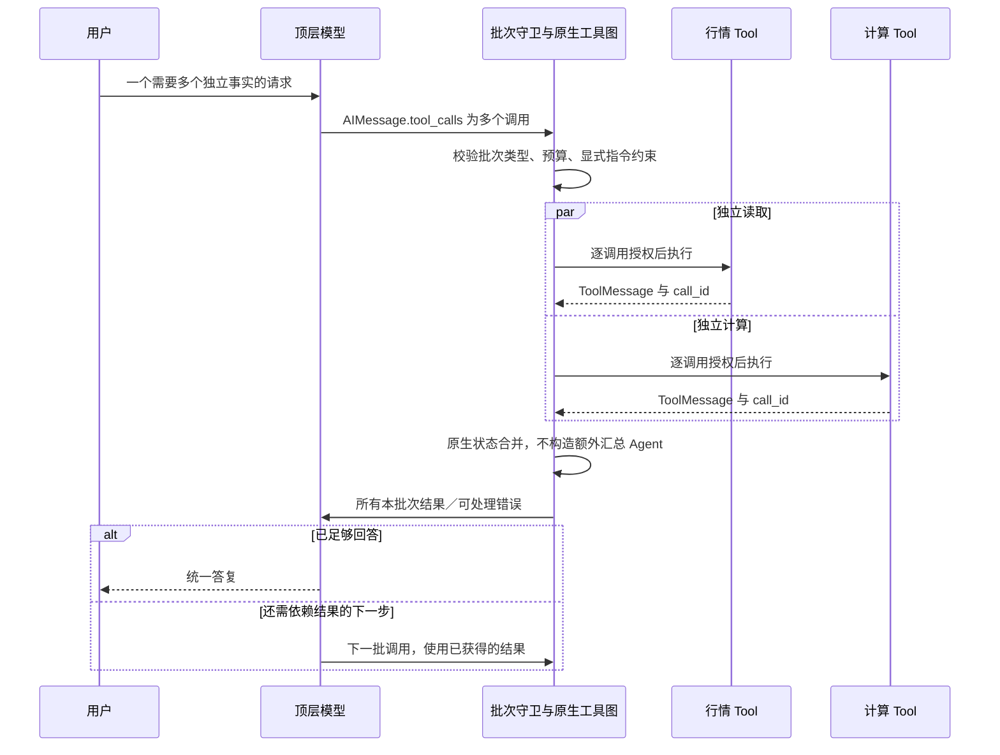
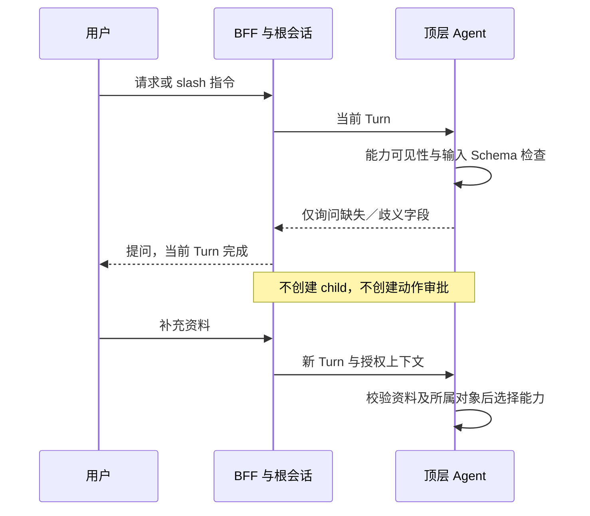
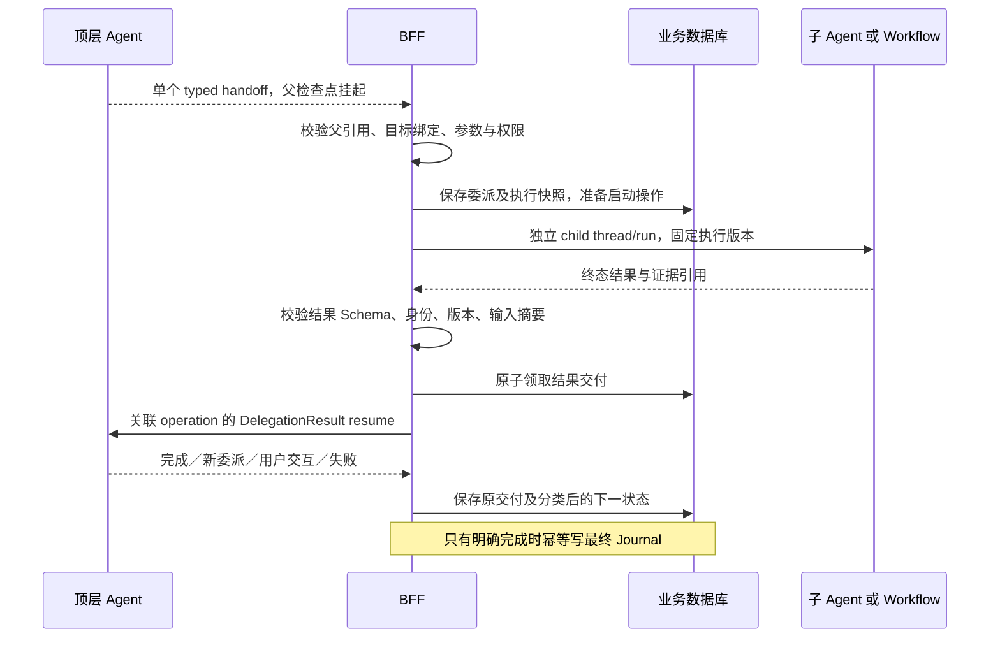
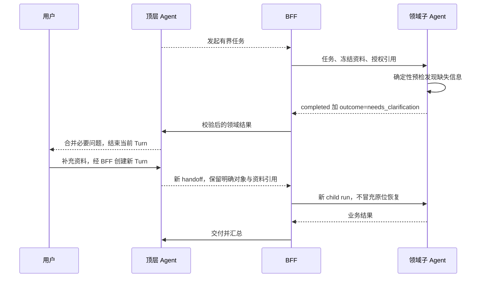
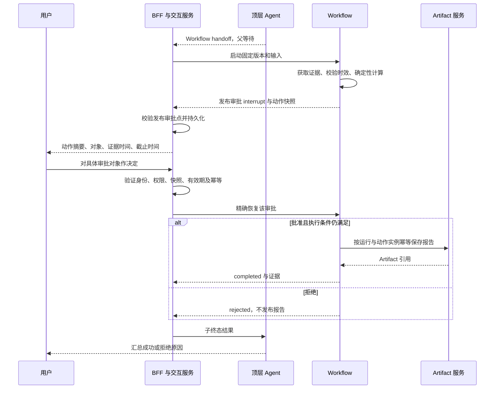
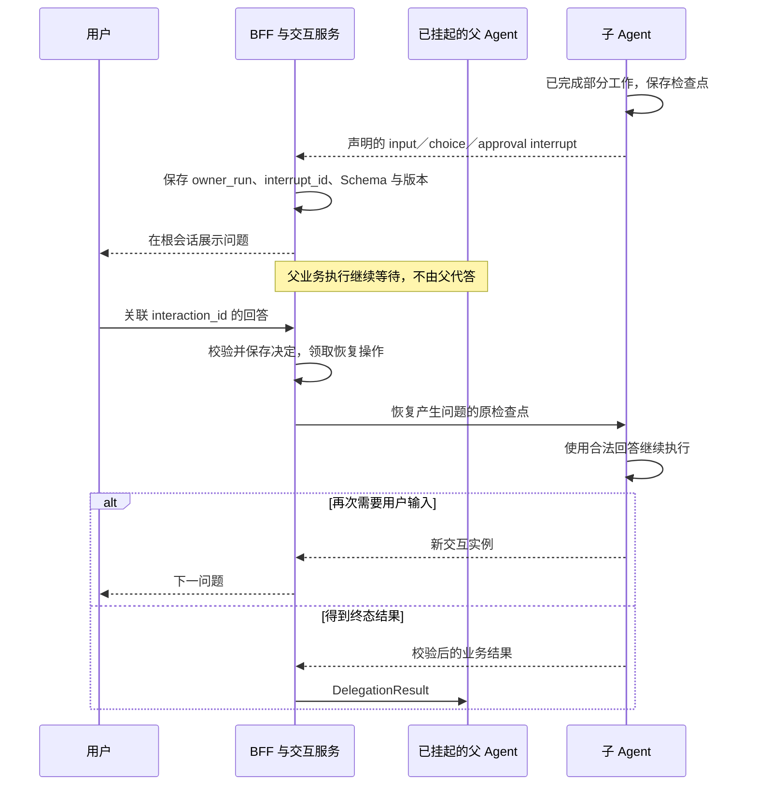
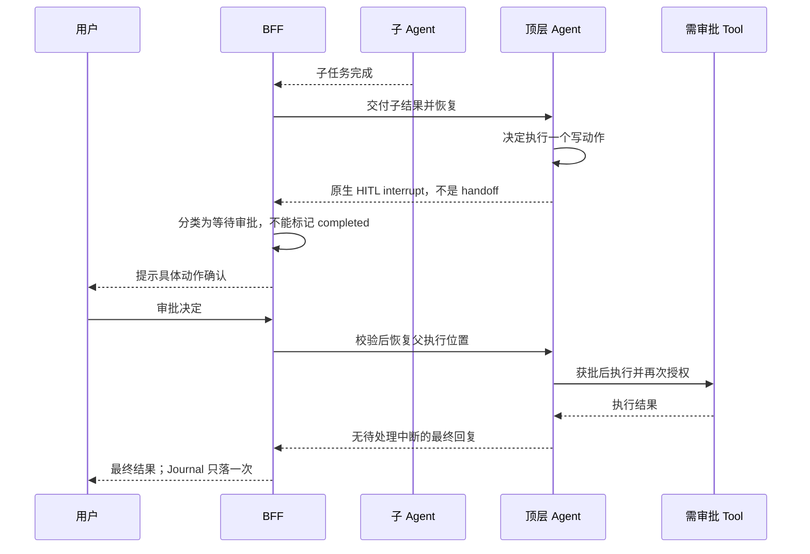
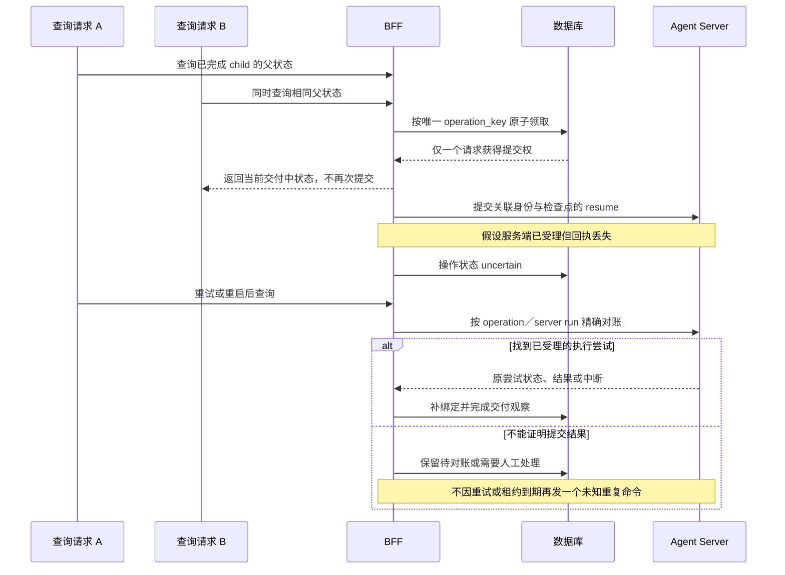
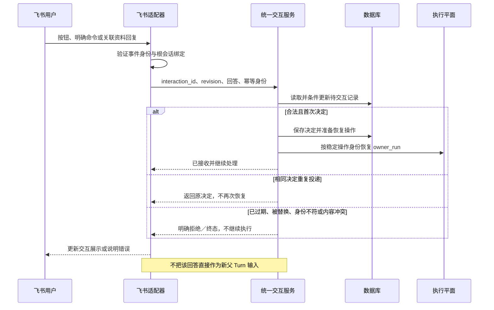
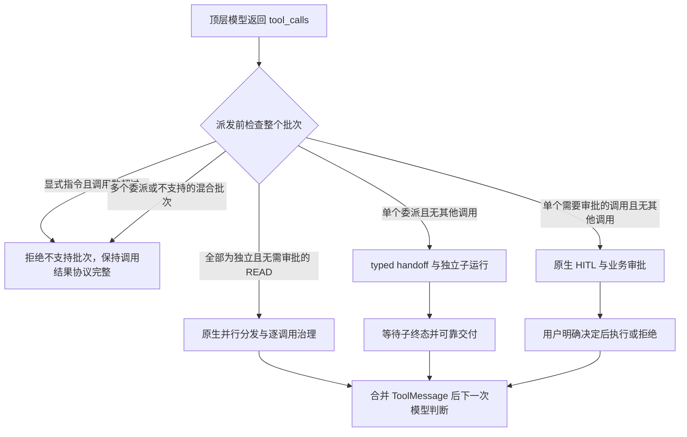

# Stage 6 Fix：委派可靠性、用户交互与批量工具调用优化方案

状态：A／B 已实现并完成本地回归与真实开发 Agent Server 验证；C 仍为 Proposed。

实施记录：[Stage 6 Fix A/B 实施与验证](./Stage-6-Fix-AB-实施与验证.md)。
本文第 2 节保留修复前的观察基线，不应作为新版本的能力说明。
PostgreSQL 部署环境、线上模型供应商和真实飞书联调仍须在上线前单独验收。

编制日期：2026-09-05

适用基线：现有 Stage 4 委派／Workflow 与 Stage 6 飞书单聊实现

本文件承接本次代码审视，说明问题、目标行为、实现边界、场景调用图及验收要求。
用户确认编写本方案，不代表下文所有扩展能力已经上线，或替代独立的安全、发布与产品审批。

## 1. 结论与范围

保留现有主干：一个根 Conversation、一个顶层 `finance_agent`，通过受治理 Tool 使用
普通工具、发布式 Workflow 和领域 Agent。LangChain／LangGraph 继续负责模型循环、
工具执行、并行分发、检查点与 interrupt/resume；BFF 负责业务归属、授权、交互与父子结果交付。

此次优先解决的不是增加 Agent 数量，而是保证：

1. 挂起不能误报完成，子运行与父运行的审批都能被准确识别。
2. 恢复不能扩大权限、切换执行版本或重复执行已提交的恢复命令。
3. 子任务只获得明确授权的必要上下文，并返回可校验的业务结果。
4. 普通独立只读工具可以一轮多调用、汇总后再决策；不得把这一能力误等同于多委派／多审批闭环。
5. 资料澄清和动作授权使用不同语义；用户回答必须关联具体问题与执行位置。

### 1.1 分阶段交付

| 子阶段 | 范围 | 交付后可以承诺的能力 |
|---|---|---|
| 6-Fix A：安全与正确性 | 运行结果分类、授权快照、交付原子领取、恢复对账、批次守卫、单活动父运行保护与安全取消出口 | 普通只读批量调用；单委派串行闭环；现有 Workflow 审批不丢失；异常恢复不扩权 |
| 6-Fix B：上下文与澄清 | 任务级上下文、授权引用解析、Agent 输入输出契约、低成本澄清、新旧协议兼容、真实版本绑定 | 子任务结构化返回成功／需澄清／不支持等领域结果；顶层追问后新 Turn 重委派 |
| 6-Fix C：持久化用户交互 | 统一交互记录、Agent-child 原位恢复、HTTP 交互接口、飞书关联回复／审批入口 | Workflow、顶层和子 Agent 的中途确认可定位、可恢复、可审计 |

6-Fix C 是显式扩展，不是现有 Agent-child 能力。只需要低成本提槽的领域任务可以在 B 阶段接入，
不必等待完整的持久化用户交互。C 默认先支持单个待交互执行位置，复杂批次审批需独立启用和验收。

### 1.2 不包含

- 动态生成任意 DAG、通用 Planner、第二套 Agent Runtime 或独立调度微服务。
- 多个子 Agent／Workflow 并行委派的正式上线；A 阶段对此增加明确守卫。
- 任意深度的递归委派；现有子 Agent 不获得再委派能力。
- 多人会签、群聊审批、跨用户代批和完整企业审批流。
- 所有工具作为一个分布式事务执行、自动回滚已发生的外部副作用。
- 脱离客户端后的主动后台推进与可靠通知保证；若产品要求该能力，另行确定调度与投递范围。
- 自动修改或绕过用户拒绝的动作，以及由父 Agent 代用户批准子任务。

## 2. 当前实现与验证事实

### 2.1 执行链路

顶层由 `AgentFactory` 调用 LangChain `create_agent` 构建。Workflow 与领域 Agent 包装为
`delegate_workflow__<id>`、`delegate_agent__<id>` 两种委派工具。
委派工具构造 typed handoff 并 interrupt；BFF 受理、持久化父子映射、启动独立 child thread/run；
子任务终态以 `DelegationResult` 恢复父运行。父会话的状态查询和流结束后的校正负责推进这条链。

当前已装配 `portfolio_review@1.0.0` 和只读 `market_research_agent@1.0.0`。
普通自然语言由模型选择能力；`/tool`、`/workflow`、`/agent` 只是调用偏好，不是身份或授权。

### 2.2 一轮多个工具：当前到底支持什么

**支持顶层模型一次返回多个普通工具调用，并在结果进入消息状态后，再调用一次模型判断下一步。**
这里“一轮”指一次模型输出的 `AIMessage.tool_calls[]`；一个用户 Turn 内可以有多轮模型与工具往返。

当前本地依赖为 LangChain `1.3.18`、LangChain Core `1.6.1`、LangGraph `1.2.11`、
LangGraph Prebuilt `1.1.0`、LangGraph SDK `0.4.4`。该版本 `create_agent` 对未完成的调用生成
多个 `Send("tools", [tool_call])`，工具产生对应 `tool_call_id` 的 `ToolMessage`，
图合并结果后进入下一次模型调用。汇总是结果消息的汇合，不是额外启动一个“汇总 Agent”。

| 场景 | 当前事实 | 6-Fix 推荐策略 |
|---|---|---|
| 一次返回多个独立 READ 调用 | 支持，包括同一 Tool 的不同参数；同步和异步入口均已离线验证 | 保留框架原生分发，增加批次数量、资源并发和总预算限制 |
| 汇总结果后再调用其他 Tool | 支持；模型下一次可直接回答或继续发起工具调用 | 保留 ReAct 循环，不增加通用计划对象 |
| 工具 B 的入参依赖工具 A 的结果 | 同批次不会自动解析依赖，模型必须先获得 A 结果 | 分两轮，或发布为确定性 Workflow |
| 一次返回多个委派工具 | 图会产生多个 handoff 中断，BFF 当前只提取第一个 | A 阶段明确禁止多委派及委派混合批次，不假装已经支持 fan-out/fan-in |
| 一次返回多个需要审批的工具 | 原生 HITL 可提出多个动作，但 BFF 的恢复请求只包装一条决定 | A 阶段单个需审批调用独占批次；C 阶段若开放，必须逐动作关联与完整映射 |
| `/tool` 显式单次调用 | 限制能力名和参数；同批次同名同参数的两个调用仍可能都通过 | 在派发前校验整个批次只能有一个调用，不能仅靠逐工具守卫 |
| 权限拒绝或可处理的调用错误 | 可返回错误 `ToolMessage`，参与后续模型决策 | 保留稳定错误类别，不让模型把错误当成有效业务证据 |
| 未处理的工具内部异常 | 可能终止正常模型循环，不保证所有结果都返回给模型 | 区分可恢复业务失败与执行故障，不承诺事务回滚 |

并行分发不保证所有工具真正同时进行 I/O：工具若在异步入口内执行同步阻塞逻辑，仍会阻塞事件循环；
有效重叠程度还取决于工具实现、资源限流和运行配置。运行时支持批量调用，也不代表当前配置的真实模型
必然生成多项 `tool_calls`；本次没有调用线上模型供应商。

### 2.3 已确认的问题

| 编号 | 问题与依据 | 影响 |
|---|---|---|
| F01 | `_advance_delegation` 只识别下一次 handoff；普通审批中断进入完成分支 | 父运行仍挂起，Turn 却变为 completed，用户确认入口丢失 |
| F02 | `DelegationService.status` 用 `frozenset({"*"})` 恢复未启动 child | 恢复扩大原始授权上界；当前只读白名单不等于该设计安全 |
| F03 | 子 Agent 继承根 conversation_id，Factory 不按 context_policy 区分会话中间件 | 子模型会装入父 Journal；memory_policy=none 只关闭长期记忆召回 |
| F04 | context_refs 落入委派记录，但未解析传入子运行；最终只提取最后一条 AI 文本 | 显式上下文引用和结构化领域结果未形成闭环 |
| F05 | 父恢复成功之后才标记 delivered，没有领取及提交关联 | 并发查询重复恢复；响应丢失／崩溃后无法可靠判断是否已经提交 |
| F06 | Agent-child 可进入 interrupted，但 resume 仅允许 Workflow | 子 Agent 中途直接 interrupt 会停住，问题载荷也没有完整透出 |
| F07 | handoff 接收时再取目录版本；实际 Agent assistant_id 未版本化；治理部分路径按名称取 latest | 发布升级时，记录版本、审批策略和实际执行代码可能不一致 |
| F08 | 提取第一个 handoff，查询最新未交付委派；审批按 run 最新记录而非具体 interrupt 定位 | 不适合直接扩展多委派、多审批和重复审批点 |
| F09 | 飞书仅展示“前往 Web/API 审批”，入站文本直接 start_turn | 普通“同意”不能恢复待审批任务；共享父 thread 的新旧任务可能混淆 |
| F10 | 一条显式指令的同批次重复调用仍可同时执行 | 单调用意图没有批次级硬约束；有副作用时风险更大 |

当前 Workflow 默认运行软超时 300 秒、审批窗口 900 秒，均可配置。审批期限从 BFF 首次登记时计算；
已中断审批主要在 resume 时检查过期。顶层普通审批则从 Turn 创建时间计算。这些口径应统一，
但不能把“本地标记超时”描述成“底层执行已取消”。

### 2.4 验证范围

- 现有测试：`tests/stage4`、`tests/stage6/test_run_streaming.py`、`tests/stage6/test_feishu_channel.py`，共 28 项通过。
- 前次独立临时目录中的 5 个观察用例复现：父恢复后普通审批误报完成、Agent-child 无法恢复、父历史进入子上下文／引用未传递、恢复通配权限、并发父恢复。
- 本次新增 6 个临时离线观察用例，全部命中预期观察：
  1. 三个普通调用中，两次异步行情读取通过同步屏障证明存在重叠；模型接收结果数依次为 `0 → 3 → 4`，即收齐三份结果后再发起一次计算。
  2. 同步图也能一次调用两个普通工具，再进入模型。
  3. 两个委派调用产生两个中断，而现有 handoff 提取器只取第一个。
  4. 两个写动作产生一个包含两项 action_requests 的 HITL 请求；仅一条决定无法恢复。
  5. 显式 `/tool calculate` 的同批次重复同参数调用均执行成功，说明仍需批次守卫。
  6. 计算器除零异常会阻止正常的下一轮模型调用。
- 并发父恢复模拟发生了两次 resume，并观察到 SQLite Journal 唯一键冲突；这是离线复现，不是线上事故结论。
- 临时用例使用脚本化模型、假 Agent Server、本地工具和临时 SQLite；未调用真实飞书或线上 LLM。
- 临时观察用例不是修复后的验收测试。实施时应把断言改为正确目标行为，纳入仓库持续回归。

## 3. 设计不变量

1. **单根会话**：领域 Agent 不接管 Conversation；用户只面对根会话的渠道入口。
2. **执行身份可信**：身份、权限、目标版本、交互绑定来自认证及服务端快照，不采信模型自报。
3. **恢复不扩权**：恢复执行权限不超过原授权上界，并按需要复核当前授权。
4. **挂起不是完成**：存在待处理中断、待交付子结果或未确认执行提交时，不得发出 completed。
5. **结果精确归属**：handoff、parent、child、目标版本、输入摘要与结果 Schema 必须一致。
6. **决定只覆盖具体对象**：批准绑定具体动作快照；修改对象或参数必须生成新版本确认。
7. **用户拒绝不可自动绕过**：父 Agent 不通过换工具或新委派重做等价的被拒动作；改变方案须明确说明并重新授权。
8. **批量非事务**：普通并发工具没有整体原子性，也不能用一个工具失败推断其他工具均未执行。
9. **编排薄层**：BFF 记录业务事实和外部执行命令关联，不复制 LangGraph 节点调度、检查点或消息 reducer。

## 4. 核心修复设计

### 4.1 统一运行观察与结果分类

统一封装 create、status、resume、stream-finalize 返回结果的分类逻辑，所有路径使用同一套判定：

| 观察结果 | 业务处理 |
|---|---|
| 普通工具仍在执行 | running，不提前汇总或写最终 Journal |
| 合法 handoff | 校验批次约束后受理子任务，父状态 waiting_child |
| 已发布 Workflow 审批／原生 HITL／声明的领域交互 | 保存可定位交互，父或子状态等待用户 |
| 子运行终态但父结果未交付 | 保持待交付，不将父运行视为完成 |
| 明确完成且无待处理中断 | 校验结果；根运行最终助手消息幂等落 Journal |
| 未知或混合且不受支持的中断 | 可见的 unsupported_interruption／needs_attention，不误报完成 |
| 执行失败 | 保存分类错误与审计，按父子归属交付；不把失败包装为成功内容 |

内部使用带判别字段的轻量观察 DTO；保留原生 interrupt ID、检查点及 Server Run 关联。
对外兼容已有 `interrupted` 状态，增加 `waiting_reason` 和安全的 `pending_interactions` 投影。
不能直接把完整内部 state、Prompt、工具凭证或推理内容暴露给用户。

A 阶段先将现有 WorkflowApproval 和单动作原生 HITL 的定位、快照、有效期纳入运行记录与兼容投影；
不宣称支持任意领域交互。C 阶段再抽取统一交互表和新 API，避免 A 的正确性修复依赖整个 C 上线。

### 4.2 执行快照与真正的版本绑定

给父业务运行及委派保存服务端生成的 `execution_snapshot`，至少包括：

- tenant/subject、经收窄的 granted_scopes、授权来源及策略版本。
- data_classification、locale、timezone、固定 request_clock。
- 根／子 Profile、委派 Tool、实际 assistant／graph release、ModelProfile、Tool 版本绑定。
- 原始规范化输入摘要、父子定位、授权上下文引用及引用内容版本／摘要。

恢复的有效权限必须是“原授权上界与当前允许执行范围的交集”，另行校验审批人是否有权对具体动作作决定。
新增的审批权限不能反过来扩大执行权限。原授权无法证明的旧记录不得默认 `*`，应请求重新授权或可见失败。

Factory 一次解析不可变的 name→ManagedTool 绑定，工具可见性、执行授权、HITL、Manifest 和 Audit
共同复用该绑定。单个 Profile 中同名 Tool 不能同时绑定两个版本。
委派 Tool 的目标版本由服务端绑定，不让模型自由指定；运行中的旧版本不随 latest 迁移。

Agent Profile 增加明确的版本化 assistant_id 映射。Graph 名带版本还不够：必须保留对应代码与依赖，
无法共存时先排空旧运行。版本化 handoff 在恢复时也核对目标版本及输入摘要。

### 4.3 交付原子领取与恢复提交对账

区分子任务的 `execution_status` 与 `delivery_status`。不要仅用 delivered 覆盖 completed／rejected／failed，
导致终态语义被交付状态遮蔽。旧字段通过投影保持兼容。

增加薄的运行操作记录（建议 `run_operations`，不是任务调度队列），记录每次 start／resume：

| 字段组 | 内容 |
|---|---|
| 稳定身份 | operation_id、业务 run、delegation／interaction、唯一 operation_key |
| 固定目标 | thread、assistant release、checkpoint／interrupt 关联、请求摘要 |
| 提交状态 | prepared、claimed、submitted、observed、uncertain；数据库行版本／领取租约 |
| 服务端关联 | server_run_id、前驱执行尝试、提交及观察时间、结果摘要 |

具体规则：

1. 通过数据库 CAS／行锁和唯一约束领取“某子结果交付”或“某交互恢复”；不能只依靠单进程锁。
2. 持锁事务只做本地状态更新，不跨远程执行持有长事务。
3. 执行命令使用固定 operation_key 并携带关联 metadata；客户端 Port 返回可持久化的提交回执与 Server Run 身份。
4. 已提交但响应丢失进入 uncertain，先按精确身份对账，不能直接发起一个新的 resume。
5. SDK 是否支持指定运行身份／幂等提交，应在实现前做兼容性验证；若不能证明去重，不声称 exactly-once。
6. 不确定状态无法确认是否已执行时，保守保持待对账／需要人工处理，不以租约到期为由盲重试副作用。
7. 已观察到原恢复完成或产生新中断，原子提交交付状态及下一状态。Journal 最终消息也应有运行级唯一性和并发安全的序号分配。

当前 `resume_run` 使用 `runs.wait` 只返回结果，未绑定新的 Server Run；应补齐执行尝试关联，避免后续
仍查询旧 Server Run 或把共享 thread 的最新状态误认为旧任务的状态。不需要建设跨尝试 token 回放系统。

### 4.4 子任务上下文与结构化结果

`context_policy` 必须成为真实装配行为：

- 根会话继续使用 Journal 上下文策略。
- 子 Agent 默认使用 `delegated-task-only-v1`：任务、冻结输入、已授权引用、自身工具往返和必要系统约束。
- 保留 conversation/turn/parent run 用于归属和审计，不通过清空 conversation_id 伪装上下文隔离。
- context_refs 仅接受明确实现的会话片段／Artifact 引用类型；验证租户、用户、对象、数据分类、大小与内容版本。
- 不允许把任意 URL 或本机路径当作可自动抓取引用；父结果引用也不能自动扩大子工具权限。
- 不把 child 的中间模型消息作为根会话的最终助手消息写入 Journal。

Agent Profile 可声明具体 input_schema、output_schema 及最终 state 字段。
`AgentHandoff@2` 保留 task，增加类型化 arguments；旧 AgentHandoff@1 和 WorkflowHandoff@1 保持可读。
解析器按 kind 与 schema_version 联合路由，不能只用重复的 kind 建立有歧义的联合。

结果分两层：

```json
{
  "status": "completed",
  "output": {
    "outcome": "needs_clarification",
    "missing_fields": ["analysis_period"],
    "question": "希望分析哪个时间区间？",
    "partial_result_refs": []
  }
}
```

上例是建议的结果形态片段，不是当前已支持的新接口。外层是委派传输／执行结果，内层是领域结果。
领域 outcome 可声明 success、needs_clarification、unsupported、partial 等有限集合；各领域自行定义
所需 DTO，不引入通用 Schema Registry。运行故障／权限错误／结果损坏仍是 failed，不是需澄清。

最终结构化结果从声明的 state 字段读取并校验，不从最后一句自然语言猜测 JSON。
大结果以 Artifact 引用返回，并保留必要摘要、证据和不确定性。

### 4.5 批量工具策略

在模型输出之后、HITL 与 ToolNode 真正派发之前增加薄的批次守卫，继续使用框架原生工具执行。
实现时检查生成图和测试实际 hook 顺序，不能仅凭 middleware 列表顺序推断守卫先于审批执行。

6-Fix A 的默认策略：

| 批次内容 | 处理 |
|---|---|
| 全部为独立、无需审批的 READ | 允许多调用；按配置限制最大批次和资源并发；逐工具再次授权 |
| 单个委派 Tool | 允许；走独立 child 与交付链 |
| 多个委派，或委派与其他 Tool 混合 | 派发前拒绝整个不受支持批次；不得偷偷只执行第一项 |
| 单个 WRITE／EXTERNAL_ACTION／需要审批的调用 | 独占批次，进入已有审批链 |
| 多个需要审批的调用，或与其他 Tool 混合 | A 阶段拒绝；C 的批次审批扩展验收后才开放 |
| 显式 `/tool`、`/workflow`、`/agent` | 本次指定调用最多一个，包括同名同参数重复调用 |

拒绝批次必须保持原生 tool_call_id 消息协议完整，给出可解释的批次错误或受控终止，不能删掉一部分
调用后让用户以为全部完成。正常无依赖 READ 不为等待“统一审批”而额外暂停。
内部依赖不能靠参数中的占位符跨并行调用传递；相关动作拆轮次或进入固定 Workflow。

暂不把批次上限写死为产品保证；作为可配置项与实际供应商限流一起验证。
一批 3 个工具按 3 次业务调用计入预算，而不是 1 次；原生模型／工具上限之外，补充根任务树累计预算，
覆盖子 Agent、恢复尝试与重试，不让多轮 resume 重置预算规避限制。

## 5. 用户交互设计

### 5.1 模式一：结束子任务，由根会话提槽

适用于低成本、只读、尚未进入不可重复步骤的任务。
子任务返回合法的 needs_clarification 结果；父 Agent 合并必要问题并结束当前 Turn；
用户补充后创建新 Turn、新 handoff，并引用已授权的资料与部分结果。

要保留资料所属对象和来源。例如“我的组合”和“朋友的组合”不能在补槽时混用。
新委派是新运行，不称为原 child resume；重算成本和快照时效应对用户透明。

### 5.2 模式二：保存检查点，恢复原执行位置

适用于已完成较多工作、需保留中间状态，或请求具体动作授权的任务。C 阶段实现。

建议持久化 `pending_interactions`（表名表达业务用途，不另建通用消息平台）：

| 字段组 | 关键字段与约束 |
|---|---|
| 身份及定位 | interaction_id、tenant、subject、conversation、parent_run、owner_run、delegation_id |
| 原生恢复绑定 | thread_id、server_run_id／operation_id、checkpoint_id、interrupt_id、交互来源类型 |
| 请求实例 | point_id、point_instance／revision；同一节点重复提问形成新实例 |
| 类型和呈现 | kind=input／choice／approval、question、必要说明、options、response_schema |
| 授权对象 | action snapshot、参数及目标摘要、必要证据版本、allowed_decisions、required_scope |
| 批次映射 | 可选 group_id、action_id／tool_call_id、原始 action index；不靠界面顺序猜测 |
| 生命周期 | pending、resolved、rejected、expired、cancelled、superseded；请求时间、截止时间、决定人 |
| 幂等与审计 | version、response_idempotency_key、response_hash、decision_ref；恢复结果另记 run_operations |

资料回答、业务选项和授权决定分型校验。普通“好”“继续”不得直接批准副作用。
动作批准绑定不可变快照；快照应包含用户实际确认的动作、对象、关键参数及必要报告／证据摘要，
不只检查任务最初输入。输入或动作变化时 supersede 旧交互并生成新请求。

### 5.3 交互路由与恢复

1. 子运行发出声明的交互中断；BFF 校验并保存关联。
2. 父运行继续等待子任务；BFF／渠道以根会话身份展示问题，不恢复父模型去“代替用户回答”。
3. 用户回答经认证的渠道进入 Interaction Service。
4. 校验归属、交互 revision、pending 状态、截止时间、回答 Schema 和动作授权。
5. 事务内保存决定并准备稳定的 resume operation；远程提交按 4.3 对账。
6. 恢复 owner_run 的具体原生 interrupt，而不是“当前会话最新的 run”。
7. 子运行继续执行或再次提问；只有形成终态业务结果，才交付父运行。

原生 HITL 的一个 interrupt 可能包含多个 action_requests。若 C 后续开放批次审批，应逐动作记录决定，
待该组所需决定齐备后，按冻结的原始顺序构造完整 decisions 列表再恢复一次；不得一条 approve 覆盖整组。
同时存在多个原生 interrupt 时使用明确的 ID 映射，禁止广播单个 resume 值。
这些是扩展准入条件，不是 A／B 阶段的能力声明。

### 5.4 拒绝、修改、过期与新消息

- **拒绝**：记录决定；恢复拒绝分支或结束任务，不继续被拒动作；父 Agent 解释结果。
- **修改**：资料交互按 Schema 校验；动作参数变化重新预检并生成新快照，旧批准失效。现有 Workflow 不支持原地 edit 的兼容行为保持不变。
- **过期**：status 与 response 使用同一时钟口径检查截止时间；A／B 至少做到查询时可见过期，C 再接入明确的超时协调方式。未发生查询时不承诺主动通知。
- **取消**：A 的单活动运行守卫同时提供安全退出路径。业务取消与底层执行取消分开记录，先进入 cancellation_requested 并停止新派发／交付；对子树中已受理的执行尝试逐一确认停止后，才释放同一根 thread。已发生副作用不能假装撤销。取消能力不支持或结果未知时明确提示待处理，可引导创建独立会话，不强行复用原挂起 thread。
- **重复回答**：同交互版本、相同幂等键和内容返回原结果；不同内容冲突，不触发第二次恢复。
- **等待中的新消息**：同一根 thread 不启动第二个活动 Turn。能明确关联资料回答时进入交互路由；否则提示先完成或取消原任务，不让无关消息污染挂起检查点。
- **批次部分失败**：成功证据保留、失败明确标注；不可处理执行异常按失败处理。允许的重试必须有上限，不能把整批有副作用调用全部重做。

## 6. API、飞书和持久化兼容

### 6.1 建议的增量 API（尚未实现）

```text
GET  /v1/runs/{run_id}
     增加 waiting_reason、pending_interactions 的安全投影

POST /v1/runs/{run_id}/cancel
     A 阶段建议入口：校验归属并请求取消；返回请求状态，不冒充执行已停止

POST /v1/interactions/{interaction_id}/responses
     按 interaction kind 校验 answer／decision，要求 revision 与幂等身份
```

API 实际路径、字段和错误码在接口实施评审时固定；上面是本方案建议。
已有 `POST /v1/runs/{run_id}/resume` 保持兼容：仅在能够唯一定位一个支持的待审批对象时映射；
出现多对象或歧义返回冲突并给出明确交互入口，禁止默认处理最新一条。
父运行 ID 可用于查找其子树中的交互，但不能因此越过 owner_run 的权限和快照校验。

SSE 保留现有稳定事件；可以为 run.interrupted 增加安全的交互摘要／引用，新增字段应保持旧客户端可读。
状态和最终答案是权威视图，token 流只是展示，不因流结束而推断任务完成。

### 6.2 飞书接入

- 延续已验证事件信封产生的 app／tenant／open_id／chat 绑定，交互回调也验证同一归属。
- 有界资料／选项交互可使用明确回复关联；没有唯一关联时让用户选择问题，不猜测。
- 副作用审批使用绑定 interaction_id、revision 和动作摘要的按钮或明确命令，不靠自由聊天推断授权。
- 回调去重、决定落库和恢复操作共用后端服务，不在 Channel 中复制一套审批状态机。
- SDK 当前未装配审批回调；实施先验证所用官方 SDK／事件适配能力，再确定接入方式，不能假定流式 Markdown 卡片自动支持审批。
- 回调能力未完成时提供可定位的 Web/API 审批入口与任务标识，保留降级提示；不承诺已有完整 Web 审批页面。
- 取消、拒绝、过期后卡片显示终态；旧按钮点击只能返回原状态或冲突，不能再执行。
- 保留单实例飞书接入边界。本方案不顺带承诺多实例 WebSocket 主选、持久化 Inbox 或消息零丢失。

### 6.3 数据迁移

- 增量增加 execution_snapshot、交付状态／版本、run_operations；C 阶段再增加交互表及关联。
- 旧 delegation.status 的 delivered 需要结合旧结果回填执行状态；无法可靠推导的历史保持 unknown，不编造成功。
- 保留旧 WorkflowApproval 表的历史审计；新交互引用原审批 ID，不生成冲突的双重权威决定。
- 旧未完成记录恢复必须取得可验证的授权与执行关联。迁移字段可为空，不意味着恢复时可无条件放行。
- 新根／子 Profile 和 graph 按版本发布，先灰度、再放量；回滚不能删除已经产生的新交互或执行事实。
- Stage 7 的共享前置修复引用本文件验收，不另实现一套委派、上下文或审批机制。

## 7. 优化后的场景调用图

以下是**目标行为**。每图标明交付阶段；A／B／C 未完成前，不应当作当前线上保证。

### S1：多个独立只读工具，一次汇合后判断下一步（A，主干当前已有）



工具未处理异常会进入失败路径，而不是保证仍有一次完整模型汇总；已完成工具没有自动回滚。

### S2：顶层发现缺少必填资料，委派尚未启动（A／B）



### S3：正常委派并交付父运行（A／B）



### S4：子任务返回需澄清，用户补充后新委派（B）



### S5：Workflow 发布前审批（A 修复现有链，C 统一交互入口）



报告如定义为时点快照，应明确其 as-of；如后续动作要求当前有效数据，应重新预检并在快照变化时重新审批，
不能无提示替换用户批准的报告内容。

### S6：子 Agent 执行中需要选择，保存进度原位恢复（C 新能力）



### S7：子任务完成后，父 Agent 自己又要求审批（A 必修）



### S8：并发查询与“恢复已提交、响应丢失”（A 必修）



### S9：飞书回答、重复点击与过期（C）



### S10：多工具批次的准入分流（A）



## 8. 代码落点与实施顺序

| 模块 | 计划改动 |
|---|---|
| application/conversation_service.py | 统一恢复结果分类；活动 Turn 保护；父交付领取；安全状态投影与 Journal 并发幂等 |
| application/delegation_service.py | 固定执行快照；移除通配恢复；版本化 handoff；结构化结果；C 阶段 child interaction 路由 |
| application/workflow_service.py | 统一审批定位与期限；恢复尝试绑定；兼容原审批记录 |
| application/ports/agent_server.py、infrastructure/clients/agent_server.py | 带身份的 start／resume 回执和精确对账；验证所用 SDK 实际能力 |
| modules/delegation、modules/conversation | 执行／交付状态、CAS、稳定操作关联、结果及最终消息唯一性 |
| modules/workflows | 旧审批兼容、点实例／交互关联，避免按最新审批猜测恢复对象 |
| orchestration/agents/factory.py、profiles.py | 真正应用 context_policy；固定 Tool 绑定；批次守卫与预算 |
| orchestration/agents/context_middleware.py | 根 Journal 与任务级子上下文分流 |
| orchestration/tools/delegation.py | 目标版本与 Schema 绑定、v1/v2 兼容、精确结果匹配 |
| application/interaction_service.py、modules/interactions（拟新增，C） | 小型业务交互契约、归属校验、决定持久化与恢复协调 |
| interfaces/http、application/streaming.py | 增量交互 API、安全投影、明确等待原因，不依赖 token 流判断终态 |
| interfaces/channels/feishu.py、application/feishu_channel_service.py | C 阶段关联回答／审批入口；原有单聊与流式降级回归 |
| bootstrap.py、server_graphs.py、langgraph*.json | 新旧 Profile／Graph 版本显式装配；禁止记录旧版本实际执行新代码 |
| infrastructure/migrations、tests/stage6fix（拟新增） | 增量迁移、正确性／并发／故障注入与真实执行平面验收 |

顺序建议：先写失败用例与固定观察证据，再做 A；完成 A 的真实 Server Run 恢复测试后实施 B；
只有产品确认需要原位用户交互及渠道入口时再实施 C。迁移、特性开关、旧运行处理和回滚策略与代码一起交付。

## 9. 验收矩阵

| 编号 | 必须通过的场景 | 阶段 |
|---|---|---|
| A01 | child 完成后父 HITL 挂起，HTTP／SSE／Journal 不误报完成 | A |
| A02 | 父审批后继续委派、子结果后继续委派、未知中断均正确分类 | A |
| A03 | 恢复前后权限不扩大；缺快照、权限撤销与过期授权均安全处理 | A |
| A04 | 多个 HTTP／stream-finalize／飞书轮询并发，不重复提交父恢复 | A |
| A05 | 在提交前、提交后回执前、回执后交付落库前分别崩溃，可定位原操作 | A |
| A06 | 多个 Server Run 尝试不会被旧绑定／共享 thread 最新状态混淆 | A |
| A07 | Journal 最终助手消息只写一次，序号并发安全；重复查询稳定 | A |
| A08 | 一次多个 READ，结果以正确 tool_call_id 收齐，模型只在汇合后决策 | A |
| A09 | 同名不同参数 READ 支持；有依赖任务拆轮次；重试／失败／超限分类明确 | A |
| A10 | 多委派、混合委派、多需审批动作、slash 重复调用在实际派发前被守卫 | A |
| A11 | 共享根 thread 等待时的新消息不创建冲突执行；用户能看到如何继续或取消 | A |
| B01 | 子模型输入包含任务与授权引用，不包含未授权父历史或根长期 Memory | B |
| B02 | v1/v2 handoff 兼容；输入、输出、引用跨租户／对象／版本错误被拒绝 | B |
| B03 | needs_clarification 完成旧任务、顶层提问，新 Turn 重委派且不混用对象 | B |
| B04 | 子任务失败／unsupported／partial 不被父 Agent 宣称为成功；证据及限制保留 | B |
| B05 | 新旧执行版本共存或排空策略可验证，实际 Tool、策略、审批和审计绑定一致 | B |
| C01 | Agent-child 在原检查点资料回答、选择、授权后继续，父保持正确等待 | C |
| C02 | 顶层、Workflow、子 Agent 的交互均按 ID／实例／版本定位，不按最新记录猜测 | C |
| C03 | 拒绝、过期、修改、撤销、重复／冲突决定均不触发未经授权执行 | C |
| C04 | 用户拒绝后父 Agent 不通过等价 Tool／新委派绕过拒绝 | C |
| C05 | 飞书正常回复、明确审批、身份不符、重复事件、旧卡片和渠道失败降级 | C |
| C06 | 若开放多个 action_requests，逐动作决定完整映射；少决定／乱序／跨组决定不恢复 | C 扩展 |
| C07 | 等待用户时间、执行时间、总预算和取消状态分开处理，不把本地超时当底层停止 | C |

必须同时包含纯图测试、BFF 假客户端测试、持久化并发测试和真实 Agent Server 检查点测试。
SQLite 的通过不替代部署数据库的事务／锁行为验证；脚本化模型的通过不替代真实模型批量 tool_calls 的供应商兼容验收。
飞书须在具备凭证及授权后做真实单聊联调；未联调不得标记该渠道闭环已验收。

观测新增或明确关联：root_run、child_run、delegation、operation、interaction、native interrupt、
实际执行版本、批次调用数量、等待原因、执行／等待时长、重试次数、结果交付次数与失败分类。
指标不记录敏感输入原文；审批 Audit 独立于模型 trace。

## 10. 待实施前固定的决定

1. 先交付 A＋B，还是同批交付 C？推荐先 A＋B，按中途交互的实际需求启用 C。
2. 一期继续客户端 status／stream 驱动，还是要求断线后也主动完成并通知？本方案默认前者，不隐含增加后台任务平台。
3. 批次数量、全局资源并发和根任务树预算取值，依据实际工具时延及供应商限流确定。
4. C 阶段飞书采用经过验证的卡片回调还是带交互 ID 的明确命令；上线前保留 Web/API 退路。
5. 旧未完成运行如何排空或重新授权，及新旧 graph／依赖共存窗口。
6. 原位资料修改允许哪些字段、是否需要重做上游节点；动作授权的快照变化必须重新确认。

以上未决项不阻止先修复已确认的安全与状态正确性问题，也不能由实现者静默扩展为多委派、多人审批或无人值守副作用执行。

## 11. 代码与设计索引

- [现有顶层与子 Agent 装配](../../financeclaw/bootstrap.py)
- [AgentFactory 与原生 create_agent](../../financeclaw/orchestration/agents/factory.py)
- [逐工具治理与显式指令约束](../../financeclaw/orchestration/agents/middleware.py)
- [委派工具](../../financeclaw/orchestration/tools/delegation.py)
- [委派服务与首个 handoff 提取](../../financeclaw/application/delegation_service.py)
- [父运行推进与恢复](../../financeclaw/application/conversation_service.py)
- [Workflow 审批服务](../../financeclaw/application/workflow_service.py)
- [Agent Server 客户端](../../financeclaw/infrastructure/clients/agent_server.py)
- [会话上下文组装](../../financeclaw/modules/conversation/context.py)
- [飞书应用服务](../../financeclaw/application/feishu_channel_service.py)
- [Stage 4 实施说明](./Stage-4-Published-Workflows-实施说明.md)
- [Stage 6 实施说明](./Stage-6-Feishu-P2P-Channel-实施说明.md)

框架行为依据本地安装源码：`langchain/agents/factory.py` 的模型到 Tool Send 与 Tool 到模型边，
`langgraph/prebuilt/tool_node.py` 的执行与错误处理，以及
`langchain/agents/middleware/human_in_the_loop.py` 的多动作决定映射。升级依赖后重新运行本文件验收用例，
不把当前版本内部实现视为永久不变的接口契约。
