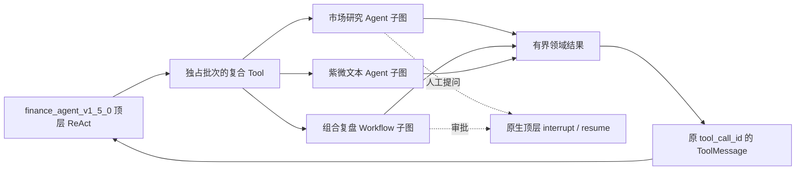

# Stage 8 Hotfix HF-1：执行端原生子图化——实施与验证

日期：2026-09-09。基线：`4ad1fa0`（Hotfix 方案与 HF-0 已推送）。
状态：**HF-1 执行端完成；HF-2 BFF 控制与结果闭环、HF-3 切换清理待实施。**

## 1. 本阶段交付

顶层新发布通过受治理的 Tool 直接等待已编译 Worker 子图，结果返回同一 ReAct 循环。
没有 child 业务 execution、child HTTP thread/run、委托 interrupt 或 Coordinator result delivery。



本阶段只注册执行端新版本。BFF 的共享 Catalog 默认不加载新版本，Agent Server 的
`default_agent_profile` 仍明确返回 `finance_agent@1.4.0`；旧 graph 注册与固定发布保留用于排空。
`langgraph.json`、`langgraph.local.json` 和 `langgraph.coordination.json` 只新增一个顶层 graph。

| 能力 | 新发布 | 顶层 Tool | 公开输出 |
|---|---|---|---|
| 顶层金融 Agent | `finance_agent@1.5.0` | — | 顶层消息 |
| 市场研究 | `market_research_agent@1.3.0` | `call_agent__market_research_agent` | `MarketResearchResult` |
| 组合复盘 | `portfolio_review@1.1.0` | `call_workflow__portfolio_review` | 原结果字段，`workflow_version` 固定 `1.1.0` |
| 紫微 | `ziwei_doushu_agent@2.1.0` | `call_agent__ziwei_doushu_agent` | `ZiweiTextResult`，保留 `answer_text`／`charts_used`／warnings |

组合复盘旧输出 Schema 的版本字段是 `Literal["1.0.0"]`，因此新建继承原结果约束的
`PortfolioReviewSubgraphOutput`，只固定新版本字段，没有放宽或覆盖旧发布的 Schema。
紫微是否进入根工具白名单继续由已有候选配置决定。
HF-0 的 `release-plan.json` 保持其历史“预留”记录；HF-1 的实际登记以共享 Catalog 为准。

## 2. 实现落点

| 位置 | 实现 |
|---|---|
| [`shared/releases/subgraphs.py`](../../financeclaw/shared/releases/subgraphs.py) | 新发布、复合 Tool 治理、根 Worker 清单；静态 Catalog 显式 opt-in |
| [`agent_server/tools/subgraph_assembly.py`](../../financeclaw/agent_server/tools/subgraph_assembly.py) | 启动期编译 Worker 一次，再注册 Tool；不在调用时重新 bootstrap |
| [`agent_server/tools/subgraphs.py`](../../financeclaw/agent_server/tools/subgraphs.py) | `SubagentTool`／`WorkflowTool`，原生 `ainvoke`、输入隔离、公开结果校验 |
| [`agent_server/tools/subgraph_scope.py`](../../financeclaw/agent_server/tools/subgraph_scope.py) | 进程内可信调用范围、原根身份、root tool_call_id 与固定发布核验 |
| [`execution_middleware.py`](../../financeclaw/agent_server/middleware/execution_middleware.py) | 根预算及 Worker 发布校验；复合包装不持有叶子资源槽 |
| [`subgraph_hitl.py`](../../financeclaw/agent_server/middleware/subgraph_hitl.py) | 保持原生 HITL 载荷；拒绝后先记录根副作用禁令，再继续 ReAct |
| [`shared/context/references.py`](../../financeclaw/shared/context/references.py) | 提取已有引用归属、版本、权限、分级及大小校验；旧委托入口仅兼容导入 |
| [`portfolio_review_v1.py`](../../financeclaw/agent_server/graphs/workflows/portfolio_review_v1.py) | 新发布完整核验、独立审批／制品键、固定审批期限、叶子资源门与根预算 |
| [`ziwei_agent.py`](../../financeclaw/agent_server/graphs/ziwei_agent.py) | Worker 发布校验适配；保持原文本输出协议和领域限额 |

新版本 Worker 不独立注册业务 HTTP graph。`checkpointer=None` 继承父运行持久化；
Tool 将 `runtime.config` 原样传入子图，不手工创建 namespace、thread 或原生 run。
原生 interrupt／取消／授权与预算异常向外传播；复合 Tool 不进入叶子瞬态自动重试集合。

## 3. 上下文、授权与预算

- 根发布的 `worker_manifest` 保存不可变的规范 JSON 声明，包含 Worker 发布、输入／输出
  Schema、模型配置、固定叶子工具治理、交互点及 Workflow 审批／超时。
  旧 Profile 不序列化空清单，既有发布快照保持兼容。
- `InvocationScope` 只由 Agent Server 的 Tool 包装创建，通过 `ContextVar` 传播；模型参数和
  HTTP `ExecutionContext` 不能传入它。直接运行 Worker 图，即使声称拥有同一个 root，也会拒绝。
- 子图保持 tenant／subject／conversation／turn／run／root 和固定时钟；只收窄 scopes。
  Worker 收到本次有界 task／arguments 及显式解析的引用，不复制根 messages、Journal 或长期记忆。
  Worker 不挂根 slash 指令、根上下文构建和根记忆中间件；根新版本的 `/agent`／`/workflow`
  同时在偏好路由与执行治理中映射到 `call_*`。
- 引用只支持带 SHA-256 的 message／artifact ID。读取前验证根身份和授权，再验证对象所有者、
  会话范围、分级、内容版本和总大小。引用不是额外授权，不接受 URL 或本地路径。
- 新根必须已有持久 execution 快照和有效 `run_authorizations` 授权。新清单根也执行既有 grant
  到期／撤销校验，不依赖假装成旧 Coordinator 模式；没有解除 legacy fence。
- 所有真实模型／叶子工具尝试及重试消费同一根累计预算。包装重入也继续计数，不重置限额；
  Worker 的线程内限额约束自身调用状态，不替代根持久计数。
- 复合工具治理为 `COMPOSITE`、禁止直连和自动重试，并占独立批次。只有叶子 I/O 获取共享
  semaphore；行情读取和 Workflow 制品发布都使用该资源门，槽位为 1 可以完成嵌套调用。

## 4. 人工交互与重入

自定义问题携带 root run、root tool_call_id、Worker kind/id/version 和 invocation_id。
Workflow 另带固定 approval_id、arguments_hash 和 checkpoint 中的 expires_at；恢复后再次验证。
同一 Worker／同一参数被调用两次，原 tool_call_id 不同，审批与制品幂等身份也不同。
完成的第一子图不会因第二子图的中断恢复而重跑。

原生 HITL 保持 `action_requests`／`review_configs`，不伪造框架的 interrupt payload。
HF-2 必须按 HF-0 已固定的规则，将根上唯一待返回的复合 Tool 与根发布中的 Worker／叶子声明
联合核对，再用 native interrupt ID 和 BFF interaction revision 绑定回答，不能解析描述字符串。
资料问题的到期时间与 BFF revision 仍由 HF-2 在首次观察事务中固定；重复观察不续期。

Workflow reject 和 Worker HITL reject 会在图内确认原决定后写根 `side_effects_denied`，
随后返回拒绝结果并允许顶层完成回答。HF-2 应先持久保存用户拒绝的命令意图，再恢复原 interrupt；
不要提前把根标记为“副作用已封闭”导致原复合 Tool 的恢复准入被自身拦住。
这一点不豁免授权撤销或取消，也没有借用旧 delivery 的预算绕过分支。

## 5. 验证与证据

### 5.1 业务图回归

[`test_production_subgraphs.py`](../../tests/stage8_hotfix/test_production_subgraphs.py) 的 **19 项**测试覆盖：

- 市场研究→组合复盘审批→顶层最终回答，共享一个持久业务 root，并发槽为 1。
- 同一子 Agent 连续提问两次；相同子 Agent 调用两次，第一调用不重复取数。
- 同参数 Workflow 调用两次，审批／制品身份隔离；approve 发布，reject 不发布。
- 原生 Worker HITL approve/reject，副作用前置审批，拒绝标记先于顶层继续。
- 紫微真实候选引擎的 chart_only／文本解读，完整保留文本 hotfix 契约。
- 发布错配、预算耗尽、根取消、等待期间授权撤销、伪造身份、直接 Worker 调用均被拒绝。
- 混合复合批次在执行前拒绝；叶子瞬态重试计入根预算；根 slash 指令使用新 Tool 名称。
- 新 Catalog 显式启用，旧 Agent Profile JSON 与默认根版本不变。

复现：

```bash
.venv/bin/pytest tests/stage8_hotfix/test_production_subgraphs.py -q --disable-warnings
```

跨阶段回归为 **366 passed、13 skipped、2 deselected（96.03 秒）**，Ruff check／format 通过。
[回归记录](../evidence/stage8-hotfix/hf1-regression.json)保存命令、跳过原因与源码摘要。
跳过项需要显式隔离 PostgreSQL／外部服务；未借用真实凭据运行。用户原有未跟踪的飞书生命周期测试未纳入本次执行。

### 5.2 实际原生 HTTP

复现：

```bash
.venv/bin/python -m experiments.stage8_hotfix.hf1_native \
  --report .redesign/evidence/stage8-hotfix/hf1-native.json
```

[`hf1-native.json`](../evidence/stage8-hotfix/hf1-native.json) 来自独立 loopback Agent Server。
只注册正式新根的编译结构，以测试模型驱动正式 Tool／Middleware／Workflow／紫微图；
模型、报价、身份和出生资料均为合成数据，不连接业务渠道。

链路：市场研究提问→组合复盘批准→紫微文本解读→第二次市场研究提问→第二次组合复盘拒绝。
实际清单为 **1 个业务 root、1 个原生 thread、5 个原生 run（start＋4 次人工 resume），
0 个业务 child、0 个 child HTTP thread/run**。五个 ToolMessage 分别对应 `call-1`～`call-5`，
公开结果依次为 success、completed、answer、success、rejected。

证据记录完整原生 run／interrupt／checkpoint ID、实际根预算计数（model=15、tool=19、operation=0）及源码 SHA-256。
本机 dev runtime 使用开发持久化；**不把这一结果当作生产服务重启恢复或任意崩溃点副作用只执行一次的证明**。
服务进程由探针创建并在结束后回收。

## 6. HF-2 接续与开放条件

下一阶段将根 start／resume／cancel、固定命令恢复、Webhook Ingress、观察补偿和唯一 Journal
完成事务归入 BFF，新增前向迁移及不属于旧 Worker `{1,2,3}` 的驱动版本。

HF-2 开始前须使用本阶段清单创建根 snapshot／grant，并遵守原生 interrupt 与重复子图调用绑定。
对连续问题沿用 HF-0 结论：父 checkpoint／metadata.run_id 可能保持首次尝试，不能据此拒绝
合法的后续用户回答；应联合当前 attempt、checkpoint 锚点、native interrupt ID 与 BFF revision。

本阶段没有发布部署、执行迁移、切换默认业务入口、迁移旧会话 thread、移除 Coordinator，
也没有宣称断线后 Journal 闭环已完成。这些分别由 HF-2 和 HF-3 验收。
