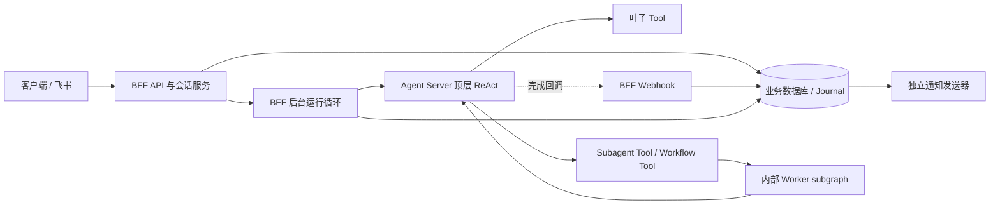

# Stage 8 Hotfix：BFF 运行控制与内部 Worker

状态：当前实施基线；未正式上线，按当前架构初始化数据库。

## 架构与执行路径

BFF 拥有根运行的 start、人工 resume、cancel、有限授权和最终 Journal 写入。Agent Server 拥有实际执行、原生队列、Thread、Run、Checkpoint 和 Store。所有领域 Agent 与 Workflow 都是顶层 ReAct 中的 Tool；整个业务轮次只有一个根执行，子图复用根身份与预算。

Webhook 保留在 BFF。它先认证并持久化最小唤醒线索，正文不能直接写聊天记录。BFF 后台循环独立核对原生尝试与 checkpoint，所以客户端断开或漏回调不影响最终答案落库。数据库租约、epoch、唤醒序号和固定 operation ID 负责多 BFF 实例的基本恢复。

## 当前实现

- HF-0：确认原生 Tool 内 subgraph、interrupt ID 和根 resume 行为。
- HF-1：发布根 `finance_agent@1.5.0`，内部市场研究 `1.3.0`、紫微 `2.1.0`、组合复盘 `1.1.0`；固定 manifest、权限、调用身份、输入输出和根预算。
- HF-2：BFF 原子受理与生命周期循环；交互回复、取消、授权、Webhook、只读查询/SSE；最终事实与 assistant Journal、审计、通知同事务提交。
- 清理：只保留上述当前发布与入口；数据库迁移合并为 `0001_initial`。移除独立协调服务、跨运行委托协议、旧发布目录、旧回调别名、迁移和退役命令。

## 固定约束

1. 产品只接受会话中的 message，不接受 Target、任意 checkpoint、state update 或 goto。
2. `/tool`、`/agent`、`/workflow` 表达调用偏好，不能授予权限。
3. Worker 正常完成直接回到顶层循环；只有真实人工回答产生新的 native resume attempt。
4. 交互回复绑定 owner、revision、原生 interrupt、checkpoint、当前 attempt 与动作摘要，重复回答复用同一 operation。
5. 拒绝先保存用户意图，原生图重入后关闭根运行后续副作用，避免拦截处理拒绝本身。
6. 未知提交仅核对原 operation；空查询结果不允许换 ID 重发。
7. 最终答案必须对应当前 Turn 的最终 AI 文本，且当前 attempt 无中断、待执行节点或未完成 Tool call。
8. 应用层不引入 Temporal；后续能力在 BFF 运行控制及原生执行边界内增强。

## 数据与部署

当前 schema 使用 `root_runs`、`run_inbox`，保留执行快照、授权、操作回执、interaction、Journal 和通知等业务事实。`run_executions` 强制 `root_run_id = run_id`。无需未发布 schema 的升级兼容；开发环境使用新空库运行迁移，本次清理不修改本机已有数据库。

启动、门闩和异常处理见 [BFF 运维](../../docs/operations/bff-run-control.md)，通知见 [通知运维](../../docs/operations/notifications.md)，边界见 [包结构](../../docs/architecture/package-layout.md)。
