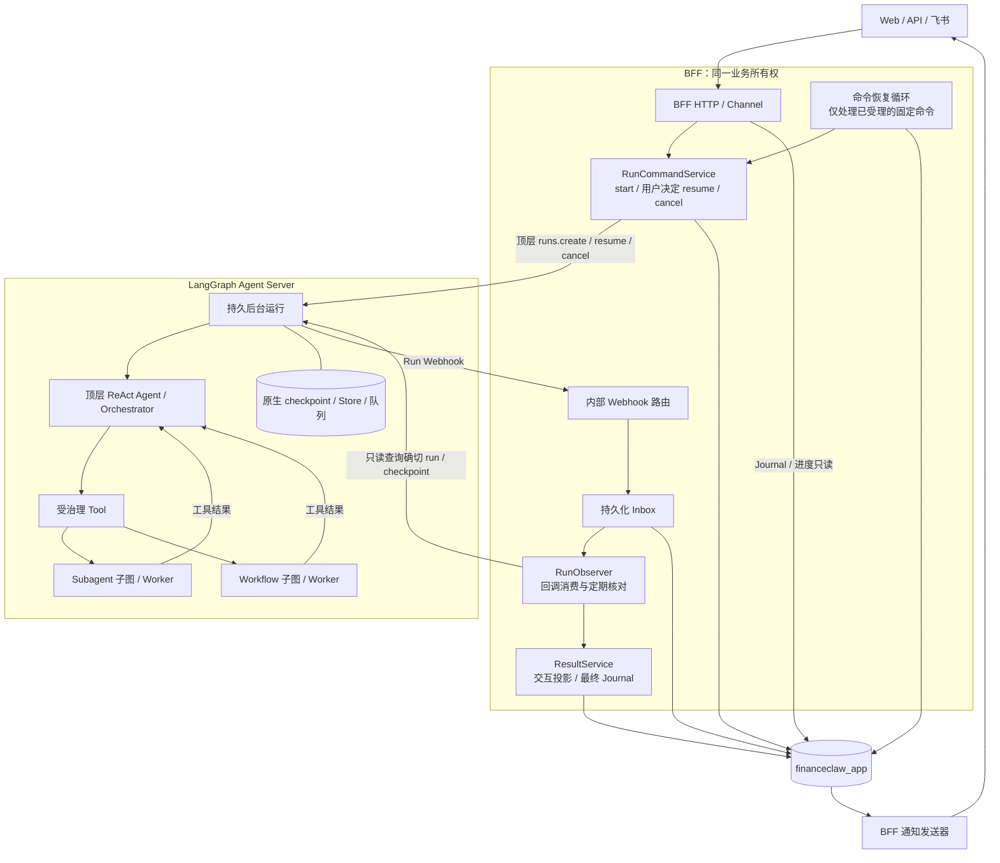
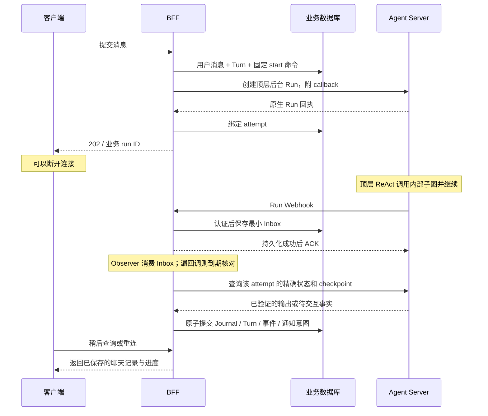

# Stage 8 Hotfix：BFF 运行控制与顶层 ReAct 内的子图调用

日期：2026-09-09。代码基线：`003ae4a`（Stage 8C）。

状态：**HF-0 原生调用验证已完成；HF-1／HF-2／HF-3 的生产路径调整待实施。**
取消跨顶层 ReAct 的委托、运行控制归还 BFF 的方向已由用户明确。
HF-0 的原生调用契约、发布预留及证据见[实施与验证](./stage-8-hotfix-HF-0-实施与验证.md)。
Webhook 的保留方式、内部模块落点和分步迁移采用本文建议。既有 8A／8B／8C 验证记录是旧架构的历史证据，不代表本 hotfix 已验收。

## 1. 调整结论

1. **取消应用层 Delegation 机制。** 顶层 Agent 不再发出 handoff，BFF／Coordinator 不再创建独立 child thread/run，也不再把 child result 作为父运行的 resume 输入。
2. **BFF 拥有顶层运行的 start、用户交互 resume、cancel、授权和最终聊天记录提交。** Agent Server 仍负责后台执行、原生队列、checkpoint 和恢复后的图执行。
3. **所有 subagent 和 workflow 以 Tool 进入顶层 ReAct。** 顶层 Agent 是 Orchestrator，子 Agent／确定性 Workflow 是 Worker；Tool 在同一 Agent Server 图执行中调用已编译子图，等待结果后返回 ToolMessage，再由顶层 Agent 决定下一步。
4. **建议保留 Webhook 接收能力，合并到 BFF 内部路由；退出独立 Coordinator Service。** Webhook 触发结果观察，BFF 负责核对与提交 Journal。保留一个 BFF 所有的轻量持久化补偿循环，处理漏回调和进程重启。
5. 继续使用同一个业务数据库 `financeclaw_app` 和一条 Alembic 链。不引入 Temporal，不建设新的父子任务调度器，不在本 hotfix 开放跨 backend 子任务。

这里的 Orchestrator 是顶层 Agent，Worker 是被工具调用的子图；它们不是新的微服务，也不是现有 Coordinator Worker 的新名字。
子图采用调用方等待结果的语义，实现可以使用 Python `await`，无需同步阻塞线程，也不要求浏览器持续在线。

## 2. 当前实现为什么需要改变

当前 `agent_server/tools/delegation.py` 已把 Agent／Workflow 包成 Tool，但该 Tool 的核心动作是 `interrupt(handoff)`。
随后 `coordination/application/transitions.py` 创建业务 child，Coordinator 再经 Agent Server HTTP 创建子运行、观察结果并恢复父运行。
因此“模型看到 Tool”并不意味着“执行仍在父图内”。

| 当前落点／事实 | Hotfix 调整 |
|---|---|
| `agent_server/tools/delegation.py`：HandoffRequest → interrupt → DelegationResult | 原生子图调用 → 有界工具结果，不生成委托中断 |
| `coordination/bootstrap.py`：BFF 总是装配 CoordinatorAdmission | BFF 装配自己的运行命令、交互和结果服务 |
| `coordination/application/coordinator.py`、`transitions.py`：首次启动、child 派发、parent 恢复 | BFF 只提交顶层命令；子图执行与返回交给 LangGraph |
| `coordination/ingress/app.py`：通知写入 Inbox、依赖 Coordinator 心跳 | 路由迁入 BFF，持久化接收；就绪诊断不再要求 Coordinator |
| `shared/conversation/repository.py:append_assistant_message()`：已有幂等完成事务 | 继续复用，由 BFF ResultService 作为应用写入入口 |
| `shared/execution_ledger/driver.py`：旧驱动被 8C 门闩封闭 | 新增明确的 BFF 驱动版本，不能通过恢复 legacy 绕开隔离 |
| `bff/notifications/`：独立通知发送、固定目标及回执 | 保留；消费 BFF 提交的完成／待交互事件 |

本 hotfix 也替代 Stage 4／Stage 6 Fix 中面向新运行的外部 child/handoff 设计。
治理、人工审批、永久聊天记录、制品、发布冻结、预算、审计、通知幂等和 GET／SSE 不驱动执行的约束继续有效。

## 3. 目标架构与职责



初期部署为 **BFF＋Agent Server＋已有通知发送器**。BFF 内运行有界的命令恢复和观察循环；多副本用数据库领取与幂等提交避免竞争。
这两个循环可共用生命周期管理，但必须分开权限接口：Observer 只能读 backend、写业务投影，不能调用 start/resume/cancel。
以后确有独立扩容需求，可以把 BFF 的后台循环作为同一 BFF 应用的进程部署；不因此恢复 Coordinator 的业务编排职责。

| 职责 | 唯一业务拥有者 | 边界 |
|---|---|---|
| 接受消息、冻结发布与身份、创建顶层运行 | BFF RunCommandService | 不执行模型，不等待整轮回答 |
| 选择 Tool、组合子图结果、生成最终回答 | 顶层 Agent | BFF 不替模型路由子图 |
| 子图执行、内部节点推进、checkpoint | Agent Server / LangGraph | 不经 BFF 创建业务 child |
| 校验用户回答／审批并提交顶层 resume | BFF InteractionService＋RunCommandService | 不把子图正常完成当作需要外部 resume 的事件 |
| 工具权限、具体副作用、根预算检查 | Agent Server 既有治理中间件／领域工具 | 不能因工具包住子图而扩大授权 |
| 回调鉴权、Inbox、漏回调核对 | BFF Webhook 路由＋RunObserver | 回调是观察线索，不直接写助手回复 |
| Turn 终态、助手 Journal、业务事件 | BFF ResultService | 唯一完成入口，不依赖 SSE 消费者 |
| 飞书消息发送／回执／重试 | BFF Notification Worker | 发送失败不重新运行 Agent |

`bff`、`coordination`、`agent_server` 的现有分包可以分步收敛。目标中 `coordination` 只保留确有复用价值的 backend 适配／协议工具代码；它不再拥有运行服务、独立进程或业务写入职责。
若最终只被 BFF 使用，后续可以移入 BFF；本次不以大规模机械搬迁阻塞功能修复，也不为保留三个“大包”而保留错误职责。

## 4. Subagent／Workflow Tool 的实现

### 4.1 调用与返回

以现有 `market_research_agent`、`ziwei_doushu_agent` 和 `portfolio_review` 为首批迁移对象，统一满足：

```text
顶层模型产生 tool_call
  → Tool Governance 校验已发布工具及输入
  → 准备该次调用的受限上下文
  → await 已编译的 subagent / workflow 子图
  → 提取子图公开输出，生成匹配原 tool_call_id 的 ToolMessage
  → 顶层模型继续 ReAct，最终生成面向用户的回答
```

这与 LangChain 的 [Subagents 模式](https://docs.langchain.com/oss/python/langchain/multi-agent/subagents)一致：主 Agent 通过工具调用专门 Agent，并使用其结果继续决策。
Workflow 使用同一调用边界，内部仍是已发布的确定性 StateGraph，不额外套一个负责路由的 LLM。

实施规则：

- 新增 `agent_server/tools/subgraphs.py`，按发布声明构造 `SubagentTool`／`WorkflowTool`。复用现有 ToolCatalog 和 AgentFactory，不新增通用运行时或动态插件注册体系。
- 图和 Tool 在 Agent Server 装配期绑定；BFF 只加载静态发布声明。不得在每次 Tool 调用中重新初始化应用资源、数据库或整套 AgentFactory。
- 内部调用禁止 `threads.create()`、`runs.create()`、`RemoteGraph` 和跨服务结果回填。LangSmith 的嵌套 span、LangGraph 的内部 task／namespace 可以存在，它们不等于业务 child Run。
- 业务上每个 Turn 只有一个顶层 root。没有人工中断时，调用多个子图仍只有一次顶层 start；有人工中断时，resume 可产生新的顶层原生 Run attempt，但仍属于同一个业务 root／thread。
- Tool 只返回当前调用的公开结果，不返回全部子图 messages、内部推理、checkpoint 或其他用户上下文。原 ToolMessage 的 call ID 必须保留。
- 保留领域输出契约：Workflow 的结构化结果和 Artifact 引用、紫微已热修复的文本输出均按现有产品语义返回；不重新强制紫微解读为复杂 JSON。
- 子图业务错误转成有界的工具错误，由顶层 Agent处理；授权撤销、取消、预算耗尽不能被包装成可继续的普通错误。原生 interrupt 必须传播，不能被重试或异常兜底吞掉。
- 所有供顶层使用的 subagent／workflow 都采用此方式。新产品路径不再有“某些 Workflow 仍由 BFF 独立启动”的例外。

### 4.2 原生持久化与人工交互

根图使用 Agent Server 提供的持久化能力；子图默认 `checkpointer=None`，继承父调用的持久化语义，采用每次调用独立状态。
不要把 `None` 当成禁用持久化，也不要为 Tool 内每次调用创建 InMemorySaver 或新 thread。这里不启用跨调用持续记忆的 `checkpointer=True` 模式。
LangGraph 对这些模式及状态可见性有明确区分，见 [Subgraphs](https://docs.langchain.com/oss/python/langgraph/use-subgraphs)。

子图需要资料或审批时，继续使用原生 `interrupt`，中断整个顶层调用链：

```text
Workflow 审批节点 / Subagent 提问工具
  → 原生 interrupt 向顶层传播
  → BFF 观察到顶层 pending interrupt，登记同一 Turn 下的交互
  → 用户通过 BFF 回答／审批
  → BFF 向原顶层 thread 提交匹配该 interrupt 的 Command(resume=...)
  → LangGraph 恢复子图等待位置
  → 子图返回工具结果，顶层 ReAct 继续
```

这保留的是**用户交互中断**，不再存在“为了启动子 Agent 而中断”的委托协议。

需要特别处理：

1. 普通 Tool 函数内的子图不一定能被 `get_state(subgraphs=True)` 静态发现；中断可向顶层传播，不代表 BFF 一定能读取所有嵌套 state。以顶层可见的原生 interrupt ID 和经过验证的交互载荷建立绑定，不依赖遍历不可见子图。
2. 交互载荷包含代码绑定的 `tool_call_id`、发布目标／版本、point ID、类型及具体审批动作。BFF 用根发布快照内的子图声明复验；模型只提供允许的业务参数，不能提供权限、身份、callback URL 或恢复位置。
3. 保存顶层 thread、原 attempt、checkpoint、interrupt ID、交互版本、响应 schema 和 action hash。恢复只发送允许的 resume 数据，不接受任意 `goto`、state update 或客户端指定 checkpoint。HF-0 已确认连续子图提问可能复用父 checkpoint，metadata 仍指向早期 attempt；必须联合当前 Run 回执、前驱／命令绑定与新 interrupt 核对，不能只按父 checkpoint ID／metadata 判断当前交互。
4. 同一回答重放只产生一个 resume operation；迟到回答、过期审批、动作变化和不匹配的 interrupt 均不能恢复新位置。超时和截止时间按首次交互固定，节点重入不延期。
5. 子图内 HITL middleware、显式 Workflow 审批以及资料工具全部纳入探针；如果当前版本暴露的顶层信息不足，先修正执行端交互载荷／原生图接线，不能退回外部 child 委托。
6. 恢复时节点可能从开头重入。副作用放在审批后的独立节点并保留业务幂等键，不能认为 checkpoint 会使任意 Python 语句只执行一次。参见 [Interrupts](https://docs.langchain.com/oss/python/langgraph/interrupts)。

Hotfix 默认保留“同一时刻一个待用户交互”的产品约束：可能中断的复合工具独占批次。
现有独立只读叶子工具并行保留；并行多个可能提问的子图不在本次开放范围。

### 4.3 上下文、发布、预算与资源锁

直接把 `DelegationTool._run()` 替换成 `subgraph.invoke()` 不足以完成迁移，以下调用假设必须一起调整：

| 现有依赖 | 新规则 |
|---|---|
| ExecutionBudgetMiddleware 用 `context.run_id` 的 execution snapshot 校验 Agent profile | root 保留唯一业务 run ID；通过受信任的调用范围识别子图发布，校验根快照中的固定子图清单，不能拿根 profile 与子 profile 比较，也不能跳过校验 |
| 紫微 `verify_execution()` 直接验证 child execution snapshot | 改为同一调用范围校验，保留密级、scope、版本与领域预检 |
| ConversationContextMiddleware 遇到 conversation ID 自动读取会话历史 | Worker 默认只收到任务、schema 参数和已授权 context_refs；仍保留会话身份用于审计，但不自动注入整份父会话或执行顶层 `/agent`／`/workflow` 指令 |
| 委托上下文服务在 Coordinator 中解析引用 | 抽取必要的引用授权逻辑，供执行端子图入口使用；引用须验证租户、主体、制品归属与发布允许范围 |
| 独立 child 执行账本扣根预算 | 所有实际模型／叶子工具调用累计扣同一 root 预算，子图可有更小局部上限，resume／重试不重置；新调用范围不是另一个可调度的业务 Run |
| 父 Tool 和子 Tool 共用 Factory 的 BoundedSemaphore | 复合工具等待子图时不持有叶子 I/O 槽位；仅实际叶子 I/O 获取该资源门，防止外层占满后子层永久等待 |
| side effect 分类中把 delegation 当独立类别 | 复合工具声明内部可能的副作用／交互，不能默认归类为 READ；每个实际叶子动作仍单独治理与审批 |

调用范围建议只增加必要字段：根身份、原 tool_call_id、固定目标版本、允许 scopes／refs 和局部限额。
它由运行时构造并与当前调用校验，可随原生 state 持久化；不包含 child lease、child thread、派发状态或结果交付状态。
根授权或取消状态仍通过共享账本检查；子图不得因为移到进程内部而获得新的授权时长。

发布时创建新的顶层 Agent／Tool release 和原生 graph ID，冻结完整子图版本清单。
不得原地替换 `finance_agent_v1_4_0` 所代表的旧图，或让已创建会话静默解析新的 latest；版本切换见第 8 节。

## 5. BFF 如何接回 start／resume／cancel

### 5.1 首次启动与提交可靠性

1. BFF 完成认证、对象归属、单活动 Turn 检查，冻结顶层及其子图发布、输入、上下文、根预算和授权。
2. 在同一个业务事务内提交用户 Journal、Turn、执行快照、固定 start operation 和待提交记录。
3. 事务提交后，由 BFF RunCommandService 立即尝试调用 Agent Server 的后台 `runs.create()`，只等待受理回执，不等待整个 ReAct 完成。
4. 持久化返回的原生 thread／run 与 operation 的映射；HTTP 返回业务 run ID 和受理／运行状态。202 仅说明 BFF 已可靠受理，客户端断开不撤销已提交命令。
5. 若进程在第 2 步后退出，BFF 的命令恢复循环读取原命令，调用同一个提交入口。它只恢复已经受理的 start／用户 resume／cancel，不从 Graph 状态生成子任务或业务决定。

这一方案保留短事务和固定操作日志，不把进程内 `BackgroundTasks`／`asyncio.create_task()` 当作持久队列。
Agent Server 后台创建接口与等待结果分离，参见 [Background runs](https://docs.langchain.com/langsmith/background-run)。

远端请求在数据库事务外执行；多 BFF 副本通过原 operation 的唯一领取保护提交：

| 提交事实 | 恢复规则 |
|---|---|
| 已准备、确认尚未发送 | 可领取并发送原命令，参数和 operation ID 不变 |
| 远端已受理、回执已绑定 | 只观察该 attempt，不重发 |
| 超时、连接中断、发送中进程崩溃，无法确认是否受理 | 标记 uncertain，按原 thread＋operation metadata 精确查回执 |
| 查找为空、后端不可用或结果有歧义 | 保持可见的待核对状态；查询为空本身不是安全重发证明 |
| 原生幂等能力未被目标版本实验证明 | 不宣称 exactly-once，不使用新 ID 重试未知提交 |

复用 8A 已有“租约到期不重置命令发送事实”的保护。旧发送者是否已停止无法确认时，接管者只能查询；不能靠超时把 uncertain 重新变成 prepared。
BFF 定期扫描受理队列，确保“已写用户消息但尚未启动”的状态可发现、可恢复，不留下无责任的 Turn。

### 5.2 恢复、撤销与取消

- 用户决定由 BFF 验证，并将回答／审批、原交互版本、固定 resume operation、当次授权和审计事实同事务保存；随后提交原顶层 thread 的 resume。
- 每次 resume 是一个新的原生 attempt，必须再次携带固定回调地址和 operation metadata。一个顶层业务 Run 可以对应多次 attempt。
- 资料回答不会生成第二个 Turn；旧子图问题和新的问题必须通过 interrupt ID／交互版本区分。
- 取消由 BFF 写入根取消意图，停止新 start／resume，再取消精确活动 attempt；Agent Server 的子图／工具检查同一根取消事实。HTTP 断开不是取消指令。
- 不把“cancel 请求已发送”当作“所有工作已停止”；已产生的外部副作用不被自动撤销，必须核对后提交 cancelled。失败或取消后的下一轮避免继续残留待执行 checkpoint，必要时换新原生 thread 并从 Journal 重建上下文。
- 已被授权撤销或预算耗尽的根仍可以接收完成观察、保存已产生的结果事实；不能因此自动恢复执行或扩大授权。

### 5.3 产品 API

| 入口 | Hotfix 后行为 |
|---|---|
| `POST /v1/conversations/{conversation_id}/turns` | 由 BFF 创建默认顶层 Agent 运行；保持 message-only 和幂等键 |
| 现有 interaction response／`POST /v1/runs/{run_id}/resume` | BFF 校验后恢复顶层原等待点；统一根身份 |
| `POST /v1/runs/{run_id}/cancel`、authorization 入口 | 由 BFF 实施原主体的取消／授权变更 |
| GET 会话、messages、run status | 读 Journal／持久化投影；不 start、不 resume、不补建任务 |
| SSE | 可订阅已存在的原生 Run 获取实时输出，并读取 BFF 持久事件；断线重连不创建或恢复 Run |
| `/agent`、`/workflow` 消息指令 | 仍进入顶层 Agent，限制本轮可用工具／参数，不绕过 ReAct |
| 独立 Workflow／subagent 的 HTTP 创建路径 | 新运行不再开放，包括内部业务 Target 绕行；旧对象保留按归属查询，旧写接口明确返回不可用／冲突 |

SSE 中的 token 属于暂态展示；持久完成事件从 BFF 的结果事务发出。
恢复游标继续使用已有进度 revision；如果 token 本身未持久化，不承诺逐 token 重放，重连后从 Journal 和持久进度恢复完整结果。

## 6. Webhook Ingress 是否保留

### 6.1 判断：保留能力，归入 BFF

**用户断线后结果仍需写入聊天记录，因此必须保留独立于客户端连接的结果收尾机制。Webhook 是推荐的唤醒方式，但不是唯一可行方式，也不是执行能继续的原因。**

| 选择 | 能否完成离线结果落库 | 本次决定 |
|---|---|---|
| 仅在前端 SSE 结束后保存回答 | 客户端断开或 BFF 重启时可能漏写 | 不采用 |
| BFF 持久化定期查询，无 Webhook | 可以，前提是主动后台对账一直存在；延迟和查询量较高 | 保留为降级路径 |
| BFF Webhook＋持久化观察补偿 | 回调及时唤醒，丢失后仍可核对并完成 | **采用** |
| 独立 Coordinator Ingress＋跨 Run Worker | 对内部子图没有必要，重新扩大编排边界 | 退出新架构 |

需要区分三个问题：

- **浏览器／飞书展示连接断开：** 顶层运行已经通过后台 API 受理，继续由 Agent Server 执行；BFF 自己接收回调并写 Journal。
- **BFF 到 Agent Server 的连接断开：** 观察流与执行分离；若使用创建并流式输出接口，应明确 `on_disconnect="continue"`。如果断开发生在提交回执之前，按第 5 节处理 uncertain，不能仅等待一个尚未绑定的回调。
- **BFF 或 Agent Server 进程重启：** BFF 从持久命令／Inbox／未终态清单恢复；Agent Server 的恢复依赖其生产持久运行时。Webhook 不替代原生队列和 checkpoint，也不保证任意崩溃点的外部副作用只执行一次。

`on_disconnect` 是流式创建接口的选项，当前本机 SDK 的 `runs.create()` 没有这个参数；不能把它机械地加到后台创建调用中。
API 对该参数的定义见 [Create Run, Stream Output](https://docs.langchain.com/langsmith/agent-server-api/thread-runs/create-run-stream-output)。

### 6.2 回调到聊天记录的链路



Ingress 路由建议为 `POST /internal/webhooks/langgraph/{backend_instance_id}`，属于 BFF 内部路由组：

1. 固定受信任的 backend 实例与认证头，限制 body 大小；复用现有 64 KiB 限制与接收字段最小化。URL 由部署配置提供，不能由用户或模型传入。
2. 只保存 backend、原生 run／thread、状态提示、接收时间、摘要和待关联信息；不把原始 kwargs、完整 messages 或密钥写入 Inbox／日志。
3. 先持久化再 ACK，数据库失败返回失败；重复通知可幂等 ACK。回调先于 start 回执绑定时保留最小未关联记录，绑定后处理；清理前确保未终态根仍有独立核对责任。
4. Observer 根据本地映射查询确切 attempt。身份、租户、会话归属来自 BFF 已受理事实，不能由回调中的 metadata 决定。
5. 原回调地址在过渡期保留受认证别名或网关转发，直到旧运行和已知回调重试窗口排空；不要求 backend 改变已提交 Run 的 webhook URL。

官方 [Run Webhook 文档](https://docs.langchain.com/langsmith/use-webhooks)说明了回调及静态认证头配置。
仓库对 `langgraph-api 0.13.3` 的已有实测还发现：人工 interrupt 也会收到 `success`，回调重试次数有限，出站字段白名单配置存在该版本兼容问题。
这些是[旧版实测事实](./Stage-8-实施与验证.md#4-langgraph-部署能力矩阵)，不能推广为所有版本的保证；hotfix 仍须在目标部署复测。

### 6.3 什么情况下可以写最终助手消息

由同一个 BFF ResultService 实施，不允许 Webhook、SSE 和定时器各自写一份：

- 观察必须属于当前业务 root 的确切 attempt；核对原生 metadata／checkpoint 归属，不能读取 thread 的最新值后假定属于旧回调。
- `success`、流结束、单个子图完成、最后看到一段 assistant token，都不足以完成 Turn。先排除 pending interrupt、待运行节点、错误、取消和未核对的提交。
- 只提取**顶层图**本轮最终输出；不能取子图的最后 AIMessage、仍带 tool_calls 的 AIMessage，或上一轮 thread 历史消息。按新发布声明确定结果位置及提取规则。
- 同一事务内完成：助手 Journal 幂等追加、Turn 终态、根活动位置释放、attempt／进度投影、业务事件及通知意图。重复回调／定时器／两个 BFF 副本竞争只保留一份结果；内容冲突进入可见核对状态。
- 观察到人工中断时提交交互及待处理通知，不写最终助手回答，不释放活动 Turn。
- 错误／取消保存真实终态和必要展示事件，不把半段模型输出伪装成成功回答；摘要、制品传输或通知失败只重试相应阶段，不重跑模型。

最低补偿能力是扫描所有“已受理但未终态／尚未完成投影”的根，覆盖 queued、submitted、uncertain、running、interrupted 和 cancellation_requested。
采用有界批次、租约、退避与最大查询频率；等待用户时降低频率但仍检查过期和取消。回调只缩短下一次观察时间，不承担唯一唤醒责任。
必须记录待提交数量、最老待提交时间、最老未核对时间、Inbox 积压、unknown attempt、Journal 提交失败和通知积压；指标无需包含用户消息正文。

## 7. 代码与数据库调整清单

### 7.1 模块落点

| 模块 | 实施动作 |
|---|---|
| `bff/application/` | 新增或收敛 RunCommandService、InteractionService、RunObserver、ResultService；服务之间共享明确事务入口 |
| `bff/http/`、`bff/bootstrap.py` | 装配新服务、内部 webhook router 和有界后台循环；移除新运行对 CoordinatorAdmission／Coordinator 心跳的依赖 |
| `coordination/backends/` | 提取可复用的 LangGraph root start／resume／cancel／exact observation 适配；移除 DelegationRequest／ResponseDelivery 依赖，不整体搬入旧 Coordinator |
| `agent_server/tools/subgraphs.py`（新增） | Subagent／Workflow Tool；固定图绑定、调用上下文、结果映射 |
| `agent_server/bootstrap.py`、`graphs/server_graphs.py`、`agents/factory.py` | 先装配叶子能力和 Worker 图，再注册复合 Tool，最后构建顶层图；防止装配循环；明确 root／worker 模式 |
| `agent_server/middleware/`、`graphs/ziwei_agent.py`、`graphs/workflows/` | 修正子图发布校验、上下文隔离、根预算、资源锁、交互载荷和重入行为 |
| `shared/releases/`、`kernel/agents`／工具与交互类型 | 新发布版本、子图固定清单、最小调用范围；逐步移除 delegatable／handoff 作为新业务语义 |
| `coordination/delegation/`、`coordination/application/coordinator.py` 及委托 transitions | 新路径不再引用，旧根排空后删除运行入口及死代码 |
| `kernel/delegation/`、`kernel/coordination.py` | 委托／child delivery 契约退役；仍有用的根执行引用／用户交互类型保留并瘦身 |
| `bff/notifications/`、`shared/notifications/` | 继续复用；由新的 BFF 完成／交互事务生产同类业务事件 |
| `langgraph*.json`、环境模板、运维脚本 | 注册新顶层图版本，回调指向 BFF，删除正式部署对 Coordinator 的启动依赖；旧版本图仅为排空保留 |

只做必要的业务契约转换；不新增 Backend Task Protocol、多 backend Delegation 能力矩阵或第二套 Run 真相表。

### 7.2 存储保留与收敛

| 已有事实／表 | 新路径用途 |
|---|---|
| Conversation／Turn／Journal、Artifact、Audit／Outbox | 原样保留逻辑归属；BFF 拥有聊天记录完成事务 |
| `run_executions`、`run_operations`、`run_authorizations` | 顶层快照、固定命令、预算和授权；不再为每个子图创建可调度 execution |
| `coordinated_runs` | 迁移期复用为根进度／待观察责任，采用明确的新 driver_version；物理表名暂存，逻辑写入口改为 BFF，不保留父子推进算法 |
| `backend_attempts` | 只记录顶层 start／resume 的原生尝试 |
| `coordination_inbox` | 分型保存固定命令引用和回调；只允许 BFF 处理新模式记录 |
| `coordination_continuations`、Interaction／Approval | 仅保留人工交互绑定与决定；新路径不生成 child result delivery continuation |
| `run_progress_events`、通知目标／内容／回执 | 保留持久进度与可靠通知 |
| Delegation／旧 Workflow run、`legacy_adoptions` | 历史只读保留；不清空审计或把旧关系改写为内部子图 |
| `coordination_control`、`coordinator_heartbeats` | 过渡期保留旧驱动隔离事实；新 BFF 生命周期不依赖旧 Worker 心跳 |

在 `0011_stage8c` 之后新增前向迁移；不改写已发布 migration，不执行 8C downgrade。
优先复用既有表，补必要的新模式约束、命令到期索引和交互绑定字段。实施时根据实际 Schema 决定是否需要物理重命名；重命名不是完成标准。

新运行写入单独的 BFF 驱动模式及一个不属于旧 Worker 兼容集合 `{1,2,3}` 的版本。
所有领取和提交事务都验证驱动归属；旧 Worker、旧 BFF 与新 BFF 不能同时写同一个根。
`legacy_fenced=true` 保持原语义，新增 BFF 模式不得伪装为 legacy，也不得解除旧门闩；新模式的准入由前向迁移和新发布配置明确开启。

## 8. 已有运行、会话与发布切换

**不能把停在旧 handoff 的 checkpoint 直接换成新子图实现继续运行。** 旧图的工具调用栈、child 结果协议与新图不兼容。
本次选择“旧根排空／明确终止，再切新发布”，不再建设一套自动接管旧委托树的迁移引擎。

| 已有状态 | 处理方式 |
|---|---|
| 已完成／失败／取消 | 保留 Journal、账本和旧查询；不重新执行，不补发已经完成的通知 |
| 已受理但确认没有任何远端提交 | 优先让原发布完成，或经明确操作结束旧 Turn 后创建新的 Turn；不改原快照和幂等语义 |
| 正在执行／等待 child／child 已完成未回填 | 固定旧图和旧驱动完成排空；无法继续则走已有取消／人工处置，不能转换为内部子图 |
| 等待用户／审批 | 可通过旧模式受理合法回答直至终态；设置运营截止与处置清单，不能自动回答或自动批准 |
| uncertain／外部动作是否发生未知 | 保留原事实并先对账；没有足够证据时阻止该会话切换，不静默重启相同业务动作 |

推荐顺序：

1. 盘点实际部署、活动旧根、未投影终态、未确认命令、待交互和旧通知；区分未部署／纯测试环境与有真实活动任务的环境。
2. 暂停新消息受理，保留旧运行的观察、合法用户决定、取消、结果落库和通知，先排空旧根。不能先暂停所有 dispatch 再期待等待 child 的根自行完成。
3. 确认旧根和未知提交已清零或被明确终结后，停止旧 BFF 执行入口、Coordinator Worker 和自动重启来源；保留所需旧回调路由和历史查询。
4. 应用前向迁移，部署新图版本与 BFF 服务，通过新驱动隔离探针后开放新模式。没有活动数据的环境也执行 schema／版本检查，不删除账本来绕过门闩。
5. 对旧会话执行明确、可审计的发布迁移：只在无活动 Turn 时更新顶层发布绑定，分配新原生 thread，从已有 Journal／摘要重建下一轮上下文；保留旧 thread 与发布关联。新旧图不共享不兼容的 checkpoint。
6. 延迟／重复旧回调只能核对旧 attempt，不可写新 Turn；通知发送器继续按既有投递键处理旧待办。
7. 验收通过后删除委托生产入口、旧 Coordinator 启动配置和不再被调用的代码。历史 Schema 与记录按保留策略处理，不在 hotfix 中破坏性清空。

回滚也按运行模式处理：未开放新运行时可以回退应用；已经有新子图运行时，先暂停新准入，保留兼容的新 BFF／图完成或取消这些根，再回退。
不得把新模式根交给旧 Coordinator，也不得恢复旧图覆盖新图 ID。

## 9. 分阶段实施与验收

HF-0 已完成，证据见[HF-0 记录](./stage-8-hotfix-HF-0-实施与验证.md)。HF-1／HF-2／HF-3 仍为**待实施／待验证**，不能用原 333 项回归、89 项 PostgreSQL 专项或旧 8C 报告替代。

| 阶段 | 交付范围 | 完成条件 |
|---|---|---|
| HF-0：固定原生调用方式（已完成） | 用合成数据验证当前依赖的 Tool→subgraph、顶层 interrupt／resume、子图状态可见性和重入行为；冻结新发布与退出清单 | 本地图与 HTTP 各 9/9；一次顶层 start 完成两个串行子图，用户交互只增加顶层 resume，0 child HTTP thread/run |
| HF-1：执行端子图化 | 替换所有供顶层使用的 Agent／Workflow Tool，修正发布／上下文／预算／资源门和领域输出；新增图版本 | 市场研究、组合复盘审批和紫微现有契约通过；授权与预算不回退 |
| HF-2：BFF 控制与结果闭环 | BFF start／resume／cancel、固定命令恢复、Webhook、观察补偿、唯一 Journal 完成事务；前向迁移和新驱动模式 | 无 Coordinator 进程、无客户端观察，也能执行并写入聊天记录；通知复用成功 |
| HF-3：切换与清理 | 旧根排空、会话发布／thread 迁移、回调兼容、死代码与环境配置清理、运维说明 | 新产品路径零 Delegation／child delivery 依赖；实际部署切换和回滚步骤有证据 |

HF-1 和 HF-2 可以分别开发，但必须作为兼容组合开放；不能先把旧 handoff 工具接到不认识委托的新 BFF。

### 9.1 必须新增或调整的验证

| 场景 | 核心断言 |
|---|---|
| 顶层→Agent Tool→Workflow Tool→最终回答 | 一个业务 root；没有独立 child thread／run；工具结果先回顶层，Journal 只记录最终回答 |
| 子图用户提问、HITL 工具审批、Workflow approve／reject | BFF 只恢复原顶层 thread／interrupt；重复／迟到／改参回答不会恢复错误位置；拒绝后不执行原副作用 |
| 同一个子图连续调用两次，第二次中断再恢复 | 子图调用状态隔离、tool_call_id 不串用；不重复完成第一次调用，不串用问题／deadline |
| 恢复前后 Agent Server 重启 | 在目标持久运行时恢复原 checkpoint；无重复业务副作用；内存模式单测不作为此项证据 |
| 复合工具嵌套资源门，叶子并发上限设为 1 | 能完成；复合调用不会占住槽位等待子工具获得同一槽位 |
| root 和子图发布不同、scope／ref 越权、授权撤销、预算耗尽 | 正确绑定各自固定发布，全部模型／工具共享根限额，Worker 不继承整份父会话 |
| 提交前后断线、202 后退出、SSE 中途断开 | BFF 命令可恢复、Agent Server 继续，最终 Journal 无需再次 GET 才出现 |
| Agent Server 接受 start／resume，但 BFF 丢回执 | 按原 operation 找回；无重复原生提交；无法证实时保留 uncertain |
| 回调缺失、重复、乱序、早于绑定、BFF 临时不可用 | 定期核对可完成；旧 attempt 回调不回退状态、不写错 Turn |
| interrupt 回调的 status 为 success | 保存待交互，不提前落最终回答 |
| 原生结果只有子图完成／待 tool_calls／缺少有效最终输出 | 不写假最终结果；存在可诊断状态 |
| 两个 BFF 副本与 Webhook／定时核对同时完成 | 恰好一个助手 Journal 和一份对应通知意图；冲突可见 |
| 完成与取消竞争、飞书发送失败、摘要失败 | Turn 遵循同一状态约束；只补偿失败阶段，不重复执行模型 |
| 旧驱动、新驱动、旧回调和旧会话切换 | 同根唯一写入方；旧 handoff 不被新图加载；迁移不改变历史消息／授权事实 |
| GET／SSE 多次连接 | 对 backend start／resume／cancel 调用计数保持不变；读取不创建新任务 |

分层执行：纯图测试覆盖调用语义；PostgreSQL 多进程覆盖事务与竞争；真实 Agent Server HTTP 覆盖回调／精确 attempt／断连；目标持久运行时覆盖服务重启。
飞书真实发送只验投递链路，不以真实消息测试代替内部运行架构验收。

### 9.2 完成时必须可回答的问题

- 停掉 Coordinator Worker，新模式的消息是否仍由 BFF 启动、恢复并最终落库？
- 所有 subagent／workflow 是否都在顶层调用链内完成，数据库是否不再生成新的 Delegation／child execution？
- 关闭前端、丢掉全部 Webhook 后，结果是否仍会被 BFF 主动写入 Journal？
- 用户是否仍能在子图中补充资料／批准具体动作，且恢复准确、预算不重置、副作用不重复？
- 旧图、旧会话、旧回调是否被明确隔离，且不存在通过切回 legacy 解除安全约束的路径？

## 10. 设计依据与本次交付范围

方案初稿完成代码链路审阅和官方文档核对；随后 HF-0 已交付隔离原生图／HTTP 探针、回归与发布预留。
生产运行代码、业务数据库和已部署服务尚未切换；HF-0 的原生行为结论不替代 HF-1～HF-3 验收。
本机读取到的依赖为 LangChain `1.3.18`、LangGraph `1.2.11`、SDK `0.4.4`、Agent Server API `0.13.3`、runtime-inmem `0.33.3`、checkpoint `4.2.0`。
核对日期为 2026-09-09；框架在线文档可能领先于当前环境，因此 HF-0 是必要的版本行为验证，不能直接从示例推断生产恢复能力。

决议记录见 [RD-033：顶层 ReAct 内部子图与 BFF 运行控制](../01-架构决议汇总.md#rd-033顶层-react-内部子图与-bff-运行控制)。
原 [Stage 8 方案](./Stage-8-Background-Run-Coordination-实施方案.md)和 8A／8B／8C 记录保留供追溯；与本文冲突的新实施方向以本 hotfix 为准。
