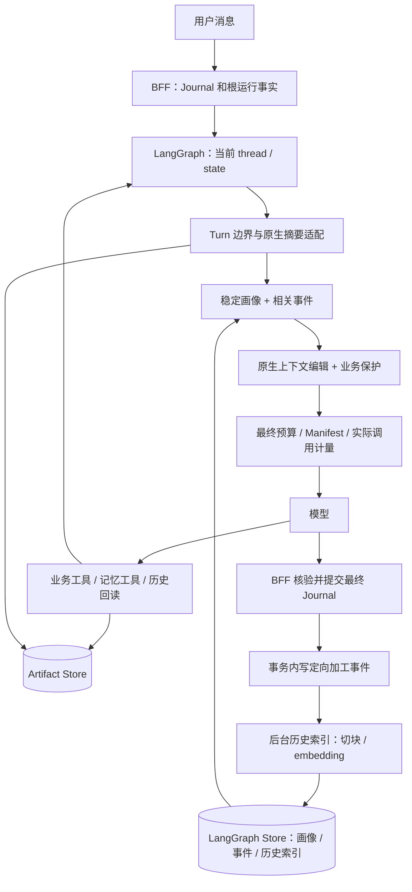

**Stage 9：上下文与记忆机制优化实施方案**

状态：实施设计稿 v0.3，2026-09-11。用户已确认近期上下文采用原生 state；明确表达的低风险偏好自动保存，高影响信息仍确认，模型推断不得直接成为有效画像。画像直接使用 Store，不新增版本指针表或多会话修改协调协议。本次确认：事件记忆按用户 Turn 初始召回并复用，历史按需搜索；Stage 9 不实现自动后台候选提取；工具结果由平台提供统一归档与回读规则，外部 MCP/Skill 声明不是接入前提。本文是待实施契约，不代表功能已落地。

依据：[记忆与上下文架构评估](/Users/hebinghui/PycharmProjects/FinanceClaw/docs/architecture/memory-assessment-2026-09-10.md)、[Stage 8 Hotfix](/Users/hebinghui/PycharmProjects/FinanceClaw/.redesign/stages/stage-8-hotfix-实施方案.md)。当前可验证基线是 LangChain 1.3.18、LangGraph 1.2.11、Agent Server 0.13.3；实施时固定通过探针的版本，不以在线 latest 文档代替已安装接口契约。

项目尚未发布：允许直接替换旧策略、工具接口和未发布 schema，不维护旧新两套生产链路。数据库初始化、Store 索引和开发数据重建分别提供明确命令；编写方案及修改初始迁移不等于自动删除本机数据。

**一、目标与范围**

Stage 9 完成后，系统应做到：

1. 模型从 LangGraph state 获得近期对话、近期工具结果和工作摘要；正常模型循环不再全量读取 Journal 重建历史。
2. 稳定画像确定读取，相关事件按用户 Turn 初始语义召回并复用；语言、表达方式和必要约束不会被普通事件的 top-k 挤掉，工具循环不重复查询 embedding。
3. 复用原生摘要、上下文编辑、Store 检索及持久化能力；自定义代码只处理 Turn 边界、业务优先级、证据与生命周期。
4. 当前用户消息、澄清、审批和结构化结果得到保护；压缩不能破坏 BFF 完成证明或 Worker 恢复。
5. 历史原文与工具明细在保留期内可以通过引用按需回读；大结果立即外置，小结果在清理前确保已有归档，不依赖外部工具声明。取消/失败切换 thread 后能够恢复已完成历史。
6. 工作 state 的压缩、旧 checkpoint 的保留、长期记忆的撤销/删除分别有完整语义。

本阶段不新增通用记忆数据库、向量引擎、事件总线、Temporal 编排器或另一套 Agent 执行框架，也不实现自动后台画像候选提取及配套展示流程。不因为使用摘要功能而整体迁移到 Deep Agents；LangChain/LangGraph 已有组件足够作为基础。

**二、已确定的架构决议与待讨论项**

| 编号 | 决议 | 状态 |
|---|---|---|
| D1 | 原生 state 是活动 thread 的近期工作上下文；Journal 是业务账本和按需历史来源 | 用户已确认 |
| D2 | 明确、持续性的低风险偏好可自动保存；高影响画像需一次原生 HITL 确认；推断只形成候选 | 用户已确认 |
| D3 | 当前 Turn 全部保留在执行 state 中；通过动态 keep 复用原生摘要压缩旧 Turn | 推荐实施；S9-0 验证 |
| D4 | 画像采用有类型的字段，不让 top-k 检索决定当前画像；正文仍存原生 Store | 推荐实施 |
| D5 | 画像直接按字段读写原生 Store；不建设多会话同时修改画像的协调机制，不新增 memory_heads 表 | 根据用户反馈确定 |
| D6 | 历史索引采用完成 Turn 的确定性切块与 Store embedding，不再生成一套层级语义摘要 | 推荐实施 |
| D7 | 显式记忆变更在当前根内完成；后台负责历史索引，不实现自动画像候选提取 | 用户已确认 |
| D8 | 删除未接通的 SummaryService、conversation_summaries 及旧 Journal 拼装策略 | 推荐实施，随替代路径一起交付 |
| D9 | embedding 服务和摘要模型通过独立配置选择；embedding provider/模型需在 S9-0 结束前确定 | 待确定具体模型，不影响接口设计 |
| D10 | 画像直接读取；事件记忆每个新用户 Turn 初始召回一次并在本轮复用；历史按需搜索 | 用户已确认 |
| D11 | 平台统一处理工具结果归档、清理与回读；MCP/Skill 无声明时采用默认规则，可信接入配置可补充规则 | 用户已确认 |

D3 比“先拆分两套执行消息状态，再任意压缩当前 Turn”更适合这一阶段：它复用已有 BFF 证明，只增加边界适配。若后续需要超长单 Turn 任务，再单独设计不可压缩的任务事实字段，而不是现在复制整个执行记录。

**三、目标架构与数据职责**



| 数据 | 权威来源与用途 | 模型读取方式 |
|---|---|---|
| 当前执行、工具调用/结果、工作摘要 | LangGraph state/checkpoint | 直接使用受控投影 |
| 用户及助手原文、Turn 状态 | Journal | 新 thread 初始化、明确历史搜索与回读 |
| 画像字段、事件正文及状态 | LangGraph Store | 画像按已注册字段 key 确定 get；事件按 Turn 初始 search、复验后复用 |
| 历史检索文档 | Store 的独立历史 namespace；可从 Journal 重建 | search_history |
| 大型工具结果、长文档、清理前归档的小结果 | Artifact Store，业务表保存来源与保留元数据 | read_artifact / Worker 显式 context_refs |
| 每次实际模型尝试的上下文证据 | model_context_manifests | 运维审计，不用于聊天记忆 |

Agent Server 已管理 checkpoint 和 Store，不额外构造一个业务 PostgresSaver 或自定义 Store 后端。[官方持久化说明](https://docs.langchain.com/oss/python/langgraph/persistence)

**四、近期上下文与原生压缩**

**4.1 删除双重历史组装**

移除 stage2-journal-v1 的正常调用路径以及 _current_runtime_suffix + Journal 原文/摘要/相关旧消息的拼装。新增单一根策略 native-thread-v1；Worker 保留 task-only 的职责范围。

原生 state 可以保留近期旧工具结果，但不保证所有旧明细永久驻留模型上下文。经过压缩的明细应以来源引用回读。删除旧策略与导出后不保留“临时兼容开关”。

**4.2 当前 Turn 边界**

以 BFF 冻结的 snapshot.user_message_id 为唯一当前用户锚点。内部接收时给消息附加可信 source、turn_id、Journal sequence 等来源元数据；公开 message API 不接受用户指定这些字段。

统一 BFF current_messages、Worker task_context、指令中间件和压缩适配对“当前 Turn”的解释。共享契约放 kernel/shared，LangChain 对象和 SDK 字典分别由服务内适配；不让 BFF 导入 Agent 执行模块。

工作摘要虽然在当前 LangChain 版本中使用 HumanMessage 表示，但 lc_source=summarization 不是真实用户输入。所有依赖用户身份、证据或斜杠指令的逻辑必须排除合成摘要/初始化资料。

**4.3 Turn-aware SummarizationMiddleware 适配**

采用组合而不是复制原生实现：

1. 根据当前用户 ID 和最近已完成 Turn，选出必须完整保留的消息后缀。
2. 用后缀的实际消息数构造 keep=("messages", protected_count)，向本次独立的原生 SummarizationMiddleware 传入公开参数。
3. 在应用会移除工具原文的压缩更新之前，按 4.4 确保对应结果已归档且可按 Turn 找回；原生组件负责生成摘要、保持 AI/Tool 消息配对，并通过 RemoveMessage 更新 state。
4. 适配层检查更新后的 state：当前用户 ID 唯一、受保护后缀完整、所有待处理工具调用和澄清仍可定位。不满足就拒绝应用该更新。
5. 摘要附加覆盖范围、摘要版本及来源信息；后续摘要覆盖之前的工作摘要，不再同时追加 Journal 原文。

实例的 keep 不能在并发请求间原地修改；每次构造轻量适配实例或使用无共享可变配置的工厂。禁止覆写 _find_safe_cutoff 等私有方法。

摘要输入设置 trim_tokens_to_summarize=None，并在模型入口检查摘要模型输入容量，避免默认截断摘要来源。摘要模型的窗口必须覆盖配置的压缩源上限；本阶段超出时返回可解释的压缩失败，不通过隐藏截断伪造完整摘要。

当没有可压缩的旧 Turn 时，跳过工作摘要；单 Turn 的体积依靠工具结果外置与单次请求的工具清理控制。如果必需内容仍超过模型硬上限，停止本次模型调用并给出有界错误/要求缩小输入，禁止清空用户原文。

摘要失败：若原始完整请求仍在硬上限内，可继续且记录降级；否则返回明确容量错误。有限重试消耗真实调用预算，不允许无界重试或制造假摘要。[原生摘要接口](https://reference.langchain.com/python/langchain/agents/middleware/summarization/SummarizationMiddleware)

**4.4 工具正文清理与 Artifact**

平台提供统一默认策略，不要求工具作者声明“可回读”或保留期限，也不调用模型判断结果是否值得保存。沿用 ToolResultArtifactMiddleware 与现有 ArtifactService，根据实际返回内容、大小和消息生命周期执行：

1. 小结果先保留在原生消息中，近期追问直接使用，不强制每次调用都创建工件。
2. 大结果在进入后续模型循环前归档，消息保留有界预览和 artifact 引用。
3. 旧结果将被摘要替换或正文清理时，先确保原文已有受平台保留规则管理的持久副本；没有则先归档。仅依赖未来可能被回收的旧 checkpoint 不算完成归档。
4. 归档成功后才应用清理；保存失败时保留原文并重新检查硬预算，仍超限则明确停止该次模型调用，不能丢弃正文后假称可回读。

归档结果保存 source_run_id、source_turn_id、tool_call_id、invocation_id、内容 hash 和适用的 provider/as_of。身份及调用来源由平台补齐；外部未提供的业务时间或来源标记未知，不伪造。使用稳定的调用来源和内容 hash 标识归档，恢复或重复清理复用已有副本。已完成 Turn 后才归档的结果也进入现有 artifacts 的 Turn 目录，不要求摘要保留全部工件 ID 才能找到原文。

外部能力统一接入结果处理通道：

- MCP：适配器保留实际收到的文本、结构化数据及内容块，统一交给归档层。只收到 resource link/URL 时，归档的是链接；只有实际取得并保存内容后，才承诺回读当时的内容快照。再次调用原工具不等同于回读。
- Skill：在受托管的工具调用、脚本执行结果和产物登记处接入，不解析 Skill 文档来猜测保留策略；没有进入这些通道的任意文件不被宣称已归档。
- 特殊规则：由平台可信接入配置补充，例如某类结构化回执需完整保留在当前上下文。没有声明的外部工具正常使用默认规则；外部自报元数据不能解除平台的业务保护或替代实际归档。MCP 标准工具注解不提供统一的结果持久回读保证。[MCP 工具注解](https://modelcontextprotocol.io/specification/2025-11-25/schema#toolannotations)

模型调用中组合 ContextEditingMiddleware 和 ClearToolUsesEdit：优先清理较旧结果，保留近期结果。动态 excludes 由平台业务保护规则及可信接入配置生成，不依赖外部作者标注。原生的工具名排除不足以表达逐条 preserve_structure 和 artifact 引用时，实现小型 ContextEdit 适配；归档 I/O 在应用清理之前完成，不复制整个 middleware。

当前澄清/审批回执、尚未处理的 Worker needs_clarification 结果和 preserve_structure 正文禁止被清理。默认不清空工具输入参数。Artifact 引用不能随着工具正文清理丢失；清理结果为可回读的简短说明。[原生上下文编辑组件](/Users/hebinghui/PycharmProjects/FinanceClaw/.venv/lib/python3.13/site-packages/langchain/agents/middleware/context_editing.py:60)

从模型上下文移除正文与删除归档是两件事。归档期限跟随平台会话/工件保留配置，不默认永久保存；到期或被明确删除后回读返回准确状态，不能悄悄重跑工具并冒充历史结果。生命周期与业务引用保护见第八节。

**4.5 执行顺序、预算和 Manifest**

before-model 阶段先运行需要真实最新回执的治理/澄清逻辑，再进行旧 Turn 压缩；原生 HITL 仍在真实工具执行之前完成。具体注册顺序以同步、异步、resume 探针确认，不用列表位置猜测最终调用顺序。

单次模型请求的有效顺序：授权工具过滤与指令 → 稳定画像读取/本轮事件召回结果投影 → 工具正文归档与编辑 → 最终预算与 Manifest → 实际模型。初始事件检索及结果写入 state 在首次消费之前完成，按当前真实用户 Turn 判定是否已执行；每次模型请求只消费结果，不重新触发初始搜索。重试和 fallback 的每个实际模型尝试都应经过最终记录和计量；此后不允许再改变 system/messages/tools/response_format。

保留一个薄的 ContextBudget 与 TokenCounter 适配。复用模型计数或 LangChain 近似计数，统一统计系统提示、消息、工具 schema、输出格式及输出预留。供应商精确 token 不可用时标明 estimated，不把固定 cl100k_base 当成所有模型的精确计量。

普通回答和工作摘要通过受计量的模型入口。原生摘要内部 with_retry 的实际尝试也必须纳入预算；仅有根 Agent 的 ModelCallLimitMiddleware 不足以统计额外摘要调用。embedding 单独记录文档索引、查询、重试的调用数、输入量和耗时，不混入聊天模型次数；后台历史索引使用独立任务预算，不能借已完成根运行无限消耗。

Manifest 记录实际 provider/model、request hash、源消息/摘要覆盖范围、画像版本、事件与工件引用、省略原因、计数方式及 attempt ID。记录所需元数据直接来自本次投影，不再全量读 Journal。摘要模型调用也有独立 subtype 和记录，且其内容不进入最终用户回复流。

**五、新 thread 初始化与历史回读**

失败/取消后的新 thread 不能自动继承旧 thread 历史。增加一次性 bootstrap：只读取冻结 cutoff 之前、状态为 completed 的最近完整 Turn，在预算内初始化原生 state；写入 bootstrap 标识，恢复不得再次追加。首次空会话无需历史查询。

不复制失败/取消 Turn 的待执行工具调用、审批和原生运行状态。未放入初始化窗口的历史通过检索回读，不在每次模型调用中自动补齐。

新增或收敛三个受控入口：

- search_history：默认当前 conversation；跨会话必须显式指定业务范围并复验同主体归属。结果包含小片段、source_turn_id、message/Artifact 引用和 hash。
- read_history：根据受控引用读取指定 Turn 的原问答或有界片段。
- read_artifact：按 artifact ID/hash 读取文本或结构化分页/投影；不接受任意文件路径、URL 或不受限代码表达式。

原始内容以 Journal/Artifact 为准，索引文档仅定位来源。Worker 不获得全量历史检索权限；仍由根传显式 context_refs，必要画像字段也需有具体任务范围。

归档工具结果应有可按 Turn 找回的目录：优先扩展现有 artifacts 的来源元数据和索引，不另建全量 tool_messages 表。read_history 同时返回该 Turn 当前可用的工件目录，覆盖完成 Turn 后才因压缩归档的小结果；不需要先重建历史问答向量。旧模型消息摘要不承诺保留精确数据；需要重新排序或计算的明细应由回读工具提供。

**六、长期记忆：画像与事件分开**

**6.1 数据类型和 namespace**

Store namespace 由可信 tenant/subject 构造，例如：

```text
(financeclaw, v2, tenant, subject, profile)       画像字段；key=字段名，index=False
(financeclaw, v2, tenant, subject, events)        用户确认的目标/决定等事件；index=[content]
(financeclaw, v2, tenant, subject, history, conversation)  可重建的历史索引
(financeclaw, v2, tenant, subject, candidates)    当前交互中未生效的提案；index=False，不设后台自动生产路径
```

不按 query 选择稳定画像。画像字段先采用少量注册 schema：language、verbosity、output_format 等呈现偏好，以及需确认的投资目标、风险陈述和约束。任意动态字段不直接扩展 schema；阶段性目标带业务有效期和适用范围。

事件记忆与历史索引不同：历史问答可以自动索引，但不能因此被标为“用户已确认的稳定事实”。价格、持仓和报价仍来自实时工具；历史中的同类数据必须携带日期和历史标签。

**6.2 确定读取与语义召回**

稳定画像：通过 Store get/batch 读取注册字段，例如 language、verbosity、output_format，按业务优先级完整呈现字段。不可使用 search(query)+top-k 取代它。字段数量和总大小在写入时有界；关键约束放不下时明确报错，不能悄悄丢弃。

事件记忆：通过原生 Store.search(query, filter, limit) 返回候选，复验 ACTIVE 状态、有效期和来源范围。删除 max(semantic, lexical) 这类不同量纲混算；需要额外重排时必须由数据集证明收益。

补查失效候选时有明确候选/页数预算，返回不足就记录不足，不能用跨租户搜索补足。原有硬编码 50 条扫描与中文整段字符串匹配不再承担语义召回。

store.index 配置 embed、dims、fields，并纳入两端发布/索引版本指纹；每个部署使用固定 embedding 模型，历史、事件使用同一模型的独立 namespace。生产必测实际 score 与同义查询，不能把 InMemoryStore 无索引测试当成语义验收。[Agent Server 语义索引配置](https://docs.langchain.com/langsmith/semantic-search)

撤销、替代和删除要在实际 Store 后端验证向量结果失效；不能只检查记录 status，也不能假设 index=False 会在所有后端自动清除原有向量。

embedding 的触发边界：

| 操作 | 是否调用 embedding |
|---|---|
| 读取原生近期消息、工作摘要 | 否 |
| 按字段读取/写入 index=False 的画像，按 ID 读取指定记录或工件 | 否 |
| 写入需索引的事件或历史片段 | 是，对配置字段生成向量；可批量处理 |
| 使用自然语言执行语义搜索 | 是，对查询文字生成向量，与已经保存的文档向量比较 |
| 复用本轮召回结果 | 否 |
| 生成工作摘要 | 使用生成模型，独立于 embedding |

只有新增、修改或显式重建的索引内容需要提交文档 embedding；使用来源 hash/索引版本跳过未变化的重复加工，不假设 Store 自动对所有重复 put 免除 embedding。正常查询不会重新 embedding 全部历史。

召回编排由系统负责，向量生成、索引和搜索仍使用原生 Store：

1. 画像保持每次模型调用一次有界 get/batch，不参与语义检索，也不增加画像缓存协议。
2. 每个新用户 Turn 执行一次初始事件召回；无可检索事件时跳过。查询来自真实用户问题及必要的少量上下文，不额外调用模型来判断是否检索或生成查询。
3. 在现有原生 state 中保存当前用户消息 ID、查询、召回状态、有界结果及来源引用。空结果也标记为已完成。工具循环、模型重试及已保存召回结果的 resume 复用该状态；下个用户 Turn 替换它，不追加一串召回历史，也不引入新表或全局缓存。
4. search_history 按需执行。任务内容变化、需要额外证据或显式补查时允许新的语义查询，使用独立检索预算；翻页补查和失败重试的实际 embedding 调用分别计量，不承诺所有异常路径只调用一次。
5. 当前根保存、替代、撤销或删除记忆后，在下一次模型请求前更新或移除受影响的本轮引用；需要重新搜索时明确计为额外查询。不能以“本轮复用”为由继续注入已失效内容。

有可检索事件且无检索失败或额外搜索时，一个用户 Turn 内 5 次模型调用只执行一次初始查询 embedding；没有事件可检索时为 0 次。画像读取、结果复用不产生 embedding，额外搜索与后台文档索引另行统计。复用是上述 state 编排的结果，不能假定每次独立 Store.search 都有跨调用查询缓存。

**6.3 直接使用 Store 的字段更新**

按当前产品场景设计，不为多会话同时修改同一画像字段增加表、锁或 CAS 协议。每个字段使用稳定 key，值包含标准化 value、source_message_ids、updated_at、schema_version、status 和最近 mutation_id；更新某个字段无需重写整份画像。

保存路径：证据与策略校验 → 必要时一次 HITL → 受控 Store.put → 记录现有审计与工具回执。初期一次操作修改一个字段，明确部分成功结果，不承诺多个字段更新具有跨存储事务性。

只保留已有任务恢复所需的幂等规则：mutation ID 由真实 run/tool_call/source 与规范化内容派生；同一工具调用重入且 Store 中已是该 mutation 时，复用结果，不再重复写入。写入结果不确定时先读取同一 key 核对，禁止换 ID 盲目重发；不再处于有效执行状态的根不能发起新的记忆写入。

Store 和 Audit 仍是两个存储边界：Store 已写成功而审计/回执失败时，明确记录待核对，用同一 mutation 补齐现有审计回执，不声称写入已经回滚。这里复用现有执行/审计机制，不建立新的通用记忆事务协调层。

长期事件用稳定 memory_id 保存，撤销、替代和删除继续调用服务内受控 Store 操作。字段的更新记录足以支持本阶段的来源解释，不建设无限版本树或版本指针缓存。

**6.4 明确偏好自动保存与一次确认**

收敛现有对外 propose_memory/confirm_memory 两步，提供统一的受控保存入口，例如 save_memory(target, field_or_kind, value, evidence)。提案计算仍可作为内部服务方法，用户不需要先口头确认再经过同一事实的第二次审批。

服务器决定是否需 HITL：

| 输入 | 处理 |
|---|---|
| “以后都用中文、回答简短些”，命中注册低风险字段与明确持续性表达 | 有 memory:write 时自动保存，结果回执说明变更 |
| “这次给我一个表格” | 仅作用于当前 Turn，不永久保存 |
| 风险承受、投资约束、账户相关范围或高影响目标 | 绑定规范化值和来源证据，进入一次原生 HITL |
| 从多次对话推断用户喜欢某类资产 | 只形成候选，不自动生效 |
| 无可靠用户来源、含否定/歧义或无法确认表达范围 | 不免确认；保持候选或澄清 |

低风险免确认必须同时满足字段白名单、可信用户证据和可验证显式表达规则。模型传入 explicit=true、low_risk=true 或某个 evidence ID 不能自行获得免确认权。旧 MemoryPolicy 的金融关键词正则不能成为唯一分类依据。

业务权限依然每次执行验证，画像中的“账户范围”永远不授予权限。自动保存仍是写操作，受既有 scope、审计、幂等和执行预算约束。

本轮成功保存后，下一次模型调用读取新值；读取失败不能沿用已经撤销的关键约束。初期每次调用执行一次有界 Store batch 读取，不先建设画像缓存和缓存一致性协议；只有实测读延迟需要优化时再增加按任务失效的缓存。

**七、内部后台编排：只加工派生数据**

**7.1 触发和职责**

BFF 在最终 Journal 提交事务中插入定向的 history.index.requested 事件，payload 只包含可信来源 ID、hash、版本和 owner，不包含完整原文。后台进程属于 Agent Server 的 memory/application 代码范围，负责读取已完成源记录并通过 Agent Server Store API 写索引；BFF 不导入模型或执行图。

复用 outbox_events 和租约/重试基础，但必须补充 topic/destination 过滤及 claim token/epoch 的条件确认。当前按所有 pending 事件领取的 publisher 不能原样接第二个消费者，否则会错误消费审计事件或被过期 worker 确认。

不同消费者各有一条确定性定向事件，不用单个 published 标记表达多个消费者完成；不创建通用消息总线。初期一个独立后台 role 即可，不再增加通用调度服务。

**7.2 历史索引**

以完成 Turn 为索引单元，长问答确定性切块，保留 source message IDs、Turn ID、块区间、hash、版本及工具工件引用。Store 为新增或变化的索引文档生成配置字段的 embedding，后台按有界批次写入，不阻塞当前回答；先按来源 hash 和索引版本跳过未变化的文档。

不调用额外 LLM 生成历史层级摘要。原文过长时切块、分页和预算化处理，禁止只截取前 2000 字符却宣称索引完整。索引缺失/延迟时，明确指定 Turn 的 read_history 仍可从 Journal 工作。

事件 key 和索引文档 key 都确定性生成；重复消费、Store 已成功而 ack 丢失时可安全重试。检查删除代际/源记录状态，避免旧事件在删除后重新建立可检索文档。重建只替换派生索引，不改写用户画像或原文。

**7.3 本期不实现自动后台候选提取**

自动后台候选提取指：对话结束后额外调用生成模型，从一次或多次对话中猜测可能的用户特征。例如多次讨论科技股只能得到“可能关注科技股”的候选，不能据此写成用户已确认的投资偏好。它不同于保存用户明确表达的偏好，也不同于为历史原文生成搜索向量。

用户已确认 Stage 9 不实现这条自动后台路径，也不预建其消费者、定时任务、模型配置或候选展示/批量确认流程。当前明确偏好通过根内保存工具处理；高影响事实进入一次确认；历史原文照常建立语义索引。当前交互中出现的模型推断只能保持未生效提案或发起必要澄清，不自动变成画像。

后续只有在实际使用证明主动发现偏好有收益时，再单独设计提取、展示与确认流程。不得向已完成的根运行补一次 interrupt；本期不存在为每个完成 Turn 追加生成模型调用的候选任务。

**八、生命周期与数据删除**

工作消息压缩通过原生 state 更新减少活动状态大小；旧 checkpoint 的物理保留通过 Agent Server 能力处理。两者分别验收，不能只看请求 token 下降就声称 checkpoint 已回收。

S9-0 验证当前版本的 TTL/keep_latest 等策略及其与子图、pending interrupt、BFF 对账引用的关系。原生 TTL 不知道业务引用是否仍有效；若不能保留这些引用，则只对 BFF 证明无活动/待核对责任的 thread 做受控终态回收，不开全局整线程 TTL。[官方生命周期配置](https://docs.langchain.com/langsmith/configure-ttl)

稳定画像默认无自动过期；阶段性目标的 valid_until 是业务有效期。Store TTL 用于派生历史索引等可重建数据时明确 refresh_on_read 行为，不能让读取延长用户设定的事实有效期。当前交互中的未生效提案不因后台索引重建而自动恢复或生效。

工具归档采用平台的会话/工件保留配置，具体期限在 S9-0 结合现有生命周期规则固定，不由外部工具自行决定。上下文清理不触发归档删除；回收时保留仍被活动运行、待处理审批等业务事实引用的工件。按 Turn 回读目录需反映可用、过期或已删除状态，不能让旧索引引用看起来仍可读取。

- revoke：在 Store 中标记不再生效，退出常规召回，保留业务允许的历史证据。
- delete_memory：调用原生 Store.delete 删除指定画像字段或事件正文及相关索引；尚未完成的步骤写入持久任务，完成前不得宣称物理删除完成。
- delete_subject_data：覆盖 Journal、Store、checkpoint、Artifact 和配置的日志/trace 保留处理，独立于单条记忆遗忘。

删除以现有审计/任务回执记录完成情况，不新增画像版本表。后台历史索引不能自动写回画像，因此重建历史索引也不会恢复已删除字段。已经进入活动请求、本轮召回结果或工作摘要的旧记忆也需失效处理：下一次请求移除可识别引用；无法可靠分离的混合摘要在安全边界重建/更换 thread。仅删 Store 文档不能保证模型立即忘记在 state 中已有的同一事实。删除画像与删除原始会话是不同操作，接口必须明确范围。

**九、代码、schema 与配置改造清单**

| 当前部分 | Stage 9 处理 |
|---|---|
| context/builder.py 的 Journal 选取、_current_runtime_suffix、词法排序、正文逐条截断 | 删除；保留或迁出薄预算/计数适配 |
| ConversationContextMiddleware | 替换为最终请求预算与 Manifest；移除 Journal 全量回读 |
| MemoryRecallMiddleware 与根 state | 画像有界读取 + 按 Turn 初始事件召回与复用；空结果也记完成，变更后更新引用；移除共同 top-2 限制 |
| shared/conversation/summaries.py、SummaryService 装配 | 删除 |
| conversation_summaries 表、ORM、领域模型和 repository 方法 | 从未发布初始 schema 移除 |
| model_context_manifests | 改成原生工作上下文/来源引用模型，移除旧 summary_ids/recent range 的强耦合 |
| memory/service.py、models.py、policy.py | 区分画像/事件/候选，直接 Store CRUD，补显式低风险保存规则 |
| tools/memory.py 和发布目录 | 收敛保存流程；新增/收敛历史和工件回读能力 |
| ToolResultArtifactMiddleware、摘要/编辑适配与 artifacts 元数据 | 默认大结果外置、小结果清理前归档；补 Turn 目录、来源及保留信息；不新增工具执行消息表 |
| MCP 适配与托管 Skill 执行/产物通道 | 实际结果统一进入归档处理；无声明可接入，外部链接与内容快照区分处理 |
| outbox repository/publisher | 定向消费、过期 claim 防护；复用现有退避和死信 |
| BFF 入场、结果与 Worker task_context | 统一真实 Turn 锚点、bootstrap、终态加工事件；不复制一套执行状态 |
| kernel AgentProfile、根/Worker 发布指纹 | 发布 native-thread-v1 等新契约；不让旧 checkpoint 静默加载新策略 |
| langgraph.json/local、环境模板 | 原生索引、明确模型容量及经验证的生命周期配置 |
| 旧摘要/上下文单测 | 用行为验收替换，不为被删除算法保留兼容测试 |

推荐模块边界：context/turns.py 负责来源与边界；context/compaction.py 组合原生摘要；context/budget.py 只做统一容量计算；middleware/final_context.py 记录最终请求。memory 模块围绕 profile、events、mutation 和 projection 组织，不按每个小步骤创建独立 middleware。

profile/event 的跨服务数据契约放 kernel/shared，Store 服务实现在 Agent Server；只有 Agent Server 包调用模型。后台维护不产生新的用户可见业务根任务，不扩展公共 API 到任意 state/update/checkpoint。

允许直接更新唯一 0001_initial 并使用空开发库验收。移除 conversation_summaries，不新增记忆或画像表；最终表清单以 ORM metadata 为准。

建议本阶段根发布更新为 finance_agent@1.6.0 / finance_agent_v1_6_0，deployment_revision=context-memory/1；新配置、模型和工具清单进入固定发布指纹。完成切换后不再注册旧根发布。旧开发 checkpoint 不自动转换；需要保留的开发对话先按 Journal 导出/受控初始化新会话，不静默套用新执行图。

配置建议分成明确用途，以下数值是可调起点，需由 S9-0 数据确认：

| 配置含义 | 建议初值/规则 |
|---|---|
| 模型硬输入容量与输出预留 | 沿用实际模型声明，按本次 fallback 模型重新核算 |
| 常规工作上下文软目标 | 96k 输入 token，不能大于模型硬可用输入 |
| 旧历史摘要触发 | 约 64k 工作消息 token；当前 Turn 超长而无旧历史时不空转摘要 |
| 最近完整 Turn 保留 | 4 个已完成 Turn + 当前全部 Turn；受硬容量与可回读策略约束 |
| 稳定画像总预算 | 4k token；在写入时控制字段大小，关键字段不能召回时被静默丢弃 |
| 相关事件预算 | 4k token，初始 top-k=6；候选过取与有效性复验有上限 |
| 事件召回时机 | 每个新用户 Turn 一次初始召回；本轮复用，空结果也复用；额外搜索独立计量 |
| 工具清理 | 保留最近 3 个可清理结果之外的关键保护结果；先归档再清理，无外部声明仍生效 |
| 工件保留 | 跟随平台会话/工件生命周期；到期回读明确状态，不默认永久外置所有小结果 |
| 摘要模型输出 | 2k–4k token，保留决定、未决问题、来源与结果引用 |
| 摘要额外调用 | 计入根真实模型预算，并设置单独次数/时限上限 |
| 后台历史索引 | 有独立并发、批大小、重试、速率/费用预算；本期无自动候选提取任务 |

软目标是成本与质量目标，不是另一个任意截断线。系统/工具/画像开销超出软目标时继续按硬容量规则处理并记录原因；不得为了凑软目标删除用户输入。模型缺失容量元数据时使用发布配置，不依赖 fraction 触发器静默猜测。

**十、实施任务与门槛**

| 阶段 | 主要交付 | 前置 | 退出条件 |
|---|---|---|---|
| S9-0：原生能力探针与决议冻结 | 固定版本；Turn 保护摘要、归档与工具清理、语义索引/embedding 次数、TTL 探针；确定模型与保留配置 | 无 | 真实 Agent Server 上通过，输出机器可读证据；不支持的能力有明确替代路径 |
| S9-1：原生近期上下文 | Turn 统一边界、动态 keep 摘要、清理前基本归档、一次 bootstrap、迁出基本硬预算与摘要计量、删除 Journal 正常回读 | S9-0 | 两 Turn 工具追问、长 Turn、取消换 thread、原生 HITL 回归通过；摘要不丢失唯一工具原文 |
| S9-2：最终预算与计量 | 原生工具清理适配、统一归档默认规则与 Artifact 保护、每实际尝试 Manifest、摘要计费 | S9-1 | 无标注结果仍可归档；用户输入不丢；fallback/重试与 Manifest 一致；超限可解释 |
| S9-3：画像与事件 | Store namespace/index、确定画像、按 Turn 事件召回复用、embedding 计量、幂等更新与撤销 | S9-0 | 稳定偏好不依赖 query；100+事件不挤掉画像；模型循环不重复初始 embedding；空结果/resume/更新失效通过 |
| S9-4：保存流程与历史回读 | 单次 HITL/明确偏好自动保存、read_history/read_artifact/search_history | S9-1/2/3 | 明确与推断分开；本轮写后读一致；上次明细可准确回读 |
| S9-5：后台索引与生命周期 | 定向 outbox、历史切块、删除与索引重建、受控 checkpoint 回收 | S9-3/4 | 重复/乱序/过期消费者不破坏状态；删除后不复活；不影响原根完成 |
| S9-6：旧实现清理与发布验收 | 删除旧策略/摘要表、更新 schema/文档/配置和全部行为测试 | S9-1…5 | 空库完整启动；无旧路径双写；成本与质量门槛通过 |

S9-1 和 S9-3 的编码可以按模块独立安排，但合流前必须统一来源和版本契约。每个阶段应完成可运行的纵向链路，不先铺满空接口和无消费者的后台组件。这里的阶段是代码实施任务，不创建自动运行或调度任务。

删除旧 builder 前先迁出硬预算保护；加入摘要时同时接入真实调用计量和移除工具原文前的基本归档。S9-2 再完善工具编辑与每次尝试的最终 Manifest，不允许阶段之间出现无预算的模型调用路径或先丢失原文再补回读能力。

建议的增量合并单位：原生边界与探针 → 近期上下文/预算 → 画像与语义检索 → 保存与回读 → 后台/删除 → 清理验收。用户已允许未发布阶段大胆修改，因此不做旧发布兼容矩阵或无限期保留 fallback 到旧 Journal 算法。

**十一、行为验收与评测**

| 场景 | 必须满足 |
|---|---|
| 当前 Turn 多次工具调用 | 模型仍能使用本轮所有尚需结果；压缩不移除原问题 |
| 跨 Turn 追问近期工具结果 | 原生近期 state 直接提供；已外置则通过引用读取 |
| 没有任何保留标注的外部 MCP 结果 | 大结果自动归档；小结果清理前归档；后续按 Turn/引用读取当时原文 |
| Skill 经托管工具/执行器产生结果和文件 | 进入统一结果/产物通道；未登记文件不宣称已归档 |
| 外部资源只返回链接 | 区分链接与内容快照；没有保存内容时不承诺历史版本可读 |
| 小结果在完成 Turn 后才归档 | read_history 从 Turn 工件目录发现结果，不依赖重建问答向量或摘要列出所有 ID |
| 归档失败或工件到期 | 失败不清理唯一原文；到期准确说明，不以重新执行工具冒充回读 |
| 原生摘要触发 + 连续 HITL + Worker resume | 当前锚点和问题绑定不变，BFF 正确完成，无重复副作用 |
| 同时两个 thread 触发摘要 | 动态 keep 不串扰；一个 thread 的摘要不混入另一个 |
| 大结果 + 极小预算 | 用户原文不变；先清理结果，仍超限则明确停止模型调用 |
| 长背景末尾才有决定 | 摘要保留最终决定、未决事项和必要来源 |
| 失败/取消后重新提问 | 初始化仅来自完成历史，不恢复旧审批和工具动作 |
| 语言偏好 + 不相关话题 + 100 条事件 | 语言偏好及必需约束仍在画像区，不参与事件名额竞争 |
| 中文同义改写 | 真实 embedding 召回正确事件，不能只测词面相同 |
| 画像/按 ID 回读与初始事件召回 | 画像及 ID 读取不触发 embedding；查询不重新生成历史文档向量 |
| 一个 Turn 内 5 次模型调用及模型重试 | 有事件数据且无额外搜索/检索失败时只执行一次初始查询 embedding；无事件数据时为 0 次，已执行的空召回也不重复 |
| 已保存召回结果后 resume，再进入下一 Turn | resume 复用，下一真实用户 Turn 重新召回；不把工作摘要误认成用户输入 |
| 本轮记忆删除/替代后继续模型调用 | 已失效事件从复用结果移除；需要补查时单独计量，不沿用旧 payload |
| 重复投递相同历史索引事件 | hash/索引版本未变化时跳过文档 embedding；变化或重建才生成新向量 |
| 完成普通 Turn | 历史可后台索引，不额外调用生成模型猜测用户画像，不出现候选加工任务 |
| 更新及重复回执 | 更新单字段不影响其他字段，同一次记忆工具重入不重复保存 |
| “这次”/“以后”/否定表达/模型推断 | 临时偏好不落库；只有验证过的明确低风险表达免确认 |
| 高影响记忆更新 | 一次真实 HITL，修改后的内容或不匹配证据不能借旧批准提交 |
| 引用上一轮明细 | ID/hash/归属/as_of 正确，长内容有界回读，无任意路径访问 |
| Store 成功、Audit/工具回执失败或 ack 丢失 | 核对同一 mutation 后补齐回执；不伪称回滚或换 ID 重发 |
| 后台重复、乱序、租约过期 | 不重复副作用、不误 ack 新 claim、不重建已删除资料 |
| 删除记忆后继续原会话 | Store、缓存和可识别工作引用失效；混合摘要按契约重建 |
| 模型重试/fallback/摘要重试 | 真实尝试计数正确，Manifest 对应最终请求，摘要不冒充用户回复 |

硬门槛：身份/权限串用、未经允许生效的记忆、用户锚点丢失、待审批工具丢失、重复金融副作用均为 0。画像确定读取的合成验收应 100% 通过。

检索质量建议使用至少 100 条中文/混合语言查询与同义改写，初始目标 Recall@6 ≥ 90%，再按错误成本确定最终阈值；该数值是验收目标，不是当前测量结果。摘要评测对明确列出的关键决定/否定/未决项使用确定性检查，并辅以抽样人工审阅，不能只靠单一 LLM 打分。

性能验收：正常模型循环 Journal 全量读取次数为 0；Manifest 不额外查询完整历史；稳定画像读取量由注册字段数限定；正常同一 Turn 的后续模型调用不新增初始查询 embedding。分别统计查询/文档 embedding、失败重试、追加检索和摘要模型调用；对 10/100/1000 Turn 的样本测请求 token、数据库读取、checkpoint/Artifact 体积和端到端 p95。成本以基线对照实际测量，不预先承诺百分比下降。

建议测试目录 tests/stage9、探针 experiments/stage9；探针包括本地状态测试、真实 Agent Server HTTP、隔离 PostgreSQL Store/业务库、embedding 集成、重启与故障注入。外部 embedding/模型测试单独标记，缺配置时不能用 skipped 冒充该项验收通过。

S9-6 交付时更新 .redesign 的架构/持久化基线、README、context-budget 运维、数据请求流程和 tests/README，并提供空库初始化、索引初始化/重建、删除重试和回收操作说明。

**十二、S9-0 需确定的配置**

embedding 的触发时机、自动后台候选提取不纳入本期、平台统一工具保留规则均已确认，不再作为开放架构选项。

1. **embedding 与摘要模型（D9）。** 摘要先使用现有受控模型接入，单独设置容量/输出预算；embedding 需选择支持中文检索、与当前部署数据范围匹配的服务。S9-0 根据可用服务及中文检索探针确定具体 provider、模型和维度，不假设当前聊天模型供应商必然提供 embedding。
2. **预算与保留配置。** 根据真实模型容量、检索成本和现有数据生命周期规则，固定本方案预算起点及会话/工件保留期限。这是实施配置验证，不要求外部 MCP/Skill 作者补充声明。

**方案编写时的验证记录**

上一份评估的 69 项测试通过记录仍是旧系统基线，不代表 Stage 9 已验收。v0.2 编写时额外运行了原生动态 keep 的离线可行性探针：9 条原消息，当前 Turn 7 条全部原样保留，旧 Turn 2 条替换为一条原生摘要，结果共 8 条。该结果只证明公开接口组合可行；真实 Agent Server、并发、HITL 与恢复仍是 S9-0 的退出条件。

v0.3 同步了已确认的召回时机、后台范围和平台归档规则，并补齐相应实施依赖及验收项；本次仅更新方案并检查文档一致性，未修改业务代码，也未将新增验收项标为已通过。
