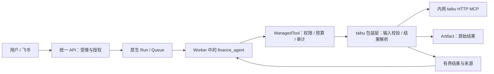

# FinanceClaw 接入 taibu MCP 实施方案

调研日期：2026-09-12。实施更新：首期两工具、固定契约、治理/归档、容器和探针已实现；真实模型及飞书联合验收仍是开放门槛。实际命令、实现细化及验证边界见 [运行说明](../../docs/operations/taibu-mcp.md)。以下保留原方案的设计内容与阶段划分。

本方案按接入当前 FinanceClaw 编写。建议复用现有 MCP SDK、ManagedTool 和原生 Agent 执行链，首批提供黄历、八字两个工具；开发验证可连接公共服务，正式运行采用独立的内网 HTTP 容器。八字大运、梅花等能力逐批增加，紫微引擎替换单独验收。

FinanceClaw 核对基线：`7dab6d47af6a6e0fcfe59caca04918b3c91cf058`。taibu 源码基线：`e8f636972a6fdb14f2a532ee223101f889ab4820`。源码版本、公共服务自报版本和本地依赖版本分别记录，不能相互代替。

## 1. 已确认的接入条件

| 项目 | 当前证据 | 实施含义 |
|---|---|---|
| 公共地址 | `https://mcp.mingai.fun/mcp` | 可以直接做 HTTP 联调 |
| 认证 | `/info` 实测 `auth=none` | 公共服务不需要 API Key、OAuth 或站点账号 |
| HTTP 服务版本 | `/info` 和初始化均返回 `3.1.1` | 对应 `taibu-mcp-server`，与 stdio 包独立编号 |
| 协议兼容 | 服务声明 `2026-07-28`；当前 Python SDK 成功协商 `2025-11-25` | 首期可以沿用现有依赖，无需先升级协议栈 |
| 工具发现 | 实测 15 个工具，均带 `outputSchema` | 可以冻结允许接入的输入、输出契约 |
| 返回形式 | 规范文本在 `content`，程序数据在 `structuredContent` | 包装层必须保留结构化结果 |
| 自建服务 | 独立 `packages/mcp-server`，不要求 Supabase 或模型密钥 | 可只部署 MCP 计算服务 |

公共服务的配置及独立部署条件见 [HTTP 服务说明](https://github.com/hhszzzz/taibu/blob/e8f636972a6fdb14f2a532ee223101f889ab4820/packages/mcp-server/README.md)；两个传输包的编号见 [HTTP package.json](https://github.com/hhszzzz/taibu/blob/e8f636972a6fdb14f2a532ee223101f889ab4820/packages/mcp-server/package.json) 和 [stdio package.json](https://github.com/hhszzzz/taibu/blob/e8f636972a6fdb14f2a532ee223101f889ab4820/packages/mcp/package.json)。

本次发现的工具按接入顺序划分如下。仓库首页列出的面相、MBTI、解梦等网站功能，不能直接视为 MCP 已暴露能力。

| 批次 | 远端工具 | 范围 |
|---|---|---|
| MVP | `almanac`、`bazi` | 黄历与八字命盘，先验证完整产品链路 |
| 扩展 | `bazi_dayun`、`bazi_pillars_resolve`、`meihua` | 大运、四柱反查、梅花；分别处理时间和条件参数 |
| 紫微专项 | `ziwei`、`ziwei_horoscope`、`ziwei_flying_star` | 先比对现有引擎与领域契约 |
| 后续 | `liuyao`、`tarot`、`qimen`、`daliuren`、`xiaoliuren`、`taiyi`、`astrology` | 按产品需求补齐随机、时区、地点及输出契约 |

工具清单和实测结果保存在 [compatibility-probe.json](../evidence/taibu-mcp/compatibility-probe.json)。

## 2. 本次验证结果与边界

使用 FinanceClaw 当前环境中的 `langchain==1.3.18`、`langchain-mcp-adapters==0.3.2`、`mcp==1.29.1`，完成了初始化、工具发现以及以下调用：

| 验证 | 结果 |
|---|---|
| `almanac(date="2026-09-12")` | 成功，返回文本和结构化 JSON |
| `bazi`，合成样例：公历 1990-01-15 09:00，male | 成功，返回四柱等结构化字段 |
| 上述两次已建连调用 | 各约 0.83 秒；单次观测，不含初始化，不代表吞吐或延迟保证 |
| 适配工具 `ainvoke(arguments)` | 返回内容列表，没有结构化 artifact |
| 适配工具 `ainvoke(ToolCall)`，包含调用 ID | 返回 `ToolMessage`，`artifact["structured_content"]` 保留 JSON |

八字样例未提供出生地点，结果明确返回 `placeResolutionInfo.resolved=false`。这证明传输与返回解析正常，不能据此宣称完成了真太阳时校正，也没有验证算法准确性。

调研时只验证了公共 MCP；实施阶段已补齐 Docker 构建、内网 MCP、合成历法样例、真实工具与归档，以及使用脚本模型的 FinanceClaw 图测试。真实模型、持久原生运行时和飞书联合验收仍未进行。其他 13 个工具只验证了可发现性。

## 3. FinanceClaw 中的接入位置

当前仓库已经采用 Stage 10 结构：统一 API 受理 Turn，原生队列交给独立 Worker 执行图。taibu 调用应发生在 Worker 的受治理工具中；API 负责发布声明和授权，Integrations 继续负责飞书渠道。详见 [当前包结构](../../docs/architecture/package-layout.md)。



现有可复用代码及需要补齐的部分：

| 位置 | 当前能力与改造点 |
|---|---|
| `financeclaw/agent_server/tools/mcp.py` | 已有 stdio 演示行情适配。它硬编码服务、每次发现工具，并用普通参数调用；可参考连接方式，需另写 taibu 包装 |
| `financeclaw/agent_server/tools/catalog.py`、`governance.py` | 已支持按 `tool_id + version` 注册 ManagedTool |
| `financeclaw/shared/releases/catalog.py`、`tools.py` | API 与 Worker 共用静态发布声明；新工具和契约应在这里冻结 |
| `financeclaw/agent_server/bootstrap.py` | 创建执行实例，注入客户端与 ArtifactService |
| `financeclaw/agent_server/agents/factory.py` | 已挂载权限、累计预算、工具重试、结果归档与上下文治理 |
| `financeclaw/agent_server/context/artifacts.py` | 已能保存原始工具快照并按引用回读 |

新增 MCP 服务本身不要求新增业务表、图执行队列或对外产品 API。MVP 只向根 Agent 增加两个明确用途的工具；多术数编排需要独立领域 Agent 时，再复用现有内部子图契约。

## 4. 部署路线

| 方式 | 用途 | 主要取舍 |
|---|---|---|
| 公共 HTTP | 联通性、合成样例、公开黄历查询 | 无部署成本；服务版本与可用性由上游控制，出生参数会发送给外部服务 |
| 本地 stdio | 个人开发或离线客户端 | 官方支持 `npx -y taibu-mcp`；需要 Node 环境，正式使用应固定验收过的包版本 |
| 内网 HTTP 容器 | FinanceClaw 正式运行，推荐 | 固定镜像与算法依赖，多个 Worker 共享服务，出生参数留在部署边界内 |

stdio 的离线能力见 [本地 MCP 说明](https://github.com/hhszzzz/taibu/blob/e8f636972a6fdb14f2a532ee223101f889ab4820/packages/mcp/README.md)。本方案第一期只给 FinanceClaw 增加 HTTP 配置，不同时扩展任意命令启动能力。

构建以固定源码提交为输入，使用 FinanceClaw 自有 Dockerfile，镜像记录与完整启动命令见运行说明：

```bash
docker build \
  --build-context taibu-src=https://github.com/hhszzzz/taibu.git#e8f636972a6fdb14f2a532ee223101f889ab4820 \
  -t financeclaw-taibu:e8f6369 deploy/taibu
```

在 FinanceClaw 自有 Compose 配置中增加 `taibu-mcp` 服务，使用上述镜像，并设置：

```yaml
services:
  taibu-mcp:
    image: financeclaw-taibu:e8f6369
    environment:
      NODE_ENV: production
      PORT: "3001"
      MCP_HOST: "0.0.0.0"
      MCP_ALLOWED_HOSTS: "taibu-mcp:3001"
      MCP_REQUEST_LOG: "false"
      TZ: Asia/Shanghai
    expose: ["3001"]
    restart: unless-stopped
```

实际实现见 `compose.taibu.yml`。服务加入 Worker 所在 Compose 网络，客户端地址为 `http://taibu-mcp:3001/mcp`，已有 `/health` 健康检查和资源上限。Node、pnpm 和依赖已固定；本机 image ID 与发布到仓库后的 manifest digest 分别记录，不能把可变标签视为版本锁定。

上游服务不验证 `Authorization` 或 `x-api-key`。内网方案通过网络可达范围限制访问；跨网络暴露时在网关实现认证。设置 API Key 环境变量本身不会让这个服务具备认证能力。高德地点解析是可选功能，首期不启用，明确经度由输入契约提供。[服务实现](https://github.com/hhszzzz/taibu/blob/e8f636972a6fdb14f2a532ee223101f889ab4820/packages/mcp-server/src/index.ts)、[地点解析实现](https://github.com/hhszzzz/taibu/blob/e8f636972a6fdb14f2a532ee223101f889ab4820/packages/mcp-server/src/place-resolution.ts)

部署复用应按上游划定的许可证范围处理：`packages/core`、`packages/mcp`、`packages/mcp-server` 各自为 MIT；根应用与根部署文件另有 AGPL 范围。因此这里新增 FinanceClaw 自有 Compose 文件，并保留所用包的许可证。[许可证边界](https://github.com/hhszzzz/taibu/blob/e8f636972a6fdb14f2a532ee223101f889ab4820/LICENSE)

## 5. MVP 工具与输入契约

| 本地工具名 | 远端工具 | 本地约束 |
|---|---|---|
| `taibu_almanac` | `almanac` | 明确 `date`；可选 `day_master`。首期提供普通黄历，不暴露整组出生参数 |
| `taibu_bazi` | `bazi` | 明确性别、历法、出生日期、小时、分钟和时间口径；真太阳时场景要求明确经度 |

本地名称加 `taibu_` 前缀，避免与已有工具混淆。远端工具名、URL、超时、版本及权限均由服务端绑定，不允许模型传入任意工具名或连接地址。

输入处理规则：

1. 本地使用固定 Pydantic Schema，禁止未知字段，日期和数值做实际校验。上游部分数值范围仅写在描述中，本地应实现整数与范围约束。
2. `calendar_type` 必须明确。农历需要确认闰月；不能因远端默认公历而跳过用户澄清。出生分钟未知时先澄清可用精度，不能悄悄填 `0`。
3. “今天”等明确的相对请求，根据 `ExecutionContext.request_clock` 和 `timezone` 确定日期，并冻结到该次工具参数；恢复与重试复用相同日期。用户未提出查询目标时，不替用户选择今天。
4. 包装层把本地字段映射到 `birthYear`、`birthMinute`、`calendarType` 等远端字段。首期八字限定已明确的中国标准时间口径；其他时区、历史夏令时及不明确的当地钟表时间，应返回待澄清或不支持，待时间规范化专项验证后放开。
5. 真太阳时转换只执行一次。上游算法以东经 120 度为标准经线；不能在 FinanceClaw 预先校正之后，又把原经度交给 taibu 再校正。[真太阳时实现](https://github.com/hhszzzz/taibu/blob/e8f636972a6fdb14f2a532ee223101f889ab4820/packages/core/src/domains/shared/true-solar.ts)
6. `placeResolutionInfo` 必须进入警告或口径元数据。用户要求真太阳时但没有完成地点处理时，不能交付为符合要求的成功结果。
7. 首期由包装层固定 `detailLevel="default"`。请求的分析深度超出此结果时，应明确限制；后续按工具增加 `full` 输出及对应投影，避免模型自行放大返回体。

本地澄清走已有 `request_user__clarification`，沿原 Turn 恢复。工具包装层负责发现缺项，根 Agent 汇总问题，不另开一轮独立任务。

## 6. 客户端、结果与错误处理

### 6.1 连接与结构化结果

实现复用 `MultiServerMCPClient.session()`，通过 SDK 公开的 `send_request(CallToolRequest, CallToolResult)` 取得原始结果，再按本地固定契约验证。高层 `session.call_tool()` 仍可用于下面的联通性检查，但它会按实时发现的输出 Schema 提前校验，所以正式包装使用公开请求接口以保留诊断原文。

以下是已经验证过的最小连接模式，仅用于联通性检查：

```python
import asyncio
from langchain_mcp_adapters.client import MultiServerMCPClient

async def probe():
    client = MultiServerMCPClient({
        "taibu": {
            "transport": "streamable_http",
            "url": "https://mcp.mingai.fun/mcp",
            "timeout": 10,
            "sse_read_timeout": 10,
        }
    })
    async with asyncio.timeout(20):
        async with client.session("taibu") as session:
            result = await session.call_tool("almanac", {"date": "2026-09-12"})
            if result.isError or result.structuredContent is None:
                raise RuntimeError("taibu did not return a successful structured result")
            print(result.structuredContent)

asyncio.run(probe())
```

注意配置格式不同：通用客户端示例用 `type: streamable-http`，当前 Python adapter 使用 `transport: streamable_http`。`structuredContent` 也不能通过 `json.loads(content[0].text)` 取得，文本通道是 Markdown。[上游输出构造](https://github.com/hhszzzz/taibu/blob/e8f636972a6fdb14f2a532ee223101f889ab4820/packages/core/src/mcp/payloads.ts)

客户端配置对象可复用；异步 session 按执行作用域创建和关闭，禁止在多个事件循环间共享活动连接。首期不依赖会话 Header 或订阅流，不在每轮模型调用时重新发现全部工具。

### 6.2 固定契约与发布

将接入工具的远端输入、输出 Schema 及本地包装 Schema 纳入版本化发布声明。部署探针核对服务器版本和选中工具的契约摘要；Worker 建立连接时校验实际握手版本及约定契约，缓存校验结果并按有界周期复核。

发现不匹配时返回稳定的契约错误，记录需要重新验收的版本，不自动把新工具加入模型清单。API 和 Worker 都从本地声明计算指纹，API 构造发布目录时不访问远端服务。内网固定镜像是算法版本控制的主要手段；公共服务即使自报版本不变，也不能保证实现从未变化。

当前 LangChain 在线主文档已经介绍面向 `langchain>=1.4.0` 的新 MCP API。FinanceClaw 仍锁定 `1.3.18`，本次实测的是现有适配器；实现应按锁定版本编写，把依赖栈迁移另列变更。[LangChain 当前 MCP 文档](https://docs.langchain.com/oss/python/langchain/mcp)

### 6.3 结果契约与上下文

建议新增 `TaibuToolResult`，包含：`schema_version`、`outcome`、本地/远端工具名、provider、服务器版本、契约摘要、时间口径、调用时间、有界 `data`、`warnings` 和原始 Artifact 引用。

- 优先读取 `structuredContent`，验证固定 Schema 后再做业务不变式检查。实测 Schema 的顶层没有必填约束，不能把“JSON Schema 校验通过”视为结果完整；八字至少检查四柱完整，黄历检查目标日期相关的核心结果。
- 中文 JSON 键也是上游契约的一部分。需要稳定英文字段时在本地显式映射，保留原始数据便于复核。
- 将原始文本、JSON、版本及调用参数快照通过现有 `ArtifactService.persist()` 保存；模型接收本地投影与引用。不要在消息中同时塞入整份文本和整份 JSON。
- 建议初始投影预算为 8 KiB，且实际不超过 `artifact_inline_bytes` 扣除包装开销后的余量；原始结果另设应用层序列化大小上限，例如 256 KiB。它不等同于 HTTP 传输层硬限制，后续大结果场景需要在 transport 或网关补齐。
- 当前 Settings 的内联默认值为 46,384 bytes，运行时还可覆盖。模型输入仍按 token 控制，不通过增加全局上下文预算解决结果膨胀。
- 历史问题通过 `read_artifact` 回读原始快照。术数解读沿用现有产品口径，不作为金融事实，也不据此生成长期用户画像。

包装层先保存原始结果，再返回小型投影与 Artifact 引用，可以避免现有通用归档中间件因整包过大而把有用的即时投影一起换成回读提示。

### 6.4 权限与错误

新工具声明 `SideEffect.READ`，使用独立 `taibu:read` scope；内网服务声明 `Egress.INTERNAL`，公共服务声明 `Egress.EXTERNAL`。在部署/租户策略中约束可用端点与可发送的数据类别，不能仅依靠 `egress` 标签：当前 ToolPolicy 的实际准入依据还包括 scopes、租户及 `allowed_data_classes`。

八字包含出生资料。启用它时，根 Profile 的数据分级需允许并标记为 `CONFIDENTIAL`，不能继续只由 `ziwei_enabled` 决定。开发 API 和飞书身份需分别配置 scope；生产身份通过现有认证链授予。MVP 的真实出生资料走自建服务，公共服务继续用于合成样例与允许出域的公开查询。

审计记录调用身份、工具版本、结果状态、耗时和 Artifact 引用；避免把出生参数直接写进通用日志、完整 I/O 调试或未配置脱敏的模型追踪。

| 错误 | 处理 |
|---|---|
| 本地缺项、日期冲突、非法历法 | 可理解的输入错误，交由根 Agent 澄清 |
| 连接失败、超时、远端 5xx | 对首批幂等计算转换为 `TransientToolError`，由现有工具重试中间件统一处理 |
| HTTP 429 | 返回限流及可用的等待信息；MVP 不立即自动重试，避免现有零退避策略连续打满公共限额 |
| `isError=true` | 工具执行失败，不能包装成正常数据，也不泛化为可重试异常 |
| 缺失 JSON、业务关键字段不足、Schema 不兼容 | 稳定的结果/契约错误，保留诊断证据 |
| 用户取消 | 透传取消并关闭连接，不转成重试 |

现有 Factory 对 `TransientToolError` 最多重试 2 次；适配层不再额外套重试循环。每次真实 Tool 尝试沿用 Turn 累计预算。一次尝试的连接、初始化、调用和正常清理共用 10 秒预算起点，并计入总任务时限。生产压测后再针对这些工具评估退避参数。

后续的塔罗、随机六爻默认不重试，也不共享结果缓存。HTTP 服务会为相关工具附加按客户端 IP 生成的随机作用域，即使 seed 相同也要验证跨副本与出口变化的行为；成功结果必须持久化后回读。[HTTP 随机作用域实现](https://github.com/hhszzzz/taibu/blob/e8f636972a6fdb14f2a532ee223101f889ab4820/packages/mcp-server/src/index.ts)

## 7. 与现有紫微能力的关系

现有紫微是“固定五工具 → ZiweiService → 证据/投影 → 领域 Agent 输出”的完整链路。taibu 的三个紫微工具不能仅改名称后替换它们。

| 现有入口 | taibu 候选 | 适配要求 |
|---|---|---|
| `ziwei_natal_chart` | `ziwei` | 转换输入、十二宫及星曜结构，生成本地证据与引用 |
| `ziwei_decadal_chart`、`ziwei_yearly_chart`、`ziwei_monthly_chart`、`ziwei_daily_chart` | `ziwei_horoscope` | 将固定层级及绝对日期/区间转换为远端查询；保留各级结果与边界 |
| 当前未单独发布飞星入口 | `ziwei_flying_star` | 先定义新增能力和输出范围 |

上游运限 `targetDate` 可以省略并默认当天；现有工具明确拒绝缺失目标，适配后仍应执行本地约束。上游八字大运没有 `longitude` 参数，也不能默认它与经过真太阳时校正的八字命盘使用同一口径。[运限输入](https://github.com/hhszzzz/taibu/blob/e8f636972a6fdb14f2a532ee223101f889ab4820/packages/core/src/mcp/domains/ziwei-horoscope/definition.ts)、[大运输入](https://github.com/hhszzzz/taibu/blob/e8f636972a6fdb14f2a532ee223101f889ab4820/packages/core/src/mcp/domains/bazi-dayun/definition.ts)

紫微专项至少验证：公历/农历、闰月、早晚子时、跨日校正、海外时区与夏令时、四化口径、大限边界、流年/月/日目标。比对以固定参数下的盘面字段及可解释的口径差异为准，不要求两个引擎在未统一口径前天然相同。完成后再决定增加第二 provider 或正式替换；真实结果必须继续绑定本地请求、工具调用和 Artifact。

## 8. 文件改造清单

以下为原计划的文件改造清单，首期实现已落地；另增加了专用的重试耗尽错误中间件、固定 Schema JSON 和运行说明。

| 文件 | 工作 |
|---|---|
| 新增 `financeclaw/kernel/taibu.py` | 本地固定输入、结果和时间口径契约 |
| 新增 `financeclaw/shared/releases/taibu.py` | 工具版本、治理、选中远端 Schema 与摘要；供 API/Worker 共用 |
| 新增 `financeclaw/agent_server/tools/mcp_client.py` | 有界 HTTP session、协议/契约校验、原始结果和错误映射 |
| 新增 `financeclaw/agent_server/tools/taibu.py` | 两个工具的参数映射、业务完整性验证、归档与投影 |
| 修改 `financeclaw/agent_server/bootstrap.py` | 按开关注入客户端、工件服务、ManagedTool |
| 修改 `financeclaw/shared/releases/catalog.py` | 显式注册工具、计算指纹、根提示及出生资料分级 |
| 修改 `financeclaw/shared/infrastructure/settings.py` | 开关、端点、工具允许清单、超时及返回预算 |
| 修改 `config/environments/*.env.example` | 演示 HTTP 配置和 scope 授予说明 |
| 新增 `compose.taibu.yml` | 自建服务与现有 Worker 的连接配置 |
| 新增 `tests/taibu/` | 输入、输出、异常、权限、发布和归档的契约测试 |
| 新增 `experiments/taibu/` | 可选的真实 HTTP/产品链路探针，证据单独保存 |

首期实现已经支持以下配置，完整配置见运行说明：

```dotenv
FINANCECLAW_TAIBU_ENABLED=false
FINANCECLAW_TAIBU_MCP_URL=http://taibu-mcp:3001/mcp
FINANCECLAW_TAIBU_ALLOWED_TOOLS=["almanac","bazi"]
FINANCECLAW_TAIBU_TIMEOUT_SECONDS=10
FINANCECLAW_TAIBU_PROJECTION_BYTES=8192
FINANCECLAW_TAIBU_RESULT_MAX_BYTES=262144
```

发布契约、允许工具、端点信任类别及影响行为的预算进入配置指纹。API、Worker 使用相同配置来源。URL 只接受受支持的 HTTP(S) 端点；真实出生资料的自建路由由部署策略明确，不能因开关打开就允许任意公网端点。

## 9. 分阶段实施与验收

| 阶段 | 交付 | 验收门槛 | 估算 |
|---|---|---|---|
| P0：契约与环境冻结 | 两个工具的 Schema、样例、时间口径；自建服务可启动 | 固定镜像成功构建，当前 SDK 完成握手与调用 | 0.5–1 人日 |
| P1：工具接入 | 固定输入、客户端、ManagedTool、归档、发布与配置 | 产品图能调用两工具，权限/错误/预算测试通过 | 1.5–2 人日 |
| P2：端到端验证 | API、真实模型及飞书澄清链路；异常与重启恢复证据 | 用户请求能得到带来源的回答；同一 Turn 续答和历史回读正确 | 1–2 人日 |
| P3：部署交付 | 固定镜像 digest、同步发布、运行说明和回退记录 | 配置一致性与回退演练通过 | 0.5 人日 |

首批两工具原估算约 **3.5–5.5 人日**，不含全部 15 工具、紫微替换、多版本路由或算法专项修正。实施阶段已完成 P0、P1 和 P2 的自动化/真实 MCP 部分；部署与回退配置已交付，模型、渠道和实际发布切换门槛见运行说明。

需要覆盖的验收案例：

- 公历/农历与闰月；未知分钟、冲突字段；明确时间口径；跨午夜恢复时相对日期不漂移。
- `content + structuredContent` 完整保存；文本不是 JSON；空对象通过上游 Schema 但业务校验失败；地点解析警告不被吞掉。
- 超时、网络失败、429、5xx、`isError`、契约变化及取消；重试不超过框架和 Turn 预算。
- 未授权 scope、未允许租户和不匹配数据类别无法发起远端请求；生产追踪中不出现裸出生参数。
- 功能关闭时不连接远端；API 只构造静态声明；API/Worker 指纹一致，错误配置能够检测。
- 大结果原文可按所有者权限回读；模型立即可用的投影保留；跨租户回读失败。
- 飞书提出缺项后，用户补充出生时间进入原交互；继续同一 Turn；重复答案不会产生重复有效任务。
- taibu 暂不可用时，回答明确该能力失败；已完成的其他工作和旧结果回读仍可使用。

自动化测试用固定 fixture 和受控 MCP stub。真实 HTTP、持久原生 runtime、真实模型及飞书验证单列，不能用 stub 通过代替线上联通或渠道通过。能力开放范围只包括实际验收的工具。

## 10. 发布与回退

MVP 保留现有根图入口，以新的 `deployment_revision` 和配置指纹表达工具扩展，先在新受理的 Turn 中验证。切换前完成在途任务；存在待用户输入的旧 Turn 时，先明确其完成、取消或旧版本承接方式，再同步切换 API 与 Worker。

不要让已固定发布快照的 Turn 在中途更换工具集合、Schema 或端点信任类别。回退也同步恢复镜像和配置指纹，在途新发布的 Turn 同样需要处理。关闭 `taibu_enabled` 可撤回新能力，但它不是对在途任务无影响的热开关。

现有会话保存 `agent_profile_version`。如果实施中还要升级该语义版本，应额外提供旧会话承接/迁移方案，不能只删除旧 Profile；这不是添加两个 MCP 工具的默认前置改造。

完成标准是“两个受治理工具在 FinanceClaw 产品链路中可用、可归档、可恢复、可回退”。实现与真实 MCP 证据已经补齐；自动化、真实服务、模型/渠道及生产切换的状态分别记录，不能相互替代。
