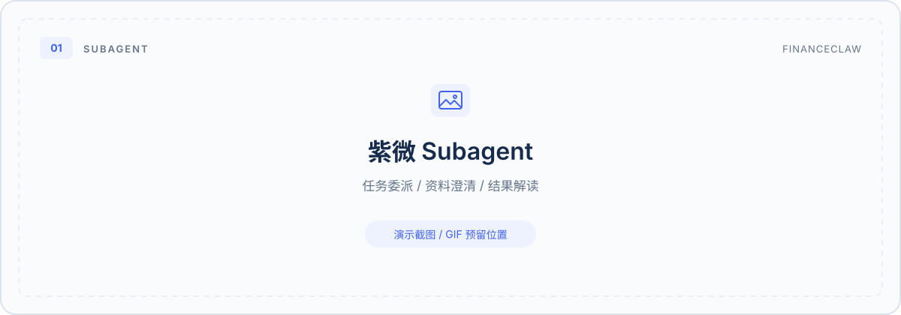
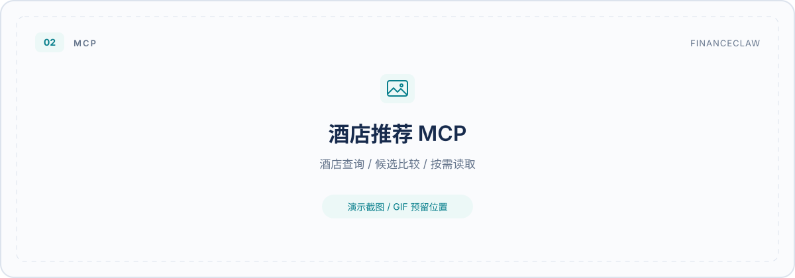
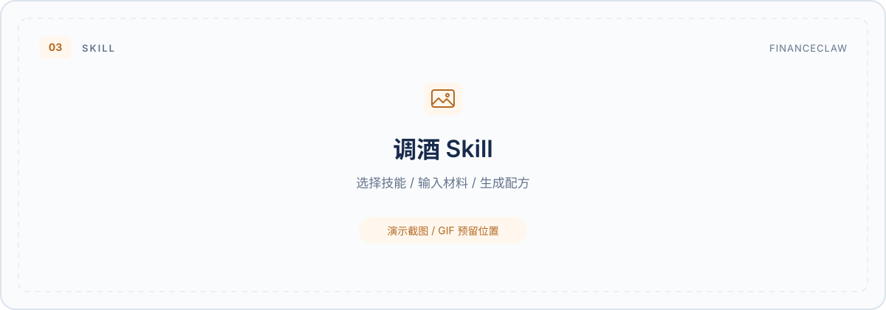
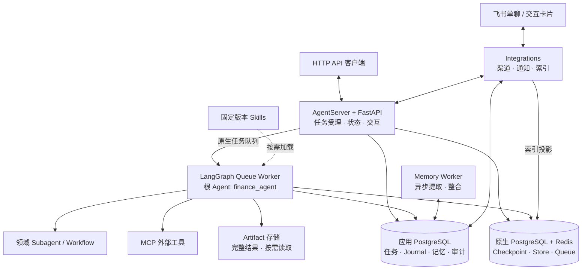

<div align="center">

# FinanceClaw

**从一次对话，到可执行、可恢复、可追溯的 Agent 任务。**

基于 LangChain / LangGraph 的 Agent 应用工程实践<br/>
以飞书为交互入口，连接领域 Subagent、外部 MCP 服务与可复用 Skills。

[](https://github.com/westbrook0904/FinanceClaw/actions/workflows/ci.yml)


[场景演示](#场景演示) · [工程亮点](#工程亮点) · [系统架构](#系统架构) · [快速开始](#快速开始) · [文档导航](docs/README.md)

</div>

## 项目简介

FinanceClaw 从金融助手场景出发，构建了一套支持多领域扩展的 Agent 应用：用户在飞书单聊中提出任务，根 Agent 按需委派子 Agent、调用外部工具或加载技能；执行过程中可查看工具进度、补充信息、确认审批，并在完成后收到结果。

项目重点是 **Agent 从“能回答”走向“能持续完成任务”所需的工程能力**：统一任务生命周期、持久化的人机交互、共享权限与预算、上下文压缩、异步长期记忆，以及可审计的工具和技能执行。

| 用户侧体验 | 对应工程能力 |
| --- | --- |
| 一句话完成跨领域任务 | 根 Agent 编排，Subagent / MCP / Skill 三种扩展方式 |
| 执行进度可见，缺少信息时继续对话 | 飞书卡片、脱敏工具事件、持久交互与原生 interrupt / resume |
| 长对话保留上下文，历史信息按需召回 | Checkpoint、上下文预算、历史索引与异步长期记忆 |
| 重试、断连、取消都有明确状态 | 幂等命令、独立任务观察、取消确认与不确定回执核对 |

## 场景演示

三个场景共用同一套任务、权限、预算与飞书交互机制，分别展示领域推理、外部工具接入和方法复用。

### 01 · 紫微 Subagent｜领域任务委派

根 Agent 将紫微任务交给专用子 Agent，由确定性排盘引擎提供盘面，子 Agent 结合工具结果组织解读。资料缺失时，系统汇总问题并暂停任务；用户补充后继续处理。

> **交互示例：** 使用合成出生资料查询本命盘与指定年份的流年盘；资料不足时先澄清。



**展示重点：** 子图委派 · 确定性计算与模型解读分工 · 多项缺失信息合并澄清 · 同一任务恢复

[领域实现](financeclaw/agent_server/domains/ziwei/) · [使用与验证说明](docs/operations/ziwei-agent.md)

### 02 · 酒店推荐 MCP｜外部服务接入

通过 RollingGo MCP 查询酒店、筛选标签和房型价格，根 Agent 根据用户的目的地、预算与偏好整理候选。大结果完整归档为 Artifact，模型先查看目录与预览，再按字段和分页读取需要的信息。

> **交互示例：** 帮我找上海静安寺附近、预算每晚 800 元以内的酒店；先确认入住日期和人数，再比较候选与退改条件。



**展示重点：** 配置化工具接入 · 输入契约校验 · 外部访问与权限控制 · 大结果按需读取

[MCP 配置](config/mcp.toml) · [接入与结果读取说明](docs/operations/mcp.md)

### 03 · 调酒 Skill｜可复用的方法与流程

在飞书发送 `/skills`，选择“现有材料调酒”并填写材料、器具与人数；也可用 `/skill` 直接指定。Agent 加载固定版本的技能正文，按已有材料给出配方、步骤、替代方案、多人份和无酒精版本。

> **交互示例：** 我有金酒、柠檬、苏打水、蜂蜜和冰块，没有摇壶。做两杯清爽的，请用毫升给出配方，并附一个无酒精版本。



**展示重点：** 技能表单 · 显式选择 / 模型按需加载 · 固定版本与来源追踪 · 技能正文纳入上下文预算

[技能运行时](financeclaw/agent_server/skills/service.py) · [Skills 使用说明](docs/operations/skills.md)

<!--
演示图片替换说明：
1. 将真实截图或 GIF 放在 docs/assets/demos/ 下。
2. 替换上方对应的图片路径和 alt 文本；占位 SVG 可删除。
3. 推荐文件名：ziwei-subagent.png、hotel-mcp.png、cocktail-skill.png。
-->

## 工程亮点

### 任务状态独立于模型执行

以 `turn_id` 标识业务任务，以不可变命令记录开始与恢复操作，原生 `run_id` 作为执行回执。客户端断开不影响后台观察；提交结果不确定时核对原操作身份；取消需确认原生执行停止后才落为终态。最终答案、任务状态、审计、通知和记忆提取意图在同一业务事务中提交。

→ [任务生命周期](financeclaw/api/application/turns/lifecycle.py) · [恢复与取消契约](docs/operations/turn-control.md)

### 子 Agent 与工具共享治理边界

唯一公开根图为 `finance_agent`，领域 Agent 和 Workflow 以内嵌子图接入。子任务继承本次任务的授权、调用预算和上下文约束；执行前检查工具权限、数据级别、外部访问策略及审批要求。飞书展示工具名称、状态和最终输出，内部参数与原始异常不进入进度卡片。

→ [工具治理](financeclaw/agent_server/tools/governance.py) · [子图执行域](financeclaw/agent_server/tools/subgraph_scope.py)

### 用统一预算管理上下文与大结果

系统指令、工具 Schema、记忆、摘要、技能正文与输出预留共用预算规划。已完成的工具片段可归档、压缩，当前用户输入和未完成工具配对受保护；大型 MCP 回包通过带内容 hash 的 Artifact 引用按需读取，保留完整原始结果与来源。

→ [上下文规划](financeclaw/agent_server/context/planning.py) · [Artifact 视图](financeclaw/shared/artifacts/views.py)

### 长期记忆在回答链路之外处理

独立 `memory_worker` 异步提取和整合长期记忆，SQL 保存事实、来源、版本及遗忘状态，LangGraph Store 提供可重建检索索引。记忆支持查询、纠正、确认与遗忘；索引任务带版本和隐私边界，防止迟到的写入恢复已删除内容。

→ [记忆 Worker](financeclaw/memory_worker/) · [上下文与记忆说明](docs/operations/context-budget.md)

### Skills 作为受控的任务方法加载

技能以固定包、版本和 hash 发布，支持用户显式选择及模型按需加载。技能正文只进入本次模型请求副本，不写入会话历史或长期记忆；资源读取与派生内容携带来源约束，权限检查与工具审批沿用当前任务。

→ [技能中间件](financeclaw/agent_server/middleware/skills.py) · [实现与验证](.redesign/stages/skills-实现与验证.md)

## 系统架构

复用 LangChain 的 Agent / Middleware 与 LangGraph 的图执行、Checkpoint、Store、interrupt / resume；项目层负责业务任务、授权、审计、通知和数据治理。业务 FastAPI 应用与 AgentServer 同进程，通过进程内 SDK 调用原生能力，图执行交给独立 queue worker。



同一应用镜像运行四种角色：**API、Queue Worker、Memory Worker、Integrations**。应用库与原生运行库分离，记忆 Worker 使用独立环境配置和有限权限数据库身份。

| 层次 | 技术与职责 |
| --- | --- |
| Agent 编排 | LangChain、LangGraph、LangGraph AgentServer |
| 产品接口 | Python 3.13、FastAPI、Pydantic、SSE |
| 持久化与检索 | PostgreSQL、pgvector、Redis、SQLAlchemy、Alembic |
| 扩展与交互 | MCP、Skills、飞书 WebSocket / CardKit |
| 观测与交付 | LangSmith、OpenTelemetry、Docker Compose、GitHub Actions |

## 快速开始

<a id="启动"></a>
<a id="运行"></a>

准备 **Python 3.13、uv、Docker Compose**，以及官方 AgentServer 自托管所需凭据。项目处于开发验证阶段，初始迁移面向空应用库；已有开发库的处理见[环境说明](config/environments/README.md)与 [Skills 运行手册](docs/operations/skills.md)。

**1. 安装依赖，复制配置。**

```bash
git clone https://github.com/westbrook0904/FinanceClaw.git
cd FinanceClaw
uv sync --frozen --extra dev --extra ziwei
cp config/environments/unified.env.example .env
cp config/environments/memory.env.example .env.memory
```

**2. 填写本地配置。**

- 在 `.env` 中填写数据库密码、产品 API 令牌、集成令牌和 AgentServer 凭据；两个环境文件中的 `MEMORY_POSTGRES_PASSWORD` 保持一致。
- 环境模板默认使用确定性离线模型，用于验证任务与协议链路。体验真实模型时，按[模型配置](docs/operations/model-configuration.md)设置供应商密钥并关闭离线模式，记忆 Worker 的模型配置需与 API 冻结的档案一致。
- 当前 [MCP 配置](config/mcp.toml)已启用 `rollinggo_hotel`。体验酒店查询需配置 `FINANCECLAW_ROLLINGGO_API_KEY` 及 `travel:read` 权限；仅启动基础链路时，先将该服务的 `enabled` 改为 `false`。

**3. 部署并检查就绪状态。**

```bash
uv run --frozen python scripts/deploy.py
curl --fail-with-body http://127.0.0.1:8000/v1/health/ready
```

部署入口检查已启用 MCP 的固定工具定义、补齐缺失定义，随后构建并启动服务。刷新远端定义使用 `--refresh-mcp`，仅准备定义使用 `--prepare-only`。API 默认地址为 `http://127.0.0.1:8000`。

**4. 按场景开启能力。**

| 场景 | 配置入口 |
| --- | --- |
| 飞书单聊、进度卡片与交互回调 | [本地完整链路](docs/operations/local-full-stack.md) |
| 紫微 Subagent 开发候选 | [依赖、权限与候选配置](docs/operations/ziwei-agent.md) |
| 酒店 MCP 查询 | [服务凭据、工具契约与授权](docs/operations/mcp.md) |
| 调酒 Skill / `/skills` 表单 | [Skills 启用与使用](docs/operations/skills.md) |

## 产品接口

标准调用链为 **创建 Conversation → 提交 Turn → 观察状态 / 回答交互 → 获取结果**。提交任务只需 `message` 与 `Idempotency-Key`，返回 `202` 和 `turn_id`；原生 thread、run 和 checkpoint 由服务端管理。

| 接口 | 用途 |
| --- | --- |
| `POST /v1/conversations` | 创建会话 |
| `POST /v1/conversations/{id}/turns` | 提交任务 |
| `GET /v1/conversations/{id}/turns/{turn_id}` | 查询状态与结果 |
| `GET /v1/conversations/{id}/turns/{turn_id}/events` | SSE 状态快照 |
| `POST /v1/conversations/{id}/turns/{turn_id}/cancel` | 请求取消 |
| `POST /v1/interactions/{id}/responses` | 提交澄清或审批决定 |
| `GET /v1/conversations/{id}/messages` | 分页读取持久化会话历史 |
| `/v1/memory/settings`、`/v1/memories` | 记忆设置、查询与管理 |

鉴权、授权变更、候选记忆确认及完整请求示例见 [Turn 运行手册](docs/operations/turn-control.md)、[Skills HTTP 示例](docs/operations/skills.md)和[记忆运维说明](docs/operations/context-budget.md)。

## 开发与验证

```bash
uv sync --frozen --extra dev --extra ziwei
uv run --no-sync pytest -q
uv run --no-sync ruff check financeclaw tests scripts deploy experiments/stage10 experiments/taibu
uv run --no-sync ruff format --check financeclaw tests scripts deploy experiments/stage10 experiments/taibu
uv run --no-sync python scripts/check_secret_leaks.py
uv run --no-sync python scripts/skill_manifest.py --check
```

[CI](.github/workflows/ci.yml) 分别检查基础安装与紫微可选依赖安装，包含测试、静态检查、密钥扫描、技能包 / wheel 完整性校验、SBOM 生成及依赖审计。测试覆盖任务恢复、权限隔离、交互幂等、MCP 契约、大结果读取、上下文预算和技能治理等边界。

**验证范围：** 自动化测试使用确定性模型与外部服务替身；真实 PostgreSQL、模型供应商和飞书联调需独立配置。紫微仍是 development / test 候选，内置行情工具使用演示数据。真实模型效果、外部服务可用性和生产负载表现需分别验收，阶段记录保留在[实现与验证文档](.redesign/stages/stage-11-实现与验证.md)及 [Skills 验证记录](.redesign/stages/skills-实现与验证.md)中。

## 代码与文档

第一次使用从[文档导航](docs/README.md)选择阅读路径；参与开发先看[开发上手](docs/development.md)，理解业务执行可沿[请求调用链](docs/architecture/request-lifecycle.md)阅读源码。

```text
financeclaw/
├── api/             产品 API、任务生命周期、交互与权限
├── agent_server/    根 Agent、领域子图、工具、中间件与上下文
├── memory_worker/   异步记忆提取与整合
├── integrations/    飞书渠道、通知投递与索引维护
├── shared/          持久化、模型配置、发布、记忆与制品
└── kernel/          领域契约与策略模型
```

| 想进一步了解 | 阅读入口 |
| --- | --- |
| 系统拆分与依赖边界 | [包结构](docs/architecture/package-layout.md) · [设计文档索引](.redesign/README.md) |
| 任务状态、恢复与取消 | [Turn 运行手册](docs/operations/turn-control.md) · [持久化与故障恢复探针](experiments/stage10/README.md) |
| 上下文、长期记忆与数据生命周期 | [预算与异步记忆](docs/operations/context-budget.md) · [数据主体请求](docs/operations/data-subject-requests.md) |
| 工具与技能扩展 | [MCP](docs/operations/mcp.md) · [Skills](docs/operations/skills.md) · [紫微 Subagent](docs/operations/ziwei-agent.md) |
| 部署与运维 | [完整链路](docs/operations/local-full-stack.md) · [发布清单](docs/operations/release-checklist.md) · [故障恢复](docs/operations/disaster-recovery.md) |

调酒技能集成自上游项目，原文、MIT 许可证及固定提交来源保留于[技能目录](financeclaw/shared/skills/builtin/cocktail-from-what-i-have/)；本项目实现其加载、授权、来源追踪与飞书交互链路。
