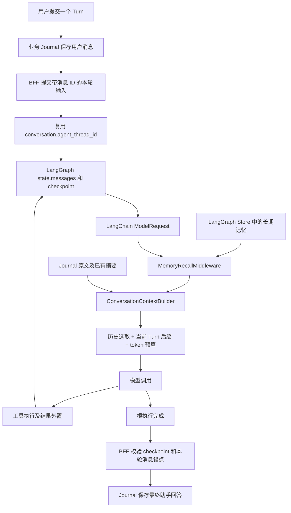

**FinanceClaw 记忆与上下文架构评估 · 2026-09-10**

评估结论：核心执行状态持久化、原生子图恢复、跨会话 Store 已经使用 LangGraph；主要可以简化的是模型输入的历史组装和摘要策略。当前更值得优先处理的问题是摘要未接入生产流程、语义索引未配置、稳定画像与相关记忆混用同一个召回名额，以及上下文裁剪与当前 Turn 消息锚点的兼容性。不能通过删除 Journal 或直接挂上 SummarizationMiddleware 完成替换。

依据是当前仓库、已安装依赖源码和离线验证：LangChain 1.3.18、LangGraph 1.2.11、langgraph-api 0.13.3，与 uv.lock 一致。未访问实际部署数据库、外部模型或付费 embedding 服务。因此，“未配置”指仓库提供的部署配置；外部环境单独注入的配置、已有数据库中的历史记录数量及线上运行效果不在本次验证范围。

**1. 框架实际提供了什么**

LangGraph 的 Checkpointer 保存 thread 状态，Store 保存应用定义的跨 thread 记忆。Agent Server 管理这些持久化基础设施；画像提取、哪些事实值得记忆、事实过期与冲突处理、哪些内容进入模型，仍需应用决定。[官方持久化说明](https://docs.langchain.com/oss/python/langgraph/persistence)

还需要区分两个容易混淆的概念：

- LangGraph 的 state/checkpoint：运行和恢复需要的数据。
- LangChain 的 ModelRequest：某一次实际发给模型的数据，可以通过 middleware 临时投影，不必改写 state。

原生 SummarizationMiddleware、ContextEditingMiddleware 属于 LangChain。前者在阈值触发时改写消息状态；后者修改单次请求中的工具结果。它们是可复用的策略组件，不是开启 checkpoint 后自动发生的能力。[官方上下文管理说明](https://docs.langchain.com/oss/python/langchain/context-engineering)、[内置中间件](https://docs.langchain.com/oss/python/langchain/middleware/built-in)

**2. 当前系统真正运行的路径**



关键证据：

- 正常后续 Turn 复用 conversation 的 agent_thread_id，只提交本轮用户消息；失败/取消会切换新 thread，避免继续旧的待执行工作。[BFF 入场路径](/Users/hebinghui/PycharmProjects/FinanceClaw/financeclaw/bff/application/runs/service.py:132)
- 部署图构造时传 checkpointer=None，由 Agent Server 管理持久化；工厂的 InMemorySaver 是独立调用的默认值，不能据此判断部署状态只存内存。[部署入口](/Users/hebinghui/PycharmProjects/FinanceClaw/financeclaw/agent_server/graphs/bff_graphs.py:19)
- 当前根使用 stage2-journal-v1：从 state 提取最后一条用户消息起的后缀，历史重新从 Journal 选择。[构建器](/Users/hebinghui/PycharmProjects/FinanceClaw/financeclaw/agent_server/context/builder.py:265)
- 最后调用 request.override(messages=messages)，不删除或压缩 checkpoint 中的旧消息。[请求投影](/Users/hebinghui/PycharmProjects/FinanceClaw/financeclaw/agent_server/middleware/context_middleware.py:233)
- 长期记忆确实通过 BaseStore 的 namespace、get、search、batch/PutOp、put 读写，并使用 content 字段索引标记。[长期记忆服务](/Users/hebinghui/PycharmProjects/FinanceClaw/financeclaw/agent_server/memory/service.py:183)

因此，当前属于“框架维持运行历史，业务 Journal 决定跨 Turn 的模型历史”。这是一种可以成立的架构选择，但维护了两份不同用途的历史表示，并且每次模型调用都会发生转换。

**3. 能力使用与重复建设判断**

| 能力 | 当前情况 | 判断与处理方向 |
|---|---|---|
| 消息累积、checkpoint、thread 恢复 | 已使用 | 保留原生机制，不另建执行消息存储引擎 |
| 原生子图和 interrupt/resume | 已使用 | 保留；业务审批绑定是附加约束 |
| 跨会话 Store 与用户 namespace | 已使用 | LongTermMemoryService 是业务包装层，不是重复数据库 |
| Store 语义检索 | 服务已传 query/index，但仓库未配置 embedding 索引 | 补配置与验收；不要再自建向量存储引擎 |
| 工作上下文的摘要/工具结果清理 | 自定义拼装、正文截断，未挂原生摘要/上下文编辑 middleware | 有功能重叠，可复用框架组件，但须适配 Turn 锚点与结构保护 |
| 历史 Journal、会话/Turn 表 | 已使用 | 应保留业务账本，减少它在每次模型调用里的全量回读 |
| 分段/层级摘要服务 | 有实现与单测，当前生产完成流程未调用 | 未完成的自建能力；先决定用途再接入或删减 |
| 画像证据、确认、撤销、版本替代 | 已实现 | 属于业务语义，框架 CRUD 不会替代 |
| Artifact 外置与受控读取 | 已实现且使用 ToolMessage.artifact | 保留；框架的清理工具结果不等于对象存储与可回读工件 |
| Context Manifest | 已实现 | 有审计价值；合并到最终投影处，减少重复查询 |
| TTL、旧 checkpoint 回收 | 仓库未见相关配置 | 复用 Agent Server 生命周期能力，按业务保留需求配置 |
| 当前任务对 Worker 的上下文投影 | 已实现 | 保留隔离原则，不向 Worker 默认复制所有历史或画像 |

原生子图继承 checkpointer 是框架支持的用法；本项目以 runtime.config 调用内部子图，并只传任务、澄清和显式引用，符合此分工。[内部子图调用](/Users/hebinghui/PycharmProjects/FinanceClaw/financeclaw/agent_server/tools/subgraphs.py:94)、[官方子图记忆说明](https://docs.langchain.com/oss/python/langgraph/add-memory#use-in-subgraphs)

**4. 需要优先处理的发现**

**P1：稳定画像没有独立的读取与保留规则。**

LongTermMemoryService.search 先取最多 50 条 ACTIVE 候选，再计算相关性，最后按 limit 截取。默认 MemoryRecallMiddleware 只有 2 条、768 token。constraint/goal 只豁免“零相关过滤”，并没有更高的选取优先级；因此注释中的“约束无条件进入上下文”并不成立。[搜索及排序](/Users/hebinghui/PycharmProjects/FinanceClaw/financeclaw/agent_server/memory/service.py:405)、[默认设置](/Users/hebinghui/PycharmProjects/FinanceClaw/financeclaw/shared/infrastructure/settings.py:271)

已离线复现：

- 保存“Always respond in Chinese”，询问“NVDA earnings”，未配置索引的 Store 返回 score=None，该语言偏好被零相关过滤。
- 保存一个“Never use leverage”约束和两个与查询匹配的 preference，limit=2 时两个 preference 入选，约束落选。

建议把画像与事件记忆分开读取：受控且有界的稳定画像可用固定 key 或按类型筛选读取；相关决策、往事用语义 search。两者均继续使用同一个 LangGraph Store，不需要额外画像数据库。对关键约束给予明确预算和溢出处理，不能宣称所有约束无条件塞入有限上下文。金融操作的权限仍由工具治理执行，不能只依赖提示词中的画像。

**P1：摘要服务没有接到当前生产完成流程，并且现有“摘要”会丢失尾部决定。**

build_resources 构造 SummaryService，但全仓调用搜索显示 build_missing_segments/build_hierarchy 的调用仅在摘要单测中；当前 ResultService 在完成时追加助手消息、更新运行事实，没有触发摘要，也未发现消费完成事件生成摘要的生产任务。[摘要装配](/Users/hebinghui/PycharmProjects/FinanceClaw/financeclaw/shared/infrastructure/resources.py:64)、[完成路径](/Users/hebinghui/PycharmProjects/FinanceClaw/financeclaw/bff/application/runs/results.py:131)

默认 DeterministicSummarizer 将 role/content 拼接后截到 2000 字符，层级摘要截到 3000 字符。它没有语义提炼，decisions/open_items 也没有被默认生成器填充。已用“长背景 + 末尾最终决定”复现决定完全消失。[摘要器](/Users/hebinghui/PycharmProjects/FinanceClaw/financeclaw/shared/conversation/summaries.py:35)

建议区分两种用途：

- 工作摘要：用于让后续模型调用继续任务，考虑复用 LangChain 摘要机制，但先解决下面的锚点兼容问题。
- 历史索引摘要：用于跨线程历史检索和溯源，若确有需要，保留来源范围与版本，使用终态完成事件驱动的幂等生成；不要把简单截断当成语义摘要，也不要让摘要生成失败回滚业务完成事务。

若产品暂时不需要层级历史摘要，可以移除未接通的构造和相关误导性说明。框架的运行摘要不能直接替代可重建的历史索引摘要，两者应只在各自用途有需求时保留。

**P1：当前超预算策略可能先清空用户输入。**

_fit_runtime_suffix 从前往后遍历，HumanMessage 和 ToolMessage 都可截断。后缀首条是本轮用户输入，因此大工具结果造成超限时，用户正文会先被裁剪。已用 2048 token 预算、短用户约束及 5000 字符工具结果复现用户正文变为空；这说明分支行为存在，不代表线上默认 800000 token 配置必然触发。[裁剪实现](/Users/hebinghui/PycharmProjects/FinanceClaw/financeclaw/agent_server/context/builder.py:456)

建议保留当前用户输入、澄清绑定及关键结构，优先外置/清理较旧工具正文，再摘要可压缩历史。LangChain ContextEditingMiddleware/ClearToolUsesEdit 提供工具清理、保留最近结果和 exclude_tools，适合作为基础组件。但默认组件不会自动理解 preserve_structure、业务 Artifact 引用或当前任务约束，且它只修改本次请求，不会解决 checkpoint 体积。[本地原生实现](/Users/hebinghui/PycharmProjects/FinanceClaw/.venv/lib/python3.13/site-packages/langchain/agents/middleware/context_editing.py:60)

**迁移阻断项：不能直接用原生摘要替换现有构建器。**

当前安装的 SummarizationMiddleware 使用 RemoveMessage(REMOVE_ALL_MESSAGES) + 新摘要消息 + 保留尾部来更新 state。在长工具循环中，保留若干尾部消息可能移除当前用户消息。[原生实现](/Users/hebinghui/PycharmProjects/FinanceClaw/.venv/lib/python3.13/site-packages/langchain/agents/middleware/summarization.py:398)

BFF current_messages 和 Worker task_context 必须找到 snapshot.user_message_id。离线使用真实原生摘要中间件、假摘要模型，触发摘要并保留最后两条消息后，当前锚点消失；BFF 报 native state has no unique current Turn input。[BFF 校验](/Users/hebinghui/PycharmProjects/FinanceClaw/financeclaw/bff/application/runs/backend.py:27)、[Worker 输入构建](/Users/hebinghui/PycharmProjects/FinanceClaw/financeclaw/agent_server/tools/task_context.py:51)

另一个冲突是：若原生摘要只压缩旧 Turn、保留当前用户消息，那么 _current_runtime_suffix 会排除位于当前用户消息之前的摘要，再从 Journal 装配旧历史，导致新摘要并未成为模型历史来源。

必须先明确：哪些消息只是模型工作记忆、哪些仍承担运行证明；统一当前 Turn 的 ID 边界，并保护当前消息锚点、澄清和待审批工具调用。原生摘要是可复用组件，不是零适配替换件。

**P2：语义索引没有配置，候选召回与本地排序也存在扩展限制。**

langgraph.json 和 langgraph.local.json 都没有 store.index。服务的 PutOp(index=["content"]) 仅指定待索引字段，不能代替 embedding 模型和维度配置；传入 query 也不能凭空产生向量相似度。Agent Server 原生支持 store.index 的 embed/dims/fields 配置，应先启用并验证该能力。[生产配置](/Users/hebinghui/PycharmProjects/FinanceClaw/langgraph.json:1)、[本地配置](/Users/hebinghui/PycharmProjects/FinanceClaw/langgraph.local.json:1)、[官方语义索引配置](https://docs.langchain.com/langsmith/semantic-search)

启用时还要验证已有记忆的回填，而不是只测新写入；未配置 embedding 的现有单测不能证明语义召回有效。50 条候选上限之外的记录不会被后续词法重排找回。稳定画像不应从这 50 条相关候选中碰运气获取。当前 max(semantic, lexical) 也混合了不同分数尺度，应在启用向量后用具体评测确认排序策略。

历史 Journal 的相关性匹配还另外实现了一套 tokenizer：连续中文整段作为一个词，与长期记忆的中文二元组算法不同。已复现“低波动资产适合我吗”与“我偏好低波动资产”的历史相关性得分为 0。这个结果影响最近窗口之外的历史补充，并不代表最近原文窗口也看不到该消息。[历史评分](/Users/hebinghui/PycharmProjects/FinanceClaw/financeclaw/agent_server/context/builder.py:607)

建议优先统一检索接口和评测；有历史检索需求时，可把带 message/turn/source 引用的历史检索文档投影进 Store 的独立 namespace，Journal 保留原文。Store 不会自动为业务 SQL Journal 建索引。

**P2：两套历史表示增加了成本，但不能据此删除业务 Journal。**

框架保留完整 state 历史，而模型仅使用当前 Turn 的原生后缀；之前的工具结果仍在 checkpoint，却从该路径的模型上下文里排除。离线验证中 state 有 9 条消息，模型选择 5 条，保留当前两次工具结果，排除上一 Turn 的工具结果。历史最终回答可能间接带着结果信息，但不等于原始明细。

同时每次 build 会全量读 Journal 与摘要，ConversationContextMiddleware 为构造 Manifest 又全量读一次 Journal。召回记忆时还有独立 Store 查询。长会话/单 Turn 多次模型调用会重复付出这些开销；这是源码可确认的读取次数，尚未测量线上耗时。[首次读取](/Users/hebinghui/PycharmProjects/FinanceClaw/financeclaw/agent_server/context/builder.py:265)、[Manifest 二次读取](/Users/hebinghui/PycharmProjects/FinanceClaw/financeclaw/agent_server/middleware/context_middleware.py:168)

建议短期先让一次选择结果携带完整 Manifest 所需元数据，消除第二次全量查询，并增加有界查询。若缓存同一 Turn 的历史选择，应以 Journal 版本、查询和剩余预算为依据；工具循环或记忆写入后要正确失效。

中期建议以原生 state 的受控投影承担活动 thread 的近期工作上下文，Journal 负责业务展示、证据、历史检索和新 thread 的必要初始化。新的 thread 初始化是必需路径：当前失败/取消会更换 thread，不能指望新 thread 自动拥有旧历史。若继续选择 Journal 作为模型历史的唯一来源，也可以，但应明确这是产品选择，并负责执行 state 的回收策略，避免维护长期无界却不消费的工作消息。

业务 Journal 不只是另一份聊天缓存：BFF 的幂等接收、最终回复原子提交、会话归属，以及长期记忆 source_message_ids 都依赖它。将这些全部改成直接读取 checkpoint，并不会自动保留原有语义。

**P2：摘要与原文没有按覆盖范围去重。**

构建器分别选择最近消息、摘要和旧消息，再拼接；没有排除摘要已经覆盖的原文，也没有阻止父子层级摘要同时入选。离线放入一条摘要及其两条源消息，三者都进入同一次请求。生产自动摘要目前未接通，所以这是有摘要数据或将来接通后的确定性行为。[独立选取和拼接](/Users/hebinghui/PycharmProjects/FinanceClaw/financeclaw/agent_server/context/builder.py:337)

建议用来源 Turn/消息范围做显式覆盖关系与去重。近期窗口也应明确是按消息条数还是完整 Turn 选择；当前配置按消息条数，预算裁剪和相关旧消息补充可能拆开问答。只拼接更大的窗口不等于改善了检索质量。

**P2：框架生命周期能力尚未用起来，“遗忘”与物理删除需要区别。**

仓库部署配置未设置 Store TTL 或 checkpoint 保留策略，应用也未见执行消息 RemoveMessage/周期压缩路径；当前模型输入裁剪不会减少已保存的工作消息。Agent Server 提供 TTL 和 checkpoint 回收能力，可在终态运行不再依赖对应恢复证据时使用。[官方 TTL 配置](https://docs.langchain.com/langsmith/configure-ttl)

必须按当前部署版本确认具体策略支持，并保留仍被 BFF interrupt/resume、对账引用的 checkpoint；不能对所有 thread 盲目设置整线程删除。长期偏好也不宜套用统一短 TTL。valid_until 是业务有效期，而 TTL 是存储生命周期，二者不应互相冒充。

forget(mode="delete") 当前把记录状态改成 DELETED，正文仍保存在 Store；离线验证 store.get 仍能取到原文。若产品定义的是“停止召回”，这是逻辑删除；如果承诺“删除内容”，则需要原生 Store.delete 以及相关 Journal/checkpoint/Artifact/日志的数据清理流程。[遗忘实现](/Users/hebinghui/PycharmProjects/FinanceClaw/financeclaw/agent_server/memory/service.py:539)、[现有数据请求说明](/Users/hebinghui/PycharmProjects/FinanceClaw/docs/operations/data-subject-requests.md:1)

**5. 应当保留的业务层**

不建议把以下模块当作重复建设删除：

- Conversation/Turn/Journal：应用可见事实、幂等、会话归属和记忆来源证据。
- 记忆的 proposal、确认、supersede/revoke、策略版本、租户隔离和审计：Store 提供读写能力，不会推导这些业务规则。
- ArtifactService 与工件元数据：大结果外置、内容 hash、权限和持久回读，无法由清空 ToolMessage 替代。
- 子图 task-only 输入及 context_refs 校验：控制 Worker 得到什么数据；框架状态可继承不意味着业务上应继承所有消息和画像。
- BFF 对 checkpoint、operation 与用户消息 ID 的证明：它把原生运行结果转成业务完成事实，与模型记忆是不同职责。
- Context Manifest：保留“本次模型看到什么”的选择证据，作为最后一次上下文变换后的记录。新增上下文编辑器时应同步调整记录位置，避免 hash/统计与实际请求不一致。

业务层可以变薄：少写通用消息重排、相似度检索和摘要编排，保留具体规则、来源与决策。也不应把“自动提取画像尚未实现”误判为 LangGraph 自动能力没开开关；Store 本身不负责提取画像。

**6. 建议的目标分工与迁移顺序**

目标模型输入可以收敛为：

```text
系统规则
+ 受控稳定画像（有界、确定读取）
+ 相关长期记忆（Store search）
+ 工作摘要与近期消息（原生 state 的受控投影）
+ 按需历史证据/工具工件（引用回读）
→ 一个最终预算校验与 Manifest 记录位置
```

保存方式保持分工：LangGraph 管工作状态与跨会话 Store，Journal 管业务对话事实，Artifact 管大结果。近期原生消息和 Journal 回补不能叠加重复；应使用稳定来源 ID、Turn 范围和覆盖关系，不以内容相同作为唯一去重依据。

推荐分三个阶段实施：

1. **先修行为与可观测性。** 为稳定画像和关键约束单独保留预算；禁止工具膨胀导致用户输入清空；统一当前 Turn 消息锚点；明确摘要生成是否启用；记录有无 Store/语义索引、实际画像入选和省略原因。此阶段不更改 thread 身份或业务完成事务。
2. **再收敛框架与自建策略。** 启用并评测原生语义索引，完成已有数据回填；减少重复 Journal 查询；保护当前 Turn 后，试用原生上下文编辑/摘要组件。分开验证工作摘要与历史索引摘要，避免同时保留两套覆盖相同历史的压缩流程。
3. **最后做生命周期与历史回读。** 确定 checkpoint 保留及工作消息压缩；定义逻辑遗忘和物理删除；让重要工具结果带 Turn/来源引用，并提供受控回读。新 thread 的历史初始化、跨 Turn 追问以及当前 Worker 输入范围应一起验收。

现有 context_refs 能按明确的 message/artifact ID 和内容 hash 给 Worker 回读，但当前根的默认工具集合没有通用的历史工具结果搜索/读取工具。因此“上次明细重新排序”的能力不能仅靠保留 Artifact 表来保证。[引用解析](/Users/hebinghui/PycharmProjects/FinanceClaw/financeclaw/shared/context/references.py:18)、[默认本地工具](/Users/hebinghui/PycharmProjects/FinanceClaw/financeclaw/agent_server/tools/local.py:242)

若产品明确坚持“跨 Turn 只给用户/助手对话文本，不给旧工具结果”，则保留 Journal 驱动的上下文策略也合理；这时优先简化摘要、统一检索和增加按需工具结果回读，而不是为了使用框架功能而强行改成全量原生历史。

**7. 验证结果及后续验收标准**

本次没有修改运行逻辑、数据库或部署配置，仅增加本评估文档。已有测试：

- 上下文/摘要、工件、长期记忆、Agent 记忆、容量、任务上下文：27 passed，1 个 external 用例 deselected。
- 当前 BFF 原生运行与生产子图：42 passed。
- 合计 69 passed；未执行外部 PostgreSQL/真实模型集成测试。

另使用真实已安装中间件、InMemoryStore、假模型和合成消息执行了离线探针，确认：

| 场景 | 观察结果 |
|---|---|
| 旧 Turn 一次工具调用 + 当前 Turn 两次工具调用 | state 保留 9 条；模型选择 5 条，含本轮两次结果 |
| 短用户约束 + 超预算工具正文 | 当前用户正文可变为空 |
| 一条摘要及其源问答 | 摘要和全部源消息可同时入选 |
| 长背景之后才出现最终决定 | 确定性摘要丢失末尾决定 |
| 未配置索引的 Store query | score=None |
| 语言偏好与当前问题不相关 | 自动召回过滤该偏好 |
| 一个硬约束与两个高相关偏好，limit=2 | 硬约束被挤掉 |
| “低波动资产适合我吗”与“我偏好低波动资产” | 历史词法相关性为 0 |
| forget(mode=delete) | 状态为 deleted，Store 中正文仍存在 |
| 原生摘要触发，保留最后两条消息 | 可删除当前用户消息锚点，BFF 拒绝当前 Turn 证明 |

后续改造应以以下行为通过为准，而非仅以某个 middleware 成功挂载为准：

- 若启用自动历史摘要：完成足够 Turn 后自动产生有来源的摘要，并保留末尾决定和未完成事项。
- 更换话题仍应用稳定语言/格式偏好；相关事件使用同义改写查询也能召回；超过 50 条事件记忆时不丢必需画像。
- 长工具循环不丢原问题、澄清绑定和待审批调用，模型请求与 Manifest 一致。
- 原生摘要/工具清理不破坏 BFF 当前消息锚点与子图 resume；恢复不重复执行已完成副作用。
- 失败/取消换 thread 后仍可恢复需要的历史语境；旧工具明细可按授权与来源回读。
- 长会话增长不会导致每次模型调用无界全量读 Journal；同时验证实际请求 token、检索质量和 checkpoint 增长。
- 删除/撤销/过期行为与产品定义一致，历史数据回填和恢复路径通过真实 Agent Server 集成验证。
