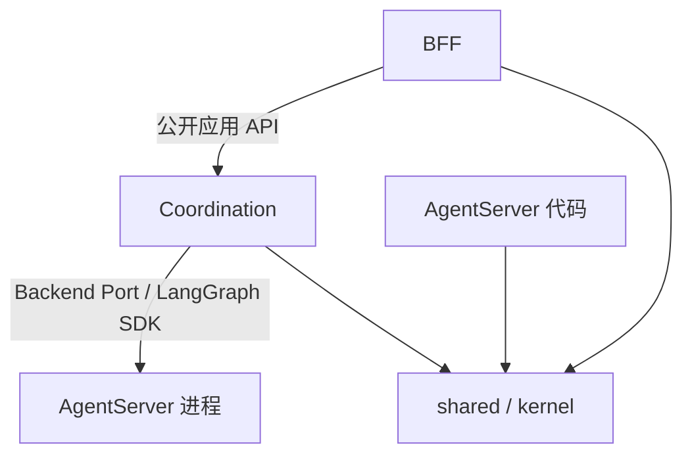

# FinanceClaw 包结构与依赖规则

Stage-8 开始前，代码已按 **BFF、Coordination、AgentServer** 三个职责包组织。
目前仍是一个 Python 分发包；BFF 进程内装配 Coordination 应用服务，AgentServer 独立运行。
独立 Coordinator Service、Webhook Ingress 和持续 Worker 属于 Stage-8 后续交付。

## 目录与职责

```text
financeclaw/
├─ bff/
│  ├─ http/                    # 路由、认证、错误投影、SSE
│  ├─ channels/                # 飞书 WebSocket / Markdown 适配
│  ├─ application/             # 会话创建/读取、渠道交互与展示
│  └─ bootstrap.py             # HTTP、认证、Channel 的装配
├─ coordination/
│  ├─ application/             # 会话 Run 生命周期、目标解析、状态/流投影
│  ├─ execution/               # 持久化 start/resume 提交、回执与对账
│  ├─ delegation/              # 父子映射、上下文授权、派发与结果交付
│  ├─ interactions/            # 发布交互校验、用户决定与恢复
│  ├─ workflows/               # 工作流运行记录、审批和生命周期
│  ├─ backends/                # 出站 Port 及 LangGraph SDK 适配
│  ├─ api.py                   # BFF 可调用的公开应用入口与异常
│  └─ bootstrap.py             # 后端与协调服务装配
├─ agent_server/
│  ├─ agents/                  # AgentFactory、调用指令、离线模型
│  ├─ graphs/                  # LangGraph 图、节点、工作流与注册入口
│  ├─ tools/                   # 本地、MCP、记忆、交互与委派 Tool 实现
│  ├─ middleware/              # 治理、执行预算、上下文、制品与记忆中间件
│  ├─ context/                 # 模型上下文选择与预算组装
│  ├─ memory/                  # LangGraph Store 上的长期记忆策略与服务
│  ├─ domains/ziwei/           # 紫微用例、规范化、计算及 x-iztro 适配
│  ├─ llm/                    # ModelFactory
│  └─ bootstrap.py             # 模型、工具和执行图装配
├─ kernel/                     # 跨服务契约、发布类型、输入/输出 Schema
├─ shared/
│  ├─ releases/                # 唯一发布声明、工具治理、配置指纹
│  ├─ conversation/            # 永久 Journal、摘要、Manifest 及其持久化
│  ├─ execution_ledger/        # 执行快照、操作/预算/取消事实及共用表映射
│  ├─ artifacts/              # 制品元数据、内容读写及存储后端
│  ├─ audit/                  # 永久审计、同事务 Outbox 追加
│  ├─ outbox/                 # 事件外发、租约、重试和死信
│  └─ infrastructure/         # Settings、DB、统一 Alembic、安全和观测
├─ operations/                 # 运维 smoke、在线探针及数据命令
└─ evaluation/                 # 离线评测和发布门禁
```

`operations`、`evaluation` 是开发与运维支持包，不是新增运行服务。未实现的 Ingress、Worker、
通知模块不预建空壳；Stage-8 分别放入 `coordination/ingress`、`coordination/worker` 和
`bff/notifications`，具体细分随实现确定。

## 依赖边界



图中的 SDK 调用是进程通信，不是 Coordination 导入 AgentServer Python 实现。

| 调用方 | 允许的 FinanceClaw 依赖 |
|---|---|
| `kernel` | 仅 `kernel`；外部依赖限契约所需的 Pydantic 与标准库 |
| `shared` | `shared`、`kernel`，以及数据库/存储等适配依赖 |
| `agent_server` | 本包、`shared`、`kernel` |
| `coordination` | 本包、`shared`、`kernel`；应用用例依赖 backend Port |
| `bff` | 本包、`shared`、`kernel`、`coordination.api`；装配入口可调用 `coordination.bootstrap` |

不得通过包级聚合导出或相对导入绕过边界。`financeclaw/__init__.py` 和服务包的
`__init__.py` 不装配资源；只有显式调用 bootstrap 或加载正式 graph 注册入口才装配。

- BFF 的 `ConversationService` 拥有会话创建、绑定和读取，用显式注入的
  `ConversationRunService` 处理 Turn 提交、状态、恢复、取消和订阅。
- Coordination 拥有父子推进和用户决定；它读取静态发布目录，不构造 AgentFactory、BaseTool 或图。
- AgentServer 的 Tool 可发出 typed handoff；请求和结果契约位于 `kernel/delegation`，
  父子生命周期服务位于 `coordination/delegation`，执行侧不导入协调服务。
- `kernel` 中的 Agent/Model/Workflow 发布类型与领域输入/输出 Schema 是跨服务契约。
  领域计算、Prompt 组装、LangChain 消息操作和 Store 生命周期留在 AgentServer。
- `shared/releases` 是发布声明的唯一来源。`WorkflowRelease` 不含 graph，执行端的
  `WorkflowDefinition` 才绑定已编译图；协调端的 `ToolRelease` 不含可调用的 Tool。

## 同库与事务归属

BFF 与 Coordinator 暂时共用 `financeclaw_app`，沿用一个 Alembic 迁移序列。
AgentServer 框架的 checkpoint/store 数据库职责保持不变；FinanceClaw 执行中间件仍按既有行为访问
共享 Journal、执行账本、审计和制品，不复制这些业务事实。

| 事实 | 主要写入职责与共享原因 |
|---|---|
| 会话、消息、Turn、摘要、Manifest | BFF 创建/查询会话，Coordination 记录运行结果，执行端记录模型上下文 |
| 执行操作、授权快照、根预算、取消 | Coordination 准备/提交/观察，执行端校验身份并扣减预算 |
| Delegation、Workflow、Interaction | 生命周期仓储和用例归 Coordination；表映射在共享账本中供原子事务复用 |
| 制品 | 各执行路径共享；`ArtifactMetadataRow` 已归 `shared/artifacts/tables.py` |
| Audit / Outbox | 共用追加审计与事件外发实现，业务事实不能以投递状态替代 |
| 通知目标 / 事件 / 分片回执 | `shared/notifications` 保存同事务事实；BFF 通知模块负责格式、订阅和独立发送 |

委派交付与执行观察、交互决定与审批/恢复操作、Audit 与 Outbox 的原子提交继续保留。
共享表映射不代表允许任意跨表写入；新增写入须明确所属用例和事务边界。
分包本身未改变数据库。Stage-8A 新增七张协调表，Stage-8B 新增四张通知表，
当前迁移头为 `0010_stage8b`，继续使用同一业务 Session 和 Alembic 序列。

## 入口与兼容性

- BFF：`main.py` → `bff/bootstrap.py:create_default_app` → `bff/http/app.py:create_app`。
- Coordination 受理：`coordination/bootstrap.py:build_coordination`，由 BFF 显式装配。
- Coordinator Worker：`python -m financeclaw.coordination.worker`。
- 通知发送器：`python -m financeclaw.bff.notifications.worker`，无需 WebSocket 或 BFF app 实例。
- Webhook Ingress：`coordination/ingress/app.py:create_default_ingress`，独立 Uvicorn 工厂。
- AgentServer：`langgraph.json` / `langgraph.local.json` → `agent_server/graphs/server_graphs.py`。
- 迁移：`alembic.ini` → `shared/infrastructure/migrations`。
- 跨服务测试使用 `tests/support.py` 组合夹具；生产入口各自装配，不复用测试组合根。

旧 `interfaces`、`application`、`modules`、`orchestration`、`infrastructure` 和根
`bootstrap.py` 已删除，不保留导入转发壳。仓内导入、graph 配置、测试和打包资源已同步迁移；
外部 Python 调用者需要采用新路径。HTTP 路由、graph/assistant ID、Schema 和发布版本保持一致。

启用 Stage-8A 后，新 Conversation 根由 `CoordinatorAdmission` 受理、独立 Worker 推进，
GET／SSE 只读。默认关闭的兼容路径继续用于旧部署；开启后不自动接管旧根。
参见 [Stage-8 方案](../../.redesign/stages/Stage-8-Background-Run-Coordination-实施方案.md)
和 [Coordinator 运维说明](../operations/coordinator.md)。

依赖检查覆盖真实目录存在性、绝对/相对导入和聚合导出；独立进程测试验证冷导入及 BFF 装配不加载
执行端。发布一致性测试比较协调端与执行端的目录，并验证两者复用同一应用数据库 Session 工厂。

本轮改动与验证结果见[2026-09-08 分包记录](package-refactor-2026-09-08.md)。
