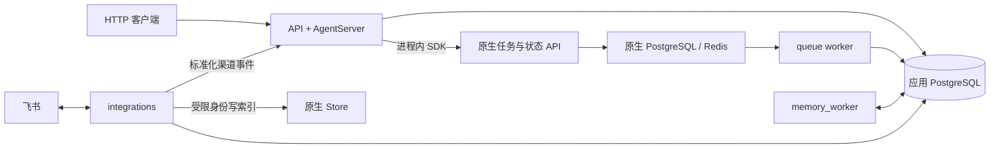

# 包结构与依赖边界

本文解释当前代码的职责划分。第一次阅读可从[开发上手](../development.md)进入，追踪具体功能见[请求调用链](request-lifecycle.md)。历史架构决策在[设计记录索引](../../.redesign/README.md)。

## 四种运行角色

[compose.yml](../../compose.yml) 使用同一应用镜像启动四种角色，迁移容器负责启动前的应用 schema 准备。

| 角色 | 负责什么 | 代码入口 |
| --- | --- | --- |
| `api` | 受理产品请求、记录任务命令、观察原生执行并提交业务结果；与 AgentServer 原生 API 共用 ASGI 进程 | [api/bootstrap.py](../../financeclaw/api/bootstrap.py) |
| `worker` | 使用 LangGraph 官方 queue worker 执行根图和内部子图 | [graphs/product.py](../../financeclaw/agent_server/graphs/product.py)、[镜像入口](../../deploy/entrypoint.sh) |
| `memory_worker` | 在回答链路之外提取、整合长期记忆，使用独立配置与有限权限数据库角色 | [memory_worker/bootstrap.py](../../financeclaw/memory_worker/bootstrap.py) |
| `integrations` | 飞书连接、通知投递、历史与记忆的 Store 索引维护 | [integrations/__main__.py](../../financeclaw/integrations/__main__.py) |

`worker` 指部署进程；文档和契约中的领域 Worker / Subagent 指根图内的子任务。它们不是两套图执行队列。API 的观察租约只决定谁核对任务进度，原生 queue worker 始终负责图执行。



核心业务客户端固定使用 `get_client(url=None, api_key=None)`；它只在 AgentServer 环境内使用进程内传输。Integrations 是独立进程，通过内部 HTTP 与受限服务身份调用 API / Store。代码中的 BFF 表示产品业务层职责，当前没有独立的 `financeclaw.bff` 包或 BFF 服务。

## 目录职责

```text
financeclaw/
├── api/
│   ├── bootstrap.py          自定义应用、角色生命周期与健康检查
│   ├── native_auth.py        原生资源鉴权与限定 Store 维护权限
│   ├── http/                 产品路由、认证、SSE、内部渠道入口
│   └── application/          Conversation、Turn、交互、技能表单与记忆用例
├── agent_server/
│   ├── graphs/               唯一公开根图与内部领域 Agent / Workflow
│   ├── agents/               AgentFactory、模型与中间件装配
│   ├── middleware/           工具治理、交互、调用预算与执行进度
│   ├── tools/                工具实现、MCP 传输和子图适配
│   ├── context/              预算、摘要、压缩与最终模型请求
│   ├── memory/               面向图执行的召回与 embedding 适配
│   ├── skills/               技能激活、资源读取与请求投影
│   └── domains/              确定性领域计算与适配器
├── memory_worker/            异步记忆提取、整合、租约、重放与维护
├── integrations/             飞书连接、通知消费者、历史与记忆索引器
├── shared/                   跨角色复用的持久化、配置与领域服务
└── kernel/                   不依赖服务实现的契约、值对象与策略模型
```

`shared/` 按持久事实和公共设施划分：

| 子包 | 负责的事实或设施 |
| --- | --- |
| `turns/` | 业务任务、不可变命令、交互、授权、调用预算、观察租约与状态投影 |
| `conversation/` | 会话、持久化 Journal、渠道绑定、模型输入清单与保留规则 |
| `memory/` | 长期记忆的 SQL 事实、来源、许可、版本、候选与隐私边界 |
| `artifacts/` | 大结果的完整存储、元数据、内容 hash 和结构化读取 |
| `notifications/`、`outbox/`、`audit/` | 持久投递意图、后台事件和审计记录 |
| `channels/` | 标准化渠道契约与卡片展示逻辑 |
| `skills/`、`mcp/` | 固定技能包、来源约束，以及 MCP 配置与工具契约 |
| `releases/` | 各角色共用的 Agent / Tool / Skill / Workflow 固定发布声明 |
| `llm/`、`infrastructure/` | 模型配置、token 计数、数据库、运行资源、网络策略与观测 |

仓库根的 `config/` 提供配置，`deploy/` 提供镜像与数据库准备，`scripts/` 提供部署和发布校验命令，`tests/` 提供回归，`experiments/` 保存需单独环境的探针。`docs/` 面向当前使用，`.redesign/` 保存设计和验证记录。

## 依赖方向

| 所在层 | 允许依赖 |
| --- | --- |
| `kernel` | `kernel` |
| `shared` | `shared`、`kernel` |
| `api`、`agent_server`、`integrations`、`memory_worker` | 自己所在的服务包、`shared`、`kernel` |

这里约束的是 `financeclaw` 内部包之间的依赖，不限制正常的第三方库导入。例如，API 可以使用共享发布目录核对任务版本，但不直接导入 AgentFactory 或领域引擎执行图；Integrations 通过内部接口提交渠道事件，不导入 API 业务用例。

[包架构测试](../../tests/stage5/test_package_architecture.py)检查绝对导入、相对导入和聚合导出，禁止通过换一种 import 写法绕过边界。

## 数据归属与常见术语

| 概念 | 含义 / 归属 | 阅读时注意 |
| --- | --- | --- |
| Conversation | 用户持有的业务会话，保存在应用库 | 对话历史不依赖某个原生 thread 一直存在 |
| Turn | 一次业务任务，以 `turn_id` 标识 | 人工恢复仍属于同一任务；一个会话同时只受理一个活动任务 |
| Command | 一次开始或恢复操作，以 `command_id` 标识 | 请求内容与发送身份固定，和可续期的观察租约分开 |
| Native run | LangGraph 原生执行，以核对后的 `native_run_id` 作为回执 | 原生结束提示还需结合 checkpoint 判断业务是否完成 |
| Interaction | 绑定任务、问题版本与原生中断的持久交互 | 用户回答应恢复该问题，不能用新任务代替 |
| Journal | 应用库中的持久化消息记录 | 最终输出由业务结果事务写入 |
| Checkpoint | LangGraph 的图状态和恢复位置 | 当前工作上下文由它持有，不承担会话归档职责 |
| Store | 原生检索存储 | 长期记忆事实在 SQL，Store 是可重建投影 |
| Artifact | 工具完整结果及其文件 / 对象存储 | 模型可以只读取需要的部分，访问仍受权限和来源约束 |
| Release snapshot | 任务受理时固定的版本、策略和执行上下文 | 避免执行或恢复时静默换成另一套能力 |

应用 Alembic 管理业务表；LangGraph 管理原生表。记忆事实、来源和遗忘状态以应用 SQL 为准，Store 写入或删除通过后台任务传播。流程细节见[请求调用链](request-lifecycle.md)，部署参数见[环境说明](../../config/environments/README.md)。
