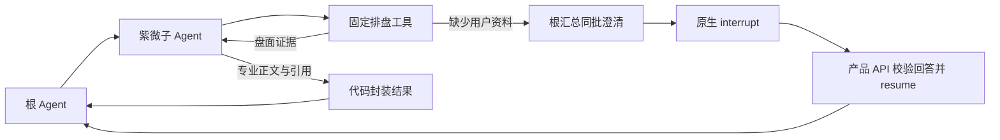

# 紫微 Subagent：启用、演示与排错

紫微能力由根 Agent 委派给 `ziwei_doushu_agent`：子 Agent 用五个固定工具取得确定性盘面，
再根据证据生成解读，最后把结果交回根 Agent。出生时间、历法和星曜事实由代码与排盘引擎处理。

当前代码默认关闭此能力，只允许在 development/test 环境启用；规则口径仍是待独立核验的候选版本。
演示和验证使用合成资料。先完成[本地完整链路](local-full-stack.md)和[模型配置](model-configuration.md)，
再按本页启用。Taibu 黄历/八字是另一组工具，见 [Taibu MCP](taibu-mcp.md)。

## 1. 安装并启用

所有命令在仓库根目录执行：

```bash
uv sync --frozen --extra dev --extra ziwei
.venv/bin/python -m pytest -q tests/stage7 tests/stage8_hotfix/test_ziwei_five_tools.py
```

`ziwei` extra 固定 `x-iztro==0.4.0`、`tzdata==2026.3`。当前 Dockerfile 已包含该 extra；
本地未安装时部分引擎测试会跳过，不能把跳过当作排盘验证通过。以下配置应由统一 API 和图 Worker
使用同一份环境与应用镜像；BFF 是统一 API 内的产品层，无需额外部署一个 BFF 服务。

```dotenv
FINANCECLAW_ENVIRONMENT=development
FINANCECLAW_ZIWEI_ENABLED=true
FINANCECLAW_ZIWEI_CONVENTION=x-iztro-civil-candidate@1.0.0
FINANCECLAW_ZIWEI_KEY_VERSION=1
FINANCECLAW_ZIWEI_PROJECTION_BYTES=14000
FINANCECLAW_DEBUG_FULL_IO=false
FINANCECLAW_LANGSMITH_HIDE_INPUTS=true
FINANCECLAW_LANGSMITH_HIDE_OUTPUTS=true
FINANCECLAW_OFFLINE_MODEL=false
```

另在未跟踪的本地环境文件或部署秘密配置中设置 `FINANCECLAW_ZIWEI_HMAC_KEY`，至少 32 字节。
API 和图 Worker 使用同一把密钥和版本；轮换时增加 key version，并先完成或取消旧运行，
不能在同一版本下静默换 key。缺少规则声明、依赖或密钥，以及在 staging/production 启用，都会阻止启动。

调用身份还需 `ziwei:read`，回读完整盘面需 `artifacts:read`。开发 API 在
`FINANCECLAW_API_SCOPES` 中追加，飞书身份在 `FINANCECLAW_FEISHU_SCOPES` 中追加，并保留已有权限。
开关只发布能力，不会自动授予用户权限。启用后根任务数据级别为 `confidential`，
外部 MCP 工具是否可用还取决于其数据策略，见 [MCP 手册](mcp.md)。

处理在途任务后，使用统一部署入口：

```bash
.venv/bin/python scripts/deploy.py
docker compose ps -a
curl --fail-with-body -sS http://127.0.0.1:8000/v1/health/ready
```

部署入口还会准备已启用的通用 MCP 定义，具体凭据要求见 MCP 手册。API 就绪仅证明运行前提满足，
还需执行下方合成演示来验证路由、工具、解读和渠道结果。

## 2. 最小演示

在已经接通的飞书单聊发送以下合成请求，或把同一文本作为普通 Turn 的 `message` 提交：

```text
/agent ziwei_doushu_agent 请只看一个合成样例的 2026 年 9 月 6 日日盘：女性，公历 2000 年 8 月 16 日，上海当地民用钟表时间 03:30。不要生成命理解读。
```

预期流程是根委派 → 紫微子 Agent 调用 `ziwei_daily_chart` → 返回盘面依据与引用 → 根组织回复。
请求专业解读时去掉“不要生成命理解读”；缺少历法、时辰或查询目标时应先询问资料。
真实模型仍可能误读自然语言，需要核对最终采用的参数与原请求。

模型填写的工具参数示例（它不是新增 REST API 的请求体）：

```json
{
  "question": "只看合成样例的日盘",
  "subject_label": "合成样例",
  "mode": "chart_only",
  "birth": {
    "calendar": "solar",
    "date": {"year": 2000, "month": 8, "day": 16},
    "time": {"kind": "clock", "clock": "03:30"},
    "time_basis": "civil",
    "place": {"name": "上海"},
    "sex_for_chart": "female"
  },
  "focus": "overall",
  "on_date": "2026-09-06"
}
```

`OfflineFinanceModel` 和 `OfflineZiweiModel` 只验证确定性协议与图执行，不能用于验收任意自然语言路由、
首次填参准确率或解读质量。真实演示需使用已配置的供应商模型。

## 3. 五个工具如何选择

| 工具 | 查询内容 | 出生资料之外的常用参数 |
| --- | --- | --- |
| `ziwei_natal_chart` | 本命 | 无查询日期 |
| `ziwei_decadal_chart` | 指定日期所在大限 | `on_date`；当前大限用 `day_offset: 0` |
| `ziwei_yearly_chart` | 流年 | 公历整年用 `year`；今年用 `year_offset: 0` |
| `ziwei_monthly_chart` | 流月 | 公历整月用 `year` + `month`；本月用 `month_offset: 0` |
| `ziwei_daily_chart` | 流日 | `on_date`；今天用 `day_offset: 0` |

每次流运查询只选一种日期表达：具体日期、年月、相对偏移或 `date_range.start/end`。
`end` 不含当天，单次最多 366 天、逐日最多 31 天、最多 32 段。每个工具返回目标层级及上层依据，
无需按五种盘逐个调用。大限工具按日期定位，不支持按“第 N 大限”索取完整十年日历。

相对日期以本次 Turn 固定的 `request_clock` 和查询时区为准，重试、恢复不会变成执行当天。
未填目标不会默认今天或今年；冲突日期和无关字段会被拒绝。本命不接受查询日期，流年不接受月份。

农历出生需明确 `is_leap_month`；只知道时辰可填 `time.kind=shichen`，例如 `shichen=yin`。
子时需区分 `zi_early/zi_late`。当前只支持民用时间；真太阳时返回 `unsupported`。
北京、上海、广州、深圳、成都、香港、台北可离线解析，其他地点需提供 IANA 时区。
跨时辰范围、夏令时缺口或重复时间必须澄清，不补造中午 12:00 或猜测性别。

## 4. 运行与恢复机制

当前根发布为 `finance_agent@1.8.0`，紫微子发布为 `ziwei_doushu_agent@2.2.0`。
`langgraph.json` 只注册顶层根，紫微作为内部子图运行，继承授权、预算与原生 checkpoint。
完成结果以工具回执交回根；根仍可继续其他工作，只有根完成后产品层才把最终回复写入 Journal。



子图接收 `task`、可选 `arguments`、本轮原始问题 `user_context`、已有 `clarifications` 和可信时间上下文。
根无需提前冻结完整出生参数。历史资料通过经过归属、版本和权限校验的 `context_refs` 提供，
仅接受工具实际返回的完整 `message:id@sha256` 或 `artifact:id@sha256`；不自动复制整段根历史。

资料缺失时工具聚合当前能确定的问题，子图返回 `needs_clarification`，不继续生成解读。
根等待当前并发批次的所有回执，保留成功结果，按对象/字段合并问题，再直接派发
`request_user__clarification` 触发原生中断；这一合并不额外调用模型。仅参数格式问题可基于已有信息修复一次，
重复错误返回 `unsupported`。

产品层登记 `pending_interactions`，用户应回答该交互以恢复原 Turn，不能用普通新 Turn 代替。
HTTP 回答使用交互返回的 revision，例如 `{"revision":1,"kind":"input","answer":{"text":"公历"}}`；
具体路由与状态见 [Turn 手册](turn-control.md)。飞书单聊只有一个待回答的文字资料交互时可直接回复，
也可使用 `/answer <交互ID> <版本> {"text":"公历"}`。审批、选择或多问题仍按各自交互契约处理。

紫微 `finalize` 只封装已有正文和 `charts_used`，不再请求模型，也不使用 JSON mode。
常规单次排盘解读可由子模型两次请求完成：选工具、读证据后回答；多工具、澄清或修复可能增加请求。
并发调用各自保留 Tool call ID、state、请求和证据，共享根运行预算和并发上限，不共享“当前命盘”。

## 5. 故障定位与数据边界

| 现象 | 处理方式 |
| --- | --- |
| 启动即拒绝启用 | 检查 development/test、候选规则、HMAC、extra 及完整 I/O 开关 |
| 看不到紫微入口 | 检查 `ZIWEI_ENABLED`、当前发布和调用身份的 `ziwei:read` |
| 反复询问出生资料 | 核对历法、时辰、时间口径、地点时区与性别是否真实明确；用原交互回答 |
| 日期未填或有冲突 | 明确指定目标，只保留一种日期表达；系统不会默认今天 |
| `ZIWEI_CONTEXT_BUDGET_EXCEEDED` | 缩小时间范围、主题或引用；不截断出生资料和证据来伪造成功 |
| 旧任务恢复时报发布冲突 | 检查 API/Worker 镜像和配置一致性；旧发布无法恢复时结束旧任务并新建 |
| 模型或工具往返 HTTP 400 | 检查[模型参数](model-configuration.md)及供应商兼容性，避免从旧检查点推断新版已生效 |

出生资料可能存在于原始消息、checkpoint 和完整 Artifact 中；系统不是零留存，也不因关闭开关自动删除数据。
本地排盘不调用外部命理或地理编码服务，但根模型和子模型仍可能接收相关资料。
隐藏 LangSmith 输入输出不等于模型供应商不接收输入。保留与删除操作见[数据主体请求](data-subject-requests.md)。

仅在 development/test 调试合成资料时，可显式设置 `FINANCECLAW_ZIWEI_ALLOW_FULL_IO=true` 以放行完整 I/O
的启动校验；该设置不会自动开启日志或 tracing。若另行关闭输入/输出隐藏，完整出生资料可能进入追踪系统。
Taibu 八字仍有自己的完整 I/O 限制，不受此紫微开关豁免。

关闭功能前先完成或取消当前发布的在途任务，再将 API/Worker 同步设为 `FINANCECLAW_ZIWEI_ENABLED=false`
并重新部署。开关影响发布指纹，旧 checkpoint 不会自动切换配置；根版本仍为 1.8.0，紫微入口被移除。

## 6. 验证与源码入口

除前面的领域/五工具测试外，图与澄清恢复回归可运行：

```bash
.venv/bin/python -m pytest -q tests/stage8_hotfix/test_production_subgraphs.py
```

这些测试覆盖确定性模型、图执行、参数校验、证据绑定和恢复协议。真实模型理解、独立排盘规则核验、
持久运行时的进程重启以及实际飞书卡片，需在对应环境单独验收。解释仅供传统文化参考。
历史设计见 [Stage 7 紫微设计](../../.redesign/stages/Stage-7-Ziwei-Domain-Agent-设计说明.md)。

| 入口 | 负责什么 |
| --- | --- |
| [领域模块导读](../../financeclaw/agent_server/domains/ziwei/README.md) | 从数据契约到确定性计算的阅读顺序 |
| [ziwei_agent.py](../../financeclaw/agent_server/graphs/ziwei_agent.py) | 子模型工具循环、失败收束、正文封装 |
| [tools/ziwei.py](../../financeclaw/agent_server/tools/ziwei.py) | 五个工具的输入、可信上下文与证据绑定 |
| [releases/ziwei.py](../../financeclaw/shared/releases/ziwei.py) | 子 Agent 版本、工具白名单、提示词与输出协议 |
| [settings.py](../../financeclaw/shared/infrastructure/settings.py) | 开关、环境和敏感数据配置校验 |
