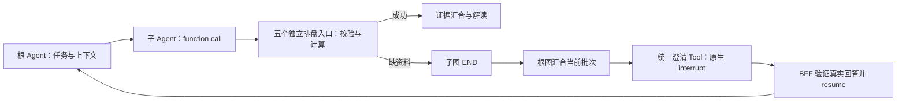

# 紫微 Agent：开发验证手册

当前是默认关闭的候选功能，只能在 development/test 使用合成资料验证；不是正式排盘服务。
领域边界见 [紫微设计](../../.redesign/stages/Stage-7-Ziwei-Domain-Agent-设计说明.md)。

## 安装与验证

```bash
uv sync --frozen --extra dev --extra ziwei
uv run --frozen --extra dev --extra ziwei pytest tests/stage7 -q
```

`ziwei` extra 固定 x-iztro 0.4.0 和 tzdata 2026.3。没有安装此 extra 时普通金融链路仍可启动，
引擎集成测试会跳过；必须确认 Stage 7 测试实际执行后再记录排盘验证通过。
若使用项目内 conda 环境，按根 README 设置 `UV_PROJECT_ENVIRONMENT`，不要混用两个解释器。

## 显式候选配置

仅在隔离的开发验证环境设置以下项，BFF 与 Agent Server 两边一致：

```dotenv
FINANCECLAW_ENVIRONMENT=development
FINANCECLAW_ZIWEI_ENABLED=true
FINANCECLAW_ZIWEI_CONVENTION=x-iztro-civil-candidate@1.0.0
FINANCECLAW_ZIWEI_KEY_VERSION=1
FINANCECLAW_ZIWEI_PROJECTION_BYTES=14000
FINANCECLAW_DEBUG_FULL_IO=false
FINANCECLAW_LANGSMITH_HIDE_INPUTS=true
FINANCECLAW_LANGSMITH_HIDE_OUTPUTS=true
```

另从 Secret Manager／未跟踪的本地秘密配置注入 `FINANCECLAW_ZIWEI_HMAC_KEY`，至少 32 字节；
不要复制测试 fixture 密钥，不要把密钥写入仓库。BFF 和 Agent Server 需使用同一把密钥和版本。
密钥轮换必须增加 key version，并保留旧配置供旧运行完成或先排空；不能在相同版本下静默换 key。

候选配置未明确、依赖不匹配、未显式放行的原文调试或环境为 staging/production 时启动会被拒绝。
设置隐藏 trace 不等于模型提供方不接收模型输入；真实资料接入仍需单独确认模型数据处理与用户告知。

开发/测试联调需要查看完整输入输出时，可在 BFF 与 Agent Server 两份环境文件中显式配置：

```dotenv
FINANCECLAW_ZIWEI_ALLOW_FULL_IO=true
FINANCECLAW_DEBUG_FULL_IO=true
FINANCECLAW_LANGSMITH_HIDE_INPUTS=false
FINANCECLAW_LANGSMITH_HIDE_OUTPUTS=false
LANGSMITH_HIDE_INPUTS=false
LANGSMITH_HIDE_OUTPUTS=false
```

`ZIWEI_ALLOW_FULL_IO` 默认 false，只放行这项启动校验，不自动修改日志、隐藏或追踪开关。
完整 I/O 可能包含出生资料；启用 LangSmith tracing 时完整输入输出会发送到 LangSmith。
该开关仅允许 development/test；规则、密钥、权限和其他校验仍然有效。
配置变更后重启两侧服务；Docker Agent Server 需重新构建以包含支持该开关的代码。

本轮没有修改当前运行环境。基础启动方式见[根 README](../../README.md#运行)，
请使用隔离开发环境，不要直接开启真实出生资料测试。

## 入口、权限与发布

产品入口仍是创建 Conversation 和提交 message-only Turn；不增加直连排盘 REST API。
可信登录身份需明确获得 `ziwei:read`；读取 Artifact 另外需要 `artifacts:read`。
按既有机制配置开发 BFF scopes 或飞书白名单身份 scopes，保留原有合法权限，不使用 `*` 兜底。
本轮没有自动扩大任一用户的权限。

新建会话绑定 `finance_agent@1.5.0`。候选启用后，根可以使用
`call_agent__ziwei_doushu_agent` Tool 调用 `ziwei_doushu_agent@2.2.0` 内部子图。
`langgraph.json` 只注册顶层根，子图继承本次执行的权限、预算与 checkpoint；
完整文本解读通过 Tool 结果交回根 Agent，再由 BFF 写入 Journal。
业务库使用当前 `0001_initial`，候选能力不新增独立运行表。

子图入口接受自然语言 `task`、可选原始 `arguments` 提示、本次根任务固定的原问题 `user_context`，
以及 `clarifications` 中历次澄清的问题、真实回答和对应子任务。当前任务原问题由 BFF 的消息 ID
定位，原生恢复不会改成最后一条简短回答，也不会混入其他任务的澄清。
`time_context` 提供固定的 `request_clock` 和查询时区；它来自可信运行上下文，模型不能覆盖。
另可提供经归属、内容版本和权限校验的 `context_refs`。其他历史消息和制品通过显式引用提供，
不自动复制整段根历史。父 Agent 无需提前抽取或冻结完整出生参数。
子模型从五个独立排盘工具中选择，每个工具固定自己的层级，不再接受 `level` 或通用 `target`。
五个入口共用出生资料、主题与输出模式，各自仅暴露对应的日期参数；运行时参数由框架注入。
本命没有查询日期，不会因模型漏填或多填流运目标而触发冻结对象赋值错误。
图中不增加参数提取模型或领域预检节点。参数校验和规范化在同一次 Tool 调用内完成。

| 工具 | 用途 | 常用查询参数（出生资料之外） |
| --- | --- | --- |
| `ziwei_natal_chart` | 本命 | 无日期参数 |
| `ziwei_decadal_chart` | 大限 | `on_date` 定位所在大限；当前大限用 `day_offset: 0` |
| `ziwei_yearly_chart` | 流年 | `year` 查询公历整年；今年用 `year_offset: 0` |
| `ziwei_monthly_chart` | 流月 | `year`、`month` 查询公历整月；本月用 `month_offset: 0` |
| `ziwei_daily_chart` | 流日 | `on_date` 指定某日；今天用 `day_offset: 0` |

流运工具均可用 `on_date` 查询某日对应盘面，或用 `date_range.start/end` 查询连续区间。
具体日期、年月、相对偏移量、日期区间每次只选一种，冲突会按参数格式错误处理。
未提供目标不会默认今天／今年；本命拒绝日期字段，流年拒绝月份字段等无关参数。
计算核心仍共用不可变的内部 `ZiweiAnalysisRequest`，不原地修改请求或改变排盘规则。

从旧版升级时，先排空或取消在途任务，再同步部署 BFF 与 Agent Server（容器需重建镜像）。
子 Agent 版本、工具白名单和配置指纹已更新；旧 `2.1.0` 检查点不能直接按新接口恢复，
失败或取消的旧查询需重新发起。旧 `ziwei_chart` 不再注册；Artifact 的同名来源分类保留兼容。



Tool 一次返回当前能确定的全部缺失／无效资料，包括出生日期、时间歧义、地点时区和查询目标。
子图返回 `needs_clarification`、`missing_fields`、结构化 `issues` 和问题，
根图先等待当前并发批次的所有回执，保留成功结果，再直接派发一个 `request_user__clarification`，
由这个工具触发原生 `interrupt`。汇总与派发不消耗额外模型轮次，不能让主模型自行补造参数重试。
根 Agent 自己发现缺资料时，也调用同一澄清工具。BFF 将任务和 Turn 标记为 `interrupted`，
登记 `pending_interactions`，问题不会被误记为已经完成的最终答案。
用户回答后，由 BFF 按原始 interrupt ID 和 checkpoint 恢复同一根任务；后续子 Agent 接收原问题
及完整问题／回答记录，仅继续未完成工作。成功 Worker 的结果保留在根 checkpoint 中供复用。

输入型澄清沿用现有交互接口，回答形如 `{"revision":1,"kind":"input","answer":{"text":"公历"}}`。
实际 revision 取待回答交互，普通新 Turn 不能代替 resume。飞书单聊只有一个待回答的
`{"text": "..."}` 资料交互时，用户可直接回复“公历”“当地钟表时间”等文字，渠道层根据
当前单聊的持久交互记录绑定 ID 和 revision，再走相同的校验与 resume 流程，不创建新 Turn。
提示只展示问题与直接回复说明；原请求及旧回答重推不会被用于后续问题，重启 BFF 后仍可恢复。
过期问题会说明原因并给出取消当前任务的命令。其他结构化输入、多问题、选择和审批仍需明确
指定交互；兼容 `/answer <交互ID> <版本> {"text":"公历"}`，审批仍用 approve/reject 契约。
自然语言 `/agent` 的澄清回复可以继续原 Agent，显式 JSON 参数约束和审批权限检查仍然生效。
缺失用户事实时，在下一次模型调用之前结束 evidence，外层直接进入 `END`，跳过 `finalize`。
纯参数格式错误允许基于已有上下文修复一次；连续错误返回 `unsupported`，避免 ReAct 耗尽预算。
权限、取消和持久预算异常仍按原有机制失败。

同批次可并发调用多个紫微 Worker，例如分别查询本命盘与流年盘。并发资格从固定发布中的
只读叶子工具、无审批、无交互中断、无嵌套子图和无记忆写入约束推导，不是功能开关。
各调用使用独立的 Tool call ID、子图 state 与 checkpoint，仍共享根运行预算和资源并发上限。
同一子图内也可并发查询一个对象的不同层级或主题；每次 Tool 调用绑定自己的完整请求与投影，
避免共享“当前参数”导致覆盖，同一完整命盘的不同主题投影均可保留。
同一命盘的 Artifact 并发首次写入时复用相同元数据，本地文件以原子替换避免读取到半写内容。
含写操作、审批或交互中断的 Worker／Workflow 继续独占批次。
自然语言 `/agent ziwei_doushu_agent` 可拆成多个独立查询；显式 JSON 参数指令每批只允许一次调用，
真实澄清回答后可继续同一 Agent，仍须保持用户指定的 JSON 参数，通过上下文获得补充资料。

## 可选依赖与 CI

启用紫微的运行环境需通过 `uv sync --extra ziwei` 安装 `x-iztro` 和 `tzdata`，
并在 Agent Server 镜像中包含这些依赖。缺少依赖时，启动错误会提示安装方式。

CI 分别验证基础安装和 `--extra ziwei` 安装；普通子图测试不依赖排盘引擎，
紫微集成测试只在 extra 已安装时运行。紫微任务额外检查引擎依赖，并将可选依赖纳入安全审计。

## 请求示例

合成测试消息：

> /agent ziwei_doushu_agent 请只看一个合成样例的 2026 年 9 月 6 日日盘：女性，
> 公历 2000 年 8 月 16 日，上海当地民用钟表时间 03:30。不要生成命理解读。

子 Agent 依据上下文填写的 `ziwei_daily_chart` 参数示例（不是父入口必填项或新增 HTTP 请求体）：

```json
{
  "question": "只看合成样例的日盘",
  "subject_label": "合成样例",
  "mode": "chart_only",
  "birth": {
    "calendar": "solar",
    "date": {"year": 2000, "month": 8, "day": 16},
    "time": {"kind": "clock", "clock": "03:30"},
    "time_basis": "civil",
    "place": {"name": "上海"},
    "sex_for_chart": "female"
  },
  "focus": "overall",
  "on_date": "2026-09-06"
}
```

查本命改用 `ziwei_natal_chart` 并移除 `on_date`。查公历整年使用 `ziwei_yearly_chart` 的
`{"year":2026}`，查今年使用 `{"year_offset":0}`；查某月使用 `ziwei_monthly_chart` 的
`{"year":2026,"month":9}`，查本月使用 `{"month_offset":0}`。相对时间取可信 Turn 时钟和查询时区，
不是 Worker 执行日期；恢复前后保持同一时间基准，不需要另外调用时间工具。
明年为 `year_offset=1`，下月为 `month_offset=1`，明天为 `day_offset=1`。
`date_range` 的 `end` 不含当天；原有最多 366 天、逐日最多 31 天、最多 32 段的限制保持不变。

农历出生需 `calendar=lunar` 和明确 `is_leap_month`。只知道时辰时使用 `time.kind=shichen`，
例如 `shichen=yin`；“子时”仍需区分 `zi_early/zi_late`。不要补造 12:00 或猜测性别。

默认 `OfflineFinanceModel` 不是通用自然语言解析器，不能用它来验收上述任意消息的自动路由。
`tests/stage8_hotfix/test_production_subgraphs.py` 使用明确的根模型替身，运行真实根图和紫微子图；
`OfflineZiweiModel` 只用于闭环测试，生成带实际引用的测试文本，不代表真实解读质量。
回归测试覆盖真实图中的原问题与授权引用传递、完整 function call、聚合校验与并发澄清，
以及仅回复一个字段、连续补充、重建根图后的原生恢复、BFF 交互登记与最终 Journal 写入。
`tests/stage8_hotfix/test_ziwei_five_tools.py` 另覆盖五个入口的真实执行、固定层级与证据绑定、
无关字段和冲突日期拒绝、冻结请求不被修改、缺失目标不猜值，以及按固定时钟跨年解析相对时间。
紫微模型输入检查按 token 统计完整 Schema、任务和证据，采用配置中的输入预算减预留输出额度，超限仍拒绝，
不会截断出生资料、澄清回答或盘面来绕过预算。
真实模型的自然语言理解与首次填参准确率仍需单独联调；Schema 和提示词不能保证它不误读原文。
当前文本解读不使用 JSON mode。

## 当前限制与故障判断

- 当前 `openai:deepseek-*` 模型统一显式发送 `thinking.type=disabled`，包括根模型与紫微子模型。
  通用 ChatOpenAI 尚未完整回传 DeepSeek 的 `reasoning_content`；暂时关闭思考模式，避免工具往返／
  澄清恢复触发 HTTP 400。其他模型配置不变。部署此变更需重启 Agent Server；容器部署需重建镜像。
  该变更不会自动重试已经失败的任务，也不会补回旧检查点中已丢失的推理字段。
- 仅民用时间；真太阳时明确返回 unsupported。
- 地名可离线识别北京、上海、广州、深圳、成都、香港、台北；其他地点要补 IANA 时区。
- 出生时间范围跨时辰、夏令时缺口／重复、资料缺失时先澄清，不生成猜测盘。
- 查询区间目前只有公历日／年月／日期范围，农历目标区间未实现。
- 工具一次返回目标层级及上层依据，不必按五种盘顺序调用。
- 大限工具用于日期定位，不支持按第 N 大限索取完整十年日历区间。
- 单次最多 366 天、逐日最多 31 天、分段最多 32；仍可能因事实体积超限而拒绝。
- `ZIWEI_CONTEXT_BUDGET_EXCEEDED` 应缩小时间或主题，不通过提高摘要截断阈值隐藏问题。
- 子图返回结构化 outcome；needs_clarification 由根图汇总并原生中断，回答后恢复同一任务。
- 规则仍待独立核验；解释只作传统文化参考，不能作为医疗、投资或其他重大决定依据。

## 隐私与回滚

出生资料不进入新增长期档案或紫微 Memory；但原始会话、子图 checkpoint 和完整事实 Artifact
仍会按项目现有策略保存。本实现不是零留存，也没有自动删除或改变 TTL。
本地排盘不调用外部命理服务／地理编码，但根和子模型可能接收相关资料。

根和 Worker按 confidential 分类处理；默认不开完整 I/O，trace 配置在 Agent Server 装配前生效。
不要通过共享 Tool 实例保存“当前用户命盘”，也不要把 Artifact ID 当成跨用户读取授权。

停止候选需先排空运行，随后两侧关闭 `FINANCECLAW_ZIWEI_ENABLED`。
关闭后普通金融请求继续使用根 1.5.0，紫微 Tool不再可见。开关变化会改变发布配置指纹，
不能用新配置恢复旧的在途任务；须先排空任务并同步重启 BFF 与 Agent Server。

本次澄清修复同样更新了根与紫微的 deployment revision，BFF 与 Agent Server 必须使用相同版本
并同步重启。升级前遗留的旧版本待回答任务不能直接恢复，应结束旧任务后重新发起测试。
